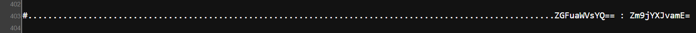

# extraviado

## Executive Summary
| Machine | Author | Category | Platform |
| :--- | :--- | :--- | :--- |
| extraviado | Hack_Viper | easy/facil | dockerlabs |

**Summary:** The extraviado machine was a credential-chaining challenge that required decoding base64 strings embedded in the web page, following a chain of hidden files across three user accounts, and solving a riddle to recover the root password. The default Apache landing page contained base64-encoded strings in its HTML source that decoded to `daniela` and `focaroja`, providing the first SSH credential pair. Once inside as `daniela`, a hidden directory `.secreto` contained a file `passdiego` whose content was another base64-encoded string, decoding to `ballenanegra`. This was used to switch to the `diego` user via `su`. As `diego`, a hidden file named `.-` inside `~/.local/share/` contained a riddle describing a blue bear, whose answer `osoazul` served as the root password. A final `su - root` completed the escalation to a full root shell.

---

## Reconnaissance

**1. Machine Deployment**

```bash
┌──(ouba㉿CLIENT-DESKTOP)-[/tmp/dl/extraviado]
└─$ sudo bash auto_deploy.sh extraviado.tar   
[sudo] password for ouba: 

                            ##        .         
                      ## ## ##       ==         
                   ## ## ## ##      ===         
               /"""""""""""""""\___/ ===       
          ~~~ {~~ ~~~~ ~~~ ~~~~ ~~ ~ /  ===- ~~~
               \______ o          __/           
                 \    \        __/            
                  \____\______/               
                                          
  ___  ____ ____ _  _ ____ ____ _    ____ ___  ____   
  |  \ |  | |    |_/  |___ |__/ |    |__| |__] [__   
  |__/ |__| |___ | \_ |___ |  \ |___ |  | |__] ___]  
                                         
                                     

Estamos desplegando la máquina vulnerable, espere un momento.

Máquina desplegada, su dirección IP es --> 172.17.0.2

Presiona Ctrl+C cuando termines con la máquina para eliminarla
```

**2. Port Scan**

```bash
┌──(ouba㉿CLIENT-DESKTOP)-[/tmp/dl/extraviado]
└─$ nmap -sC -sV -p- -T4 $ip
Starting Nmap 7.99 ( https://nmap.org ) at 2026-07-30 19:29 +0700
Nmap scan report for gatekeeperhr.com (172.17.0.2)
Host is up (0.0000090s latency).
Not shown: 65533 closed tcp ports (reset)
PORT   STATE SERVICE VERSION
22/tcp open  ssh     OpenSSH 9.6p1 Ubuntu 3ubuntu13.5 (Ubuntu Linux; protocol 2.0)
| ssh-hostkey: 
|   256 cc:d2:9b:60:14:16:27:b3:b9:f8:79:10:df:a1:f3:24 (ECDSA)
|_  256 37:a2:b2:b2:26:f2:07:d1:83:7a:ff:98:8d:91:77:37 (ED25519)
80/tcp open  http    Apache httpd 2.4.58 ((Ubuntu))
|_http-server-header: Apache/2.4.58 (Ubuntu)
|_http-title: Apache2 Ubuntu Default Page: It works
MAC Address: 5E:F3:75:73:6D:7D (Unknown)
Service Info: OS: Linux; CPE: cpe:/o:linux:linux_kernel

Service detection performed. Please report any infectious results at https://nmap.org/submit/ .
Nmap done: 1 IP address (1 host up) scanned in 9.02 seconds
```

The scan revealed SSH on port 22 and Apache on port 80. The default Ubuntu Apache page was served, but manual inspection of the `index.html` source revealed hidden base64-encoded strings.

---

## Initial Access

### Credential Extraction from the Web Page

**3. Inspecting the Web Page Source**

The `index.html` source contained base64-encoded strings embedded within the page content, pointing toward valid credentials.



**4. Decoding the Base64 Credentials**

The two base64 strings were decoded on the attacker machine, yielding a username and password.

```bash
┌──(ouba㉿CLIENT-DESKTOP)-[/tmp/dl/extraviado]
└─$ echo 'ZGFuaWVsYQ==' | base64 -d                         
daniela                                                                                         
┌──(ouba㉿CLIENT-DESKTOP)-[/tmp/dl/extraviado]
└─$ echo 'Zm9jYXJvamE=' | base64 -d  
focaroja                                                                                         
```

The decoded credential pair was `daniela:focaroja`.

### SSH Access as daniela

**5. Logging in via SSH**

```bash
┌──(ouba㉿CLIENT-DESKTOP)-[/tmp/dl/extraviado]
└─$ ssh daniela@$ip      
The authenticity of host '172.17.0.2 (172.17.0.2)' can't be established.
ED25519 key fingerprint is: SHA256:+m+3lOrvpuNRPzkV7ZobI+TK6be0QFiuxBsmiIvgj+E
This key is not known by any other names.
Are you sure you want to continue connecting (yes/no/[fingerprint])? yes
Warning: Permanently added '172.17.0.2' (ED25519) to the list of known hosts.
daniela@172.17.0.2's password: 
Welcome to Ubuntu 24.04.1 LTS (GNU/Linux 6.18.33.2-microsoft-standard-WSL2 x86_64)

 * Documentation:  https://help.ubuntu.com
 * Management:     https://landscape.canonical.com
 * Support:        https://ubuntu.com/pro

This system has been minimized by removing packages and content that are
not required on a system that users do not log into.

To restore this content, you can run the 'unminimize' command.

The programs included with the Ubuntu system are free software;
the exact distribution terms for each program are described in the
individual files in /usr/share/doc/*/copyright.

Ubuntu comes with ABSOLUTELY NO WARRANTY, to the extent permitted by
applicable law.

daniela@dockerlabs:~$ id;whoami;hostname
uid=1002(daniela) gid=1002(daniela) groups=1002(daniela),100(users)
daniela
dockerlabs
daniela@dockerlabs:~$ ls -la
total 40
drwxr-x--- 1 daniela daniela 4096 Jul 30 06:31 .
drwxr-xr-x 1 root    root    4096 Jan  9  2025 ..
-rw-r--r-- 1 daniela daniela  220 Jan  9  2025 .bash_logout
-rw-r--r-- 1 daniela daniela 3771 Jan  9  2025 .bashrc
drwx------ 2 daniela daniela 4096 Jul 30 06:31 .cache
drwxrwxr-x 3 daniela daniela 4096 Jan  9  2025 .local
-rw-r--r-- 1 daniela daniela  807 Jan  9  2025 .profile
drwxrwxr-x 2 daniela daniela 4096 Jan  9  2025 .secreto
drwxrwxr-x 2 daniela daniela 4096 Jan  9  2025 Desktop
```

A foothold was established as `daniela`. The home directory contained a hidden `.secreto` directory, which was immediately investigated.

---

## Lateral Movement

### Extracting diego's Password from .secreto

**6. Reading the Base64-Encoded Password File**

The `.secreto` directory contained a file named `passdiego` whose content was a base64-encoded string. Decoding it revealed the password for the `diego` account.

```bash
daniela@dockerlabs:~$ cat .secreto/passdiego 
YmFsbGVuYW5lZ3Jh
daniela@dockerlabs:~$ which base64
/usr/bin/base64
daniela@dockerlabs:~$ cat .secreto/passdiego | base64 -d
ballenanegradaniela@dockerlabs:~$ 
```

The decoded password was `ballenanegra`.

**7. Switching to diego via su**

```bash
daniela@dockerlabs:~$ su - diego
Password: 
diego@dockerlabs:~$ id;whoami;hostname
uid=1001(diego) gid=1001(diego) groups=1001(diego),100(users)
diego
dockerlabs
```

Lateral movement to `diego` succeeded.

---

## Privilege Escalation

### Riddle-Based Root Password Discovery

**8. Finding the Hidden Root Password File**

As `diego`, a hidden file named `.-` was found inside `~/.local/share/`. It contained a riddle with the title "password de root" followed by a poem describing a blue bear.

```bash
diego@dockerlabs:~/.local/share$ cat ./.-


                                         


                                         


password de root

En un mundo de hielo, me muevo sin prisa,
con un pelaje que brilla, como la brisa.
No soy un rey, pero en cuentos soy fiel,
de un color inusual, como el cielo y el mar
tambien.
Soy amigo de los ni~nos, en historias de
ensue~no.
Quien soy, que en el frio encuentro mi due~no?
```

The riddle described a creature that moves without haste in a world of ice, with a shining coat, not a king but faithful in tales, of an unusual colour like the sky and the sea, friend to children in dream stories, that finds its owner in the cold. The answer to the riddle was `osoazul` (blue bear in Spanish).

**9. Escalating to Root**

```bash
diego@dockerlabs:~/.local/share$ su - root
Password: 
root@dockerlabs:~# id;whoami;hostname
uid=0(root) gid=0(root) groups=0(root)
root
dockerlabs
```

The password `osoazul` authenticated successfully and a full root shell was obtained.

---

## Attack Chain Summary
1. **Reconnaissance**: Nmap identified SSH on port 22 and Apache on port 80 serving the default Ubuntu page. Manual inspection of the `index.html` source revealed base64-encoded strings embedded in the page content.
2. **Vulnerability Discovery**: The two base64 strings were decoded: `ZGFuaWVsYQ==` resolved to `daniela` and `Zm9jYXJvamE=` resolved to `focaroja`, providing the first SSH credential pair.
3. **Exploitation**: SSH access was established as `daniela`. The home directory contained a hidden `.secreto` directory with a file `passdiego` holding another base64-encoded string. Decoding it with `base64 -d` yielded `ballenanegra`, the password for `diego`.
4. **Internal Enumeration**: Lateral movement to `diego` was achieved via `su`. Inside `~/.local/share/`, a hidden file named `.-` contained a Spanish riddle titled "password de root" describing a blue bear.
5. **Privilege Escalation**: The answer to the riddle, `osoazul`, was used as the root password with `su - root`, granting a full root shell.
